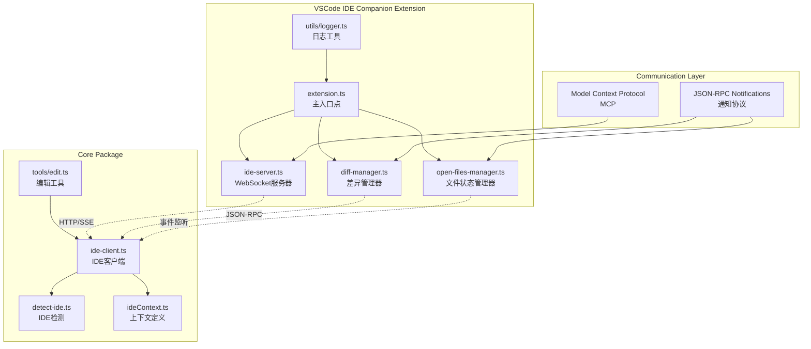
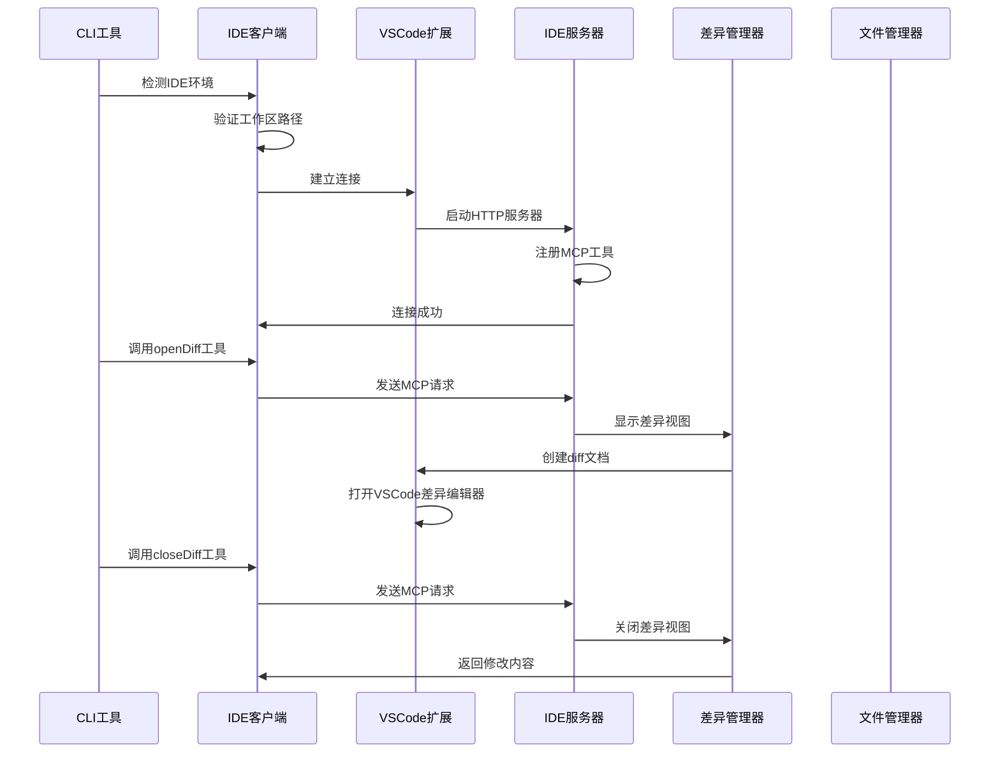
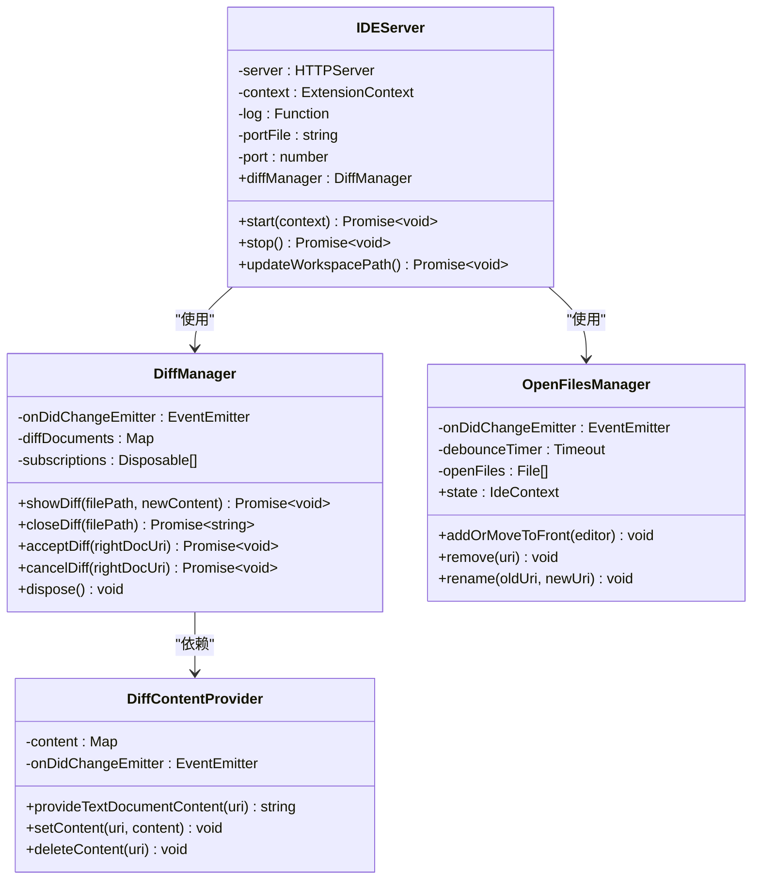
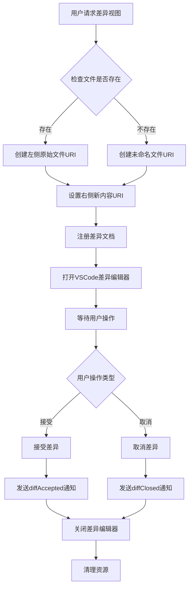
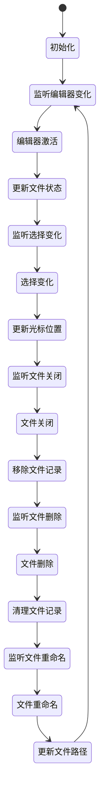
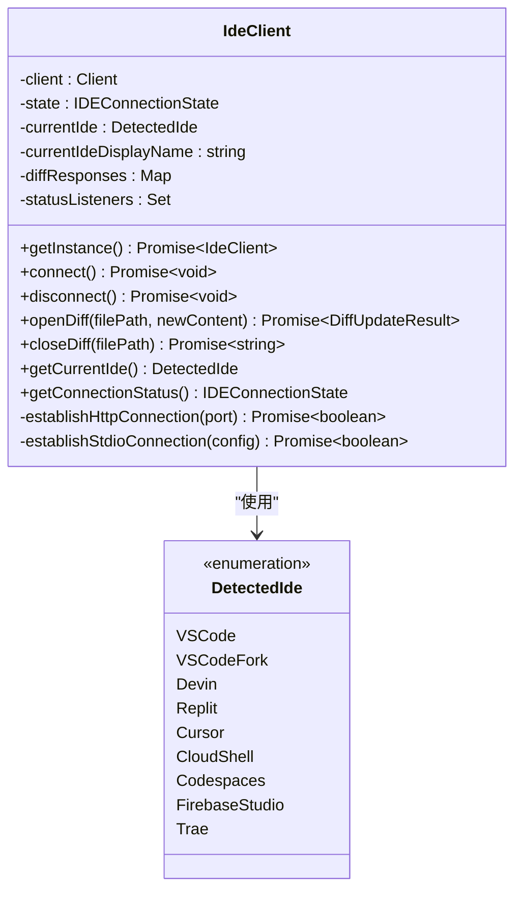
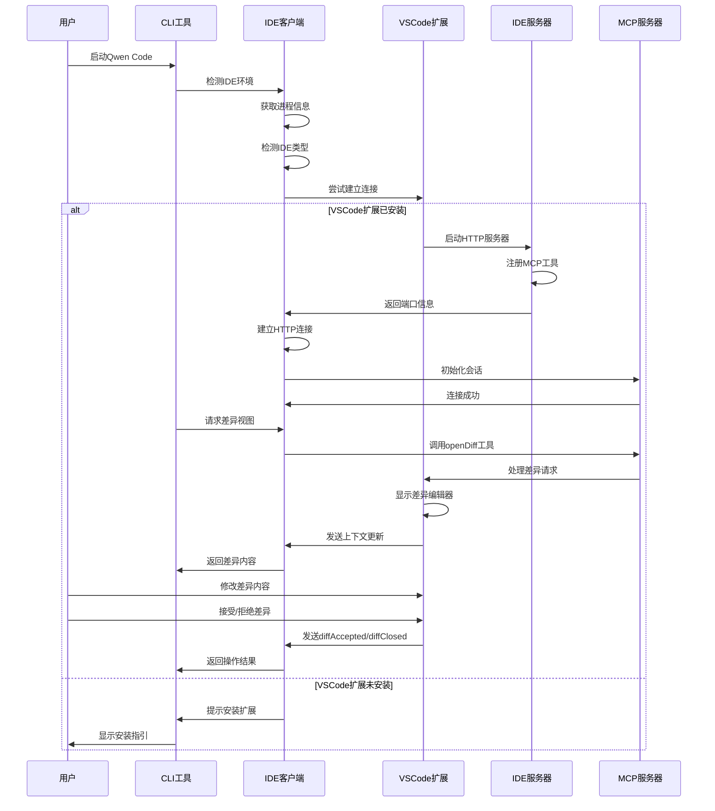

# IDE集成

<cite>
**本文档中引用的文件**
- [packages/vscode-ide-companion/src/extension.ts](file://packages/vscode-ide-companion/src/extension.ts)
- [packages/vscode-ide-companion/src/ide-server.ts](file://packages/vscode-ide-companion/src/ide-server.ts)
- [packages/vscode-ide-companion/src/diff-manager.ts](file://packages/vscode-ide-companion/src/diff-manager.ts)
- [packages/vscode-ide-companion/src/open-files-manager.ts](file://packages/vscode-ide-companion/src/open-files-manager.ts)
- [packages/core/src/ide/ide-client.ts](file://packages/core/src/ide/ide-client.ts)
- [packages/core/src/ide/detect-ide.ts](file://packages/core/src/ide/detect-ide.ts)
- [packages/core/src/tools/edit.ts](file://packages/core/src/tools/edit.ts)
- [packages/core/src/config/config.ts](file://packages/core/src/config/config.ts)
- [packages/vscode-ide-companion/package.json](file://packages/vscode-ide-companion/package.json)
- [packages/vscode-ide-companion/README.md](file://packages/vscode-ide-companion/README.md)
- [integration-tests/ide-client.test.ts](file://integration-tests/ide-client.test.ts)
</cite>

## 目录
1. [简介](#简介)
2. [项目结构](#项目结构)
3. [核心组件](#核心组件)
4. [架构概览](#架构概览)
5. [详细组件分析](#详细组件分析)
6. [通信协议](#通信协议)
7. [集成流程](#集成流程)
8. [安全性和权限控制](#安全性和权限控制)
9. [故障排除指南](#故障排除指南)
10. [结论](#结论)

## 简介

qwen-code项目提供了强大的IDE集成解决方案，通过vscode-ide-companion扩展实现了与VSCode等集成开发环境的双向通信。该系统允许CLI工具直接访问IDE的工作空间上下文，包括打开的文件、光标位置、选中文本以及原生的代码差异视图。

主要功能包括：
- **工作区上下文感知**：获取IDE中打开的文件列表和当前活动文件
- **选择上下文**：访问光标位置和选中文本
- **原生差异视图**：无缝查看、修改和接受Qwen Code建议的代码变更
- **文件同步**：实时同步IDE中的文件状态变化
- **多传输协议支持**：HTTP SSE和STDIO两种连接方式

## 项目结构



**图表来源**
- [packages/vscode-ide-companion/src/extension.ts](file://packages/vscode-ide-companion/src/extension.ts#L1-L124)
- [packages/vscode-ide-companion/src/ide-server.ts](file://packages/vscode-ide-companion/src/ide-server.ts#L1-L346)
- [packages/core/src/ide/ide-client.ts](file://packages/core/src/ide/ide-client.ts#L1-L550)

**章节来源**
- [packages/vscode-ide-companion/src/extension.ts](file://packages/vscode-ide-companion/src/extension.ts#L1-L124)
- [packages/core/src/ide/ide-client.ts](file://packages/core/src/ide/ide-client.ts#L1-L550)

## 核心组件

### VSCode IDE Companion扩展

VSCode IDE Companion是一个专门的VSCode扩展，负责在IDE端创建和管理与CLI工具的通信桥梁。

#### 主要职责：
1. **WebSocket服务器创建**：启动HTTP服务器作为MCP传输层
2. **差异视图管理**：处理代码差异的显示、接受和拒绝
3. **文件状态同步**：监控并同步IDE中的文件状态变化
4. **用户界面集成**：提供命令面板和编辑器菜单集成

### IDE客户端

IDE客户端是CLI工具的核心组件，负责检测IDE环境并建立通信连接。

#### 主要功能：
1. **IDE环境检测**：自动识别运行环境（VSCode、VSCode分支等）
2. **连接管理**：支持HTTP SSE和STDIO两种连接方式
3. **上下文传递**：向IDE发送工作区上下文信息
4. **工具调用**：通过MCP协议调用IDE特定工具

**章节来源**
- [packages/vscode-ide-companion/src/extension.ts](file://packages/vscode-ide-companion/src/extension.ts#L20-L50)
- [packages/core/src/ide/ide-client.ts](file://packages/core/src/ide/ide-client.ts#L60-L120)

## 架构概览



**图表来源**
- [packages/core/src/ide/ide-client.ts](file://packages/core/src/ide/ide-client.ts#L120-L180)
- [packages/vscode-ide-companion/src/ide-server.ts](file://packages/vscode-ide-companion/src/ide-server.ts#L80-L150)

## 详细组件分析

### IDE服务器组件

IDE服务器是VSCode扩展的核心组件，负责创建WebSocket服务器并管理MCP协议通信。



**图表来源**
- [packages/vscode-ide-companion/src/ide-server.ts](file://packages/vscode-ide-companion/src/ide-server.ts#L60-L80)
- [packages/vscode-ide-companion/src/diff-manager.ts](file://packages/vscode-ide-companion/src/diff-manager.ts#L30-L60)
- [packages/vscode-ide-companion/src/open-files-manager.ts](file://packages/vscode-ide-companion/src/open-files-manager.ts#L15-L40)

#### IDE服务器启动流程

IDE服务器的启动过程包括以下关键步骤：

1. **环境变量设置**：配置端口和工作区路径环境变量
2. **MCP服务器初始化**：创建Model Context Protocol服务器
3. **传输层配置**：设置StreamableHTTPServerTransport
4. **工具注册**：注册openDiff和closeDiff工具
5. **HTTP服务器启动**：监听随机端口并写入端口文件

**章节来源**
- [packages/vscode-ide-companion/src/ide-server.ts](file://packages/vscode-ide-companion/src/ide-server.ts#L60-L120)

### 差异管理器组件

差异管理器负责处理代码差异的显示、修改和接受操作。



**图表来源**
- [packages/vscode-ide-companion/src/diff-manager.ts](file://packages/vscode-ide-companion/src/diff-manager.ts#L70-L120)

#### 差异视图生命周期

差异视图的完整生命周期包括以下阶段：

1. **创建阶段**：根据文件路径创建左右两侧的URI
2. **显示阶段**：使用VSCode的差异编辑器显示对比
3. **交互阶段**：用户可以修改右侧内容或接受/拒绝更改
4. **处理阶段**：根据用户操作发送相应的JSON-RPC通知
5. **清理阶段**：关闭编辑器并清理内存中的文档内容

**章节来源**
- [packages/vscode-ide-companion/src/diff-manager.ts](file://packages/vscode-ide-companion/src/diff-manager.ts#L70-L150)

### 文件状态管理器

文件状态管理器持续监控IDE中的文件状态变化，并及时更新上下文信息。



**图表来源**
- [packages/vscode-ide-companion/src/open-files-manager.ts](file://packages/vscode-ide-companion/src/open-files-manager.ts#L20-L50)

#### 文件状态同步机制

文件状态管理器通过多种事件监听器实现实时同步：

1. **编辑器变化监听**：跟踪活动编辑器的变化
2. **选择变化监听**：监控光标位置和选中文本
3. **文件关闭监听**：处理文件关闭事件
4. **文件删除监听**：响应文件删除操作
5. **文件重命名监听**：处理文件重命名事件

**章节来源**
- [packages/vscode-ide-companion/src/open-files-manager.ts](file://packages/vscode-ide-companion/src/open-files-manager.ts#L20-L80)

### IDE客户端组件

IDE客户端负责CLI工具端的IDE集成逻辑，包括环境检测、连接管理和工具调用。



**图表来源**
- [packages/core/src/ide/ide-client.ts](file://packages/core/src/ide/ide-client.ts#L60-L100)
- [packages/core/src/ide/detect-ide.ts](file://packages/core/src/ide/detect-ide.ts#L8-L20)

#### IDE检测机制

IDE客户端通过以下步骤检测和验证IDE环境：

1. **进程信息获取**：获取当前进程的PID和命令行信息
2. **环境变量检查**：检查特定的环境变量标识符
3. **命令行验证**：验证命令行是否包含VSCode相关关键字
4. **终端程序验证**：确认TERM_PROGRAM环境变量为vscode
5. **综合判断**：结合所有信息确定具体的IDE类型

**章节来源**
- [packages/core/src/ide/detect-ide.ts](file://packages/core/src/ide/detect-ide.ts#L90-L122)

## 通信协议

### Model Context Protocol (MCP)

qwen-code使用Model Context Protocol作为主要的通信协议，支持以下特性：

#### 协议特点：
- **基于JSON-RPC 2.0**：标准化的消息格式
- **流式传输**：支持HTTP Server-Sent Events
- **会话管理**：通过会话ID管理多个并发连接
- **工具注册**：动态注册和发现可用工具

#### 支持的工具：
1. **openDiff**：打开差异视图工具
   ```json
   {
     "name": "openDiff",
     "arguments": {
       "filePath": "/path/to/file",
       "newContent": "new content"
     }
   }
   ```

2. **closeDiff**：关闭差异视图工具
   ```json
   {
     "name": "closeDiff",
     "arguments": {
       "filePath": "/path/to/file"
     }
   }
   ```

### JSON-RPC通知协议

IDE服务器通过JSON-RPC 2.0协议发送通知给CLI工具：

#### 上下文更新通知：
```json
{
  "jsonrpc": "2.0",
  "method": "ide/contextUpdate",
  "params": {
    "workspaceState": {
      "openFiles": [
        {
          "path": "/path/to/file",
          "timestamp": 1234567890,
          "isActive": true,
          "cursor": {
            "line": 10,
            "character": 5
          },
          "selectedText": "selected text"
        }
      ]
    }
  }
}
```

#### 差异接受通知：
```json
{
  "jsonrpc": "2.0",
  "method": "ide/diffAccepted",
  "params": {
    "filePath": "/path/to/file",
    "content": "modified content"
  }
}
```

#### 差异关闭通知：
```json
{
  "jsonrpc": "2.0",
  "method": "ide/diffClosed",
  "params": {
    "filePath": "/path/to/file",
    "content": "modified content"
  }
}
```

**章节来源**
- [packages/vscode-ide-companion/src/ide-server.ts](file://packages/vscode-ide-companion/src/ide-server.ts#L280-L346)

## 集成流程

### 完整集成流程



**图表来源**
- [packages/core/src/ide/ide-client.ts](file://packages/core/src/ide/ide-client.ts#L120-L200)
- [packages/vscode-ide-companion/src/ide-server.ts](file://packages/vscode-ide-companion/src/ide-server.ts#L80-L150)

### 连接建立过程

IDE客户端尝试建立连接时遵循以下优先级顺序：

1. **配置文件读取**：首先尝试从端口文件读取配置
2. **环境变量检查**：检查QWEN_CODE_IDE_SERVER_PORT环境变量
3. **STDIO连接**：如果配置文件和环境变量都不可用，尝试STDIO连接
4. **错误处理**：如果所有连接方式都失败，返回连接错误

### 工具调用流程

当CLI工具需要调用IDE特定功能时：

1. **参数验证**：验证工具参数的有效性
2. **MCP请求构建**：构建符合JSON-RPC标准的请求
3. **异步调用**：通过MCP协议发送请求并等待响应
4. **结果处理**：解析响应并执行相应的业务逻辑

**章节来源**
- [packages/core/src/ide/ide-client.ts](file://packages/core/src/ide/ide-client.ts#L120-L200)
- [packages/core/src/tools/edit.ts](file://packages/core/src/tools/edit.ts#L400-L500)

## 安全性和权限控制

### 权限模型

qwen-code采用分层的安全模型来保护用户数据和系统安全：

#### 文件系统权限
- **工作区限制**：CLI工具只能访问指定工作区目录下的文件
- **路径验证**：严格验证文件路径的绝对性和有效性
- **相对路径阻止**：禁止使用相对路径进行文件操作

#### 连接安全性
- **本地连接优先**：默认只允许本地主机连接
- **容器环境适配**：在Docker环境中自动适配host.docker.internal
- **代理支持**：支持HTTP代理配置，但对localhost忽略代理设置

#### 访问控制
- **文件夹信任**：支持文件夹信任机制，限制特权模式的使用
- **批准模式**：提供多种批准模式（PLAN、DEFAULT、AUTO_EDIT、YOLO）
- **用户确认**：对于重要操作要求用户明确确认

### 数据保护

#### 敏感信息处理
- **日志过滤**：敏感内容在日志中会被适当过滤
- **临时文件清理**：自动清理临时端口文件
- **内存安全**：及时释放不再使用的资源

#### 通信加密
- **HTTPS支持**：支持HTTPS连接以确保通信安全
- **证书验证**：在生产环境中启用证书验证
- **密钥管理**：安全存储和管理认证凭据

**章节来源**
- [packages/core/src/ide/ide-client.ts](file://packages/core/src/ide/ide-client.ts#L280-L320)
- [packages/core/src/config/config.ts](file://packages/core/src/config/config.ts#L100-L200)

## 故障排除指南

### 常见问题及解决方案

#### 连接问题

**问题**：无法连接到IDE服务器
```
Failed to connect to IDE companion extension in VS Code
```

**解决方案**：
1. 确认VSCode扩展已正确安装
2. 检查扩展是否已启用
3. 验证工作区文件夹已打开
4. 查看输出面板中的详细错误信息

**问题**：端口冲突或权限问题
```
Failed to listen on port
```

**解决方案**：
1. 检查防火墙设置
2. 使用管理员权限运行VSCode
3. 更改端口配置（通过环境变量）

#### 功能问题

**问题**：差异视图不显示
```
No diff info found for URI
```

**解决方案**：
1. 确保文件路径正确且可访问
2. 检查文件编码格式
3. 验证文件大小是否超过限制（16KB）

**问题**：文件状态不同步
```
File state not updating
```

**解决方案**：
1. 重启VSCode扩展
2. 检查文件监听器是否正常工作
3. 验证文件权限设置

#### 性能问题

**问题**：响应延迟过高
```
Connection timeout
```

**解决方案**：
1. 检查网络连接质量
2. 减少同时打开的文件数量
3. 优化文件过滤规则

### 调试技巧

#### 启用调试模式
```bash
# 设置调试环境变量
export QWEN_CODE_DEBUG=true
# 或在VSCode中设置
QWEN_CODE_DEBUG=true qwen
```

#### 日志分析
- 查看VSCode输出面板中的Qwen Code日志
- 检查CLI工具的标准错误输出
- 分析临时文件中的端口配置信息

#### 网络诊断
```bash
# 检查端口监听状态
netstat -an | grep <port_number>

# 测试HTTP连接
curl -v http://localhost:<port>/mcp

# 检查代理设置
echo $HTTP_PROXY $HTTPS_PROXY $NO_PROXY
```

**章节来源**
- [integration-tests/ide-client.test.ts](file://integration-tests/ide-client.test.ts#L20-L50)

## 结论

qwen-code的IDE集成功系统提供了一个强大而灵活的框架，实现了CLI工具与VSCode等IDE的深度集成。通过vscode-ide-companion扩展和core包中的IDE客户端，系统能够：

### 主要优势

1. **无缝集成**：提供原生的VSCode体验，无需额外配置
2. **实时同步**：实时同步IDE状态和文件变化
3. **安全可靠**：采用多层安全机制保护用户数据
4. **扩展性强**：支持多种传输协议和工具扩展
5. **跨平台兼容**：支持Windows、macOS和Linux平台

### 技术亮点

- **双传输协议**：同时支持HTTP SSE和STDIO连接
- **智能检测**：自动识别和适配不同的IDE环境
- **事件驱动**：基于事件的文件状态管理
- **协议标准化**：使用MCP和JSON-RPC标准协议
- **错误恢复**：具备完善的错误处理和恢复机制

### 未来发展方向

1. **多IDE支持**：扩展支持更多IDE（IntelliJ IDEA、WebStorm等）
2. **增强功能**：添加更多IDE特定的功能（代码补全、重构等）
3. **性能优化**：进一步提升大项目场景下的性能表现
4. **云集成**：支持云端IDE环境的无缝集成
5. **插件生态**：建立更丰富的插件生态系统

这个集成系统为开发者提供了前所未有的开发效率提升，通过将AI辅助编程能力与熟悉的IDE环境完美结合，真正实现了智能化的代码编写体验。