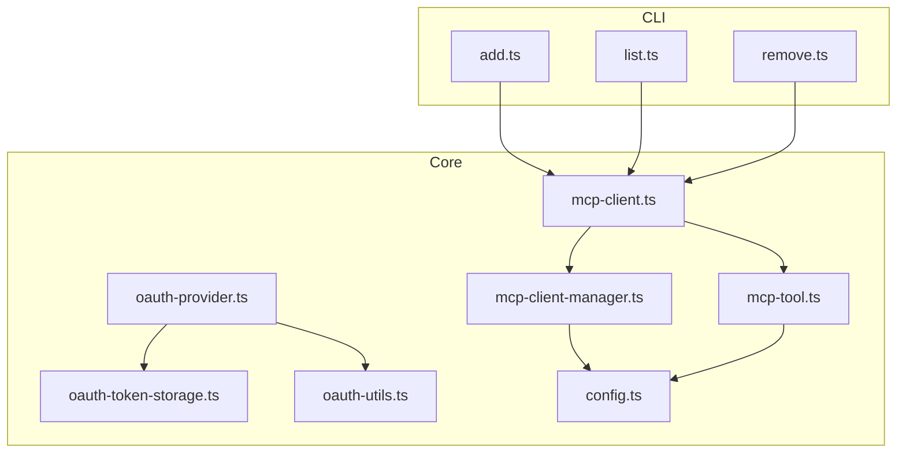
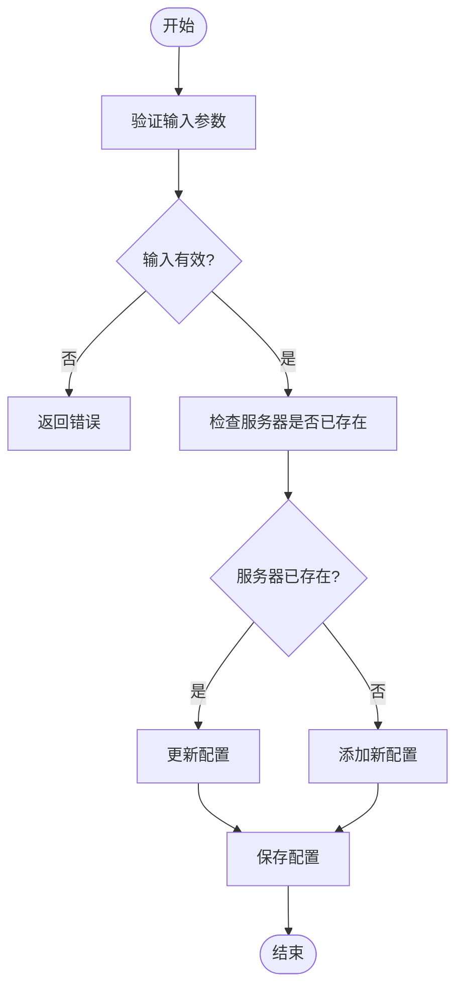
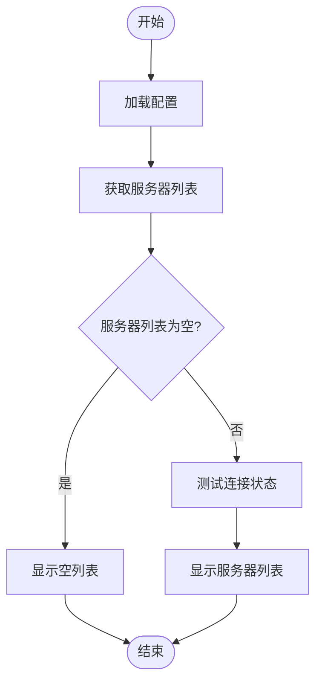
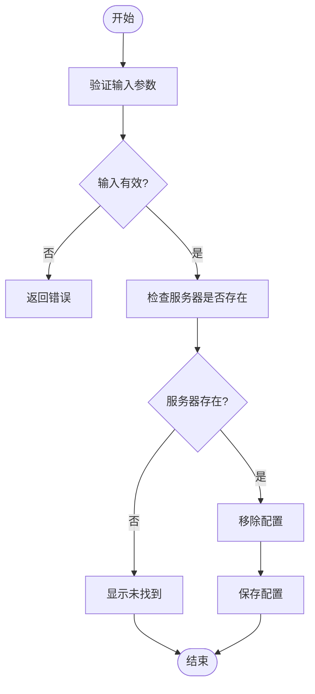
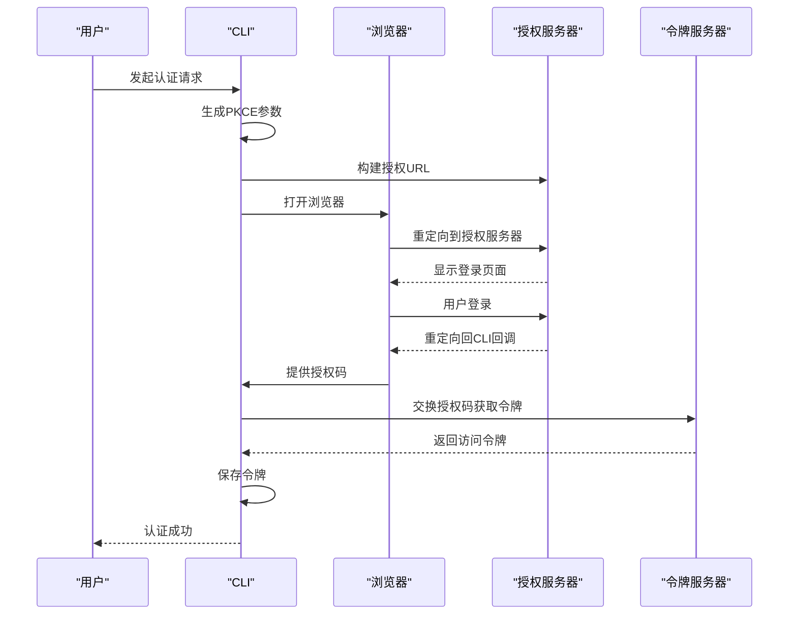
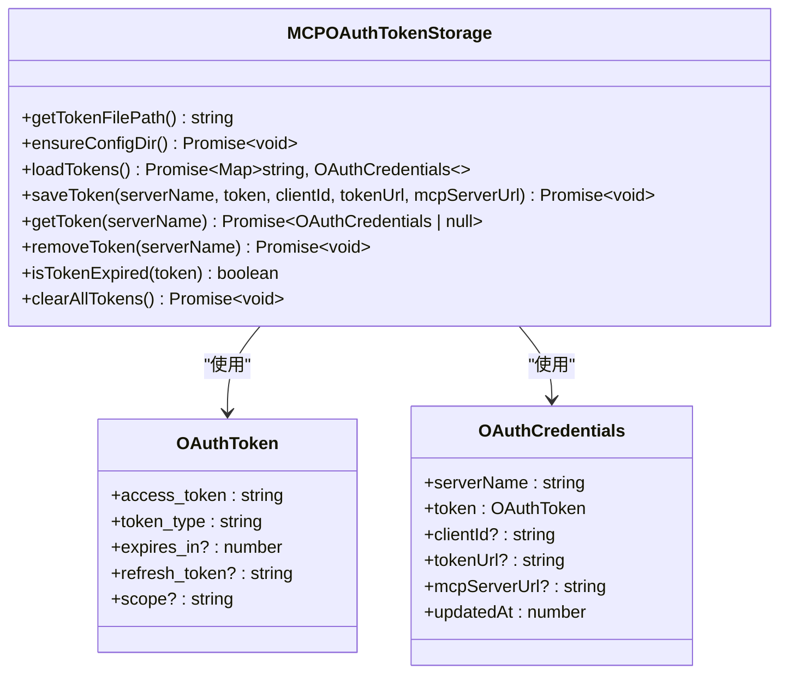
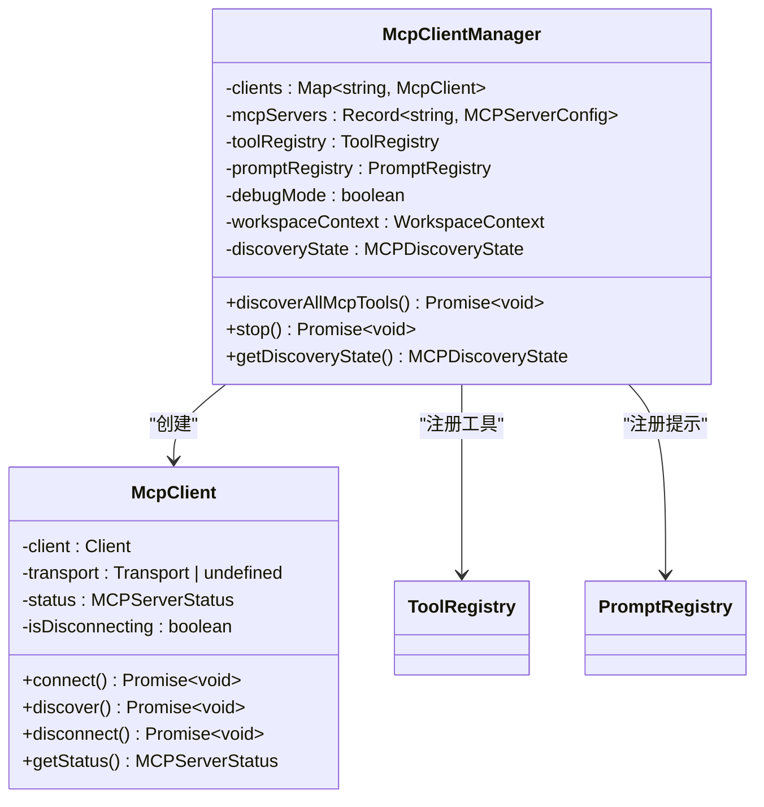
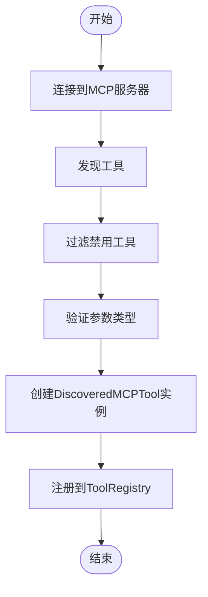

# MCP服务器集成

<cite>
**本文档中引用的文件**  
- [add.ts](file://packages/cli/src/commands/mcp/add.ts)
- [list.ts](file://packages/cli/src/commands/mcp/list.ts)
- [remove.ts](file://packages/cli/src/commands/mcp/remove.ts)
- [oauth-provider.ts](file://packages/core/src/mcp/oauth-provider.ts)
- [oauth-token-storage.ts](file://packages/core/src/mcp/oauth-token-storage.ts)
- [oauth-utils.ts](file://packages/core/src/mcp/oauth-utils.ts)
- [mcp-client.ts](file://packages/core/src/tools/mcp-client.ts)
- [mcp-client-manager.ts](file://packages/core/src/tools/mcp-client-manager.ts)
- [mcp-tool.ts](file://packages/core/src/tools/mcp-tool.ts)
- [config.ts](file://packages/core/src/config/config.ts)
- [test-mcp-server.ts](file://integration-tests/test-mcp-server.ts)
</cite>

## 目录
1. [简介](#简介)
2. [项目结构](#项目结构)
3. [MCP服务器管理](#mcp服务器管理)
4. [OAuth认证流程](#oauth认证流程)
5. [MCP客户端与服务器通信](#mcp客户端与服务器通信)
6. [API端点与JSON-RPC消息格式](#api端点与json-rpc消息格式)
7. [客户端集成示例](#客户端集成示例)
8. [安全考虑](#安全考虑)
9. [错误处理策略](#错误处理策略)
10. [结论](#结论)

## 简介
本文档详细介绍了MCP（Model Context Protocol）服务器集成的架构和实现。MCP协议允许主AI模型通过标准化的接口与远程服务器进行通信，执行各种工具和功能。文档涵盖了MCP服务器的添加、列出和移除操作，深入解析了OAuth认证流程的实现，包括令牌的获取、存储和刷新机制。同时，文档还说明了mcp-client如何与远程MCP服务器通信，以及mcp-tool如何将MCP功能暴露给主AI模型。

**Section sources**
- [add.ts](file://packages/cli/src/commands/mcp/add.ts)
- [list.ts](file://packages/cli/src/commands/mcp/list.ts)
- [remove.ts](file://packages/cli/src/commands/mcp/remove.ts)

## 项目结构
MCP服务器集成主要分布在`packages/cli`和`packages/core`两个包中。`packages/cli`包含用户命令行接口，用于管理MCP服务器的添加、列出和移除。`packages/core`包含核心功能实现，包括OAuth认证、客户端管理、工具注册等。



**Diagram sources **
- [add.ts](file://packages/cli/src/commands/mcp/add.ts)
- [list.ts](file://packages/cli/src/commands/mcp/list.ts)
- [remove.ts](file://packages/cli/src/commands/mcp/remove.ts)
- [oauth-provider.ts](file://packages/core/src/mcp/oauth-provider.ts)
- [oauth-token-storage.ts](file://packages/core/src/mcp/oauth-token-storage.ts)
- [oauth-utils.ts](file://packages/core/src/mcp/oauth-utils.ts)
- [mcp-client.ts](file://packages/core/src/tools/mcp-client.ts)
- [mcp-client-manager.ts](file://packages/core/src/tools/mcp-client-manager.ts)
- [mcp-tool.ts](file://packages/core/src/tools/mcp-tool.ts)
- [config.ts](file://packages/core/src/config/config.ts)

**Section sources**
- [add.ts](file://packages/cli/src/commands/mcp/add.ts)
- [list.ts](file://packages/cli/src/commands/mcp/list.ts)
- [remove.ts](file://packages/cli/src/commands/mcp/remove.ts)
- [oauth-provider.ts](file://packages/core/src/mcp/oauth-provider.ts)
- [oauth-token-storage.ts](file://packages/core/src/mcp/oauth-token-storage.ts)
- [oauth-utils.ts](file://packages/core/src/mcp/oauth-utils.ts)
- [mcp-client.ts](file://packages/core/src/tools/mcp-client.ts)
- [mcp-client-manager.ts](file://packages/core/src/tools/mcp-client-manager.ts)
- [mcp-tool.ts](file://packages/core/src/tools/mcp-tool.ts)
- [config.ts](file://packages/core/src/config/config.ts)

## MCP服务器管理
MCP服务器管理通过CLI命令实现，主要包括添加、列出和移除操作。这些操作允许用户配置和管理与远程MCP服务器的连接。

### 添加MCP服务器
`add`命令用于添加新的MCP服务器配置。用户需要指定服务器名称、命令或URL以及传输类型（stdio、sse、http）。配置信息将保存在用户或项目设置中。



**Diagram sources **
- [add.ts](file://packages/cli/src/commands/mcp/add.ts)

**Section sources**
- [add.ts](file://packages/cli/src/commands/mcp/add.ts)

### 列出MCP服务器
`list`命令用于列出所有已配置的MCP服务器。该命令会显示服务器名称、URL或命令以及连接状态（已连接、连接中、已断开）。



**Diagram sources **
- [list.ts](file://packages/cli/src/commands/mcp/list.ts)

**Section sources**
- [list.ts](file://packages/cli/src/commands/mcp/list.ts)

### 移除MCP服务器
`remove`命令用于移除已配置的MCP服务器。用户需要指定服务器名称和配置范围（用户或项目）。



**Diagram sources **
- [remove.ts](file://packages/cli/src/commands/mcp/remove.ts)

**Section sources**
- [remove.ts](file://packages/cli/src/commands/mcp/remove.ts)

## OAuth认证流程
MCP服务器的OAuth认证流程实现了完整的授权码流程，包括PKCE（Proof Key for Code Exchange）保护。该流程确保了用户凭据的安全性，并支持令牌的自动刷新。

### 认证流程实现
`MCPOAuthProvider`类负责处理OAuth认证。它支持动态客户端注册、OAuth配置发现、PKCE参数生成、授权URL构建、令牌交换和刷新。



**Diagram sources **
- [oauth-provider.ts](file://packages/core/src/mcp/oauth-provider.ts)

**Section sources**
- [oauth-provider.ts](file://packages/core/src/mcp/oauth-provider.ts)

### 令牌存储与管理
`MCPOAuthTokenStorage`类负责管理OAuth令牌的存储和检索。令牌以JSON格式存储在本地文件中，并设置了适当的文件权限以确保安全性。



**Diagram sources **
- [oauth-token-storage.ts](file://packages/core/src/mcp/oauth-token-storage.ts)

**Section sources**
- [oauth-token-storage.ts](file://packages/core/src/mcp/oauth-token-storage.ts)

## MCP客户端与服务器通信
MCP客户端通过标准化的传输协议与服务器通信。支持的传输类型包括stdio、SSE（Server-Sent Events）和HTTP流式传输。

### 客户端管理
`McpClientManager`类负责管理多个MCP客户端的生命周期，包括连接、工具发现和断开连接。



**Diagram sources **
- [mcp-client-manager.ts](file://packages/core/src/tools/mcp-client-manager.ts)
- [mcp-client.ts](file://packages/core/src/tools/mcp-client.ts)

**Section sources**
- [mcp-client-manager.ts](file://packages/core/src/tools/mcp-client-manager.ts)
- [mcp-client.ts](file://packages/core/src/tools/mcp-client.ts)

## API端点与JSON-RPC消息格式
MCP服务器通过标准化的API端点和JSON-RPC消息格式与客户端通信。这些端点遵循MCP协议规范，确保了不同实现之间的互操作性。

### API端点规范
MCP服务器支持以下主要API端点：

| 端点 | 方法 | 描述 |
|------|------|------|
| /mcp | POST | 处理MCP协议请求 |
| /sse | GET | SSE流式传输端点 |
| /prompts/list | POST | 列出可用提示 |
| /prompts/get | POST | 获取特定提示 |

### JSON-RPC消息格式
MCP协议使用JSON-RPC 2.0作为消息格式。请求和响应遵循标准的JSON-RPC结构。

```json
{
  "jsonrpc": "2.0",
  "method": "prompts/list",
  "params": {},
  "id": 1
}
```

```json
{
  "jsonrpc": "2.0",
  "result": {
    "prompts": [
      {
        "name": "example",
        "description": "An example prompt"
      }
    ]
  },
  "id": 1
}
```

**Section sources**
- [test-mcp-server.ts](file://integration-tests/test-mcp-server.ts)

## 客户端集成示例
以下示例展示了如何开发和注册新的MCP工具。

### 工具注册
`DiscoveredMCPTool`类负责将MCP服务器上的工具注册到本地工具注册表中。



**Diagram sources **
- [mcp-tool.ts](file://packages/core/src/tools/mcp-tool.ts)

**Section sources**
- [mcp-tool.ts](file://packages/core/src/tools/mcp-tool.ts)

## 安全考虑
MCP集成考虑了多个安全方面，包括令牌的安全存储、传输和认证失败处理。

### 令牌安全
- 令牌存储在本地文件中，文件权限设置为600（仅所有者可读写）
- 使用PKCE保护授权码流程，防止授权码拦截攻击
- 支持令牌自动刷新，减少用户重新认证的频率

### 认证失败处理
当认证失败或服务器不可用时，系统会：
- 记录详细的错误信息
- 向用户显示友好的错误消息
- 尝试使用备用认证方法（如动态客户端注册）
- 提供手动认证的选项

**Section sources**
- [oauth-provider.ts](file://packages/core/src/mcp/oauth-provider.ts)
- [oauth-token-storage.ts](file://packages/core/src/mcp/oauth-token-storage.ts)

## 错误处理策略
MCP集成实现了全面的错误处理策略，确保系统的稳定性和用户体验。

### 连接错误处理
- 超时处理：为所有网络请求设置合理的超时时间
- 重试机制：对临时性错误进行有限次数的重试
- 断线重连：在连接断开时尝试重新连接

### 认证错误处理
- 令牌过期：自动尝试刷新访问令牌
- 刷新失败：提示用户重新进行认证
- 动态注册失败：提供备用认证方法或手动配置选项

**Section sources**
- [mcp-client.ts](file://packages/core/src/tools/mcp-client.ts)
- [oauth-provider.ts](file://packages/core/src/mcp/oauth-provider.ts)

## 结论
本文档全面介绍了MCP服务器集成的架构和实现。通过标准化的命令行接口、安全的OAuth认证流程和灵活的客户端通信机制，MCP协议为AI模型与外部服务的集成提供了强大而安全的解决方案。文档涵盖了从服务器管理到安全考虑的各个方面，为开发者提供了完整的参考指南。