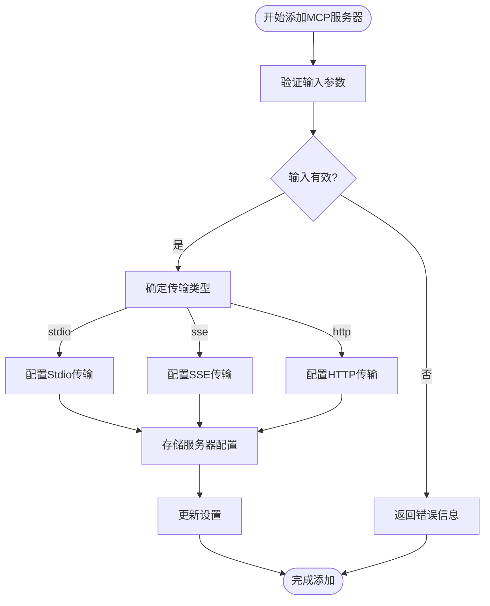
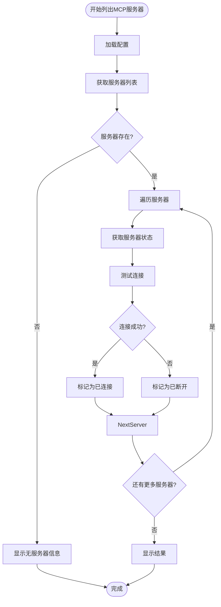
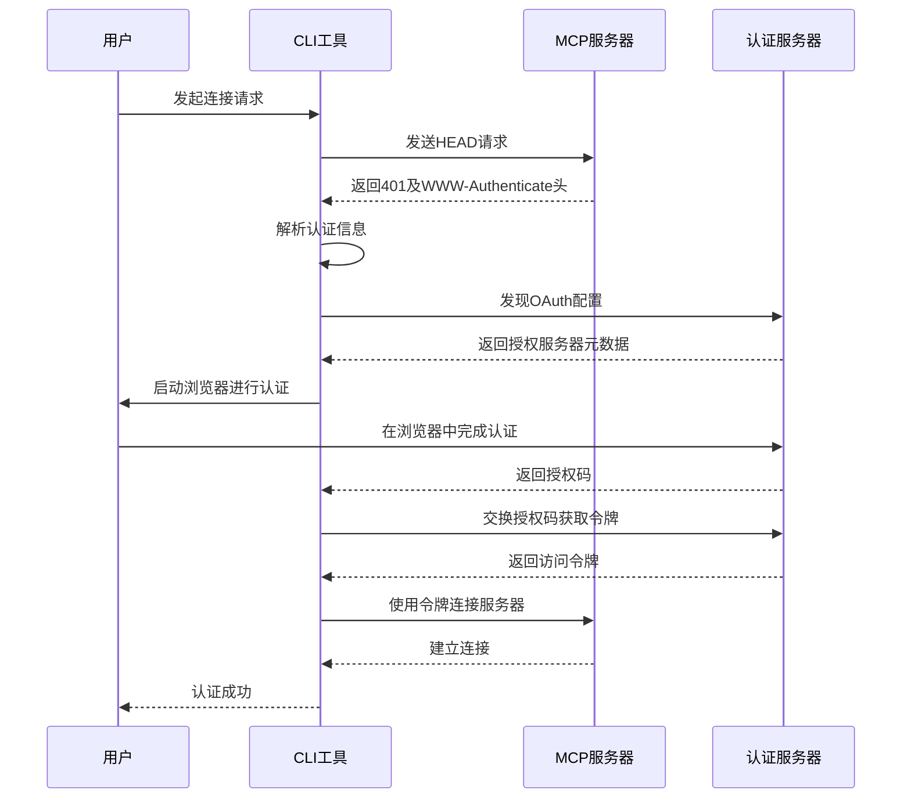
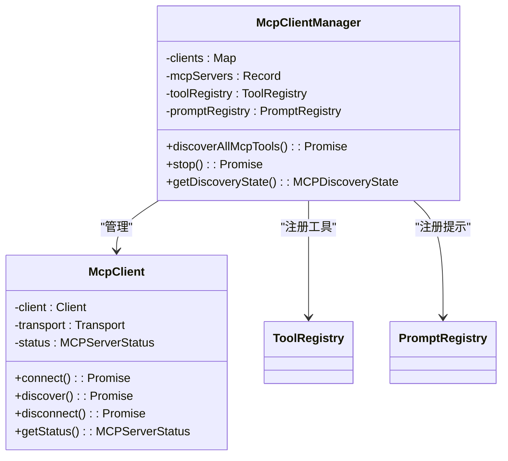
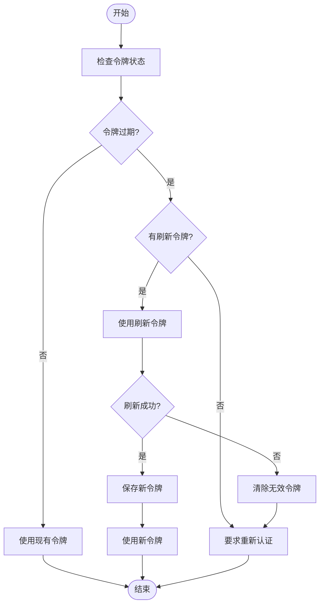

# MCP管理命令

<cite>
**本文档中引用的文件**  
- [add.ts](file://packages/cli/src/commands/mcp/add.ts)
- [list.ts](file://packages/cli/src/commands/mcp/list.ts)
- [remove.ts](file://packages/cli/src/commands/mcp/remove.ts)
- [oauth-provider.ts](file://packages/core/src/mcp/oauth-provider.ts)
- [oauth-token-storage.ts](file://packages/core/src/mcp/oauth-token-storage.ts)
- [mcp-client.ts](file://packages/core/src/tools/mcp-client.ts)
- [config.ts](file://packages/core/src/config/config.ts)
- [types.ts](file://packages/core/src/mcp/token-storage/types.ts)
</cite>

## 目录
1. [简介](#简介)
2. [MCP管理命令](#mcp管理命令)
3. [认证流程与配置存储](#认证流程与配置存储)
4. [连接验证过程](#连接验证过程)
5. [MCP客户端管理器](#mcp客户端管理器)
6. [令牌存储与刷新机制](#令牌存储与刷新机制)
7. [服务器集成最佳实践](#服务器集成最佳实践)
8. [连接故障排查指南](#连接故障排查指南)
9. [结论](#结论)

## 简介
MCP（Model Context Protocol）管理命令提供了一套完整的工具集，用于管理多个MCP服务器实例。本系统支持添加、移除和列出MCP服务器的命令，同时实现了复杂的认证流程、安全的令牌存储机制和自动化的连接验证。通过这些功能，用户可以高效地管理本地和远程的MCP服务器，确保安全可靠的通信。

## MCP管理命令

MCP管理命令系统提供了三个核心命令：`add`、`remove`和`list`，用于管理MCP服务器配置。这些命令允许用户在不同作用域（用户或项目）中添加、移除和查看MCP服务器配置。

### add命令
`add`命令用于向配置中添加新的MCP服务器。该命令支持多种传输类型（stdio、sse、http），并允许用户指定各种配置选项，如环境变量、HTTP头、超时设置等。服务器配置被存储在用户或项目级别的设置中，便于管理和共享。

**Diagram sources**
- [add.ts](file://packages/cli/src/commands/mcp/add.ts#L56-L124)

**Section sources**
- [add.ts](file://packages/cli/src/commands/mcp/add.ts#L1-L222)

### remove命令
`remove`命令用于从配置中移除指定的MCP服务器。该命令根据服务器名称和作用域查找并删除相应的配置。如果指定的服务器不存在，命令会输出相应的提示信息。

**Section sources**
- [remove.ts](file://packages/cli/src/commands/mcp/remove.ts#L1-L60)

### list命令
`list`命令用于列出所有已配置的MCP服务器。该命令不仅显示服务器的基本信息，还会通过实际连接测试验证每个服务器的状态（已连接、连接中、已断开）。这种主动验证机制确保了用户能够准确了解每个服务器的实时状态。

**Diagram sources**
- [list.ts](file://packages/cli/src/commands/mcp/list.ts#L50-L96)

**Section sources**
- [list.ts](file://packages/cli/src/commands/mcp/list.ts#L1-L136)

## 认证流程与配置存储

MCP系统的认证流程基于OAuth 2.0协议，支持动态客户端注册和自动发现机制。当用户尝试连接到需要认证的MCP服务器时，系统会自动检测认证要求并引导用户完成OAuth流程。

### 认证流程
认证流程从检测服务器的认证要求开始。系统首先检查服务器响应中的`WWW-Authenticate`头，如果存在，则解析其中的资源元数据URI。然后，系统使用该URI发现OAuth配置，包括授权服务器和令牌端点。如果无法通过头信息发现配置，系统会尝试从服务器的基本URL发现标准的well-known端点。

**Diagram sources**
- [oauth-provider.ts](file://packages/core/src/mcp/oauth-provider.ts#L305-L378)
- [mcp-client.ts](file://packages/core/src/tools/mcp-client.ts#L873-L896)

**Section sources**
- [oauth-provider.ts](file://packages/core/src/mcp/oauth-provider.ts#L1-L895)
- [oauth-utils.ts](file://packages/core/src/mcp/oauth-utils.ts#L1-L363)

### 配置存储机制
MCP服务器的配置存储采用分层结构，支持用户级别和项目级别的设置。配置信息包括服务器名称、传输类型、URL或命令、环境变量、HTTP头、超时设置等。这些配置被序列化为JSON格式并存储在相应的配置文件中，确保了配置的持久化和可移植性。

## 连接验证过程

MCP系统的连接验证过程是一个主动的、实时的验证机制。当用户使用`list`命令或系统需要连接到MCP服务器时，会执行以下验证步骤：

1. 根据服务器配置创建相应的传输实例（Stdio、SSE或HTTP）
2. 尝试使用创建的传输连接到服务器
3. 连接成功后，发送ping请求测试基本通信
4. 根据连接结果更新服务器状态

这种验证机制确保了用户能够准确了解每个MCP服务器的实际可用性，而不仅仅是配置的存在性。

**Section sources**
- [mcp-client.ts](file://packages/core/src/tools/mcp-client.ts#L50-L96)

## MCP客户端管理器

MCP客户端管理器负责管理多个MCP客户端的生命周期，包括启动、停止和工具发现。该管理器维护一个客户端映射，将服务器名称与相应的客户端实例关联起来。

### 连接池管理
客户端管理器实现了连接池管理功能，通过复用已建立的连接来提高性能和资源利用率。当需要与MCP服务器通信时，管理器首先检查是否存在已连接的客户端实例，如果存在则直接使用；否则创建新的连接。

### 会话保持机制
会话保持机制通过持续监控客户端状态来实现。管理器注册了状态变更监听器，当客户端状态发生变化时（如断开连接），会自动尝试重新连接或通知相关组件。这种机制确保了与MCP服务器的稳定通信，即使在网络波动的情况下也能保持会话的连续性。

**Diagram sources**
- [mcp-client-manager.ts](file://packages/core/src/tools/mcp-client-manager.ts#L1-L115)
- [mcp-client.ts](file://packages/core/src/tools/mcp-client.ts#L1-L1390)

**Section sources**
- [mcp-client-manager.ts](file://packages/core/src/tools/mcp-client-manager.ts#L1-L115)

## 令牌存储与刷新机制

MCP系统实现了安全的令牌存储和自动刷新机制，确保了长期的安全访问。

### 安全策略
令牌存储采用加密文件存储，文件权限设置为600（仅所有者可读写），防止其他用户访问。存储的令牌信息包括访问令牌、刷新令牌、过期时间、客户端ID和令牌URL等，所有信息都经过序列化后存储。

### 刷新机制
刷新机制在令牌即将过期时自动触发。系统首先检查令牌是否已过期（考虑5分钟的时钟偏差缓冲），如果已过期则使用刷新令牌获取新的访问令牌。刷新成功后，新令牌会被保存并用于后续请求；如果刷新失败，系统会清除无效令牌并要求用户重新认证。

**Diagram sources**
- [oauth-provider.ts](file://packages/core/src/mcp/oauth-provider.ts#L800-L895)
- [oauth-token-storage.ts](file://packages/core/src/mcp/oauth-token-storage.ts#L1-L181)

**Section sources**
- [oauth-token-storage.ts](file://packages/core/src/mcp/oauth-token-storage.ts#L1-L181)
- [types.ts](file://packages/core/src/mcp/token-storage/types.ts#L1-L37)

## 服务器集成最佳实践

### 端点配置
在配置MCP服务器端点时，建议使用明确的传输类型（stdio、sse、http）并提供完整的URL或命令路径。对于网络服务器，应确保URL包含正确的协议和端口信息。

### 认证方式选择
根据服务器的安全要求选择合适的认证方式。对于公共服务器，建议使用OAuth 2.0进行安全认证；对于本地开发服务器，可以使用简单的令牌认证或无需认证。

### 错误处理策略
实现健壮的错误处理策略，包括：
- 网络超时重试机制
- 认证失败的自动恢复
- 服务器不可用时的优雅降级
- 详细的错误日志记录

**Section sources**
- [config.ts](file://packages/core/src/config/config.ts#L1-L1070)

## 连接故障排查指南

### 网络超时
当遇到网络超时问题时，请检查：
- 服务器是否正在运行
- 网络连接是否正常
- 防火墙设置是否阻止了连接
- 服务器URL是否正确

### 认证失败
认证失败的常见原因和解决方案：
- **令牌过期**：使用`/mcp auth`命令重新认证
- **无效令牌**：清除存储的令牌并重新认证
- **权限不足**：检查用户权限和角色分配
- **配置错误**：验证OAuth配置的正确性

### 其他常见问题
- **服务器未响应**：检查服务器日志和运行状态
- **连接被拒绝**：验证服务器地址和端口是否正确
- **SSL/TLS错误**：检查证书配置和信任链
- **DNS解析失败**：验证域名解析是否正常

**Section sources**
- [mcp-client.ts](file://packages/core/src/tools/mcp-client.ts#L1212-L1259)

## 结论
MCP管理命令系统提供了一套完整、安全且易于使用的工具，用于管理MCP服务器实例。通过详细的认证流程、安全的令牌存储、自动化的连接验证和健壮的错误处理，该系统确保了与MCP服务器的可靠通信。遵循本文档中的最佳实践和故障排查指南，用户可以高效地管理和维护MCP服务器环境。