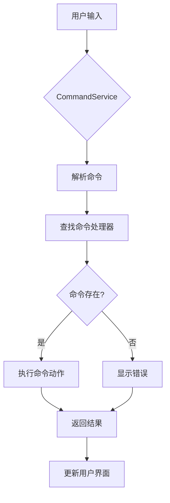
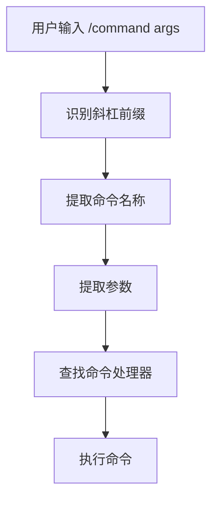

# 命令参考

<cite>
**本文档中引用的文件**  
- [helpCommand.ts](file://packages/cli/src/ui/commands/helpCommand.ts)
- [chatCommand.ts](file://packages/cli/src/ui/commands/chatCommand.ts)
- [mcpCommand.ts](file://packages/cli/src/ui/commands/mcpCommand.ts)
- [extensionsCommand.ts](file://packages/cli/src/ui/commands/extensionsCommand.ts)
- [bugCommand.ts](file://packages/cli/src/ui/commands/bugCommand.ts)
- [settingsCommand.ts](file://packages/cli/src/ui/commands/settingsCommand.ts)
- [toolsCommand.ts](file://packages/cli/src/ui/commands/toolsCommand.ts)
- [types.ts](file://packages/cli/src/ui/commands/types.ts)
- [CommandService.ts](file://packages/cli/src/services/CommandService.ts)
- [atFileProcessor.ts](file://packages/cli/src/services/prompt-processors/atFileProcessor.ts)
- [install.ts](file://packages/cli/src/commands/extensions/install.ts)
- [add.ts](file://packages/cli/src/commands/mcp/add.ts)
</cite>

## 目录
1. [简介](#简介)
2. [扩展管理命令](#扩展管理命令)
3. [MCP服务器管理命令](#mcp服务器管理命令)
4. [用户界面命令](#用户界面命令)
5. [命令执行流程](#命令执行流程)
6. [特殊语法命令](#特殊语法命令)
7. [最佳实践](#最佳实践)

## 简介
Qwen-Code 提供了一套全面的命令行界面（CLI）命令，用于与AI助手进行交互、管理扩展、配置MCP服务器以及控制用户界面。这些命令分为三大类：扩展管理命令、MCP服务器管理命令和用户界面命令。用户界面命令进一步分为斜杠命令（以/开头）和at命令（以@开头）。每个命令都有特定的语法格式、参数选项和使用场景。本文档系统性地列出了所有可用命令，并提供了详细的使用说明和示例。

**Section sources**
- [types.ts](file://packages/cli/src/ui/commands/types.ts#L1-L212)

## 扩展管理命令
扩展管理命令用于安装、启用、禁用和卸载Qwen-Code的扩展。这些命令通过CLI直接调用，允许用户自定义和扩展系统功能。

### 安装扩展
`install` 命令用于从Git仓库或本地路径安装扩展。

**语法格式**
```
gemini extensions install [--source | --path]
```

**参数选项**
- `--source`: 要安装的扩展的Git URL
- `--path`: 本地扩展目录的路径

**使用场景**
当您想添加新功能到Qwen-Code时，可以使用此命令从远程仓库或本地文件系统安装扩展。

**实际示例**
```bash
# 从Git仓库安装扩展
gemini extensions install --source https://github.com/example/qwen-extension.git

# 从本地路径安装扩展
gemini extensions install --path /path/to/local/extension
```

**Section sources**
- [install.ts](file://packages/cli/src/commands/extensions/install.ts#L1-L65)

### 启用扩展
`enable` 命令用于启用已安装但被禁用的扩展。

**语法格式**
```
gemini extensions enable <extension-name>
```

**参数选项**
- `<extension-name>`: 要启用的扩展名称

**使用场景**
当您之前禁用了某个扩展，现在想重新启用它时使用此命令。

### 禁用扩展
`disable` 命令用于禁用已安装的扩展。

**语法格式**
```
gemini extensions disable <extension-name>
```

**参数选项**
- `<extension-name>`: 要禁用的扩展名称

**使用场景**
当您想临时停用某个扩展的功能而不卸载它时使用此命令。

### 列出扩展
`list` 命令用于列出所有已安装的扩展及其状态。

**语法格式**
```
gemini extensions list
```

**使用场景**
当您想查看系统中所有可用扩展及其启用/禁用状态时使用此命令。

### 更新扩展
`update` 命令用于更新已安装的扩展到最新版本。

**语法格式**
```
gemini extensions update <extension-name>
```

**参数选项**
- `<extension-name>`: 要更新的扩展名称

**使用场景**
当扩展有新版本发布，您想获取最新功能和修复时使用此命令。

### 卸载扩展
`uninstall` 命令用于完全移除已安装的扩展。

**语法格式**
```
gemini extensions uninstall <extension-name>
```

**参数选项**
- `<extension-name>`: 要卸载的扩展名称

**使用场景**
当您不再需要某个扩展，想完全从系统中移除它时使用此命令。

## MCP服务器管理命令
MCP服务器管理命令用于配置和管理MCP（Model Control Protocol）服务器，这些服务器提供额外的工具和功能。

### 添加MCP服务器
`add` 命令用于向配置中添加新的MCP服务器。

**语法格式**
```
gemini mcp add <name> <commandOrUrl> [args...]
```

**参数选项**
- `<name>`: 服务器的名称
- `<commandOrUrl>`: 服务器命令（stdio传输）或URL（sse/http传输）
- `[args...]`: 传递给服务器命令的参数
- `--scope (-s)`: 配置范围（user或project），默认为project
- `--transport (-t)`: 传输类型（stdio, sse, http），默认为stdio
- `--env (-e)`: 设置环境变量（例如 -e KEY=value）
- `--header (-H)`: 为SSE和HTTP传输设置HTTP头
- `--timeout`: 设置连接超时（毫秒）
- `--trust`: 信任服务器（绕过所有工具调用确认提示）
- `--description`: 设置服务器描述
- `--include-tools`: 包含的工具列表（逗号分隔）
- `--exclude-tools`: 排除的工具列表（逗号分隔）

**使用场景**
当您想集成新的MCP服务器以扩展Qwen-Code的功能时使用此命令。

**实际示例**
```bash
# 添加本地MCP服务器
gemini mcp add my-server ./my-mcp-server.js --transport stdio

# 添加远程SSE服务器
gemini mcp add remote-server https://api.example.com/mcp --transport sse --header "Authorization: Bearer token123"

# 添加HTTP服务器并设置环境变量
gemini mcp add http-server http://localhost:8080 --transport http -e API_KEY=secret123 -e DEBUG=true
```

**Section sources**
- [add.ts](file://packages/cli/src/commands/mcp/add.ts#L1-L223)

### 列出MCP服务器
`list` 命令用于列出所有配置的MCP服务器及其状态。

**语法格式**
```
gemini mcp list
```

**使用场景**
当您想查看所有已配置的MCP服务器及其连接状态、工具数量等信息时使用此命令。

### 移除MCP服务器
`remove` 命令用于从配置中移除MCP服务器。

**语法格式**
```
gemini mcp remove <name>
```

**参数选项**
- `<name>`: 要移除的服务器名称

**使用场景**
当您不再需要某个MCP服务器，想从配置中移除它时使用此命令。

## 用户界面命令
用户界面命令是通过斜杠（/）前缀在交互式界面中调用的命令，用于控制Qwen-Code的用户界面和会话行为。

### 帮助命令
`/help` 命令用于显示帮助信息。

**语法格式**
```
/help
```
或
```
/?
```

**使用场景**
当您需要获取Qwen-Code的使用帮助时使用此命令。

**Section sources**
- [helpCommand.ts](file://packages/cli/src/ui/commands/helpCommand.ts#L1-L25)

### 聊天命令
`/chat` 命令用于管理聊天会话和保存的对话。

**语法格式**
```
/chat save <tag>
/chat resume <tag>
/chat list
```

**参数选项**
- `save <tag>`: 将当前对话保存为检查点，`<tag>`为标签名
- `resume <tag>`: 从指定标签的检查点恢复对话
- `list`: 列出所有保存的对话

**使用场景**
当您想保存当前工作进度或恢复之前的对话时使用此命令。

**实际示例**
```bash
# 保存当前对话
/chat save my-work-progress

# 恢复之前的对话
/chat resume my-work-progress

# 查看所有保存的对话
/chat list
```

**Section sources**
- [chatCommand.ts](file://packages/cli/src/ui/commands/chatCommand.ts#L1-L283)

### MCP状态命令
`/mcp` 命令用于查看MCP服务器的状态和信息。

**语法格式**
```
/mcp
/mcp status
/mcp list
```

**使用场景**
当您想检查MCP服务器的连接状态、可用工具数量等信息时使用此命令。

**Section sources**
- [mcpCommand.ts](file://packages/cli/src/ui/commands/mcpCommand.ts#L1-L532)

### 扩展命令
`/extensions` 命令用于列出当前激活的扩展。

**语法格式**
```
/extensions
```

**使用场景**
当您想查看当前会话中哪些扩展处于激活状态时使用此命令。

**实际示例**
```bash
/extensions
# 输出示例：
# Active extensions:
# 
#   - git-extension (v1.0.0)
#   - docker-extension (v1.2.0)
```

**Section sources**
- [extensionsCommand.ts](file://packages/cli/src/ui/commands/extensionsCommand.ts#L1-L47)

### Bug报告命令
`/bug` 命令用于提交Bug报告。

**语法格式**
```
/bug [description]
```

**参数选项**
- `[description]`: Bug的简要描述

**使用场景**
当您遇到问题并想向开发团队报告Bug时使用此命令。

**实际示例**
```bash
/bug 模型在处理大文件时崩溃
```

**Section sources**
- [bugCommand.ts](file://packages/cli/src/ui/commands/bugCommand.ts#L1-L93)

### 设置命令
`/settings` 命令用于查看和编辑Qwen-Code设置。

**语法格式**
```
/settings
```

**使用场景**
当您想修改Qwen-Code的配置选项时使用此命令。

**Section sources**
- [settingsCommand.ts](file://packages/cli/src/ui/commands/settingsCommand.ts#L1-L19)

### 工具命令
`/tools` 命令用于列出可用的Qwen-Code工具。

**语法格式**
```
/tools
/tools desc
/tools descriptions
```

**参数选项**
- 无参数：列出所有工具名称
- `desc` 或 `descriptions`：列出所有工具及其详细描述

**使用场景**
当您想了解Qwen-Code提供了哪些工具以及它们的功能时使用此命令。

**实际示例**
```bash
# 仅列出工具名称
/tools

# 列出工具及其描述
/tools desc
```

**Section sources**
- [toolsCommand.ts](file://packages/cli/src/ui/commands/toolsCommand.ts#L1-L72)

### 其他用户界面命令
Qwen-Code还提供了其他一些用户界面命令：

- `/auth`: 管理身份验证和API密钥
- `/clear`: 清除控制台输出
- `/model`: 选择和切换AI模型
- `/quit`: 退出Qwen-Code
- `/theme`: 更改界面主题
- `/vim`: 切换Vim模式

## 命令执行流程
Qwen-Code的命令执行遵循一个清晰的流程，从用户输入到最终执行。这个流程确保了命令的正确解析、处理和执行。

### 执行流程概述
1. 用户输入命令
2. CommandService接收输入
3. 解析命令和参数
4. 查找匹配的命令处理器
5. 执行命令动作
6. 返回结果给用户界面

### CommandService处理
CommandService是命令处理的核心服务，负责管理所有可用的命令。



**Diagram sources**
- [CommandService.ts](file://packages/cli/src/services/CommandService.ts#L1-L104)

**Section sources**
- [CommandService.ts](file://packages/cli/src/services/CommandService.ts#L1-L104)

## 特殊语法命令
Qwen-Code支持两种特殊语法的命令：斜杠命令和at命令，它们具有独特的解析和处理方式。

### 斜杠命令
斜杠命令是以`/`开头的命令，用于触发特定的功能。

**语法特点**
- 以`/`字符开始
- 命令名称紧跟在`/`后面
- 可选的参数跟随在命令名称后
- 不区分大小写

**处理流程**


### at命令
at命令使用`@`符号来引用文件或其他资源。

**语法特点**
- 使用`@{filename}`语法引用文件
- 可以在提示中嵌入多个文件引用
- 系统会自动将文件内容注入到提示中

**处理流程**
```mermaid
flowchart TD
A[用户输入包含 @{file.txt}] --> B[AtFileProcessor]
B --> C[解析@{}语法]
C --> D[读取文件内容]
D --> E{文件可读?}
E --> |是| F[注入文件内容]
E --> |否| G[显示错误并保留占位符]
F --> H[继续处理]
G --> H
```

**Diagram sources**
- [atFileProcessor.ts](file://packages/cli/src/services/prompt-processors/atFileProcessor.ts#L1-L97)

**Section sources**
- [atFileProcessor.ts](file://packages/cli/src/services/prompt-processors/atFileProcessor.ts#L1-L97)

## 最佳实践
为了更有效地使用Qwen-Code的命令，以下是一些推荐的最佳实践。

### 命令组合使用
可以将多个命令组合使用以提高工作效率。

**示例：调试工作流**
```bash
# 1. 检查MCP服务器状态
/mcp

# 2. 查看可用工具
/tools desc

# 3. 如果遇到问题，提交Bug报告
/bug 描述问题详情
```

### 扩展管理最佳实践
- 定期更新扩展以获取最新功能
- 只安装可信来源的扩展
- 使用`/extensions`命令定期检查激活的扩展

### 会话管理最佳实践
- 使用有意义的标签保存重要对话
- 定期使用`/chat list`检查保存的对话
- 在开始重要工作前使用`/chat save`保存当前状态

### MCP服务器配置最佳实践
- 为不同的环境配置不同的MCP服务器
- 使用`--trust`选项时要谨慎，只信任可靠的服务器
- 为敏感服务器设置适当的认证头