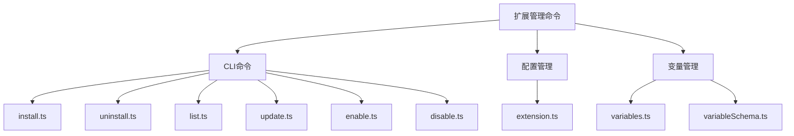
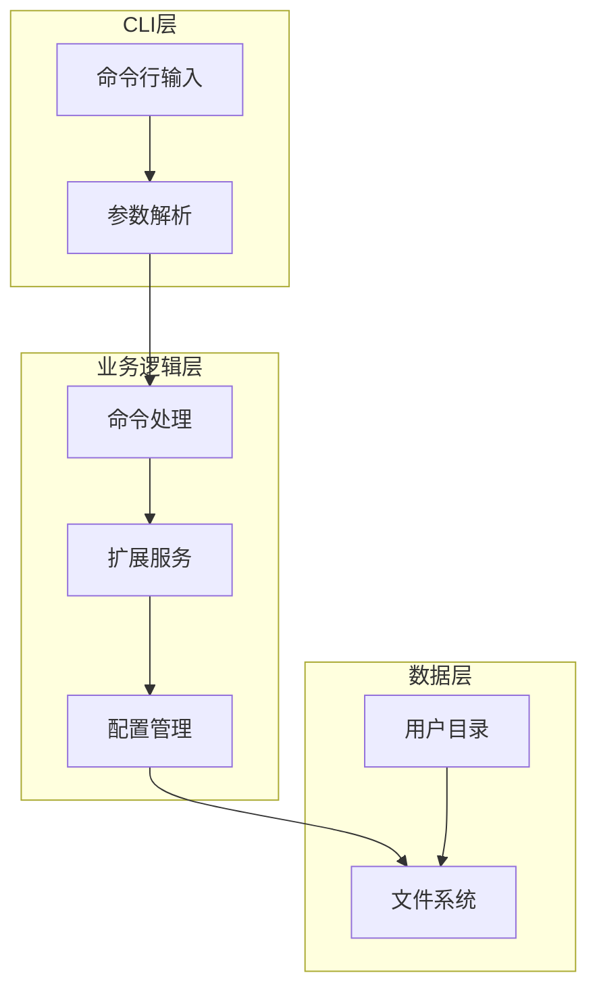
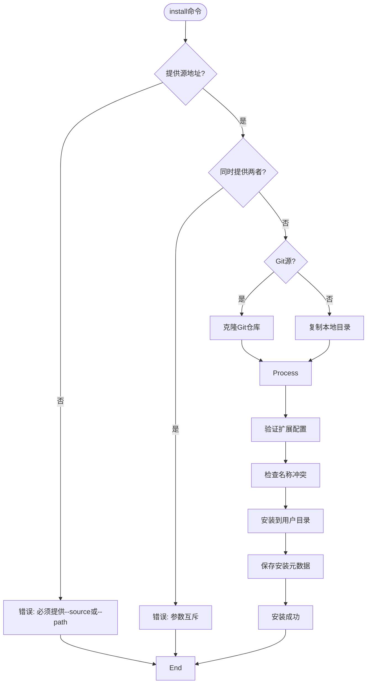
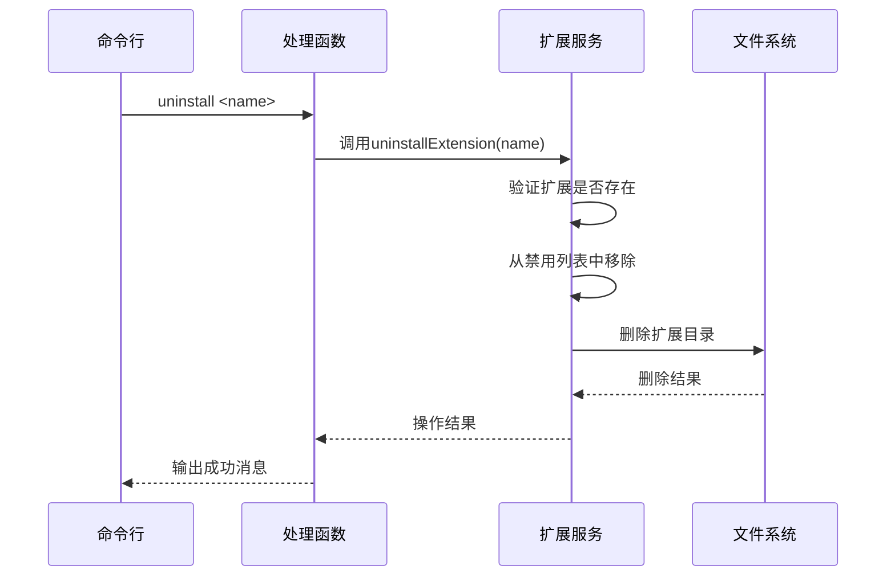
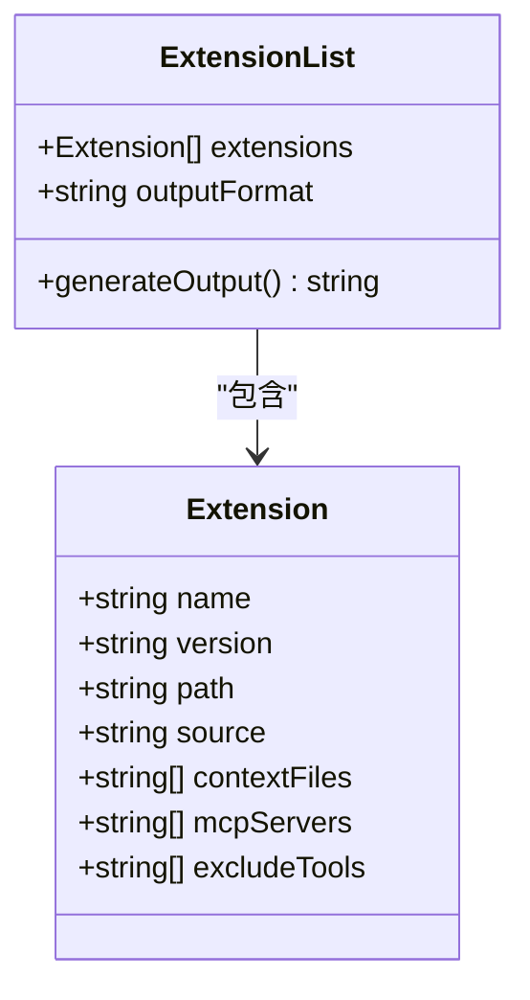
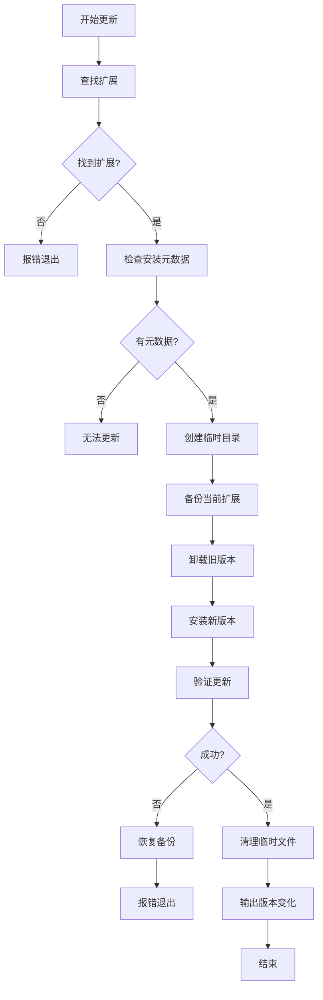
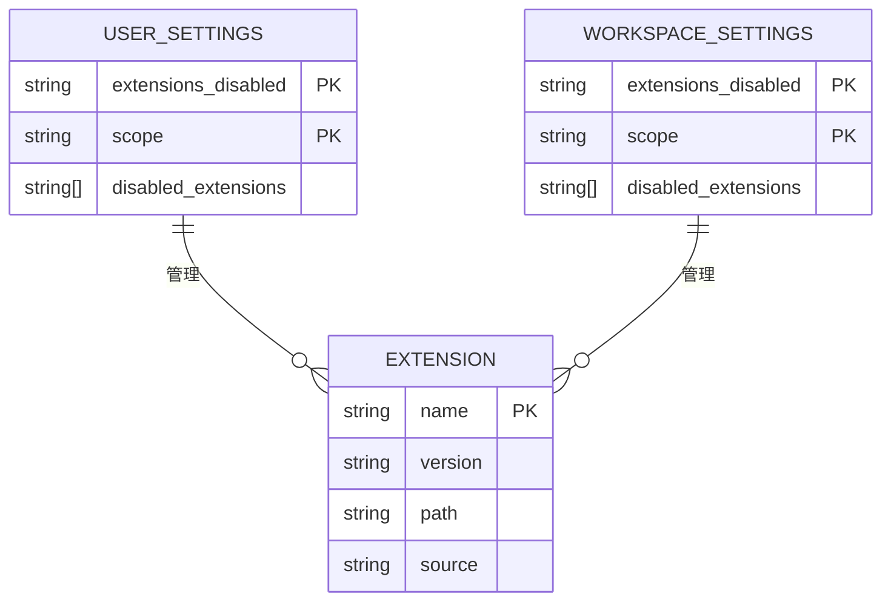

# 扩展管理命令

<cite>
**本文档中引用的文件**
- [extensions.tsx](file://packages/cli/src/commands/extensions.tsx)
- [install.ts](file://packages/cli/src/commands/extensions/install.ts)
- [uninstall.ts](file://packages/cli/src/commands/extensions/uninstall.ts)
- [list.ts](file://packages/cli/src/commands/extensions/list.ts)
- [update.ts](file://packages/cli/src/commands/extensions/update.ts)
- [enable.ts](file://packages/cli/src/commands/extensions/enable.ts)
- [disable.ts](file://packages/cli/src/commands/extensions/disable.ts)
- [extension.ts](file://packages/cli/src/config/extension.ts)
- [variables.ts](file://packages/cli/src/config/extensions/variables.ts)
- [variableSchema.ts](file://packages/cli/src/config/extensions/variableSchema.ts)
</cite>

## 目录
1. [简介](#简介)
2. [项目结构](#项目结构)
3. [核心组件](#核心组件)
4. [架构概述](#架构概述)
5. [详细组件分析](#详细组件分析)
6. [依赖分析](#依赖分析)
7. [性能考虑](#性能考虑)
8. [故障排除指南](#故障排除指南)
9. [结论](#结论)

## 简介
本文档详细介绍了Qwen Code的扩展管理命令系统，涵盖install、uninstall、enable、disable、update和list等核心命令。文档深入解析了扩展的安装流程、配置存储机制、变量管理实现以及冲突解决策略，为开发者和用户提供全面的扩展管理指导。

## 项目结构
Qwen Code的扩展管理功能主要位于`packages/cli/src/commands/extensions`目录下，包含各个扩展命令的实现文件。扩展配置和核心逻辑位于`packages/cli/src/config/extension.ts`文件中，变量管理功能则在`packages/cli/src/config/extensions/`目录下实现。



**Diagram sources**
- [extensions.tsx](file://packages/cli/src/commands/extensions.tsx)
- [extension.ts](file://packages/cli/src/config/extension.ts)

**Section sources**
- [extensions.tsx](file://packages/cli/src/commands/extensions.tsx)
- [extension.ts](file://packages/cli/src/config/extension.ts)

## 核心组件
扩展管理系统的核心组件包括命令处理模块、扩展存储模块和变量管理模块。这些组件协同工作，实现了扩展的全生命周期管理，从安装、启用到更新和卸载。

**Section sources**
- [extension.ts](file://packages/cli/src/config/extension.ts)
- [variables.ts](file://packages/cli/src/config/extensions/variables.ts)

## 架构概述
扩展管理系统的架构采用分层设计，上层为CLI命令接口，中层为业务逻辑处理，底层为文件系统操作。系统通过yargs框架解析命令行参数，调用相应的处理函数，最终操作用户主目录下的`.qwen/extensions`目录来管理扩展。



**Diagram sources**
- [extensions.tsx](file://packages/cli/src/commands/extensions.tsx)
- [extension.ts](file://packages/cli/src/config/extension.ts)

## 详细组件分析

### 安装命令分析
安装命令支持从Git仓库或本地路径安装扩展，通过`--source`或`--path`参数指定源位置。

#### 命令语法和参数


**Diagram sources**
- [install.ts](file://packages/cli/src/commands/extensions/install.ts)
- [extension.ts](file://packages/cli/src/config/extension.ts)

**Section sources**
- [install.ts](file://packages/cli/src/commands/extensions/install.ts)
- [extension.ts](file://packages/cli/src/config/extension.ts)

### 卸载命令分析
卸载命令用于移除已安装的扩展，通过扩展名称进行定位和删除。

#### 命令执行流程


**Diagram sources**
- [uninstall.ts](file://packages/cli/src/commands/extensions/uninstall.ts)
- [extension.ts](file://packages/cli/src/config/extension.ts)

### 列出命令分析
列出命令显示所有已安装的扩展及其详细信息。

#### 信息展示结构


**Diagram sources**
- [list.ts](file://packages/cli/src/commands/extensions/list.ts)
- [extension.ts](file://packages/cli/src/config/extension.ts)

### 更新命令分析
更新命令通过临时目录备份、卸载旧版本、安装新版本的流程实现扩展更新。

#### 更新流程图


**Diagram sources**
- [update.ts](file://packages/cli/src/commands/extensions/update.ts)
- [extension.ts](file://packages/cli/src/config/extension.ts)

### 启用和禁用命令分析
启用和禁用命令通过修改配置文件中的禁用列表来控制扩展的激活状态。

#### 状态管理机制


**Diagram sources**
- [enable.ts](file://packages/cli/src/commands/extensions/enable.ts)
- [disable.ts](file://packages/cli/src/commands/extensions/disable.ts)
- [extension.ts](file://packages/cli/src/config/extension.ts)

## 依赖分析
扩展管理系统依赖于多个核心模块，包括配置管理、文件系统操作和错误处理。

```mermaid
graph TD
A[扩展管理] --> B[yargs]
A --> C[node:fs]
A --> D[node:path]
A --> E[simple-git]
A --> F[@qwen-code/qwen-code-core]
A --> G[Storage]
A --> H[SettingScope]
B --> |命令解析| A
C --> |文件操作| A
D --> |路径处理| A
E --> |Git操作| A
F --> |核心类型| A
G --> |存储管理| A
H --> |作用域管理| A
```

**Diagram sources**
- [extension.ts](file://packages/cli/src/config/extension.ts)
- [package.json](file://packages/cli/package.json)

**Section sources**
- [extension.ts](file://packages/cli/src/config/extension.ts)
- [package.json](file://packages/cli/package.json)

## 性能考虑
扩展管理系统在设计时考虑了性能优化，包括：
- 使用深度为1的Git克隆以减少下载数据量
- 采用临时目录进行安全的更新操作
- 通过缓存机制避免重复的文件系统操作
- 使用异步操作提高响应速度

## 故障排除指南
本节提供常见问题的解决方案。

### 安装失败
**问题**: 扩展安装时出现"already installed"错误
**解决方案**: 先使用`uninstall`命令卸载同名扩展，再重新安装

**问题**: Git克隆失败
**解决方案**: 检查网络连接和Git URL的正确性

### 启用无效
**问题**: 启用扩展后功能未生效
**解决方案**: 检查是否在正确的配置作用域中启用，或重启应用

### 配置问题
**问题**: 扩展配置文件缺失或格式错误
**解决方案**: 确保扩展目录包含有效的`qwen-extension.json`文件

**Section sources**
- [extension.ts](file://packages/cli/src/config/extension.ts)
- [errors.ts](file://packages/cli/src/utils/errors.ts)

## 结论
Qwen Code的扩展管理系统提供了一套完整的扩展管理解决方案，支持安装、卸载、更新、启用和禁用等操作。系统设计考虑了用户体验和安全性，通过清晰的命令接口和可靠的错误处理机制，确保扩展管理的稳定性和可靠性。