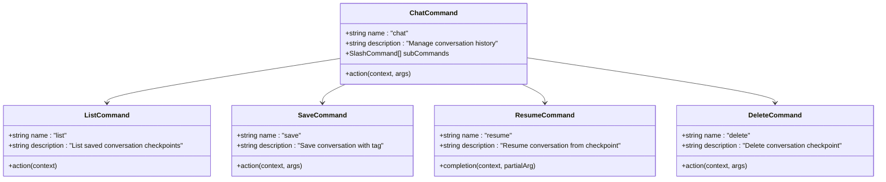

# Slash命令系统

<cite>
**本文档中引用的文件**
- [slashCommandProcessor.ts](file://packages/cli/src/ui/hooks/slashCommandProcessor.ts)
- [CommandService.ts](file://packages/cli/src/services/CommandService.ts)
- [argumentProcessor.ts](file://packages/cli/src/services/prompt-processors/argumentProcessor.ts)
- [shellProcessor.ts](file://packages/cli/src/services/prompt-processors/shellProcessor.ts)
- [chatCommand.ts](file://packages/cli/src/ui/commands/chatCommand.ts)
- [modelCommand.ts](file://packages/cli/src/ui/commands/modelCommand.ts)
- [helpCommand.ts](file://packages/cli/src/ui/commands/helpCommand.ts)
- [settingsCommand.ts](file://packages/cli/src/ui/commands/settingsCommand.ts)
- [types.ts](file://packages/cli/src/ui/commands/types.ts)
- [slashCommandProcessor.test.ts](file://packages/cli/src/ui/hooks/slashCommandProcessor.test.ts)
- [cleanup.ts](file://packages/cli/src/utils/cleanup.ts)
</cite>

## 目录
1. [简介](#简介)
2. [系统架构](#系统架构)
3. [核心组件](#核心组件)
4. [命令处理器详解](#命令处理器详解)
5. [Prompt处理器系统](#prompt处理器系统)
6. [内置命令分析](#内置命令分析)
7. [命令加载机制](#命令加载机制)
8. [安全与权限控制](#安全与权限控制)
9. [使用示例](#使用示例)
10. [故障排除指南](#故障排除指南)
11. [总结](#总结)

## 简介

Slash命令系统是Qwen Code CLI的核心交互机制，提供了以'/'或'?'开头的命令驱动型用户界面。该系统支持复杂的命令链、参数解析、权限控制和上下文扩展功能，为用户提供了一个强大而灵活的交互环境。

系统的主要特点包括：
- **命令分层结构**：支持父命令和子命令的嵌套关系
- **多源命令加载**：从内置代码、本地文件和MCP协议加载命令
- **Prompt处理器管道**：支持参数注入、Shell命令执行和安全验证
- **权限控制系统**：细粒度的命令执行权限管理
- **会话状态管理**：持久化的命令执行上下文和配置

## 系统架构


**图表来源**
- [slashCommandProcessor.ts](file://packages/cli/src/ui/hooks/slashCommandProcessor.ts#L1-L685)
- [CommandService.ts](file://packages/cli/src/services/CommandService.ts#L1-L104)

## 核心组件

### SlashCommand接口

SlashCommand是系统中的基础数据结构，定义了所有命令的标准契约：

```typescript
interface SlashCommand {
  name: string;
  altNames?: string[];
  description: string;
  kind: CommandKind;
  extensionName?: string;
  action?: (context: CommandContext, args: string) => Promise<SlashCommandActionReturn>;
  completion?: (context: CommandContext, partialArg: string) => Promise<string[]>;
  subCommands?: SlashCommand[];
}
```

### CommandContext上下文

CommandContext提供了命令执行所需的所有资源和状态信息：

```typescript
interface CommandContext {
  invocation?: {
    raw: string;
    name: string;
    args: string;
  };
  services: {
    config: Config | null;
    settings: LoadedSettings;
    git: GitService | undefined;
    logger: Logger;
  };
  ui: {
    addItem: UseHistoryManagerReturn['addItem'];
    clear: () => void;
    setDebugMessage: (message: string) => void;
    pendingItem: HistoryItemWithoutId | null;
    setPendingItem: (item: HistoryItemWithoutId | null) => void;
    loadHistory: UseHistoryManagerReturn['loadHistory'];
    toggleCorgiMode: () => void;
    toggleVimEnabled: () => Promise<boolean>;
    setGeminiMdFileCount: (count: number) => void;
    reloadCommands: () => void;
  };
  session: {
    stats: SessionStatsState;
    sessionShellAllowlist: Set<string>;
  };
  overwriteConfirmed?: boolean;
}
```

**章节来源**
- [types.ts](file://packages/cli/src/ui/commands/types.ts#L1-L212)

## 命令处理器详解

### SlashCommandProcessor核心逻辑

SlashCommandProcessor是整个命令系统的核心控制器，负责命令解析、匹配和执行：


**图表来源**
- [slashCommandProcessor.ts](file://packages/cli/src/ui/hooks/slashCommandProcessor.ts#L288-L685)

### 命令解析算法

处理器采用两阶段匹配算法来查找命令：

1. **主名称匹配**：首先尝试精确匹配命令的主名称
2. **别名匹配**：如果主名称不匹配，则检查别名列表

```typescript
let foundCommand = currentCommands.find((cmd) => cmd.name === part);
if (!foundCommand) {
  foundCommand = currentCommands.find((cmd) =>
    cmd.altNames?.includes(part),
  );
}
```

### 异步命令执行

所有命令都以异步方式执行，确保不会阻塞用户界面：

```typescript
const result = await commandToExecute.action(fullCommandContext, args);
```

**章节来源**
- [slashCommandProcessor.ts](file://packages/cli/src/ui/hooks/slashCommandProcessor.ts#L288-L685)

## Prompt处理器系统

### ArgumentProcessor参数注入

ArgumentProcessor负责将用户输入的参数附加到提示文本中：


**图表来源**
- [argumentProcessor.ts](file://packages/cli/src/services/prompt-processors/argumentProcessor.ts#L1-L28)

### ShellProcessor安全执行

ShellProcessor提供了强大的Shell命令执行功能，包含完整的安全验证机制：


**图表来源**
- [shellProcessor.ts](file://packages/cli/src/services/prompt-processors/shellProcessor.ts#L1-L208)

### 注入解析器

ShellProcessor使用专门的解析器来识别和处理Shell注入点：

```typescript
const injections = extractInjections(
  prompt,
  SHELL_INJECTION_TRIGGER,
  this.commandName,
);
```

支持的注入语法：
- `!{command}`：直接执行Shell命令
- `{{args}}`：参数占位符（根据上下文决定是否转义）

**章节来源**
- [argumentProcessor.ts](file://packages/cli/src/services/prompt-processors/argumentProcessor.ts#L1-L28)
- [shellProcessor.ts](file://packages/cli/src/services/prompt-processors/shellProcessor.ts#L1-L208)

## 内置命令分析

### /chat命令组

Chat命令组提供了完整的对话历史管理功能：



**图表来源**
- [chatCommand.ts](file://packages/cli/src/ui/commands/chatCommand.ts#L1-L283)

### /model命令

Model命令负责切换当前会话的AI模型：

```typescript
export const modelCommand: SlashCommand = {
  name: 'model',
  description: 'Switch the model for this session',
  kind: CommandKind.BUILT_IN,
  action: async (context: CommandContext): Promise<OpenDialogActionReturn | MessageActionReturn> => {
    const { services } = context;
    const { config } = services;
    
    const contentGeneratorConfig = config.getContentGeneratorConfig();
    const authType = contentGeneratorConfig.authType;
    const availableModels = getAvailableModelsForAuthType(authType);
    
    return { type: 'dialog', dialog: 'model' };
  },
};
```

### /help命令

Help命令提供帮助信息显示功能：

```typescript
export const helpCommand: SlashCommand = {
  name: 'help',
  altNames: ['?'],
  kind: CommandKind.BUILT_IN,
  description: 'for help on Qwen Code',
  action: async (context) => {
    const helpItem: Omit<HistoryItemHelp, 'id'> = {
      type: MessageType.HELP,
      timestamp: new Date(),
    };
    context.ui.addItem(helpItem, Date.now());
  },
};
```

### /settings命令

Settings命令打开设置对话框：

```typescript
export const settingsCommand: SlashCommand = {
  name: 'settings',
  description: 'View and edit Qwen Code settings',
  kind: CommandKind.BUILT_IN,
  action: (_context, _args): OpenDialogActionReturn => ({
    type: 'dialog',
    dialog: 'settings',
  }),
};
```

**章节来源**
- [chatCommand.ts](file://packages/cli/src/ui/commands/chatCommand.ts#L1-L283)
- [modelCommand.ts](file://packages/cli/src/ui/commands/modelCommand.ts#L1-L89)
- [helpCommand.ts](file://packages/cli/src/ui/commands/helpCommand.ts#L1-L25)
- [settingsCommand.ts](file://packages/cli/src/ui/commands/settingsCommand.ts#L1-L19)

## 命令加载机制

### CommandService统一管理

CommandService负责协调多个命令加载器，确保命令的一致性和去重：


**图表来源**
- [CommandService.ts](file://packages/cli/src/services/CommandService.ts#L1-L104)

### 命令优先级规则

命令加载遵循以下优先级规则：

1. **内置命令**（最高优先级）
2. **文件命令**
3. **MCP命令**（最低优先级）

当出现命名冲突时：
- 扩展命令会被重命名为`extensionName.commandName`
- 非扩展命令会覆盖同名的早期命令

### 异步加载机制

所有命令加载都是异步进行的，使用Promise.allSettled确保即使部分加载失败也不会影响整体系统：

```typescript
const results = await Promise.allSettled(
  loaders.map((loader) => loader.loadCommands(signal)),
);
```

**章节来源**
- [CommandService.ts](file://packages/cli/src/services/CommandService.ts#L1-L104)

## 安全与权限控制

### Shell命令权限验证

ShellProcessor实现了多层次的安全验证机制：


**图表来源**
- [shellProcessor.ts](file://packages/cli/src/services/prompt-processors/shellProcessor.ts#L1-L208)

### 权限检查流程

权限检查包括以下几个步骤：

1. **命令解析**：分析命令字符串
2. **权限评估**：检查是否在白名单中
3. **模式判断**：根据审批模式决定行为
4. **用户交互**：必要时请求用户确认

### 访问控制矩阵

| 模式 | 白名单命中 | YOLO模式 | 行为 |
|------|------------|----------|------|
| 严格模式 | 是 | 不适用 | 允许执行 |
| 严格模式 | 否 | 不适用 | 请求确认 |
| YOLO模式 | 是/否 | 是 | 自动允许 |

**章节来源**
- [shellProcessor.ts](file://packages/cli/src/services/prompt-processors/shellProcessor.ts#L1-L208)

## 使用示例

### 基本命令使用

```bash
# 帮助命令
/help
?help

# 设置命令
/settings

# 模型切换
/model
```

### 对话管理工作流

```bash
# 列出保存的对话
/chat list

# 保存当前对话
/chat save "my-project-v1"

# 恢复对话
/chat resume "my-project-v1"

# 删除对话
/chat delete "old-session"
```

### 命令组合使用

典型的开发工作流：

```bash
# 1. 选择模型
/model

# 2. 开始对话
/chat save "development-session"

# 3. 执行Shell命令（需要确认）
!{git status}

# 4. 查看帮助
/help
```

### 参数注入示例

```bash
# 基本参数注入
/chat save "{{args}}"

# Shell命令注入
!{echo "Processing: {{args}}"}
```

## 故障排除指南

### 常见问题诊断

#### 命令未找到错误

**症状**：输入有效命令但收到"Unknown command"错误

**可能原因**：
1. 命令名称拼写错误
2. 命令被其他命令覆盖
3. 命令加载失败

**解决方案**：
```typescript
// 检查命令列表
console.log(slashCommands);

// 验证命令名称
const command = slashCommands.find(c => c.name === 'expected-name');
```

#### Shell命令权限被拒绝

**症状**：Shell命令执行时被拒绝

**可能原因**：
1. 命令不在会话白名单中
2. 审批模式设置过于严格
3. 命令包含危险字符

**解决方案**：
```typescript
// 检查会话白名单
console.log(sessionShellAllowlist);

// 在YOLO模式下测试
config.setApprovalMode(ApprovalMode.YOLO);
```

#### Prompt处理器错误

**症状**：参数注入或Shell执行失败

**可能原因**：
1. 注入语法错误
2. 参数转义问题
3. 编码格式不兼容

**解决方案**：
```typescript
// 检查注入点
const injections = extractInjections(prompt, '!{', 'command');

// 验证参数转义
const escapedArgs = escapeShellArg(userArgs, shell);
```

### 调试技巧

#### 启用调试模式

```typescript
// 设置调试消息
setDebugMessage('Command execution started');

// 检查命令上下文
console.log(JSON.stringify(commandContext, null, 2));
```

#### 日志记录

```typescript
// 记录命令执行事件
logSlashCommand(config, {
  command: resolvedCommandPath[0],
  subcommand: subcommand,
  status: SlashCommandStatus.SUCCESS,
});
```

**章节来源**
- [slashCommandProcessor.ts](file://packages/cli/src/ui/hooks/slashCommandProcessor.ts#L288-L685)
- [slashCommandProcessor.test.ts](file://packages/cli/src/ui/hooks/slashCommandProcessor.test.ts#L1-L799)

## 总结

Slash命令系统是一个设计精良、功能完备的交互框架，具有以下核心优势：

### 技术特性

1. **模块化架构**：清晰的分层设计，便于维护和扩展
2. **异步处理**：完全异步的命令执行，保证用户体验
3. **安全优先**：多层次的安全验证机制
4. **可扩展性**：支持多种命令源和自定义扩展

### 设计原则

1. **一致性**：统一的命令接口和生命周期管理
2. **灵活性**：支持复杂命令组合和参数注入
3. **可靠性**：完善的错误处理和恢复机制
4. **性能**：高效的命令匹配和缓存策略

### 应用场景

Slash命令系统适用于：
- **CLI应用**：提供丰富的命令行交互功能
- **IDE集成**：与各种编辑器和IDE无缝集成
- **自动化脚本**：支持复杂的自动化工作流
- **开发工具**：作为开发辅助工具的基础平台

该系统为Qwen Code提供了强大而灵活的交互能力，是整个应用程序的核心基础设施之一。通过合理的架构设计和安全控制，它能够满足各种复杂的使用场景需求，同时保持良好的可维护性和扩展性。