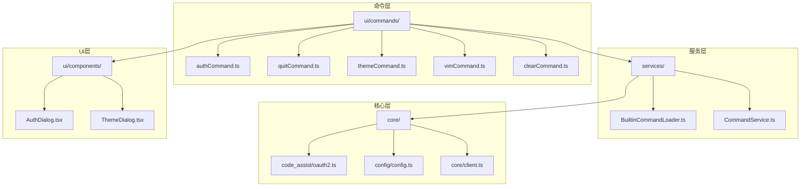
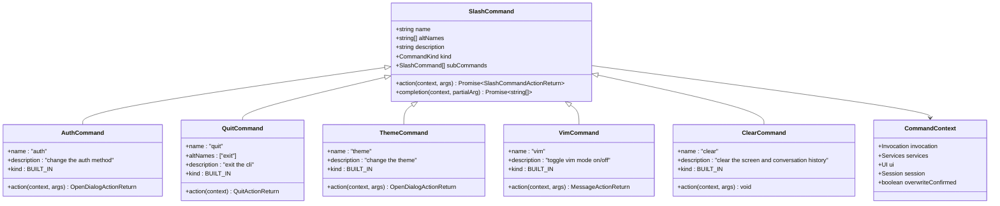
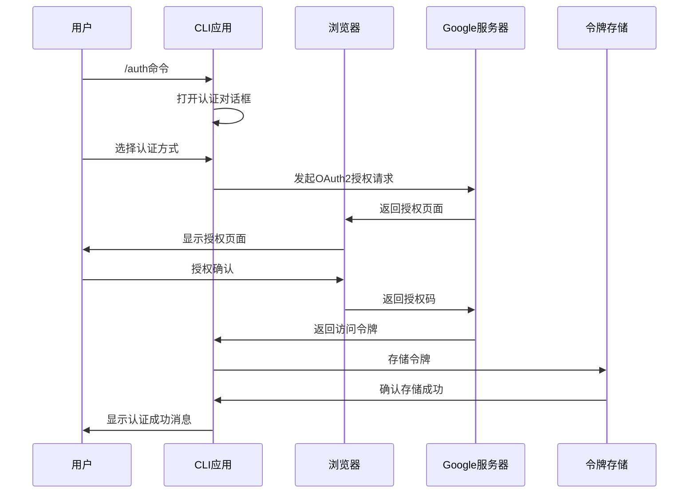
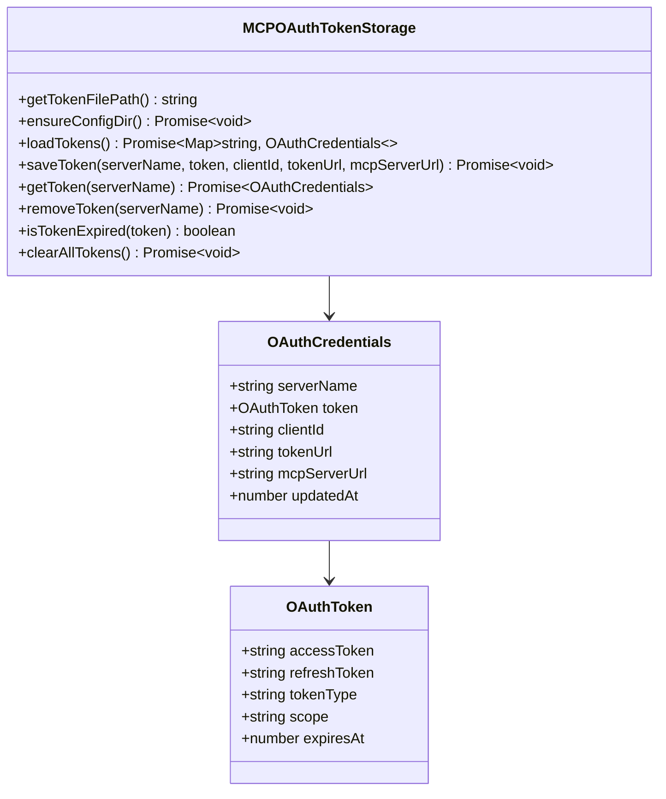
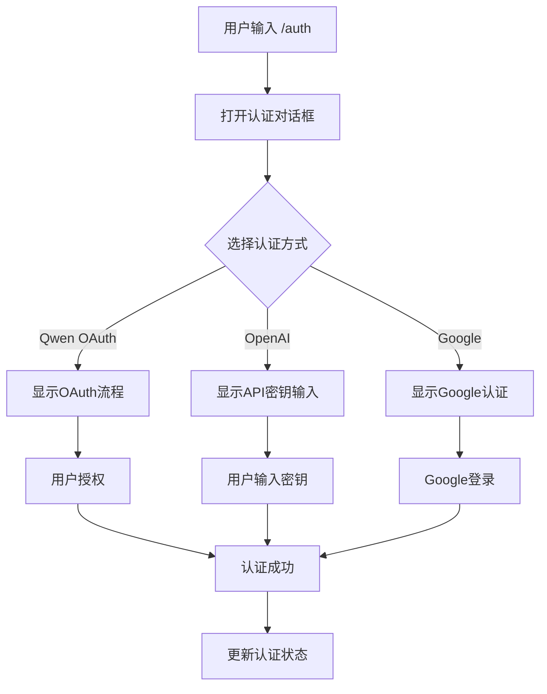
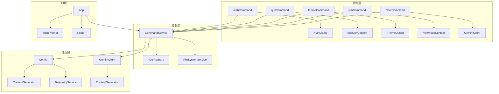

# 特殊交互命令

<cite>
**本文档中引用的文件**
- [authCommand.ts](file://packages/cli/src/ui/commands/authCommand.ts)
- [quitCommand.ts](file://packages/cli/src/ui/commands/quitCommand.ts)
- [themeCommand.ts](file://packages/cli/src/ui/commands/themeCommand.ts)
- [vimCommand.ts](file://packages/cli/src/ui/commands/vimCommand.ts)
- [clearCommand.ts](file://packages/cli/src/ui/commands/clearCommand.ts)
- [BuiltinCommandLoader.ts](file://packages/cli/src/services/BuiltinCommandLoader.ts)
- [types.ts](file://packages/cli/src/ui/commands/types.ts)
- [oauth2.ts](file://packages/core/src/code_assist/oauth2.ts)
- [oauth-token-storage.ts](file://packages/core/src/mcp/oauth-token-storage.ts)
- [config.ts](file://packages/core/src/config/config.ts)
- [client.ts](file://packages/core/src/core/client.ts)
- [AuthDialog.tsx](file://packages/cli/src/ui/components/AuthDialog.tsx)
- [ThemeDialog.tsx](file://packages/cli/src/ui/components/ThemeDialog.tsx)
</cite>

## 目录
1. [简介](#简介)
2. [项目结构概览](#项目结构概览)
3. [核心命令架构](#核心命令架构)
4. [详细命令分析](#详细命令分析)
5. [OAuth2认证流程](#oauth2认证流程)
6. [令牌存储机制](#令牌存储机制)
7. [用户界面集成](#用户界面集成)
8. [系统组件交互](#系统组件交互)
9. [异常处理和边界情况](#异常处理和边界情况)
10. [性能考虑](#性能考虑)
11. [故障排除指南](#故障排除指南)
12. [结论](#结论)

## 简介

本文档详细记录了Qwen Code CLI中的特殊交互命令行为和实现，包括`/auth`、`/quit`、`/theme`、`/vim`和`/clear`等命令。这些命令提供了用户与系统进行特殊交互的能力，涵盖了认证管理、主题切换、模式切换和会话清理等功能。

每个命令都有其独特的实现方式和与其他系统组件的交互模式，通过精心设计的架构确保了良好的用户体验和系统的稳定性。

## 项目结构概览

特殊交互命令主要分布在以下目录结构中：



**图表来源**
- [BuiltinCommandLoader.ts](file://packages/cli/src/services/BuiltinCommandLoader.ts#L27-L39)
- [authCommand.ts](file://packages/cli/src/ui/commands/authCommand.ts#L1-L19)

## 核心命令架构

所有特殊交互命令都遵循统一的架构模式，通过`SlashCommand`接口定义标准行为：



**图表来源**
- [types.ts](file://packages/cli/src/ui/commands/types.ts#L180-L211)
- [authCommand.ts](file://packages/cli/src/ui/commands/authCommand.ts#L8-L18)
- [quitCommand.ts](file://packages/cli/src/ui/commands/quitCommand.ts#L10-L63)

**章节来源**
- [types.ts](file://packages/cli/src/ui/commands/types.ts#L180-L211)
- [BuiltinCommandLoader.ts](file://packages/cli/src/services/BuiltinCommandLoader.ts#L27-L39)

## 详细命令分析

### /auth 命令 - 认证方法切换

`/auth`命令负责管理用户的认证方法，支持多种认证方式的切换：

```typescript
export const authCommand: SlashCommand = {
  name: 'auth',
  description: 'change the auth method',
  kind: CommandKind.BUILT_IN,
  action: (_context, _args): OpenDialogActionReturn => ({
    type: 'dialog',
    dialog: 'auth',
  }),
};
```

该命令通过打开认证对话框来实现功能，允许用户选择不同的认证方法：
- Qwen OAuth认证
- OpenAI API密钥认证
- Google账户认证

### /quit 命令 - 优雅退出处理

`/quit`命令提供两种形式的退出操作：直接退出和确认退出：

```typescript
export const quitCommand: SlashCommand = {
  name: 'quit',
  altNames: ['exit'],
  description: 'exit the cli',
  kind: CommandKind.BUILT_IN,
  action: (context) => {
    const now = Date.now();
    const { sessionStartTime } = context.session.stats;
    const wallDuration = now - sessionStartTime.getTime();

    return {
      type: 'quit',
      messages: [
        {
          type: 'user',
          text: `/quit`,
          id: now - 1,
        },
        {
          type: 'quit',
          duration: formatDuration(wallDuration),
          id: now,
        },
      ],
    };
  },
};
```

### /theme 命令 - 主题切换

`/theme`命令允许用户更改应用程序的主题：

```typescript
export const themeCommand: SlashCommand = {
  name: 'theme',
  description: 'change the theme',
  kind: CommandKind.BUILT_IN,
  action: (_context, _args): OpenDialogActionReturn => ({
    type: 'dialog',
    dialog: 'theme',
  }),
};
```

### /vim 命令 - 编辑器模式切换

`/vim`命令在普通编辑模式和Vim模式之间切换：

```typescript
export const vimCommand: SlashCommand = {
  name: 'vim',
  description: 'toggle vim mode on/off',
  kind: CommandKind.BUILT_IN,
  action: async (context, _args) => {
    const newVimState = await context.ui.toggleVimEnabled();

    const message = newVimState
      ? 'Entered Vim mode. Run /vim again to exit.'
      : 'Exited Vim mode.';
    return {
      type: 'message',
      messageType: 'info',
      content: message,
    };
  },
};
```

### /clear 命令 - 清理操作

`/clear`命令清除终端屏幕和对话历史：

```typescript
export const clearCommand: SlashCommand = {
  name: 'clear',
  description: 'clear the screen and conversation history',
  kind: CommandKind.BUILT_IN,
  action: async (context, _args) => {
    const geminiClient = context.services.config?.getGeminiClient();

    if (geminiClient) {
      context.ui.setDebugMessage('Clearing terminal and resetting chat.');
      await geminiClient.resetChat();
    } else {
      context.ui.setDebugMessage('Clearing terminal.');
    }

    uiTelemetryService.resetLastPromptTokenCount();
    context.ui.clear();
  },
};
```

**章节来源**
- [authCommand.ts](file://packages/cli/src/ui/commands/authCommand.ts#L8-L18)
- [quitCommand.ts](file://packages/cli/src/ui/commands/quitCommand.ts#L35-L63)
- [themeCommand.ts](file://packages/cli/src/ui/commands/themeCommand.ts#L8-L18)
- [vimCommand.ts](file://packages/cli/src/ui/commands/vimCommand.ts#L8-L25)
- [clearCommand.ts](file://packages/cli/src/ui/commands/clearCommand.ts#L10-L30)

## OAuth2认证流程

Qwen Code CLI实现了完整的OAuth2认证流程，支持多种认证方式：



**图表来源**
- [oauth2.ts](file://packages/core/src/code_assist/oauth2.ts#L150-L250)
- [AuthDialog.tsx](file://packages/cli/src/ui/components/AuthDialog.tsx#L40-L80)

### 认证流程实现

OAuth2认证的核心实现包括以下几个步骤：

1. **客户端初始化**：创建OAuth2Client实例并配置客户端凭据
2. **授权URL生成**：生成授权URL并启动本地HTTP服务器
3. **浏览器启动**：自动打开默认浏览器进行授权
4. **回调处理**：处理授权服务器返回的授权码
5. **令牌交换**：使用授权码交换访问令牌
6. **令牌存储**：安全地存储访问令牌和刷新令牌

```typescript
async function authWithWeb(client: OAuth2Client): Promise<OauthWebLogin> {
  const port = await getAvailablePort();
  const redirectUri = `http://localhost:${port}/oauth2callback`;
  const state = crypto.randomBytes(32).toString('hex');
  
  const authUrl = client.generateAuthUrl({
    redirect_uri: redirectUri,
    access_type: 'offline',
    scope: OAUTH_SCOPE,
    state,
  });

  const loginCompletePromise = new Promise<void>((resolve, reject) => {
    const server = http.createServer(async (req, res) => {
      try {
        if (req.url!.indexOf('/oauth2callback') === -1) {
          res.writeHead(HTTP_REDIRECT, { Location: SIGN_IN_FAILURE_URL });
          res.end();
          reject(new Error('Unexpected request: ' + req.url));
        }
        
        const qs = new url.URL(req.url!, 'http://localhost:3000').searchParams;
        if (qs.get('error')) {
          res.writeHead(HTTP_REDIRECT, { Location: SIGN_IN_FAILURE_URL });
          res.end();
          reject(new Error(`Error during authentication: ${qs.get('error')}`));
        } else if (qs.get('state') !== state) {
          res.end('State mismatch. Possible CSRF attack');
          reject(new Error('State mismatch. Possible CSRF attack'));
        } else if (qs.get('code')) {
          const { tokens } = await client.getToken({
            code: qs.get('code')!,
            redirect_uri: redirectUri,
          });
          client.setCredentials(tokens);
          res.writeHead(HTTP_REDIRECT, { Location: SIGN_IN_SUCCESS_URL });
          res.end();
          resolve();
        }
      } catch (e) {
        reject(e);
      } finally {
        server.close();
      }
    });
    server.listen(port, host);
  });

  return { authUrl, loginCompletePromise };
}
```

**章节来源**
- [oauth2.ts](file://packages/core/src/code_assist/oauth2.ts#L300-L400)

## 令牌存储机制

系统实现了安全的令牌存储机制，支持多种存储后端：



**图表来源**
- [oauth-token-storage.ts](file://packages/core/src/mcp/oauth-token-storage.ts#L15-L50)

### 令牌存储特性

1. **文件系统存储**：令牌存储在用户主目录的安全位置
2. **权限控制**：文件权限设置为0o600，防止其他用户访问
3. **过期检查**：自动检测令牌是否过期，支持5分钟缓冲
4. **批量操作**：支持一次性加载、保存和删除多个令牌
5. **错误处理**：完善的错误处理和日志记录

```typescript
static async saveToken(
  serverName: string,
  token: OAuthToken,
  clientId?: string,
  tokenUrl?: string,
  mcpServerUrl?: string,
): Promise<void> {
  await this.ensureConfigDir();

  const tokens = await this.loadTokens();

  const credential: OAuthCredentials = {
    serverName,
    token,
    clientId,
    tokenUrl,
    mcpServerUrl,
    updatedAt: Date.now(),
  };

  tokens.set(serverName, credential);

  const tokenArray = Array.from(tokens.values());
  const tokenFile = this.getTokenFilePath();

  try {
    await fs.writeFile(
      tokenFile,
      JSON.stringify(tokenArray, null, 2),
      { mode: 0o600 },
    );
  } catch (error) {
    console.error(`Failed to save MCP OAuth token: ${getErrorMessage(error)}`);
    throw error;
  }
}
```

**章节来源**
- [oauth-token-storage.ts](file://packages/core/src/mcp/oauth-token-storage.ts#L60-L90)

## 用户界面集成

特殊交互命令通过React组件提供丰富的用户界面体验：

### 认证对话框

认证对话框提供了直观的认证方式选择界面：



**图表来源**
- [AuthDialog.tsx](file://packages/cli/src/ui/components/AuthDialog.tsx#L40-L80)

### 主题对话框

主题对话框允许用户预览和选择不同的主题：

```typescript
export function ThemeDialog({
  onSelect,
  onHighlight,
  settings,
  availableTerminalHeight,
  terminalWidth,
}: ThemeDialogProps): React.JSX.Element {
  const [selectedScope, setSelectedScope] = useState<SettingScope>(SettingScope.User);
  const [highlightedThemeName, setHighlightedThemeName] = useState<string | undefined>(
    settings.merged.ui?.theme || DEFAULT_THEME.name,
  );

  const themeItems = [
    ...builtInThemes.map((theme) => ({
      label: theme.name,
      value: theme.name,
      themeNameDisplay: theme.name,
      themeTypeDisplay: capitalize(theme.type),
    })),
    ...customThemeNames.map((name) => ({
      label: name,
      value: name,
      themeNameDisplay: name,
      themeTypeDisplay: 'Custom',
    })),
  ];

  return (
    <Box borderStyle="round" borderColor={Colors.Gray} flexDirection="column">
      <Text bold>Select Theme</Text>
      <RadioButtonSelect
        items={themeItems}
        initialIndex={safeInitialThemeIndex}
        onSelect={handleThemeSelect}
        onHighlight={handleThemeHighlight}
      />
    </Box>
  );
}
```

**章节来源**
- [AuthDialog.tsx](file://packages/cli/src/ui/components/AuthDialog.tsx#L40-L120)
- [ThemeDialog.tsx](file://packages/cli/src/ui/components/ThemeDialog.tsx#L50-L100)

## 系统组件交互

特殊交互命令与系统其他组件有密切的交互关系：



**图表来源**
- [BuiltinCommandLoader.ts](file://packages/cli/src/services/BuiltinCommandLoader.ts#L27-L39)
- [types.ts](file://packages/cli/src/ui/commands/types.ts#L20-L50)

### 认证状态变化影响

当用户切换认证方法时，系统需要执行以下操作：

1. **历史保存**：保存当前会话的历史记录
2. **客户端重建**：创建新的内容生成器客户端
3. **配置更新**：更新认证配置参数
4. **历史恢复**：恢复之前的会话历史（如果适用）
5. **状态同步**：同步认证状态到所有相关组件

```typescript
async refreshAuth(authMethod: AuthType) {
  // Save the current conversation history before creating a new client
  let existingHistory: Content[] = [];
  if (this.geminiClient && this.geminiClient.isInitialized()) {
    existingHistory = this.geminiClient.getHistory();
  }

  // Create new content generator config
  const newContentGeneratorConfig = createContentGeneratorConfig(
    this,
    authMethod,
  );

  // Create and initialize new client in local variable first
  const newGeminiClient = new GeminiClient(this);
  await newGeminiClient.initialize(newContentGeneratorConfig);

  // Only assign to instance properties after successful initialization
  this.contentGeneratorConfig = newContentGeneratorConfig;
  this.geminiClient = newGeminiClient;

  // Restore the conversation history to the new client
  if (existingHistory.length > 0) {
    this.geminiClient.setHistory(existingHistory, {
      stripThoughts: fromGenaiToVertex,
    });
  }

  this.authType = authMethod;
}
```

**章节来源**
- [config.ts](file://packages/core/src/config/config.ts#L400-L450)

## 异常处理和边界情况

系统实现了全面的异常处理机制来应对各种边界情况：

### 认证失败处理

```typescript
try {
  const { tokens } = await client.getToken({
    code: qs.get('code')!,
    redirect_uri: redirectUri,
  });
  client.setCredentials(tokens);
  await fetchAndCacheUserInfo(client);
  res.writeHead(HTTP_REDIRECT, { Location: SIGN_IN_SUCCESS_URL });
  res.end();
  resolve();
} catch (error) {
  console.error('Failed to exchange authorization code:', error);
  res.writeHead(HTTP_REDIRECT, { Location: SIGN_IN_FAILURE_URL });
  res.end();
  reject(error);
} finally {
  server.close();
}
```

### 令牌过期处理

系统自动检测令牌过期情况，并提供相应的处理机制：

```typescript
static isTokenExpired(token: OAuthToken): boolean {
  if (!token.expiresAt) {
    return false; // No expiry, assume valid
  }

  // Add a 5-minute buffer to account for clock skew
  const bufferMs = 5 * 60 * 1000;
  return Date.now() + bufferMs >= token.expiresAt;
}
```

### 清理操作异常

`/clear`命令在遇到错误时会传播异常，确保用户知道操作失败：

```typescript
if (geminiClient) {
  context.ui.setDebugMessage('Clearing terminal and resetting chat.');
  // If resetChat fails, the exception will propagate and halt the command,
  // which is the correct behavior to signal a failure to the user.
  await geminiClient.resetChat();
} else {
  context.ui.setDebugMessage('Clearing terminal.');
}
```

**章节来源**
- [oauth2.ts](file://packages/core/src/code_assist/oauth2.ts#L350-L400)
- [oauth-token-storage.ts](file://packages/core/src/mcp/oauth-token-storage.ts#L140-L160)
- [clearCommand.ts](file://packages/cli/src/ui/commands/clearCommand.ts#L15-L25)

## 性能考虑

特殊交互命令的设计充分考虑了性能优化：

### 延迟加载

命令组件采用延迟加载策略，只在需要时才加载相关资源：

```typescript
// 按需导入，避免不必要的包加载
const { SharedTokenManager } = await import('../qwen/sharedTokenManager.js');
const { clearQwenCredentials } = await import('../qwen/qwenOAuth2.js');
```

### 内存管理

系统实现了有效的内存管理策略：

1. **令牌缓存**：缓存认证令牌以减少重复认证
2. **会话复用**：复用现有的会话连接
3. **资源清理**：及时释放不再使用的资源

### 并发控制

OAuth2认证过程使用Promise队列来控制并发访问：

```typescript
const oauthClientPromises = new Map<AuthType, Promise<OAuth2Client>>();

export async function getOauthClient(
  authType: AuthType,
  config: Config,
): Promise<OAuth2Client> {
  if (!oauthClientPromises.has(authType)) {
    oauthClientPromises.set(authType, initOauthClient(authType, config));
  }
  return oauthClientPromises.get(authType)!;
}
```

## 故障排除指南

### 常见问题和解决方案

1. **认证失败**
   - 检查网络连接
   - 验证浏览器是否可以正常打开
   - 查看控制台输出的错误信息

2. **令牌过期**
   - 系统会自动重新认证
   - 可以手动运行`/auth`命令重新认证

3. **主题切换无效**
   - 检查主题文件是否存在
   - 验证主题配置格式是否正确

4. **Vim模式切换失败**
   - 确保终端支持Vim键盘映射
   - 检查Vim模式上下文状态

### 调试技巧

启用调试模式可以获得更详细的错误信息：

```typescript
if (this.config.getDebugMode()) {
  console.log(contextParts.join('\n'));
}
```

**章节来源**
- [oauth2.ts](file://packages/core/src/code_assist/oauth2.ts#L100-L150)
- [client.ts](file://packages/core/src/core/client.ts#L600-L650)

## 结论

Qwen Code CLI的特殊交互命令系统展现了现代CLI应用的最佳实践：

1. **模块化设计**：清晰的分层架构和职责分离
2. **用户体验**：直观的命令语法和丰富的用户界面
3. **安全性**：完善的认证流程和令牌管理
4. **可扩展性**：灵活的插件机制和扩展点
5. **可靠性**：全面的错误处理和异常恢复

这些命令不仅提供了基本的功能，更重要的是展示了如何构建一个健壮、可维护且用户友好的CLI应用程序。通过深入理解这些实现细节，开发者可以更好地利用和扩展Qwen Code的功能。