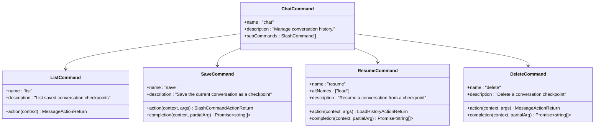

# 用户交互命令系统

<cite>
**本文档中引用的文件**
- [chatCommand.ts](file://packages/cli/src/ui/commands/chatCommand.ts)
- [settingsCommand.ts](file://packages/cli/src/ui/commands/settingsCommand.ts)
- [authCommand.ts](file://packages/cli/src/ui/commands/authCommand.ts)
- [modelCommand.ts](file://packages/cli/src/ui/commands/modelCommand.ts)
- [helpCommand.ts](file://packages/cli/src/ui/commands/helpCommand.ts)
- [quitCommand.ts](file://packages/cli/src/ui/commands/quitCommand.ts)
- [CommandService.ts](file://packages/cli/src/services/CommandService.ts)
- [slashCommandProcessor.ts](file://packages/cli/src/ui/hooks/slashCommandProcessor.ts)
- [argumentProcessor.ts](file://packages/cli/src/services/prompt-processors/argumentProcessor.ts)
- [SessionContext.tsx](file://packages/cli/src/ui/contexts/SessionContext.tsx)
- [types.ts](file://packages/cli/src/ui/commands/types.ts)
- [keyBindings.ts](file://packages/cli/src/config/keyBindings.ts)
- [keyMatchers.ts](file://packages/cli/src/ui/keyMatchers.ts)
- [errors.ts](file://packages/cli/src/utils/errors.ts)
</cite>

## 目录
1. [简介](#简介)
2. [项目结构概览](#项目结构概览)
3. [核心命令系统架构](#核心命令系统架构)
4. [Slash命令解析机制](#slash命令解析机制)
5. [核心命令详解](#核心命令详解)
6. [参数处理器系统](#参数处理器系统)
7. [用户界面状态管理](#用户界面状态管理)
8. [快捷键支持与可访问性](#快捷键支持与可访问性)
9. [命令执行反馈机制](#命令执行反馈机制)
10. [实际使用示例](#实际使用示例)
11. [故障排除指南](#故障排除指南)
12. [总结](#总结)

## 简介

Qwen Code CLI 提供了一套完整的用户交互命令系统，通过 Slash 命令（以斜杠开头的命令）实现对聊天历史、设置、认证、模型选择等功能的控制。该系统采用模块化设计，支持命令扩展、参数解析、状态管理和用户反馈等多种功能。

核心命令包括：
- `/chat` - 对话历史管理
- `/settings` - 设置查看和编辑
- `/auth` - 认证方式切换
- `/model` - 模型选择
- `/help` - 帮助信息
- `/quit` - 退出应用

## 项目结构概览


**图表来源**
- [CommandService.ts](file://packages/cli/src/services/CommandService.ts#L1-L104)
- [slashCommandProcessor.ts](file://packages/cli/src/ui/hooks/slashCommandProcessor.ts#L1-L618)

## 核心命令系统架构

### 命令服务架构

命令系统基于服务模式设计，采用加载器模式来发现和加载不同来源的命令：


**图表来源**
- [CommandService.ts](file://packages/cli/src/services/CommandService.ts#L15-L104)

### 命令类型系统


**图表来源**
- [types.ts](file://packages/cli/src/ui/commands/types.ts#L170-L212)

**章节来源**
- [CommandService.ts](file://packages/cli/src/services/CommandService.ts#L1-L104)
- [types.ts](file://packages/cli/src/ui/commands/types.ts#L1-L212)

## Slash命令解析机制

### 命令识别与解析流程

Slash 命令解析器负责从用户输入中识别和解析命令：


**图表来源**
- [slashCommandProcessor.ts](file://packages/cli/src/ui/hooks/slashCommandProcessor.ts#L287-L618)

### 命令路径解析算法

命令解析器使用递归算法来处理嵌套命令结构：

```typescript
// 命令路径解析的核心逻辑
let currentCommands = commands;
let commandToExecute: SlashCommand | undefined;
let pathIndex = 0;

for (const part of commandPath) {
  // 第一次尝试：精确匹配主命令名
  let foundCommand = currentCommands.find((cmd) => cmd.name === part);
  
  // 第二次尝试：如果主名不匹配，检查别名
  if (!foundCommand) {
    foundCommand = currentCommands.find((cmd) =>
      cmd.altNames?.includes(part),
    );
  }
  
  if (foundCommand) {
    commandToExecute = foundCommand;
    currentCommands = foundCommand.subCommands || [];
  } else {
    // 找不到匹配的命令
    break;
  }
}
```

### 参数处理机制

参数处理器负责处理命令行参数和选项：


**图表来源**
- [argumentProcessor.ts](file://packages/cli/src/services/prompt-processors/argumentProcessor.ts#L1-L28)

**章节来源**
- [slashCommandProcessor.ts](file://packages/cli/src/ui/hooks/slashCommandProcessor.ts#L287-L618)
- [argumentProcessor.ts](file://packages/cli/src/services/prompt-processors/argumentProcessor.ts#L1-L28)

## 核心命令详解

### /chat 命令 - 对话历史管理

`/chat` 命令提供了完整的对话历史管理功能，支持保存、恢复、列出和删除对话检查点：



**图表来源**
- [chatCommand.ts](file://packages/cli/src/ui/commands/chatCommand.ts#L250-L283)

#### /chat save 命令

保存当前对话为检查点，支持覆盖确认机制：

```typescript
const saveCommand: SlashCommand = {
  name: 'save',
  description: 'Save the current conversation as a checkpoint. Usage: /chat save <tag>',
  action: async (context, args): Promise<SlashCommandActionReturn | void> => {
    const tag = args.trim();
    if (!tag) {
      return {
        type: 'message',
        messageType: 'error',
        content: 'Missing tag. Usage: /chat save <tag>',
      };
    }
    
    // 检查是否已存在同名检查点
    if (!context.overwriteConfirmed) {
      const exists = await logger.checkpointExists(tag);
      if (exists) {
        return {
          type: 'confirm_action',
          prompt: 'A checkpoint with the tag already exists. Do you want to overwrite it?',
          originalInvocation: { raw: `/chat save ${tag}` },
        };
      }
    }
    
    // 保存对话历史
    const chat = await config?.getGeminiClient()?.getChat();
    const history = chat.getHistory();
    await logger.saveCheckpoint(history, tag);
  },
};
```

#### /chat resume 命令

从检查点恢复对话，支持自动完成功能：

```typescript
const resumeCommand: SlashCommand = {
  name: 'resume',
  altNames: ['load'],
  description: 'Resume a conversation from a checkpoint. Usage: /chat resume <tag>',
  action: async (context, args) => {
    const tag = args.trim();
    const conversation = await logger.loadCheckpoint(tag);
    
    // 转换为UI格式的历史记录
    const uiHistory: HistoryItemWithoutId[] = [];
    for (const item of conversation) {
      const text = item.parts
        ?.filter((m) => !!m.text)
        .map((m) => m.text)
        .join('') || '';
      
      if (text) {
        uiHistory.push({
          type: (item.role && rolemap[item.role]) || MessageType.GEMINI,
          text,
        } as HistoryItemWithoutId);
      }
    }
    
    return {
      type: 'load_history',
      history: uiHistory,
      clientHistory: conversation,
    };
  },
  completion: async (context, partialArg) => {
    const chatDetails = await getSavedChatTags(context, true);
    return chatDetails
      .map((chat) => chat.name)
      .filter((name) => name.startsWith(partialArg));
  },
};
```

### /settings 命令 - 设置管理

/settings 命令打开设置对话框，允许用户查看和编辑 Qwen Code 配置：

```typescript
export const settingsCommand: SlashCommand = {
  name: 'settings',
  description: 'View and edit Qwen Code settings',
  kind: CommandKind.BUILT_IN,
  action: (_context, _args): OpenDialogActionReturn => ({
    type: 'dialog',
    dialog: 'settings',
  }),
};
```

### /auth 命令 - 认证管理

/auth 命令用于切换认证方法：

```typescript
export const authCommand: SlashCommand = {
  name: 'auth',
  description: 'change the auth method',
  kind: CommandKind.BUILT_IN,
  action: (_context, _args): OpenDialogActionReturn => ({
    type: 'dialog',
    dialog: 'auth',
  }),
};
```

### /model 命令 - 模型选择

/model 命令根据当前认证类型显示可用模型列表：

```mermaid
flowchart TD
A[/model 命令执行] --> B[获取认证类型]
B --> C{认证类型?}
C --> |QWEN_OAUTH| D[显示Qwen模型]
C --> |USE_OPENAI| E[显示OpenAI模型]
C --> |其他| F[显示空列表]
D --> G[打开模型选择对话框]
E --> G
F --> H[显示错误消息]
G --> I[用户选择模型]
I --> J[更新配置]
```

**图表来源**
- [modelCommand.ts](file://packages/cli/src/ui/commands/modelCommand.ts#L1-L89)

```typescript
export const modelCommand: SlashCommand = {
  name: 'model',
  description: 'Switch the model for this session',
  action: async (context: CommandContext): Promise<OpenDialogActionReturn | MessageActionReturn> => {
    const { services } = context;
    const { config } = services;
    
    if (!config) {
      return {
        type: 'message',
        messageType: 'error',
        content: 'Configuration not available.',
      };
    }
    
    const contentGeneratorConfig = config.getContentGeneratorConfig();
    if (!contentGeneratorConfig) {
      return {
        type: 'message',
        messageType: 'error',
        content: 'Content generator configuration not available.',
      };
    }
    
    const authType = contentGeneratorConfig.authType;
    const availableModels = getAvailableModelsForAuthType(authType);
    
    if (availableModels.length === 0) {
      return {
        type: 'message',
        messageType: 'error',
        content: `No models available for the current authentication type (${authType}).`,
      };
    }
    
    return {
      type: 'dialog',
      dialog: 'model',
    };
  },
};
```

### /help 命令 - 帮助系统

/help 命令显示帮助信息：

```typescript
export const helpCommand: SlashCommand = {
  name: 'help',
  altNames: ['?'],
  kind: CommandKind.BUILT_IN,
  description: 'for help on Qwen Code',
  action: async (context) => {
    const helpItem: Omit<HistoryItemHelp, 'id'> = {
      type: MessageType.HELP,
      timestamp: new Date(),
    };
    
    context.ui.addItem(helpItem, Date.now());
  },
};
```

### /quit 命令 - 应用退出

quit 命令提供两种退出方式：

```typescript
export const quitConfirmCommand: SlashCommand = {
  name: 'quit-confirm',
  description: 'Show quit confirmation dialog',
  action: (context) => {
    const now = Date.now();
    const { sessionStartTime } = context.session.stats;
    const wallDuration = now - sessionStartTime.getTime();
    
    return {
      type: 'quit_confirmation',
      messages: [
        {
          type: 'user',
          text: `/quit-confirm`,
          id: now - 1,
        },
        {
          type: 'quit_confirmation',
          duration: formatDuration(wallDuration),
          id: now,
        },
      ],
    };
  },
};

export const quitCommand: SlashCommand = {
  name: 'quit',
  altNames: ['exit'],
  description: 'exit the cli',
  action: (context) => {
    const now = Date.now();
    const { sessionStartTime } = context.session.stats;
    const wallDuration = now - sessionStartTime.getTime();
    
    return {
      type: 'quit',
      messages: [
        {
          type: 'user',
          text: `/quit`, // 保持一致性
          id: now - 1,
        },
        {
          type: 'quit',
          duration: formatDuration(wallDuration),
          id: now,
        },
      ],
    };
  },
};
```

**章节来源**
- [chatCommand.ts](file://packages/cli/src/ui/commands/chatCommand.ts#L1-L283)
- [settingsCommand.ts](file://packages/cli/src/ui/commands/settingsCommand.ts#L1-L19)
- [authCommand.ts](file://packages/cli/src/ui/commands/authCommand.ts#L1-L19)
- [modelCommand.ts](file://packages/cli/src/ui/commands/modelCommand.ts#L1-L89)
- [helpCommand.ts](file://packages/cli/src/ui/commands/helpCommand.ts#L1-L25)
- [quitCommand.ts](file://packages/cli/src/ui/commands/quitCommand.ts#L1-L64)

## 参数处理器系统

### 默认参数处理器

参数处理器负责将用户输入附加到提示中，以便模型可以进行自己的参数解析：


**图表来源**
- [argumentProcessor.ts](file://packages/cli/src/services/prompt-processors/argumentProcessor.ts#L1-L28)

### 参数处理流程


**图表来源**
- [argumentProcessor.ts](file://packages/cli/src/services/prompt-processors/argumentProcessor.ts#L15-L27)

**章节来源**
- [argumentProcessor.ts](file://packages/cli/src/services/prompt-processors/argumentProcessor.ts#L1-L28)

## 用户界面状态管理

### 会话状态管理

会话上下文管理器负责跟踪会话统计信息和状态：


**图表来源**
- [SessionContext.tsx](file://packages/cli/src/ui/contexts/SessionContext.tsx#L15-L141)

### 配置变更管理

配置系统支持动态配置变更和持久化存储：


### 用户偏好存储

用户偏好通过配置系统进行管理，支持以下特性：

- **自动保存**：配置变更自动保存到本地存储
- **版本兼容**：支持配置迁移和向后兼容
- **默认值**：提供合理的默认配置
- **验证**：配置值验证和错误处理

**章节来源**
- [SessionContext.tsx](file://packages/cli/src/ui/contexts/SessionContext.tsx#L1-L141)

## 快捷键支持与可访问性

### 键盘绑定系统

系统提供灵活的键盘绑定配置，支持自定义快捷键：


**图表来源**
- [keyBindings.ts](file://packages/cli/src/config/keyBindings.ts#L59-L183)
- [keyMatchers.ts](file://packages/cli/src/ui/keyMatchers.ts#L1-L53)

### 默认快捷键映射

系统提供一组默认的键盘快捷键：

| 命令 | 快捷键 | 说明 |
|------|--------|------|
| RETURN | Enter | 发送消息 |
| ESCAPE | Escape | 关闭对话框 |
| HOME | Ctrl+A | 移动光标到行首 |
| END | Ctrl+E | 移动光标到行尾 |
| QUIT | Ctrl+C | 退出应用 |
| EXIT | Ctrl+D | 退出应用 |
| SHOW_MORE_LINES | Ctrl+S | 显示更多行 |

### 可访问性支持

系统提供多种可访问性功能：


**章节来源**
- [keyBindings.ts](file://packages/cli/src/config/keyBindings.ts#L1-L183)
- [keyMatchers.ts](file://packages/cli/src/ui/keyMatchers.ts#L1-L53)

## 命令执行反馈机制

### 消息类型系统

系统定义了多种消息类型来提供不同的反馈：


**图表来源**
- [types.ts](file://packages/cli/src/ui/commands/types.ts#L170-L212)

### 错误处理策略

系统采用分层错误处理策略：


### 用户反馈机制


**章节来源**
- [errors.ts](file://packages/cli/src/utils/errors.ts#L1-L11)
- [types.ts](file://packages/cli/src/ui/commands/types.ts#L170-L212)

## 实际使用示例

### 认证后立即切换模型的工作流

```bash
# 1. 查看当前认证状态
> /auth
# 打开认证对话框，选择认证方式

# 2. 切换到模型选择
> /model
# 根据认证类型显示可用模型列表

# 3. 选择特定模型
# 在模型选择对话框中选择所需模型
```

### 完整的对话管理工作流

```bash
# 1. 开始新对话
> Hello, how can I help you today?

# 2. 保存当前对话
> /chat save my-project-session
# 系统提示确认覆盖（如果需要）

# 3. 列出所有保存的对话
> /chat list
# 显示所有可用的对话检查点

# 4. 恢复之前的对话
> /chat resume my-project-session
# 对话历史被恢复到之前的状态

# 5. 删除不需要的对话
> /chat delete old-session
# 确认删除操作
```

### 设置个性化配置

```bash
# 1. 查看当前设置
> /settings
# 打开设置对话框

# 2. 修改配置项
# 在设置对话框中修改各种配置选项

# 3. 应用更改
# 设置会自动保存并应用到当前会话
```

### 快速命令组合示例

```bash
# 同时使用多个命令
> /auth ; /model ; /settings

# 带参数的命令组合
> /chat save "project-backup-$(date +%Y%m%d)" ; /quit
```

## 故障排除指南

### 常见命令错误及解决方案

#### 1. 未知命令错误

**错误信息**：`Unknown command: /unknown`

**原因**：输入了不存在的命令

**解决方案**：
```bash
# 使用 /help 查看可用命令
> /help

# 或查看特定命令的帮助
> /chat ?
```

#### 2. 参数缺失错误

**错误信息**：`Missing tag. Usage: /chat save <tag>`

**原因**：命令缺少必需参数

**解决方案**：
```bash
# 正确使用命令
> /chat save my-session-name

# 或查看命令用法
> /chat save ?
```

#### 3. 认证相关错误

**错误信息**：`Authentication type not available`

**原因**：未正确配置认证

**解决方案**：
```bash
# 检查认证状态
> /auth

# 重新配置认证
> /auth ; /model
```

#### 4. 模型不可用错误

**错误信息**：`No models available for the current authentication type`

**原因**：当前认证类型没有可用模型

**解决方案**：
```bash
# 切换认证类型
> /auth

# 或检查可用模型
> /model
```

### 性能优化建议

#### 1. 大量对话历史管理

```bash
# 定期清理旧的对话检查点
> /chat list
> /chat delete old-session

# 使用更短的标签名
> /chat save short-name
```

#### 2. 命令执行优化

```bash
# 使用快捷键减少输入
# Ctrl+C - 退出
# Ctrl+A - 光标移到行首
# Ctrl+E - 光标移到行尾
```

#### 3. 配置优化

```bash
# 调整设置以提高性能
> /settings
# - 减少日志级别
# - 调整缓存设置
# - 优化网络超时
```

### 调试和诊断

#### 1. 启用调试模式

```bash
# 在启动时启用调试
> DEBUG=true qwen-code

# 或在运行时切换
> /settings
# 启用调试选项
```

#### 2. 检查系统状态

```bash
# 查看会话统计信息
> /stats

# 检查模型状态
> /model

# 查看帮助信息
> /help
```

**章节来源**
- [errors.ts](file://packages/cli/src/utils/errors.ts#L1-L11)
- [types.ts](file://packages/cli/src/ui/commands/types.ts#L170-L212)

## 总结

Qwen Code CLI 的用户交互命令系统是一个功能完整、设计精良的命令驱动界面。该系统的主要优势包括：

### 技术优势

1. **模块化架构**：采用服务模式和加载器模式，支持命令扩展和插件化
2. **类型安全**：完整的 TypeScript 类型定义确保编译时错误检测
3. **异步处理**：支持异步命令执行和并发操作
4. **错误处理**：完善的错误处理和恢复机制

### 功能特性

1. **丰富的命令集**：涵盖对话管理、设置、认证、模型选择等核心功能
2. **智能参数处理**：支持参数解析、自动完成和验证
3. **状态管理**：完整的会话状态跟踪和持久化
4. **可访问性**：支持键盘导航、屏幕阅读器和高对比度模式

### 用户体验

1. **直观的命令语法**：简洁明了的 Slash 命令格式
2. **实时反馈**：即时的命令执行反馈和错误提示
3. **快捷键支持**：丰富的键盘快捷键提升操作效率
4. **帮助系统**：内置的帮助信息和使用指导

### 扩展能力

1. **插件系统**：支持第三方命令扩展
2. **配置灵活性**：可定制的配置选项和行为
3. **多认证支持**：支持多种认证方式和模型提供商
4. **跨平台兼容**：支持 Windows、macOS 和 Linux 平台

该命令系统为用户提供了强大而灵活的交互方式，既适合初学者快速上手，也满足高级用户的深度定制需求。通过持续的功能改进和性能优化，该系统将继续为用户提供优秀的使用体验。