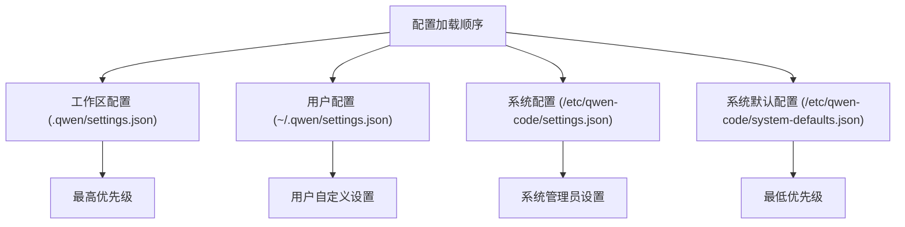
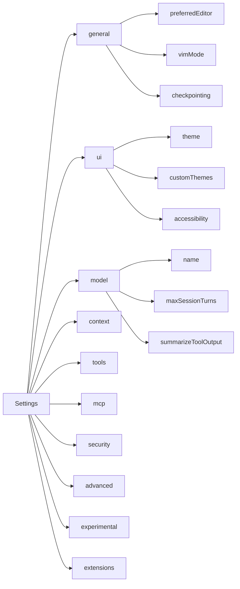
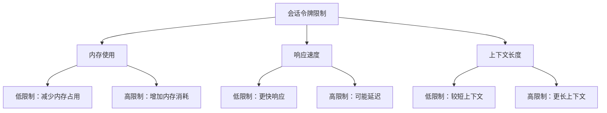
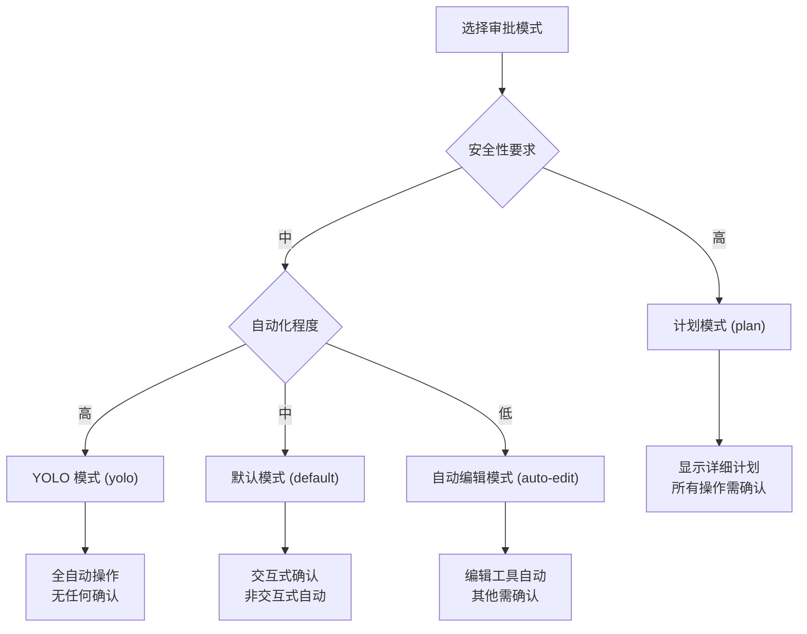
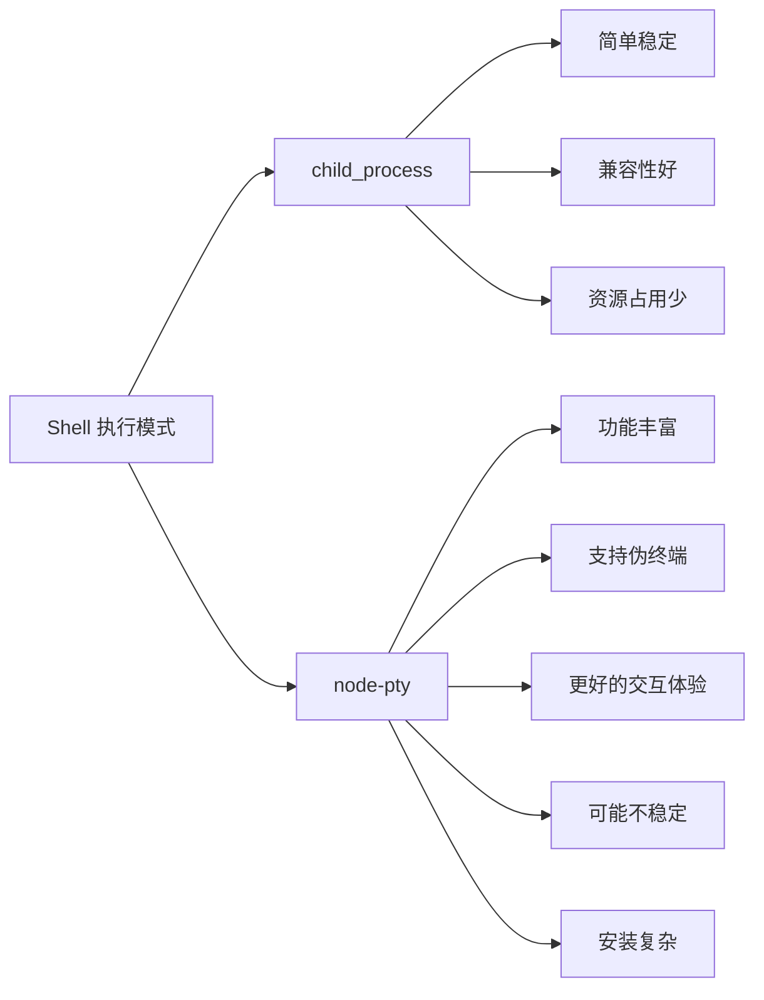
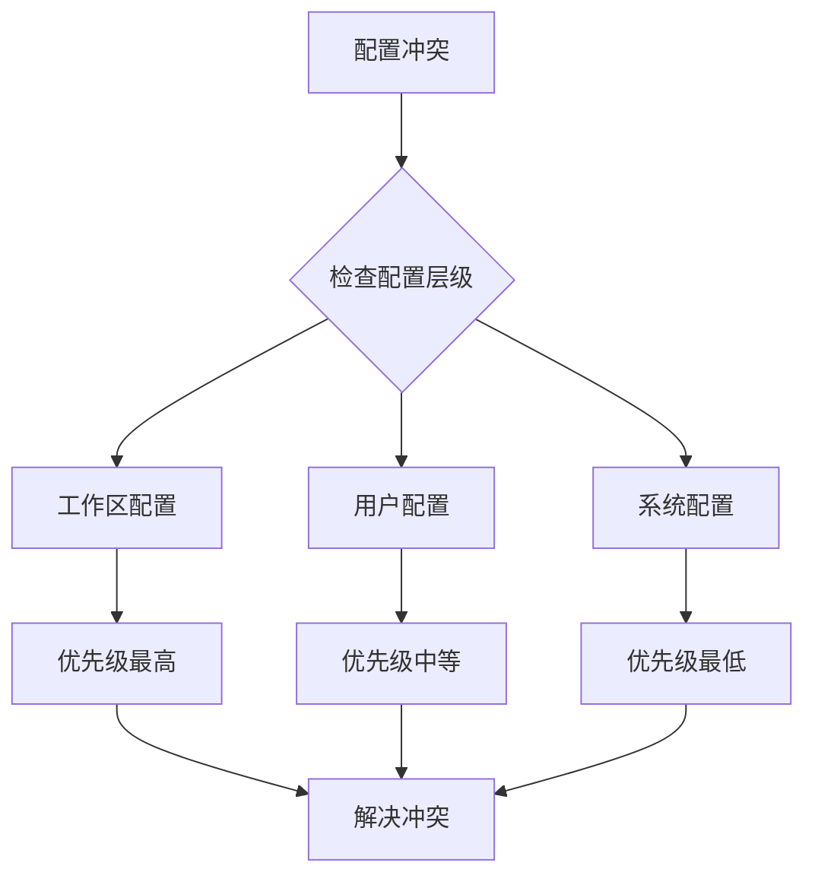
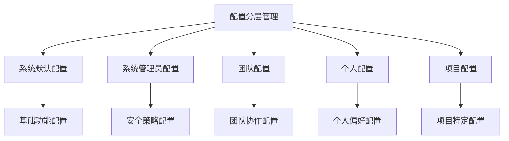

# 基础配置

<cite>
**本文档中引用的文件**
- [packages/cli/src/config/config.ts](file://packages/cli/src/config/config.ts)
- [packages/cli/src/config/settings.ts](file://packages/cli/src/config/settings.ts)
- [packages/cli/src/config/settingsSchema.ts](file://packages/cli/src/config/settingsSchema.ts)
- [packages/core/src/config/config.ts](file://packages/core/src/config/config.ts)
- [packages/core/src/services/fileSystemService.ts](file://packages/core/src/services/fileSystemService.ts)
- [packages/cli/src/ui/components/SettingsDialog.tsx](file://packages/cli/src/ui/components/SettingsDialog.tsx)
</cite>

## 目录
1. [简介](#简介)
2. [配置文件位置](#配置文件位置)
3. [配置文件结构](#配置文件结构)
4. [核心配置选项](#核心配置选项)
5. [会话令牌限制配置](#会话令牌限制配置)
6. [审批模式详解](#审批模式详解)
7. [Shell模式配置](#shell模式配置)
8. [配置示例](#配置示例)
9. [配置验证与故障排除](#配置验证与故障排除)
10. [最佳实践](#最佳实践)

## 简介

Qwen Code 的配置系统提供了灵活且强大的配置管理功能，允许用户根据不同的使用场景和需求定制系统行为。配置文件位于 `~/.qwen/settings.json`，支持多层级配置（用户级、工作区级、系统级），并提供了丰富的配置选项来控制系统的各个方面。

## 配置文件位置

Qwen Code 支持多种配置文件位置，按优先级从高到低排列：

1. **工作区配置**：`.qwen/settings.json` 在当前工作目录下
2. **用户配置**：`~/.qwen/settings.json` 用户主目录下的配置
3. **系统配置**：`/Library/Application Support/QwenCode/settings.json` (macOS) 或 `/etc/qwen-code/settings.json` (Linux)
4. **系统默认配置**：`/Library/Application Support/QwenCode/system-defaults.json` (macOS) 或 `/etc/qwen-code/system-defaults.json` (Linux)



**图表来源**
- [packages/cli/src/config/settings.ts](file://packages/cli/src/config/settings.ts#L40-L60)

## 配置文件结构

配置文件采用 JSON 格式，支持嵌套对象结构。以下是主要配置分类：

### 配置架构概览



**图表来源**
- [packages/cli/src/config/settingsSchema.ts](file://packages/cli/src/config/settingsSchema.ts#L30-L100)

**章节来源**
- [packages/cli/src/config/settingsSchema.ts](file://packages/cli/src/config/settingsSchema.ts#L30-L926)

## 核心配置选项

### 通用配置 (general)

| 配置项 | 类型 | 默认值 | 描述 |
|--------|------|--------|------|
| `preferredEditor` | string | undefined | 首选编辑器路径 |
| `vimMode` | boolean | false | 启用 Vim 键绑定 |
| `disableAutoUpdate` | boolean | false | 禁用自动更新 |
| `checkpointing.enabled` | boolean | false | 启用会话检查点 |

### 用户界面配置 (ui)

| 配置项 | 类型 | 默认值 | 描述 |
|--------|------|--------|------|
| `theme` | string | undefined | UI 主题名称 |
| `hideWindowTitle` | boolean | false | 隐藏窗口标题栏 |
| `hideTips` | boolean | false | 隐藏提示信息 |
| `showMemoryUsage` | boolean | false | 显示内存使用情况 |
| `accessibility.screenReader` | boolean | undefined | 屏幕阅读器模式 |

### 模型配置 (model)

| 配置项 | 类型 | 默认值 | 描述 |
|--------|------|--------|------|
| `name` | string | undefined | 使用的模型名称 |
| `maxSessionTurns` | number | -1 | 最大会话轮次 |
| `summarizeToolOutput` | object | undefined | 工具输出摘要设置 |

### 上下文配置 (context)

| 配置项 | 类型 | 默认值 | 描述 |
|--------|------|--------|------|
| `fileName` | string/array | undefined | 上下文文件名 |
| `importFormat` | string | undefined | 内存导入格式 |
| `discoveryMaxDirs` | number | 200 | 内存发现最大目录数 |
| `includeDirectories` | array | [] | 包含的目录列表 |
| `fileFiltering` | object | {} | 文件过滤设置 |

**章节来源**
- [packages/cli/src/config/settingsSchema.ts](file://packages/cli/src/config/settingsSchema.ts#L50-L800)

## 会话令牌限制配置

### sessionTokenLimit 参数详解

`sessionTokenLimit` 是一个关键的配置参数，用于控制单个会话中允许的最大令牌数量。这个参数直接影响系统的性能和上下文管理能力。

#### 配置语法

```json
{
  "sessionTokenLimit": 8192
}
```

#### 参数说明

- **类型**：数字
- **默认值**：-1（无限制）
- **有效范围**：正整数或 -1（表示不限制）
- **影响范围**：整个会话生命周期

#### 性能影响分析



#### 配置建议

**低内存环境**：
```json
{
  "sessionTokenLimit": 4096
}
```

**高性能需求**：
```json
{
  "sessionTokenLimit": 16384
}
```

**平衡配置**：
```json
{
  "sessionTokenLimit": 8192
}
```

**章节来源**
- [packages/cli/src/config/settingsSchema.ts](file://packages/cli/src/config/settingsSchema.ts#L820-L830)
- [packages/core/src/config/config.ts](file://packages/core/src/config/config.ts#L200-L210)

## 审批模式详解

### approvalMode 的三种模式

Qwen Code 提供了四种不同的审批模式，每种模式适用于不同的安全级别和使用场景。

#### 模式对比表

| 模式 | 名称 | 安全级别 | 自动批准 | 适用场景 |
|------|------|----------|----------|----------|
| `plan` | 计划模式 | 高 | 否 | 需要详细计划的复杂任务 |
| `default` | 默认模式 | 中 | 否 | 日常开发任务 |
| `auto-edit` | 自动编辑模式 | 中低 | 是（仅编辑工具） | 快速修改场景 |
| `yolo` | 全自动模式 | 低 | 是（所有工具） | 自动化脚本 |

#### 模式详细说明

##### 1. 计划模式 (plan)

```json
{
  "approvalMode": "plan"
}
```

**特点**：
- 所有工具调用都需要用户确认
- 显示详细的执行计划
- 提供完整的操作预览

**适用场景**：
- 敏感操作（如删除文件、运行 shell 命令）
- 复杂的多步骤任务
- 生产环境部署

##### 2. 默认模式 (default)

```json
{
  "approvalMode": "default"
}
```

**特点**：
- 交互式任务需要确认
- 自动处理非交互式任务
- 平衡安全性和效率

**适用场景**：
- 日常开发工作
- 中等复杂度的任务
- 开发环境使用

##### 3. 自动编辑模式 (auto-edit)

```json
{
  "approvalMode": "auto-edit"
}
```

**特点**：
- 编辑工具自动批准
- Shell 命令需要确认
- 适合快速修改

**适用场景**：
- 代码编辑和修改
- 小规模文件操作
- 快速原型开发

##### 4. YOLO 模式 (yolo)

```json
{
  "approvalMode": "yolo"
}
```

**特点**：
- 所有工具自动批准
- 无确认流程
- 最高效率

**适用场景**：
- 自动化脚本
- 测试环境
- 高信任环境

#### 模式选择决策树



**图表来源**
- [packages/cli/src/config/config.ts](file://packages/cli/src/config/config.ts#L50-L70)

**章节来源**
- [packages/cli/src/config/config.ts](file://packages/cli/src/config/config.ts#L50-L70)
- [packages/cli/src/config/settingsSchema.ts](file://packages/cli/src/config/settingsSchema.ts#L840-L850)

## Shell模式配置

### shellMode 的配置选项

Qwen Code 支持两种不同的 Shell 执行模式，通过 `shouldUseNodePtyShell` 配置项控制。

#### 配置选项

| 选项 | 描述 | 优势 | 劣势 |
|------|------|------|------|
| `false` | 使用 child_process | 简单稳定 | 功能有限 |
| `true` | 使用 node-pty | 功能丰富 | 可能不稳定 |

#### 配置语法

```json
{
  "tools": {
    "usePty": true
  }
}
```

#### 功能对比



#### 推荐配置

**生产环境**：
```json
{
  "tools": {
    "usePty": false
  }
}
```

**开发环境**：
```json
{
  "tools": {
    "usePty": true
  }
}
```

**章节来源**
- [packages/cli/src/config/settingsSchema.ts](file://packages/cli/src/config/settingsSchema.ts#L450-L460)

## 配置示例

### 最小化配置

适用于基本使用场景，只包含必要的配置项：

```json
{
  "general": {
    "vimMode": false,
    "checkpointing": {
      "enabled": false
    }
  },
  "ui": {
    "theme": "dark",
    "showMemoryUsage": false
  },
  "model": {
    "name": "gemini-pro"
  },
  "context": {
    "discoveryMaxDirs": 100
  },
  "tools": {
    "usePty": false
  }
}
```

### 完整配置

适用于高级用户，包含所有可配置选项：

```json
{
  "general": {
    "preferredEditor": "/usr/bin/code",
    "vimMode": true,
    "disableAutoUpdate": false,
    "checkpointing": {
      "enabled": true
    },
    "enablePromptCompletion": true
  },
  "ui": {
    "theme": "dark",
    "customThemes": {
      "my-theme": {
        "background": "#1e1e1e",
        "foreground": "#ffffff"
      }
    },
    "hideWindowTitle": false,
    "hideTips": false,
    "hideBanner": false,
    "hideFooter": false,
    "showMemoryUsage": true,
    "showLineNumbers": true,
    "accessibility": {
      "disableLoadingPhrases": false,
      "screenReader": false
    }
  },
  "model": {
    "name": "gemini-pro",
    "maxSessionTurns": 50,
    "summarizeToolOutput": {
      "write-file": {
        "tokenBudget": 100
      }
    },
    "chatCompression": {
      "contextPercentageThreshold": 0.8
    },
    "skipNextSpeakerCheck": false
  },
  "context": {
    "fileName": ".qwen-context.md",
    "importFormat": "tree",
    "discoveryMaxDirs": 200,
    "includeDirectories": [
      "./src",
      "./lib"
    ],
    "loadMemoryFromIncludeDirectories": true,
    "fileFiltering": {
      "respectGitIgnore": true,
      "respectGeminiIgnore": true,
      "enableRecursiveFileSearch": true,
      "disableFuzzySearch": false
    }
  },
  "tools": {
    "sandbox": false,
    "usePty": true,
    "core": [
      "./tools/custom-tool.js"
    ],
    "allowed": [
      "read-file",
      "write-file"
    ],
    "exclude": [
      "dangerous-tool"
    ],
    "discoveryCommand": "find ./tools -name '*.js'",
    "callCommand": "node",
    "useRipgrep": true
  },
  "mcp": {
    "serverCommand": "mcp-server",
    "allowed": [
      "filesystem",
      "web-search"
    ],
    "excluded": [
      "dangerous-server"
    ]
  },
  "security": {
    "folderTrust": {
      "featureEnabled": true,
      "enabled": false
    },
    "auth": {
      "selectedType": "oauth",
      "useExternal": true
    }
  },
  "advanced": {
    "autoConfigureMemory": true,
    "dnsResolutionOrder": "ipv4first",
    "excludedEnvVars": [
      "DEBUG",
      "NODE_ENV"
    ],
    "bugCommand": {
      "urlTemplate": "https://github.com/alibaba/qwen-code/issues/new"
    }
  },
  "experimental": {
    "extensionManagement": false,
    "visionModelPreview": true,
    "vlmSwitchMode": "session"
  },
  "extensions": {
    "disabled": [
      "unstable-extension"
    ],
    "workspacesWithMigrationNudge": []
  },
  "contentGenerator": {
    "timeout": 30000,
    "maxRetries": 3,
    "disableCacheControl": false
  },
  "enableOpenAILogging": false,
  "sessionTokenLimit": 8192,
  "approvalMode": "default",
  "enableWelcomeBack": true
}
```

### 场景化配置示例

#### 低内存环境配置

```json
{
  "sessionTokenLimit": 4096,
  "model": {
    "maxSessionTurns": 20
  },
  "context": {
    "discoveryMaxDirs": 50
  },
  "tools": {
    "usePty": false
  }
}
```

#### 高性能需求配置

```json
{
  "sessionTokenLimit": 16384,
  "model": {
    "maxSessionTurns": 100
  },
  "context": {
    "discoveryMaxDirs": 500
  },
  "tools": {
    "usePty": true,
    "useRipgrep": true
  }
}
```

#### 安全敏感环境配置

```json
{
  "approvalMode": "plan",
  "security": {
    "folderTrust": {
      "featureEnabled": true,
      "enabled": true
    }
  },
  "tools": {
    "allowed": [],
    "exclude": ["dangerous-tool"]
  }
}
```

**章节来源**
- [packages/cli/src/config/settingsSchema.ts](file://packages/cli/src/config/settingsSchema.ts#L30-L926)

## 配置验证与故障排除

### 配置验证方法

#### 1. JSON 语法验证

使用以下命令验证配置文件语法：

```bash
jq . ~/.qwen/settings.json
```

#### 2. 配置加载测试

启动 Qwen Code 并检查配置是否正确加载：

```bash
qwen --debug
```

#### 3. 配置文件权限检查

确保配置文件具有正确的权限：

```bash
chmod 644 ~/.qwen/settings.json
```

### 常见配置错误及解决方案

#### 错误 1：JSON 语法错误

**症状**：配置文件无法加载，出现 JSON 解析错误

**解决方案**：
```bash
# 使用 jq 验证 JSON 语法
jq . ~/.qwen/settings.json

# 修复语法错误
nano ~/.qwen/settings.json
```

#### 错误 2：配置项无效

**症状**：某些配置项不生效或被忽略

**解决方案**：
```json
{
  // 确保配置项名称正确
  "invalid_key": "value"  // 错误
  // 应改为
  "valid.key": "value"     // 正确
}
```

#### 错误 3：权限问题

**症状**：配置文件存在但不生效

**解决方案**：
```bash
# 检查文件权限
ls -la ~/.qwen/

# 修复权限
chmod 755 ~/.qwen/
chmod 644 ~/.qwen/settings.json
```

#### 错误 4：配置冲突

**症状**：不同层级的配置相互矛盾

**解决方案**：


### 调试配置问题

#### 启用调试模式

```bash
DEBUG=true qwen --debug
```

#### 查看配置加载日志

```bash
qwen --debug 2>&1 | grep -i "config"
```

#### 验证特定配置项

```javascript
// 在 JavaScript 中验证配置
const config = require('~/.qwen/settings.json');
console.log('Vim Mode:', config.general.vimMode);
console.log('Theme:', config.ui.theme);
```

**章节来源**
- [packages/cli/src/config/settings.ts](file://packages/cli/src/config/settings.ts#L600-L700)

## 最佳实践

### 配置管理策略

#### 1. 分层配置原则



#### 2. 配置版本控制

```bash
# 创建配置备份
cp ~/.qwen/settings.json ~/.qwen/settings.json.backup

# 版本控制配置
cd ~/.qwen/
git init
git add settings.json
git commit -m "Initial configuration"
```

#### 3. 环境隔离

```json
{
  "development": {
    "approvalMode": "default",
    "tools": {
      "usePty": true
    }
  },
  "production": {
    "approvalMode": "plan",
    "tools": {
      "usePty": false
    }
  }
}
```

### 性能优化配置

#### 内存优化

```json
{
  "sessionTokenLimit": 4096,
  "model": {
    "maxSessionTurns": 20
  },
  "context": {
    "discoveryMaxDirs": 50
  },
  "tools": {
    "usePty": false
  }
}
```

#### 速度优化

```json
{
  "sessionTokenLimit": 8192,
  "model": {
    "maxSessionTurns": 50
  },
  "tools": {
    "usePty": true,
    "useRipgrep": true
  }
}
```

### 安全配置建议

#### 生产环境安全配置

```json
{
  "approvalMode": "plan",
  "security": {
    "folderTrust": {
      "featureEnabled": true,
      "enabled": true
    }
  },
  "tools": {
    "allowed": ["read-file", "write-file"],
    "exclude": ["dangerous-tool"]
  }
}
```

#### 开发环境配置

```json
{
  "approvalMode": "default",
  "tools": {
    "usePty": true
  }
}
```

### 配置迁移指南

#### 从旧版本迁移

```json
{
  // 旧版本配置映射
  "preferredEditor": "general.preferredEditor",
  "vimMode": "general.vimMode",
  "disableAutoUpdate": "general.disableAutoUpdate",
  
  // 新配置结构
  "general": {
    "preferredEditor": "/usr/bin/code",
    "vimMode": true,
    "disableAutoUpdate": false
  }
}
```

#### 配置备份与恢复

```bash
#!/bin/bash
# 配置备份脚本
BACKUP_DIR="$HOME/.qwen-backup"
mkdir -p "$BACKUP_DIR"

# 备份当前配置
cp ~/.qwen/settings.json "$BACKUP_DIR/settings-$(date +%Y%m%d-%H%M%S).json"

# 恢复配置
restore_config() {
  local backup_file="$1"
  if [ -f "$backup_file" ]; then
    cp "$backup_file" ~/.qwen/settings.json
    echo "配置已恢复: $backup_file"
  else
    echo "备份文件不存在: $backup_file"
  fi
}
```

通过遵循这些最佳实践，您可以有效地管理和维护 Qwen Code 的配置，确保系统在不同环境下都能发挥最佳性能。