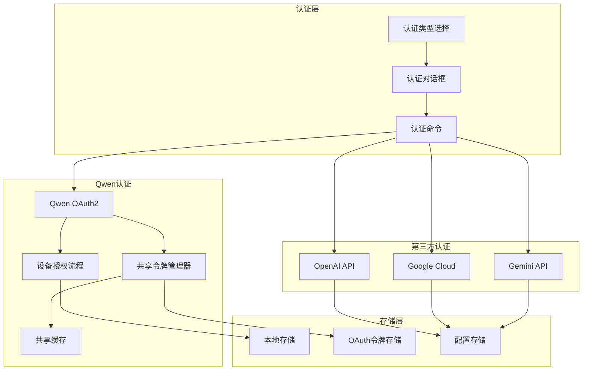
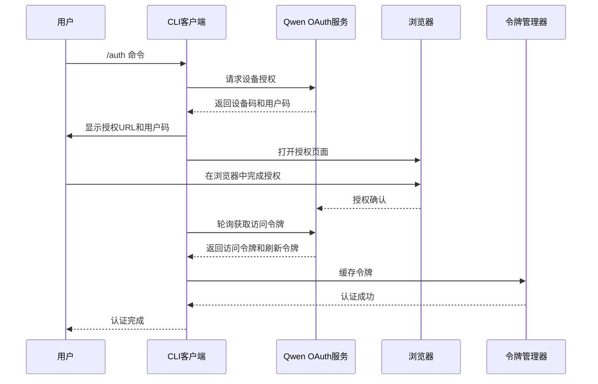
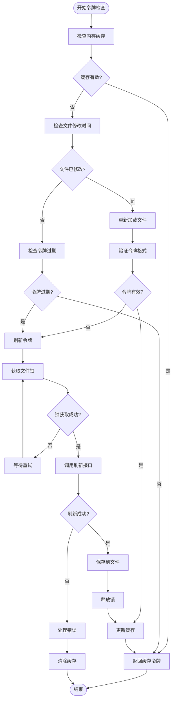
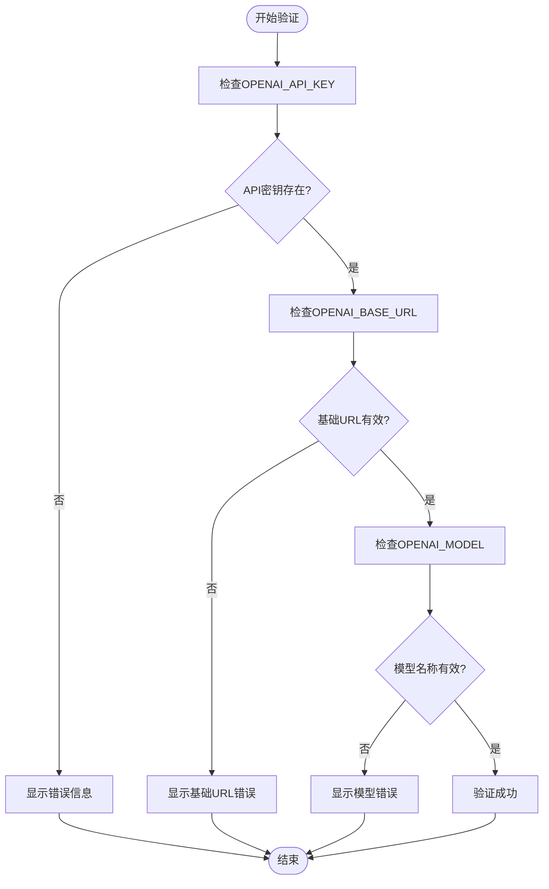
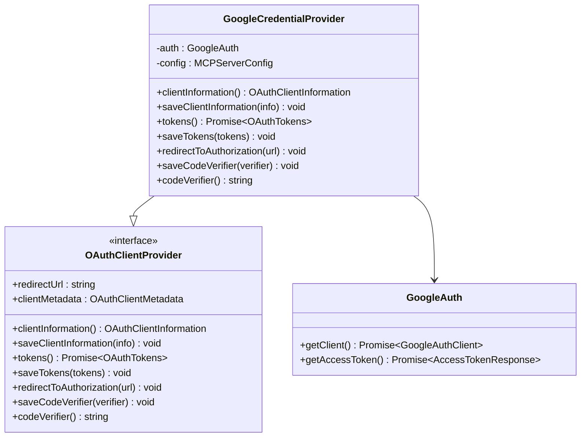
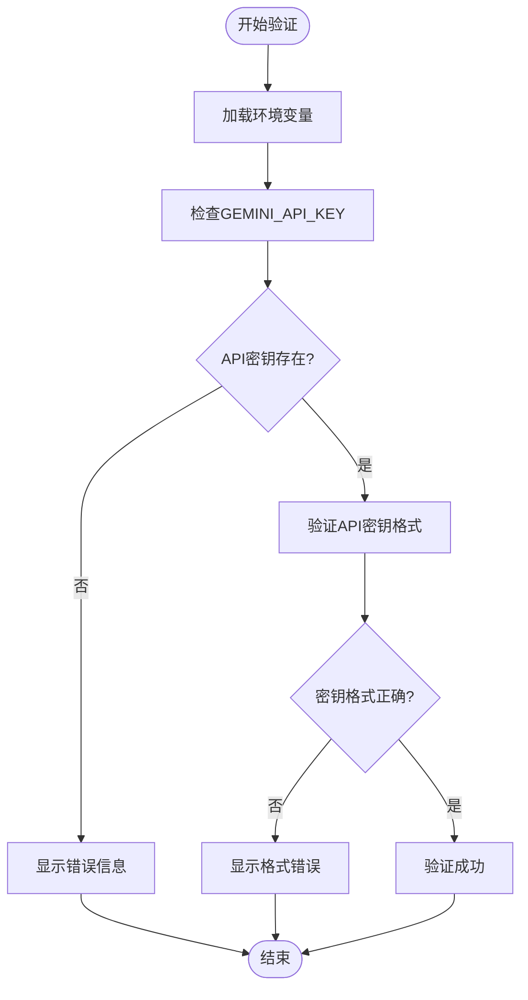
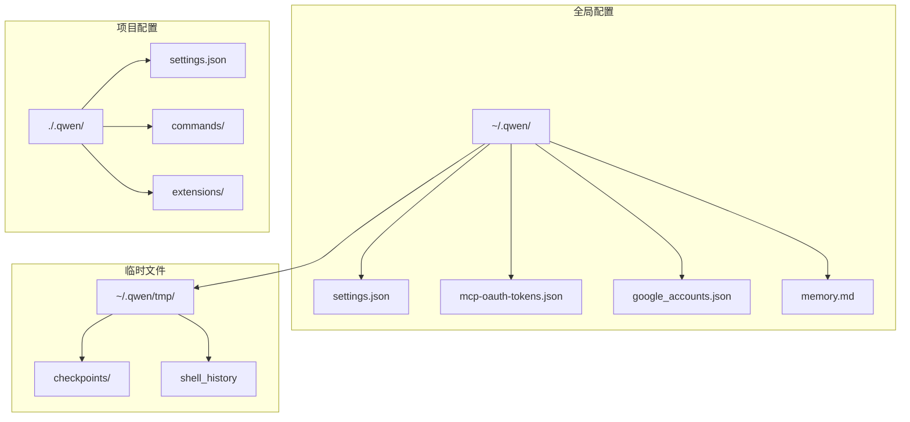
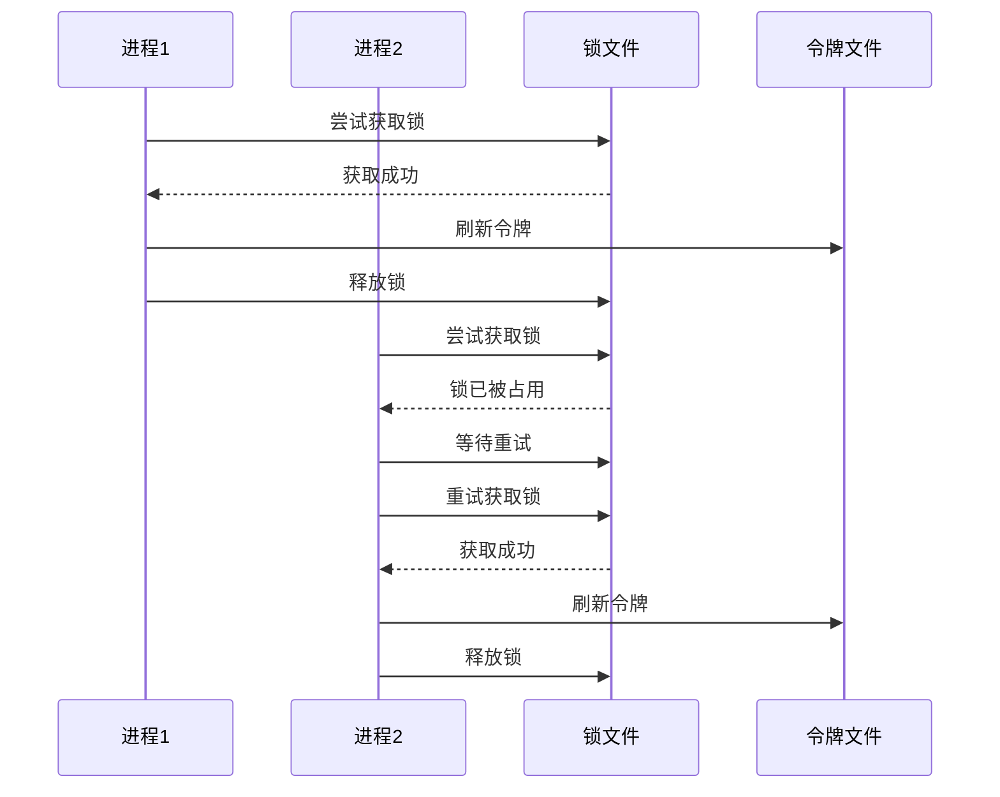

# 认证配置

<cite>
**本文档中引用的文件**
- [packages/cli/src/config/auth.ts](file://packages/cli/src/config/auth.ts)
- [packages/cli/src/ui/components/AuthDialog.tsx](file://packages/cli/src/ui/components/AuthDialog.tsx)
- [packages/cli/src/ui/commands/authCommand.ts](file://packages/cli/src/ui/commands/authCommand.ts)
- [packages/core/src/qwen/qwenOAuth2.ts](file://packages/core/src/qwen/qwenOAuth2.ts)
- [packages/core/src/qwen/sharedTokenManager.ts](file://packages/core/src/qwen/sharedTokenManager.ts)
- [packages/core/src/mcp/oauth-token-storage.ts](file://packages/core/src/mcp/oauth-token-storage.ts)
- [packages/core/src/mcp/google-auth-provider.ts](file://packages/core/src/mcp/google-auth-provider.ts)
- [packages/core/src/config/storage.ts](file://packages/core/src/config/storage.ts)
- [packages/core/src/config/config.ts](file://packages/core/src/config/config.ts)
- [packages/core/src/core/contentGenerator.ts](file://packages/core/src/core/contentGenerator.ts)
- [packages/core/src/config/models.ts](file://packages/core/src/config/models.ts)
</cite>

## 目录
1. [简介](#简介)
2. [认证架构概览](#认证架构概览)
3. [Qwen OAuth认证](#qwen-oauth认证)
4. [OpenAI兼容API认证](#openai兼容api认证)
5. [Google Cloud认证](#google-cloud认证)
6. [Gemini API认证](#gemini-api认证)
7. [认证配置管理](#认证配置管理)
8. [安全性和最佳实践](#安全性和最佳实践)
9. [故障排除指南](#故障排除指南)
10. [总结](#总结)

## 简介

Qwen Code提供了多种认证机制以满足不同的使用场景和安全需求。本文档详细介绍了各种认证方式的配置方法、工作原理以及最佳实践。主要支持以下认证类型：
- Qwen OAuth设备授权流程
- OpenAI兼容API密钥认证
- Google Cloud服务账户认证
- Gemini API密钥认证

## 认证架构概览



**图表来源**
- [packages/cli/src/ui/components/AuthDialog.tsx](file://packages/cli/src/ui/components/AuthDialog.tsx#L1-L184)
- [packages/core/src/qwen/qwenOAuth2.ts](file://packages/core/src/qwen/qwenOAuth2.ts#L1-L884)

## Qwen OAuth认证

### 自动认证流程

Qwen OAuth认证是Qwen Code的主要认证方式，采用设备授权流程（Device Authorization Flow）实现安全的用户身份验证。

#### 启动认证过程

用户可以通过以下命令启动Qwen OAuth认证：

```bash
/auth
```

这将打开认证对话框，允许用户选择Qwen OAuth作为认证方式。

#### 设备授权流程



**图表来源**
- [packages/core/src/qwen/qwenOAuth2.ts](file://packages/core/src/qwen/qwenOAuth2.ts#L527-L884)

#### OAuth令牌存储位置

Qwen OAuth令牌存储在以下位置：

- **主目录下的`.qwen`目录**：`~/.qwen/oauth_creds.json`
- **临时目录**：用于分布式锁文件：`~/.qwen/oauth_creds.lock`

#### 自动刷新机制



**图表来源**
- [packages/core/src/qwen/sharedTokenManager.ts](file://packages/core/src/qwen/sharedTokenManager.ts#L1-L881)

**章节来源**
- [packages/core/src/qwen/qwenOAuth2.ts](file://packages/core/src/qwen/qwenOAuth2.ts#L1-L884)
- [packages/core/src/qwen/sharedTokenManager.ts](file://packages/core/src/qwen/sharedTokenManager.ts#L1-L881)

## OpenAI兼容API认证

### 环境变量配置

OpenAI兼容API认证通过设置以下环境变量实现：

```bash
# 必需的API密钥
export OPENAI_API_KEY="your-api-key-here"

# 可选的基础URL（默认为OpenAI端点）
export OPENAI_BASE_URL="https://api.openai.com/v1"

# 可选的模型名称（默认为gpt-4）
export OPENAI_MODEL="gpt-4"
```

### 配置验证



**图表来源**
- [packages/cli/src/config/auth.ts](file://packages/cli/src/config/auth.ts#L1-L69)

### 优先级规则

认证配置的优先级顺序如下：

1. **环境变量**：最高优先级
2. **用户配置文件**：次高优先级
3. **项目配置文件**：最低优先级

**章节来源**
- [packages/cli/src/config/auth.ts](file://packages/cli/src/config/auth.ts#L1-L69)
- [packages/core/src/core/contentGenerator.ts](file://packages/core/src/core/contentGenerator.ts#L88-L127)

## Google Cloud认证

### Google Cloud服务账户认证

Google Cloud认证支持两种模式：

#### 1. Google API密钥模式

```bash
# 设置Google API密钥
export GOOGLE_API_KEY="your-google-api-key"

# 设置项目ID和区域（可选）
export GOOGLE_CLOUD_PROJECT="your-project-id"
export GOOGLE_CLOUD_LOCATION="us-central1"
```

#### 2. Google Cloud凭证模式

```bash
# 使用Google Cloud SDK认证
gcloud auth application-default login

# 或者设置服务账户密钥文件路径
export GOOGLE_APPLICATION_CREDENTIALS="/path/to/service-account-key.json"
```

### Vertex AI认证

Vertex AI认证需要以下配置：

```bash
# 方式1：使用Google API密钥
export GOOGLE_API_KEY="your-google-api-key"

# 方式2：使用项目配置
export GOOGLE_CLOUD_PROJECT="your-project-id"
export GOOGLE_CLOUD_LOCATION="us-central1"
```

### Google认证提供商



**图表来源**
- [packages/core/src/mcp/google-auth-provider.ts](file://packages/core/src/mcp/google-auth-provider.ts#L1-L100)

**章节来源**
- [packages/core/src/mcp/google-auth-provider.ts](file://packages/core/src/mcp/google-auth-provider.ts#L1-L100)

## Gemini API认证

### GEMINI_API_KEY配置

Gemini API认证是最简单的认证方式，只需设置API密钥：

```bash
# 设置Gemini API密钥
export GEMINI_API_KEY="your-gemini-api-key"
```

### 验证逻辑



**图表来源**
- [packages/cli/src/config/auth.ts](file://packages/cli/src/config/auth.ts#L15-L25)

**章节来源**
- [packages/cli/src/config/auth.ts](file://packages/cli/src/config/auth.ts#L15-L25)

## 认证配置管理

### 存储结构

Qwen Code使用分层存储结构管理认证配置：



**图表来源**
- [packages/core/src/config/storage.ts](file://packages/core/src/config/storage.ts#L1-L115)

### 配置文件路径

| 文件类型 | 全局路径 | 项目路径 |
|---------|----------|----------|
| 设置文件 | `~/.qwen/settings.json` | `./.qwen/settings.json` |
| OAuth令牌 | `~/.qwen/mcp-oauth-tokens.json` | N/A |
| Google账户 | `~/.qwen/google_accounts.json` | N/A |
| 临时文件 | `~/.qwen/tmp/` | `./.qwen/tmp/` |

**章节来源**
- [packages/core/src/config/storage.ts](file://packages/core/src/config/storage.ts#L1-L115)

## 安全性和最佳实践

### 加密存储机制

#### 1. 文件权限控制

所有认证相关文件都设置了严格的文件权限：

- **配置文件**：`chmod 600`（仅所有者可读写）
- **令牌文件**：`chmod 600`（仅所有者可读写）
- **临时文件**：`chmod 700`（仅所有者可执行）

#### 2. 分布式锁机制

为了防止多进程并发访问导致的数据不一致，实现了基于文件的分布式锁：



**图表来源**
- [packages/core/src/qwen/sharedTokenManager.ts](file://packages/core/src/qwen/sharedTokenManager.ts#L700-L881)

#### 3. 敏感数据保护

- **令牌轮换**：定期刷新访问令牌，减少泄露风险
- **过期检查**：自动检测令牌过期并触发刷新
- **错误处理**：令牌失效时自动清理缓存，避免使用无效令牌

### 最佳实践建议

#### 1. 环境变量管理

```bash
# 创建专用的认证配置文件
cat > ~/.qwen/auth.env << EOF
export OPENAI_API_KEY="sk-your-openai-key"
export GEMINI_API_KEY="your-gemini-key"
export GOOGLE_API_KEY="your-google-key"
EOF

# 在项目中使用
source ~/.qwen/auth.env
```

#### 2. 安全的配置存储

```bash
# 使用加密工具存储敏感信息
echo "your-api-key" | gpg --symmetric --cipher-algo AES256 > ~/.qwen/api_key.gpg

# 解密时使用
gpg --decrypt ~/.qwen/api_key.gpg
```

#### 3. 权限最小化原则

- **API密钥权限**：仅授予必要的API权限
- **服务账户权限**：遵循最小权限原则
- **文件权限**：确保只有必要进程可以访问认证文件

## 故障排除指南

### 常见问题及解决方案

#### 1. 令牌过期问题

**症状**：认证成功但很快失效

**诊断步骤**：
```bash
# 检查令牌文件
ls -la ~/.qwen/oauth_creds.json

# 查看令牌内容
cat ~/.qwen/oauth_creds.json | jq .

# 检查令牌过期时间
python -c "
import json, datetime
with open('~/.qwen/oauth_creds.json') as f:
    data = json.load(f)
    print('Expiry:', datetime.datetime.fromtimestamp(data['expiry_date'] / 1000))
"
```

**解决方案**：
```bash
# 清除旧令牌并重新认证
rm ~/.qwen/oauth_creds.json
rm ~/.qwen/oauth_creds.lock
/auth  # 重新选择Qwen OAuth
```

#### 2. 网络连接问题

**症状**：无法连接到认证服务器

**诊断命令**：
```bash
# 测试网络连接
curl -I https://chat.qwen.ai

# 检查代理设置
echo $HTTP_PROXY $HTTPS_PROXY

# 测试DNS解析
nslookup chat.qwen.ai
```

**解决方案**：
```bash
# 配置代理（如果需要）
export HTTP_PROXY=http://proxy.company.com:8080
export HTTPS_PROXY=http://proxy.company.com:8080

# 或者禁用代理
unset HTTP_PROXY HTTPS_PROXY
```

#### 3. 权限不足问题

**症状**：无法写入认证文件

**诊断命令**：
```bash
# 检查目录权限
ls -la ~/

# 检查.qwen目录权限
ls -la ~/.qwen/
```

**解决方案**：
```bash
# 修复目录权限
chmod 700 ~/.qwen
chmod 600 ~/.qwen/oauth_creds.json

# 如果需要，重置整个目录
rm -rf ~/.qwen
mkdir ~/.qwen
chmod 700 ~/.qwen
```

#### 4. 环境变量未生效

**症状**：设置的环境变量在程序中不可用

**诊断命令**：
```bash
# 检查环境变量
printenv | grep -E "(OPENAI|GEMINI|GOOGLE)"

# 检查当前shell配置
cat ~/.bashrc ~/.zshrc 2>/dev/null | grep -E "(OPENAI|GEMINI|GOOGLE)"
```

**解决方案**：
```bash
# 临时设置（当前会话）
export OPENAI_API_KEY="your-key"

# 永久设置
echo 'export OPENAI_API_KEY="your-key"' >> ~/.bashrc
source ~/.bashrc
```

### 调试模式

启用调试模式获取详细的认证日志：

```bash
# 设置调试级别
export DEBUG=true

# 运行认证命令
/auth

# 查看详细日志
tail -f ~/.qwen/logs/auth.log
```

### 日志分析

认证相关的日志文件位于：

- **全局日志**：`~/.qwen/logs/`
- **认证日志**：`~/.qwen/logs/auth.log`
- **错误日志**：`~/.qwen/logs/error.log`

**章节来源**
- [packages/core/src/qwen/qwenOAuth2.ts](file://packages/core/src/qwen/qwenOAuth2.ts#L527-L884)
- [packages/core/src/qwen/sharedTokenManager.ts](file://packages/core/src/qwen/sharedTokenManager.ts#L700-L881)

## 总结

Qwen Code提供了完整而灵活的认证体系，支持多种认证方式以适应不同的使用场景和安全要求：

### 主要特性

1. **多样化的认证方式**：支持Qwen OAuth、OpenAI API、Google Cloud和Gemini API等多种认证方式
2. **自动化的令牌管理**：智能的令牌刷新和缓存机制，确保认证的连续性
3. **强大的安全性保障**：文件权限控制、分布式锁机制、加密存储等多重安全保障
4. **用户友好的界面**：直观的认证对话框和命令行交互
5. **完善的错误处理**：详细的错误信息和自动恢复机制

### 选择建议

- **个人用户**：推荐使用Qwen OAuth，简单易用且安全性高
- **企业用户**：根据现有基础设施选择相应的认证方式
- **开发者**：可以使用OpenAI兼容API进行快速开发和测试
- **Google生态用户**：优先考虑Google Cloud认证

### 安全注意事项

1. **妥善保管API密钥**：不要将密钥提交到版本控制系统
2. **定期轮换密钥**：建立密钥轮换机制
3. **监控使用情况**：定期检查API使用量和异常活动
4. **限制权限范围**：遵循最小权限原则配置API权限

通过合理配置和使用这些认证功能，用户可以在保证安全性的前提下，充分利用Qwen Code的各项功能。