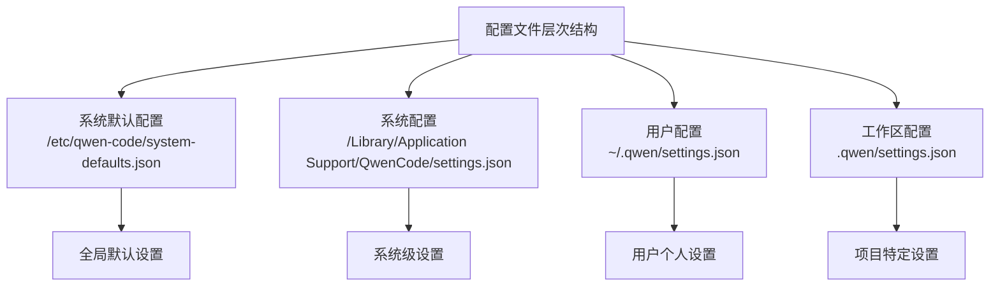
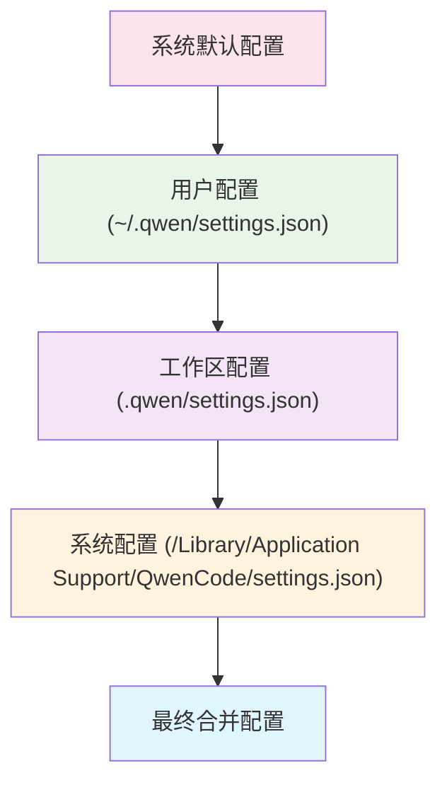
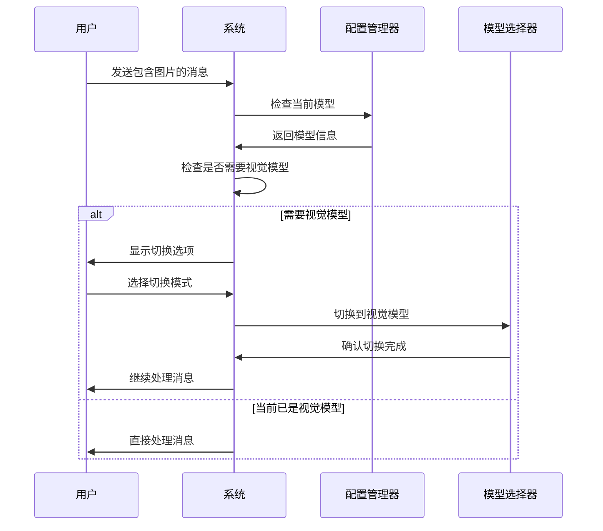
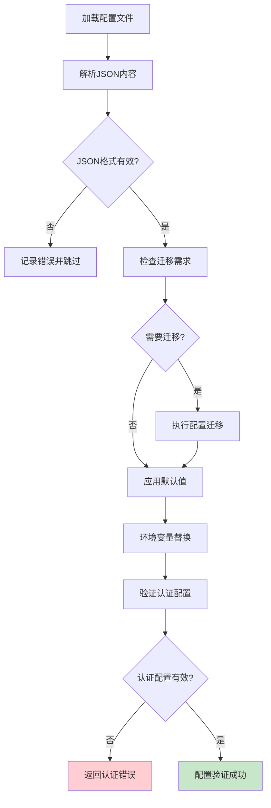

# 配置说明

<cite>
**本文档中引用的文件**
- [settings.ts](file://packages/cli/src/config/settings.ts)
- [settingsSchema.ts](file://packages/cli/src/config/settingsSchema.ts)
- [auth.ts](file://packages/cli/src/config/auth.ts)
- [useVisionAutoSwitch.ts](file://packages/cli/src/ui/hooks/useVisionAutoSwitch.ts)
- [availableModels.ts](file://packages/cli/src/ui/models/availableModels.ts)
- [settingsUtils.ts](file://packages/cli/src/utils/settingsUtils.ts)
- [SettingsContext.tsx](file://packages/cli/src/ui/contexts/SettingsContext.tsx)
</cite>

## 目录
1. [简介](#简介)
2. [配置文件位置和结构](#配置文件位置和结构)
3. [配置架构概览](#配置架构概览)
4. [核心配置选项详解](#核心配置选项详解)
5. [认证机制配置](#认证机制配置)
6. [视觉模型支持配置](#视觉模型支持配置)
7. [配置验证和最佳实践](#配置验证和最佳实践)
8. [故障排除指南](#故障排除指南)
9. [总结](#总结)

## 简介

qwen-code 是一个功能强大的代码助手工具，提供了丰富的配置选项来满足不同用户的使用需求。本文档详细介绍了 qwen-code 的配置系统，包括配置文件的位置、基本结构、核心配置选项以及各种高级功能的配置方法。

配置系统采用分层架构设计，支持用户级、工作区级、系统级和系统默认配置的优先级管理。通过合理的配置，用户可以优化性能、定制界面、配置认证方式，并充分利用视觉模型等高级功能。

## 配置文件位置和结构

### 配置文件路径

qwen-code 使用以下配置文件路径：



**图表来源**
- [settings.ts](file://packages/cli/src/config/settings.ts#L60-L85)

### 配置文件格式

配置文件采用 JSON 格式，支持注释（通过 `strip-json-comments` 库处理）。配置结构分为多个命名空间：

```json
{
  "general": {
    "preferredEditor": "vscode",
    "vimMode": false,
    "checkpointing": {
      "enabled": true
    }
  },
  "ui": {
    "theme": "dark",
    "hideTips": false
  },
  "model": {
    "name": "qwen3-coder-plus",
    "maxSessionTurns": 50
  },
  "context": {
    "includeDirectories": ["src", "lib"],
    "fileFiltering": {
      "respectGitIgnore": true
    }
  }
}
```

**章节来源**
- [settings.ts](file://packages/cli/src/config/settings.ts#L1-L100)
- [settingsSchema.ts](file://packages/cli/src/config/settingsSchema.ts#L1-L50)

## 配置架构概览

### 配置合并机制

qwen-code 采用多层配置合并机制，优先级从高到低为：



**图表来源**
- [settings.ts](file://packages/cli/src/config/settings.ts#L200-L300)

### 配置类型定义

配置系统基于 TypeScript 类型定义，确保类型安全：

```typescript
interface Settings {
  general?: GeneralSettings;
  ui?: UISettings;
  model?: ModelSettings;
  context?: ContextSettings;
  tools?: ToolSettings;
  security?: SecuritySettings;
  advanced?: AdvancedSettings;
  experimental?: ExperimentalSettings;
}
```

**章节来源**
- [settings.ts](file://packages/cli/src/config/settings.ts#L150-L250)
- [settingsSchema.ts](file://packages/cli/src/config/settingsSchema.ts#L800-L926)

## 核心配置选项详解

### 会话令牌限制配置

#### sessionTokenLimit 参数

`sessionTokenLimit` 是控制会话中最大令牌数的关键配置参数：

```typescript
sessionTokenLimit?: number;
```

**配置示例：**
```json
{
  "sessionTokenLimit": 8000
}
```

**性能影响：**
- **高值（如 16000）**：允许更长的对话历史，但可能增加内存使用和响应时间
- **低值（如 4000）**：提高性能，但可能丢失重要上下文信息

**推荐配置：**
- 小型项目：4000-8000
- 中大型项目：8000-16000
- 资源受限环境：4000

### 模型配置

#### maxSessionTurns 参数

控制会话中用户/模型/工具交互的最大轮数：

```typescript
maxSessionTurns?: number;
```

**配置示例：**
```json
{
  "model": {
    "maxSessionTurns": 50
  }
}
```

**值说明：**
- `-1`：无限制
- `0`：禁用会话
- 正整数：指定最大轮数

**章节来源**
- [settingsSchema.ts](file://packages/cli/src/config/settingsSchema.ts#L250-L300)
- [settings.ts](file://packages/cli/src/config/settings.ts#L400-L500)

## 认证机制配置

### Qwen OAuth 自动认证

Qwen OAuth 是推荐的认证方式，无需手动配置 API 密钥：

```json
{
  "security": {
    "auth": {
      "selectedType": "qwen-oauth"
    }
  }
}
```

**优势：**
- 无需管理 API 密钥
- 自动刷新访问令牌
- 更好的安全性

### OpenAI 兼容 API 配置

对于使用 OpenAI 兼容接口的用户：

```json
{
  "security": {
    "auth": {
      "selectedType": "openai"
    }
  }
}
```

需要设置以下环境变量：
- `OPENAI_API_KEY`：API 密钥
- `OPENAI_BASE_URL`：API 基础 URL
- `OPENAI_MODEL`：使用的模型名称

**配置示例：**
```bash
# .env 文件
OPENAI_API_KEY=sk-your-api-key
OPENAI_BASE_URL=https://api.openai.com/v1
OPENAI_MODEL=gpt-4
```

### 认证验证函数

系统提供认证验证函数来确保配置正确：

```typescript
export const validateAuthMethod = (authMethod: string): string | null => {
  if (authMethod === AuthType.QWEN_OAUTH) {
    return null; // Qwen OAuth 不需要额外配置
  }
  
  if (authMethod === AuthType.USE_OPENAI) {
    if (!process.env['OPENAI_API_KEY']) {
      return 'OPENAI_API_KEY environment variable not found.';
    }
    return null;
  }
};
```

**章节来源**
- [auth.ts](file://packages/cli/src/config/auth.ts#L1-L69)
- [settingsSchema.ts](file://packages/cli/src/config/settingsSchema.ts#L400-L500)

## 视觉模型支持配置

### visionModelPreview 配置

启用或禁用视觉模型预览功能：

```typescript
visionModelPreview?: boolean;
```

**配置示例：**
```json
{
  "experimental": {
    "visionModelPreview": true
  }
}
```

**状态说明：**
- `true`：启用视觉模型支持（默认）
- `false`：禁用视觉模型支持

### vlmSwitchMode 配置

控制图像检测时的模型切换行为：

```typescript
vlmSwitchMode?: string;
```

**可用模式：**
- `once`：仅本次请求切换到视觉模型
- `session`：整个会话期间切换到视觉模型
- `persist`：保持当前模型不变

**配置示例：**
```json
{
  "experimental": {
    "vlmSwitchMode": "session"
  }
}
```

### 视觉模型自动切换机制



**图表来源**
- [useVisionAutoSwitch.ts](file://packages/cli/src/ui/hooks/useVisionAutoSwitch.ts#L150-L250)

### 支持的图像格式

系统支持多种图像格式，包括：
- JPEG (`image/jpeg`)
- PNG (`image/png`)
- GIF (`image/gif`)
- WebP (`image/webp`)
- SVG (`image/svg+xml`)

**不支持的格式警告：**
```typescript
export function getUnsupportedImageFormatWarning(): string {
  return 'Unsupported image format detected. Please use JPEG, PNG, GIF, WebP, or SVG.';
}
```

**章节来源**
- [useVisionAutoSwitch.ts](file://packages/cli/src/ui/hooks/useVisionAutoSwitch.ts#L1-L364)
- [availableModels.ts](file://packages/cli/src/ui/models/availableModels.ts#L1-L56)
- [settingsSchema.ts](file://packages/cli/src/config/settingsSchema.ts#L750-L800)

## 配置验证和最佳实践

### 配置验证流程



**图表来源**
- [settings.ts](file://packages/cli/src/config/settings.ts#L600-L700)

### 最佳实践建议

#### 性能优化配置

```json
{
  "model": {
    "maxSessionTurns": 20,
    "summarizeToolOutput": {
      "tokenBudget": 1000
    }
  },
  "context": {
    "discoveryMaxDirs": 100,
    "loadMemoryFromIncludeDirectories": false
  },
  "advanced": {
    "autoConfigureMemory": true
  }
}
```

#### 开发环境配置

```json
{
  "general": {
    "enablePromptCompletion": true,
    "debugKeystrokeLogging": false
  },
  "ui": {
    "showLineNumbers": true,
    "accessibility": {
      "screenReader": false
    }
  },
  "context": {
    "fileFiltering": {
      "respectGitIgnore": true,
      "respectGeminiIgnore": true
    }
  }
}
```

#### 生产环境配置

```json
{
  "privacy": {
    "usageStatisticsEnabled": false
  },
  "security": {
    "folderTrust": {
      "featureEnabled": true,
      "enabled": true
    }
  },
  "advanced": {
    "excludedEnvVars": ["SECRET_VAR", "API_KEY"]
  }
}
```

### 配置修改监控

系统提供配置变更监控功能：

```typescript
export function hasRestartRequiredSettings(
  modifiedSettings: Set<string>
): boolean {
  return Array.from(modifiedSettings).some((key) => requiresRestart(key));
}
```

**章节来源**
- [settingsUtils.ts](file://packages/cli/src/utils/settingsUtils.ts#L1-L479)

## 故障排除指南

### 常见配置错误

#### 1. JSON 格式错误

**症状：** 配置文件无法加载
**原因：** JSON 语法错误或缺少逗号
**解决方法：**
```bash
# 使用 JSON 验证工具检查
jq . ~/.qwen/settings.json
```

#### 2. 认证配置错误

**症状：** 无法连接到模型服务
**原因：** API 密钥缺失或无效
**解决方法：**
```bash
# 检查环境变量
echo $OPENAI_API_KEY
# 或使用认证命令
qwen-code auth
```

#### 3. 视觉模型配置问题

**症状：** 图像无法处理
**原因：** 视觉模型未启用或格式不支持
**解决方法：**
```json
{
  "experimental": {
    "visionModelPreview": true
  }
}
```

### 配置调试技巧

#### 启用调试模式

```json
{
  "general": {
    "debugKeystrokeLogging": true
  }
}
```

#### 检查配置生效

```bash
# 查看当前生效配置
qwen-code settings --show-effective
# 检查特定设置
qwen-code settings --get model.maxSessionTurns
```

#### 重置配置

```bash
# 删除用户配置
rm ~/.qwen/settings.json
# 重新初始化
qwen-code init
```

**章节来源**
- [settings.ts](file://packages/cli/src/config/settings.ts#L700-L850)
- [auth.ts](file://packages/cli/src/config/auth.ts#L20-L69)

## 总结

qwen-code 提供了一个功能强大且灵活的配置系统，支持从简单的用户偏好设置到复杂的认证和性能优化配置。通过合理配置，用户可以：

1. **优化性能**：通过调整会话令牌限制和最大轮数来平衡性能和功能
2. **定制体验**：通过主题、界面设置和快捷键配置个性化使用体验
3. **增强安全**：通过文件夹信任和隐私设置保护敏感数据
4. **利用高级功能**：通过视觉模型支持和 MCP 协议扩展功能

配置系统的分层架构确保了灵活性和可维护性，而完善的验证和错误处理机制保证了配置的可靠性。建议用户根据实际使用场景选择合适的配置，并定期检查和更新配置以获得最佳使用体验。