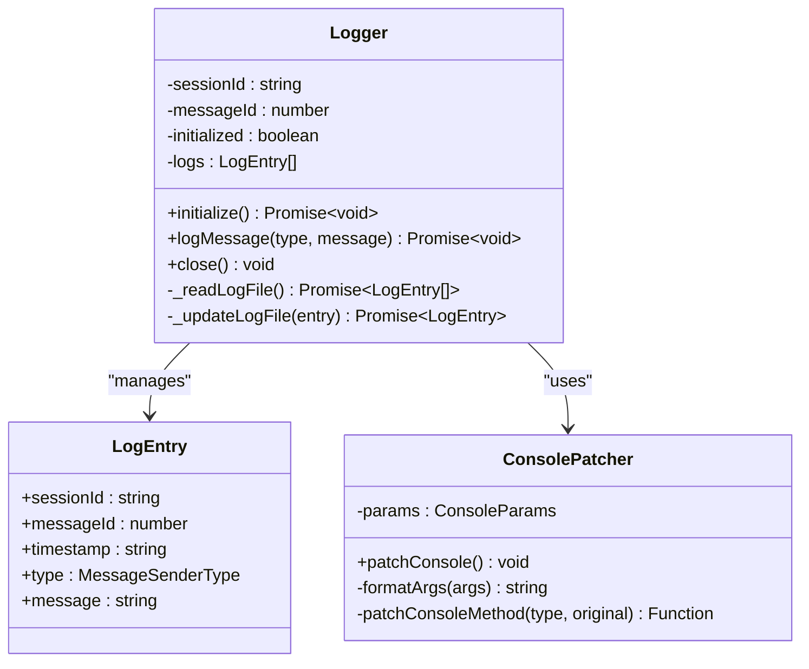

# 高级配置

<cite>
**本文档中引用的文件**
- [settingsSchema.ts](file://packages/cli/src/config/settingsSchema.ts)
- [config.ts](file://packages/cli/src/config/config.ts)
- [logger.ts](file://packages/core/src/core/logger.ts)
- [useVisionAutoSwitch.ts](file://packages/cli/src/ui/hooks/useVisionAutoSwitch.ts)
- [ModelSwitchDialog.tsx](file://packages/cli/src/ui/components/ModelSwitchDialog.tsx)
- [LruCache.ts](file://packages/core/src/utils/LruCache.ts)
- [crawlCache.ts](file://packages/core/src/utils/filesearch/crawlCache.ts)
- [trustedFolders.ts](file://packages/cli/src/config/trustedFolders.ts)
- [ConsolePatcher.ts](file://packages/cli/src/ui/utils/ConsolePatcher.ts)
</cite>

## 目录
1. [简介](#简介)
2. [视觉模型支持配置](#视觉模型支持配置)
3. [模型选择和切换配置](#模型选择和切换配置)
4. [代理配置](#代理配置)
5. [日志级别和调试模式](#日志级别和调试模式)
6. [性能优化配置](#性能优化配置)
7. [安全性和隐私配置](#安全性和隐私配置)
8. [最佳实践和潜在风险](#最佳实践和潜在风险)
9. [故障排除指南](#故障排除指南)
10. [总结](#总结)

## 简介

qwen-code 提供了丰富的高级配置选项，允许用户根据具体需求定制应用程序的行为。本指南涵盖了视觉模型支持、模型切换、代理设置、日志配置、性能优化以及安全性方面的配置选项。

## 视觉模型支持配置

### vlmSwitchMode 模式详解

`vlmSwitchMode` 是一个实验性配置选项，用于控制当检测到图像输入时的视觉模型自动切换行为。该配置有三种工作模式：

#### 1. once 模式（一次性切换）
```typescript
// 配置示例
{
  experimental: {
    vlmSwitchMode: 'once'
  }
}
```
**工作原理：**
- 当检测到图像内容时，自动切换到视觉模型
- 切换仅在当前请求中生效
- 请求完成后恢复到原始模型

**使用场景：**
- 需要临时处理图像内容但不希望永久改变模型设置
- 对于偶尔需要视觉能力的用户

#### 2. session 模式（会话持久化）
```typescript
// 配置示例
{
  experimental: {
    vlmSwitchMode: 'session'
  }
}
```
**工作原理：**
- 自动切换到视觉模型并保持整个会话期间
- 会话结束或手动切换后恢复到原始模型

**使用场景：**
- 需要在多个相关请求中使用视觉能力
- 连续处理包含图像的任务

#### 3. persist 模式（持续保持）
```typescript
// 配置示例
{
  experimental: {
    vlmSwitchMode: 'persist'
  }
}
```
**工作原理：**
- 继续使用当前模型而不进行任何切换
- 用户可以选择是否接受视觉模型切换

**使用场景：**
- 始终使用当前模型，避免意外切换
- 对模型切换敏感的生产环境

### visionModelPreview 启用/禁用

```typescript
// 启用视觉模型预览
{
  experimental: {
    visionModelPreview: true
  }
}

// 禁用视觉模型预览
{
  experimental: {
    visionModelPreview: false
  }
}
```

**影响范围：**
- 当禁用时，视觉模型（如 qwen-vl-max-latest）将被隐藏
- 自动切换功能将不会触发
- 相关的视觉处理工具将不可用

**节源**
- [settingsSchema.ts](file://packages/cli/src/config/settingsSchema.ts#L725-L764)
- [useVisionAutoSwitch.ts](file://packages/cli/src/ui/hooks/useVisionAutoSwitch.ts#L254-L289)

## 模型选择和切换配置

### 默认模型设置

系统提供了灵活的模型配置机制：

```typescript
// 模型配置示例
{
  model: {
    name: 'qwen3-coder-plus',
    maxSessionTurns: -1,
    skipNextSpeakerCheck: false
  }
}
```

### 运行时模型切换

模型可以在运行时动态切换，支持以下操作：
- 手动选择不同模型
- 根据任务类型自动切换
- 临时覆盖当前模型设置

**切换原因：**
- `vision_auto_switch`: 视觉内容检测触发的自动切换
- `manual`: 用户手动选择的切换
- `fallback`: 回退到备用模型
- `other`: 其他类型的切换

**节源**
- [config.ts](file://packages/cli/src/config/config.ts#L600-L650)

## 代理配置

### HTTP_PROXY 和 HTTPS_PROXY 设置

qwen-code 支持通过环境变量配置代理服务器：

```bash
# 设置 HTTP 代理
export HTTP_PROXY=http://proxy.example.com:8080
export HTTPS_PROXY=https://proxy.example.com:8080

# 或者在命令行中指定
qwen --proxy http://proxy.example.com:8080
```

### 网络受限环境的应用

**配置优先级：**
1. 命令行参数 `--proxy`
2. 环境变量 `HTTPS_PROXY` / `https_proxy`
3. 环境变量 `HTTP_PROXY` / `http_proxy`

**使用场景：**
- 企业内部网络环境
- 需要通过代理访问外部服务
- 网络安全要求严格的环境

**节源**
- [config.ts](file://packages/cli/src/config/config.ts#L610-L620)

## 日志级别和调试模式

### LOG_LEVEL 配置

系统提供了多级别的日志记录功能：

```typescript
// 调试模式配置
{
  debug: true,
  debugMode: true
}
```

### 调试模式配置

```bash
# 启用调试模式
export DEBUG=true
export DEBUG_MODE=1

# 或者在命令行中启用
qwen --debug
```

### 日志记录机制

系统采用分层的日志记录架构：



**图表来源**
- [logger.ts](file://packages/core/src/core/logger.ts#L60-L120)
- [ConsolePatcher.ts](file://packages/cli/src/ui/utils/ConsolePatcher.ts#L44-L70)

### 日志级别说明

1. **DEBUG**: 详细调试信息
2. **INFO**: 一般信息记录
3. **WARN**: 警告信息
4. **ERROR**: 错误信息

**节源**
- [logger.ts](file://packages/core/src/core/logger.ts#L84-L125)
- [ConsolePatcher.ts](file://packages/cli/src/ui/utils/ConsolePatcher.ts#L44-L70)

## 性能优化配置

### 缓存设置

#### LRU 缓存配置

```typescript
// LRU 缓存实现
export class LruCache<K, V> {
  private cache: Map<K, V>;
  private maxSize: number;
  
  constructor(maxSize: number) {
    this.cache = new Map<K, V>();
    this.maxSize = maxSize;
  }
  
  set(key: K, value: V): void {
    // 实现 LRU 策略
  }
}
```

#### 文件搜索缓存

系统实现了智能的文件搜索缓存机制：

```typescript
// 缓存配置示例
{
  fileSearch: {
    cacheEnabled: true,
    cacheTTL: 3600, // 1小时
    maxCacheSize: 1000
  }
}
```

### 网络超时配置

```typescript
// 网络超时配置
{
  network: {
    timeout: 30000, // 30秒
    retries: 3,
    retryDelay: 1000
  }
}
```

### 内存管理优化

```typescript
// 内存配置
{
  advanced: {
    autoConfigureMemory: true,
    excludedEnvVars: ['DEBUG', 'DEBUG_MODE']
  }
}
```

**节源**
- [LruCache.ts](file://packages/core/src/utils/LruCache.ts#L1-L42)
- [crawlCache.ts](file://packages/core/src/utils/filesearch/crawlCache.ts#L54-L68)

## 安全性和隐私配置

### 文件夹信任配置

```typescript
// 文件夹信任设置
{
  security: {
    folderTrust: {
      featureEnabled: true,
      enabled: true
    }
  }
}
```

### 访问控制

```typescript
// 访问控制配置
{
  ui: {
    accessibility: {
      screenReader: false,
      disableLoadingPhrases: false
    }
  }
}
```

### 隐私设置

```typescript
// 隐私保护配置
{
  privacy: {
    usageStatisticsEnabled: true
  }
}
```

**节源**
- [trustedFolders.ts](file://packages/cli/src/config/trustedFolders.ts#L120-L168)

## 最佳实践和潜在风险

### 配置最佳实践

1. **视觉模型配置**
   ```typescript
   // 推荐配置
   {
     experimental: {
       visionModelPreview: true,
       vlmSwitchMode: 'session' // 根据实际需求选择
     }
   }
   ```

2. **代理配置**
   ```typescript
   // 生产环境配置
   {
     proxy: process.env.HTTPS_PROXY,
     advanced: {
       excludedEnvVars: ['DEBUG', 'DEBUG_MODE']
     }
   }
   ```

3. **日志配置**
   ```typescript
   // 开发环境配置
   {
     debug: true,
     ui: {
       showMemoryUsage: true
     }
   }
   ```

### 潜在风险提示

1. **视觉模型风险**
   - 自动切换可能导致意外的模型变更
   - 长时间会话中的资源消耗增加

2. **代理配置风险**
   - 不正确的代理设置可能导致连接失败
   - 代理服务器的安全性问题

3. **调试模式风险**
   - 敏感信息可能被记录到日志中
   - 性能开销增加

4. **缓存配置风险**
   - 缓存数据过期导致的问题
   - 内存占用过高

## 故障排除指南

### 常见配置问题

1. **视觉模型无法切换**
   - 检查 `visionModelPreview` 是否启用
   - 验证 `vlmSwitchMode` 配置值

2. **代理连接失败**
   - 验证代理服务器地址和端口
   - 检查网络连通性

3. **日志记录异常**
   - 检查日志文件权限
   - 验证磁盘空间充足

### 调试技巧

```typescript
// 启用详细调试
{
  debug: true,
  ui: {
    showMemoryUsage: true
  }
}
```

**节源**
- [config.ts](file://packages/cli/src/config/config.ts#L428-L450)

## 总结

qwen-code 的高级配置系统提供了全面的功能定制能力，从视觉模型支持到性能优化，从安全配置到调试设置。正确理解和合理配置这些选项，可以显著提升用户体验和系统性能。

**关键要点：**
- 根据实际需求选择合适的视觉模型切换模式
- 合理配置代理设置以适应不同的网络环境
- 平衡调试功能和性能开销
- 注意安全配置，特别是在生产环境中

通过遵循本指南中的最佳实践和注意事项，用户可以充分发挥 qwen-code 的强大功能，同时确保系统的稳定性和安全性。