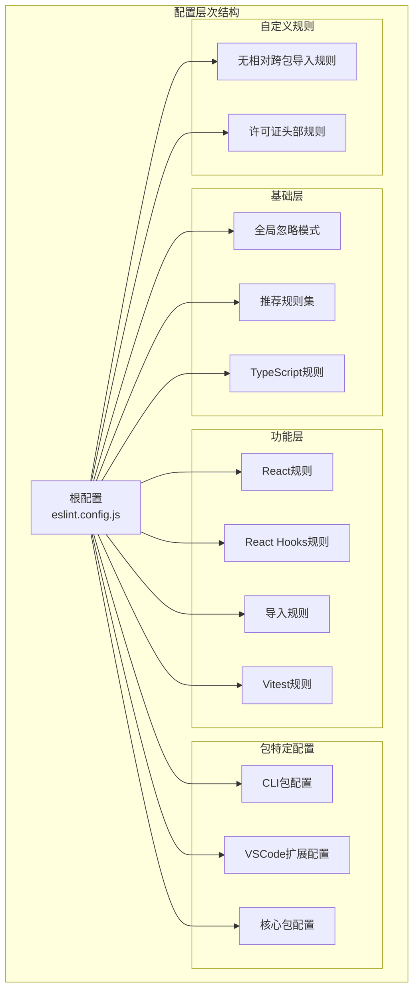
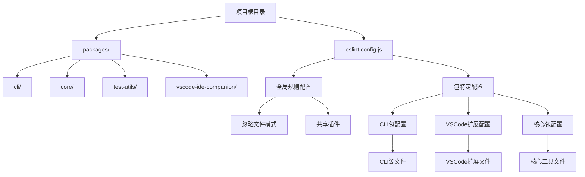
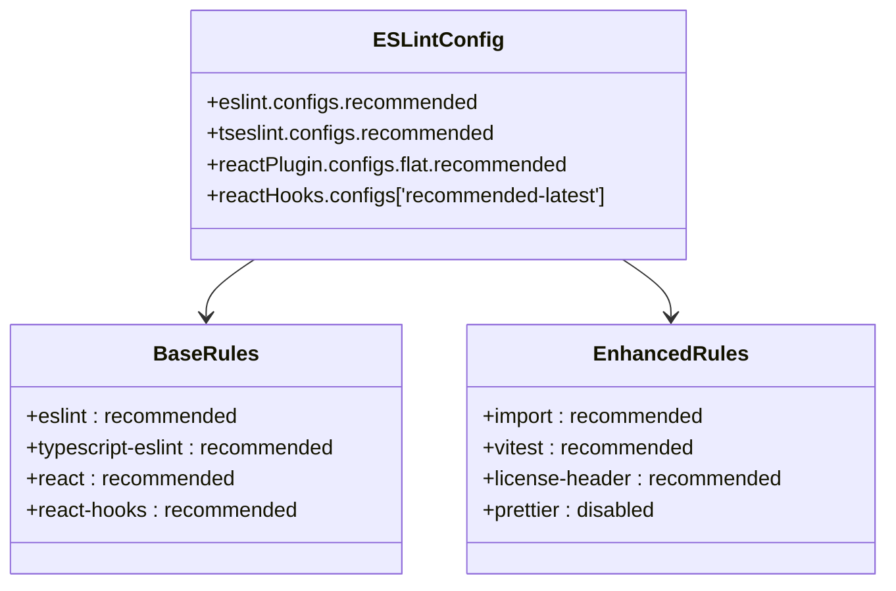
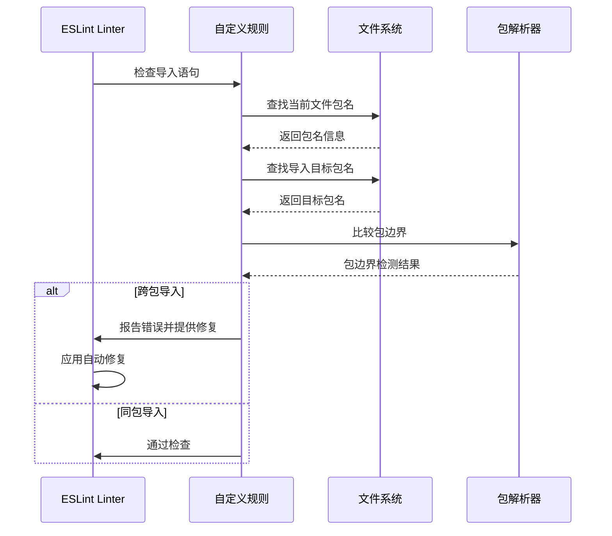
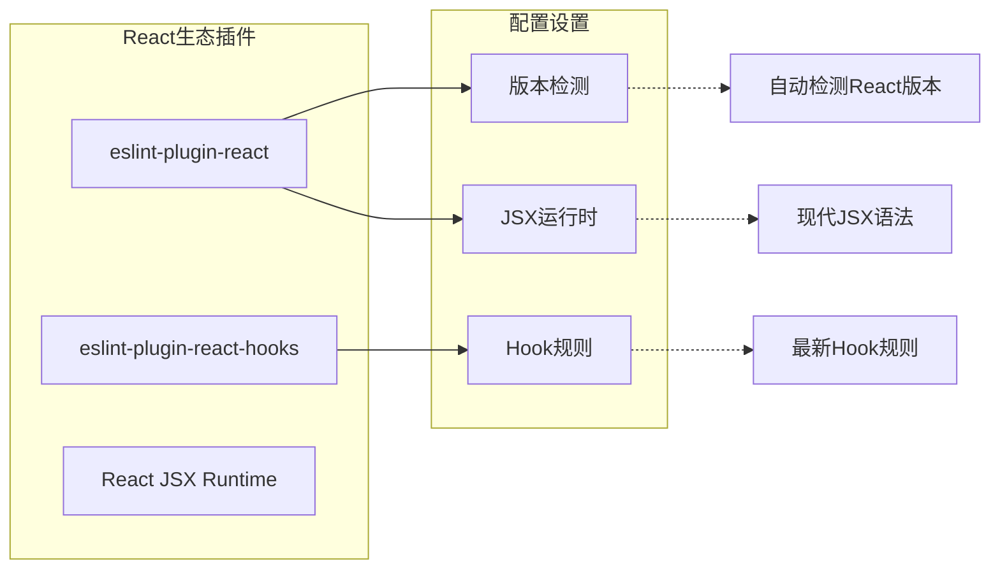
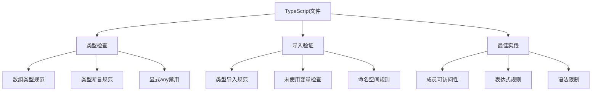
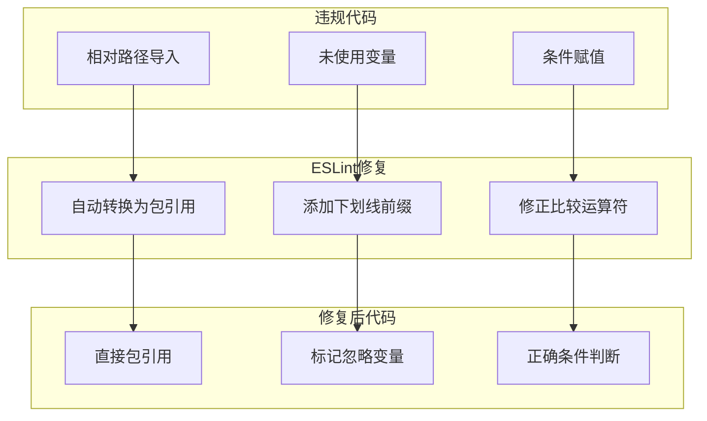
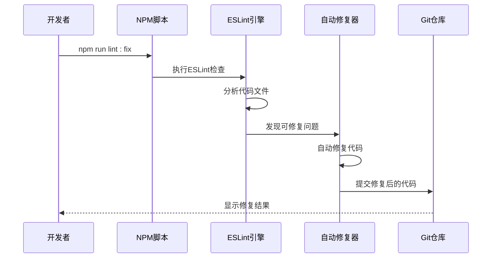

# ESLint 配置策略文档

<cite>
**本文档引用的文件**
- [eslint.config.js](file://eslint.config.js)
- [eslint-rules/no-relative-cross-package-imports.js](file://eslint-rules/no-relative-cross-package-imports.js)
- [packages/vscode-ide-companion/eslint.config.mjs](file://packages/vscode-ide-companion/eslint.config.mjs)
- [package.json](file://package.json)
</cite>

## 目录
1. [项目概述](#项目概述)
2. [ESLint 配置架构](#eslint-配置架构)
3. [核心配置分析](#核心配置分析)
4. [自定义规则详解](#自定义规则详解)
5. [插件集成策略](#插件集成策略)
6. [文件类型特定配置](#文件类型特定配置)
7. [实际应用示例](#实际应用示例)
8. [开发环境集成](#开发环境集成)
9. [最佳实践建议](#最佳实践建议)
10. [故障排除指南](#故障排除指南)

## 项目概述

该项目采用现代化的ESLint配置策略，支持Monorepo架构下的多包管理。配置系统基于ESLint 9.x的Flat Config格式，提供了全面的代码质量保障机制，包括TypeScript支持、React开发规范、模块导入约束以及自定义规则验证。

项目包含多个工作空间包，每个包都有独立的配置需求，同时共享统一的代码质量标准。这种设计确保了整个项目的代码风格一致性，同时允许各包根据自身特性进行定制化配置。

## ESLint 配置架构

### Flat Config 架构设计



**图表来源**
- [eslint.config.js](file://eslint.config.js#L26-L247)

### Monorepo 支持架构



**图表来源**
- [eslint.config.js](file://eslint.config.js#L32-L40)
- [package.json](file://package.json#L10-L12)

**章节来源**
- [eslint.config.js](file://eslint.config.js#L1-L247)
- [package.json](file://package.json#L1-L112)

## 核心配置分析

### 全局忽略模式

ESLint配置采用了严格的全局忽略模式，确保不会对构建产物和临时文件进行不必要的检查：

```javascript
ignores: [
  'node_modules/*',
  'eslint.config.js',
  'packages/**/dist/**',
  'bundle/**',
  'package/bundle/**',
  '.integration-tests/**',
]
```

这些忽略规则的设计考虑：
- **性能优化**：避免对大型依赖目录进行扫描
- **构建产物保护**：不检查编译输出文件
- **开发便利性**：排除临时构建目录
- **测试隔离**：隔离集成测试目录

### 推荐规则集集成

配置系统整合了多个官方推荐规则集，形成了完整的代码质量保障体系：



**图表来源**
- [eslint.config.js](file://eslint.config.js#L42-L50)

### 语言选项设置

配置系统为不同类型文件设置了相应的语言选项：

```javascript
languageOptions: {
  globals: {
    ...globals.node,
    ...globals.es2021,
  },
}
```

这种设置确保：
- **Node.js 环境支持**：提供完整的Node.js全局变量
- **现代JavaScript支持**：启用ES2021语法特性
- **跨平台兼容性**：支持不同运行环境的全局对象

**章节来源**
- [eslint.config.js](file://eslint.config.js#L26-L117)

## 自定义规则详解

### no-relative-cross-package-imports 规则设计

这是项目的核心创新之一，专门用于防止Monorepo中的相对路径跨包导入问题。



**图表来源**
- [eslint-rules/no-relative-cross-package-imports.js](file://eslint-rules/no-relative-cross-package-imports.js#L85-L159)

### 规则实现机制

该规则通过以下步骤实现包边界检测：

1. **包名解析**：递归查找最近的`package.json`文件
2. **相对路径检测**：识别所有相对导入路径
3. **包边界验证**：比较导入方和被导入方的包名
4. **自动修复**：将相对路径转换为直接包引用

```javascript
// 核心检测逻辑
if (currentPackage !== importedPackage) {
  context.report({
    node: node.source,
    messageId: 'noRelativePathsForCrossPackageImport',
    data: {
      importedPath,
      importedPackage,
      importingPackage,
    },
    fix(fixer) {
      return fixer.replaceText(node.source, `'${importedPackage}'`);
    },
  });
}
```

### 错误消息设计

规则提供了两种详细的错误消息：

1. **跨包导入错误**：
   ```
   Relative import './utils' crosses package boundary from 'cli' to 'core'. 
   Use a direct package import ('@qwen-code/core') instead.
   ```

2. **无效包引用错误**：
   ```
   Relative import '../invalid' does not reference a valid package. 
   All source must be in a package directory.
   ```

**章节来源**
- [eslint-rules/no-relative-cross-package-imports.js](file://eslint-rules/no-relative-cross-package-imports.js#L1-L160)

## 插件集成策略

### React 和 React Hooks 集成

配置系统深度集成了React生态系统：



**图表来源**
- [eslint.config.js](file://eslint.config.js#L46-L50)

### Import 插件配置

Import插件为Monorepo提供了强大的模块解析能力：

```javascript
settings: {
  'import/resolver': {
    node: true,
  },
}
```

这配置确保：
- **Node.js 模块解析**：支持标准Node.js模块解析
- **Monorepo 路径解析**：正确处理Symlink和路径别名
- **TypeScript 支持**：无缝集成TypeScript路径映射

### Vitest 插件集成

为测试文件提供了专门的规则配置：

```javascript
plugins: {
  vitest,
},
rules: {
  ...vitest.configs.recommended.rules,
  'vitest/expect-expect': 'off',
  'vitest/no-commented-out-tests': 'off',
}
```

这种配置平衡了：
- **推荐规则覆盖**：继承Vitest的最佳实践
- **灵活性保留**：关闭过于严格的测试规则
- **团队协作**：适应不同团队的测试习惯

**章节来源**
- [eslint.config.js](file://eslint.config.js#L52-L117)

## 文件类型特定配置

### TypeScript 文件配置

针对TypeScript文件实施了严格的质量控制：



**图表来源**
- [eslint.config.js](file://eslint.config.js#L72-L117)

### 测试文件特殊配置

测试文件采用了宽松但必要的配置：

```javascript
{
  files: ['packages/*/src/**/*.test.{ts,tsx}'],
  plugins: {
    vitest,
  },
  rules: {
    ...vitest.configs.recommended.rules,
    'vitest/expect-expect': 'off',
    'vitest/no-commented-out-tests': 'off',
  },
}
```

这种配置考虑：
- **测试灵活性**：允许注释掉的测试
- **断言自由度**：不限制expect调用
- **测试覆盖率**：专注于核心测试规则

### 脚本文件配置

为直接运行的脚本文件提供了特殊的语言选项：

```javascript
{
  files: ['./scripts/**/*.js', 'esbuild.config.js'],
  languageOptions: {
    globals: {
      ...globals.node,
      process: 'readonly',
      console: 'readonly',
    },
  },
}
```

**章节来源**
- [eslint.config.js](file://eslint.config.js#L119-L159)

## 实际应用示例

### 违规代码示例

以下是几种常见的ESLint违规场景：

#### 1. 相对路径跨包导入
```javascript
// ❌ 错误：相对路径跨包导入
import { utils } from '../../core/utils';

// ✅ 正确：直接包引用
import { utils } from '@qwen-code/core';
```

#### 2. 未使用的变量
```javascript
// ❌ 错误：未使用的变量
const unusedVar = 'hello';

// ✅ 正确：使用下划线前缀标记忽略
const _unusedVar = 'hello';
```

#### 3. 条件赋值语句
```javascript
// ❌ 错误：条件赋值
if (condition = true) {}

// ✅ 正确：严格相等
if (condition === true) {}
```

### 修复后的代码对比



**图表来源**
- [eslint-rules/no-relative-cross-package-imports.js](file://eslint-rules/no-relative-cross-package-imports.js#L130-L159)

## 开发环境集成

### VSCode 集成配置

VSCode扩展采用了简化的配置策略：

```javascript
export default [
  {
    files: ['**/*.ts'],
  },
  {
    plugins: {
      '@typescript-eslint': typescriptEslint,
    },
    languageOptions: {
      parser: tsParser,
      ecmaVersion: 2022,
      sourceType: 'module',
    },
    rules: {
      '@typescript-eslint/naming-convention': ['warn', {
        selector: 'import',
        format: ['camelCase', 'PascalCase'],
      }],
      curly: 'warn',
      eqeqeq: 'warn',
      'no-throw-literal': 'warn',
      semi: 'warn',
    },
  },
];
```

这种配置的特点：
- **轻量级**：专注于基本的TypeScript检查
- **警告级别**：减少开发干扰
- **命名约定**：强制统一的导入命名规范

### 命令行集成

项目提供了完整的ESLint命令集成：

```bash
# 代码检查
npm run lint

# 自动修复
npm run lint:fix

# CI环境检查（零警告）
npm run lint:ci

# 集成测试检查
eslint integration-tests
```

### 集成测试中的ESLint应用



**图表来源**
- [package.json](file://package.json#L25-L35)

**章节来源**
- [packages/vscode-ide-companion/eslint.config.mjs](file://packages/vscode-ide-companion/eslint.config.mjs#L1-L41)
- [package.json](file://package.json#L25-L35)

## 最佳实践建议

### 配置维护策略

1. **渐进式升级**：逐步引入新的ESLint规则
2. **团队共识**：定期审查和更新团队接受的规则
3. **向后兼容**：确保新规则不影响现有代码
4. **自动化测试**：在CI中强制执行ESLint检查

### 性能优化建议

1. **合理忽略**：避免对大型目录进行不必要的扫描
2. **缓存利用**：充分利用ESLint的缓存机制
3. **并行处理**：利用多核CPU加速检查过程
4. **增量检查**：只检查变更的文件

### 团队协作建议

1. **统一配置**：确保所有开发者使用相同的配置
2. **IDE集成**：配置IDE自动应用ESLint修复
3. **文档维护**：保持配置文档的及时更新
4. **培训支持**：为新团队成员提供ESLint使用培训

## 故障排除指南

### 常见问题及解决方案

#### 1. 相对路径导入违规

**问题描述**：ESLint报告相对路径跨包导入错误

**解决方案**：
```bash
# 自动修复
npm run lint:fix

# 手动修改
# 将相对路径导入改为包引用
import { utils } from '@qwen-code/core';
```

#### 2. 类型检查失败

**问题描述**：TypeScript类型检查报错

**解决方案**：
```bash
# 检查类型定义
npm run typecheck

# 更新类型定义
npm install @types/<package-name>
```

#### 3. 插件配置冲突

**问题描述**：不同插件之间的规则冲突

**解决方案**：
```javascript
// 在配置中明确优先级
rules: {
  // 明确指定规则优先级
  'import/no-default-export': 'warn',
  'import/no-unresolved': 'off',
}
```

### 调试技巧

1. **详细日志**：使用`--debug`参数获取详细信息
2. **规则检查**：使用`--print-config`查看最终配置
3. **文件过滤**：使用`--ext`参数指定文件类型
4. **性能分析**：使用`--cache`和`--cache-location`优化性能

### 配置验证

```bash
# 验证配置语法
npx eslint --print-config .

# 检查特定文件
npx eslint --ext .ts,.tsx packages/cli/src/

# 生成配置报告
npx eslint --print-config packages/cli/src/index.ts
```

**章节来源**
- [eslint.config.js](file://eslint.config.js#L240-L247)

## 结论

该项目的ESLint配置策略展现了现代代码质量管理的最佳实践。通过Flat Config格式的采用，实现了灵活而强大的配置管理；通过自定义规则的开发，解决了Monorepo特有的模块导入问题；通过多层次的插件集成，提供了全面的代码质量保障。

这套配置系统不仅保证了代码的一致性和可维护性，还为团队协作提供了强有力的支持。随着项目的持续发展，这套ESLint配置策略将继续发挥重要作用，确保代码质量的持续提升。