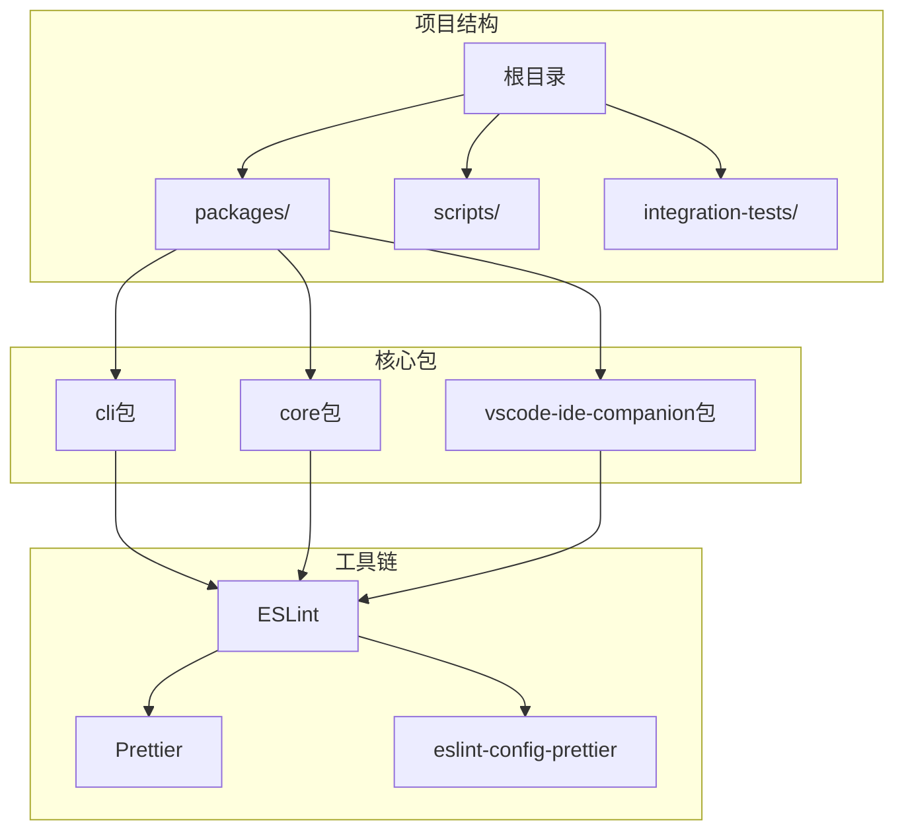
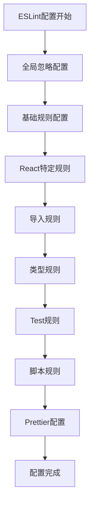
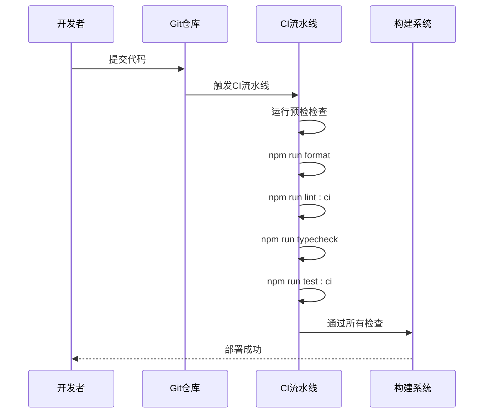

# 代码格式化配置

<cite>
**本文档引用的文件**
- [package.json](file://package.json)
- [eslint.config.js](file://eslint.config.js)
- [packages/cli/package.json](file://packages/cli/package.json)
- [packages/core/package.json](file://packages/core/package.json)
- [packages/vscode-ide-companion/eslint.config.mjs](file://packages/vscode-ide-companion/eslint.config.mjs)
- [README.md](file://README.md)
- [integration-tests/edit.test.ts](file://integration-tests/edit.test.ts)
</cite>

## 目录
1. [简介](#简介)
2. [项目架构概览](#项目架构概览)
3. [Prettier集成机制](#prettier集成机制)
4. [ESLint与Prettier配置](#eslint与prettier配置)
5. [本地开发环境配置](#本地开发环境配置)
6. [CI流水线中的格式化](#ci流水线中的格式化)
7. [团队协作最佳实践](#团队协作最佳实践)
8. [故障排除指南](#故障排除指南)
9. [总结](#总结)

## 简介

Qwen Code项目采用了现代化的代码格式化策略，通过ESLint与Prettier的深度集成来确保代码风格的一致性。该项目虽然没有传统的prettier.config.js配置文件，但通过eslint-config-prettier插件巧妙地消除了ESLint与Prettier之间的规则冲突，实现了高效的代码格式化流程。

项目的核心理念是将格式化责任委托给ESLint，利用其强大的插件生态系统来管理代码风格。这种设计不仅简化了配置复杂度，还提供了更灵活的规则定制能力。

## 项目架构概览



**图表来源**
- [package.json](file://package.json#L1-L112)
- [packages/cli/package.json](file://packages/cli/package.json#L1-L89)
- [packages/core/package.json](file://packages/core/package.json#L1-L90)

**章节来源**
- [package.json](file://package.json#L1-L112)
- [README.md](file://README.md#L1-L50)

## Prettier集成机制

### 核心集成策略

Qwen Code项目采用了创新的Prettier集成方式，通过以下机制实现代码格式化：

#### 1. 插件式集成

项目使用`eslint-config-prettier`插件来消除ESLint与Prettier之间的规则冲突：

```javascript
// 在ESLint配置中引入Prettier
import prettierConfig from 'eslint-config-prettier';

export default tseslint.config(
  // ... 其他配置
  prettierConfig,
);
```

#### 2. 默认配置策略

由于项目没有显式的prettier.config.js文件，它依赖于Prettier的默认配置：

- **缩进：2个空格**
- **引号：双引号**
- **分号：根据需要添加**
- **行尾：LF换行符**

#### 3. 实验性CLI支持

项目在package.json中定义了实验性的Prettier CLI命令：

```json
{
  "scripts": {
    "format": "prettier --experimental-cli --write ."
  }
}
```

**章节来源**
- [eslint.config.js](file://eslint.config.js#L10-L224)
- [package.json](file://package.json#L45-L45)

## ESLint与Prettier配置

### 主要ESLint配置结构



**图表来源**
- [eslint.config.js](file://eslint.config.js#L25-L224)

### 配置层次结构

#### 1. 全局忽略配置

```javascript
export default tseslint.config(
  {
    // 全局忽略
    ignores: [
      'node_modules/*',
      'eslint.config.js',
      'packages/**/dist/**',
      'bundle/**',
      'package/bundle/**',
      '.integration-tests/**',
    ],
  },
  // ... 其他配置
);
```

#### 2. 语言特定配置

项目为不同类型的文件定义了专门的配置：

- **TypeScript/TypeScript React文件**：`packages/*/src/**/*.{ts,tsx}`
- **测试文件**：`packages/*/src/**/*.test.{ts,tsx}`
- **脚本文件**：`./scripts/**/*.js`, `esbuild.config.js`

#### 3. 规则优先级

ESLint配置按照以下优先级顺序应用：

1. **基础规则**：ESLint推荐规则
2. **TypeScript规则**：TypeScript ESLint推荐规则
3. **React规则**：React插件规则
4. **导入规则**：自定义导入规则
5. **Prettier规则**：最后应用Prettier配置

**章节来源**
- [eslint.config.js](file://eslint.config.js#L25-L224)

## 本地开发环境配置

### VSCode编辑器配置

#### 1. 推荐扩展

开发人员应该安装以下VSCode扩展：

- **ESLint**：提供实时语法检查
- **Prettier**：代码格式化支持
- **TypeScript**：TypeScript语言支持

#### 2. 设置配置

在VSCode的settings.json中添加以下配置：

```json
{
  "editor.defaultFormatter": "esbenp.prettier-vscode",
  "editor.formatOnSave": true,
  "editor.codeActionsOnSave": {
    "source.fixAll.eslint": true
  },
  "[typescript]": {
    "editor.defaultFormatter": "esbenp.prettier-vscode"
  },
  "[typescriptreact]": {
    "editor.defaultFormatter": "esbenp.prettier-vscode"
  }
}
```

#### 3. 工作区配置

在项目根目录创建.vscode/settings.json：

```json
{
  "typescript.preferences.importModuleSpecifier": "relative",
  "typescript.suggest.autoImports": true,
  "typescript.format.enable": false,
  "eslint.format.enable": true
}
```

### 命令行格式化

#### 1. 项目级格式化

```bash
# 格式化整个项目
npm run format

# 检查格式问题而不修改文件
npx prettier --check .
```

#### 2. 包级格式化

每个子包都有独立的格式化脚本：

```bash
# CLI包格式化
cd packages/cli
npm run format

# Core包格式化
cd packages/core
npm run format
```

**章节来源**
- [package.json](file://package.json#L45-L45)
- [packages/cli/package.json](file://packages/cli/package.json#L18-L18)
- [packages/core/package.json](file://packages/core/package.json#L13-L13)

## CI流水线中的格式化

### 自动化流程



**图表来源**
- [package.json](file://package.json#L35-L40)

### 预检检查

项目定义了完整的预检检查流程：

```json
{
  "scripts": {
    "preflight": "npm run clean && npm ci && npm run format && npm run lint:ci && npm run build && npm run typecheck && npm run test:ci"
  }
}
```

### CI脚本执行

#### 1. 格式化检查

```bash
# 在CI环境中运行格式化检查
npm run format
```

#### 2. 严格检查模式

```bash
# 严格的CI检查模式
npm run lint:ci
```

#### 3. 多包构建

```bash
# 构建所有包
npm run build:packages
```

**章节来源**
- [package.json](file://package.json#L35-L40)

## 团队协作最佳实践

### 1. 代码风格一致性

#### 统一的编辑器设置

所有团队成员应该使用相同的编辑器配置：

```json
{
  "editor.tabSize": 2,
  "editor.insertSpaces": true,
  "editor.detectIndentation": false,
  "files.eol": "\n"
}
```

#### 版本控制钩子

在项目中添加pre-commit钩子：

```bash
#!/bin/sh
npm run format
npm run lint:fix
```

### 2. 贡献者指南

#### 提交规范

- 使用清晰的提交消息
- 遵循项目的代码风格
- 在提交前运行格式化检查

#### Pull Request流程

1. **本地格式化**：在创建PR前运行`npm run format`
2. **CI检查**：确保所有CI检查通过
3. **代码审查**：关注代码风格和质量

### 3. 教育和培训

#### 新成员培训

- 安装必要的编辑器扩展
- 配置本地开发环境
- 理解项目的格式化流程

#### 持续改进

- 定期评估格式化效果
- 收集团队反馈
- 优化配置参数

## 故障排除指南

### 常见问题及解决方案

#### 1. 格式化不生效

**问题**：运行`npm run format`后代码没有变化

**解决方案**：
```bash
# 清理缓存并重新安装依赖
npm run clean
npm ci

# 手动运行Prettier
npx prettier --write .
```

#### 2. ESLint与Prettier冲突

**问题**：ESLint报告格式化错误

**解决方案**：
```bash
# 检查ESLint配置
npm run lint:fix

# 确保eslint-config-prettier正确加载
npm list eslint-config-prettier
```

#### 3. 编辑器格式化异常

**问题**：VSCode中格式化功能不正常

**解决方案**：
```json
{
  "editor.formatOnSave": true,
  "editor.defaultFormatter": "esbenp.prettier-vscode",
  "eslint.format.enable": true,
  "typescript.format.enable": false
}
```

#### 4. CI流水线失败

**问题**：CI流水线中格式化检查失败

**解决方案**：
```bash
# 在本地重现CI检查
npm run preflight

# 或单独运行格式化检查
npm run format
npm run lint:ci
```

### 调试技巧

#### 1. 启用详细输出

```bash
# 启用调试模式
DEBUG=1 npm run format

# 查看详细的ESLint输出
npm run lint:ci -- --debug
```

#### 2. 检查配置

```bash
# 检查ESLint配置
npx eslint --print-config .

# 检查Prettier配置
npx prettier --find-config-path .
```

**章节来源**
- [package.json](file://package.json#L35-L40)

## 总结

Qwen Code项目通过创新的ESLint与Prettier集成策略，建立了一个高效、可维护的代码格式化体系。该体系的核心优势包括：

### 技术优势

1. **简化配置**：避免了复杂的prettier.config.js文件
2. **规则一致性**：通过eslint-config-prettier消除冲突
3. **灵活性**：支持自定义规则和覆盖
4. **性能优化**：减少重复的格式化处理

### 团队协作优势

1. **统一标准**：确保所有开发者遵循相同的标准
2. **自动化流程**：CI流水线自动检查格式化
3. **教育友好**：易于理解和维护的配置
4. **扩展性强**：支持未来的新需求和变更

### 最佳实践建议

1. **持续监控**：定期评估格式化效果和团队反馈
2. **渐进式改进**：逐步优化配置以适应项目发展
3. **文档维护**：保持文档与实际配置的一致性
4. **工具集成**：充分利用IDE和编辑器的格式化功能

通过这种精心设计的格式化配置，Qwen Code项目确保了代码质量和团队协作效率，为项目的长期发展奠定了坚实的基础。