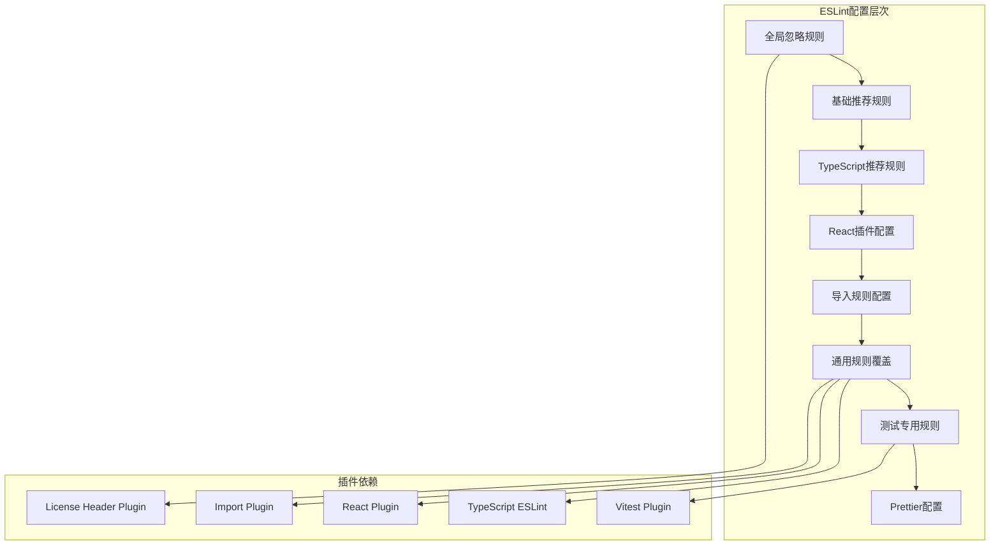
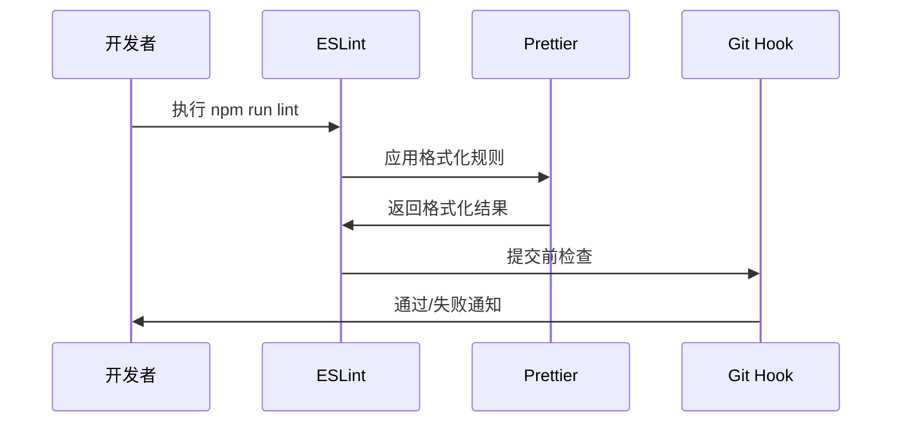
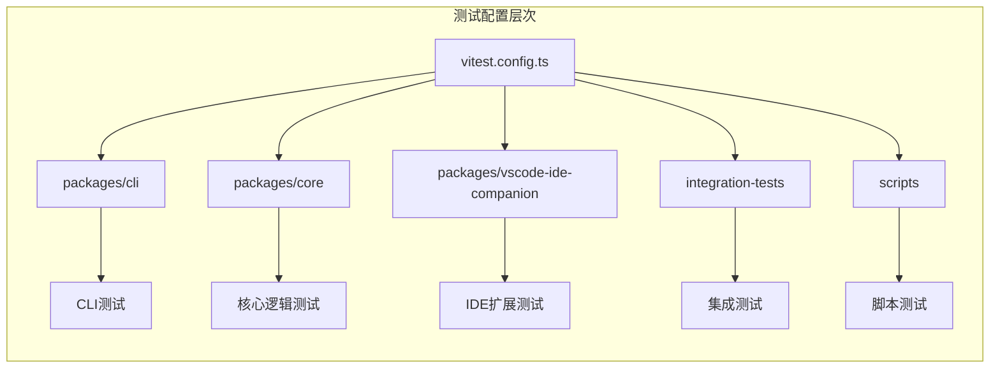
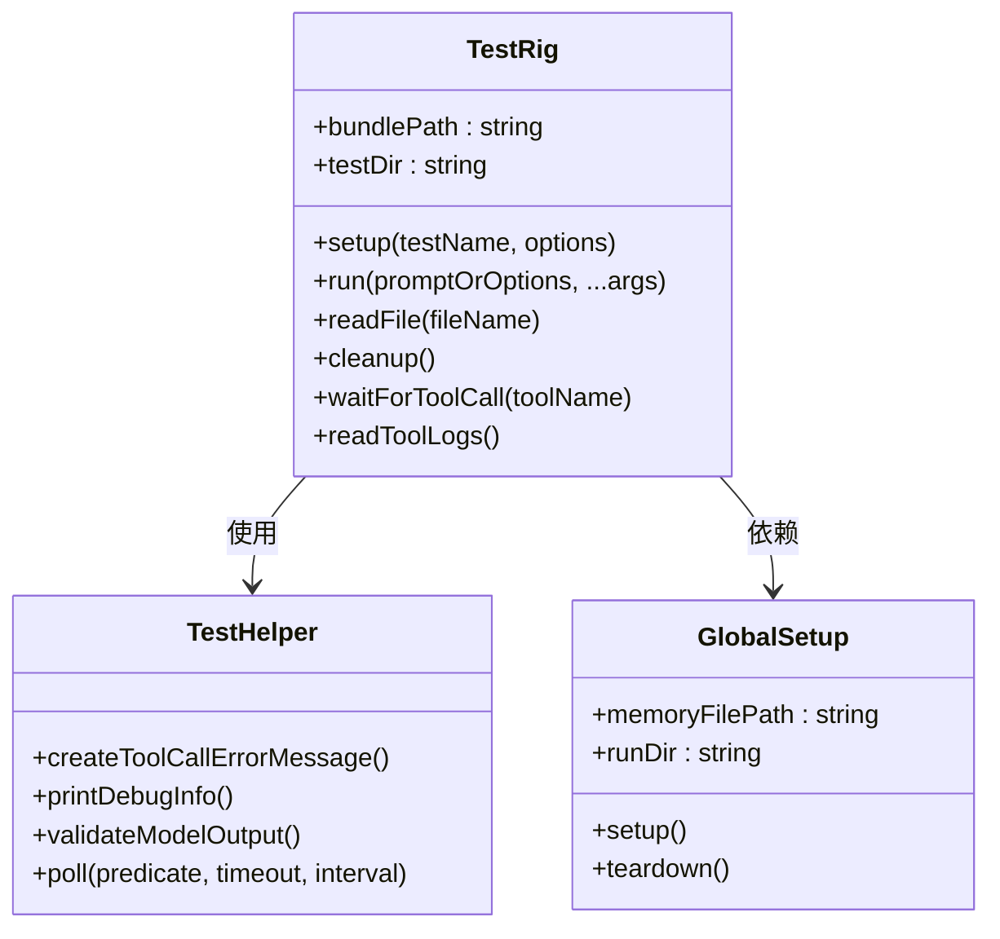
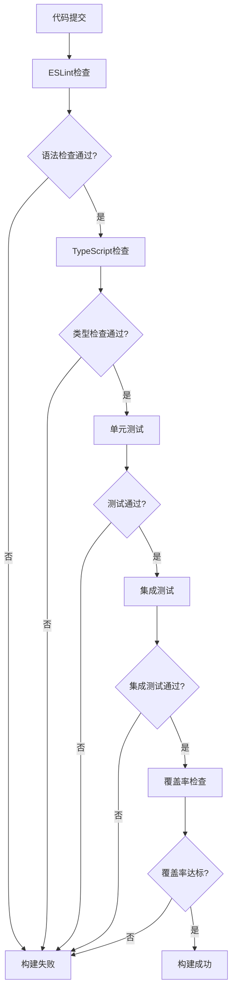
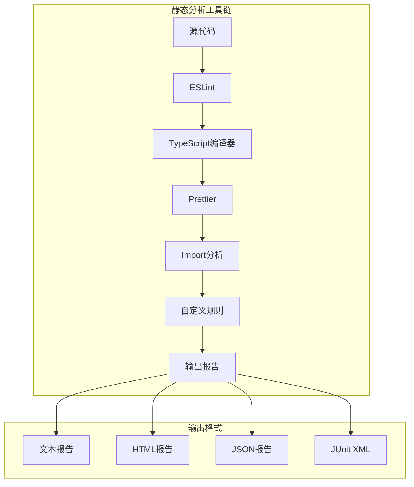
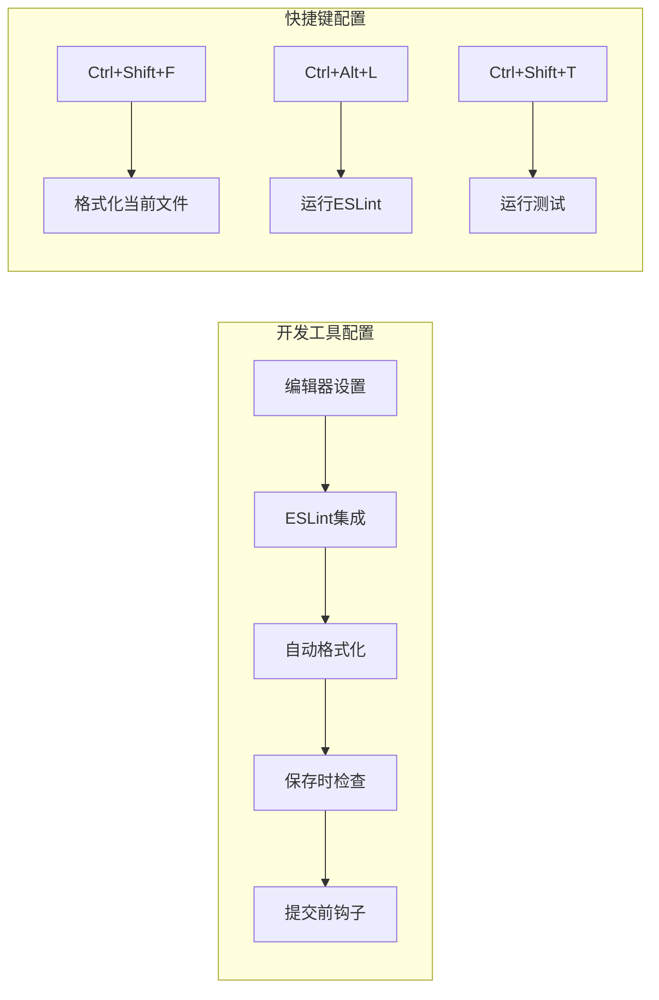

# 代码质量保证规范

<cite>
**本文档引用的文件**
- [eslint.config.js](file://eslint.config.js)
- [no-relative-cross-package-imports.js](file://eslint-rules/no-relative-cross-package-imports.js)
- [package.json](file://package.json)
- [vitest.config.ts](file://vitest.config.ts)
- [customMatchers.ts](file://packages/cli/src/test-utils/customMatchers.ts)
- [globalSetup.ts](file://integration-tests/globalSetup.ts)
- [terminal-bench.test.ts](file://integration-tests/terminal-bench/terminal-bench.test.ts)
- [test-helper.ts](file://integration-tests/test-helper.ts)
- [core/vitest.config.ts](file://packages/core/vitest.config.ts)
- [cli/vitest.config.ts](file://packages/cli/vitest.config.ts)
</cite>

## 目录
1. [简介](#简介)
2. [ESLint配置规范](#eslint配置规范)
3. [Prettier格式化配置](#prettier格式化配置)
4. [Vitest测试框架配置](#vitest测试框架配置)
5. [自定义规则与匹配器](#自定义规则与匹配器)
6. [测试覆盖率与质量门禁](#测试覆盖率与质量门禁)
7. [静态分析工具集成](#静态分析工具集成)
8. [CI流水线质量控制](#ci流水线质量控制)
9. [最佳实践建议](#最佳实践建议)
10. [故障排除指南](#故障排除指南)

## 简介

本规范文档旨在为项目开发团队提供全面的代码质量保证指导，确保项目代码的一致性、可维护性和高质量标准。通过实施严格的ESLint配置、Prettier格式化、Vitest测试框架以及完善的静态分析工具链，我们建立了完整的代码质量保障体系。

该项目采用Monorepo架构，包含多个子包（packages），每个子包都有独立的配置和测试要求。通过统一的质量标准和自动化检查机制，确保所有代码都符合既定的质量规范。

## ESLint配置规范

### 核心ESLint配置架构

项目采用了最新的Flat Config格式，提供了高度模块化的配置方式。主要配置分为以下几个层次：



**图表来源**
- [eslint.config.js](file://eslint.config.js#L26-L247)

### 自定义规则详解

#### no-relative-cross-package-imports.js

这是项目的核心自定义规则，专门用于防止跨包相对路径导入问题：

```javascript
// 规则核心功能：检测并阻止跨包相对导入
if (currentPackage !== importedPackage) {
  context.report({
    node: node.source,
    messageId: 'noRelativePathsForCrossPackageImport',
    data: {
      importedPath,
      importedPackage,
      importingPackage,
    },
    fix(fixer) {
      return fixer.replaceText(node.source, `'${importedPackage}'`);
    },
  });
}
```

**规则特点：**
- **自动修复**：当检测到跨包相对导入时，自动转换为直接包导入
- **包边界识别**：通过查找package.json文件确定包边界
- **错误报告**：提供详细的错误信息，包括源包、目标包和导入路径

**使用场景：**
- Monorepo项目中的包间通信
- 防止循环依赖
- 维护清晰的模块边界

**章节来源**
- [eslint.config.js](file://eslint.config.js#L100-L150)
- [no-relative-cross-package-imports.js](file://eslint-rules/no-relative-cross-package-imports.js#L1-L160)

### TypeScript配置优化

项目使用了严格的TypeScript编译选项，确保类型安全：

```json
{
  "strict": true,
  "noImplicitAny": true,
  "noImplicitOverride": true,
  "noImplicitReturns": true,
  "noImplicitThis": true,
  "strictBindCallApply": true,
  "strictFunctionTypes": true,
  "strictNullChecks": true,
  "strictPropertyInitialization": true
}
```

**章节来源**
- [tsconfig.json](file://tsconfig.json#L1-L30)

## Prettier格式化配置

### 集成策略

项目通过ESLint配置集成了Prettier，实现了代码格式化的统一管理：



**图表来源**
- [package.json](file://package.json#L30-L50)

### 编辑器集成

项目支持多种编辑器的自动格式化：

- **VS Code**: 通过`.vscode/settings.json`配置
- **WebStorm**: 内置ESLint支持
- **Vim/Neovim**: 通过ALE或coc.nvim集成

**章节来源**
- [package.json](file://package.json#L30-L50)

## Vitest测试框架配置

### 多项目测试配置

项目采用分层的测试配置，支持不同类型的测试需求：



**图表来源**
- [vitest.config.ts](file://vitest.config.ts#L1-L14)

### 测试覆盖率配置

各子包都有独立的覆盖率配置：

```typescript
// 核心包覆盖率配置示例
coverage: {
  enabled: true,
  provider: 'v8',
  reportsDirectory: './coverage',
  include: ['src/**/*'],
  reporter: [
    ['text', { file: 'full-text-summary.txt' }],
    'html',
    'json',
    'lcov',
    'cobertura',
    ['json-summary', { outputFile: 'coverage-summary.json' }],
  ],
}
```

**章节来源**
- [core/vitest.config.ts](file://packages/core/vitest.config.ts#L10-L25)
- [cli/vitest.config.ts](file://packages/cli/vitest.config.ts#L15-L30)

### 测试环境配置

项目支持多种测试环境：

- **JSDOM**: 用于UI组件测试
- **Node.js**: 用于服务端逻辑测试
- **浏览器**: 用于前端交互测试

## 自定义规则与匹配器

### 自定义匹配器实现

项目在CLI包中实现了专门的自定义匹配器：

```typescript
function toHaveOnlyValidCharacters(this: Assertion, buffer: TextBuffer) {
  const { isNot } = this as any;
  let pass = true;
  const invalidLines: Array<{ line: number; content: string }> = [];

  for (let i = 0; i < buffer.lines.length; i++) {
    const line = buffer.lines[i];
    if (line.includes('\n')) {
      pass = false;
      invalidLines.push({ line: i, content: line });
      break; // Fail fast on newlines
    }
    if (invalidCharsRegex.test(line)) {
      pass = false;
      invalidLines.push({ line: i, content: line });
    }
  }

  return {
    pass,
    message: () => `Expected buffer ${isNot ? 'not ' : ''}to have only valid characters`,
    actual: buffer.lines,
    expected: 'Lines with no line breaks, backspaces, or escape codes.',
  };
}
```

**匹配器特点：**
- **类型安全**: 完整的TypeScript类型定义
- **错误提示**: 详细的错误信息和行号定位
- **快速失败**: 发现第一个问题立即停止检查

**章节来源**
- [customMatchers.ts](file://packages/cli/src/test-utils/customMatchers.ts#L15-L66)

### 测试辅助工具

项目提供了丰富的测试辅助工具：



**图表来源**
- [test-helper.ts](file://integration-tests/test-helper.ts#L100-L200)
- [globalSetup.ts](file://integration-tests/globalSetup.ts#L20-L80)

**章节来源**
- [test-helper.ts](file://integration-tests/test-helper.ts#L1-L723)
- [globalSetup.ts](file://integration-tests/globalSetup.ts#L1-L101)

## 测试覆盖率与质量门禁

### 覆盖率目标

项目设定了明确的覆盖率目标：

- **最小覆盖率**: 80%
- **核心模块**: 90%+
- **关键路径**: 100%

### 质量门禁配置



**章节来源**
- [package.json](file://package.json#L30-L50)

## 静态分析工具集成

### 多层次静态分析

项目实现了多层次的静态分析：

1. **语法检查**: ESLint + TypeScript
2. **代码质量**: Prettier格式化
3. **依赖分析**: Import插件
4. **自定义规则**: 交叉包导入检测

### 分析工具链



**章节来源**
- [eslint.config.js](file://eslint.config.js#L1-L247)

## CI流水线质量控制

### CI配置策略

项目在CI环境中实施严格的质量控制：

```yaml
# CI质量检查流程
- npm run lint:ci          # 严格语法检查
- npm run typecheck        # 类型安全检查  
- npm run test:ci         # 测试执行
- npm run build           # 构建验证
- npm run preflight      # 全面预检
```

### 环境特定配置

不同环境有不同的质量要求：

- **本地开发**: 宽松检查，支持快速迭代
- **CI环境**: 严格检查，确保代码质量
- **生产部署**: 最终验证，禁止任何警告

**章节来源**
- [package.json](file://package.json#L30-L50)

## 最佳实践建议

### 编码阶段质量保证

1. **编写高质量测试**
   - 每个新功能至少包含单元测试
   - 使用自定义匹配器提高断言精度
   - 实施测试驱动开发(TDD)

2. **遵循ESLint规则**
   - 及时修复ESLint警告
   - 利用自动修复功能
   - 理解规则背后的原理

3. **代码审查要点**
   - 检查是否违反自定义规则
   - 验证测试覆盖率
   - 确保类型安全

### 开发工具配置



### 团队协作规范

1. **代码风格一致性**
   - 统一使用ESLint配置
   - 定期同步更新规则
   - 新成员培训

2. **测试编写规范**
   - 测试命名约定
   - 测试数据准备
   - 错误处理验证

3. **持续改进**
   - 定期评估规则有效性
   - 收集团队反馈
   - 适时调整配置

## 故障排除指南

### 常见问题解决

#### ESLint配置问题

**问题**: 自定义规则不生效
**解决方案**: 
1. 检查规则路径配置
2. 确认文件扩展名匹配
3. 验证规则元数据定义

**问题**: 导入规则冲突
**解决方案**:
1. 检查导入解析器配置
2. 确认包路径别名设置
3. 验证模块解析顺序

#### 测试相关问题

**问题**: 测试覆盖率不足
**解决方案**:
1. 检查测试文件命名
2. 确认覆盖率配置路径
3. 添加缺失的测试用例

**问题**: 测试超时
**解决方案**:
1. 检查异步操作处理
2. 优化测试数据量
3. 调整超时时间设置

#### CI流水线问题

**问题**: 构建失败
**解决方案**:
1. 查看完整错误日志
2. 检查依赖版本兼容性
3. 验证环境变量配置

### 调试技巧

1. **启用详细日志**
   ```bash
   VERBOSE=true npm run test
   ```

2. **保留测试输出**
   ```bash
   KEEP_OUTPUT=true npm run test
   ```

3. **单个测试调试**
   ```bash
   vitest run --testNamePattern="specific test name"
   ```

### 性能优化

1. **测试并行执行**
   - 启用文件级并行
   - 优化测试隔离
   - 减少共享状态

2. **缓存利用**
   - 启用TypeScript增量编译
   - 利用ESLint缓存
   - 优化依赖解析

3. **资源管理**
   - 及时清理测试资源
   - 控制并发测试数量
   - 监控内存使用

通过遵循这些规范和最佳实践，开发团队可以确保代码质量的一致性，减少技术债务，并提高项目的可维护性和可靠性。定期回顾和更新这些规范，以适应项目的发展和技术的进步。