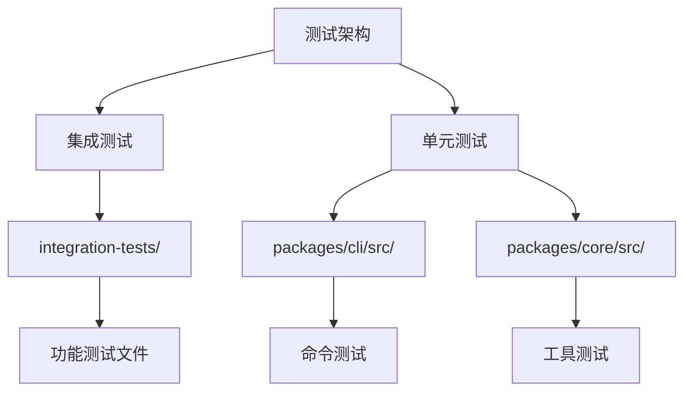
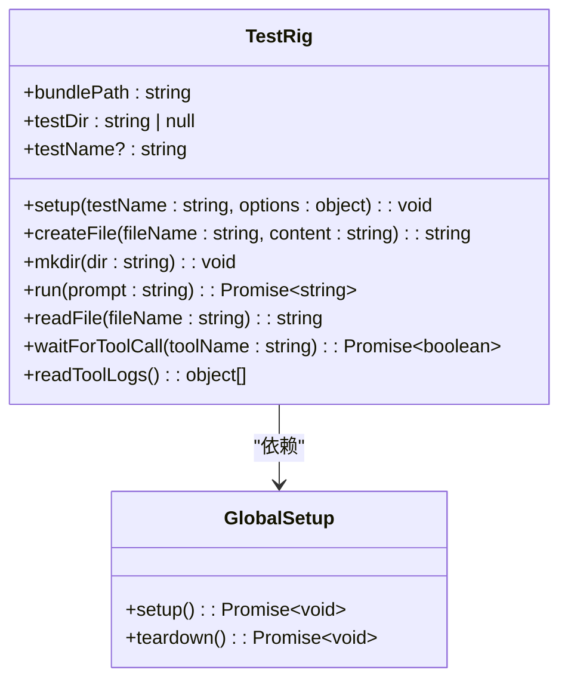
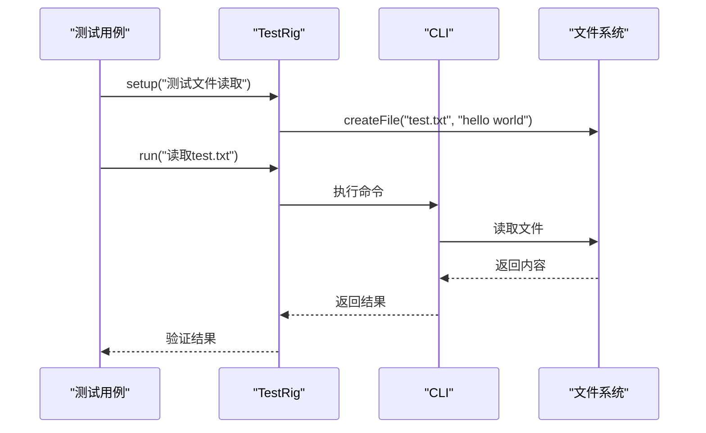
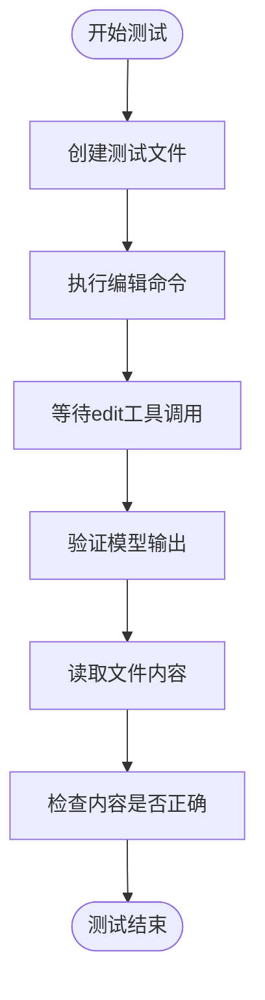
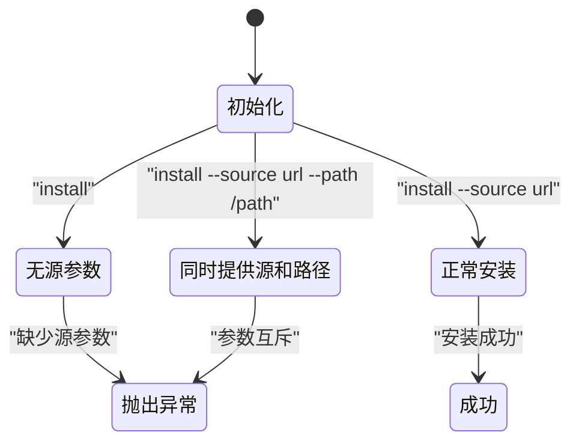
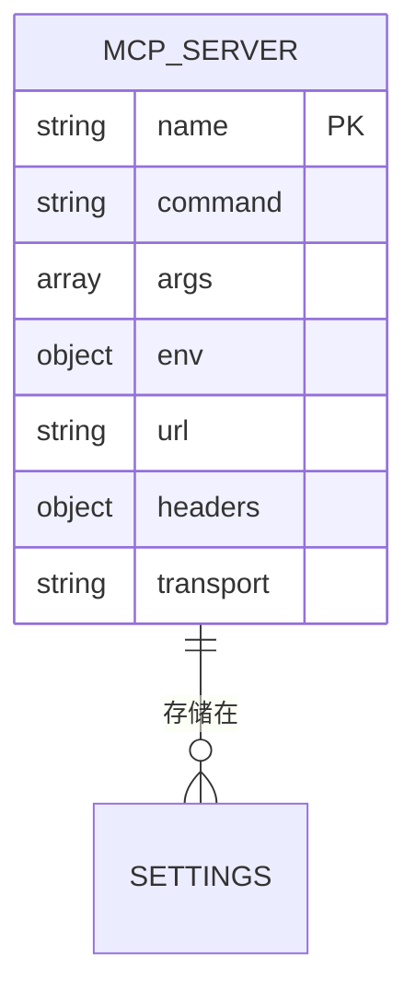
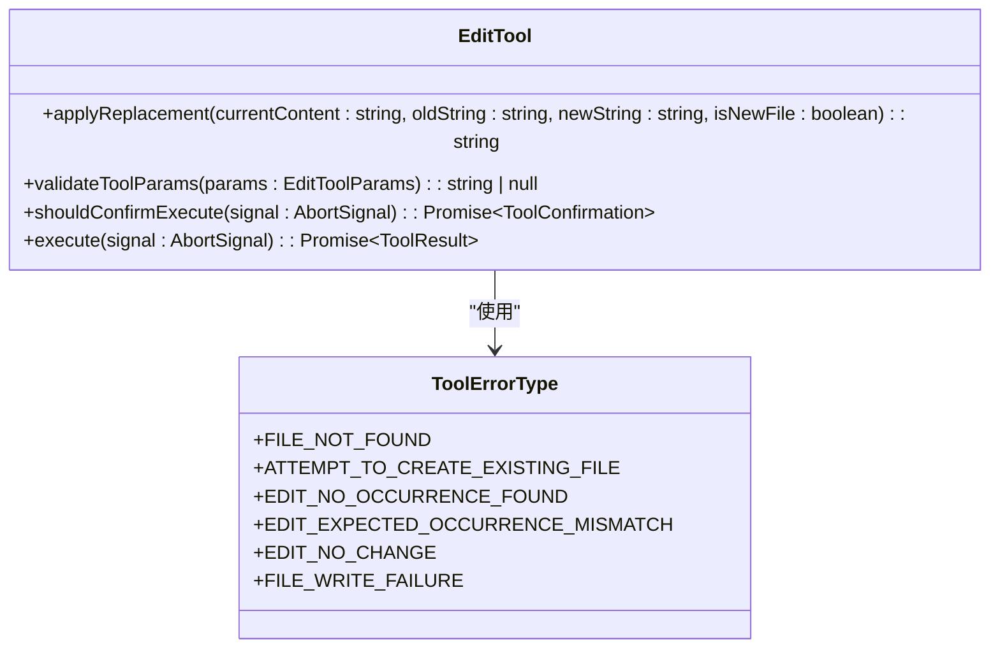
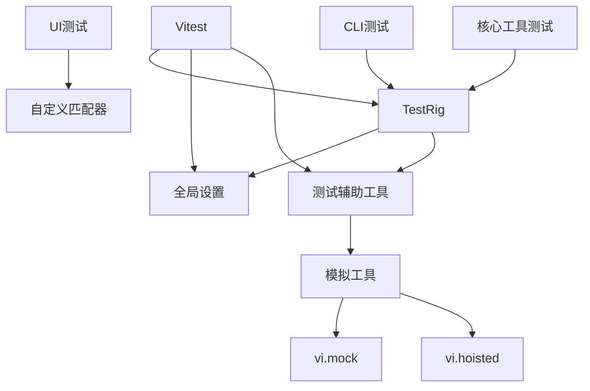

# 测试实践与用例

<cite>
**本文档中引用的文件**  
- [edit.test.ts](file://integration-tests/edit.test.ts)
- [file-system.test.ts](file://integration-tests/file-system.test.ts)
- [globalSetup.ts](file://integration-tests/globalSetup.ts)
- [test-helper.ts](file://integration-tests/test-helper.ts)
- [install.test.ts](file://packages/cli/src/commands/extensions/install.test.ts)
- [add.test.ts](file://packages/cli/src/commands/mcp/add.test.ts)
- [edit.test.ts](file://packages/core/src/tools/edit.test.ts)
- [mockWorkspaceContext.ts](file://packages/core/src/test-utils/mockWorkspaceContext.ts)
- [customMatchers.ts](file://packages/cli/src/test-utils/customMatchers.ts)
- [vitest.config.ts](file://vitest.config.ts)
- [integration-tests/vitest.config.ts](file://integration-tests/vitest.config.ts)
- [packages/cli/vitest.config.ts](file://packages/cli/vitest.config.ts)
</cite>

## 目录
1. [简介](#简介)
2. [项目结构与测试组织](#项目结构与测试组织)
3. [核心测试组件](#核心测试组件)
4. [集成测试架构](#集成测试架构)
5. [详细组件分析](#详细组件分析)
6. [依赖关系分析](#依赖关系分析)
7. [性能考量](#性能考量)
8. [故障排除指南](#故障排除指南)
9. [结论](#结论)

## 简介
本文档全面介绍项目中的测试实践，涵盖集成测试和单元测试的具体用例。重点分析`integration-tests`目录下各类测试文件如何验证核心功能的正确性，包括文件系统操作、shell命令执行、MCP服务器交互等。同时探讨CLI命令测试如何确保用户指令的准确解析与执行，并说明测试中使用的模拟策略、异步测试处理机制以及测试上下文的构建方法。

## 项目结构与测试组织
项目采用分层的测试架构，将测试分为集成测试和单元测试两大类。集成测试位于`integration-tests`目录下，而单元测试则分散在各个包的`src`目录中。这种组织方式使得测试既能够验证单个组件的功能，又能够测试整个系统的集成行为。

**Diagram sources**
- [integration-tests](file://integration-tests)
- [packages/cli/src](file://packages/cli/src)
- [packages/core/src](file://packages/core/src)

**Section sources**
- [integration-tests](file://integration-tests)
- [packages/cli/src](file://packages/cli/src)
- [packages/core/src](file://packages/core/src)

## 核心测试组件
项目中的核心测试组件包括TestRig类、全局设置文件和各种测试辅助工具。这些组件共同构成了一个完整的测试框架，支持各种类型的测试需求。

**Section sources**
- [test-helper.ts](file://integration-tests/test-helper.ts)
- [globalSetup.ts](file://integration-tests/globalSetup.ts)

## 集成测试架构
集成测试架构基于Vitest框架构建，通过TestRig类提供统一的测试环境。每个测试用例都运行在一个隔离的目录中，确保测试之间的独立性。

**Diagram sources**
- [test-helper.ts](file://integration-tests/test-helper.ts#L72-L722)
- [globalSetup.ts](file://integration-tests/globalSetup.ts#L0-L100)

## 详细组件分析

### 集成测试用例分析
集成测试用例主要验证系统的核心功能，包括文件系统操作、shell命令执行和MCP服务器交互等。

#### 文件系统操作测试
文件系统操作测试验证了读取和写入文件的功能。测试用例通过创建测试文件，然后执行相应的命令来验证功能的正确性。

**Diagram sources**
- [file-system.test.ts](file://integration-tests/file-system.test.ts#L0-L89)
- [test-helper.ts](file://integration-tests/test-helper.ts#L72-L722)

#### 编辑功能测试
编辑功能测试验证了文件编辑功能的正确性，包括内容替换和新文件创建等场景。

**Diagram sources**
- [edit.test.ts](file://integration-tests/edit.test.ts#L0-L64)
- [test-helper.ts](file://integration-tests/test-helper.ts#L72-L722)

### CLI命令测试分析
CLI命令测试主要验证各种命令行选项的解析和执行逻辑。

#### 扩展安装命令测试
扩展安装命令测试验证了安装命令的各种参数组合和错误情况。

**Diagram sources**
- [install.test.ts](file://packages/cli/src/commands/extensions/install.test.ts#L0-L31)

#### MCP服务器添加命令测试
MCP服务器添加命令测试验证了不同类型服务器（stdio、sse、http）的添加逻辑。

**Diagram sources**
- [add.test.ts](file://packages/cli/src/commands/mcp/add.test.ts#L0-L122)

### 单元测试分析
单元测试主要验证单个工具和组件的功能，使用了大量的模拟技术。

#### 编辑工具单元测试
编辑工具的单元测试覆盖了各种场景，包括正常编辑、文件创建、错误处理等。

**Diagram sources**
- [edit.test.ts](file://packages/core/src/tools/edit.test.ts#L0-L722)

## 依赖关系分析
项目中的测试依赖关系清晰，各组件之间的耦合度适中，便于独立测试和维护。

**Diagram sources**
- [vitest.config.ts](file://vitest.config.ts#L0-L13)
- [integration-tests/vitest.config.ts](file://integration-tests/vitest.config.ts#L0-L22)
- [packages/cli/vitest.config.ts](file://packages/cli/vitest.config.ts#L0-L37)

## 性能考量
测试框架在性能方面做了多项优化，包括超时设置、并行测试执行和资源清理等。

**Section sources**
- [integration-tests/vitest.config.ts](file://integration-tests/vitest.config.ts#L0-L22)
- [test-helper.ts](file://integration-tests/test-helper.ts#L72-L722)

## 故障排除指南
当测试失败时，可以使用以下方法进行故障排除：

1. 检查测试输出中的调试信息
2. 验证测试环境变量设置
3. 查看生成的测试日志文件
4. 使用VERBOSE环境变量获取更多详细信息

**Section sources**
- [test-helper.ts](file://integration-tests/test-helper.ts#L72-L722)
- [globalSetup.ts](file://integration-tests/globalSetup.ts#L0-L100)

## 结论
本项目建立了完善的测试体系，涵盖了从单元测试到集成测试的各个方面。通过使用Vitest框架和自定义的TestRig类，实现了高效、可靠的测试流程。测试用例覆盖了核心功能的各种场景，包括正常情况和错误处理，确保了系统的稳定性和可靠性。