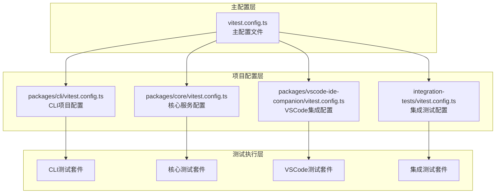
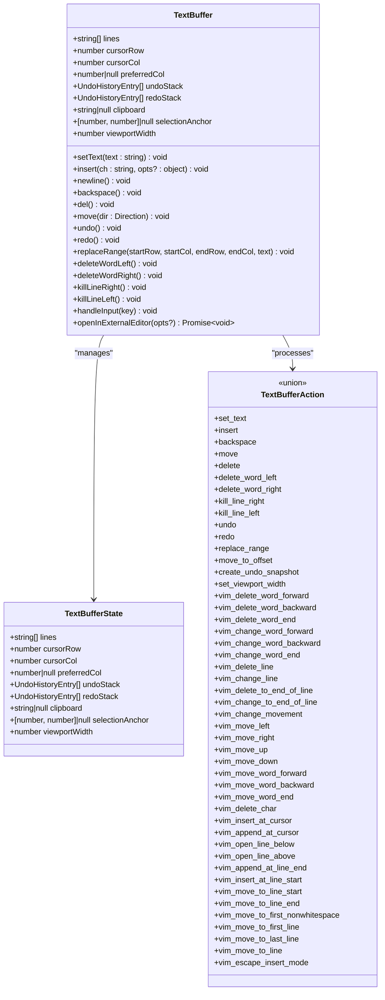
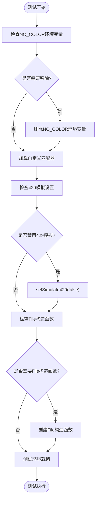
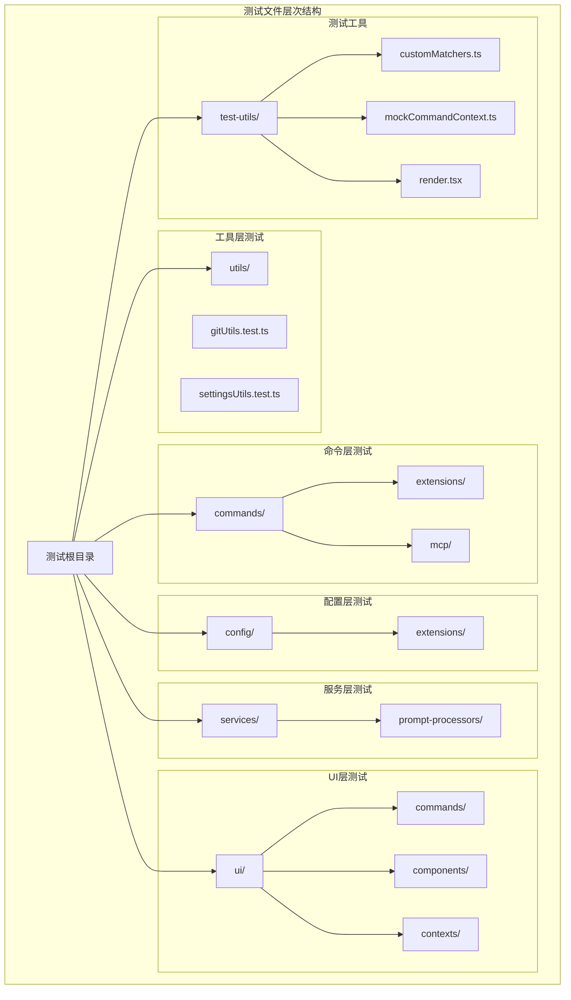
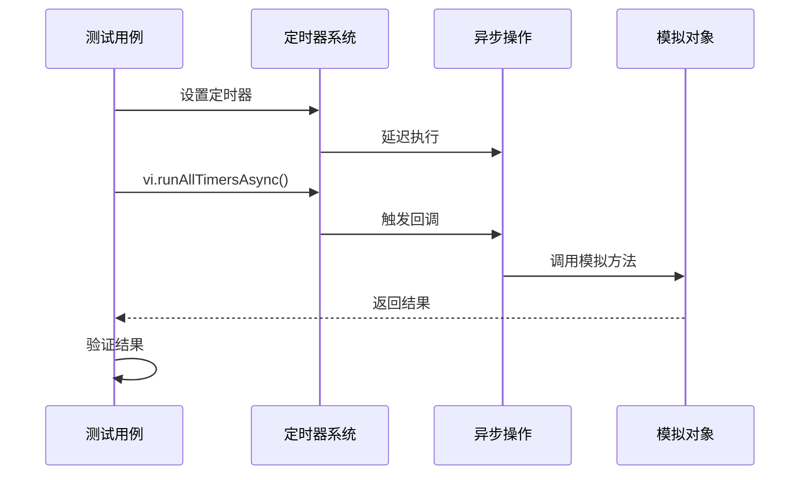
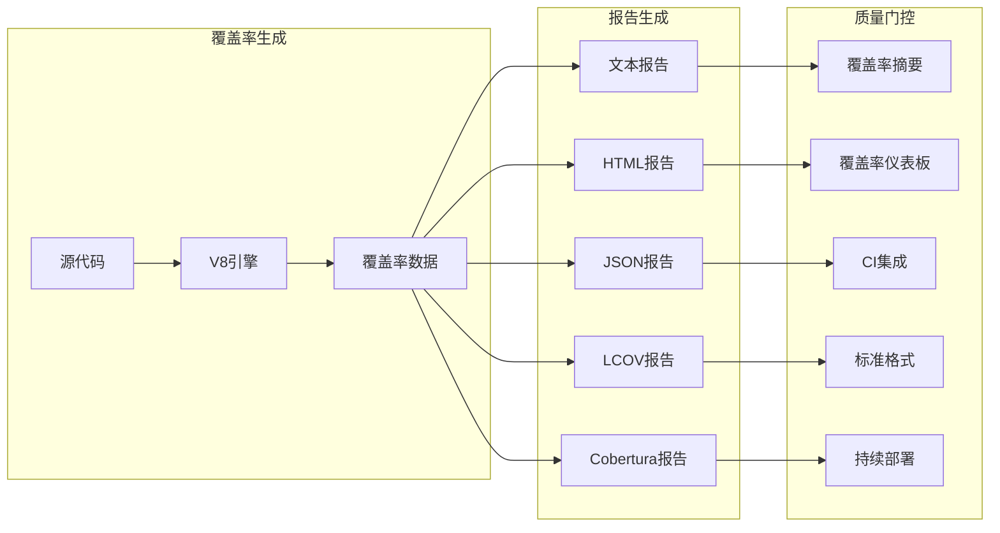

# 测试框架与配置

<cite>
**本文档引用的文件**
- [vitest.config.ts](file://vitest.config.ts)
- [packages/cli/vitest.config.ts](file://packages/cli/vitest.config.ts)
- [packages/core/vitest.config.ts](file://packages/core/vitest.config.ts)
- [packages/vscode-ide-companion/vitest.config.ts](file://packages/vscode-ide-companion/vitest.config.ts)
- [integration-tests/vitest.config.ts](file://integration-tests/vitest.config.ts)
- [packages/cli/src/test-utils/customMatchers.ts](file://packages/cli/src/test-utils/customMatchers.ts)
- [packages/cli/test-setup.ts](file://packages/cli/test-setup.ts)
- [packages/core/test-setup.ts](file://packages/core/test-setup.ts)
- [packages/cli/src/ui/components/shared/text-buffer.ts](file://packages/cli/src/ui/components/shared/text-buffer.ts)
</cite>

## 目录
1. [简介](#简介)
2. [项目测试架构概览](#项目测试架构概览)
3. [Vitest多项目配置](#vitest多项目配置)
4. [自定义匹配器详解](#自定义匹配器详解)
5. [测试环境设置](#测试环境设置)
6. [测试文件组织结构](#测试文件组织结构)
7. [异步测试处理](#异步测试处理)
8. [模拟策略](#模拟策略)
9. [测试覆盖率与报告](#测试覆盖率与报告)
10. [最佳实践指南](#最佳实践指南)
11. [故障排除](#故障排除)

## 简介

本项目采用Vitest作为主要的测试框架，构建了一个完整的测试生态系统。通过精心设计的多项目配置架构，实现了对CLI工具、核心服务、VSCode集成伴侣以及集成测试的全面覆盖。本文档将深入解析Vitest配置方案、自定义匹配器的实现原理，以及如何为不同类型组件编写高效可靠的测试。

## 项目测试架构概览

项目的测试架构采用了分层设计，通过主配置文件统一管理多个子项目的测试配置：



**图表来源**
- [vitest.config.ts](file://vitest.config.ts#L1-L14)
- [packages/cli/vitest.config.ts](file://packages/cli/vitest.config.ts#L1-L38)
- [packages/core/vitest.config.ts](file://packages/core/vitest.config.ts#L1-L33)
- [packages/vscode-ide-companion/vitest.config.ts](file://packages/vscode-ide-companion/vitest.config.ts#L1-L16)
- [integration-tests/vitest.config.ts](file://integration-tests/vitest.config.ts#L1-L23)

**章节来源**
- [vitest.config.ts](file://vitest.config.ts#L1-L14)

## Vitest多项目配置

### 主配置文件结构

主配置文件定义了整个项目的测试项目结构，通过`projects`数组指定各个子项目的测试配置路径：

```typescript
export default defineConfig({
  test: {
    projects: [
      'packages/cli',
      'packages/core',
      'packages/vscode-ide-companion',
      'integration-tests',
      'scripts',
    ],
  },
});
```

### CLI项目配置详解

CLI项目配置针对React组件和TypeScript应用进行了专门优化：

```typescript
export default defineConfig({
  test: {
    include: ['**/*.{test,spec}.?(c|m)[jt]s?(x)', 'config.test.ts'],
    exclude: ['**/node_modules/**', '**/dist/**', '**/cypress/**'],
    environment: 'jsdom',
    globals: true,
    reporters: ['default', 'junit'],
    silent: true,
    outputFile: {
      junit: 'junit.xml',
    },
    setupFiles: ['./test-setup.ts'],
    coverage: {
      enabled: true,
      provider: 'v8',
      reportsDirectory: './coverage',
      include: ['src/**/*'],
      reporter: [
        ['text', { file: 'full-text-summary.txt' }],
        'html',
        'json',
        'lcov',
        'cobertura',
        ['json-summary', { outputFile: 'coverage-summary.json' }],
      ],
    },
  },
});
```

### 核心服务配置特点

核心服务配置专注于纯JavaScript/TypeScript测试，提供了简洁而高效的配置：

```typescript
export default defineConfig({
  test: {
    reporters: ['default', 'junit'],
    silent: true,
    setupFiles: ['./test-setup.ts'],
    outputFile: {
      junit: 'junit.xml',
    },
    coverage: {
      enabled: true,
      provider: 'v8',
      reportsDirectory: './coverage',
      include: ['src/**/*'],
      reporter: [
        ['text', { file: 'full-text-summary.txt' }],
        'html',
        'json',
        'lcov',
        'cobertura',
        ['json-summary', { outputFile: 'coverage-summary.json' }],
      ],
    },
  },
});
```

### VSCode集成配置

VSCode集成项目配置针对Node.js环境进行了优化，专注于后端服务测试：

```typescript
export default defineConfig({
  test: {
    globals: true,
    environment: 'node',
    include: ['src/**/*.test.ts'],
    coverage: {
      provider: 'v8',
      reporter: ['text', 'json', 'html', 'clover'],
      include: ['src/**/*.ts'],
      exclude: ['src/**/*.test.ts', 'src/**/*.d.ts'],
    },
  },
});
```

**章节来源**
- [packages/cli/vitest.config.ts](file://packages/cli/vitest.config.ts#L1-L38)
- [packages/core/vitest.config.ts](file://packages/core/vitest.config.ts#L1-L33)
- [packages/vscode-ide-companion/vitest.config.ts](file://packages/vscode-ide-companion/vitest.config.ts#L1-L16)

## 自定义匹配器详解

### toHaveOnlyValidCharacters匹配器实现

项目中最引人注目的自定义匹配器是`toHaveOnlyValidCharacters`，专门用于验证TextBuffer组件中的文本字符有效性：

```typescript
function toHaveOnlyValidCharacters(this: Assertion, buffer: TextBuffer) {
  const { isNot } = this as any;
  let pass = true;
  const invalidLines: Array<{ line: number; content: string }> = [];

  for (let i = 0; i < buffer.lines.length; i++) {
    const line = buffer.lines[i];
    if (line.includes('\n')) {
      pass = false;
      invalidLines.push({ line: i, content: line });
      break; // Fail fast on newlines
    }
    if (invalidCharsRegex.test(line)) {
      pass = false;
      invalidLines.push({ line: i, content: line });
    }
  }

  return {
    pass,
    message: () =>
      `Expected buffer ${isNot ? 'not ' : ''}to have only valid characters, but found invalid characters in lines:\n${invalidLines
        .map((l) => `  [${l.line}]: "${l.content}"`)
        .join('\n')}`,
    actual: buffer.lines,
    expected: 'Lines with no line breaks, backspaces, or escape codes.',
  };
}
```

### 匹配器使用场景分析

该匹配器专门针对以下场景设计：

1. **文本缓冲区验证**：确保TextBuffer组件不会包含无效字符
2. **ANSI转义码检测**：识别并阻止ANSI控制序列
3. **回退字符处理**：防止退格符等控制字符影响显示
4. **跨平台兼容性**：确保在不同操作系统上的一致行为

### 匹配器类型定义

```typescript
declare module 'vitest' {
  interface Assertion<T> {
    toHaveOnlyValidCharacters(): T;
  }
  interface AsymmetricMatchersContaining {
    toHaveOnlyValidCharacters(): void;
  }
}
```

### TextBuffer组件集成

TextBuffer组件是一个复杂的React状态管理组件，负责处理编辑器的各种操作：



**图表来源**
- [packages/cli/src/ui/components/shared/text-buffer.ts](file://packages/cli/src/ui/components/shared/text-buffer.ts#L830-L850)
- [packages/cli/src/ui/components/shared/text-buffer.ts](file://packages/cli/src/ui/components/shared/text-buffer.ts#L852-L950)

**章节来源**
- [packages/cli/src/test-utils/customMatchers.ts](file://packages/cli/src/test-utils/customMatchers.ts#L1-L67)
- [packages/cli/src/ui/components/shared/text-buffer.ts](file://packages/cli/src/ui/components/shared/text-buffer.ts#L1-L100)

## 测试环境设置

### CLI项目测试设置

CLI项目的测试设置文件负责清理环境变量并导入自定义匹配器：

```typescript
// Unset NO_COLOR environment variable to ensure consistent theme behavior between local and CI test runs
if (process.env['NO_COLOR'] !== undefined) {
  delete process.env['NO_COLOR'];
}

import './src/test-utils/customMatchers.js';
```

### 核心服务测试设置

核心服务的测试设置更加复杂，包含了全局配置和环境准备：

```typescript
// Unset NO_COLOR environment variable to ensure consistent theme behavior between local and CI test runs
if (process.env['NO_COLOR'] !== undefined) {
  delete process.env['NO_COLOR'];
}

import { setSimulate429 } from './src/utils/testUtils.js';

// Disable 429 simulation globally for all tests
setSimulate429(false);

// Some dependencies (e.g., undici) expect a global File constructor in Node.
// Provide a minimal shim for test environment if missing.
if (typeof (globalThis as unknown as { File?: unknown }).File === 'undefined') {
  (globalThis as unknown as { File: unknown }).File = class {} as unknown;
}
```

### 全局设置流程



**图表来源**
- [packages/cli/test-setup.ts](file://packages/cli/test-setup.ts#L1-L13)
- [packages/core/test-setup.ts](file://packages/core/test-setup.ts#L1-L22)

**章节来源**
- [packages/cli/test-setup.ts](file://packages/cli/test-setup.ts#L1-L13)
- [packages/core/test-setup.ts](file://packages/core/test-setup.ts#L1-L22)

## 测试文件组织结构

### 按功能模块组织

测试文件按照功能模块进行组织，每个模块都有清晰的职责分工：

```
packages/
├── cli/
│   ├── src/
│   │   ├── commands/
│   │   │   ├── extensions/
│   │   │   ├── mcp/
│   │   │   └── ...
│   │   ├── config/
│   │   │   ├── extensions/
│   │   │   ├── config.test.ts
│   │   │   └── ...
│   │   ├── services/
│   │   │   ├── prompt-processors/
│   │   │   ├── CommandService.test.ts
│   │   │   └── ...
│   │   ├── ui/
│   │   │   ├── commands/
│   │   │   ├── components/
│   │   │   ├── contexts/
│   │   │   └── ...
│   │   └── utils/
│   │       ├── gitUtils.test.ts
│   │       ├── settingsUtils.test.ts
│   │       └── ...
│   ├── test-utils/
│   │   ├── customMatchers.ts
│   │   ├── mockCommandContext.ts
│   │   └── render.tsx
│   └── vitest.config.ts
```

### 测试文件命名规范

项目遵循严格的测试文件命名规范：
- `*.test.ts` - TypeScript测试文件
- `*.test.tsx` - React组件测试文件
- `*.spec.ts` - 规范测试文件
- 特殊测试文件：`config.test.ts`, `globalSetup.ts`

### 测试文件层次结构



## 异步测试处理

### 定时器模拟

项目广泛使用定时器模拟来处理异步操作，特别是在重试机制和延迟操作中：

```typescript
// 使用定时器模拟来测试异步操作
const setTimeoutSpy = vi.spyOn(global, 'setTimeout');

// 运行所有定时器以完成异步操作
await vi.runAllTimersAsync();

// 验证定时器调用次数和参数
expect(setTimeoutSpy).toHaveBeenCalledTimes(expectedCalls);
```

### 异步测试模式



**图表来源**
- [packages/core/src/utils/retry.test.ts](file://packages/core/src/utils/retry.test.ts#L48-L89)

### 错误处理测试

项目特别注重错误处理的测试，包括超时、网络错误和业务逻辑错误：

```typescript
// 测试重试机制失败的情况
const promise = retryWithBackoff(mockFn, {
  maxAttempts: 3,
  initialDelayMs: 10,
});

// 立即附加拒绝期望
const assertionPromise = expect(promise).rejects.toThrow(
  'Simulated error attempt 3',
);

// 运行所有定时器
await vi.runAllTimersAsync();

// 等待断言完成
await assertionPromise;

// 验证调用次数
expect(mockFn).toHaveBeenCalledTimes(3);
```

**章节来源**
- [packages/core/src/utils/retry.test.ts](file://packages/core/src/utils/retry.test.ts#L48-L131)

## 模拟策略

### Fetch API模拟

项目使用全局fetch模拟来测试HTTP请求：

```typescript
// 模拟fetch全局对象
const mockFetch = vi.fn();
global.fetch = mockFetch;

// 创建模拟响应的帮助函数
const createMockResponse = (options: {
  ok: boolean;
  status?: number;
  contentType?: string;
  text?: string | (() => Promise<string>);
  json?: unknown | (() => Promise<unknown>);
}) => {
  const response = {
    ok: options.ok,
    headers: {
      get: (name: string) => {
        if (name.toLowerCase() === 'content-type') {
          return options.contentType || null;
        }
        return null;
      },
    },
  };

  if (options.status !== undefined) {
    response.status = options.status;
  }

  if (options.text !== undefined) {
    response.text = 
      typeof options.text === 'string'
        ? () => Promise.resolve(options.text as string)
        : (options.text as () => Promise<string>);
  }

  if (options.json !== undefined) {
    response.json = 
      typeof options.json === 'function'
        ? (options.json as () => Promise<unknown>)
        : () => Promise.resolve(options.json);
  }

  return response;
};
```

### 文件系统模拟

项目使用内存文件系统（memfs）来模拟文件系统操作：

```typescript
// 使用memfs模拟文件系统
import { vol } from 'memfs';

// 设置虚拟文件系统
vol.fromJSON({
  '/test/file1.txt': 'content1',
  '/test/file2.txt': 'content2',
}, '/test');

// 在测试中使用虚拟文件系统
const content = fs.readFileSync('/test/file1.txt', 'utf8');
```

### 组件渲染模拟

React组件测试使用JSDOM环境和测试工具：

```typescript
// 使用render函数渲染组件
import { render } from './test-utils/render';

// 渲染组件并获取用户交互句柄
const { getByText, getByRole } = render(<MyComponent />);

// 交互组件并验证状态变化
fireEvent.click(getByText('Click me'));
expect(getByText('Clicked')).toBeInTheDocument();
```

**章节来源**
- [packages/core/src/mcp/oauth-provider.test.ts](file://packages/core/src/mcp/oauth-provider.test.ts#L28-L79)

## 测试覆盖率与报告

### 多格式覆盖率报告

项目配置了多种覆盖率报告格式，确保全面的质量监控：

```typescript
coverage: {
  enabled: true,
  provider: 'v8',
  reportsDirectory: './coverage',
  include: ['src/**/*'],
  reporter: [
    ['text', { file: 'full-text-summary.txt' }],
    'html',
    'json',
    'lcov',
    'cobertura',
    ['json-summary', { outputFile: 'coverage-summary.json' }],
  ],
}
```

### 覆盖率报告类型

1. **文本报告**：详细的命令行输出
2. **HTML报告**：交互式Web界面
3. **JSON报告**：机器可读格式
4. **LCOV报告**：标准覆盖率格式
5. **Cobertura报告**：CI/CD集成格式

### 覆盖率监控流程



**图表来源**
- [packages/cli/vitest.config.ts](file://packages/cli/vitest.config.ts#L18-L30)
- [packages/core/vitest.config.ts](file://packages/core/vitest.config.ts#L12-L24)

## 最佳实践指南

### 测试用例编写原则

1. **单一职责**：每个测试用例只验证一个功能点
2. **独立性**：测试之间不应有依赖关系
3. **可重复性**：测试结果应该一致可预测
4. **快速执行**：测试应该快速完成以提高开发效率

### 测试数据管理

```typescript
// 使用工厂函数创建测试数据
const createTestUser = (overrides = {}) => ({
  id: 'user123',
  name: 'Test User',
  email: 'test@example.com',
  ...overrides
});

// 使用fixtures管理复杂测试数据
const setupTestEnvironment = () => {
  const tempDir = fs.mkdtempSync('/tmp/test-');
  const testData = createTestData(tempDir);
  
  return { tempDir, testData };
};
```

### 异步测试最佳实践

```typescript
// 正确的异步测试模式
test('should handle async operation', async () => {
  const mockFn = vi.fn(async () => 'success');
  
  // 1. 启动异步操作
  const promise = asyncOperation(mockFn);
  
  // 2. 立即附加期望
  const assertionPromise = expect(promise).resolves.toBe('success');
  
  // 3. 运行所有定时器
  await vi.runAllTimersAsync();
  
  // 4. 等待断言完成
  await assertionPromise;
  
  // 5. 验证最终状态
  expect(mockFn).toHaveBeenCalled();
});
```

### 模拟对象使用指南

```typescript
// 正确的模拟使用模式
test('should use mocked dependencies', () => {
  // 1. 创建模拟对象
  const mockService = {
    getData: vi.fn(),
    saveData: vi.fn()
  };
  
  // 2. 提供模拟实现
  mockService.getData.mockResolvedValue({ data: 'test' });
  
  // 3. 使用模拟对象
  const result = service.processData(mockService);
  
  // 4. 验证交互
  expect(mockService.getData).toHaveBeenCalled();
  expect(mockService.saveData).toHaveBeenCalledWith(expect.any(Object));
});
```

## 故障排除

### 常见测试问题

1. **定时器未触发**
   - 确保使用`vi.runAllTimersAsync()`或`vi.advanceTimersByTimeAsync()`
   - 检查异步操作是否正确等待

2. **模拟对象未被调用**
   - 确保模拟对象在正确的上下文中使用
   - 检查模拟方法的调用时机

3. **测试环境不一致**
   - 清理全局状态
   - 重置模拟对象

### 调试技巧

```typescript
// 启用详细日志
vi.setConfig({ verbose: true });

// 打印调试信息
console.log('Test state:', getState());

// 使用断点调试
debugger;

// 检查模拟调用历史
console.log('Mock calls:', mockFn.mock.calls);
```

### 性能优化

1. **并行测试执行**：利用Vitest的并行能力
2. **缓存模拟结果**：避免重复计算
3. **减少DOM操作**：使用轻量级渲染

### 测试维护策略

1. **定期重构测试**：保持测试代码整洁
2. **更新测试数据**：确保测试数据与实际数据一致
3. **监控测试性能**：及时发现慢测试

通过遵循这些最佳实践和故障排除指南，可以构建出高质量、可维护的测试套件，确保项目的稳定性和可靠性。