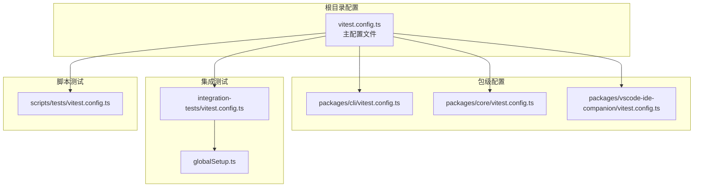
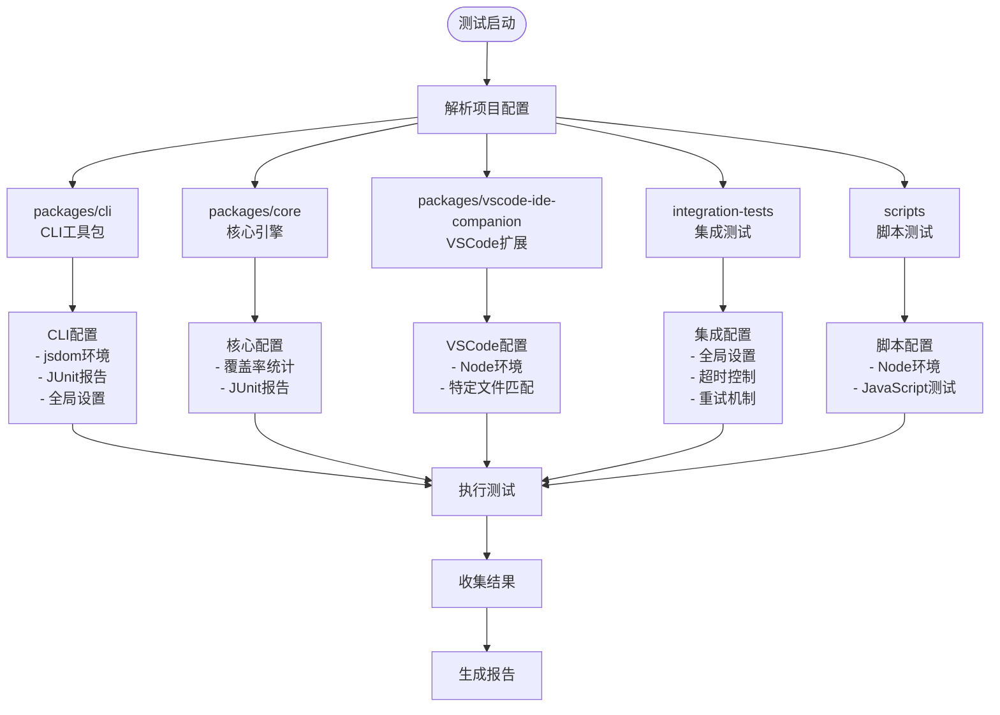
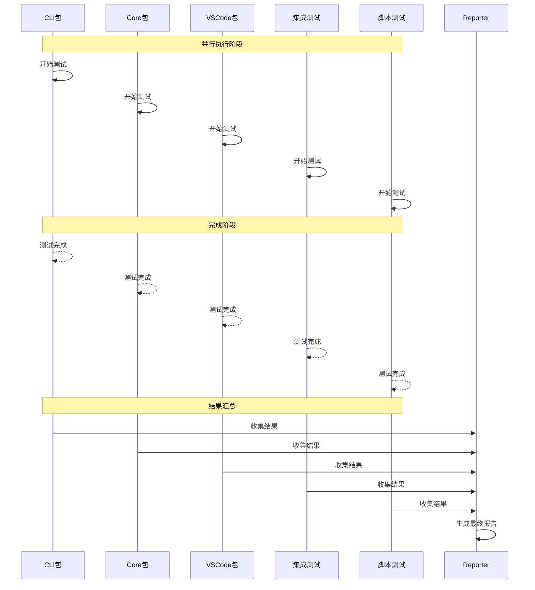

# Vitest 多项目测试配置详解

<cite>
**本文档引用的文件**
- [vitest.config.ts](file://vitest.config.ts)
- [packages/cli/vitest.config.ts](file://packages/cli/vitest.config.ts)
- [packages/core/vitest.config.ts](file://packages/core/vitest.config.ts)
- [packages/vscode-ide-companion/vitest.config.ts](file://packages/vscode-ide-companion/vitest.config.ts)
- [integration-tests/vitest.config.ts](file://integration-tests/vitest.config.ts)
- [scripts/tests/vitest.config.ts](file://scripts/tests/vitest.config.ts)
- [packages/cli/test-setup.ts](file://packages/cli/test-setup.ts)
- [packages/core/test-setup.ts](file://packages/core/test-setup.ts)
- [integration-tests/globalSetup.ts](file://integration-tests/globalSetup.ts)
- [package.json](file://package.json)
</cite>

## 目录
1. [简介](#简介)
2. [项目结构概览](#项目结构概览)
3. [核心配置架构](#核心配置架构)
4. [多项目配置详解](#多项目配置详解)
5. [各项目测试配置分析](#各项目测试配置分析)
6. [测试执行策略](#测试执行策略)
7. [环境变量与配置管理](#环境变量与配置管理)
8. [扩展配置指南](#扩展配置指南)
9. [最佳实践建议](#最佳实践建议)
10. [故障排除指南](#故障排除指南)

## 简介

本项目采用 Vitest 作为主要测试框架，通过多项目配置实现了模块化的测试体系。这种配置方式支持对 CLI 工具、核心引擎、VSCode 扩展 companion 等不同组件进行独立测试，同时提供了统一的测试管理和执行接口。

## 项目结构概览

项目采用 monorepo 架构，包含以下主要测试相关目录：



**图表来源**
- [vitest.config.ts](file://vitest.config.ts#L1-L14)
- [packages/cli/vitest.config.ts](file://packages/cli/vitest.config.ts#L1-L38)
- [packages/core/vitest.config.ts](file://packages/core/vitest.config.ts#L1-L33)

## 核心配置架构

### 主配置文件结构

主配置文件定义了所有子项目的测试项目列表：

```typescript
export default defineConfig({
  test: {
    projects: [
      'packages/cli',
      'packages/core',
      'packages/vscode-ide-companion',
      'integration-tests',
      'scripts',
    ],
  },
});
```

这种配置方式具有以下优势：
- **模块化管理**：每个包都有独立的测试配置
- **并行执行**：支持多个项目并行运行测试
- **独立覆盖**：每个项目可以有独立的覆盖率配置
- **灵活定制**：可以根据项目特点定制测试行为

**章节来源**
- [vitest.config.ts](file://vitest.config.ts#L1-L14)

## 多项目配置详解

### 项目路径映射关系



**图表来源**
- [vitest.config.ts](file://vitest.config.ts#L4-L11)
- [packages/cli/vitest.config.ts](file://packages/cli/vitest.config.ts#L8-L37)
- [packages/core/vitest.config.ts](file://packages/core/vitest.config.ts#L6-L32)

### 项目执行顺序

Vitest 按照配置文件中定义的顺序依次执行各个项目：

1. **packages/cli** - CLI 工具包测试
2. **packages/core** - 核心引擎测试  
3. **packages/vscode-ide-companion** - VSCode 扩展测试
4. **integration-tests** - 集成测试套件
5. **scripts** - 脚本测试套件

**章节来源**
- [vitest.config.ts](file://vitest.config.ts#L4-L11)

## 各项目测试配置分析

### CLI 包测试配置

CLI 包使用了最完整的测试配置，包括：

```typescript
export default defineConfig({
  test: {
    include: ['**/*.{test,spec}.?(c|m)[jt]s?(x)', 'config.test.ts'],
    exclude: ['**/node_modules/**', '**/dist/**', '**/cypress/**'],
    environment: 'jsdom',
    globals: true,
    reporters: ['default', 'junit'],
    silent: true,
    outputFile: {
      junit: 'junit.xml',
    },
    setupFiles: ['./test-setup.ts'],
    coverage: {
      enabled: true,
      provider: 'v8',
      reportsDirectory: './coverage',
      include: ['src/**/*'],
      reporter: [
        ['text', { file: 'full-text-summary.txt' }],
        'html',
        'json',
        'lcov',
        'cobertura',
        ['json-summary', { outputFile: 'coverage-summary.json' }],
      ],
    },
  },
});
```

**配置特点**：
- **文件匹配**：支持多种测试文件命名约定
- **环境设置**：使用 jsdom 模拟浏览器环境
- **报告格式**：生成 JUnit 和多种覆盖率报告
- **全局设置**：启用全局变量和静默输出
- **覆盖率**：全面的代码覆盖率统计

**章节来源**
- [packages/cli/vitest.config.ts](file://packages/cli/vitest.config.ts#L8-L37)

### 核心包测试配置

核心包配置相对简洁但完整：

```typescript
export default defineConfig({
  test: {
    reporters: ['default', 'junit'],
    silent: true,
    setupFiles: ['./test-setup.ts'],
    outputFile: {
      junit: 'junit.xml',
    },
    coverage: {
      enabled: true,
      provider: 'v8',
      reportsDirectory: './coverage',
      include: ['src/**/*'],
      reporter: [
        ['text', { file: 'full-text-summary.txt' }],
        'html',
        'json',
        'lcov',
        'cobertura',
        ['json-summary', { outputFile: 'coverage-summary.json' }],
      ],
    },
  },
});
```

**配置特点**：
- **简化配置**：移除了 CLI 的文件包含规则
- **标准报告**：使用默认和 JUnit 报告格式
- **覆盖率**：保持与 CLI 相同的覆盖率配置

**章节来源**
- [packages/core/vitest.config.ts](file://packages/core/vitest.config.ts#L6-L32)

### VSCode Companion 测试配置

VSCode 扩展包使用 Node 环境：

```typescript
export default defineConfig({
  test: {
    globals: true,
    environment: 'node',
    include: ['src/**/*.test.ts'],
    coverage: {
      provider: 'v8',
      reporter: ['text', 'json', 'html', 'clover'],
      include: ['src/**/*.ts'],
      exclude: ['src/**/*.test.ts', 'src/**/*.d.ts'],
    },
  },
});
```

**配置特点**：
- **环境选择**：使用 Node.js 环境
- **文件过滤**：仅包含 `.test.ts` 文件
- **覆盖率**：特定的覆盖率报告格式

**章节来源**
- [packages/vscode-ide-companion/vitest.config.ts](file://packages/vscode-ide-companion/vitest.config.ts#L3-L15)

### 集成测试配置

集成测试具有特殊的全局设置和超时控制：

```typescript
const timeoutMinutes = Number(process.env.TB_TIMEOUT_MINUTES || '5');
const testTimeoutMs = timeoutMinutes * 60 * 1000;

export default defineConfig({
  test: {
    testTimeout: testTimeoutMs,
    globalSetup: './globalSetup.ts',
    reporters: ['default'],
    include: ['**/*.test.ts'],
    exclude: ['**/terminal-bench/*.test.ts', '**/node_modules/**'],
    retry: 2,
    fileParallelism: false,
  },
});
```

**配置特点**：
- **动态超时**：根据环境变量设置超时时间
- **全局设置**：使用全局初始化脚本
- **重试机制**：支持失败测试自动重试
- **串行执行**：禁用文件并行执行以避免资源冲突

**章节来源**
- [integration-tests/vitest.config.ts](file://integration-tests/vitest.config.ts#L7-L22)

### 脚本测试配置

脚本测试专注于 JavaScript 测试文件：

```typescript
export default defineConfig({
  test: {
    globals: true,
    environment: 'node',
    include: ['scripts/tests/**/*.test.js'],
    setupFiles: ['scripts/tests/test-setup.ts'],
    coverage: {
      provider: 'v8',
      reporter: ['text', 'lcov'],
    },
  },
});
```

**配置特点**：
- **JavaScript 优先**：专门处理 JavaScript 测试文件
- **简单配置**：最小化的覆盖率报告

**章节来源**
- [scripts/tests/vitest.config.ts](file://scripts/tests/vitest.config.ts#L7-L20)

## 测试执行策略

### 命令行参数支持

项目提供了丰富的命令行测试执行选项：

```bash
# 运行所有测试项目
npm run test

# 运行 CI 环境测试
npm run test:ci

# 运行脚本测试
npm run test:scripts

# 运行集成测试
npm run test:e2e

# 运行终端基准测试
npm run test:terminal-bench

# 运行特定模型的基准测试
npm run test:terminal-bench:qwen
npm run test:terminal-bench:oracle
```

### 并行执行机制



**图表来源**
- [vitest.config.ts](file://vitest.config.ts#L4-L11)
- [package.json](file://package.json#L20-L35)

**章节来源**
- [package.json](file://package.json#L20-L35)

## 环境变量与配置管理

### 全局环境变量处理

所有测试配置都包含了统一的环境变量清理逻辑：

```typescript
// 清理 NO_COLOR 环境变量以确保主题行为一致性
if (process.env['NO_COLOR'] !== undefined) {
  delete process.env['NO_COLOR'];
}
```

### 集成测试特殊配置

集成测试使用全局设置脚本来管理测试环境：

```typescript
export async function setup() {
  // 设置测试运行目录
  runDir = join(integrationTestsDir, `${Date.now()}`);
  await mkdir(runDir, { recursive: true });
  
  // 清理旧的测试运行
  const testRuns = await readdir(integrationTestsDir);
  if (testRuns.length > 5) {
    const oldRuns = testRuns.sort().slice(0, testRuns.length - 5);
    await Promise.all(oldRuns.map((oldRun) =>
      rm(join(integrationTestsDir, oldRun), {
        recursive: true,
        force: true,
      })
    ));
  }
  
  // 设置环境变量
  process.env['INTEGRATION_TEST_FILE_DIR'] = runDir;
  process.env['GEMINI_CLI_INTEGRATION_TEST'] = 'true';
  process.env['TELEMETRY_LOG_FILE'] = join(runDir, 'telemetry.log');
}
```

**章节来源**
- [packages/cli/test-setup.ts](file://packages/cli/test-setup.ts#L6-L8)
- [packages/core/test-setup.ts](file://packages/core/test-setup.ts#L6-L8)
- [integration-tests/globalSetup.ts](file://integration-tests/globalSetup.ts#L30-L50)

## 扩展配置指南

### 添加新测试项目

要添加新的测试项目，需要遵循以下步骤：

1. **在根配置中添加项目路径**：
```typescript
export default defineConfig({
  test: {
    projects: [
      'packages/cli',
      'packages/core',
      'packages/vscode-ide-companion',
      'packages/new-package', // 新增项目
      'integration-tests',
      'scripts',
    ],
  },
});
```

2. **为新包创建配置文件**：
```typescript
// packages/new-package/vitest.config.ts
export default defineConfig({
  test: {
    // 根据包特性配置测试选项
    include: ['src/**/*.test.ts'],
    environment: 'node',
    coverage: {
      provider: 'v8',
      include: ['src/**/*'],
    },
  },
});
```

3. **添加测试设置文件**（可选）：
```typescript
// packages/new-package/test-setup.ts
// 可以在这里添加包级别的测试设置
```

### 自定义测试配置

根据不同的测试需求，可以自定义各种配置选项：

```typescript
// 示例：添加特定的测试过滤器
export default defineConfig({
  test: {
    include: ['src/**/*.test.ts', 'src/**/*.spec.ts'],
    exclude: ['src/**/*.test.skip.ts'],
    testTimeout: 30000,
    retry: 3,
    threads: false, // 禁用线程池
  },
});
```

## 最佳实践建议

### 1. 配置分离原则

- **按功能模块分离**：每个包应该有独立的测试配置
- **环境适配**：根据包的特点选择合适的测试环境
- **报告标准化**：统一使用 JUnit 报告以便 CI/CD 集成

### 2. 性能优化建议

```typescript
// 推荐的性能优化配置
export default defineConfig({
  test: {
    // 启用并发执行
    pool: 'threads',
    poolOptions: {
      threads: {
        maxThreads: require('os').cpus().length,
        minThreads: 1,
      },
    },
    // 启用文件缓存
    cache: {
      dir: './node_modules/.vitest',
    },
  },
});
```

### 3. 调试友好配置

```typescript
// 调试友好的配置
export default defineConfig({
  test: {
    // 启用调试模式
    inspect: true,
    // 保留测试输出
    silent: false,
    // 详细错误信息
    reporters: ['verbose'],
  },
});
```

### 4. 覆盖率配置优化

```typescript
// 优化的覆盖率配置
export default defineConfig({
  test: {
    coverage: {
      enabled: true,
      provider: 'v8',
      include: ['src/**/*'],
      exclude: [
        'src/**/*.test.ts',
        'src/**/*.spec.ts',
        'src/types/**/*',
        'src/**/*.d.ts',
      ],
      reporter: ['text', 'html', 'lcov'],
      thresholds: {
        statements: 80,
        branches: 70,
        functions: 80,
        lines: 80,
      },
    },
  },
});
```

## 故障排除指南

### 常见问题及解决方案

#### 1. 测试超时问题

**问题**：集成测试经常超时
**解决方案**：
```typescript
// 在集成测试配置中增加超时时间
const timeoutMinutes = Number(process.env.TB_TIMEOUT_MINUTES || '10'); // 增加到10分钟
```

#### 2. 内存不足问题

**问题**：大型测试项目内存溢出
**解决方案**：
```typescript
// 限制并发线程数
export default defineConfig({
  test: {
    poolOptions: {
      threads: {
        maxThreads: 2, // 限制最大线程数
        minThreads: 1,
      },
    },
  },
});
```

#### 3. 环境变量冲突

**问题**：测试环境变量影响其他进程
**解决方案**：
```typescript
// 在全局设置中清理环境变量
export async function setup() {
  // 清理可能影响测试的环境变量
  delete process.env.NO_COLOR;
  delete process.env.DEBUG;
  // ...
}
```

#### 4. 路径解析问题

**问题**：测试文件路径解析错误
**解决方案**：
```typescript
// 使用绝对路径配置
export default defineConfig({
  test: {
    include: [resolve(__dirname, 'src/**/*.test.ts')],
    exclude: [resolve(__dirname, 'node_modules/**')],
  },
});
```

### 调试技巧

1. **启用详细日志**：
```bash
DEBUG=1 npm run test
```

2. **单个项目调试**：
```bash
vitest run --root packages/cli
```

3. **覆盖率调试**：
```bash
vitest run --coverage --reporter=text
```

4. **交互式调试**：
```bash
vitest --ui
```

通过这些配置和最佳实践，项目能够实现高效、可靠的多项目测试体系，支持复杂的开发工作流程和持续集成需求。