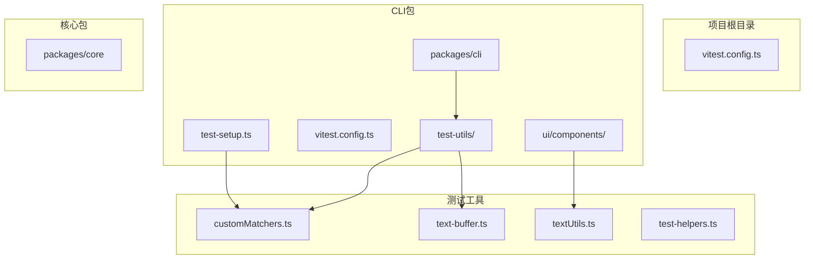
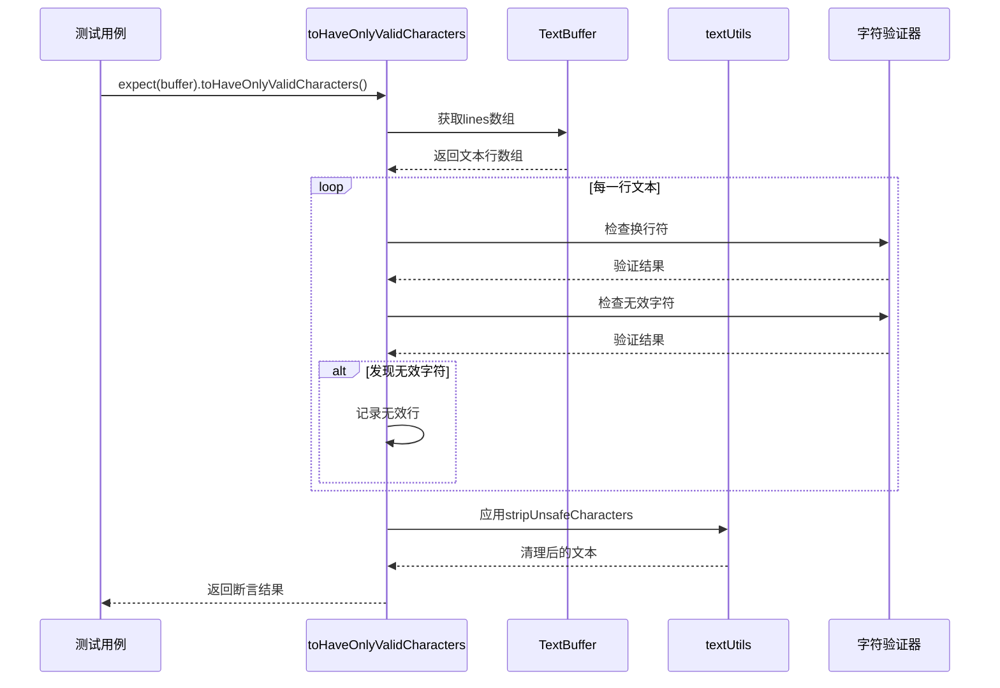
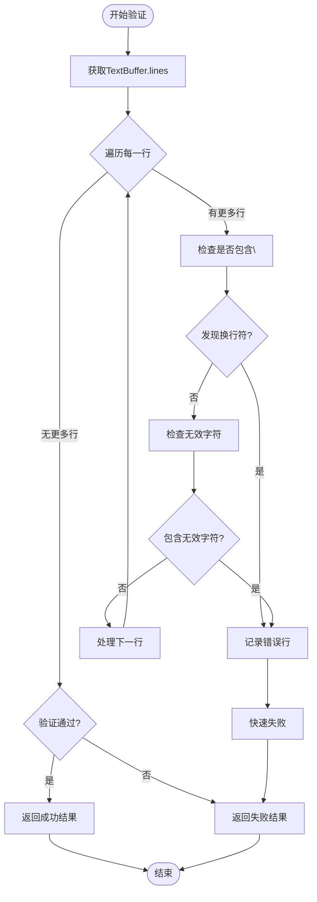
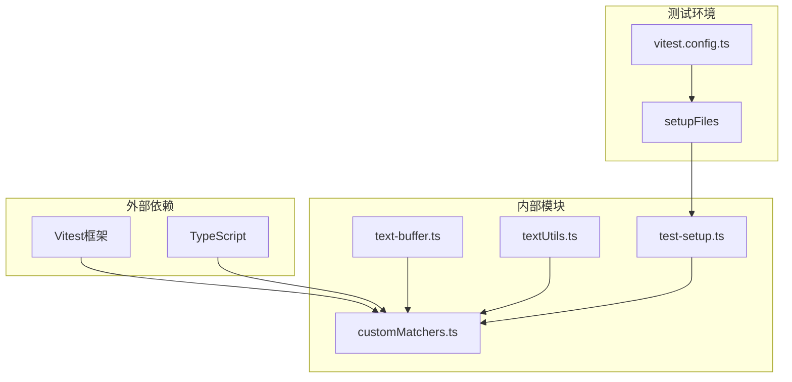

# 自定义测试匹配器toHaveOnlyValidCharacters

<cite>
**本文档引用的文件**
- [customMatchers.ts](file://packages/cli/src/test-utils/customMatchers.ts)
- [text-buffer.ts](file://packages/cli/src/ui/components/shared/text-buffer.ts)
- [textUtils.ts](file://packages/cli/src/ui/utils/textUtils.ts)
- [text-buffer.test.ts](file://packages/cli/src/ui/components/shared/text-buffer.test.ts)
- [test-setup.ts](file://packages/cli/test-setup.ts)
- [vitest.config.ts](file://packages/cli/vitest.config.ts)
</cite>

## 目录
1. [简介](#简介)
2. [项目结构](#项目结构)
3. [核心组件](#核心组件)
4. [架构概览](#架构概览)
5. [详细组件分析](#详细组件分析)
6. [依赖关系分析](#依赖关系分析)
7. [性能考虑](#性能考虑)
8. [故障排除指南](#故障排除指南)
9. [结论](#结论)

## 简介

toHaveOnlyValidCharacters是一个专门为Qwen Code CLI项目设计的自定义Vitest测试匹配器，用于验证TextBuffer实例中的文本内容是否包含有效的字符。该匹配器专门检测并防止退格符、ANSI转义序列和换行符等可能导致终端渲染问题的无效字符。

这个匹配器在UI组件测试中发挥着关键作用，特别是在处理终端输出内容时，确保所有显示的文本都是纯净且可安全渲染的。通过提供清晰的错误消息和详细的行级定位，它大大提高了测试的可读性和调试效率。

## 项目结构

该项目采用monorepo架构，主要包含以下核心模块：



**图表来源**
- [vitest.config.ts](file://packages/cli/vitest.config.ts#L1-L38)
- [test-setup.ts](file://packages/cli/test-setup.ts#L1-L13)

**章节来源**
- [vitest.config.ts](file://packages/cli/vitest.config.ts#L1-L38)
- [test-setup.ts](file://packages/cli/test-setup.ts#L1-L13)

## 核心组件

### 自定义匹配器实现

toHaveOnlyValidCharacters匹配器的核心实现位于`packages/cli/src/test-utils/customMatchers.ts`文件中：

```typescript
// RegExp to detect invalid characters: backspace, and ANSI escape codes
// eslint-disable-next-line no-control-regex
const invalidCharsRegex = /[\b\x1b]/;

function toHaveOnlyValidCharacters(this: Assertion, buffer: TextBuffer) {
  const { isNot } = this as any;
  let pass = true;
  const invalidLines: Array<{ line: number; content: string }> = [];

  for (let i = 0; i < buffer.lines.length; i++) {
    const line = buffer.lines[i];
    if (line.includes('\n')) {
      pass = false;
      invalidLines.push({ line: i, content: line });
      break; // Fail fast on newlines
    }
    if (invalidCharsRegex.test(line)) {
      pass = false;
      invalidLines.push({ line: i, content: line });
    }
  }

  return {
    pass,
    message: () =>
      `Expected buffer ${isNot ? 'not ' : ''}to have only valid characters, but found invalid characters in lines:\n${invalidLines
        .map((l) => `  [${l.line}]: "${l.content}"`)
        .join('\n')}`,
    actual: buffer.lines,
    expected: 'Lines with no line breaks, backspaces, or escape codes.',
  };
}
```

### TextBuffer类型定义

TextBuffer接口定义了缓冲区的基本结构：

```typescript
interface TextBufferState {
  lines: string[];
  cursorRow: number;
  cursorCol: number;
  preferredCol: number | null;
  visualLines: string[][];
  visualScrollRow: number;
  visualCursor: { row: number; col: number };
  viewport: { width: number; height: number };
  undoStack: UndoHistoryEntry[];
  redoStack: UndoHistoryEntry[];
}
```

**章节来源**
- [customMatchers.ts](file://packages/cli/src/test-utils/customMatchers.ts#L1-L67)
- [text-buffer.ts](file://packages/cli/src/ui/components/shared/text-buffer.ts#L1-L100)

## 架构概览

toHaveOnlyValidCharacters匹配器在整个测试架构中扮演着重要角色，它与多个组件协同工作以确保文本内容的质量：



**图表来源**
- [customMatchers.ts](file://packages/cli/src/test-utils/customMatchers.ts#L18-L40)
- [textUtils.ts](file://packages/cli/src/ui/utils/textUtils.ts#L45-L88)

## 详细组件分析

### 匹配器核心逻辑

#### 字符验证机制

toMatchOnlyValidCharacters使用双重验证机制来确保文本的纯净性：

1. **换行符检测**：检查每行文本是否包含`\n`字符
2. **控制字符检测**：使用正则表达式`/[\b\x1b]/`检测退格符和ANSI转义序列



**图表来源**
- [customMatchers.ts](file://packages/cli/src/test-utils/customMatchers.ts#L22-L38)

#### 错误消息生成

当验证失败时，匹配器会生成详细的错误消息，帮助开发者快速定位问题：

```typescript
message: () =>
  `Expected buffer ${isNot ? 'not ' : ''}to have only valid characters, but found invalid characters in lines:\n${invalidLines
    .map((l) => `  [${l.line}]: "${l.content}"`)
    .join('\n')}`
```

这种格式化的错误消息提供了：
- 行号标识
- 具体的文本内容
- 清晰的失败原因

### 类型系统集成

为了在TypeScript环境中获得完整的类型支持，匹配器扩展了Vitest的类型定义：

```typescript
declare module 'vitest' {
  interface Assertion<T> {
    toHaveOnlyValidCharacters(): T;
  }
  interface AsymmetricMatchersContaining {
    toHaveOnlyValidCharacters(): void;
  }
}
```

这确保了：
- 编译时类型检查
- IDE智能提示
- 代码补全功能

### 文本清理工具

项目还提供了专门的文本清理工具`stripUnsafeCharacters`，用于预处理可能包含无效字符的文本：

```typescript
export function stripUnsafeCharacters(str: string): string {
  const strippedAnsi = stripAnsi(str);
  const strippedVT = stripVTControlCharacters(strippedAnsi);

  return toCodePoints(strippedVT)
    .filter((char) => {
      const code = char.codePointAt(0);
      if (code === undefined) return false;

      // Preserve CR/LF for line handling
      if (code === 0x0a || code === 0x0d) return true;

      // Remove C0 control chars (except CR/LF) that can break display
      if (code >= 0x00 && code <= 0x1f) return false;

      // Remove C1 control chars (0x80-0x9f) - legacy 8-bit control codes
      if (code >= 0x80 && code <= 0x9f) return false;

      return true;
    })
    .join('');
}
```

**章节来源**
- [customMatchers.ts](file://packages/cli/src/test-utils/customMatchers.ts#L18-L67)
- [textUtils.ts](file://packages/cli/src/ui/utils/textUtils.ts#L45-L88)

## 依赖关系分析

toHaveOnlyValidCharacters匹配器的依赖关系展现了清晰的分层架构：



**图表来源**
- [customMatchers.ts](file://packages/cli/src/test-utils/customMatchers.ts#L1-L15)
- [test-setup.ts](file://packages/cli/test-setup.ts#L1-L13)

### 关键依赖说明

1. **Vitest框架**：提供测试运行环境和断言功能
2. **TextBuffer类型**：定义缓冲区的数据结构
3. **TypeScript声明**：确保类型安全和开发体验
4. **测试设置**：自动加载自定义匹配器

**章节来源**
- [customMatchers.ts](file://packages/cli/src/test-utils/customMatchers.ts#L1-L15)
- [test-setup.ts](file://packages/cli/test-setup.ts#L1-L13)

## 性能考虑

toHaveOnlyValidCharacters匹配器在设计时充分考虑了性能优化：

### 快速失败策略

匹配器实现了快速失败机制，在发现第一个无效字符时立即停止验证过程：

```typescript
if (line.includes('\n')) {
  pass = false;
  invalidLines.push({ line: i, content: line });
  break; // Fail fast on newlines
}
```

这种设计避免了不必要的计算，特别是在大型文本缓冲区中。

### 正则表达式优化

使用预编译的正则表达式`/[\b\x1b]/`进行高效字符检测，避免重复编译带来的性能开销。

### 内存使用优化

- 只存储实际发现问题的行，而不是整个缓冲区
- 使用简单的数据结构存储错误信息
- 及时释放不需要的对象引用

## 故障排除指南

### 常见问题及解决方案

#### 1. 匹配器未找到错误

**问题**：测试运行时出现"toHaveOnlyValidCharacters is not a function"错误

**解决方案**：
- 确保在测试设置文件中正确导入了自定义匹配器
- 检查`test-setup.ts`文件中的导入路径
- 验证Vitest配置是否正确加载了设置文件

#### 2. 类型错误

**问题**：TypeScript编译时出现类型相关错误

**解决方案**：
- 确保正确扩展了Vitest的类型定义
- 检查`declare module 'vitest'`部分的语法
- 验证TextBuffer类型的导入是否正确

#### 3. 验证结果不准确

**问题**：匹配器未能检测到某些无效字符

**解决方案**：
- 检查正则表达式的覆盖范围
- 验证输入数据的编码格式
- 考虑添加额外的字符过滤规则

### 调试技巧

1. **启用详细日志**：在测试中打印缓冲区的内容
2. **分步验证**：分别测试换行符和控制字符的检测
3. **边界情况测试**：测试空字符串、特殊字符等情况

**章节来源**
- [customMatchers.ts](file://packages/cli/src/test-utils/customMatchers.ts#L41-L67)

## 结论

toHaveOnlyValidCharacters自定义匹配器是Qwen Code CLI项目中一个精心设计的测试工具，它有效地解决了终端文本渲染中的字符验证问题。通过双重验证机制、快速失败策略和详细的错误报告，它为开发者提供了强大而可靠的测试能力。

该匹配器的成功实施展示了以下最佳实践：

1. **模块化设计**：清晰分离验证逻辑和错误处理
2. **性能优化**：通过快速失败和正则表达式优化提升效率
3. **类型安全**：完整的TypeScript集成确保开发体验
4. **可维护性**：简洁的代码结构便于后续扩展和维护

这个匹配器不仅提高了测试的可读性和维护性，还为项目的质量保证体系奠定了坚实的基础。随着项目的发展，它将继续发挥重要作用，确保用户界面的稳定性和可靠性。