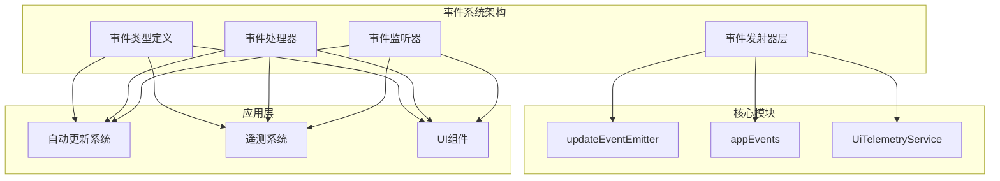
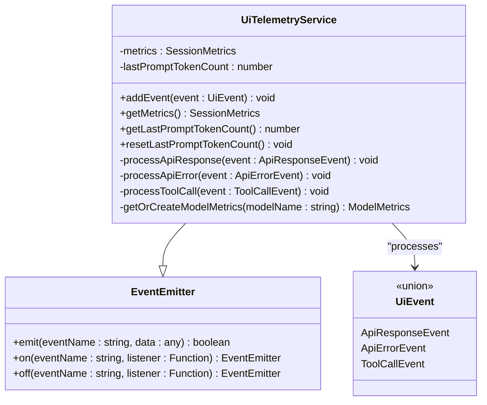
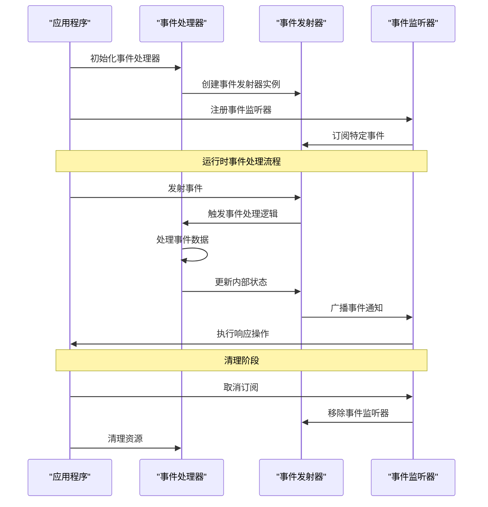
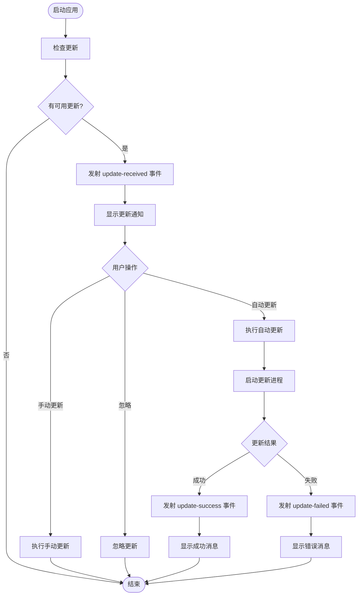
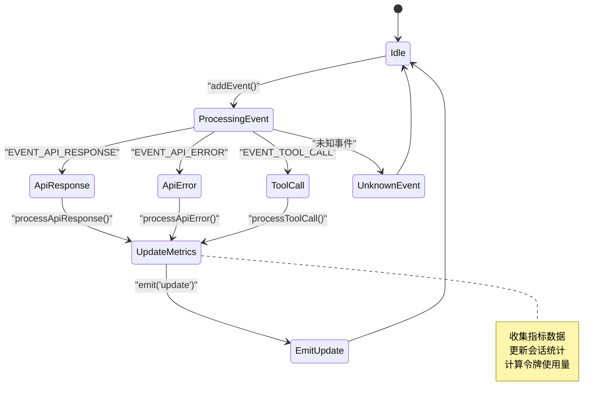
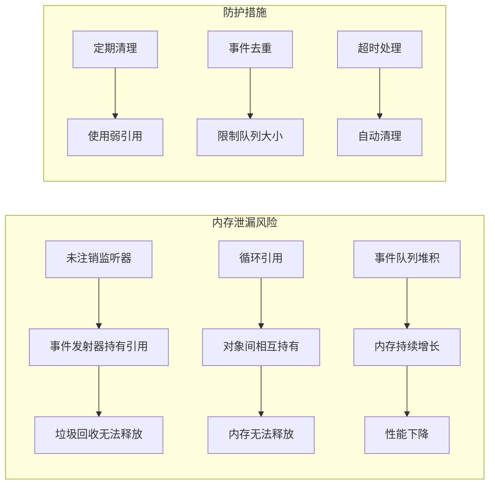

# 事件驱动架构设计文档

<cite>
**本文档中引用的文件**
- [updateEventEmitter.ts](file://packages/cli/src/utils/updateEventEmitter.ts)
- [events.ts](file://packages/cli/src/utils/events.ts)
- [uiTelemetry.ts](file://packages/core/src/telemetry/uiTelemetry.ts)
- [types.ts](file://packages/core/src/telemetry/types.ts)
- [loggers.ts](file://packages/core/src/telemetry/loggers.ts)
- [constants.ts](file://packages/core/src/telemetry/constants.ts)
- [handleAutoUpdate.ts](file://packages/cli/src/utils/handleAutoUpdate.ts)
- [updateCheck.ts](file://packages/cli/src/ui/utils/updateCheck.ts)
- [App.tsx](file://packages/cli/src/ui/App.tsx)
- [tools.ts](file://packages/core/src/tools/tools.ts)
</cite>

## 目录
1. [简介](#简介)
2. [项目结构概览](#项目结构概览)
3. [核心事件系统组件](#核心事件系统组件)
4. [事件类型定义与分类](#事件类型定义与分类)
5. [事件发射器架构分析](#事件发射器架构分析)
6. [实际应用案例分析](#实际应用案例分析)
7. [事件处理最佳实践](#事件处理最佳实践)
8. [性能优化与内存管理](#性能优化与内存管理)
9. [故障排除指南](#故障排除指南)
10. [总结与建议](#总结与建议)

## 简介

本项目采用先进的事件驱动架构设计，通过统一的事件系统实现组件间的松耦合通信。事件驱动模式不仅提升了系统的可扩展性和维护性，还为实时状态同步和异步处理提供了强大的基础设施支持。

事件驱动架构的核心优势包括：
- **解耦组件**：不同模块通过事件进行通信，降低直接依赖
- **响应式设计**：支持实时状态更新和用户交互反馈
- **异步处理**：通过事件队列实现非阻塞操作
- **可扩展性**：易于添加新的事件类型和处理器

## 项目结构概览



**图表来源**
- [updateEventEmitter.ts](file://packages/cli/src/utils/updateEventEmitter.ts#L1-L14)
- [events.ts](file://packages/cli/src/utils/events.ts#L1-L15)
- [uiTelemetry.ts](file://packages/core/src/telemetry/uiTelemetry.ts#L1-L238)

## 核心事件系统组件

### updateEventEmitter - 应用级事件总线

`updateEventEmitter` 是项目中最基础的事件发射器，位于 `packages/cli/src/utils/updateEventEmitter.ts` 中：

```typescript
import { EventEmitter } from 'node:events';

export const updateEventEmitter = new EventEmitter();
```

这个单例事件发射器专门用于：
- 自动更新通知
- 版本检查结果分发
- 安装状态变更通知
- 错误状态传播

### appEvents - 应用级通用事件

`appEvents` 提供了更高级别的事件定义，包含两个核心事件类型：

```typescript
export enum AppEvent {
  OpenDebugConsole = 'open-debug-console',
  LogError = 'log-error',
}

export const appEvents = new EventEmitter();
```

这些事件主要用于：
- 调试控制台打开请求
- 错误日志记录触发
- 应用级错误处理

### UiTelemetryService - 遥测事件处理

`UiTelemetryService` 是一个功能丰富的事件处理器，继承自 `EventEmitter`：



**图表来源**
- [uiTelemetry.ts](file://packages/core/src/telemetry/uiTelemetry.ts#L60-L238)

**章节来源**
- [updateEventEmitter.ts](file://packages/cli/src/utils/updateEventEmitter.ts#L1-L14)
- [events.ts](file://packages/cli/src/utils/events.ts#L1-L15)
- [uiTelemetry.ts](file://packages/core/src/telemetry/uiTelemetry.ts#L60-L120)

## 事件类型定义与分类

### 基础事件类型层次结构

项目中的事件类型按照功能域进行了清晰的分类：

```mermaid
graph TD
BaseTelemetryEvent["BaseTelemetryEvent<br/>基础遥测事件"]
subgraph "会话管理事件"
StartSession["StartSessionEvent"]
EndSession["EndSessionEvent"]
ConversationFinished["ConversationFinishedEvent"]
end
subgraph "用户交互事件"
UserPrompt["UserPromptEvent"]
SlashCommand["SlashCommandEvent"]
FileOperation["FileOperationEvent"]
end
subgraph "工具调用事件"
ToolCall["ToolCallEvent"]
ApiRequest["ApiRequestEvent"]
ApiResponse["ApiResponseEvent"]
ApiError["ApiErrorEvent"]
end
subgraph "系统状态事件"
FlashFallback["FlashFallbackEvent"]
LoopDetected["LoopDetectedEvent"]
NextSpeakerCheck["NextSpeakerCheckEvent"]
IdeConnection["IdeConnectionEvent"]
end
BaseTelemetryEvent --> StartSession
BaseTelemetryEvent --> EndSession
BaseTelemetryEvent --> UserPrompt
BaseTelemetryEvent --> ToolCall
BaseTelemetryEvent --> ApiRequest
BaseTelemetryEvent --> ApiResponse
BaseTelemetryEvent --> ApiError
BaseTelemetryEvent --> FlashFallback
BaseTelemetryEvent --> LoopDetected
BaseTelemetryEvent --> NextSpeakerCheck
BaseTelemetryEvent --> IdeConnection
BaseTelemetryEvent --> SlashCommand
BaseTelemetryEvent --> FileOperation
BaseTelemetryEvent --> ConversationFinished
```



**图表来源**
- [types.ts](file://packages/core/src/telemetry/types.ts#L20-L559)

### 事件常量定义

所有事件名称都通过常量定义确保一致性：

```typescript
export const EVENT_USER_PROMPT = 'qwen-code.user_prompt';
export const EVENT_TOOL_CALL = 'qwen-code.tool_call';
export const EVENT_API_REQUEST = 'qwen-code.api_request';
export const EVENT_API_ERROR = 'qwen-code.api_error';
export const EVENT_API_RESPONSE = 'qwen-code.api_response';
export const EVENT_CLI_CONFIG = 'qwen-code.config';
export const EVENT_FLASH_FALLBACK = 'qwen-code.flash_fallback';
```

这种设计模式的优势：
- **类型安全**：编译时检查事件名称拼写错误
- **集中管理**：便于维护和修改事件名称
- **跨模块共享**：确保各模块使用一致的事件标识符

**章节来源**
- [constants.ts](file://packages/core/src/telemetry/constants.ts#L1-L42)
- [types.ts](file://packages/core/src/telemetry/types.ts#L20-L100)

## 事件发射器架构分析

### 事件发射器生命周期管理



**图表来源**
- [handleAutoUpdate.ts](file://packages/cli/src/utils/handleAutoUpdate.ts#L80-L145)
- [uiTelemetry.ts](file://packages/core/src/telemetry/uiTelemetry.ts#L60-L120)

### 异步事件处理机制

事件系统采用了多种异步处理策略：

1. **事件队列处理**：通过 `EventEmitter` 的内置队列机制
2. **Promise 链式处理**：支持异步事件处理
3. **流式事件传输**：适用于实时数据流场景

```typescript
// 异步事件处理示例
export function setUpdateHandler(
  addItem: (item: Omit<HistoryItem, 'id'>, timestamp: number) => void,
  setUpdateInfo: (info: UpdateObject | null) => void,
) {
  const handleUpdateRecieved = (info: UpdateObject) => {
    setUpdateInfo(info);
    const savedMessage = info.message;
    setTimeout(() => {
      if (!successfullyInstalled) {
        addItem(
          {
            type: MessageType.INFO,
            text: savedMessage,
          },
          Date.now(),
        );
      }
      setUpdateInfo(null);
    }, 60000);
  };
  
  // 注册事件监听器
  updateEventEmitter.on('update-received', handleUpdateRecieved);
  // ... 其他监听器注册
  
  // 返回清理函数
  return () => {
    updateEventEmitter.off('update-received', handleUpdateRecieved);
    // ... 清理其他监听器
  };
}
```

**章节来源**
- [handleAutoUpdate.ts](file://packages/cli/src/utils/handleAutoUpdate.ts#L80-L145)

## 实际应用案例分析

### 自动更新检查系统

自动更新系统是事件驱动架构的最佳实践案例：



**图表来源**
- [handleAutoUpdate.ts](file://packages/cli/src/utils/handleAutoUpdate.ts#L15-L75)
- [updateCheck.ts](file://packages/cli/src/ui/utils/updateCheck.ts#L30-L80)

#### 更新事件处理流程

```typescript
// 更新接收事件处理
const handleUpdateRecieved = (info: UpdateObject) => {
  setUpdateInfo(info);
  const savedMessage = info.message;
  setTimeout(() => {
    if (!successfullyInstalled) {
      addItem(
        {
          type: MessageType.INFO,
          text: savedMessage,
        },
        Date.now(),
      );
    }
    setUpdateInfo(null);
  }, 60000);
};

// 更新成功事件处理
const handleUpdateSuccess = () => {
  successfullyInstalled = true;
  setUpdateInfo(null);
  addItem(
    {
      type: MessageType.INFO,
      text: `Update successful! The new version will be used on your next run.`,
    },
    Date.now(),
  );
};
```

### 用户界面遥测系统

UI遥测系统展示了复杂事件聚合和状态管理：



**图表来源**
- [uiTelemetry.ts](file://packages/core/src/telemetry/uiTelemetry.ts#L80-L120)

#### 遥测事件处理逻辑

```typescript
export class UiTelemetryService extends EventEmitter {
  addEvent(event: UiEvent) {
    switch (event['event.name']) {
      case EVENT_API_RESPONSE:
        this.processApiResponse(event);
        break;
      case EVENT_API_ERROR:
        this.processApiError(event);
        break;
      case EVENT_TOOL_CALL:
        this.processToolCall(event);
        break;
      default:
        // 忽略其他事件
        return;
    }

    // 发射更新事件通知监听器
    this.emit('update', {
      metrics: this.#metrics,
      lastPromptTokenCount: this.#lastPromptTokenCount,
    });
  }
}
```

**章节来源**
- [handleAutoUpdate.ts](file://packages/cli/src/utils/handleAutoUpdate.ts#L80-L145)
- [uiTelemetry.ts](file://packages/core/src/telemetry/uiTelemetry.ts#L80-L120)

## 事件处理最佳实践

### 事件命名规范

项目遵循严格的事件命名约定：

1. **前缀规则**：所有事件名称以 `qwen-code.` 开头
2. **层级结构**：使用点号分隔功能域和具体事件
3. **语义明确**：事件名称应准确描述其含义

```typescript
// 推荐的事件命名格式
const EVENT_NAMES = {
  // 功能域.子功能.动作
  USER_PROMPT: 'qwen-code.user_prompt',
  TOOL_CALL: 'qwen-code.tool_call',
  API_REQUEST: 'qwen-code.api_request',
  API_ERROR: 'qwen-code.api_error',
  API_RESPONSE: 'qwen-code.api_response',
  CONFIG_LOAD: 'qwen-code.config',
  FLASH_FALLBACK: 'qwen-code.flash_fallback',
};
```

### 监听器注册与注销

正确的监听器生命周期管理至关重要：

```typescript
// 正确的监听器注册模式
export function setupEventListener() {
  const cleanupFunctions = [];
  
  // 注册多个事件监听器
  const handleUpdateReceived = (data) => { /* 处理逻辑 */ };
  updateEventEmitter.on('update-received', handleUpdateReceived);
  cleanupFunctions.push(() => updateEventEmitter.off('update-received', handleUpdateReceived));
  
  const handleUpdateFailed = (data) => { /* 处理逻辑 */ };
  updateEventEmitter.on('update-failed', handleUpdateFailed);
  cleanupFunctions.push(() => updateEventEmitter.off('update-failed', handleUpdateFailed));
  
  // 返回清理函数数组
  return () => cleanupFunctions.forEach(fn => fn());
}
```

### 错误处理与传播

事件系统中的错误处理策略：

```typescript
// 事件处理中的错误捕获
export function processEventWithErrorHandling(event: UiEvent) {
  try {
    // 事件处理逻辑
    switch (event['event.name']) {
      case EVENT_API_RESPONSE:
        processApiResponse(event);
        break;
      case EVENT_API_ERROR:
        processApiError(event);
        break;
      default:
        console.warn(`Unknown event type: ${event['event.name']}`);
    }
  } catch (error) {
    // 记录错误但不中断事件流
    console.error('Event processing error:', error);
    // 可选：发射错误事件
    appEvents.emit(AppEvent.LogError, error.message);
  }
}
```

### 性能优化策略

1. **事件去重**：避免重复发射相同事件
2. **批量处理**：合并相似事件减少处理开销
3. **延迟处理**：使用 `setTimeout` 延迟非关键事件
4. **内存管理**：及时清理不再需要的监听器

```typescript
// 事件去重示例
class EventDeduplicator {
  private lastEventTime = 0;
  private lastEventData: any = null;
  
  processEvent(event: any) {
    const currentTime = Date.now();
    if (currentTime - this.lastEventTime < 1000 && 
        JSON.stringify(event) === JSON.stringify(this.lastEventData)) {
      // 忽略重复事件
      return;
    }
    
    this.lastEventTime = currentTime;
    this.lastEventData = event;
    // 处理新事件
  }
}
```

## 性能优化与内存管理

### 内存泄漏防范

事件系统中的常见内存泄漏场景及解决方案：



### 事件队列管理

```typescript
// 事件队列优化
class OptimizedEventQueue {
  private queue: Array<{ event: any, timestamp: number }> = [];
  private maxQueueSize = 1000;
  private cleanupInterval: NodeJS.Timeout | null = null;
  
  enqueue(event: any) {
    // 限制队列大小
    if (this.queue.length >= this.maxQueueSize) {
      this.queue.shift(); // 移除最旧的事件
    }
    
    this.queue.push({
      event,
      timestamp: Date.now()
    });
    
    // 启动清理定时器
    if (!this.cleanupInterval) {
      this.startCleanup();
    }
  }
  
  private startCleanup() {
    this.cleanupInterval = setInterval(() => {
      const now = Date.now();
      // 移除超过5分钟的事件
      this.queue = this.queue.filter(item => now - item.timestamp < 300000);
      
      if (this.queue.length === 0) {
        clearInterval(this.cleanupInterval!);
        this.cleanupInterval = null;
      }
    }, 60000);
  }
}
```

### 性能监控

```typescript
// 事件处理性能监控
class EventPerformanceMonitor {
  private metrics = new Map<string, {
    count: number;
    totalTime: number;
    maxTime: number;
  }>();
  
  wrapEventHandler(eventName: string, handler: Function) {
    return (event: any) => {
      const start = performance.now();
      try {
        return handler(event);
      } finally {
        const end = performance.now();
        const duration = end - start;
        
        let metric = this.metrics.get(eventName) || {
          count: 0,
          totalTime: 0,
          maxTime: 0
        };
        
        metric.count++;
        metric.totalTime += duration;
        metric.maxTime = Math.max(metric.maxTime, duration);
        
        this.metrics.set(eventName, metric);
      }
    };
  }
  
  getReport() {
    const report = {};
    for (const [eventName, metric] of this.metrics) {
      report[eventName] = {
        averageTime: metric.totalTime / metric.count,
        maxTime: metric.maxTime,
        totalCount: metric.count
      };
    }
    return report;
  }
}
```

## 故障排除指南

### 常见问题诊断

1. **事件未被触发**
   - 检查事件名称拼写
   - 验证事件发射器实例
   - 确认监听器已正确注册

2. **内存泄漏**
   - 使用 `eventNames()` 方法检查活跃监听器
   - 验证清理函数是否被调用
   - 检查是否存在循环引用

3. **性能问题**
   - 监控事件处理时间
   - 检查事件队列长度
   - 分析事件频率和类型分布

### 调试工具

```typescript
// 事件调试辅助函数
class EventDebugger {
  static logEvent(eventName: string, eventData: any) {
    console.log(`[Event] ${eventName}`, {
      timestamp: new Date().toISOString(),
      data: eventData,
      listeners: updateEventEmitter.listenerCount(eventName),
      stack: new Error().stack
    });
  }
  
  static dumpEventState() {
    const events = updateEventEmitter.eventNames();
    console.log('[Event State]', {
      totalEvents: events.length,
      events: events.map(name => ({
        name,
        listeners: updateEventEmitter.listenerCount(name)
      }))
    });
  }
  
  static profileEventProcessing(handler: Function) {
    return (event: any) => {
      const start = performance.now();
      try {
        return handler(event);
      } finally {
        const duration = performance.now() - start;
        if (duration > 100) { // 超过100ms的事件处理
          console.warn(`Slow event processing: ${duration.toFixed(2)}ms`);
        }
      }
    };
  }
}
```

### 日志记录最佳实践

```typescript
// 结构化事件日志
export function logEventStructured(eventName: string, eventData: any) {
  const logEntry = {
    level: 'info',
    timestamp: new Date().toISOString(),
    event: eventName,
    data: sanitizeEventData(eventData),
    metadata: {
      sessionId: getSessionId(),
      userId: getUserId(),
      timestamp: Date.now()
    }
  };
  
  // 根据环境选择输出方式
  if (process.env.NODE_ENV === 'development') {
    console.log(JSON.stringify(logEntry, null, 2));
  } else {
    // 生产环境使用结构化日志库
    structuredLogger.info(logEntry);
  }
}

function sanitizeEventData(data: any): any {
  // 移除敏感信息
  const sanitized = { ...data };
  delete sanitized.password;
  delete sanitized.apiKey;
  return sanitized;
}
```

**章节来源**
- [uiTelemetry.ts](file://packages/core/src/telemetry/uiTelemetry.ts#L120-L238)
- [loggers.ts](file://packages/core/src/telemetry/loggers.ts#L1-L594)

## 总结与建议

### 架构优势总结

事件驱动架构在本项目中展现了以下优势：

1. **高内聚低耦合**：组件间通过事件接口通信，降低直接依赖
2. **响应式设计**：支持实时状态同步和用户交互反馈
3. **可扩展性**：易于添加新的事件类型和处理器
4. **异步处理能力**：通过事件队列实现非阻塞操作
5. **错误隔离**：事件处理中的错误不会影响整个系统

### 最佳实践建议

1. **事件设计原则**
   - 使用语义化的事件名称
   - 保持事件数据结构简洁
   - 遵循单一职责原则

2. **性能优化策略**
   - 实施事件去重和批处理
   - 使用适当的事件队列管理
   - 定期监控和清理资源

3. **开发规范**
   - 统一事件命名约定
   - 实施完整的生命周期管理
   - 添加必要的错误处理和日志记录

### 未来发展方向

1. **分布式事件处理**：支持多实例间的事件同步
2. **事件持久化**：实现事件的可靠存储和重放
3. **性能监控增强**：集成更细粒度的性能指标
4. **类型安全保障**：利用 TypeScript 实现更强的类型检查

通过遵循这些最佳实践和建议，可以充分发挥事件驱动架构的优势，构建更加健壮、可维护和高性能的应用系统。