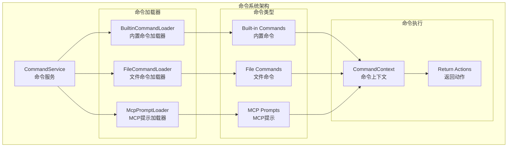
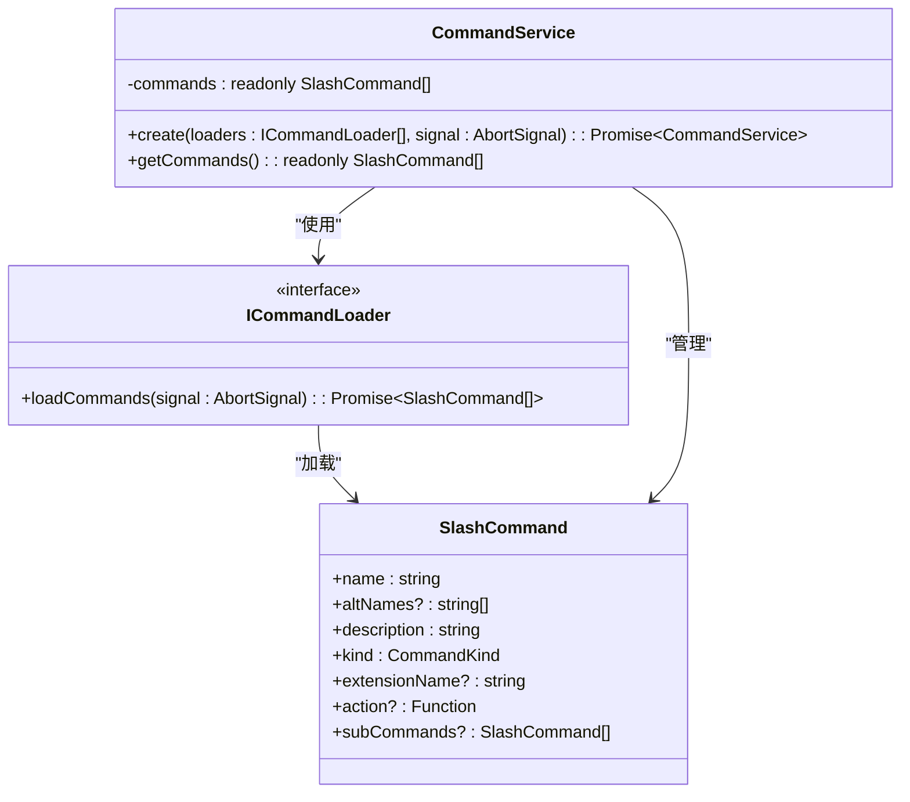
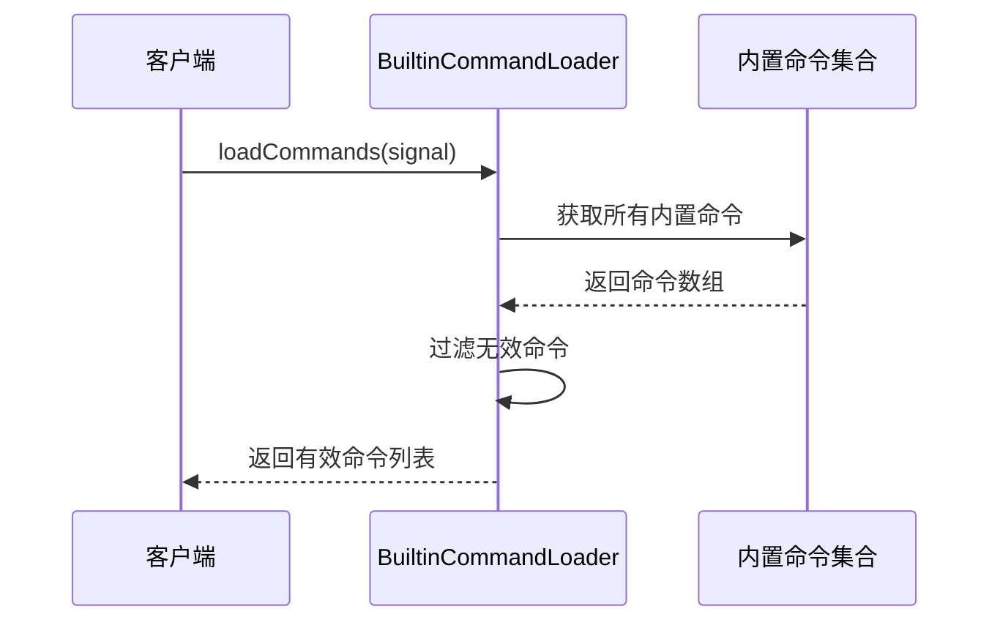
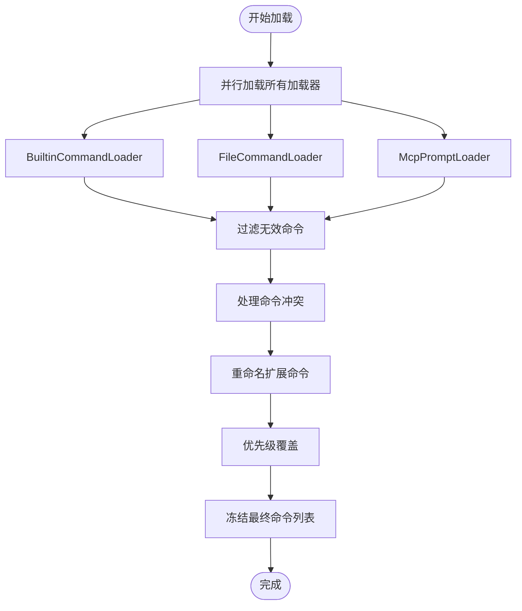
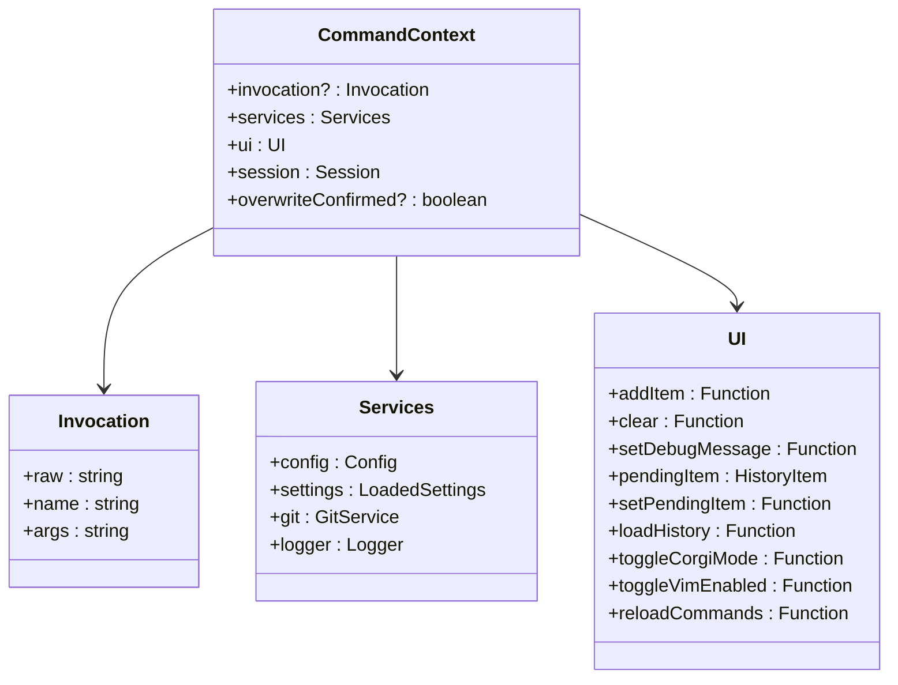
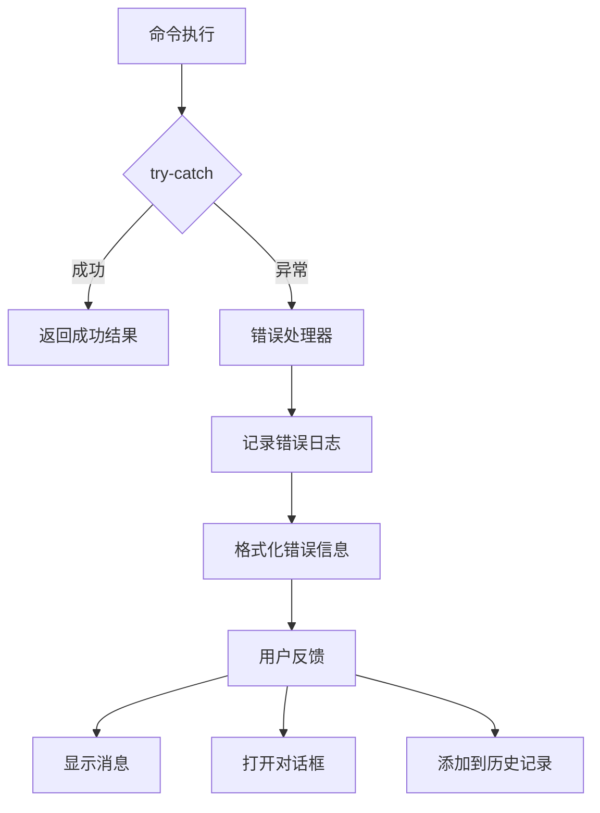

# 命令系统扩展指南

<cite>
**本文档引用的文件**
- [CommandService.ts](file://packages/cli/src/services/CommandService.ts)
- [BuiltinCommandLoader.ts](file://packages/cli/src/services/BuiltinCommandLoader.ts)
- [types.ts](file://packages/cli/src/ui/commands/types.ts)
- [helpCommand.ts](file://packages/cli/src/ui/commands/helpCommand.ts)
- [authCommand.ts](file://packages/cli/src/ui/commands/authCommand.ts)
- [quitCommand.ts](file://packages/cli/src/ui/commands/quitCommand.ts)
- [directoryCommand.tsx](file://packages/cli/src/ui/commands/directoryCommand.tsx)
- [settingsCommand.ts](file://packages/cli/src/ui/commands/settingsCommand.ts)
- [CommandService.test.ts](file://packages/cli/src/services/CommandService.test.ts)
- [mockCommandContext.ts](file://packages/cli/src/test-utils/mockCommandContext.ts)
- [errors.ts](file://packages/cli/src/utils/errors.ts)
- [config.ts](file://packages/cli/src/config/config.ts)
</cite>

## 目录
1. [简介](#简介)
2. [架构概览](#架构概览)
3. [核心组件分析](#核心组件分析)
4. [命令注册与加载机制](#命令注册与加载机制)
5. [命令类型与实现](#命令类型与实现)
6. [扩展命令开发指南](#扩展命令开发指南)
7. [错误处理与用户反馈](#错误处理与用户反馈)
8. [测试策略](#测试策略)
9. [最佳实践](#最佳实践)
10. [故障排除](#故障排除)

## 简介

Qwen Code CLI采用模块化的命令系统架构，支持多种命令源的动态加载和管理。该系统的核心是`CommandService`和`ICommandLoader`接口，提供了灵活的扩展机制，允许开发者轻松添加新命令而无需修改核心框架。

命令系统的主要特点：
- **多源加载**：支持内置命令、文件命令、MCP提示等多种命令来源
- **冲突解决**：智能处理命令名称冲突，支持扩展命令重命名
- **异步加载**：所有命令加载都是异步的，支持取消操作
- **类型安全**：完整的TypeScript类型定义，确保编译时检查
- **可测试性**：完善的测试工具和模拟器支持

## 架构概览



**图表来源**
- [CommandService.ts](file://packages/cli/src/services/CommandService.ts#L1-L104)
- [BuiltinCommandLoader.ts](file://packages/cli/src/services/BuiltinCommandLoader.ts#L1-L95)

## 核心组件分析

### CommandService - 命令服务

`CommandService`是整个命令系统的核心协调器，负责管理所有命令的发现、加载和去重。



**图表来源**
- [CommandService.ts](file://packages/cli/src/services/CommandService.ts#L15-L104)
- [types.ts](file://packages/cli/src/ui/commands/types.ts#L150-L212)

**章节来源**
- [CommandService.ts](file://packages/cli/src/services/CommandService.ts#L1-L104)

### BuiltinCommandLoader - 内置命令加载器

`BuiltinCommandLoader`负责加载所有硬编码的内置命令，这些命令构成了CLI的核心功能。



**图表来源**
- [BuiltinCommandLoader.ts](file://packages/cli/src/services/BuiltinCommandLoader.ts#L40-L95)

**章节来源**
- [BuiltinCommandLoader.ts](file://packages/cli/src/services/BuiltinCommandLoader.ts#L1-L95)

## 命令注册与加载机制

### 命令加载流程



**图表来源**
- [CommandService.ts](file://packages/cli/src/services/CommandService.ts#L40-L85)

### 命令冲突解决策略

命令系统实现了智能的冲突解决机制：

1. **扩展命令重命名**：当扩展命令与现有命令冲突时，自动重命名为`extensionName.commandName`
2. **优先级覆盖**：后加载的命令会覆盖先加载的同名命令
3. **多重冲突处理**：支持复杂的嵌套冲突场景

**章节来源**
- [CommandService.ts](file://packages/cli/src/services/CommandService.ts#L55-L85)

## 命令类型与实现

### 基本命令结构

每个命令都遵循统一的接口定义：

```typescript
interface SlashCommand {
  name: string;                    // 命令名称
  altNames?: string[];             // 备用名称
  description: string;             // 命令描述
  kind: CommandKind;               // 命令类型
  extensionName?: string;          // 扩展名称（仅扩展命令）
  action?: (context: CommandContext, args: string) => void; // 命令逻辑
  subCommands?: SlashCommand[];    // 子命令（可选）
}
```

### 命令类型枚举

```typescript
enum CommandKind {
  BUILT_IN = 'built-in',           // 内置命令
  FILE = 'file',                   // 文件命令
  MCP_PROMPT = 'mcp-prompt',       // MCP提示
}
```

### 实现示例

#### 简单命令示例（help）

```typescript
export const helpCommand: SlashCommand = {
  name: 'help',
  altNames: ['?'],
  kind: CommandKind.BUILT_IN,
  description: 'for help on Qwen Code',
  action: async (context) => {
    const helpItem: Omit<HistoryItemHelp, 'id'> = {
      type: MessageType.HELP,
      timestamp: new Date(),
    };
    context.ui.addItem(helpItem, Date.now());
  },
};
```

#### 对话框命令示例（auth）

```typescript
export const authCommand: SlashCommand = {
  name: 'auth',
  description: 'change the auth method',
  kind: CommandKind.BUILT_IN,
  action: (_context, _args): OpenDialogActionReturn => ({
    type: 'dialog',
    dialog: 'auth',
  }),
};
```

#### 复杂交互命令示例（directory）

```typescript
export const directoryCommand: SlashCommand = {
  name: 'directory',
  altNames: ['dir'],
  description: 'Manage workspace directories',
  kind: CommandKind.BUILT_IN,
  subCommands: [
    {
      name: 'add',
      description: 'Add directories to the workspace',
      kind: CommandKind.BUILT_IN,
      action: async (context: CommandContext, args: string) => {
        // 复杂的目录管理逻辑
        const pathsToAdd = args.split(',').filter(p => p);
        // 处理添加逻辑...
      },
    },
    {
      name: 'show',
      description: 'Show all directories in the workspace',
      kind: CommandKind.BUILT_IN,
      action: async (context: CommandContext) => {
        // 显示当前工作区目录
      },
    },
  ],
};
```

**章节来源**
- [helpCommand.ts](file://packages/cli/src/ui/commands/helpCommand.ts#L1-L25)
- [authCommand.ts](file://packages/cli/src/ui/commands/authCommand.ts#L1-L19)
- [directoryCommand.tsx](file://packages/cli/src/ui/commands/directoryCommand.tsx#L1-L183)

## 扩展命令开发指南

### 开发步骤

1. **创建命令文件**：在`packages/cli/src/ui/commands/`目录下创建新文件
2. **定义命令结构**：实现`SlashCommand`接口
3. **实现命令逻辑**：在`action`函数中编写业务逻辑
4. **添加错误处理**：确保命令的健壮性
5. **编写测试**：为新命令编写单元测试

### 命令上下文详解



**图表来源**
- [types.ts](file://packages/cli/src/ui/commands/types.ts#L15-L80)

### 参数解析最佳实践

```typescript
// 示例：带参数解析的命令
const exampleCommand: SlashCommand = {
  name: 'example',
  description: 'Example command with parameters',
  action: async (context, args) => {
    // 1. 解析参数
    const params = args.trim().split(/\s+/);
    const [operation, ...rest] = params;
    
    // 2. 验证参数
    if (!operation) {
      return {
        type: 'message',
        messageType: 'error',
        content: 'Operation is required',
      };
    }
    
    // 3. 执行业务逻辑
    try {
      switch (operation) {
        case 'add':
          return await handleAdd(rest);
        case 'remove':
          return await handleRemove(rest);
        default:
          return {
            type: 'message',
            messageType: 'error',
            content: `Unknown operation: ${operation}`,
          };
      }
    } catch (error) {
      return {
        type: 'message',
        messageType: 'error',
        content: `Error: ${error.message}`,
      };
    }
  },
};
```

### 权限验证机制

```typescript
// 示例：带权限验证的命令
const restrictedCommand: SlashCommand = {
  name: 'admin',
  description: 'Admin command requiring permissions',
  action: async (context, args) => {
    // 检查用户权限
    if (!await checkUserPermissions(context)) {
      return {
        type: 'message',
        messageType: 'error',
        content: 'Access denied: Insufficient permissions',
      };
    }
    
    // 执行需要权限的操作
    return await performRestrictedOperation(args);
  },
};
```

## 错误处理与用户反馈

### 错误处理模式



### 用户反馈机制

系统提供了多种用户反馈方式：

1. **消息反馈**：简单的文本消息
2. **对话框反馈**：复杂的交互式界面
3. **历史记录**：持久化的操作记录
4. **调试信息**：开发模式下的详细信息

```typescript
// 错误处理示例
const handleError = (error: unknown, context: CommandContext): MessageActionReturn => {
  const errorMessage = getErrorMessage(error);
  
  // 记录错误日志
  context.services.logger.error(`Command failed: ${errorMessage}`);
  
  // 返回用户友好的错误消息
  return {
    type: 'message',
    messageType: 'error',
    content: `操作失败: ${errorMessage}`,
  };
};
```

**章节来源**
- [errors.ts](file://packages/cli/src/utils/errors.ts#L1-L13)

## 测试策略

### 单元测试模板

```typescript
import { describe, it, expect } from 'vitest';
import { createMockCommandContext } from '../test-utils/mockCommandContext';

describe('NewCommand', () => {
  it('should execute successfully', async () => {
    const context = createMockCommandContext();
    const result = await newCommand.action(context, 'test arg');
    
    expect(result).toBeDefined();
    expect(context.ui.addItem).toHaveBeenCalled();
  });
  
  it('should handle errors gracefully', async () => {
    const context = createMockCommandContext({
      services: {
        logger: {
          error: vi.fn(),
        },
      },
    });
    
    // 模拟错误情况
    vi.mocked(context.services.logger.error).mockImplementation(() => {});
    
    const result = await newCommand.action(context, '');
    
    expect(result).toHaveProperty('type', 'message');
    expect(result).toHaveProperty('messageType', 'error');
  });
});
```

### 测试工具使用

```typescript
// 使用模拟命令上下文进行测试
const createTestContext = () => {
  return createMockCommandContext({
    services: {
      config: mockConfig,
      settings: mockSettings,
    },
    ui: {
      addItem: vi.fn(),
      clear: vi.fn(),
    },
  });
};
```

**章节来源**
- [mockCommandContext.ts](file://packages/cli/src/test-utils/mockCommandContext.ts#L1-L109)

## 最佳实践

### 命令设计原则

1. **单一职责**：每个命令应该只做一件事
2. **幂等性**：重复执行相同命令应该产生相同结果
3. **用户友好**：提供清晰的错误信息和帮助文本
4. **性能优化**：避免不必要的计算和I/O操作
5. **安全性**：验证输入参数，防止注入攻击

### 异步处理最佳实践

```typescript
// 推荐的异步命令实现
const asyncCommand: SlashCommand = {
  name: 'async',
  description: 'Asynchronous command example',
  action: async (context, args) => {
    // 1. 验证输入
    if (!args.trim()) {
      return {
        type: 'message',
        messageType: 'error',
        content: 'Argument required',
      };
    }
    
    // 2. 设置待处理状态
    context.ui.setPendingItem({
      type: MessageType.INFO,
      text: 'Processing...',
    });
    
    try {
      // 3. 执行异步操作
      const result = await performAsyncOperation(args);
      
      // 4. 清理待处理状态
      context.ui.setPendingItem(null);
      
      // 5. 返回结果
      return {
        type: 'message',
        messageType: 'info',
        content: `Success: ${result}`,
      };
    } catch (error) {
      // 6. 清理待处理状态
      context.ui.setPendingItem(null);
      
      // 7. 返回错误
      return handleError(error, context);
    }
  },
};
```

### 配置管理

```typescript
// 使用配置系统
const configCommand: SlashCommand = {
  name: 'config',
  description: 'Configure settings',
  action: async (context, args) => {
    const { config, settings } = context.services;
    
    if (!config) {
      return {
        type: 'message',
        messageType: 'error',
        content: 'Configuration unavailable',
      };
    }
    
    // 使用配置值
    const currentModel = config.getModel();
    const currentSettings = settings.merged;
    
    // 更新配置
    config.updateSettings({ /* 新设置 */ });
    
    return {
      type: 'message',
      messageType: 'info',
      content: 'Configuration updated',
    };
  },
};
```

## 故障排除

### 常见问题与解决方案

1. **命令未找到**
   - 检查命令是否正确注册到加载器中
   - 验证命令名称拼写
   - 确认加载器优先级顺序

2. **参数解析错误**
   - 添加参数验证逻辑
   - 提供默认参数值
   - 实现参数格式化

3. **权限问题**
   - 检查用户权限设置
   - 实现适当的权限检查
   - 提供清晰的错误消息

4. **异步操作超时**
   - 设置合理的超时时间
   - 实现进度指示器
   - 提供取消操作选项

### 调试技巧

```typescript
// 启用调试模式
const debugCommand: SlashCommand = {
  name: 'debug',
  description: 'Debug command',
  action: async (context, args) => {
    const { logger } = context.services;
    
    // 记录调试信息
    logger.debug('Command execution started', {
      args,
      timestamp: new Date(),
    });
    
    try {
      // 命令逻辑
      const result = await executeCommand(args);
      
      logger.debug('Command execution succeeded', { result });
      return { type: 'message', messageType: 'info', content: 'Success' };
    } catch (error) {
      logger.error('Command execution failed', { error });
      return handleError(error, context);
    }
  },
};
```

### 性能监控

```typescript
// 性能监控示例
const monitoredCommand: SlashCommand = {
  name: 'monitor',
  description: 'Monitored command',
  action: async (context, args) => {
    const startTime = performance.now();
    
    try {
      const result = await performOperation(args);
      
      const duration = performance.now() - startTime;
      context.services.logger.debug(`Command took ${duration}ms`);
      
      return {
        type: 'message',
        messageType: 'info',
        content: `Completed in ${duration.toFixed(2)}ms`,
      };
    } catch (error) {
      const duration = performance.now() - startTime;
      context.services.logger.error(`Command failed after ${duration}ms`);
      throw error;
    }
  },
};
```

通过遵循这些指南和最佳实践，开发者可以有效地扩展Qwen Code CLI的功能，创建高质量、可靠且用户友好的命令。命令系统的模块化设计确保了新功能的添加不会影响现有功能，同时保持了系统的可维护性和可扩展性。