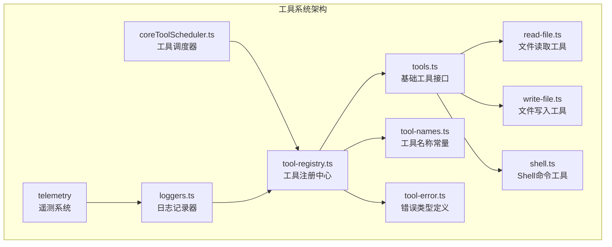
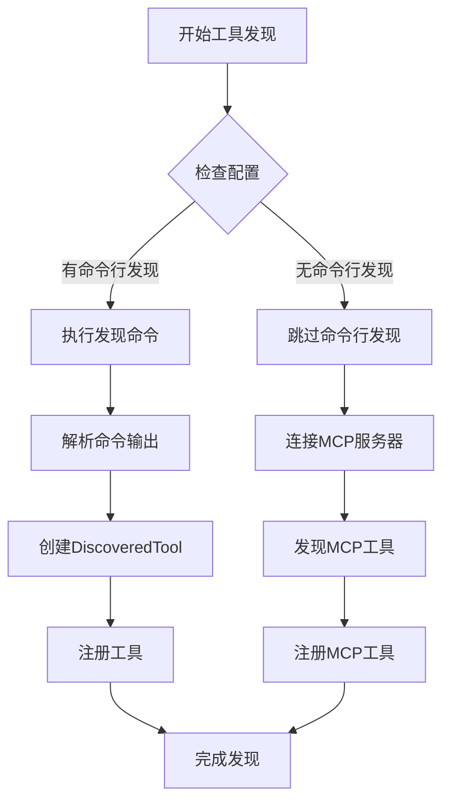
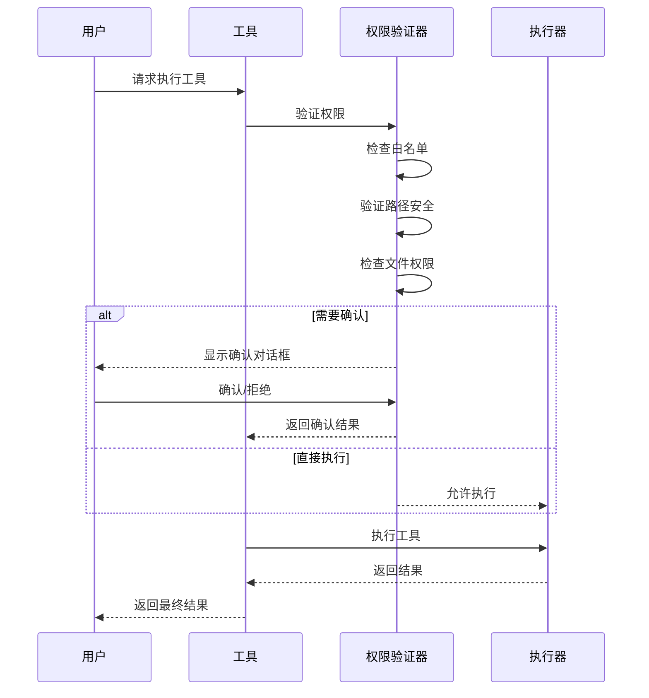
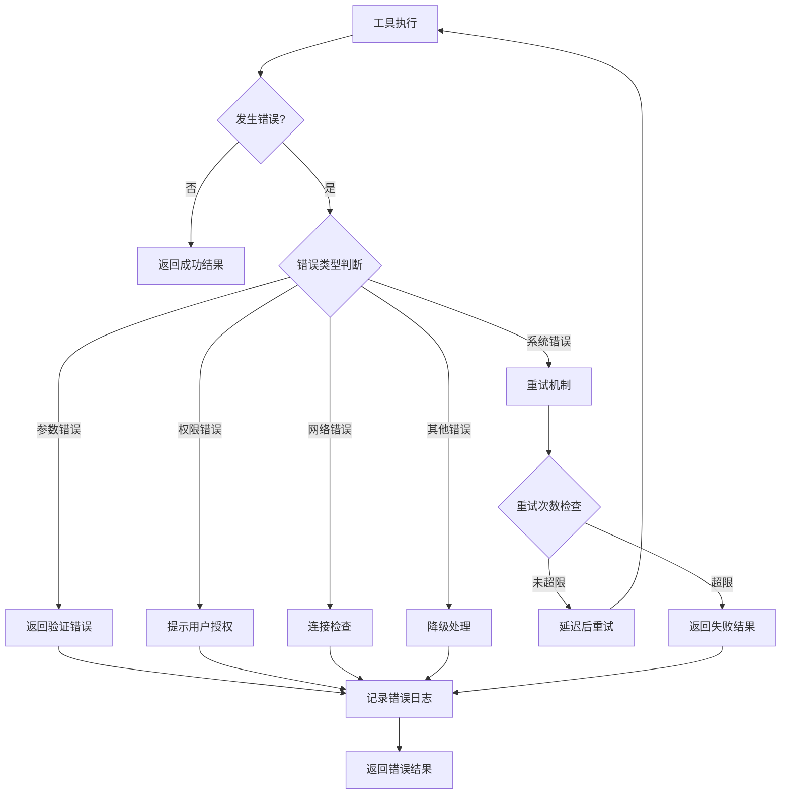

# 工具扩展开发指南

<cite>
**本文档引用的文件**
- [tool-registry.ts](file://packages/core/src/tools/tool-registry.ts)
- [tool-names.ts](file://packages/core/src/tools/tool-names.ts)
- [tool-error.ts](file://packages/core/src/tools/tool-error.ts)
- [read-file.ts](file://packages/core/src/tools/read-file.ts)
- [write-file.ts](file://packages/core/src/tools/write-file.ts)
- [shell.ts](file://packages/core/src/tools/shell.ts)
- [tools.ts](file://packages/core/src/tools/tools.ts)
- [coreToolScheduler.ts](file://packages/core/src/core/coreToolScheduler.ts)
- [loggers.ts](file://packages/core/src/telemetry/loggers.ts)
</cite>

## 目录
1. [简介](#简介)
2. [项目结构概览](#项目结构概览)
3. [工具注册机制](#工具注册机制)
4. [工具命名规范](#工具命名规范)
5. [接口契约设计](#接口契约设计)
6. [同步与异步工具实现](#同步与异步工具实现)
7. [工具权限控制](#工具权限控制)
8. [输入验证最佳实践](#输入验证最佳实践)
9. [错误封装与处理](#错误封装与处理)
10. [工具组合模式](#工具组合模式)
11. [调用链优化策略](#调用链优化策略)
12. [性能监控与日志记录](#性能监控与日志记录)
13. [开发示例](#开发示例)
14. [故障排除指南](#故障排除指南)
15. [总结](#总结)

## 简介

Qwen Code是一个强大的命令行AI工作流工具，专为开发者设计。本指南详细介绍了如何在Core模块中添加新的AI工具，包括工具注册机制、命名规范、接口契约以及最佳实践。

工具系统是Qwen Code的核心组件之一，它提供了统一的接口来执行各种操作，从文件读写到Shell命令执行，再到复杂的业务逻辑处理。通过遵循本指南中的规范和最佳实践，您可以轻松地扩展系统功能，同时保持代码的一致性和可维护性。

## 项目结构概览

Qwen Code的工具系统采用模块化架构，主要组件分布在以下目录结构中：



**图表来源**
- [tool-registry.ts](file://packages/core/src/tools/tool-registry.ts#L1-L50)
- [tools.ts](file://packages/core/src/tools/tools.ts#L1-L50)

**章节来源**
- [tool-registry.ts](file://packages/core/src/tools/tool-registry.ts#L1-L477)
- [tools.ts](file://packages/core/src/tools/tools.ts#L1-L588)

## 工具注册机制

### ToolRegistry类详解

`ToolRegistry`是整个工具系统的核心管理器，负责工具的注册、发现和管理。它提供了完整的生命周期管理功能：

```typescript
export class ToolRegistry {
  private tools: Map<string, AnyDeclarativeTool> = new Map();
  private config: Config;
  private mcpClientManager: McpClientManager;

  constructor(config: Config) {
    this.config = config;
    this.mcpClientManager = new McpClientManager(
      this.config.getMcpServers() ?? {},
      this.config.getMcpServerCommand(),
      this,
      this.config.getPromptRegistry(),
      this.config.getDebugMode(),
      this.config.getWorkspaceContext(),
    );
  }
}
```

### 注册流程

工具注册遵循以下步骤：

1. **工具验证**：检查工具名称是否已存在
2. **冲突处理**：决定是否覆盖现有工具或抛出警告
3. **存储管理**：将工具添加到内部映射表中

```typescript
registerTool(tool: AnyDeclarativeTool): void {
  if (this.tools.has(tool.name)) {
    if (tool instanceof DiscoveredMCPTool) {
      tool = tool.asFullyQualifiedTool();
    } else {
      console.warn(
        `Tool with name "${tool.name}" is already registered. Overwriting.`,
      );
    }
  }
  this.tools.set(tool.name, tool);
}
```

### 发现机制

工具发现支持多种方式：

- **命令行发现**：通过配置的命令自动发现工具
- **MCP服务器发现**：连接到MCP（Model Context Protocol）服务器
- **手动注册**：直接注册预定义的工具实例



**图表来源**
- [tool-registry.ts](file://packages/core/src/tools/tool-registry.ts#L130-L200)

**章节来源**
- [tool-registry.ts](file://packages/core/src/tools/tool-registry.ts#L100-L150)

## 工具命名规范

### 命名约定

Qwen Code使用严格的命名规范来避免冲突和提高可读性。所有工具名称都定义在`ToolNames`常量对象中：

```typescript
export const ToolNames = {
  EDIT: 'edit',
  WRITE_FILE: 'write_file',
  READ_FILE: 'read_file',
  READ_MANY_FILES: 'read_many_files',
  GREP: 'search_file_content',
  GLOB: 'glob',
  SHELL: 'run_shell_command',
  TODO_WRITE: 'todo_write',
  MEMORY: 'save_memory',
  TASK: 'task',
  EXIT_PLAN_MODE: 'exit_plan_mode',
} as const;
```

### 命名原则

1. **小写字母**：使用下划线分隔的单词格式
2. **语义明确**：名称应清晰表达工具的功能
3. **避免歧义**：确保名称不会与其他工具混淆
4. **一致性**：遵循现有的命名模式

### 新工具命名示例

```typescript
// 推荐的命名格式
export const ToolNames = {
  // 文件操作工具
  READ_FILE: 'read_file',
  WRITE_FILE: 'write_file',
  LIST_DIRECTORY: 'list_directory',
  
  // 搜索工具
  SEARCH_CODE: 'search_code',
  SEARCH_FILE_CONTENT: 'search_file_content',
  
  // 开发工具
  RUN_TESTS: 'run_tests',
  GENERATE_DOCS: 'generate_docs',
  
  // 自定义工具
  CUSTOM_ANALYZER: 'custom_analyzer',
  DATA_PROCESSOR: 'data_processor',
};
```

**章节来源**
- [tool-names.ts](file://packages/core/src/tools/tool-names.ts#L1-L25)

## 接口契约设计

### 核心接口定义

Qwen Code定义了一套完整的接口契约来确保工具的一致性和互操作性：

```typescript
export interface ToolInvocation<TParams extends object, TResult extends ToolResult> {
  params: TParams;
  getDescription(): string;
  toolLocations(): ToolLocation[];
  shouldConfirmExecute(abortSignal: AbortSignal): Promise<ToolCallConfirmationDetails | false>;
  execute(signal: AbortSignal, updateOutput?: (output: ToolResultDisplay) => void): Promise<TResult>;
}
```

### 工具构建器模式

每个工具都必须实现`ToolBuilder`接口，该接口定义了工具的基本属性和行为：

```typescript
export interface ToolBuilder<TParams extends object, TResult extends ToolResult> {
  name: string;
  displayName: string;
  description: string;
  kind: Kind;
  schema: FunctionDeclaration;
  isOutputMarkdown: boolean;
  canUpdateOutput: boolean;
  build(params: TParams): ToolInvocation<TParams, TResult>;
}
```

### 工具分类体系

工具根据其功能被分为不同的类别：

```typescript
export enum Kind {
  Read = 'read',
  Write = 'write',
  Execute = 'execute',
  Other = 'other',
}
```

### 完整的工具实现示例

```typescript
export class CustomTool extends BaseDeclarativeTool<CustomParams, ToolResult> {
  static readonly Name: string = ToolNames.CUSTOM_TOOL;

  constructor(private config: Config) {
    super(
      CustomTool.Name,
      'CustomTool',
      'Description of what this tool does',
      Kind.Other,
      {
        properties: {
          parameter1: {
            description: 'First parameter description',
            type: 'string',
          },
          parameter2: {
            description: 'Second parameter description',
            type: 'number',
          },
        },
        required: ['parameter1'],
        type: 'object',
      },
    );
  }

  protected override validateToolParamValues(params: CustomParams): string | null {
    if (!params.parameter1) {
      return "Parameter 'parameter1' is required";
    }
    return null;
  }

  protected createInvocation(params: CustomParams): ToolInvocation<CustomParams, ToolResult> {
    return new CustomToolInvocation(this.config, params);
  }
}
```

**章节来源**
- [tools.ts](file://packages/core/src/tools/tools.ts#L1-L200)

## 同步与异步工具实现

### 同步工具实现

同步工具适用于快速执行的操作，如简单的数据转换或计算：

```typescript
class SyncToolInvocation extends BaseToolInvocation<SyncParams, ToolResult> {
  async execute(): Promise<ToolResult> {
    try {
      const result = performSyncOperation(this.params);
      
      return {
        llmContent: result.output,
        returnDisplay: result.display,
      };
    } catch (error) {
      return {
        llmContent: 'Error performing operation',
        returnDisplay: 'Error performing operation',
        error: {
          message: error.message,
          type: ToolErrorType.EXECUTION_FAILED,
        },
      };
    }
  }
}
```

### 异步工具实现

异步工具用于需要长时间运行或涉及外部资源的操作：

```typescript
class AsyncToolInvocation extends BaseToolInvocation<AsyncParams, ToolResult> {
  async execute(
    signal: AbortSignal,
    updateOutput?: (output: ToolResultDisplay) => void,
  ): Promise<ToolResult> {
    const process = spawn('long-running-command', ['arg1', 'arg2']);
    
    process.stdout.on('data', (chunk) => {
      if (updateOutput) {
        updateOutput({ content: chunk.toString() });
      }
    });
    
    return new Promise((resolve, reject) => {
      process.on('close', (code) => {
        if (code === 0) {
          resolve({ llmContent: 'Success' });
        } else {
          reject(new Error(`Process exited with code ${code}`));
        }
      });
      
      signal.addEventListener('abort', () => {
        process.kill();
        resolve({ llmContent: 'Operation cancelled' });
      });
    });
  }
}
```

### 性能考虑

1. **响应时间**：同步工具应在100ms内完成
2. **资源管理**：异步工具需要正确处理资源清理
3. **取消支持**：所有异步操作都应该支持AbortSignal
4. **进度报告**：长时间运行的操作应该支持实时更新

**章节来源**
- [read-file.ts](file://packages/core/src/tools/read-file.ts#L1-L100)
- [shell.ts](file://packages/core/src/tools/shell.ts#L1-L100)

## 工具权限控制

### 访问级别控制

Qwen Code实现了多层次的权限控制系统：

```typescript
export interface ToolCallConfirmationDetails {
  type: 'exec' | 'edit';
  title: string;
  command?: string;
  rootCommand?: string;
  filePath?: string;
  fileDiff?: string;
  originalContent?: string;
  newContent?: string;
  onConfirm: (outcome: ToolConfirmationOutcome) => Promise<void>;
  ideConfirmation?: Promise<IDEConfirmationResult>;
}
```

### 权限验证流程



**图表来源**
- [write-file.ts](file://packages/core/src/tools/write-file.ts#L80-L120)
- [shell.ts](file://packages/core/src/tools/shell.ts#L50-L90)

### 路径安全检查

```typescript
protected override validateToolParamValues(params: FileParams): string | null {
  const filePath = params.file_path;
  
  // 检查绝对路径
  if (!path.isAbsolute(filePath)) {
    return `File path must be absolute, but was relative: ${filePath}`;
  }
  
  // 检查工作区范围
  const workspaceContext = this.config.getWorkspaceContext();
  if (!workspaceContext.isPathWithinWorkspace(filePath)) {
    const directories = workspaceContext.getDirectories();
    return `File path must be within one of the workspace directories: ${directories.join(', ')}`;
  }
  
  // 检查忽略模式
  const fileService = this.config.getFileService();
  if (fileService.shouldGeminiIgnoreFile(filePath)) {
    return `File path '${filePath}' is ignored by .qwenignore pattern(s).`;
  }
  
  return null;
}
```

**章节来源**
- [write-file.ts](file://packages/core/src/tools/write-file.ts#L150-L200)

## 输入验证最佳实践

### 参数验证框架

Qwen Code使用JSON Schema进行参数验证，并结合自定义验证逻辑：

```typescript
export interface ValidationRule {
  field: string;
  validator: (value: any) => string | null;
  message: string;
}

export class ParameterValidator {
  private rules: ValidationRule[] = [];

  addRule(field: string, validator: (value: any) => string | null, message: string): this {
    this.rules.push({ field, validator, message });
    return this;
  }

  validate(params: object): string[] {
    const errors: string[] = [];
    
    for (const rule of this.rules) {
      const value = (params as any)[rule.field];
      const error = rule.validator(value);
      if (error) {
        errors.push(rule.message);
      }
    }
    
    return errors;
  }
}
```

### 类型安全验证

```typescript
interface FileOperationParams {
  file_path: string;
  content?: string;
  encoding?: 'utf8' | 'base64';
  mode?: 'create' | 'overwrite' | 'append';
}

class FileOperationValidator {
  validate(params: FileOperationParams): ValidationResult {
    const errors: string[] = [];
    
    // 必需字段验证
    if (!params.file_path) {
      errors.push("Parameter 'file_path' is required");
    }
    
    // 文件路径验证
    if (params.file_path && !path.isAbsolute(params.file_path)) {
      errors.push("File path must be absolute");
    }
    
    // 内容编码验证
    if (params.encoding && !['utf8', 'base64'].includes(params.encoding)) {
      errors.push("Invalid encoding. Must be 'utf8' or 'base64'");
    }
    
    // 模式验证
    if (params.mode && !['create', 'overwrite', 'append'].includes(params.mode)) {
      errors.push("Invalid mode. Must be 'create', 'overwrite', or 'append'");
    }
    
    return {
      isValid: errors.length === 0,
      errors,
    };
  }
}
```

### 错误消息标准化

```typescript
export class ValidationErrorFormatter {
  static formatErrors(errors: string[]): string {
    if (errors.length === 0) return '';
    
    const formattedErrors = errors.map(error => `- ${error}`).join('\n');
    return `Validation failed:\n${formattedErrors}`;
  }
  
  static formatSingleError(message: string): string {
    return `Invalid parameter: ${message}`;
  }
}
```

**章节来源**
- [read-file.ts](file://packages/core/src/tools/read-file.ts#L150-L200)

## 错误封装与处理

### 错误类型系统

Qwen Code定义了全面的错误类型系统来处理各种异常情况：

```typescript
export enum ToolErrorType {
  // 通用错误
  INVALID_TOOL_PARAMS = 'invalid_tool_params',
  UNKNOWN = 'unknown',
  UNHANDLED_EXCEPTION = 'unhandled_exception',
  TOOL_NOT_REGISTERED = 'tool_not_registered',
  EXECUTION_FAILED = 'execution_failed',

  // 文件系统错误
  FILE_NOT_FOUND = 'file_not_found',
  FILE_WRITE_FAILURE = 'file_write_failure',
  READ_CONTENT_FAILURE = 'read_content_failure',
  ATTEMPT_TO_CREATE_EXISTING_FILE = 'attempt_to_create_existing_file',
  FILE_TOO_LARGE = 'file_too_large',
  PERMISSION_DENIED = 'permission_denied',
  NO_SPACE_LEFT = 'no_space_left',
  TARGET_IS_DIRECTORY = 'target_is_directory',
  PATH_NOT_IN_WORKSPACE = 'path_not_in_workspace',
  SEARCH_PATH_NOT_FOUND = 'search_path_not_found',
  SEARCH_PATH_NOT_A_DIRECTORY = 'search_path_not_a_directory',

  // 特定工具错误
  EDIT_PREPARATION_FAILURE = 'edit_preparation_failure',
  EDIT_NO_OCCURRENCE_FOUND = 'edit_no_occurrence_found',
  EDIT_EXPECTED_OCCURRENCE_MISMATCH = 'edit_expected_occurrence_mismatch',
  EDIT_NO_CHANGE = 'edit_no_change',
  SHELL_EXECUTE_ERROR = 'shell_execute_error',
  DISCOVERED_TOOL_EXECUTION_ERROR = 'discovered_tool_execution_error',
}
```

### 统一错误处理

```typescript
class ToolErrorHandler {
  static createErrorResult(error: Error, errorType: ToolErrorType): ToolResult {
    return {
      llmContent: error.message,
      returnDisplay: error.message,
      error: {
        message: error.message,
        type: errorType,
      },
    };
  }
  
  static createValidationErrorResult(message: string): ToolResult {
    return {
      llmContent: message,
      returnDisplay: message,
      error: {
        message: message,
        type: ToolErrorType.INVALID_TOOL_PARAMS,
      },
    };
  }
  
  static createSystemErrorResult(message: string): ToolResult {
    return {
      llmContent: 'System error occurred',
      returnDisplay: 'System error occurred',
      error: {
        message: message,
        type: ToolErrorType.UNKNOWN,
      },
    };
  }
}
```

### 错误恢复策略



**图表来源**
- [tool-error.ts](file://packages/core/src/tools/tool-error.ts#L1-L70)

**章节来源**
- [tool-error.ts](file://packages/core/src/tools/tool-error.ts#L1-L70)

## 工具组合模式

### 组合工具架构

Qwen Code支持工具组合模式，允许将多个简单工具组合成复杂的工作流：

```typescript
export class CompositeTool extends BaseDeclarativeTool<CompositeParams, ToolResult> {
  private subTools: Map<string, AnyDeclarativeTool>;

  constructor(private config: Config) {
    super(
      'composite_tool',
      'Composite Tool',
      'A tool that combines multiple operations',
      Kind.Other,
      {
        properties: {
          operations: {
            type: 'array',
            items: {
              type: 'object',
              properties: {
                tool: { type: 'string' },
                params: { type: 'object' },
              },
              required: ['tool', 'params'],
            },
          },
        },
        required: ['operations'],
        type: 'object',
      },
    );
    
    this.subTools = new Map();
    this.initializeSubTools();
  }

  private initializeSubTools(): void {
    // 注册子工具
    this.subTools.set('read', this.config.getToolRegistry().getTool('read_file'));
    this.subTools.set('write', this.config.getToolRegistry().getTool('write_file'));
    this.subTools.set('shell', this.config.getToolRegistry().getTool('run_shell_command'));
  }

  async executeOperations(operations: Operation[]): Promise<ToolResult[]> {
    const results: ToolResult[] = [];
    
    for (const operation of operations) {
      const tool = this.subTools.get(operation.tool);
      if (!tool) {
        throw new Error(`Unknown tool: ${operation.tool}`);
      }
      
      const result = await tool.build(operation.params).execute(new AbortSignal());
      results.push(result);
    }
    
    return results;
  }
}
```

### 工作流编排

```typescript
interface WorkflowStep {
  name: string;
  tool: string;
  params: object;
  dependsOn?: string[];
  condition?: (results: ToolResult[]) => boolean;
}

class WorkflowEngine {
  async executeWorkflow(steps: WorkflowStep[], initialResults: ToolResult[] = []): Promise<ToolResult[]> {
    const results = [...initialResults];
    const stepMap = new Map<string, WorkflowStep>();
    
    // 构建依赖图
    for (const step of steps) {
      stepMap.set(step.name, step);
    }
    
    // 执行步骤
    for (const step of steps) {
      if (this.canExecute(step, results)) {
        const tool = this.config.getToolRegistry().getTool(step.tool);
        if (tool) {
          const result = await tool.build(step.params).execute(new AbortSignal());
          results.push(result);
          
          // 更新后续步骤的依赖状态
          this.updateDependencies(step.name, results);
        }
      }
    }
    
    return results;
  }
  
  private canExecute(step: WorkflowStep, results: ToolResult[]): boolean {
    if (!step.dependsOn) return true;
    
    const completedSteps = results.map(r => r.stepName);
    return step.dependsOn.every(dep => completedSteps.includes(dep));
  }
}
```

**章节来源**
- [coreToolScheduler.ts](file://packages/core/src/core/coreToolScheduler.ts#L255-L300)

## 调用链优化策略

### 并发执行优化

```typescript
export class OptimizedToolScheduler {
  private maxConcurrentExecutions = 5;
  private executionQueue: ExecutionTask[] = [];
  private activeExecutions = new Set<ExecutionTask>();

  async scheduleTools(tasks: ToolExecutionRequest[]): Promise<ToolResult[]> {
    const results: ToolResult[] = [];
    
    // 将任务加入队列
    for (const task of tasks) {
      this.executionQueue.push(new ExecutionTask(task));
    }
    
    // 处理队列
    while (this.executionQueue.length > 0 || this.activeExecutions.size > 0) {
      // 启动新的并发执行
      while (this.activeExecutions.size < this.maxConcurrentExecutions && this.executionQueue.length > 0) {
        const task = this.executionQueue.shift()!;
        this.executeTask(task);
        this.activeExecutions.add(task);
      }
      
      // 等待当前执行完成
      await Promise.race(Array.from(this.activeExecutions).map(task => task.completionPromise));
      
      // 收集已完成的结果
      for (const task of Array.from(this.activeExecutions)) {
        if (task.isCompleted()) {
          this.activeExecutions.delete(task);
          results.push(task.getResult());
        }
      }
    }
    
    return results;
  }
}
```

### 缓存策略

```typescript
class ToolCache {
  private cache = new Map<string, CacheEntry>();
  private ttl = 300000; // 5分钟

  async getCachedResult(key: string, executor: () => Promise<ToolResult>): Promise<ToolResult> {
    const entry = this.cache.get(key);
    
    if (entry && !this.isExpired(entry)) {
      return entry.result;
    }
    
    const result = await executor();
    this.cache.set(key, {
      result,
      timestamp: Date.now(),
      metadata: { hitCount: 0 },
    });
    
    return result;
  }
  
  private isExpired(entry: CacheEntry): boolean {
    return Date.now() - entry.timestamp > this.ttl;
  }
  
  invalidate(key: string): void {
    this.cache.delete(key);
  }
}
```

### 性能监控指标

```typescript
interface PerformanceMetrics {
  executionTime: number;
  memoryUsage: number;
  cpuUsage: number;
  networkRequests: number;
  cacheHits: number;
  cacheMisses: number;
}

class PerformanceMonitor {
  private metrics: Map<string, PerformanceMetrics> = new Map();
  
  startTimer(toolName: string): Timer {
    return new Timer(toolName, this);
  }
  
  recordMetrics(toolName: string, metrics: Partial<PerformanceMetrics>): void {
    const existing = this.metrics.get(toolName) || this.createDefaultMetrics();
    this.metrics.set(toolName, { ...existing, ...metrics });
  }
  
  getReport(): MetricsReport {
    return {
      tools: Array.from(this.metrics.entries()),
      totals: this.calculateTotals(),
    };
  }
}
```

**章节来源**
- [coreToolScheduler.ts](file://packages/core/src/core/coreToolScheduler.ts#L255-L350)

## 性能监控与日志记录

### 遥测系统架构

Qwen Code集成了完整的遥测系统来监控工具执行性能：

```typescript
export function logToolCall(config: Config, event: ToolCallEvent): void {
  const uiEvent = {
    ...event,
    'event.name': EVENT_TOOL_CALL,
    'event.timestamp': new Date().toISOString(),
  } as UiEvent;
  
  uiTelemetryService.addEvent(uiEvent);
  QwenLogger.getInstance(config)?.logToolCallEvent(event);
  
  if (!isTelemetrySdkInitialized()) return;

  const attributes: LogAttributes = {
    ...getCommonAttributes(config),
    ...event,
    'event.name': EVENT_TOOL_CALL,
    'event.timestamp': new Date().toISOString(),
    function_args: safeJsonStringify(event.function_args, 2),
  };
  
  if (event.error) {
    attributes['error.message'] = event.error;
    if (event.error_type) {
      attributes['error.type'] = event.error_type;
    }
  }

  const logger = logs.getLogger(SERVICE_NAME);
  const logRecord: LogRecord = {
    body: `Tool call: ${event.function_name}${event.decision ? `. Decision: ${event.decision}` : ''}. Success: ${event.success}. Duration: ${event.duration_ms}ms.`,
    attributes,
  };
  logger.emit(logRecord);
}
```

### 日志记录最佳实践

```typescript
class ToolLogger {
  private static readonly LOG_LEVELS = {
    DEBUG: 0,
    INFO: 1,
    WARN: 2,
    ERROR: 3,
  } as const;

  logExecution(toolName: string, params: object, duration: number, success: boolean): void {
    const level = success ? 'INFO' : 'WARN';
    
    this.log(level, {
      tool: toolName,
      action: 'execution',
      params: this.sanitizeParams(params),
      duration,
      success,
      timestamp: new Date().toISOString(),
    });
  }
  
  logError(toolName: string, error: Error, context?: object): void {
    this.log('ERROR', {
      tool: toolName,
      action: 'error',
      error: error.message,
      stack: error.stack,
      context: this.sanitizeObject(context),
      timestamp: new Date().toISOString(),
    });
  }
  
  private sanitizeParams(params: object): object {
    // 移除敏感信息
    const sanitized = { ...params };
    delete sanitized.password;
    delete sanitized.api_key;
    return sanitized;
  }
}
```

### 性能分析工具

```typescript
class PerformanceAnalyzer {
  private measurements = new Map<string, number[]>();
  
  measureExecutionTime(toolName: string, executor: () => Promise<any>): Promise<any> {
    const startTime = performance.now();
    
    return executor().finally(() => {
      const endTime = performance.now();
      const duration = endTime - startTime;
      
      if (!this.measurements.has(toolName)) {
        this.measurements.set(toolName, []);
      }
      
      this.measurements.get(toolName)!.push(duration);
    });
  }
  
  getStatistics(toolName: string): Statistics | null {
    const durations = this.measurements.get(toolName);
    if (!durations || durations.length === 0) return null;
    
    return {
      count: durations.length,
      min: Math.min(...durations),
      max: Math.max(...durations),
      mean: this.calculateMean(durations),
      median: this.calculateMedian(durations),
      p95: this.calculatePercentile(durations, 95),
    };
  }
}
```

**章节来源**
- [loggers.ts](file://packages/core/src/telemetry/loggers.ts#L100-L200)

## 开发示例

### 示例1：文件批量处理工具

```typescript
interface BatchFileParams {
  directory: string;
  pattern: string;
  operation: 'count' | 'analyze' | 'convert';
  targetFormat?: string;
}

class BatchFileTool extends BaseDeclarativeTool<BatchFileParams, ToolResult> {
  static readonly Name: string = 'batch_file_operation';

  constructor(private config: Config) {
    super(
      BatchFileTool.Name,
      'Batch File Operation',
      'Perform batch operations on files matching a pattern',
      Kind.Read,
      {
        properties: {
          directory: {
            description: 'Directory to search in',
            type: 'string',
          },
          pattern: {
            description: 'File pattern to match (e.g., "*.js")',
            type: 'string',
          },
          operation: {
            description: 'Operation to perform',
            type: 'string',
            enum: ['count', 'analyze', 'convert'],
          },
          targetFormat: {
            description: 'Target format for conversion',
            type: 'string',
          },
        },
        required: ['directory', 'pattern', 'operation'],
        type: 'object',
      },
    );
  }

  protected createInvocation(params: BatchFileParams): ToolInvocation<BatchFileParams, ToolResult> {
    return new BatchFileToolInvocation(this.config, params);
  }
}

class BatchFileToolInvocation extends BaseToolInvocation<BatchFileParams, ToolResult> {
  async execute(): Promise<ToolResult> {
    const { directory, pattern, operation, targetFormat } = this.params;
    
    try {
      const files = await this.findMatchingFiles(directory, pattern);
      const results = await this.performOperation(files, operation, targetFormat);
      
      return {
        llmContent: JSON.stringify(results),
        returnDisplay: `Processed ${files.length} files with ${operation} operation`,
      };
    } catch (error) {
      return ToolErrorHandler.createErrorResult(error, ToolErrorType.EXECUTION_FAILED);
    }
  }

  private async findMatchingFiles(directory: string, pattern: string): Promise<string[]> {
    // 实现文件查找逻辑
    return [];
  }

  private async performOperation(files: string[], operation: string, targetFormat?: string): Promise<any> {
    // 实现具体操作逻辑
    return {};
  }
}
```

### 示例2：数据库查询工具

```typescript
interface DatabaseQueryParams {
  connection_string: string;
  query: string;
  timeout?: number;
  max_rows?: number;
}

class DatabaseQueryTool extends BaseDeclarativeTool<DatabaseQueryParams, ToolResult> {
  static readonly Name: string = 'database_query';

  constructor(private config: Config) {
    super(
      DatabaseQueryTool.Name,
      'Database Query',
      'Execute SQL queries against databases',
      Kind.Read,
      {
        properties: {
          connection_string: {
            description: 'Database connection string',
            type: 'string',
          },
          query: {
            description: 'SQL query to execute',
            type: 'string',
          },
          timeout: {
            description: 'Query timeout in milliseconds',
            type: 'number',
            minimum: 1000,
          },
          max_rows: {
            description: 'Maximum number of rows to return',
            type: 'number',
            minimum: 1,
          },
        },
        required: ['connection_string', 'query'],
        type: 'object',
      },
    );
  }

  protected createInvocation(params: DatabaseQueryParams): ToolInvocation<DatabaseQueryParams, ToolResult> {
    return new DatabaseQueryToolInvocation(this.config, params);
  }
}

class DatabaseQueryToolInvocation extends BaseToolInvocation<DatabaseQueryParams, ToolResult> {
  async execute(): Promise<ToolResult> {
    const { connection_string, query, timeout = 30000, max_rows = 1000 } = this.params;
    
    try {
      const connection = await this.connectToDatabase(connection_string);
      const result = await this.executeQuery(connection, query, { timeout, max_rows });
      
      await connection.close();
      
      return {
        llmContent: JSON.stringify(result.rows),
        returnDisplay: `Query executed successfully. ${result.rows.length} rows returned.`,
      };
    } catch (error) {
      return ToolErrorHandler.createErrorResult(error, ToolErrorType.EXECUTION_FAILED);
    }
  }

  private async connectToDatabase(connectionString: string): Promise<any> {
    // 实现数据库连接逻辑
    return {};
  }

  private async executeQuery(connection: any, query: string, options: { timeout: number; max_rows: number }): Promise<any> {
    // 实现查询执行逻辑
    return { rows: [] };
  }
}
```

### 示例3：API调用工具

```typescript
interface ApiCallParams {
  url: string;
  method: 'GET' | 'POST' | 'PUT' | 'DELETE';
  headers?: Record<string, string>;
  body?: string;
  timeout?: number;
}

class ApiCallTool extends BaseDeclarativeTool<ApiCallParams, ToolResult> {
  static readonly Name: string = 'api_call';

  constructor(private config: Config) {
    super(
      ApiCallTool.Name,
      'API Call',
      'Make HTTP requests to external APIs',
      Kind.Execute,
      {
        properties: {
          url: {
            description: 'API endpoint URL',
            type: 'string',
            format: 'uri',
          },
          method: {
            description: 'HTTP method',
            type: 'string',
            enum: ['GET', 'POST', 'PUT', 'DELETE'],
          },
          headers: {
            description: 'Request headers',
            type: 'object',
          },
          body: {
            description: 'Request body (JSON string)',
            type: 'string',
          },
          timeout: {
            description: 'Request timeout in milliseconds',
            type: 'number',
            minimum: 1000,
          },
        },
        required: ['url', 'method'],
        type: 'object',
      },
    );
  }

  protected createInvocation(params: ApiCallParams): ToolInvocation<ApiCallParams, ToolResult> {
    return new ApiCallToolInvocation(this.config, params);
  }
}

class ApiCallToolInvocation extends BaseToolInvocation<ApiCallParams, ToolResult> {
  async execute(): Promise<ToolResult> {
    const { url, method, headers, body, timeout = 10000 } = this.params;
    
    try {
      const response = await this.makeHttpRequest(url, method, { headers, body, timeout });
      
      return {
        llmContent: JSON.stringify(response.data),
        returnDisplay: `API call completed with status ${response.status}`,
      };
    } catch (error) {
      return ToolErrorHandler.createErrorResult(error, ToolErrorType.EXECUTION_FAILED);
    }
  }

  private async makeHttpRequest(url: string, method: string, options: any): Promise<any> {
    // 实现HTTP请求逻辑
    return {};
  }
}
```

**章节来源**
- [read-file.ts](file://packages/core/src/tools/read-file.ts#L1-L100)
- [write-file.ts](file://packages/core/src/tools/write-file.ts#L1-L100)

## 故障排除指南

### 常见问题诊断

#### 工具注册失败

**症状**：工具无法在系统中找到或使用

**可能原因**：
1. 工具名称重复
2. 工具类未正确导出
3. 工具初始化失败

**解决方案**：
```typescript
// 检查工具注册状态
const toolRegistry = config.getToolRegistry();
const allTools = toolRegistry.getAllTools();
console.log('Registered tools:', allTools.map(t => t.name));

// 验证工具是否存在
const tool = toolRegistry.getTool('your_tool_name');
if (!tool) {
  console.error('Tool not found. Check registration and spelling.');
}
```

#### 参数验证错误

**症状**：工具执行时返回参数验证失败

**调试步骤**：
```typescript
// 添加参数验证日志
protected override validateToolParamValues(params: YourParams): string | null {
  console.log('Validating params:', params);
  
  const validationErrors = [];
  
  if (!params.requiredField) {
    validationErrors.push("Parameter 'requiredField' is required");
  }
  
  if (params.numberField && params.numberField < 0) {
    validationErrors.push("Parameter 'numberField' must be non-negative");
  }
  
  if (validationErrors.length > 0) {
    console.error('Validation errors:', validationErrors);
    return validationErrors.join(', ');
  }
  
  return null;
}
```

#### 性能问题

**症状**：工具执行缓慢或超时

**优化策略**：
```typescript
// 实施超时控制
async execute(signal: AbortSignal): Promise<ToolResult> {
  const controller = new AbortController();
  const timeoutId = setTimeout(() => controller.abort(), 30000); // 30秒超时
  
  signal.addEventListener('abort', () => clearTimeout(timeoutId));
  
  try {
    const result = await this.performLongOperation(controller.signal);
    return { llmContent: result };
  } finally {
    clearTimeout(timeoutId);
  }
}
```

### 调试工具

```typescript
class ToolDebugger {
  static async diagnoseToolExecution(toolName: string, params: object, config: Config): Promise<DiagnosticReport> {
    const toolRegistry = config.getToolRegistry();
    const tool = toolRegistry.getTool(toolName);
    
    if (!tool) {
      return {
        status: 'error',
        message: `Tool '${toolName}' not found`,
        suggestions: ['Check tool name spelling', 'Verify tool registration'],
      };
    }
    
    try {
      // 验证参数
      const validationResult = tool.validateToolParams(params);
      if (validationResult) {
        return {
          status: 'error',
          message: `Parameter validation failed: ${validationResult}`,
          suggestions: ['Fix parameter values', 'Check required fields'],
        };
      }
      
      // 测试工具执行
      const invocation = tool.build(params);
      const result = await invocation.execute(new AbortSignal());
      
      return {
        status: 'success',
        message: 'Tool executed successfully',
        result,
      };
    } catch (error) {
      return {
        status: 'error',
        message: `Tool execution failed: ${error.message}`,
        suggestions: ['Check tool implementation', 'Verify dependencies'],
      };
    }
  }
}
```

**章节来源**
- [tool-registry.ts](file://packages/core/src/tools/tool-registry.ts#L100-L150)

## 总结

本指南详细介绍了如何在Qwen Code的Core模块中开发和扩展新的AI工具。通过遵循这些最佳实践，您可以：

1. **建立可靠的工具注册机制**：利用ToolRegistry提供的完整生命周期管理
2. **遵循命名规范**：使用一致的命名约定确保系统的可维护性
3. **实现健壮的接口契约**：基于标准接口确保工具的一致性和互操作性
4. **处理同步与异步操作**：根据工具特性选择合适的执行模式
5. **实施完善的权限控制**：保护系统免受恶意操作
6. **应用输入验证**：确保参数的安全性和有效性
7. **处理错误情况**：提供清晰的错误信息和恢复策略
8. **优化性能**：通过缓存、并发执行等技术提升用户体验
9. **集成监控系统**：实时跟踪工具执行状态和性能指标

通过这些实践，您不仅可以快速开发高质量的工具，还能确保它们与现有系统的无缝集成，为用户提供卓越的AI辅助开发体验。

记住，在开发过程中始终关注安全性、性能和用户体验，这是构建成功工具的关键要素。随着项目的演进，持续改进和优化您的工具实现，以适应不断变化的需求和技术发展。