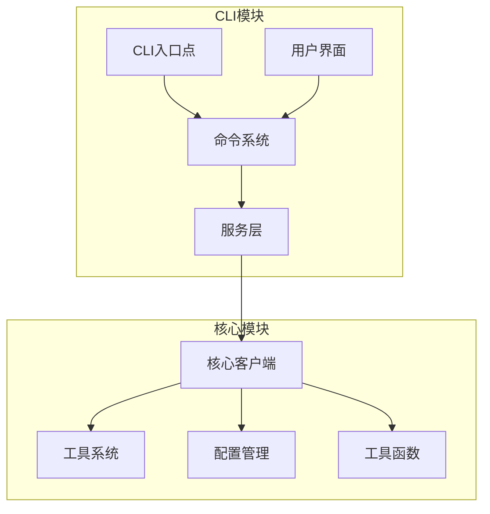
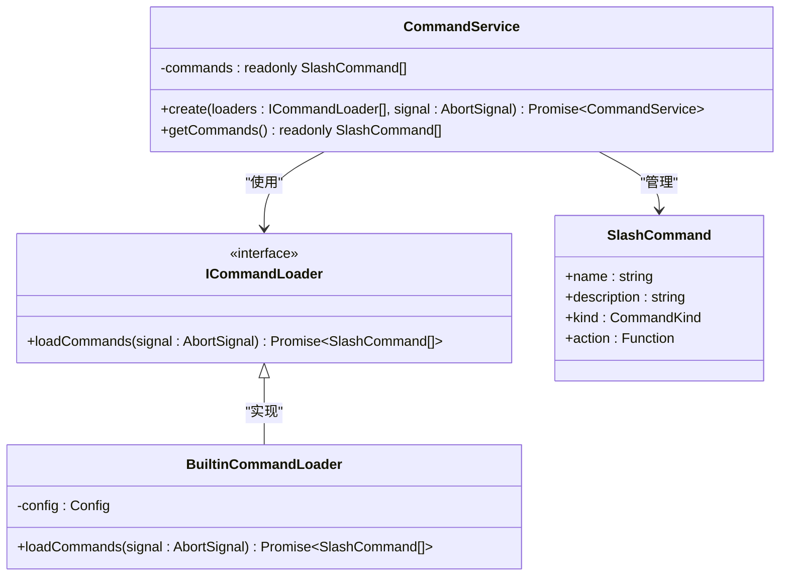
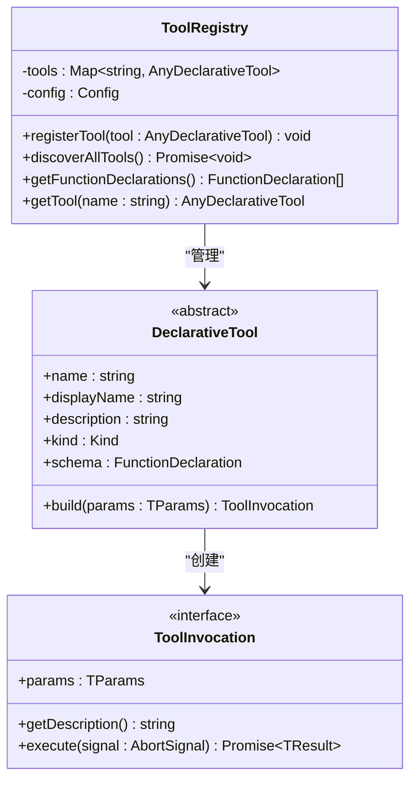
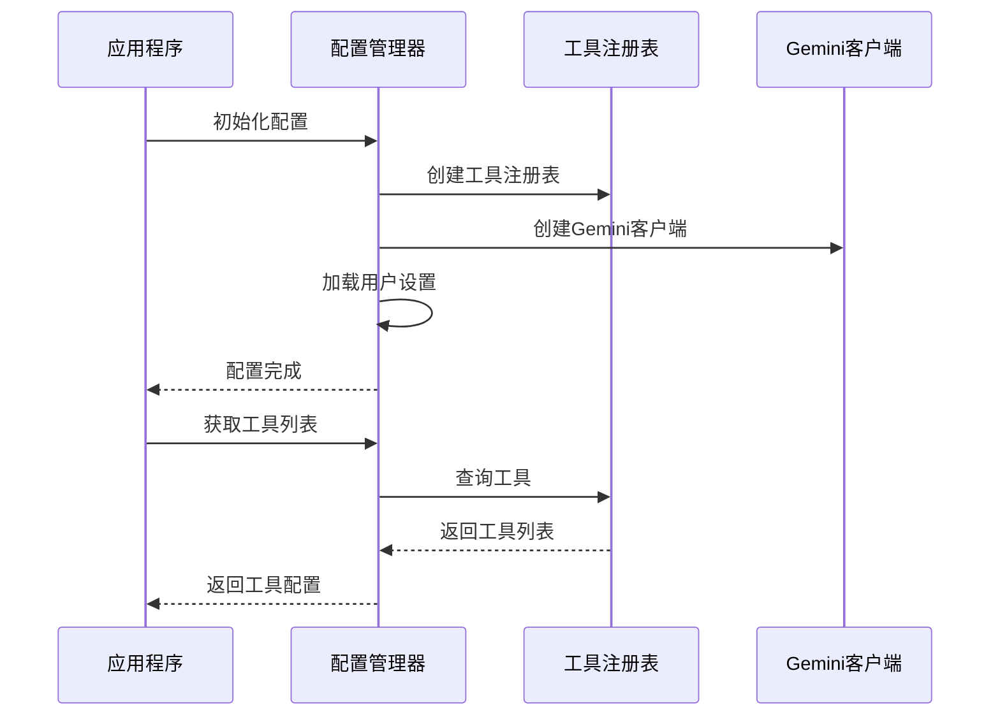
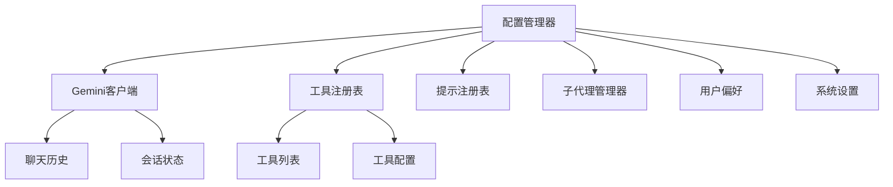
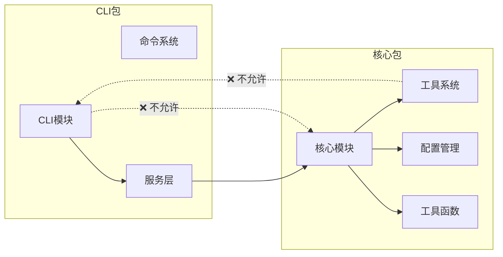

# 开发最佳实践指南

<cite>
**本文档引用的文件**
- [packages/cli/src/services/CommandService.ts](file://packages/cli/src/services/CommandService.ts)
- [packages/cli/src/services/types.ts](file://packages/cli/src/services/types.ts)
- [packages/cli/src/services/BuiltinCommandLoader.ts](file://packages/cli/src/services/BuiltinCommandLoader.ts)
- [packages/core/src/core/client.ts](file://packages/core/src/core/client.ts)
- [packages/core/src/tools/tool-registry.ts](file://packages/core/src/tools/tool-registry.ts)
- [packages/core/src/tools/tools.ts](file://packages/core/src/tools/tools.ts)
- [packages/core/src/config/config.ts](file://packages/core/src/config/config.ts)
- [packages/cli/src/utils/updateEventEmitter.ts](file://packages/cli/src/utils/updateEventEmitter.ts)
- [packages/core/src/utils/LruCache.ts](file://packages/core/src/utils/LruCache.ts)
- [packages/cli/src/ui/commands/helpCommand.ts](file://packages/cli/src/ui/commands/helpCommand.ts)
- [packages/cli/src/services/CommandService.test.ts](file://packages/cli/src/services/CommandService.test.ts)
</cite>

## 目录
1. [简介](#简介)
2. [项目架构概览](#项目架构概览)
3. [核心模块职责划分](#核心模块职责划分)
4. [命令系统扩展指南](#命令系统扩展指南)
5. [工具系统开发指南](#工具系统开发指南)
6. [配置管理系统](#配置管理系统)
7. [事件驱动架构](#事件驱动架构)
8. [状态管理最佳实践](#状态管理最佳实践)
9. [模块化设计示例](#模块化设计示例)
10. [类型安全与高级类型特性](#类型安全与高级类型特性)
11. [性能优化建议](#性能优化建议)
12. [故障排除指南](#故障排除指南)
13. [总结](#总结)

## 简介

本指南旨在为贡献者提供全面的开发最佳实践，帮助您遵循项目的架构设计原则。Qwen Code是一个复杂的多包架构项目，包含CLI模块和核心模块两大主要部分。通过理解各模块的职责划分、交互模式和设计模式，您可以更高效地扩展功能并保持代码质量。

## 项目架构概览

项目采用清晰的分层架构设计，主要分为以下两个核心包：



**图表来源**
- [packages/cli/src/services/CommandService.ts](file://packages/cli/src/services/CommandService.ts#L1-L25)
- [packages/core/src/core/client.ts](file://packages/core/src/core/client.ts#L1-L50)

## 核心模块职责划分

### CLI模块职责

CLI模块负责用户交互和命令处理，其核心组件包括：

- **CommandService**: 命令发现和加载的核心服务
- **CommandLoader**: 命令加载器接口，支持多种命令源
- **UI组件**: 用户界面和交互逻辑

### 核心模块职责

核心模块提供底层功能和服务，包括：

- **GeminiClient**: AI对话客户端
- **ToolRegistry**: 工具注册和管理
- **Config**: 配置管理和存储
- **各种服务**: 文件系统、Git、子代理等

**章节来源**
- [packages/cli/src/services/CommandService.ts](file://packages/cli/src/services/CommandService.ts#L1-L25)
- [packages/core/src/core/client.ts](file://packages/core/src/core/client.ts#L1-L50)
- [packages/core/src/config/config.ts](file://packages/core/src/config/config.ts#L1-L50)

## 命令系统扩展指南

### 命令系统架构

命令系统采用插件化架构，通过CommandService统一管理所有命令：



**图表来源**
- [packages/cli/src/services/CommandService.ts](file://packages/cli/src/services/CommandService.ts#L1-L25)
- [packages/cli/src/services/types.ts](file://packages/cli/src/services/types.ts#L1-L23)
- [packages/cli/src/services/BuiltinCommandLoader.ts](file://packages/cli/src/services/BuiltinCommandLoader.ts#L41-L93)

### 添加新命令

要添加新命令，请遵循以下步骤：

1. **创建命令定义**：
```typescript
export const myNewCommand: SlashCommand = {
  name: 'my-command',
  description: '我的新命令描述',
  kind: CommandKind.BUILT_IN,
  action: async (context) => {
    // 实现命令逻辑
    context.ui.addItem({
      type: MessageType.TEXT,
      content: '命令执行成功',
      timestamp: new Date(),
    }, Date.now());
  },
};
```

2. **注册到命令加载器**：
```typescript
// 在BuiltinCommandLoader中添加
async loadCommands(_signal: AbortSignal): Promise<SlashCommand[]> {
  const allDefinitions: Array<SlashCommand | null> = [
    // ... 其他命令
    myNewCommand,
  ];
  return allDefinitions.filter((cmd): cmd is SlashCommand => cmd !== null);
}
```

3. **测试命令功能**：
```typescript
// 在CommandService.test.ts中添加测试用例
it('should execute my new command', async () => {
  const mockContext = createMockCommandContext();
  await myNewCommand.action(mockContext);
  
  expect(mockContext.ui.addItem).toHaveBeenCalled();
});
```

**章节来源**
- [packages/cli/src/services/CommandService.ts](file://packages/cli/src/services/CommandService.ts#L1-L25)
- [packages/cli/src/services/BuiltinCommandLoader.ts](file://packages/cli/src/services/BuiltinCommandLoader.ts#L41-L93)
- [packages/cli/src/ui/commands/helpCommand.ts](file://packages/cli/src/ui/commands/helpCommand.ts#L1-L25)

## 工具系统开发指南

### 工具系统架构

工具系统采用声明式设计模式，支持动态发现和执行：



**图表来源**
- [packages/core/src/tools/tool-registry.ts](file://packages/core/src/tools/tool-registry.ts#L1-L50)
- [packages/core/src/tools/tools.ts](file://packages/core/src/tools/tools.ts#L1-L100)

### 添加新工具

要添加新工具，请遵循以下步骤：

1. **创建工具类**：
```typescript
export class MyNewTool extends DeclarativeTool<MyParams, MyResult> {
  constructor() {
    super(
      'my-new-tool',
      'My New Tool',
      'This is my new tool description',
      Kind.Utility,
      {
        type: 'object',
        properties: {
          param1: { type: 'string' },
          param2: { type: 'number' },
        },
        required: ['param1'],
      },
      false, // isOutputMarkdown
      false, // canUpdateOutput
    );
  }

  protected createInvocation(params: MyParams): ToolInvocation<MyParams, MyResult> {
    return new MyNewToolInvocation(this.config, params);
  }
}
```

2. **实现工具调用**：
```typescript
export class MyNewToolInvocation extends BaseToolInvocation<MyParams, MyResult> {
  getDescription(): string {
    return `Executing my new tool with param1=${this.params.param1}`;
  }

  async execute(signal: AbortSignal): Promise<MyResult> {
    // 实现工具逻辑
    try {
      const result = await someAsyncOperation(this.params);
      return {
        llmContent: JSON.stringify(result),
        returnDisplay: JSON.stringify(result),
      };
    } catch (error) {
      return {
        llmContent: `Error: ${error.message}`,
        returnDisplay: `Error: ${error.message}`,
        error: {
          message: error.message,
          type: ToolErrorType.EXECUTION_ERROR,
        },
      };
    }
  }
}
```

3. **注册工具**：
```typescript
// 在ToolRegistry中注册
registerTool(new MyNewTool());
```

**章节来源**
- [packages/core/src/tools/tool-registry.ts](file://packages/core/src/tools/tool-registry.ts#L1-L50)
- [packages/core/src/tools/tools.ts](file://packages/core/src/tools/tools.ts#L1-L100)

## 配置管理系统

### 配置架构设计

配置系统采用单例模式和工厂方法，确保配置的一致性和可扩展性：



**图表来源**
- [packages/core/src/config/config.ts](file://packages/core/src/config/config.ts#L1-L100)

### 配置扩展方法

要添加新的配置选项，请遵循以下步骤：

1. **更新配置参数接口**：
```typescript
export interface ConfigParameters {
  // ... 现有配置
  newFeatureEnabled?: boolean;
  newFeatureTimeout?: number;
}
```

2. **添加配置属性**：
```typescript
export class Config {
  private readonly newFeatureEnabled: boolean;
  private readonly newFeatureTimeout: number;
  
  constructor(params: ConfigParameters) {
    // ... 初始化现有配置
    this.newFeatureEnabled = params.newFeatureEnabled ?? false;
    this.newFeatureTimeout = params.newFeatureTimeout ?? 5000;
  }
  
  getNewFeatureEnabled(): boolean {
    return this.newFeatureEnabled;
  }
  
  getNewFeatureTimeout(): number {
    return this.newFeatureTimeout;
  }
}
```

3. **在初始化时使用配置**：
```typescript
async initialize(): Promise<void> {
  // ... 初始化其他组件
  
  if (this.getNewFeatureEnabled()) {
    await this.initializeNewFeature();
  }
}
```

**章节来源**
- [packages/core/src/config/config.ts](file://packages/core/src/config/config.ts#L1-L100)

## 事件驱动架构

### 事件发射器使用

项目使用Node.js的EventEmitter实现事件驱动架构：

```typescript
// 更新事件发射器
export const updateEventEmitter = new EventEmitter();

// 发布事件
updateEventEmitter.emit('updateAvailable', { version: '1.2.0' });

// 订阅事件
updateEventEmitter.on('updateAvailable', (data) => {
  console.log('Update available:', data.version);
});
```

### 事件处理最佳实践

1. **使用适当的事件名称**：
```typescript
// 使用语义化的事件名称
updateEventEmitter.emit('commandExecuted', { commandName: 'help', success: true });
updateEventEmitter.emit('toolExecuted', { toolName: 'read-file', duration: 100 });
```

2. **传递有意义的数据**：
```typescript
// 包含足够的上下文信息
updateEventEmitter.emit('error', {
  type: 'toolExecution',
  toolName: 'write-file',
  error: error.message,
  stack: error.stack,
});
```

3. **及时清理事件监听器**：
```typescript
// 在组件销毁时移除监听器
componentWillUnmount() {
  updateEventEmitter.off('updateAvailable', this.handleUpdate);
}
```

**章节来源**
- [packages/cli/src/utils/updateEventEmitter.ts](file://packages/cli/src/utils/updateEventEmitter.ts#L1-L14)

## 状态管理最佳实践

### 状态管理模式

项目采用集中式状态管理，通过Config类统一管理应用状态：



**图表来源**
- [packages/core/src/config/config.ts](file://packages/core/src/config/config.ts#L1-L100)

### 状态同步策略

1. **配置变更通知**：
```typescript
async setModel(newModel: string): Promise<void> {
  const oldModel = this.getModel();
  
  // 更新配置
  if (this.contentGeneratorConfig) {
    this.contentGeneratorConfig.model = newModel;
  }
  
  // 重新初始化客户端以应用变更
  const geminiClient = this.getGeminiClient();
  if (geminiClient && geminiClient.isInitialized()) {
    await geminiClient.reinitialize();
  }
  
  // 记录模型切换
  if (oldModel !== newModel && this.logger) {
    this.logger.logModelSwitch({
      fromModel: oldModel,
      toModel: newModel,
      reason: 'manual',
    });
  }
}
```

2. **状态一致性保证**：
```typescript
// 在并发操作中保持状态一致性
async concurrentOperation() {
  const snapshot = this.getStateSnapshot(); // 创建快照
  try {
    await this.performOperation(snapshot);
  } catch (error) {
    this.restoreFromSnapshot(snapshot); // 恢复状态
    throw error;
  }
}
```

**章节来源**
- [packages/core/src/config/config.ts](file://packages/core/src/config/config.ts#L1-L100)

## 模块化设计示例

### 避免循环依赖

项目严格遵循模块化设计原则，避免跨包循环依赖：



### 接口设计原则

1. **使用接口定义契约**：
```typescript
export interface ICommandLoader {
  loadCommands(signal: AbortSignal): Promise<SlashCommand[]>;
}

export interface ToolBuilder<TParams extends object, TResult extends ToolResult> {
  name: string;
  displayName: string;
  description: string;
  kind: Kind;
  schema: FunctionDeclaration;
  build(params: TParams): ToolInvocation<TParams, TResult>;
}
```

2. **依赖注入模式**：
```typescript
export class CommandService {
  private constructor(private readonly commands: readonly SlashCommand[]) {}
  
  static async create(
    loaders: ICommandLoader[],
    signal: AbortSignal,
  ): Promise<CommandService> {
    const allCommands: SlashCommand[] = [];
    
    for (const loader of loaders) {
      try {
        const commands = await loader.loadCommands(signal);
        allCommands.push(...commands);
      } catch (error) {
        console.debug('A command loader failed:', error);
      }
    }
    
    return new CommandService(dedupeAndSortCommands(allCommands));
  }
}
```

**章节来源**
- [packages/cli/src/services/CommandService.ts](file://packages/cli/src/services/CommandService.ts#L1-L25)
- [packages/cli/src/services/types.ts](file://packages/cli/src/services/types.ts#L1-L23)

## 类型安全与高级类型特性

### TypeScript高级类型应用

项目充分利用TypeScript的高级类型特性确保类型安全：

```typescript
// 泛型约束和类型推断
export interface ToolInvocation<TParams extends object, TResult extends ToolResult> {
  params: TParams;
  getDescription(): string;
  execute(signal: AbortSignal): Promise<TResult>;
}

// 条件类型和映射类型
export type ToolResultDisplay = 
  | { type: 'text'; content: string }
  | { type: 'json'; content: object }
  | { type: 'error'; message: string };

// 联合类型和类型保护
export type ToolResult = 
  | { llmContent: string; returnDisplay: string }
  | { llmContent: string; returnDisplay: string; error: ToolError };

// 函数重载和参数验证
async sendMessageStream(
  request: PartListUnion,
  signal: AbortSignal,
  prompt_id: string,
  turns: number = MAX_TURNS,
): AsyncGenerator<ServerGeminiStreamEvent, Turn> {
  // 实现逻辑
}

async sendMessageStream(
  request: PartListUnion,
  signal: AbortSignal,
  prompt_id: string,
  turns: number,
  originalModel?: string,
): AsyncGenerator<ServerGeminiStreamEvent, Turn> {
  // 重载实现
}
```

### 类型安全最佳实践

1. **使用类型别名提高可读性**：
```typescript
export type AnyToolInvocation = ToolInvocation<object, ToolResult>;
export type ToolParams = Record<string, unknown>;
```

2. **实现类型安全的错误处理**：
```typescript
export enum ToolErrorType {
  EXECUTION_ERROR = 'execution_error',
  VALIDATION_ERROR = 'validation_error',
  PERMISSION_ERROR = 'permission_error',
}

export interface ToolError {
  message: string;
  type: ToolErrorType;
  details?: Record<string, unknown>;
}
```

3. **利用类型守卫确保运行时安全**：
```typescript
function isToolError(result: ToolResult): result is ToolResult & { error: ToolError } {
  return 'error' in result && result.error !== undefined;
}

// 安全使用类型守卫
if (isToolError(result)) {
  console.error('Tool execution failed:', result.error.message);
}
```

**章节来源**
- [packages/core/src/tools/tools.ts](file://packages/core/src/tools/tools.ts#L1-L100)

## 性能优化建议

### 缓存策略

项目实现了LRU缓存机制来优化性能：

```typescript
export class LruCache<K, V> {
  private cache: Map<K, V>;
  private maxSize: number;

  constructor(maxSize: number) {
    this.cache = new Map<K, V>();
    this.maxSize = maxSize;
  }

  get(key: K): V | undefined {
    const value = this.cache.get(key);
    if (value) {
      // 将最近使用的项移到末尾
      this.cache.delete(key);
      this.cache.set(key, value);
    }
    return value;
  }

  set(key: K, value: V): void {
    if (this.cache.has(key)) {
      this.cache.delete(key);
    } else if (this.cache.size >= this.maxSize) {
      // 删除最旧的项
      const firstKey = this.cache.keys().next().value;
      if (firstKey !== undefined) {
        this.cache.delete(firstKey);
      }
    }
    this.cache.set(key, value);
  }
}
```

### 性能优化实践

1. **避免阻塞主线程**：
```typescript
// 使用异步操作避免阻塞
async processLargeFile(filePath: string): Promise<void> {
  const content = await fs.readFile(filePath, 'utf8');
  const processed = await this.processContentAsync(content);
  await this.saveResults(processed);
}

// 使用Worker线程处理CPU密集任务
import { Worker } from 'worker_threads';

async cpuIntensiveTask(data: any): Promise<any> {
  return new Promise((resolve, reject) => {
    const worker = new Worker('./cpuWorker.js', { workerData: data });
    worker.on('message', resolve);
    worker.on('error', reject);
    worker.on('exit', (code) => {
      if (code !== 0) {
        reject(new Error(`Worker stopped with exit code ${code}`));
      }
    });
  });
}
```

2. **合理使用缓存**：
```typescript
// 缓存频繁访问的数据
private readonly fileContentCache = new LruCache<string, string>(100);

async getFileContent(filePath: string): Promise<string> {
  const cached = this.fileContentCache.get(filePath);
  if (cached) {
    return cached;
  }
  
  const content = await this.readFromFileSystem(filePath);
  this.fileContentCache.set(filePath, content);
  return content;
}
```

3. **流式处理大数据**：
```typescript
// 使用流处理大文件
async processLargeFileAsStream(filePath: string): Promise<void> {
  const readStream = fs.createReadStream(filePath, { encoding: 'utf8' });
  const transformStream = new Transform({
    transform(chunk, encoding, callback) {
      // 处理数据块
      const processed = this.processChunk(chunk.toString());
      callback(null, processed);
    }
  });
  
  readStream.pipe(transformStream).pipe(processedFileStream);
}
```

**章节来源**
- [packages/core/src/utils/LruCache.ts](file://packages/core/src/utils/LruCache.ts#L1-L42)

## 故障排除指南

### 常见问题诊断

1. **命令加载失败**：
```typescript
// 检查命令加载器是否正确实现
class DebugCommandLoader implements ICommandLoader {
  async loadCommands(signal: AbortSignal): Promise<SlashCommand[]> {
    try {
      const commands = await this.discoverCommands();
      console.log('Loaded commands:', commands.map(c => c.name));
      return commands;
    } catch (error) {
      console.error('Command loading failed:', error);
      return [];
    }
  }
}
```

2. **工具执行超时**：
```typescript
// 实现超时控制
async executeWithTimeout<T>(
  fn: () => Promise<T>,
  timeoutMs: number,
): Promise<T> {
  return new Promise((resolve, reject) => {
    const timeoutId = setTimeout(() => {
      reject(new Error(`Operation timed out after ${timeoutMs}ms`));
    }, timeoutMs);
    
    fn()
      .then(resolve)
      .catch(reject)
      .finally(() => clearTimeout(timeoutId));
  });
}
```

3. **内存泄漏检测**：
```typescript
// 监控内存使用情况
class MemoryMonitor {
  private readonly snapshots: Map<string, number> = new Map();
  
  recordSnapshot(label: string): void {
    const heapUsed = process.memoryUsage().heapUsed;
    this.snapshots.set(label, heapUsed);
  }
  
  compareSnapshots(before: string, after: string): number {
    const beforeMem = this.snapshots.get(before) || 0;
    const afterMem = this.snapshots.get(after) || 0;
    return afterMem - beforeMem;
  }
}
```

### 调试技巧

1. **启用调试模式**：
```typescript
// 在配置中启用详细日志
const config = new Config({
  debugMode: true,
  // ... 其他配置
});

// 使用调试输出
if (this.config.getDebugMode()) {
  console.log('Debug info:', { key: value });
}
```

2. **单元测试覆盖**：
```typescript
// 测试工具执行
it('should execute tool with valid parameters', async () => {
  const tool = new TestTool();
  const invocation = tool.build({ param1: 'test' });
  
  const result = await invocation.execute(new AbortController().signal);
  
  expect(result.llmContent).toContain('success');
});
```

**章节来源**
- [packages/cli/src/services/CommandService.test.ts](file://packages/cli/src/services/CommandService.test.ts#L1-L50)

## 总结

本指南涵盖了Qwen Code项目开发的最佳实践，包括：

1. **架构设计原则**：清晰的模块划分和职责分离
2. **命令系统扩展**：通过CommandService和ICommandLoader实现插件化
3. **工具系统开发**：采用声明式设计和类型安全
4. **配置管理**：集中式配置和状态管理
5. **事件驱动架构**：使用EventEmitter实现松耦合通信
6. **性能优化**：LRU缓存和异步处理
7. **类型安全**：充分利用TypeScript高级类型特性

遵循这些最佳实践，您可以：
- 更高效地扩展功能
- 保持代码质量和一致性
- 避免常见的架构陷阱
- 提高代码的可维护性和可测试性

记住始终关注模块间的边界和依赖关系，确保系统的稳定性和可扩展性。通过持续学习和实践这些模式，您将成为项目贡献的重要力量。