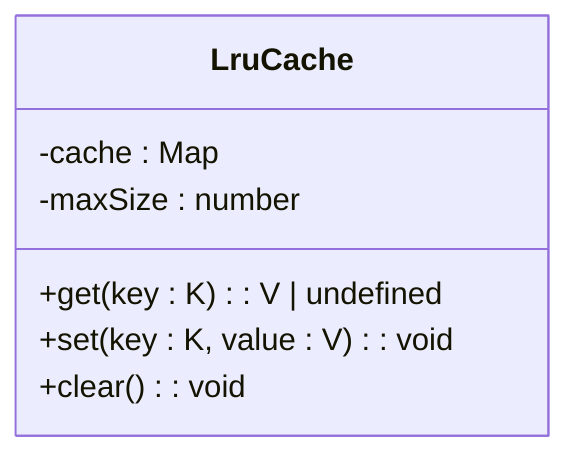
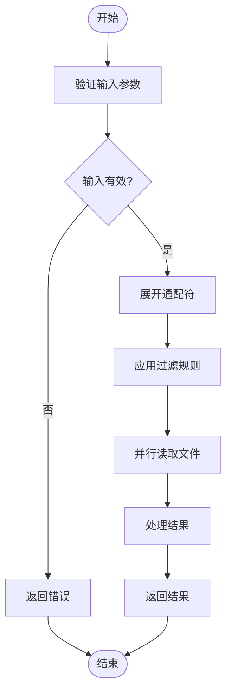
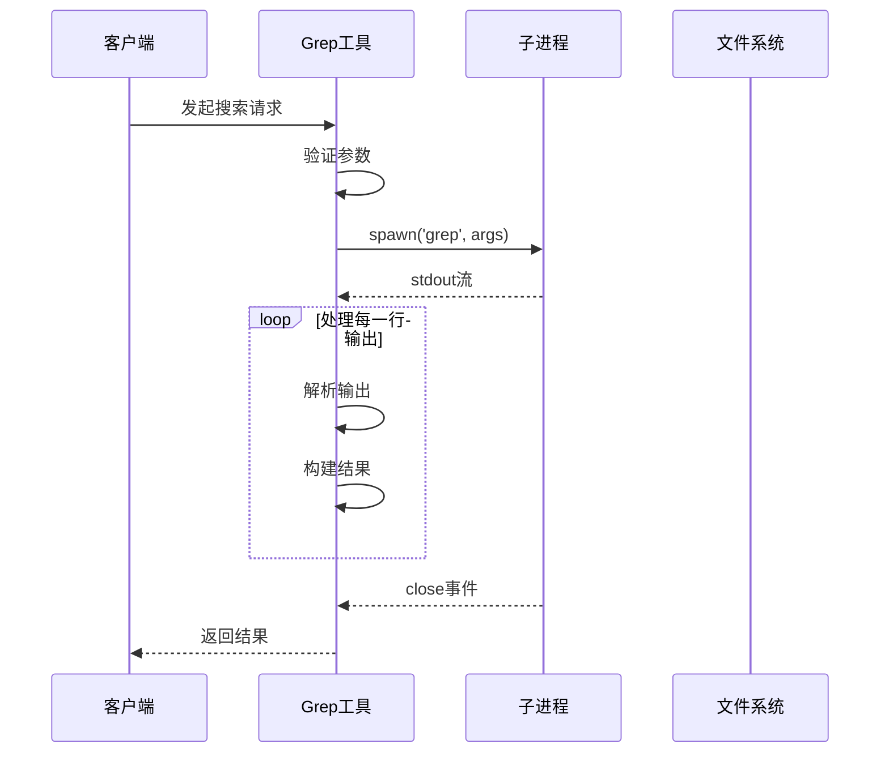
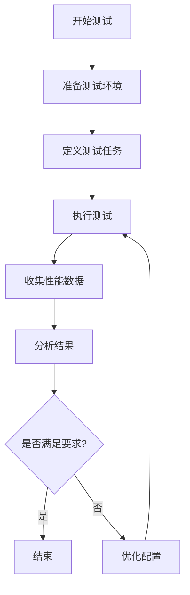

# 性能优化

<cite>
**本文档引用的文件**  
- [LruCache.ts](file://packages/core/src/utils/LruCache.ts)
- [crawlCache.ts](file://packages/core/src/utils/filesearch/crawlCache.ts)
- [result-cache.ts](file://packages/core/src/utils/filesearch/result-cache.ts)
- [read-many-files.ts](file://packages/core/src/tools/read-many-files.ts)
- [ripGrep.ts](file://packages/core/src/tools/ripGrep.ts)
- [grep.ts](file://packages/core/src/tools/grep.ts)
- [bfsFileSearch.ts](file://packages/core/src/utils/bfsFileSearch.ts)
- [terminal-bench.test.ts](file://integration-tests/terminal-bench/terminal-bench.test.ts)
</cite>

## 目录
1. [引言](#引言)
2. [缓存策略](#缓存策略)
3. [资源管理](#资源管理)
4. [异步处理](#异步处理)
5. [性能基准测试与监控](#性能基准测试与监控)
6. [结论](#结论)

## 引言
本文档旨在为开发者提供一套全面的性能优化实践指南，重点关注缓存策略、资源管理和异步处理。通过深入分析LruCache的实现原理及其在文件搜索和结果缓存等场景中的应用，阐述crawlCache和result-cache的协同工作机制如何显著提升大型代码库分析的性能。同时，文档将提供减少I/O操作、优化正则表达式匹配（如ripGrep）以及批量文件读取（read-many-files）的具体技巧。此外，还包括性能基准测试方法和监控指标设置建议，帮助开发者识别并解决性能瓶颈。

## 缓存策略

### LruCache实现原理
LruCache（Least Recently Used Cache）是一种基于最近最少使用算法的缓存机制，用于在内存中存储键值对，并在缓存达到最大容量时自动移除最久未使用的条目。该实现利用JavaScript的Map对象来存储数据，因为Map保持了插入顺序，这使得追踪最近使用的条目变得简单高效。

当获取一个键的值时，如果该键存在于缓存中，则先删除再重新插入，以确保它位于Map的末尾，表示它是最近被访问过的。当设置一个新的键值对时，如果键已存在，则更新其值；如果缓存已满，则移除Map的第一个条目（即最久未使用的条目），然后插入新条目。



**图表来源**
- [LruCache.ts](file://packages/core/src/utils/LruCache.ts#L1-L40)

**章节来源**
- [LruCache.ts](file://packages/core/src/utils/LruCache.ts#L1-L40)

### crawlCache与result-cache协同工作
crawlCache和result-cache是两个互补的缓存机制，共同作用于文件搜索过程，以提高搜索效率和响应速度。

- **crawlCache**：这是一个基于时间的缓存，用于存储特定目录结构下的文件列表。它通过生成一个包含项目目录和忽略文件内容的哈希值作为缓存键，确保当项目或忽略规则发生变化时，缓存能够自动失效。每次写入缓存时，都会设置一个定时器，在指定的生存时间（TTL）后自动清除缓存条目，从而保证数据的新鲜度。
- **result-cache**：此缓存用于存储文件搜索的结果，支持前缀匹配优化。例如，如果用户首先搜索“foo”，然后搜索“foobar”，系统可以基于“foo”的搜索结果来缩小“foobar”的搜索范围，避免重复扫描所有文件。这种机制极大地减少了后续搜索的计算量。

两者协同工作的流程如下：首先，系统尝试从result-cache中查找精确匹配的搜索结果；如果没有找到，则检查是否有更具体的前缀查询结果可用，以此作为搜索的基础集；最后，如果需要，系统会调用底层文件系统API进行实际的文件遍历，并将结果同时写入crawlCache和result-cache，以便未来查询使用。

```mermaid
sequenceDiagram
participant User as 用户
participant ResultCache as result-cache
participant CrawlCache as crawlCache
participant FileSystem as 文件系统
User->>ResultCache : 搜索 "foobar"
ResultCache-->>ResultCache : 检查精确匹配
alt 找到精确匹配
ResultCache-->>User : 返回缓存结果
else 未找到精确匹配
ResultCache-->>ResultCache : 查找最长前缀匹配
opt 找到前缀匹配
ResultCache->>FileSystem : 基于前缀结果搜索
else 未找到前缀匹配
ResultCache->>CrawlCache : 获取所有文件列表
CrawlCache-->>CrawlCache : 检查缓存
alt 缓存命中
CrawlCache-->>ResultCache : 返回文件列表
else 缓存未命中
CrawlCache->>FileSystem : 遍历目录
FileSystem-->>CrawlCache : 返回文件列表
CrawlCache->>CrawlCache : 写入缓存带TTL
end
ResultCache->>FileSystem : 搜索文件
end
FileSystem-->>ResultCache : 返回搜索结果
ResultCache->>ResultCache : 存储结果
ResultCache-->>User : 返回搜索结果
end
```

**图表来源**
- [crawlCache.ts](file://packages/core/src/utils/filesearch/crawlCache.ts#L1-L70)
- [result-cache.ts](file://packages/core/src/utils/filesearch/result-cache.ts#L1-L68)

**章节来源**
- [crawlCache.ts](file://packages/core/src/utils/filesearch/crawlCache.ts#L1-L70)
- [result-cache.ts](file://packages/core/src/utils/filesearch/result-cache.ts#L1-L68)

## 资源管理

### 减少I/O操作
频繁的I/O操作是影响应用程序性能的主要因素之一。为了减少I/O开销，可以采取以下措施：
- **批量读取文件**：使用`read-many-files`工具一次性读取多个文件，而不是逐个读取。这样可以减少系统调用次数，提高整体效率。
- **合理使用缓存**：如前所述，利用LruCache、crawlCache和result-cache等缓存机制，避免重复执行昂贵的文件系统操作。
- **预加载常用资源**：对于经常访问的文件或数据，可以在应用启动时预先加载到内存中，减少运行时的延迟。

### 优化正则表达式匹配
正则表达式匹配在文本处理中非常常见，但不当的使用会导致性能问题。以下是一些优化建议：
- **选择合适的工具**：优先使用`ripGrep`而非`grep`，因为`ripGrep`专为快速搜索而设计，具有更好的性能表现。
- **限制搜索范围**：通过`include`参数指定文件模式，减少不必要的文件扫描。
- **避免复杂的正则表达式**：尽量简化正则表达式，避免使用回溯过多的模式，这可能导致指数级的时间复杂度。

### 批量文件读取
`read-many-files`工具允许用户通过路径或通配符模式批量读取文件内容。为了优化性能，该工具实现了多种策略：
- **并行处理**：使用Promise.allSettled并发处理所有文件读取请求，充分利用多核处理器的能力。
- **智能过滤**：结合`.gitignore`和`.qwenignore`文件中的规则，自动排除不需要的文件，减少I/O负担。
- **内容截断**：对于过大的文件，自动截断内容以防止内存溢出，同时提供警告信息提示用户。



**图表来源**
- [read-many-files.ts](file://packages/core/src/tools/read-many-files.ts#L1-L623)

**章节来源**
- [read-many-files.ts](file://packages/core/src/tools/read-many-files.ts#L1-L623)

## 异步处理

### ripGrep与grep的异步执行
`ripGrep`和`grep`工具均采用异步方式执行搜索操作，以非阻塞的方式处理大量数据。具体实现包括：
- **子进程通信**：通过Node.js的`spawn`函数创建子进程执行外部命令，主进程继续处理其他任务。
- **流式处理**：监听子进程的标准输出流，实时解析搜索结果，无需等待整个命令完成。
- **错误处理**：捕获并处理子进程可能产生的错误，确保程序的稳定性。

### 文件搜索的异步遍历
在没有可用的外部工具时，系统会回退到纯JavaScript实现的文件搜索逻辑。此逻辑同样采用异步方式，通过`globStream`逐个处理匹配的文件路径，避免一次性加载所有文件到内存中，从而降低内存占用。



**图表来源**
- [ripGrep.ts](file://packages/core/src/tools/ripGrep.ts#L1-L506)
- [grep.ts](file://packages/core/src/tools/grep.ts#L1-L724)

**章节来源**
- [ripGrep.ts](file://packages/core/src/tools/ripGrep.ts#L1-L506)
- [grep.ts](file://packages/core/src/tools/grep.ts#L1-L724)

## 性能基准测试与监控

### 基准测试方法
为了评估和比较不同优化策略的效果，可以使用`terminal-bench`集成测试框架进行性能基准测试。该框架支持多种任务类型，包括但不限于文件搜索、代码分析等，能够模拟真实场景下的工作负载。

测试流程通常包括以下几个步骤：
1. **环境准备**：确保测试环境与生产环境尽可能一致，包括硬件配置、操作系统版本等。
2. **任务定义**：编写具体的测试任务，明确输入、预期输出及性能指标。
3. **执行测试**：运行测试脚本，记录各项性能数据，如响应时间、CPU利用率、内存消耗等。
4. **结果分析**：对比不同配置下的测试结果，识别性能瓶颈并提出改进建议。

### 监控指标设置
有效的性能监控需要关注以下几个关键指标：
- **响应时间**：衡量从请求发出到收到响应所需的时间，是用户体验的重要指标。
- **吞吐量**：单位时间内处理的请求数量，反映系统的处理能力。
- **资源利用率**：包括CPU、内存、磁盘I/O等，帮助识别资源瓶颈。
- **错误率**：监控系统错误的发生频率，及时发现潜在问题。

通过持续收集和分析这些指标，可以及时发现性能下降的趋势，采取相应措施进行优化。



**图表来源**
- [terminal-bench.test.ts](file://integration-tests/terminal-bench/terminal-bench.test.ts#L1-L329)

**章节来源**
- [terminal-bench.test.ts](file://integration-tests/terminal-bench/terminal-bench.test.ts#L1-L329)

## 结论
通过综合运用上述性能优化实践，可以显著提升应用程序的响应速度和资源利用效率。特别是缓存策略的应用，不仅减少了I/O操作，还加速了文件搜索过程。同时，合理的异步处理和资源管理技巧，使得系统能够在高并发环境下稳定运行。最后，建立完善的性能基准测试和监控体系，有助于持续改进系统性能，确保长期的高质量服务。