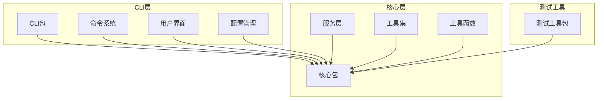
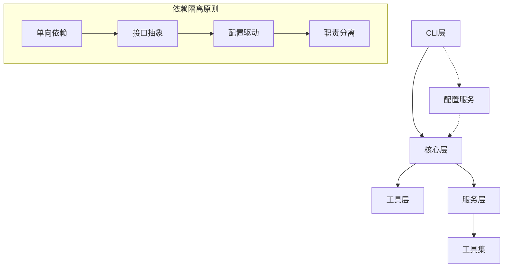
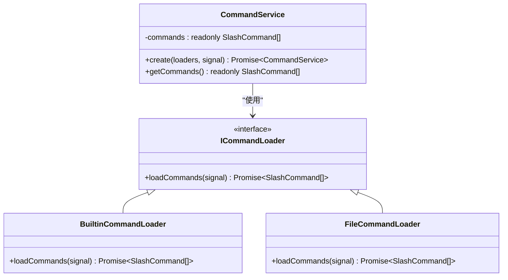
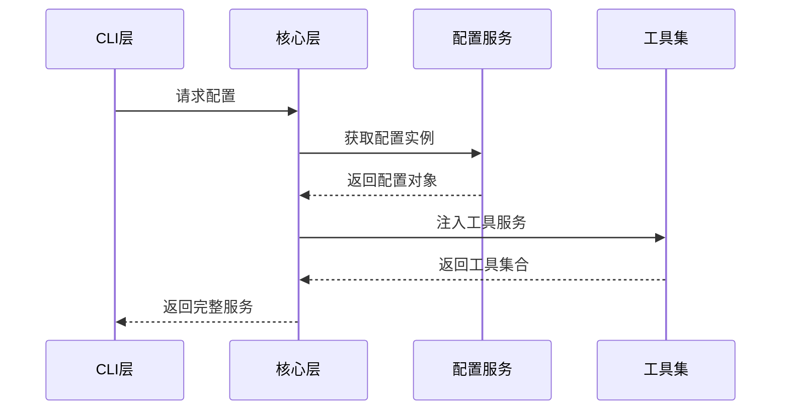
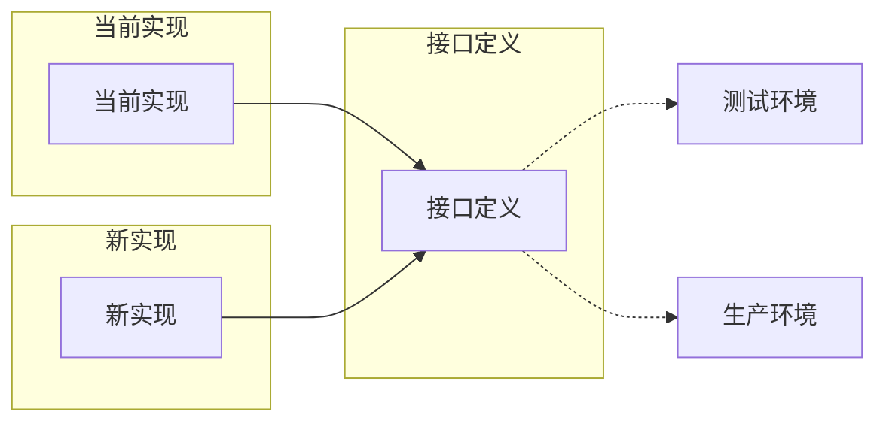

# 依赖隔离与抽象策略

<cite>
**本文档中引用的文件**
- [packages/cli/src/index.ts](file://packages/cli/src/index.ts)
- [packages/core/index.ts](file://packages/core/index.ts)
- [packages/cli/src/config/settings.ts](file://packages/cli/src/config/settings.ts)
- [packages/core/src/utils/installationManager.ts](file://packages/core/src/utils/installationManager.ts)
- [packages/cli/src/services/CommandService.ts](file://packages/cli/src/services/CommandService.ts)
- [packages/cli/src/services/types.ts](file://packages/cli/src/services/types.ts)
- [packages/cli/src/ui/commands/types.ts](file://packages/cli/src/ui/commands/types.ts)
- [packages/cli/src/ui/App.tsx](file://packages/cli/src/ui/App.tsx)
- [packages/core/src/config/config.ts](file://packages/core/src/config/config.ts)
- [packages/core/src/utils/environmentContext.ts](file://packages/core/src/utils/environmentContext.ts)
- [packages/cli/src/gemini.tsx](file://packages/cli/src/gemini.tsx)
- [packages/core/src/index.ts](file://packages/core/src/index.ts)
</cite>

## 目录
1. [引言](#引言)
2. [项目架构概览](#项目架构概览)
3. [核心依赖隔离原则](#核心依赖隔离原则)
4. [CLI层依赖抽象策略](#cli层依赖抽象策略)
5. [核心模块依赖注入机制](#核心模块依赖注入机制)
6. [系统环境检测封装](#系统环境检测封装)
7. [接口导出粒度控制](#接口导出粒度控制)
8. [依赖隔离的实际效益](#依赖隔离的实际效益)
9. [总结](#总结)

## 引言

Qwen Code项目采用了精心设计的依赖隔离策略，通过多层抽象和依赖注入机制，实现了清晰的模块边界和高度的可维护性。该项目的核心设计理念是通过配置服务抽象外部依赖，使用工厂模式避免直接引用高层组件，并通过严格的接口导出控制防止不必要的依赖暴露。

这种设计不仅提高了代码的可测试性和模块化程度，还为未来的功能扩展和版本演进提供了坚实的基础。本文档将深入分析这些设计原则的具体实践和实现细节。

## 项目架构概览

Qwen Code项目采用分层架构设计，主要包含三个核心包：



**图表来源**
- [packages/cli/src/index.ts](file://packages/cli/src/index.ts#L1-L31)
- [packages/core/index.ts](file://packages/core/index.ts#L1-L23)

**章节来源**
- [packages/cli/src/index.ts](file://packages/cli/src/index.ts#L1-L31)
- [packages/core/index.ts](file://packages/core/index.ts#L1-L23)

## 核心依赖隔离原则

### 分层架构设计

Qwen Code项目严格遵循分层架构原则，每一层都有明确的职责边界：

1. **CLI层**：负责用户交互和命令处理
2. **核心层**：提供业务逻辑和核心功能
3. **工具层**：封装底层操作和系统调用

### 依赖方向控制

项目通过以下方式控制依赖方向：

- **单向依赖**：上层模块只能依赖下层模块
- **接口抽象**：使用接口而非具体实现
- **配置驱动**：通过配置文件控制行为



**图表来源**
- [packages/cli/src/gemini.tsx](file://packages/cli/src/gemini.tsx#L1-L50)
- [packages/core/src/config/config.ts](file://packages/core/src/config/config.ts#L1-L50)

## CLI层依赖抽象策略

### 配置服务抽象

CLI层通过`settings.ts`文件实现了对外部依赖的完全抽象：

```typescript
// 配置服务抽象示例
export function getSystemSettingsPath(): string {
  if (process.env['QWEN_CODE_SYSTEM_SETTINGS_PATH']) {
    return process.env['QWEN_CODE_SYSTEM_SETTINGS_PATH'];
  }
  if (platform() === 'darwin') {
    return '/Library/Application Support/QwenCode/settings.json';
  } else if (platform() === 'win32') {
    return 'C:\\ProgramData\\qwen-code\\settings.json';
  } else {
    return '/etc/qwen-code/settings.json';
  }
}
```

这种设计的优势包括：

1. **平台无关性**：自动适配不同操作系统
2. **环境变量支持**：允许运行时覆盖默认路径
3. **集中管理**：所有配置路径统一管理

### 命令系统抽象

CLI层通过命令服务实现了插件化的命令加载机制：



**图表来源**
- [packages/cli/src/services/CommandService.ts](file://packages/cli/src/services/CommandService.ts#L1-L104)
- [packages/cli/src/services/types.ts](file://packages/cli/src/services/types.ts#L1-L25)

**章节来源**
- [packages/cli/src/config/settings.ts](file://packages/cli/src/config/settings.ts#L70-L90)
- [packages/cli/src/services/CommandService.ts](file://packages/cli/src/services/CommandService.ts#L1-L104)
- [packages/cli/src/services/types.ts](file://packages/cli/src/services/types.ts#L1-L25)

## 核心模块依赖注入机制

### 工厂模式应用

核心模块通过工厂模式避免直接引用高层组件：

```typescript
// 工厂模式示例
export class CommandService {
  static async create(
    loaders: ICommandLoader[],
    signal: AbortSignal,
  ): Promise<CommandService> {
    const results = await Promise.allSettled(
      loaders.map((loader) => loader.loadCommands(signal)),
    );
    
    // 处理加载结果...
    const finalCommands = Object.freeze(Array.from(commandMap.values()));
    return new CommandService(finalCommands);
  }
}
```

### 依赖注入容器

核心包通过导出接口而非具体实现，实现了依赖注入：



**图表来源**
- [packages/cli/src/gemini.tsx](file://packages/cli/src/gemini.tsx#L150-L200)
- [packages/core/src/config/config.ts](file://packages/core/src/config/config.ts#L1-L100)

**章节来源**
- [packages/cli/src/services/CommandService.ts](file://packages/cli/src/services/CommandService.ts#L35-L70)
- [packages/core/src/config/config.ts](file://packages/core/src/config/config.ts#L1-L100)

## 系统环境检测封装

### InstallationManager设计

系统环境检测通过`InstallationManager`类实现封装：

```typescript
export class InstallationManager {
  private getInstallationIdPath(): string {
    return Storage.getInstallationIdPath();
  }

  private readInstallationIdFromFile(): string | null {
    const installationIdFile = this.getInstallationIdPath();
    if (fs.existsSync(installationIdFile)) {
      const installationid = fs.readFileSync(installationIdFile, 'utf-8').trim();
      return installationid || null;
    }
    return null;
  }

  getInstallationId(): string {
    try {
      let installationId = this.readInstallationIdFromFile();
      if (!installationId) {
        installationId = randomUUID();
        this.writeInstallationIdToFile(installationId);
      }
      return installationId;
    } catch (error) {
      console.error('Error accessing installation ID file:', error);
      return '123456789';
    }
  }
}
```

这种设计的优势：

1. **异常处理**：优雅处理文件访问错误
2. **默认值提供**：确保即使失败也能返回有效ID
3. **状态管理**：封装安装状态的读写逻辑

### 环境上下文抽象

环境上下文通过抽象函数提供统一的环境信息获取：

```typescript
export async function getEnvironmentContext(config: Config): Promise<Part[]> {
  const today = new Date().toLocaleDateString(undefined, {
    weekday: 'long',
    year: 'numeric',
    month: 'long',
    day: 'numeric',
  });
  
  const platform = process.platform;
  const directoryContext = await getDirectoryContextString(config);
  
  const context = `
This is the Qwen Code. We are setting up the context for our chat.
Today's date is ${today} (formatted according to the user's locale).
My operating system is: ${platform}
${directoryContext}
  `.trim();
  
  return [{ text: context }];
}
```

**章节来源**
- [packages/core/src/utils/installationManager.ts](file://packages/core/src/utils/installationManager.ts#L1-L59)
- [packages/core/src/utils/environmentContext.ts](file://packages/core/src/utils/environmentContext.ts#L1-L110)

## 接口导出粒度控制

### 核心包接口导出策略

核心包通过精心设计的导出策略控制接口暴露：

```typescript
// 核心包导出示例
export * from './config/config.js';
export * from './core/client.js';
export * from './core/contentGenerator.js';
export * from './core/loggingContentGenerator.js';
export * from './core/geminiChat.js';
export * from './core/logger.js';
export * from './core/prompts.js';
export * from './core/tokenLimits.js';
export * from './core/turn.js';
export * from './core/geminiRequest.js';
export * from './core/coreToolScheduler.js';
export * from './core/nonInteractiveToolExecutor.js';
```

这种导出策略的优势：

1. **按功能分组**：将相关功能组织在一起
2. **避免循环依赖**：只导出必要的接口
3. **简化导入**：提供统一的入口点

### CLI包接口导出控制

CLI包通过主入口文件控制对外暴露的接口：

```typescript
// CLI包主入口
#!/usr/bin/env node

import './src/gemini.js';
import { main } from './src/gemini.js';
import { FatalError } from '@qwen-code/qwen-code-core';

// 全局入口点
main().catch((error) => {
  if (error instanceof FatalError) {
    // 错误处理...
  }
});
```

**章节来源**
- [packages/core/src/index.ts](file://packages/core/src/index.ts#L1-L119)
- [packages/cli/src/index.ts](file://packages/cli/src/index.ts#L1-L31)

## 依赖隔离的实际效益

### 单元测试友好性

依赖隔离设计显著提升了代码的可测试性：

1. **模拟支持**：所有依赖都可以轻松模拟
2. **独立测试**：每个模块可以独立测试
3. **快速反馈**：减少测试间的相互依赖

### 模块替换灵活性

通过接口抽象，系统支持灵活的模块替换：



### 版本演进兼容性

依赖隔离确保了系统的向后兼容性：

1. **渐进式升级**：可以逐步替换组件
2. **并行开发**：不同团队可以并行开发
3. **风险隔离**：修改一个组件不会影响其他部分

## 总结

Qwen Code项目通过精心设计的依赖隔离策略，实现了高度模块化和可维护的架构。这种设计在以下几个方面表现出色：

1. **清晰的职责分离**：每层都有明确的职责边界
2. **强大的抽象能力**：通过接口和配置服务抽象外部依赖
3. **灵活的扩展机制**：支持插件化和模块替换
4. **优秀的可测试性**：便于单元测试和集成测试
5. **良好的演进性**：支持渐进式升级和版本演进

这种依赖隔离设计不仅满足了当前的功能需求，更为未来的功能扩展和技术演进奠定了坚实的基础。通过配置驱动的抽象和服务导向的设计，Qwen Code项目展现了一个现代软件架构的最佳实践案例。