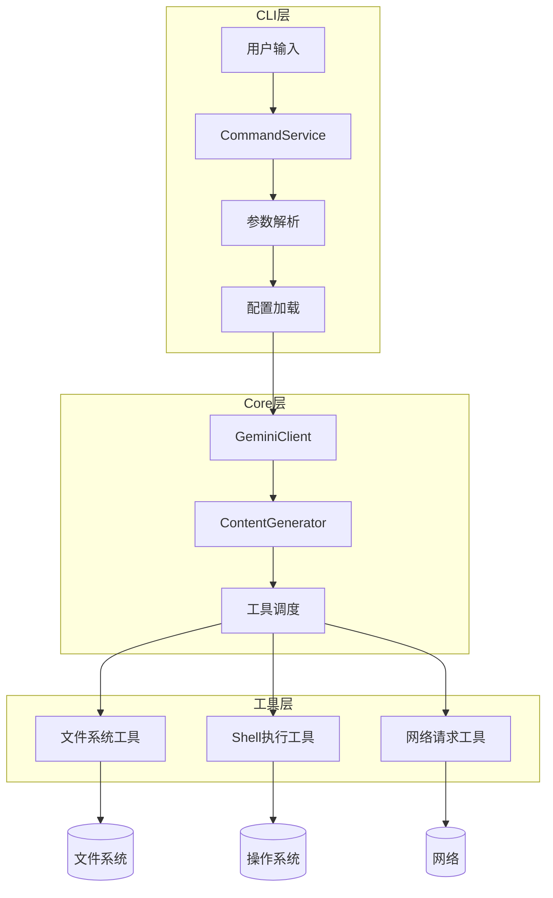
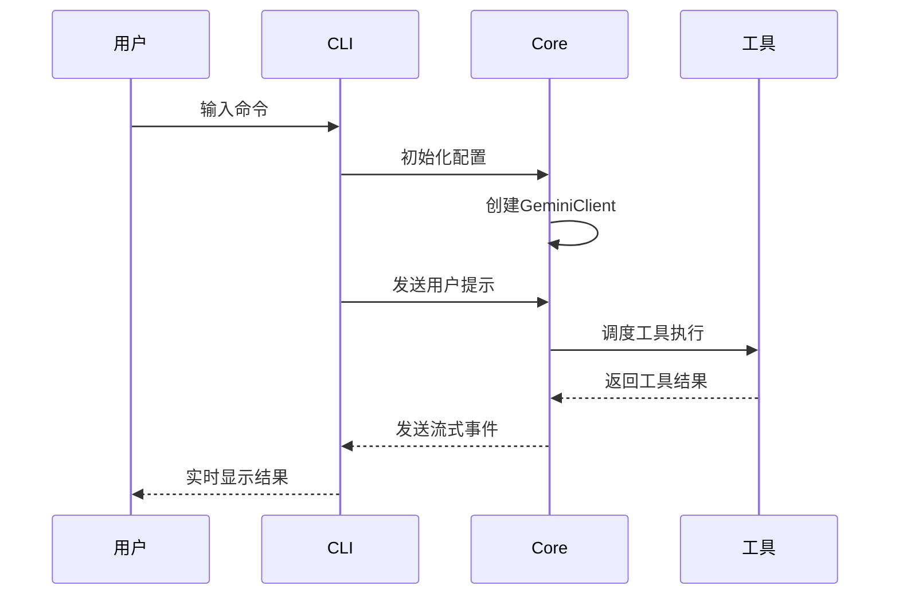
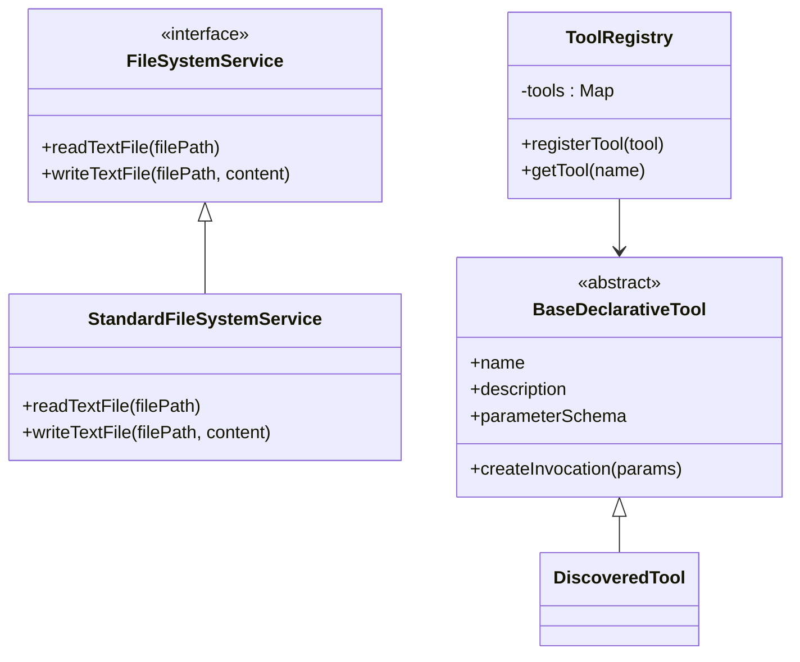
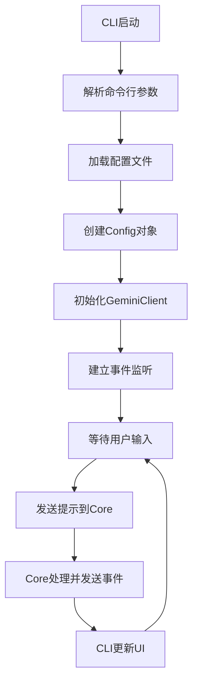
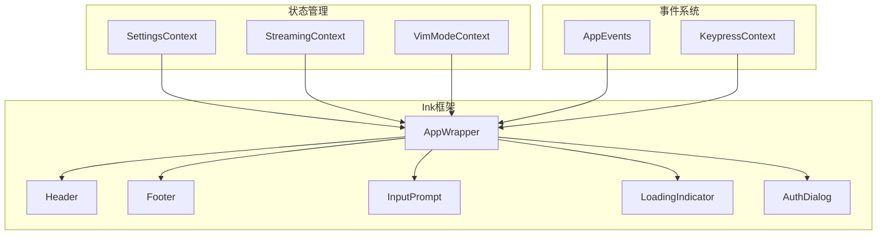
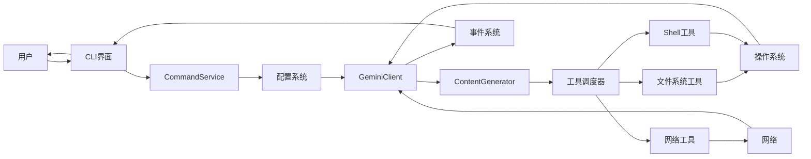

# 架构设计原则

<cite>
**本文档中引用的文件**  
- [CommandService.ts](file://packages/cli/src/services/CommandService.ts)
- [client.ts](file://packages/core/src/core/client.ts)
- [tool-registry.ts](file://packages/core/src/tools/tool-registry.ts)
- [gemini.tsx](file://packages/cli/src/gemini.tsx)
- [config.ts](file://packages/cli/src/config/config.ts)
- [fileSystemService.ts](file://packages/core/src/services/fileSystemService.ts)
- [turn.ts](file://packages/core/src/core/turn.ts)
- [index.ts](file://packages/core/src/index.ts)
- [package.json](file://packages/cli/package.json)
- [package.json](file://packages/core/package.json)
</cite>

## 目录
1. [模块化分层架构](#模块化分层架构)
2. [单向数据流与事件驱动机制](#单向数据流与事件驱动机制)
3. [依赖隔离与接口抽象](#依赖隔离与接口抽象)
4. [CLI与Core层通信机制](#cli与core层通信机制)
5. [Ink框架在CLI界面中的应用](#ink框架在cli界面中的应用)
6. [系统上下文与组件交互](#系统上下文与组件交互)
7. [类型安全与循环依赖管理](#类型安全与循环依赖管理)

## 模块化分层架构

Qwen Code项目采用清晰的模块化分层架构，主要分为CLI、Core和Tools三个核心层次。CLI层负责用户交互和命令解析，Core层处理核心业务逻辑和AI交互，Tools层提供具体的功能实现。这种分层设计通过`@qwen-code/qwen-code`和`@qwen-code/qwen-code-core`两个独立的npm包实现物理分离，确保各层职责单一且可独立演进。

CLI包通过`package.json`中的依赖关系明确依赖Core包，形成单向依赖流。Core包作为独立的库，不依赖CLI包，保证了核心逻辑的可重用性。工具层通过`tool-registry.ts`中的`ToolRegistry`类实现动态注册和管理，支持扩展性。配置系统贯穿各层，通过`Config`类在CLI初始化时传递到Core层，确保配置的一致性。

**图源**
- [CommandService.ts](file://packages/cli/src/services/CommandService.ts#L1-L103)
- [client.ts](file://packages/core/src/core/client.ts#L1-L199)
- [tool-registry.ts](file://packages/core/src/tools/tool-registry.ts#L1-L199)

**本节来源**
- [package.json](file://packages/cli/package.json#L1-L88)
- [package.json](file://packages/core/package.json#L1-L89)
- [index.ts](file://packages/core/src/index.ts#L1-L118)

## 单向数据流与事件驱动机制

Qwen Code采用严格的单向数据流和事件驱动架构。数据流从CLI层的用户输入开始，经过配置解析后传递到Core层的`GeminiClient`进行处理，最终结果通过事件系统返回给CLI层进行展示。这种设计确保了状态管理的可预测性和调试的便利性。

事件驱动机制通过多种事件类型实现异步通信。`GeminiEventType`枚举定义了内容、工具调用、错误等多种事件类型，`ServerGeminiStreamEvent`联合类型封装了所有可能的事件。当Core层处理完成时，通过事件发射器将结果推送到CLI层，而不是通过直接函数调用返回。这种解耦设计使得各组件可以独立演化，同时支持实时流式响应。

**图源**
- [turn.ts](file://packages/core/src/core/turn.ts#L1-L199)
- [client.ts](file://packages/core/src/core/client.ts#L1-L199)

**本节来源**
- [turn.ts](file://packages/core/src/core/turn.ts#L1-L361)
- [gemini.tsx](file://packages/cli/src/gemini.tsx#L1-L199)

## 依赖隔离与接口抽象

Qwen Code通过接口抽象和依赖注入实现严格的依赖隔离。核心原则是"依赖于抽象而非具体实现"，这在文件系统访问、网络请求等多个方面得到体现。例如，`FileSystemService`接口定义了文件读写操作，而`StandardFileSystemService`提供了具体实现，这种设计允许在测试时轻松替换为模拟实现。

工具系统通过`BaseDeclarativeTool`基类和`ToolInvocation`抽象类实现功能解耦。每个工具只需要实现标准接口，无需了解调用上下文。`ToolRegistry`作为中心化的工具注册表，负责管理所有工具的生命周期，通过依赖注入将工具提供给需要的组件。这种设计支持动态加载和热插拔，增强了系统的扩展性。

**图源**
- [fileSystemService.ts](file://packages/core/src/services/fileSystemService.ts#L1-L41)
- [tool-registry.ts](file://packages/core/src/tools/tool-registry.ts#L1-L199)

**本节来源**
- [fileSystemService.ts](file://packages/core/src/services/fileSystemService.ts#L1-L42)
- [tool-registry.ts](file://packages/core/src/tools/tool-registry.ts#L1-L477)

## CLI与Core层通信机制

CLI层与Core层通过明确定义的API边界进行通信。`CommandService`作为CLI层的核心服务，负责命令的发现、加载和执行，而`GeminiClient`作为Core层的入口点，处理所有AI相关的业务逻辑。两者之间的通信通过配置对象和事件系统实现，避免了直接的类依赖。

初始化流程中，CLI层通过`loadCliConfig`函数创建配置对象，然后将其传递给Core层的`GeminiClient`进行初始化。运行时通信通过`ServerGeminiStreamEvent`事件流实现，Core层将处理结果以事件形式发送，CLI层监听这些事件并更新UI。这种设计确保了职责分离，CLI层只关注用户交互，Core层只关注业务逻辑。

**图源**
- [CommandService.ts](file://packages/cli/src/services/CommandService.ts#L1-L103)
- [client.ts](file://packages/core/src/core/client.ts#L1-L199)

**本节来源**
- [CommandService.ts](file://packages/cli/src/services/CommandService.ts#L1-L104)
- [client.ts](file://packages/core/src/core/client.ts#L1-L1141)
- [config.ts](file://packages/cli/src/config/config.ts#L1-L199)

## Ink框架在CLI界面中的应用

Qwen Code选择Ink框架构建交互式CLI界面，主要基于其React-like的声明式编程模型和强大的终端渲染能力。Ink允许使用JSX语法构建复杂的终端UI组件，如`AppWrapper`、`InputPrompt`等，极大地提高了UI开发效率和可维护性。框架的虚拟DOM机制确保了高效的UI更新，避免了传统CLI应用常见的闪烁问题。

Ink的组件化架构与Qwen Code的模块化设计完美契合。UI组件如`Footer`、`Header`、`LoadingIndicator`等被组织在`ui/components`目录下，通过`App.tsx`进行组合。状态管理通过React Context实现，如`SettingsContext`、`StreamingContext`等，确保了状态的一致性和可预测性。这种设计使得UI逻辑与业务逻辑完全分离，支持独立开发和测试。

**图源**
- [gemini.tsx](file://packages/cli/src/gemini.tsx#L1-L199)
- [App.tsx](file://packages/cli/src/ui/App.tsx)

**本节来源**
- [gemini.tsx](file://packages/cli/src/gemini.tsx#L1-L403)
- [package.json](file://packages/cli/package.json#L1-L88)

## 系统上下文与组件交互

Qwen Code的系统上下文图展示了用户输入如何通过CLI层传递到Core层进行处理并返回结果的完整流程。整个系统以事件驱动为核心，通过单向数据流确保状态的一致性。组件交互图详细描述了各主要组件之间的依赖关系和通信方式，突出了接口抽象在解耦设计中的关键作用。

用户输入首先被CLI层捕获，经过命令解析和参数验证后，通过配置对象传递给Core层。Core层的`GeminiClient`根据配置初始化相应的`ContentGenerator`，然后通过`ToolRegistry`调度必要的工具执行。处理结果以流式事件的形式返回给CLI层，由UI组件进行渲染展示。这种设计确保了系统的响应性和用户体验。

**图源**
- [gemini.tsx](file://packages/cli/src/gemini.tsx#L1-L199)
- [client.ts](file://packages/core/src/core/client.ts#L1-L199)
- [tool-registry.ts](file://packages/core/src/tools/tool-registry.ts#L1-L199)

**本节来源**
- [gemini.tsx](file://packages/cli/src/gemini.tsx#L1-L403)
- [client.ts](file://packages/core/src/core/client.ts#L1-L1141)
- [index.ts](file://packages/core/src/index.ts#L1-L118)

## 类型安全与循环依赖管理

Qwen Code高度重视类型安全在跨模块通信中的重要性，通过TypeScript的强类型系统确保API契约的正确性。所有跨层接口都使用精确的类型定义，如`Config`、`ServerGeminiStreamEvent`等，避免了运行时类型错误。类型守卫和泛型的广泛使用进一步增强了代码的健壮性，如`isFunctionResponse`函数通过类型谓词确保类型安全。

为避免循环依赖，项目采用多种策略。首先，通过`index.ts`文件的谨慎导出控制模块可见性，避免不必要的依赖暴露。其次，使用依赖注入而非直接实例化，如`ToolRegistry`通过构造函数接收配置而非直接导入。最后，通过`no-relative-cross-package-imports.js` ESLint规则强制禁止包间相对导入，确保依赖方向的正确性。例如，CLI包只能通过`import`语句依赖Core包，而不能反向依赖。

**本节来源**
- [client.ts](file://packages/core/src/core/client.ts#L1-L199)
- [turn.ts](file://packages/core/src/core/turn.ts#L1-L199)
- [eslint-rules/no-relative-cross-package-imports.js](file://eslint-rules/no-relative-cross-package-imports.js)