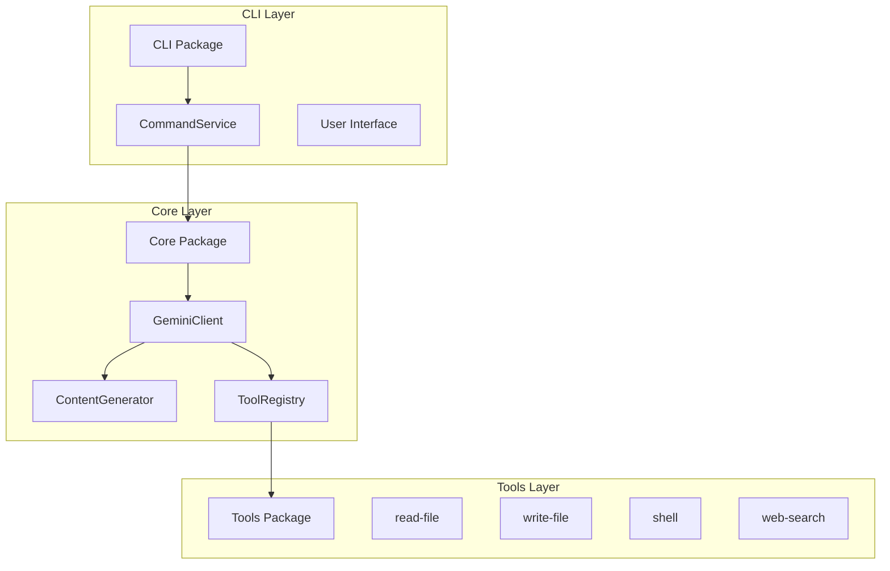
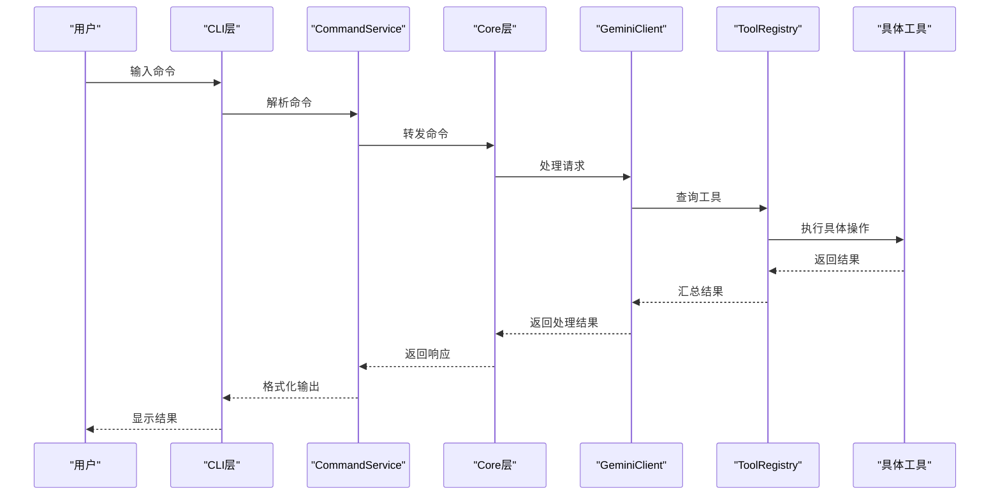
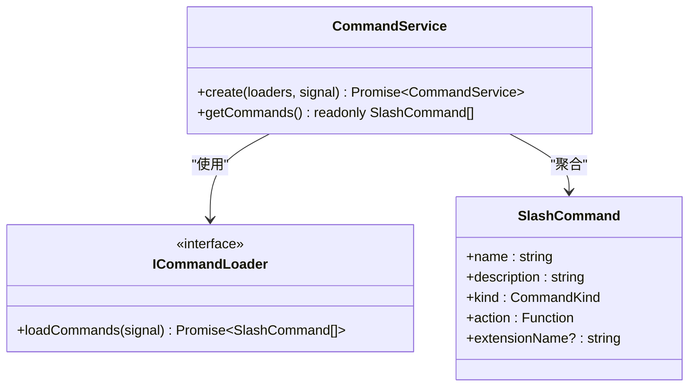
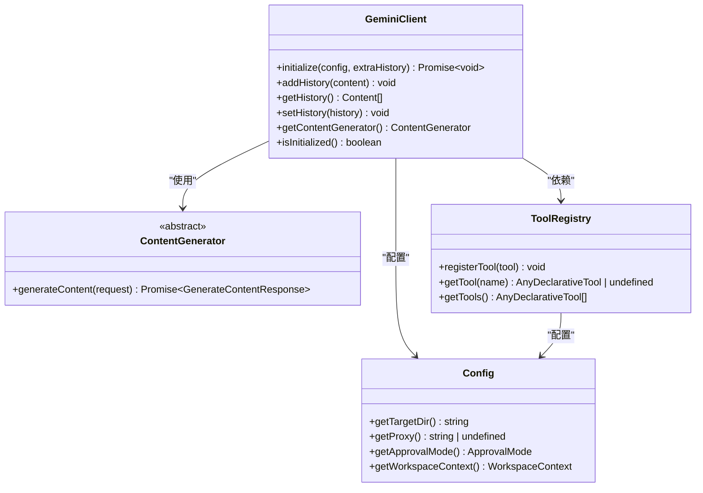
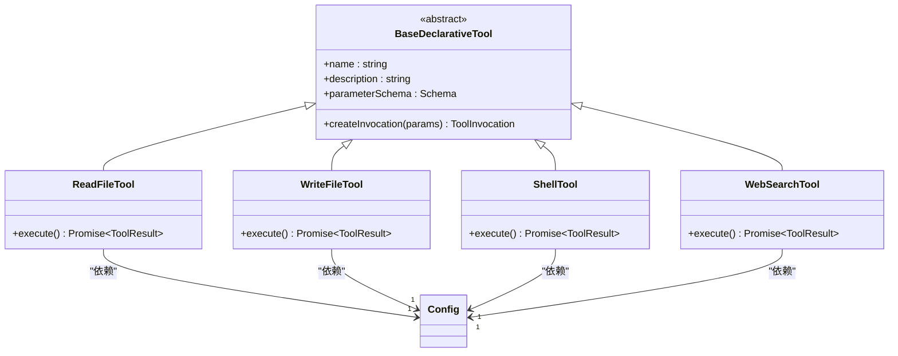
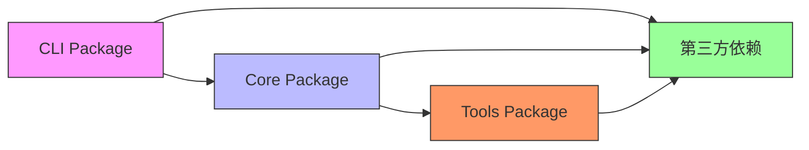

# 模块职责划分

<cite>
**本文档中引用的文件**  
- [CommandService.ts](file://packages/cli/src/services/CommandService.ts)
- [client.ts](file://packages/core/src/core/client.ts)
- [tool-registry.ts](file://packages/core/src/tools/tool-registry.ts)
- [read-file.ts](file://packages/core/src/tools/read-file.ts)
- [config.ts](file://packages/cli/src/config/config.ts)
- [tools.ts](file://packages/core/src/tools/tools.ts)
- [index.ts](file://packages/core/src/index.ts)
</cite>

## 目录
1. [引言](#引言)
2. [项目结构](#项目结构)
3. [核心组件](#核心组件)
4. [架构概述](#架构概述)
5. [详细组件分析](#详细组件分析)
6. [依赖分析](#依赖分析)
7. [性能考虑](#性能考虑)
8. [故障排除指南](#故障排除指南)
9. [结论](#结论)

## 引言
本文档详细阐述了Qwen Code项目中CLI、Core和Tools三大模块的职责边界与协作机制。通过分析代码结构和实现细节，说明了CLI层如何通过CommandService抽象用户命令并转发至Core层的Client进行处理，Core层如何封装核心逻辑并提供统一接口供上层调用。同时解释了各模块的依赖关系与隔离策略，包括为何将工具实现（tools）独立为可插拔组件。

## 项目结构

**图示来源**
- [CommandService.ts](file://packages/cli/src/services/CommandService.ts)
- [client.ts](file://packages/core/src/core/client.ts)
- [tool-registry.ts](file://packages/core/src/tools/tool-registry.ts)

**本节来源**
- [CommandService.ts](file://packages/cli/src/services/CommandService.ts)
- [client.ts](file://packages/core/src/core/client.ts)

## 核心组件

CLI、Core和Tools三大模块构成了Qwen Code项目的核心架构。CLI模块负责用户交互和命令解析，Core模块封装了核心业务逻辑，Tools模块则提供了可插拔的功能扩展能力。这种分层设计实现了关注点分离，提升了系统的可维护性和扩展性。

**本节来源**
- [CommandService.ts](file://packages/cli/src/services/CommandService.ts)
- [client.ts](file://packages/core/src/core/client.ts)
- [tool-registry.ts](file://packages/core/src/tools/tool-registry.ts)

## 架构概述

Qwen Code采用分层架构设计，其中CLI层作为用户入口，Core层作为业务逻辑中枢，Tools层作为功能扩展点。CLI层通过CommandService将用户命令抽象化后转发给Core层的Client进行处理。Core层通过ContentGenerator与外部AI服务通信，并通过ToolRegistry管理所有工具的注册与调用。

**图示来源**
- [CommandService.ts](file://packages/cli/src/services/CommandService.ts)
- [client.ts](file://packages/core/src/core/client.ts)
- [tool-registry.ts](file://packages/core/src/tools/tool-registry.ts)

## 详细组件分析

### CLI层分析

CLI层的主要职责是处理用户输入、解析命令并将其转发给Core层。CommandService是CLI层的核心服务，负责协调所有命令的发现和加载过程。

**图示来源**
- [CommandService.ts](file://packages/cli/src/services/CommandService.ts)

**本节来源**
- [CommandService.ts](file://packages/cli/src/services/CommandService.ts)

### Core层分析

Core层是整个系统的核心，负责封装主要业务逻辑并提供统一的接口供上层调用。GeminiClient是Core层的主要入口点，管理会话状态、历史记录和工具调用。

**图示来源**
- [client.ts](file://packages/core/src/core/client.ts)
- [tool-registry.ts](file://packages/core/src/tools/tool-registry.ts)
- [config.ts](file://packages/cli/src/config/config.ts)

**本节来源**
- [client.ts](file://packages/core/src/core/client.ts)
- [tool-registry.ts](file://packages/core/src/tools/tool-registry.ts)

### Tools层分析

Tools层实现了各种具体功能，如文件读取、写入、shell命令执行等。这些工具被设计为可插拔组件，可以通过ToolRegistry进行注册和管理。

**图示来源**
- [tools.ts](file://packages/core/src/tools/tools.ts)
- [read-file.ts](file://packages/core/src/tools/read-file.ts)
- [write-file.ts](file://packages/core/src/tools/write-file.ts)
- [shell.ts](file://packages/core/src/tools/shell.ts)
- [web-search.ts](file://packages/core/src/tools/web-search.ts)

**本节来源**
- [tools.ts](file://packages/core/src/tools/tools.ts)
- [read-file.ts](file://packages/core/src/tools/read-file.ts)

## 依赖分析

**图示来源**
- [package.json](file://packages/cli/package.json)
- [package.json](file://packages/core/package.json)
- [index.ts](file://packages/core/src/index.ts)

**本节来源**
- [package.json](file://packages/cli/package.json)
- [package.json](file://packages/core/package.json)

## 性能考虑
系统在设计时考虑了多个性能优化点：CommandService采用并行加载器模式提高命令加载效率；ToolRegistry使用Map数据结构确保工具查找的时间复杂度为O(1)；文件操作工具实现了内容截断机制避免大文件处理导致的内存溢出问题。

## 故障排除指南
当遇到命令无法执行的问题时，首先检查CLI层的CommandService是否正确加载了相关命令；如果命令已加载但执行失败，则检查Core层的Client配置是否正确；最后确认Tools层的具体工具实现是否存在错误。日志记录功能可以帮助定位具体的问题环节。

**本节来源**
- [errors.ts](file://packages/cli/src/utils/errors.ts)
- [errorReporting.ts](file://packages/core/src/utils/errorReporting.ts)

## 结论
Qwen Code项目通过清晰的模块划分实现了良好的架构设计。CLI、Core和Tools三层架构不仅明确了各自的职责边界，还通过定义良好的接口实现了松耦合。这种设计使得系统具有很高的可维护性和扩展性，新的功能可以通过添加新的工具类轻松集成到现有系统中。