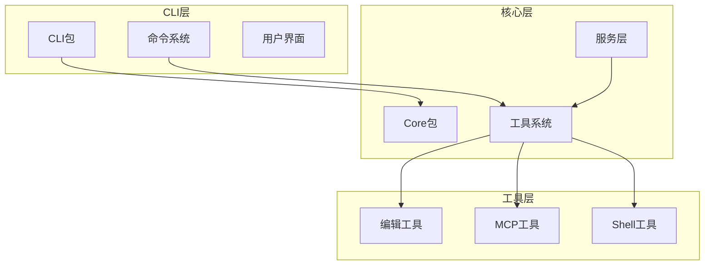
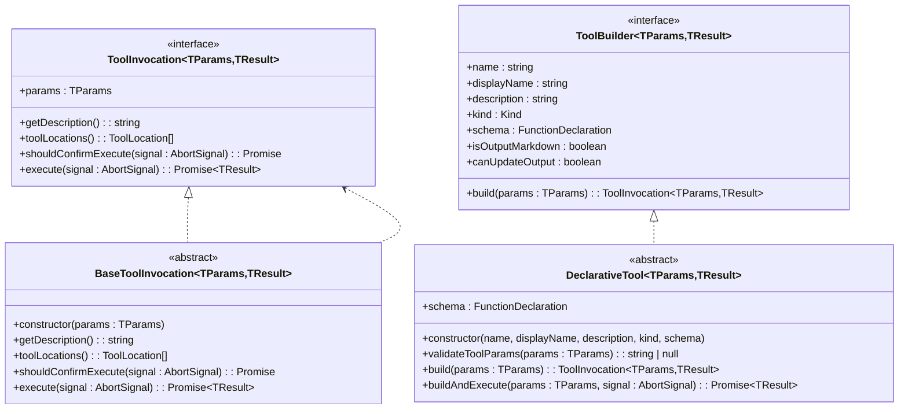
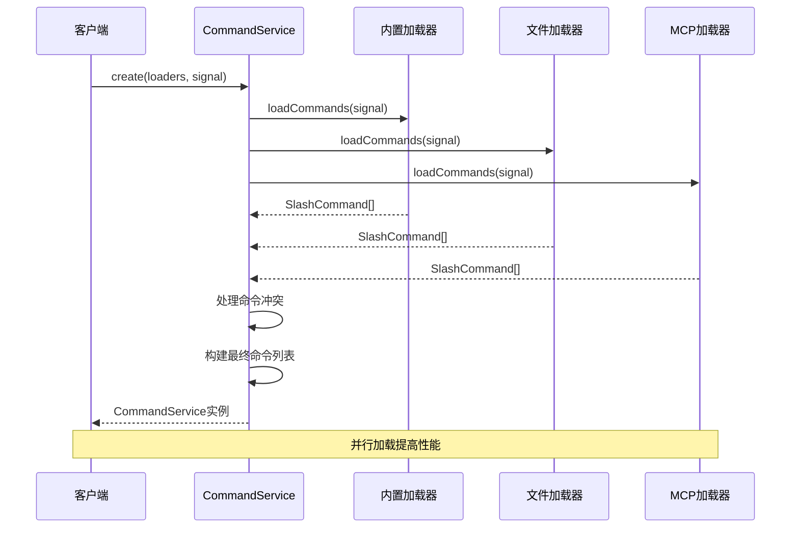
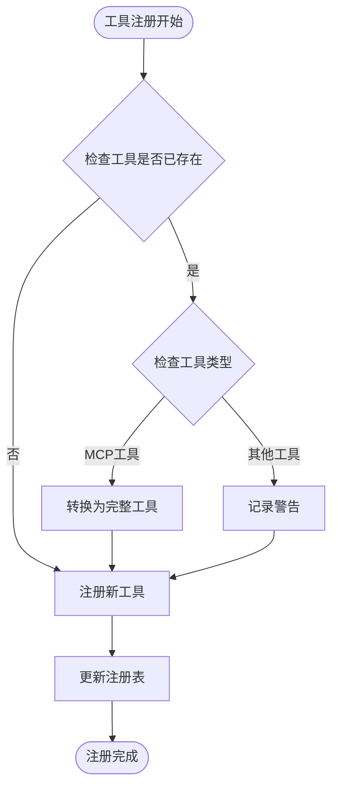
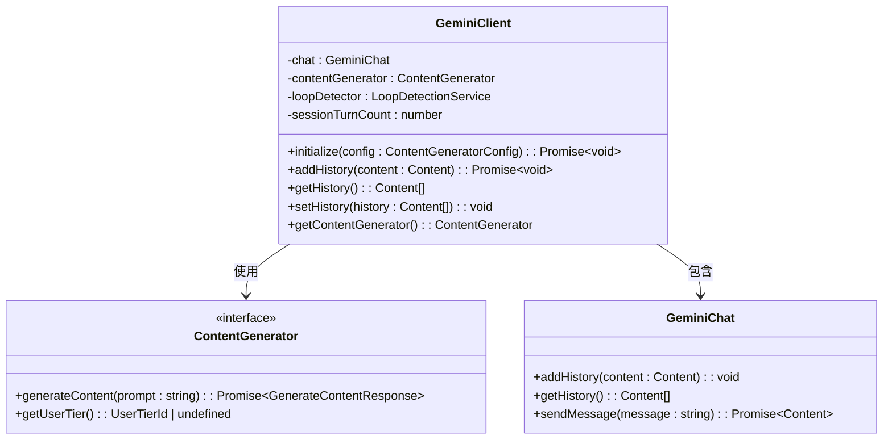
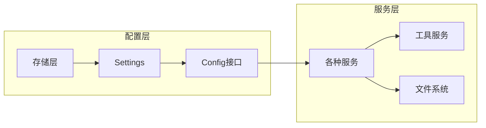

# 类型安全与解耦设计

<cite>
**本文档引用的文件**
- [packages/cli/src/services/types.ts](file://packages/cli/src/services/types.ts)
- [packages/cli/src/services/CommandService.ts](file://packages/cli/src/services/CommandService.ts)
- [packages/cli/src/ui/commands/types.ts](file://packages/cli/src/ui/commands/types.ts)
- [packages/core/src/core/client.ts](file://packages/core/src/core/client.ts)
- [packages/core/src/tools/tool-registry.ts](file://packages/core/src/tools/tool-registry.ts)
- [packages/core/src/tools/tools.ts](file://packages/core/src/tools/tools.ts)
- [packages/cli/src/ui/commands/mcpCommand.ts](file://packages/cli/src/ui/commands/mcpCommand.ts)
- [packages/core/src/tools/edit.ts](file://packages/core/src/tools/edit.ts)
- [packages/cli/src/config/settingsSchema.ts](file://packages/cli/src/config/settingsSchema.ts)
- [packages/cli/src/services/CommandService.test.ts](file://packages/cli/src/services/CommandService.test.ts)
- [packages/cli/src/test-utils/mockCommandContext.ts](file://packages/cli/src/test-utils/mockCommandContext.ts)
</cite>

## 目录
1. [引言](#引言)
2. [项目架构概览](#项目架构概览)
3. [核心类型系统设计](#核心类型系统设计)
4. [命令系统解耦分析](#命令系统解耦分析)
5. [工具系统类型安全](#工具系统类型安全)
6. [客户端通信接口](#客户端通信接口)
7. [类型推断与泛型应用](#类型推断与泛型应用)
8. [依赖注入与服务解耦](#依赖注入与服务解耦)
9. [性能考虑与优化](#性能考虑与优化)
10. [故障排除指南](#故障排除指南)
11. [结论](#结论)

## 引言

Qwen Code项目展现了现代TypeScript应用程序中类型安全与模块解耦的最佳实践。该项目通过精心设计的接口体系、严格的类型定义和泛型应用，实现了高度可维护和可扩展的架构。本文档将深入分析项目中如何通过类型系统实现跨模块的安全通信，并展示具体的设计模式和实现细节。

## 项目架构概览

Qwen Code采用分层架构设计，主要包含以下核心包：



**图表来源**
- [packages/cli/src/services/CommandService.ts](file://packages/cli/src/services/CommandService.ts#L1-L50)
- [packages/core/src/tools/tools.ts](file://packages/core/src/tools/tools.ts#L1-L50)

## 核心类型系统设计

### 命令上下文接口设计

项目中最核心的类型系统体现在`CommandContext`接口中，它定义了命令执行所需的所有上下文信息：

```typescript
export interface CommandContext {
  invocation?: {
    raw: string;
    name: string;
    args: string;
  };
  services: {
    config: Config | null;
    settings: LoadedSettings;
    git: GitService | undefined;
    logger: Logger;
  };
  ui: {
    addItem: UseHistoryManagerReturn['addItem'];
    clear: () => void;
    setDebugMessage: (message: string) => void;
    pendingItem: HistoryItemWithoutId | null;
    setPendingItem: (item: HistoryItemWithoutId | null) => void;
    loadHistory: UseHistoryManagerReturn['loadHistory'];
    toggleCorgiMode: () => void;
    toggleVimEnabled: () => Promise<boolean>;
  };
  session: {
    stats: SessionStatsState;
    sessionShellAllowlist: Set<string>;
  };
  overwriteConfirmed?: boolean;
}
```

这个接口体现了以下设计原则：

1. **分层组织**：将不同类型的依赖按功能分组
2. **可选性设计**：使用可选属性处理不同的执行环境
3. **类型安全**：每个字段都有明确的类型定义
4. **扩展性**：支持未来添加新的上下文属性

**章节来源**
- [packages/cli/src/ui/commands/types.ts](file://packages/cli/src/ui/commands/types.ts#L14-L52)

### 工具系统类型层次

工具系统采用了分层的类型设计，从基础接口到具体实现：



**图表来源**
- [packages/core/src/tools/tools.ts](file://packages/core/src/tools/tools.ts#L15-L100)
- [packages/core/src/tools/tools.ts](file://packages/core/src/tools/tools.ts#L120-L200)

**章节来源**
- [packages/core/src/tools/tools.ts](file://packages/core/src/tools/tools.ts#L1-L200)

## 命令系统解耦分析

### 命令加载器接口

项目通过`ICommandLoader`接口实现了命令系统的完全解耦：

```typescript
export interface ICommandLoader {
  loadCommands(signal: AbortSignal): Promise<SlashCommand[]>;
}
```

这种设计允许：
- **插件化架构**：支持从不同来源加载命令
- **异步加载**：通过AbortSignal支持取消操作
- **类型安全**：确保所有加载器返回标准化的命令格式

### 命令服务的核心设计

`CommandService`类展示了如何通过依赖注入和工厂模式实现松耦合：



**图表来源**
- [packages/cli/src/services/CommandService.ts](file://packages/cli/src/services/CommandService.ts#L40-L80)

### 命令冲突解决机制

系统实现了智能的命令冲突解决策略：

```typescript
// 扩展命令重命名逻辑
if (cmd.extensionName && commandMap.has(cmd.name)) {
  let renamedName = `${cmd.extensionName}.${cmd.name}`;
  let suffix = 1;
  
  // 循环查找不冲突的名字
  while (commandMap.has(renamedName)) {
    renamedName = `${cmd.extensionName}.${cmd.name}${suffix}`;
    suffix++;
  }
  
  finalName = renamedName;
}
```

这种设计确保了：
- **向后兼容**：内置命令优先级最高
- **扩展性**：新扩展不会破坏现有功能
- **唯一性**：自动生成不冲突的命令名

**章节来源**
- [packages/cli/src/services/CommandService.ts](file://packages/cli/src/services/CommandService.ts#L60-L85)

## 工具系统类型安全

### 工具注册与发现

工具系统通过`ToolRegistry`类管理所有可用工具，支持动态发现和注册：



**图表来源**
- [packages/core/src/tools/tool-registry.ts](file://packages/core/src/tools/tool-registry.ts#L150-L200)

### 工具参数验证

每个工具都实现了严格的参数验证机制：

```typescript
export interface EditToolParams {
  file_path: string;
  old_string: string;
  new_string: string;
  expected_replacements?: number;
  modified_by_user?: boolean;
  ai_proposed_string?: string;
}
```

这种设计提供了：
- **编译时检查**：确保参数类型正确
- **运行时验证**：防止无效参数传递
- **错误提示**：提供清晰的错误信息

**章节来源**
- [packages/core/src/tools/edit.ts](file://packages/core/src/tools/edit.ts#L40-L80)

## 客户端通信接口

### GeminiClient设计

`GeminiClient`类展示了如何通过接口设计实现客户端与服务器的解耦：



**图表来源**
- [packages/core/src/core/client.ts](file://packages/core/src/core/client.ts#L80-L150)

### 请求/响应模式

客户端通过严格的请求/响应模式确保数据完整性：

```typescript
async initialize(
  contentGeneratorConfig: ContentGeneratorConfig,
  extraHistory?: Content[],
): Promise<void> {
  this.contentGenerator = await createContentGenerator(
    contentGeneratorConfig,
    this.config,
    this.config.getSessionId(),
  );
  
  this.chat = await this.startChat(
    extraHistory || [],
    contentGeneratorConfig.model,
  );
}
```

这种设计确保了：
- **初始化顺序**：正确的依赖初始化顺序
- **状态一致性**：确保对象处于有效状态
- **错误处理**：统一的错误处理机制

**章节来源**
- [packages/core/src/core/client.ts](file://packages/core/src/core/client.ts#L100-L130)

## 类型推断与泛型应用

### 泛型工具类型

项目广泛使用泛型来增强类型安全性：

```typescript
export type ToolActionReturn =
  | ToolActionReturn
  | MessageActionReturn
  | QuitActionReturn
  | QuitConfirmationActionReturn
  | OpenDialogActionReturn
  | LoadHistoryActionReturn
  | SubmitPromptActionReturn
  | ConfirmShellCommandsActionReturn
  | ConfirmActionReturn;
```

这种联合类型设计：
- **类型安全**：确保只能返回预定义的动作类型
- **可扩展性**：可以轻松添加新的动作类型
- **编译时检查**：防止返回无效的动作类型

### 工具构建器模式

通过泛型约束实现强类型工具构建：

```typescript
export interface ToolBuilder<
  TParams extends object,
  TResult extends ToolResult,
> {
  name: string;
  displayName: string;
  description: string;
  kind: Kind;
  schema: FunctionDeclaration;
  isOutputMarkdown: boolean;
  canUpdateOutput: boolean;
  build(params: TParams): ToolInvocation<TParams, TResult>;
}
```

这种设计的优势：
- **类型推断**：编译器自动推断参数和结果类型
- **代码复用**：通用的构建器模式
- **扩展性**：支持不同类型的具体工具实现

**章节来源**
- [packages/cli/src/ui/commands/types.ts](file://packages/cli/src/ui/commands/types.ts#L130-L180)
- [packages/core/src/tools/tools.ts](file://packages/core/src/tools/tools.ts#L80-L120)

## 依赖注入与服务解耦

### 配置系统设计

配置系统通过接口抽象实现了高度的解耦：



**图表来源**
- [packages/cli/src/config/settingsSchema.ts](file://packages/cli/src/config/settingsSchema.ts#L1-L50)

### 测试友好的设计

项目通过依赖注入和接口抽象实现了优秀的测试支持：

```typescript
export const createMockCommandContext = (
  overrides: DeepPartial<CommandContext> = {},
): CommandContext => {
  const defaultMocks: CommandContext = {
    invocation: {
      raw: '',
      name: '',
      args: '',
    },
    services: {
      config: null,
      settings: {
        merged: {},
        setValue: vi.fn(),
      } as unknown as LoadedSettings,
      git: undefined as GitService | undefined,
      logger: {
        log: vi.fn(),
        logMessage: vi.fn(),
        saveCheckpoint: vi.fn(),
        loadCheckpoint: vi.fn().mockResolvedValue([]),
      } as any,
    },
    // ... 更多默认模拟
  };
};
```

这种设计使得：
- **单元测试**：可以轻松模拟依赖
- **集成测试**：支持完整的测试场景
- **开发效率**：快速创建测试替身

**章节来源**
- [packages/cli/src/test-utils/mockCommandContext.ts](file://packages/cli/src/test-utils/mockCommandContext.ts#L19-L63)

## 性能考虑与优化

### 并发加载优化

命令系统通过Promise.allSettled实现并发加载：

```typescript
const results = await Promise.allSettled(
  loaders.map((loader) => loader.loadCommands(signal)),
);

const allCommands: SlashCommand[] = [];
for (const result of results) {
  if (result.status === 'fulfilled') {
    allCommands.push(...result.value);
  } else {
    console.debug('A command loader failed:', result.reason);
  }
}
```

这种设计的优势：
- **性能提升**：并行加载多个命令源
- **容错能力**：单个加载器失败不影响整体
- **监控支持**：记录失败的加载器以便调试

### 内存优化策略

系统通过只读数组和冻结对象来优化内存使用：

```typescript
const finalCommands = Object.freeze(Array.from(commandMap.values()));
return new CommandService(finalCommands);
```

这确保了：
- **不可变性**：防止意外修改内部状态
- **垃圾回收**：帮助JavaScript引擎进行内存回收
- **线程安全**：支持多线程访问（如果需要）

## 故障排除指南

### 常见类型错误

1. **命令冲突错误**
   - 症状：重复的命令名称
   - 解决方案：检查扩展命令的命名空间

2. **工具参数验证失败**
   - 症状：工具执行时参数错误
   - 解决方案：检查工具参数的类型定义

3. **接口不匹配**
   - 症状：编译时接口错误
   - 解决方案：确保实现类符合接口定义

### 调试技巧

1. **使用TypeScript严格模式**
   ```typescript
   // tsconfig.json
   {
     "compilerOptions": {
       "strict": true,
       "noImplicitAny": true,
       "strictNullChecks": true
     }
   }
   ```

2. **利用IDE类型提示**
   - 在VS Code中使用TypeScript智能感知
   - 利用Go to Definition功能追踪类型定义

3. **编写类型测试**
   ```typescript
   // 确保类型定义正确
   const testCommand: SlashCommand = {
     name: 'test',
     description: 'Test command',
     kind: CommandKind.BUILT_IN,
     action: async (context, args) => {
       // 类型检查在这里生效
     }
   };
   ```

**章节来源**
- [packages/cli/src/services/CommandService.test.ts](file://packages/cli/src/services/CommandService.test.ts#L1-L100)

## 结论

Qwen Code项目展示了如何通过精心设计的类型系统实现高度的模块解耦和类型安全。通过以下关键设计模式：

1. **接口抽象**：使用清晰的接口定义模块边界
2. **泛型应用**：通过泛型增强类型安全性和代码复用
3. **依赖注入**：实现松耦合的服务架构
4. **类型推断**：充分利用TypeScript的类型推断能力
5. **测试友好**：设计易于测试的架构

这些设计原则不仅提高了代码质量，还大大提升了开发效率和系统的可维护性。对于希望构建大型TypeScript项目的团队来说，Qwen Code提供了一个优秀的参考范例。

通过深入理解这些设计模式和实现细节，开发者可以构建出更加健壮、可扩展和易于维护的TypeScript应用程序。