# Qwen Code通信机制与数据流

<cite>
**本文档中引用的文件**
- [packages/cli/src/utils/events.ts](file://packages/cli/src/utils/events.ts)
- [packages/cli/src/utils/updateEventEmitter.ts](file://packages/cli/src/utils/updateEventEmitter.ts)
- [packages/cli/src/services/CommandService.ts](file://packages/cli/src/services/CommandService.ts)
- [packages/core/src/core/client.ts](file://packages/core/src/core/client.ts)
- [packages/core/src/core/loggingContentGenerator.ts](file://packages/core/src/core/loggingContentGenerator.ts)
- [packages/core/src/tools/tool-registry.ts](file://packages/core/src/tools/tool-registry.ts)
- [packages/core/src/subagents/subagent-events.ts](file://packages/core/src/subagents/subagent-events.ts)
- [packages/core/src/config/config.ts](file://packages/core/src/config/config.ts)
- [packages/core/src/core/coreToolScheduler.ts](file://packages/core/src/core/coreToolScheduler.ts)
- [packages/cli/src/ui/App.tsx](file://packages/cli/src/ui/App.tsx)
- [integration-tests/simple-mcp-server.test.ts](file://integration-tests/simple-mcp-server.test.ts)
</cite>

## 目录
1. [简介](#简介)
2. [项目架构概览](#项目架构概览)
3. [单向数据流分析](#单向数据流分析)
4. [事件驱动通信机制](#事件驱动通信机制)
5. [核心组件详细分析](#核心组件详细分析)
6. [数据转换过程](#数据转换过程)
7. [状态一致性保证](#状态一致性保证)
8. [错误传播机制](#错误传播机制)
9. [性能考虑](#性能考虑)
10. [故障排除指南](#故障排除指南)
11. [结论](#结论)

## 简介

Qwen Code是一个基于React的命令行界面应用程序，采用单向数据流架构和事件驱动通信机制。该系统设计用于处理用户输入、执行AI驱动的任务并提供实时反馈。本文档深入分析了从CLI层到Core层的数据流、事件总线通信机制以及日志生成器如何监听核心事件以记录执行流程。

## 项目架构概览

Qwen Code采用分层架构设计，主要包含以下核心包：

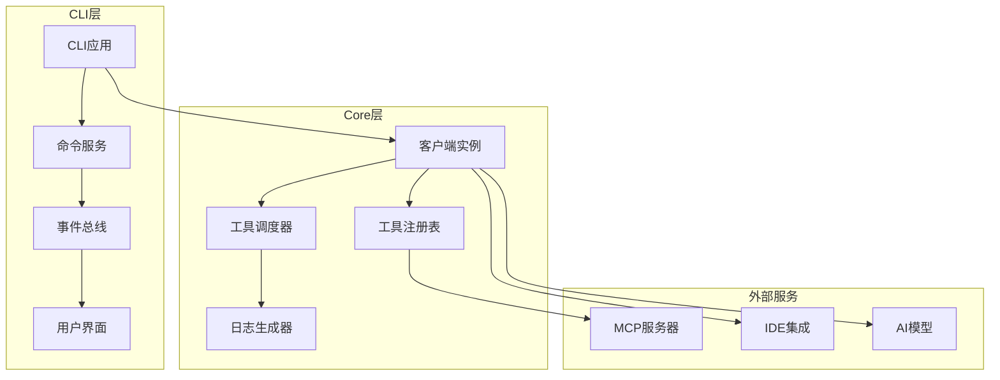

**图表来源**
- [packages/cli/src/ui/App.tsx](file://packages/cli/src/ui/App.tsx#L1-L50)
- [packages/core/src/core/client.ts](file://packages/core/src/core/client.ts#L1-L100)

## 单向数据流分析

### 用户输入处理流程

用户输入通过CLI层进入系统，遵循严格的单向数据流原则：

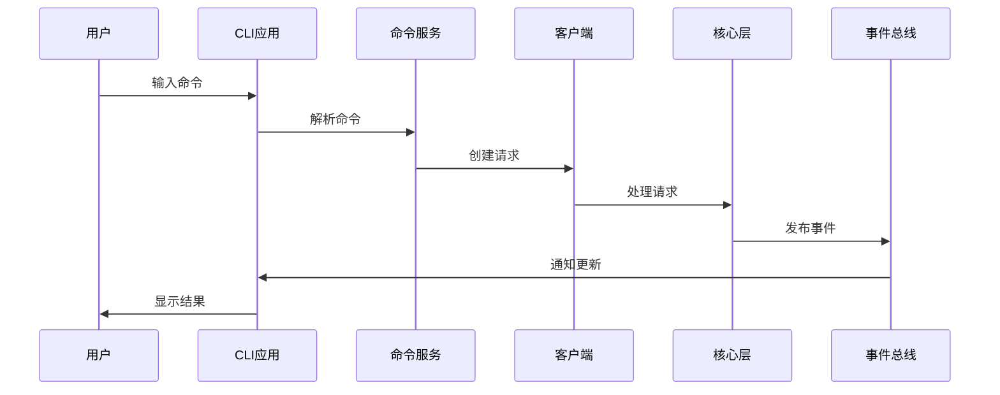

**图表来源**
- [packages/cli/src/services/CommandService.ts](file://packages/cli/src/services/CommandService.ts#L40-L80)
- [packages/core/src/core/client.ts](file://packages/core/src/core/client.ts#L100-L150)

### 数据流向图

系统的数据流向严格遵循单向原则：

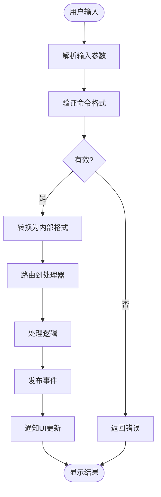

**图表来源**
- [packages/cli/src/services/CommandService.ts](file://packages/cli/src/services/CommandService.ts#L20-L60)

**章节来源**
- [packages/cli/src/services/CommandService.ts](file://packages/cli/src/services/CommandService.ts#L1-L104)
- [packages/cli/src/ui/App.tsx](file://packages/cli/src/ui/App.tsx#L1-L100)

## 事件驱动通信机制

### 事件总线架构

Qwen Code使用Node.js的EventEmitter作为核心事件总线：

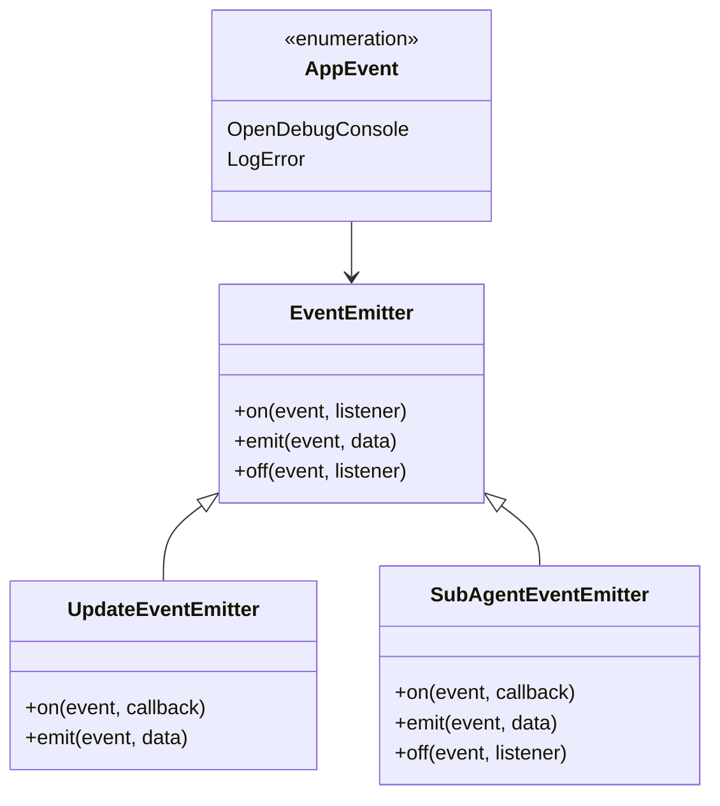

**图表来源**
- [packages/cli/src/utils/events.ts](file://packages/cli/src/utils/events.ts#L8-L14)
- [packages/cli/src/utils/updateEventEmitter.ts](file://packages/cli/src/utils/updateEventEmitter.ts#L10-L12)
- [packages/core/src/subagents/subagent-events.ts](file://packages/core/src/subagents/subagent-events.ts#L100-L130)

### 事件类型定义

系统定义了多种事件类型来支持不同的通信需求：

```typescript
// 应用级事件
export enum AppEvent {
  OpenDebugConsole = 'open-debug-console',
  LogError = 'log-error',
}

// 子代理事件
export type SubAgentEvent =
  | 'start'
  | 'round_start'
  | 'round_end'
  | 'stream_text'
  | 'tool_call'
  | 'tool_result'
  | 'tool_waiting_approval'
  | 'finish'
  | 'error';
```

### 异步通知机制

事件总线实现了完整的异步通知机制：

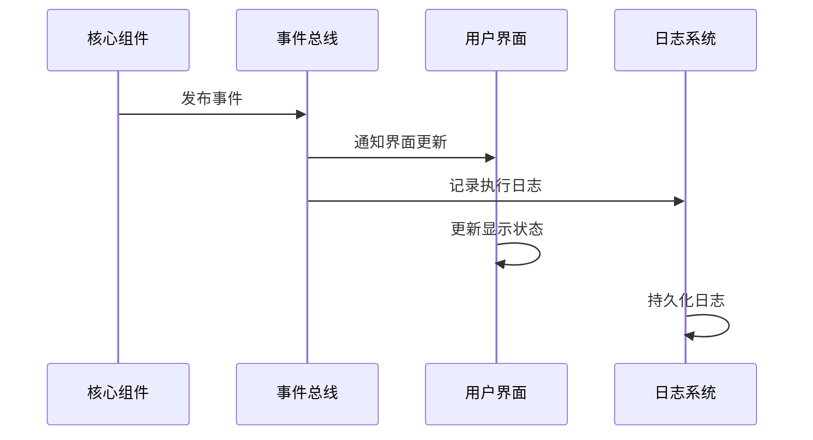

**图表来源**
- [packages/core/src/core/loggingContentGenerator.ts](file://packages/core/src/core/loggingContentGenerator.ts#L40-L80)
- [packages/cli/src/utils/events.ts](file://packages/cli/src/utils/events.ts#L1-L15)

**章节来源**
- [packages/cli/src/utils/events.ts](file://packages/cli/src/utils/events.ts#L1-L15)
- [packages/cli/src/utils/updateEventEmitter.ts](file://packages/cli/src/utils/updateEventEmitter.ts#L1-L12)
- [packages/core/src/subagents/subagent-events.ts](file://packages/core/src/subagents/subagent-events.ts#L1-L131)

## 核心组件详细分析

### CommandService - 命令解析器

CommandService负责发现和加载所有斜杠命令，采用提供者模式：

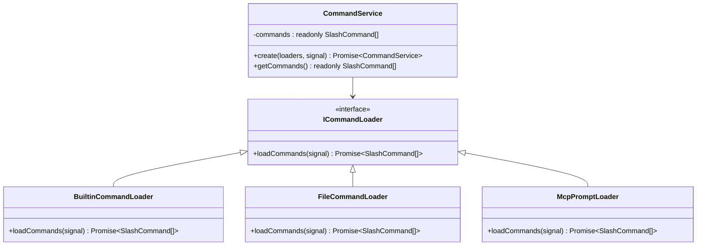

**图表来源**
- [packages/cli/src/services/CommandService.ts](file://packages/cli/src/services/CommandService.ts#L15-L50)

### GeminiClient - 核心客户端

GeminiClient是系统的核心组件，负责与AI模型交互：

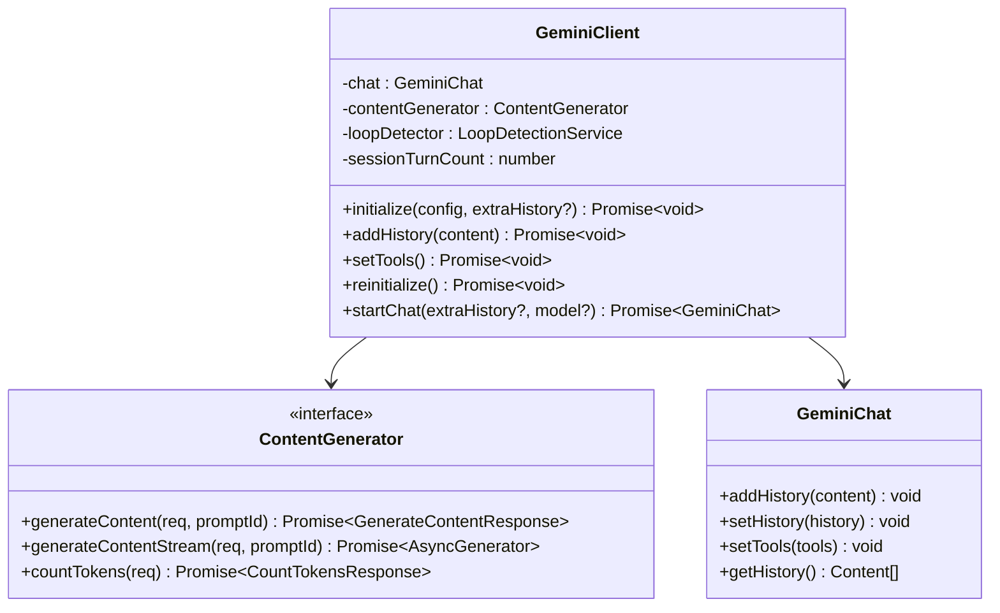

**图表来源**
- [packages/core/src/core/client.ts](file://packages/core/src/core/client.ts#L80-L150)

### LoggingContentGenerator - 日志装饰器

LoggingContentGenerator实现了装饰器模式来添加日志功能：

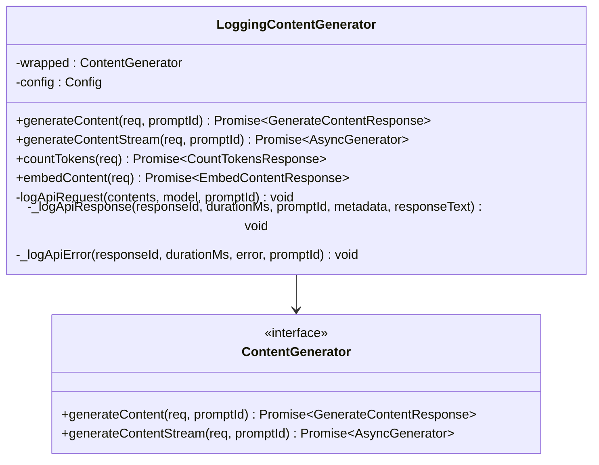

**图表来源**
- [packages/core/src/core/loggingContentGenerator.ts](file://packages/core/src/core/loggingContentGenerator.ts#L25-L80)

**章节来源**
- [packages/cli/src/services/CommandService.ts](file://packages/cli/src/services/CommandService.ts#L1-L104)
- [packages/core/src/core/client.ts](file://packages/core/src/core/client.ts#L1-L200)
- [packages/core/src/core/loggingContentGenerator.ts](file://packages/core/src/core/loggingContentGenerator.ts#L1-L196)

## 数据转换过程

### 请求响应周期

系统在请求响应周期中执行多个数据转换步骤：

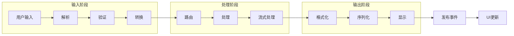

### 工具调用流程

工具调用涉及复杂的参数转换和验证：

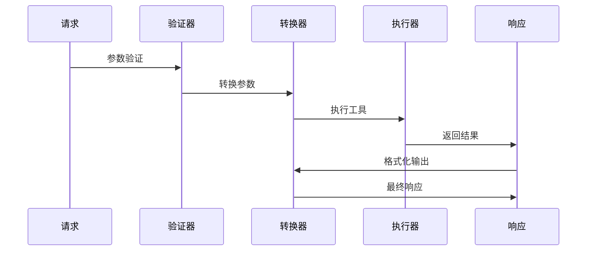

**图表来源**
- [packages/core/src/core/coreToolScheduler.ts](file://packages/core/src/core/coreToolScheduler.ts#L50-L100)

**章节来源**
- [packages/core/src/core/coreToolScheduler.ts](file://packages/core/src/core/coreToolScheduler.ts#L1-L200)

## 状态一致性保证

### 事件驱动的状态管理

系统通过事件驱动的方式确保状态一致性：

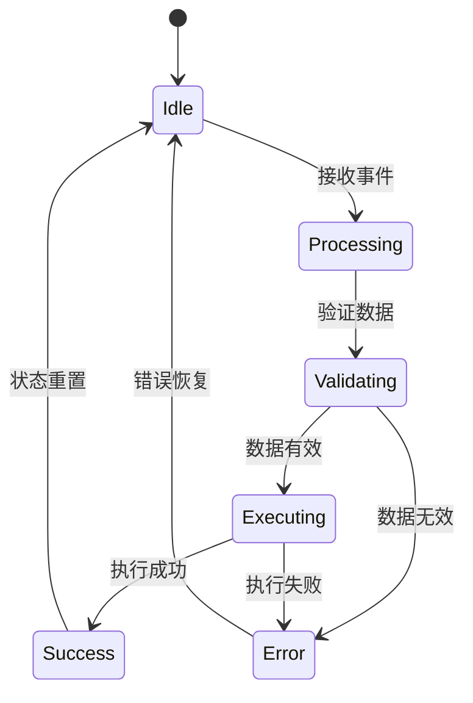

### 循环检测机制

系统实现了循环检测服务来防止无限循环：

```typescript
// 循环检测示例
class LoopDetectionService {
  private detectedLoops: Map<string, number> = new Map();
  
  detectLoop(turnId: string): boolean {
    const count = this.detectedLoops.get(turnId) || 0;
    this.detectedLoops.set(turnId, count + 1);
    return count > LOOP_THRESHOLD;
  }
}
```

**章节来源**
- [packages/core/src/core/client.ts](file://packages/core/src/core/client.ts#L150-L200)

## 错误传播机制

### 分层错误处理

系统采用分层错误处理策略：

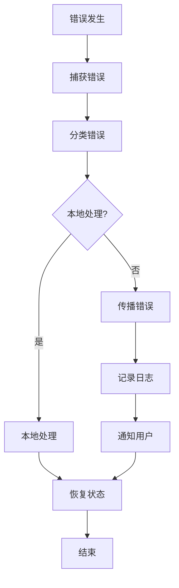

### 错误事件处理

错误通过专门的事件系统传播：

```typescript
// 错误事件处理示例
const handleError = (error: unknown) => {
  const durationMs = Date.now() - startTime;
  logApiError(
    config,
    new ApiErrorEvent(
      responseId,
      model,
      errorMessage,
      durationMs,
      promptId,
      authType,
      errorType,
      structuredError ? structuredError.status : undefined,
    ),
  );
};
```

**章节来源**
- [packages/core/src/core/loggingContentGenerator.ts](file://packages/core/src/core/loggingContentGenerator.ts#L80-L120)

## 性能考虑

### 流式处理优化

系统采用流式处理来提高性能：

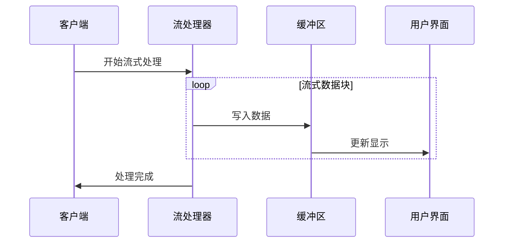

### 缓存策略

系统实现了多级缓存来提升性能：

```typescript
// LRU缓存示例
class LruCache<T> {
  private cache: Map<string, T>;
  private maxSize: number;
  
  get(key: string): T | undefined {
    // 实现LRU逻辑
  }
  
  set(key: string, value: T): void {
    // 实现缓存存储
  }
}
```

## 故障排除指南

### 常见问题诊断

1. **事件未触发**
   - 检查事件监听器是否正确注册
   - 验证事件名称拼写
   - 确认事件总线连接状态

2. **数据流中断**
   - 检查中间件管道
   - 验证数据转换函数
   - 确认异步操作完成

3. **内存泄漏**
   - 检查事件监听器清理
   - 验证定时器清理
   - 监控对象引用

### 调试工具

系统提供了多种调试工具：

```typescript
// 调试事件监听器
if (config.getDebugMode()) {
  console.log(contextParts.join('\n'));
}
```

**章节来源**
- [packages/core/src/core/client.ts](file://packages/core/src/core/client.ts#L300-L350)

## 结论

Qwen Code通过精心设计的单向数据流和事件驱动通信机制，实现了高效、可维护的系统架构。关键特性包括：

1. **清晰的职责分离**：CLI层、Core层和外部服务各司其职
2. **强大的事件系统**：支持异步通知和状态同步
3. **完善的错误处理**：分层错误处理和传播机制
4. **高性能设计**：流式处理和智能缓存策略
5. **可扩展架构**：插件化设计支持功能扩展

这种架构设计不仅保证了系统的稳定性和可维护性，还为未来的功能扩展奠定了坚实的基础。通过事件驱动的通信机制，系统能够实现实时的状态同步和高效的用户交互体验。