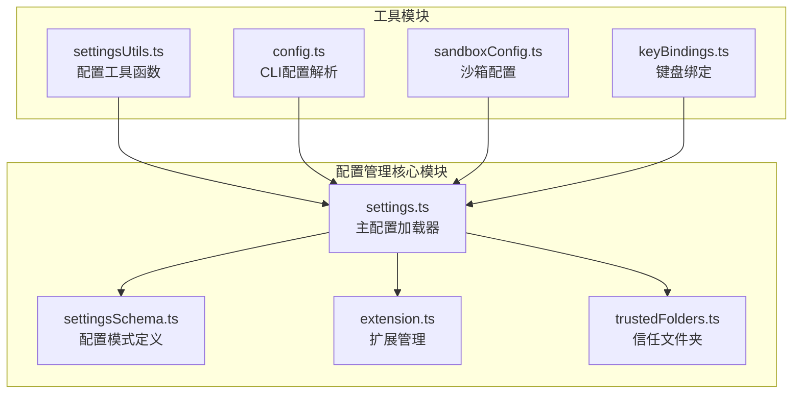
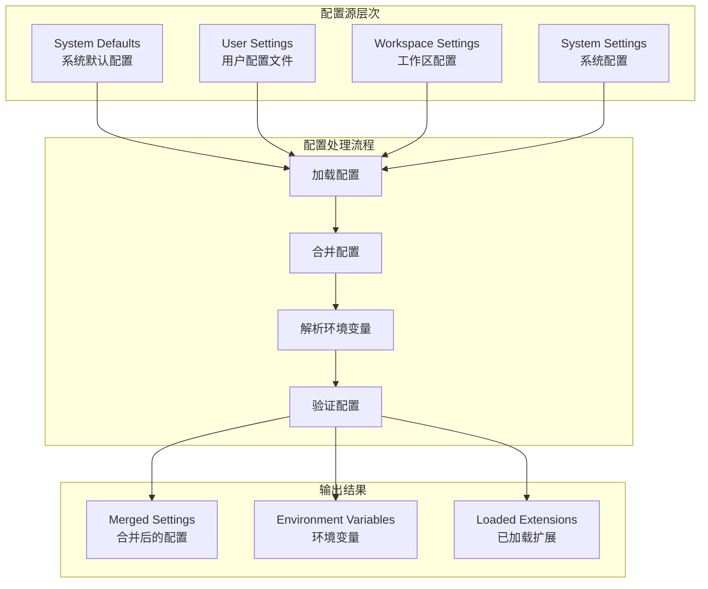
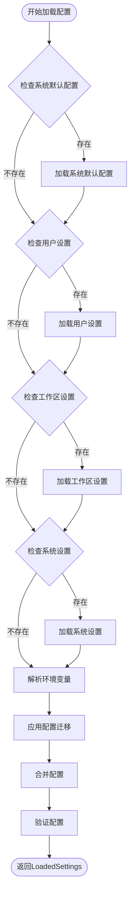
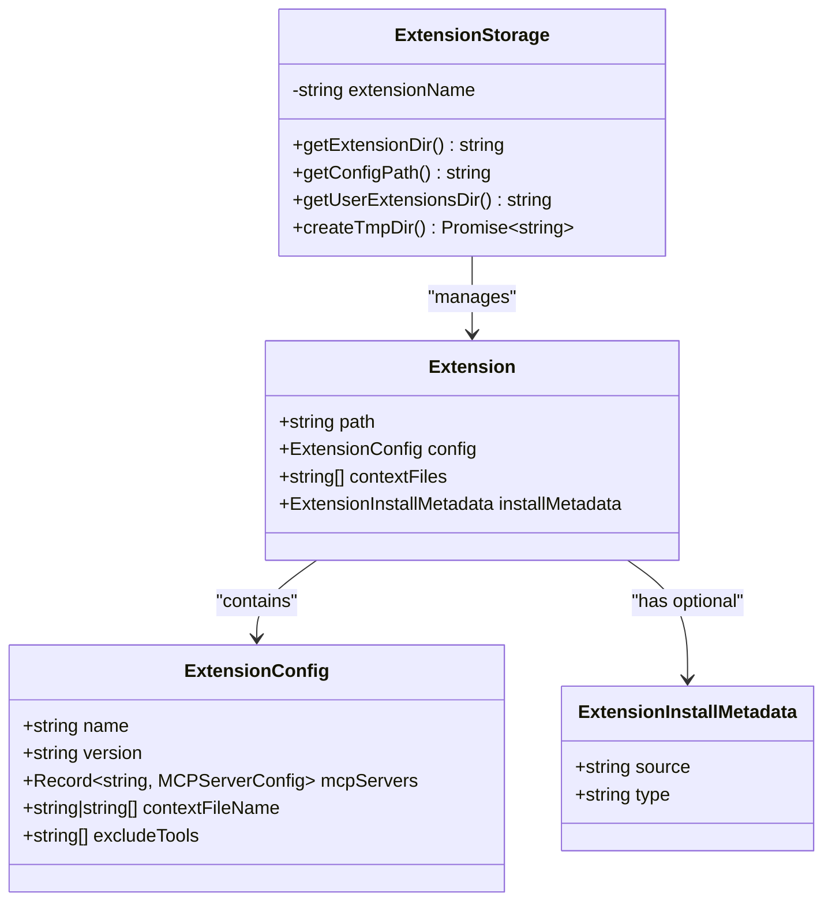
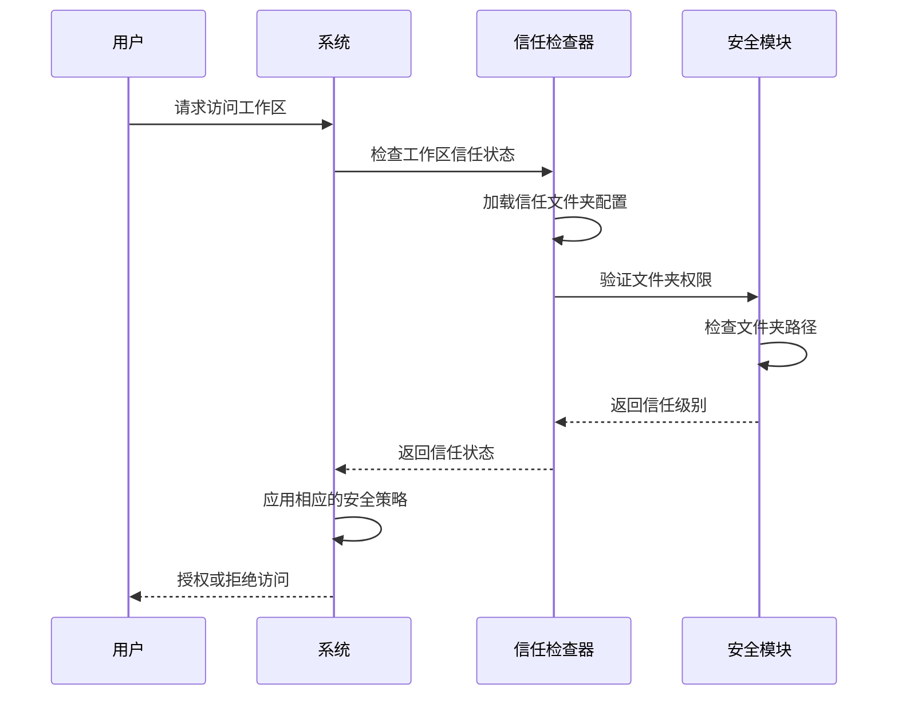
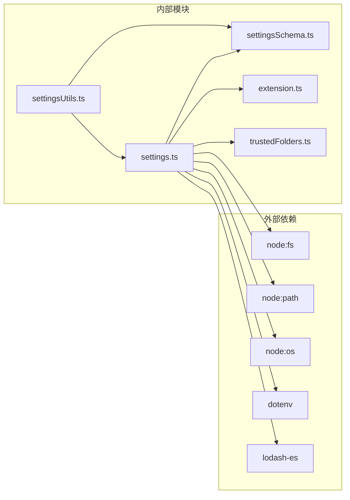

# 配置管理系统

<cite>
**本文档引用的文件**
- [settings.ts](file://packages/cli/src/config/settings.ts)
- [settingsSchema.ts](file://packages/cli/src/config/settingsSchema.ts)
- [extension.ts](file://packages/cli/src/config/extension.ts)
- [trustedFolders.ts](file://packages/cli/src/config/trustedFolders.ts)
- [config.ts](file://packages/cli/src/config/config.ts)
- [settingsUtils.ts](file://packages/cli/src/utils/settingsUtils.ts)
- [sandboxConfig.ts](file://packages/cli/src/config/sandboxConfig.ts)
- [keyBindings.ts](file://packages/cli/src/config/keyBindings.ts)
</cite>

## 目录
1. [简介](#简介)
2. [项目结构](#项目结构)
3. [核心组件](#核心组件)
4. [架构概览](#架构概览)
5. [详细组件分析](#详细组件分析)
6. [依赖关系分析](#依赖关系分析)
7. [性能考虑](#性能考虑)
8. [故障排除指南](#故障排除指南)
9. [结论](#结论)

## 简介

Qwen Code 配置管理系统是一个功能强大且灵活的配置框架，支持多层次配置管理、环境变量解析、热更新机制和安全配置。该系统采用分层架构设计，支持用户级、工作区级、系统级和系统默认配置，并提供了完整的配置迁移、验证和安全保护机制。

## 项目结构

配置管理系统的核心文件组织如下：



**图表来源**
- [settings.ts](file://packages/cli/src/config/settings.ts#L1-L50)
- [settingsSchema.ts](file://packages/cli/src/config/settingsSchema.ts#L1-L50)
- [extension.ts](file://packages/cli/src/config/extension.ts#L1-L50)

**章节来源**
- [settings.ts](file://packages/cli/src/config/settings.ts#L1-L100)
- [settingsSchema.ts](file://packages/cli/src/config/settingsSchema.ts#L1-L100)

## 核心组件

### 配置加载器 (settings.ts)

配置加载器是整个系统的核心，负责从多个源加载和合并配置：

```typescript
// 配置加载优先级：系统默认 → 用户设置 → 工作区设置 → 系统设置
export function loadSettings(workspaceDir: string): LoadedSettings {
  // 加载不同层级的配置
  systemSettings = loadAndMigrate(systemSettingsPath, SettingScope.System);
  systemDefaultSettings = loadAndMigrate(systemDefaultsPath, SettingScope.SystemDefaults);
  userSettings = loadAndMigrate(USER_SETTINGS_PATH, SettingScope.User);
  
  if (realWorkspaceDir !== realHomeDir) {
    workspaceSettings = loadAndMigrate(workspaceSettingsPath, SettingScope.Workspace);
  }
  
  // 合并配置并应用环境变量解析
  return new LoadedSettings(
    { settings: systemSettings, path: systemSettingsPath },
    { settings: systemDefaultSettings, path: systemDefaultsPath },
    { settings: userSettings, path: USER_SETTINGS_PATH },
    { settings: workspaceSettings, path: workspaceSettingsPath },
    settingsErrors,
    isTrusted,
    migratedInMemorScopes
  );
}
```

### 配置模式定义 (settingsSchema.ts)

配置模式定义了所有可用的配置选项及其属性：

```typescript
export const SETTINGS_SCHEMA = {
  general: {
    type: 'object',
    label: 'General',
    category: 'General',
    requiresRestart: false,
    default: {},
    properties: {
      vimMode: {
        type: 'boolean',
        label: 'Vim Mode',
        category: 'General',
        requiresRestart: false,
        default: false,
        description: 'Enable Vim keybindings'
      }
    }
  }
};
```

**章节来源**
- [settings.ts](file://packages/cli/src/config/settings.ts#L644-L700)
- [settingsSchema.ts](file://packages/cli/src/config/settingsSchema.ts#L30-L100)

## 架构概览

配置管理系统采用分层架构，支持多种配置源和复杂的合并逻辑：



**图表来源**
- [settings.ts](file://packages/cli/src/config/settings.ts#L400-L500)
- [settings.ts](file://packages/cli/src/config/settings.ts#L644-L680)

## 详细组件分析

### 配置加载优先级

系统支持五种配置源，按优先级降序排列：



**图表来源**
- [settings.ts](file://packages/cli/src/config/settings.ts#L644-L700)
- [settings.ts](file://packages/cli/src/config/settings.ts#L400-L500)

### 环境变量解析机制

系统支持在配置文件中使用环境变量，并提供递归解析功能：

```typescript
function resolveEnvVarsInString(value: string): string {
  const envVarRegex = /\$(?:(\w+)|{([^}]+)})/g; // 匹配 $VAR_NAME 或 ${VAR_NAME}
  return value.replace(envVarRegex, (match, varName1, varName2) => {
    const varName = varName1 || varName2;
    if (process && process.env && typeof process.env[varName] === 'string') {
      return process.env[varName]!;
    }
    return match;
  });
}

function resolveEnvVarsInObject<T>(obj: T): T {
  if (typeof obj === 'string') {
    return resolveEnvVarsInString(obj) as unknown as T;
  }
  
  if (Array.isArray(obj)) {
    return obj.map((item) => resolveEnvVarsInObject(item)) as unknown as T;
  }
  
  if (typeof obj === 'object') {
    const newObj = { ...obj } as T;
    for (const key in newObj) {
      if (Object.prototype.hasOwnProperty.call(newObj, key)) {
        newObj[key] = resolveEnvVarsInObject(newObj[key]);
      }
    }
    return newObj;
  }
  
  return obj;
}
```

### 扩展管理系统

扩展管理系统提供了完整的扩展生命周期管理：



**图表来源**
- [extension.ts](file://packages/cli/src/config/extension.ts#L25-L50)
- [extension.ts](file://packages/cli/src/config/extension.ts#L100-L150)

### 安全配置管理

系统实现了多层安全保护机制：



**图表来源**
- [trustedFolders.ts](file://packages/cli/src/config/trustedFolders.ts#L100-L150)
- [settings.ts](file://packages/cli/src/config/settings.ts#L400-L450)

**章节来源**
- [settings.ts](file://packages/cli/src/config/settings.ts#L500-L600)
- [extension.ts](file://packages/cli/src/config/extension.ts#L100-L200)
- [trustedFolders.ts](file://packages/cli/src/config/trustedFolders.ts#L100-L169)

## 依赖关系分析

配置管理系统的依赖关系复杂但清晰：



**图表来源**
- [settings.ts](file://packages/cli/src/config/settings.ts#L1-L20)
- [settingsUtils.ts](file://packages/cli/src/utils/settingsUtils.ts#L1-L20)

**章节来源**
- [settings.ts](file://packages/cli/src/config/settings.ts#L1-L30)
- [settingsUtils.ts](file://packages/cli/src/utils/settingsUtils.ts#L1-L30)

## 性能考虑

配置管理系统在设计时充分考虑了性能优化：

1. **延迟加载**: 配置仅在需要时才加载
2. **缓存机制**: 已解析的配置会被缓存以避免重复计算
3. **增量更新**: 支持部分配置的热更新
4. **内存优化**: 使用流式处理大型配置文件

## 故障排除指南

### 常见配置问题

1. **配置文件格式错误**
   - 检查JSON语法是否正确
   - 验证配置键名是否存在

2. **环境变量未解析**
   - 确认环境变量已设置
   - 检查变量名称拼写

3. **扩展加载失败**
   - 验证扩展配置文件格式
   - 检查扩展目录权限

**章节来源**
- [settings.ts](file://packages/cli/src/config/settings.ts#L700-L800)
- [extension.ts](file://packages/cli/src/config/extension.ts#L200-L300)

## 结论

Qwen Code 配置管理系统是一个设计精良、功能完备的配置框架。它通过分层架构、环境变量解析、扩展管理和安全保护等特性，为用户提供了一个强大而灵活的配置解决方案。系统的模块化设计使其易于维护和扩展，同时提供了完善的错误处理和诊断功能。

该系统特别适合需要多环境配置管理、安全控制和扩展性的企业级应用，为开发者提供了统一、可靠的配置管理体验。