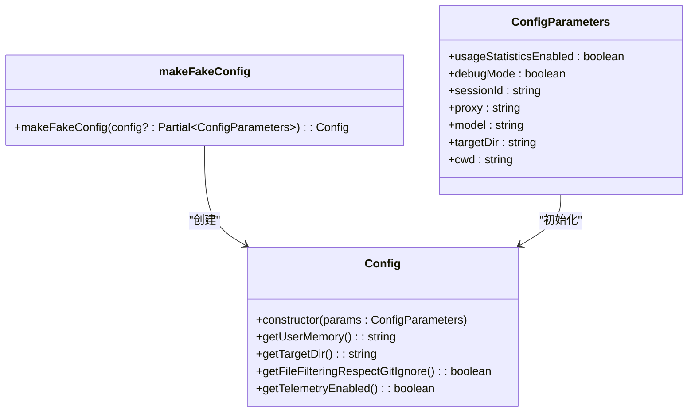
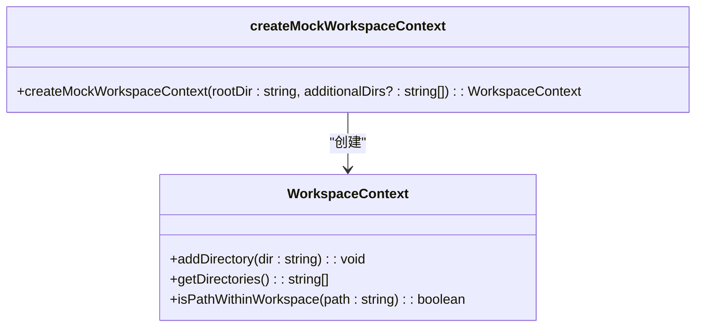
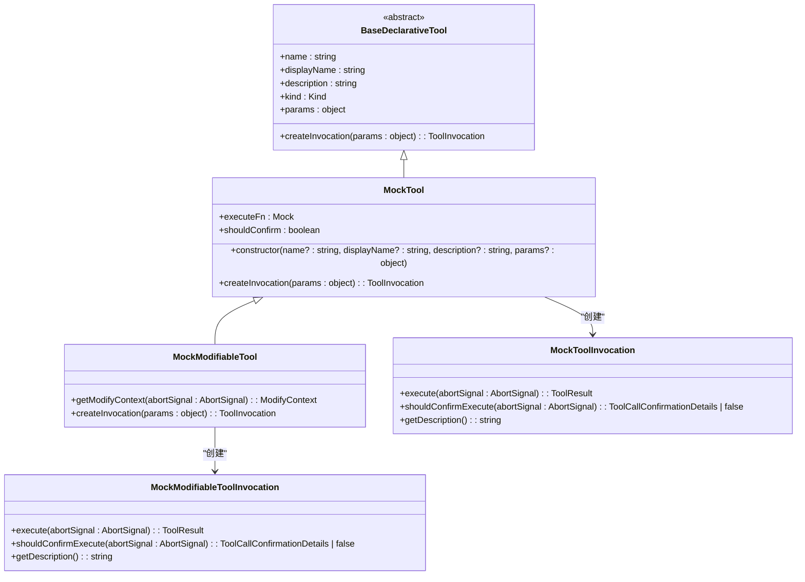
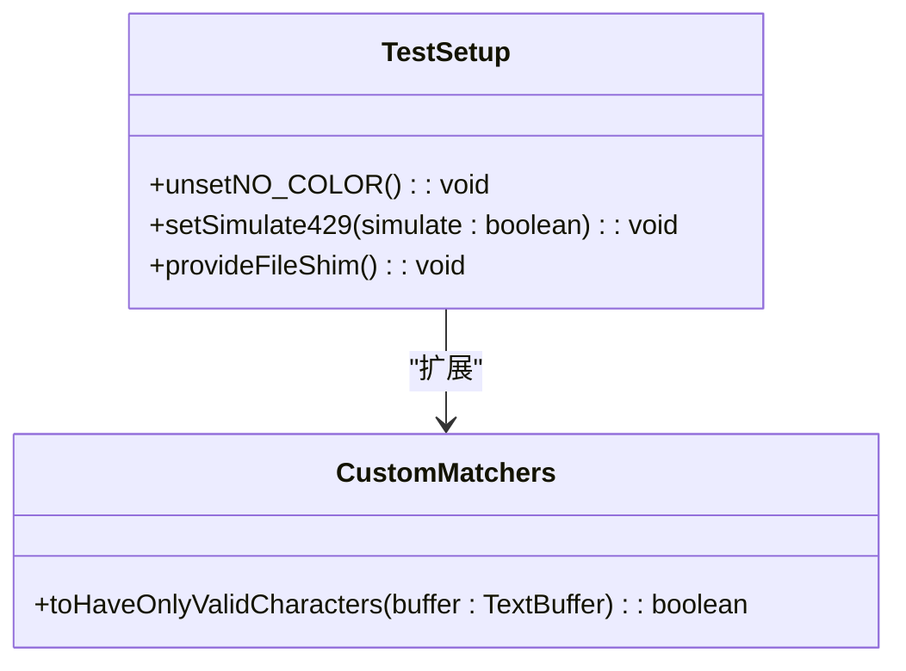
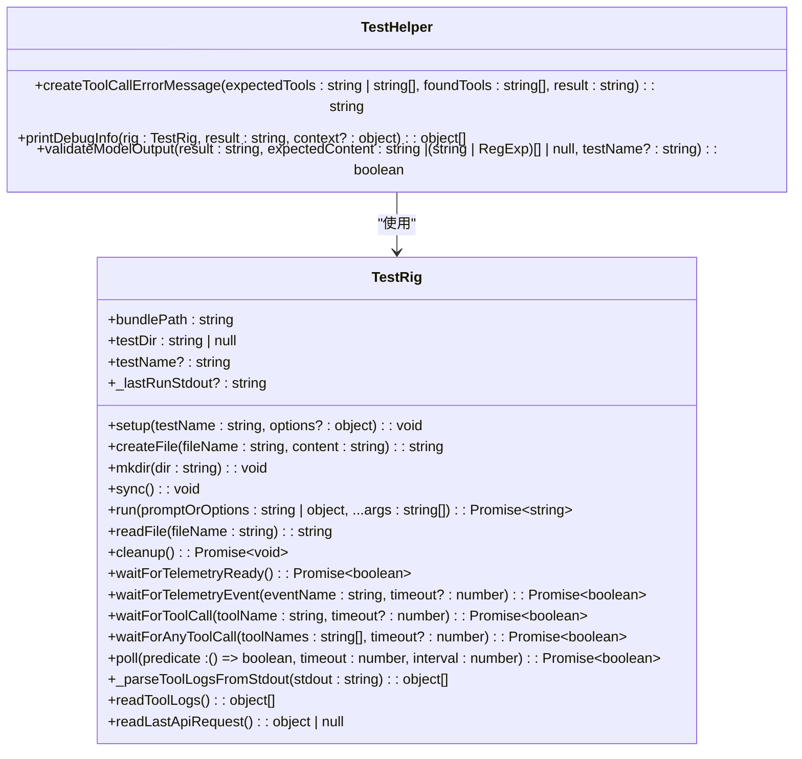

# 单元测试

<cite>
**本文档中引用的文件**  
- [config.ts](file://packages/core/src/config/config.ts)
- [config.test.ts](file://packages/core/src/config/config.test.ts)
- [test-setup.ts](file://packages/core/test-setup.ts)
- [config.test.ts](file://packages/cli/src/config/config.test.ts)
- [customMatchers.ts](file://packages/cli/src/test-utils/customMatchers.ts)
- [tools.ts](file://packages/core/src/test-utils/tools.ts)
- [mockWorkspaceContext.ts](file://packages/core/src/test-utils/mockWorkspaceContext.ts)
- [config.ts](file://packages/core/src/test-utils/config.ts)
- [vitest.config.ts](file://packages/core/vitest.config.ts)
- [vitest.config.ts](file://packages/cli/vitest.config.ts)
- [globalSetup.ts](file://integration-tests/globalSetup.ts)
- [test-helper.ts](file://integration-tests/test-helper.ts)
- [edit.test.ts](file://integration-tests/edit.test.ts)
</cite>

## 目录
1. [简介](#简介)
2. [Vitest框架配置](#vitest框架配置)
3. 核心测试辅助工具
   1. [测试配置工具](#测试配置工具)
   2. [工作区上下文模拟](#工作区上下文模拟)
   3. [工具模拟对象](#工具模拟对象)
4. [全局测试设置](#全局测试设置)
5. [集成测试模式](#集成测试模式)
6. [最佳实践](#最佳实践)

## 简介
Qwen Code项目采用Vitest框架进行单元测试，提供了一套完整的测试工具和配置。本文档深入介绍基于Vitest框架的单元测试实现方式，详细说明test-utils中提供的核心测试辅助工具，包括创建标准化测试配置实例、模拟工作区目录结构和路径验证逻辑、创建可编程的工具模拟对象等。同时，本文档还解释了测试设置文件的全局配置，包括模拟环境初始化和断言扩展，并提供编写高效单元测试的最佳实践。

## Vitest框架配置
Qwen Code项目在多个包中配置了Vitest测试框架，包括核心包、CLI包和集成测试包。每个包都有独立的`vitest.config.ts`文件，定义了测试环境、报告器、覆盖率等配置。

在核心包中，`vitest.config.ts`配置了测试报告器为`default`和`junit`，静默模式为`true`，并设置了测试文件输出路径。覆盖率配置启用了`v8`提供程序，报告目录为`./coverage`，并生成多种格式的报告，包括文本、HTML、JSON、lcov和cobertura。

```mermaid
config
classDiagram
class VitestConfig {
+reporters : string[]
+silent : boolean
+setupFiles : string[]
+outputFile : object
+coverage : object
}
class CoverageConfig {
+enabled : boolean
+provider : string
+reportsDirectory : string
+include : string[]
+reporter : array
}
VitestConfig --> CoverageConfig : "包含"
```

**Diagram sources**
- [vitest.config.ts](file://packages/core/vitest.config.ts#L0-L31)

**Section sources**
- [vitest.config.ts](file://packages/core/vitest.config.ts#L0-L31)
- [vitest.config.ts](file://packages/cli/vitest.config.ts#L0-L36)

## 核心测试辅助工具

### 测试配置工具
`test-utils`模块提供了`makeFakeConfig`和`DEFAULT_CONFIG_PARAMETERS`工具，用于创建标准化的测试配置实例。`DEFAULT_CONFIG_PARAMETERS`定义了默认的配置参数，包括使用统计信息启用、调试模式、会话ID、代理、模型、目标目录和当前工作目录。

`makeFakeConfig`函数接受一个可选的配置对象，该对象可以覆盖默认参数。它返回一个新的`Config`实例，该实例使用默认参数和提供的参数进行初始化。



**Diagram sources**
- [config.ts](file://packages/core/src/test-utils/config.ts#L0-L37)
- [config.ts](file://packages/core/src/config/config.ts#L0-L100)

**Section sources**
- [config.ts](file://packages/core/src/test-utils/config.ts#L0-L37)
- [config.test.ts](file://packages/core/src/config/config.test.ts#L0-L799)

### 工作区上下文模拟
`createMockWorkspaceContext`函数用于创建模拟的不同场景下的工作区目录结构和路径验证逻辑。它接受一个根目录和可选的附加目录列表，返回一个模拟的`WorkspaceContext`实例。

模拟的`WorkspaceContext`实例包含`addDirectory`、`getDirectories`和`isPathWithinWorkspace`方法。`getDirectories`方法返回所有目录的列表，包括根目录和附加目录。`isPathWithinWorkspace`方法检查给定路径是否在工作区目录内。



**Diagram sources**
- [mockWorkspaceContext.ts](file://packages/core/src/test-utils/mockWorkspaceContext.ts#L0-L33)

**Section sources**
- [mockWorkspaceContext.ts](file://packages/core/src/test-utils/mockWorkspaceContext.ts#L0-L33)

### 工具模拟对象
`test-utils`模块提供了`MockTool`和`MockModifiableTool`类，用于创建可编程的工具模拟对象，支持行为验证和执行确认测试。

`MockTool`类是一个高度可配置的模拟工具，用于测试目的。它继承自`BaseDeclarativeTool`，并重写了`createInvocation`方法以返回`MockToolInvocation`实例。`MockTool`实例包含`executeFn`和`shouldConfirm`属性，用于模拟工具执行和确认行为。

`MockModifiableTool`类继承自`MockTool`，并实现了`ModifiableDeclarativeTool`接口。它重写了`createInvocation`方法以返回`MockModifiableToolInvocation`实例，并提供了`getModifyContext`方法以返回修改上下文。



**Diagram sources**
- [tools.ts](file://packages/core/src/test-utils/tools.ts#L0-L169)

**Section sources**
- [tools.ts](file://packages/core/src/test-utils/tools.ts#L0-L169)

## 全局测试设置
`test-setup.ts`文件包含了全局测试设置，包括模拟环境初始化和断言扩展。在核心包中，`test-setup.ts`文件取消了`NO_COLOR`环境变量，以确保本地和CI测试运行之间的一致性主题行为。它还设置了模拟429状态码的全局标志为`false`，并为测试环境提供了最小的`File`构造函数shim。

在CLI包中，`test-setup.ts`文件同样取消了`NO_COLOR`环境变量，并导入了自定义匹配器。



**Diagram sources**
- [test-setup.ts](file://packages/core/test-setup.ts#L0-L21)
- [test-setup.ts](file://packages/cli/test-setup.ts#L0-L12)
- [customMatchers.ts](file://packages/cli/src/test-utils/customMatchers.ts#L0-L66)

**Section sources**
- [test-setup.ts](file://packages/core/test-setup.ts#L0-L21)
- [test-setup.ts](file://packages/cli/test-setup.ts#L0-L12)
- [customMatchers.ts](file://packages/cli/src/test-utils/customMatchers.ts#L0-L66)

## 集成测试模式
集成测试使用`TestRig`类来设置和运行测试。`TestRig`类提供了`setup`、`createFile`、`mkdir`、`run`、`readFile`、`cleanup`等方法，用于创建测试环境、运行测试和清理测试环境。

`TestRig`类还提供了`waitForToolCall`、`waitForAnyToolCall`、`waitForTelemetryEvent`等方法，用于等待工具调用、任何工具调用或遥测事件。这些方法使用轮询机制来检查工具调用或遥测事件是否发生。



**Diagram sources**
- [test-helper.ts](file://integration-tests/test-helper.ts#L0-L722)
- [edit.test.ts](file://integration-tests/edit.test.ts#L0-L64)

**Section sources**
- [test-helper.ts](file://integration-tests/test-helper.ts#L0-L722)
- [edit.test.ts](file://integration-tests/edit.test.ts#L0-L64)

## 最佳实践
编写高效单元测试的最佳实践包括：

1. **隔离依赖**：使用`vi.mock`来模拟依赖项，确保测试不依赖于外部系统或服务。
2. **验证异步行为**：使用`waitForToolCall`、`waitForAnyToolCall`等方法来验证异步行为。
3. **测试边缘情况**：编写测试用例来覆盖各种边缘情况，如无效输入、错误处理等。
4. **使用自定义匹配器**：使用自定义匹配器来简化断言，提高测试可读性。
5. **清理测试环境**：在测试完成后清理测试环境，避免测试之间的干扰。

通过遵循这些最佳实践，可以编写出高效、可靠的单元测试，确保代码质量和稳定性。

**Section sources**
- [config.test.ts](file://packages/core/src/config/config.test.ts#L0-L799)
- [config.test.ts](file://packages/cli/src/config/config.test.ts#L0-L799)
- [edit.test.ts](file://integration-tests/edit.test.ts#L0-L64)