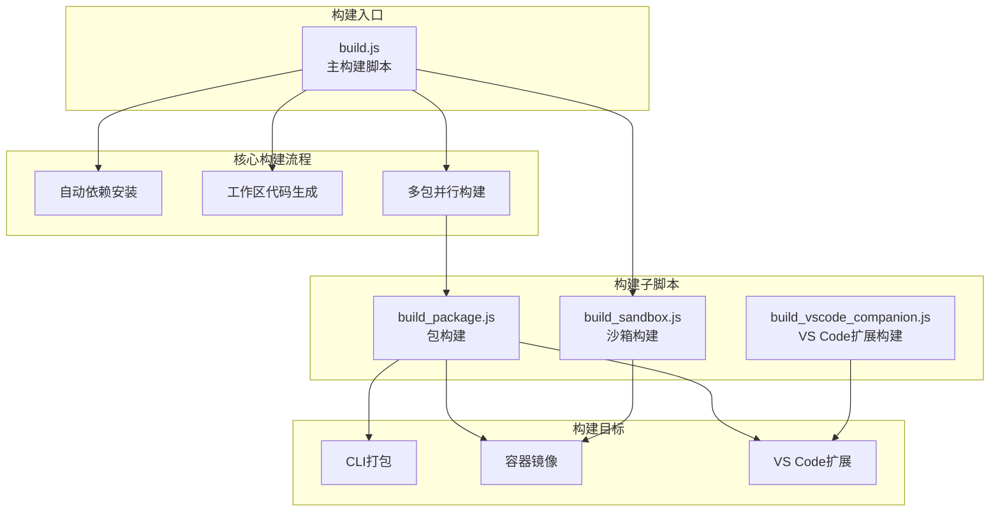
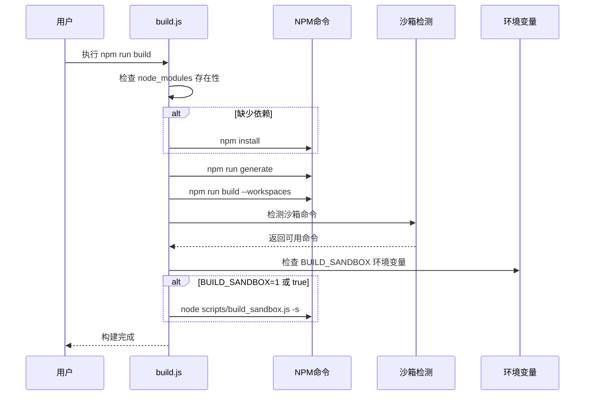
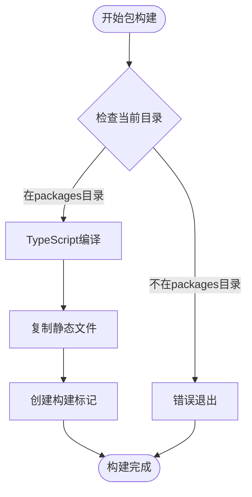
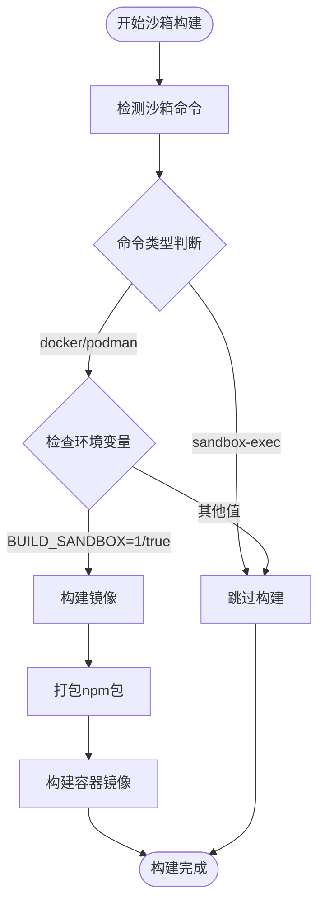
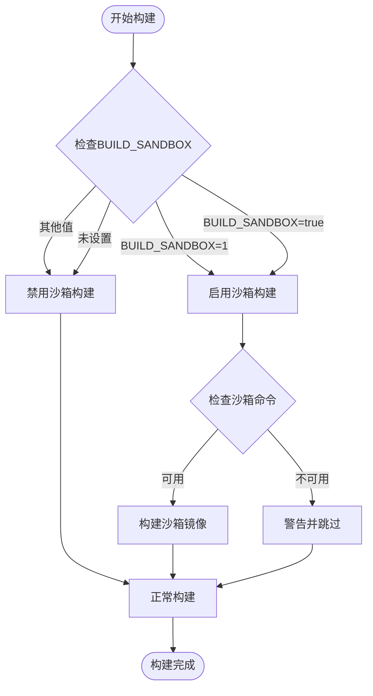
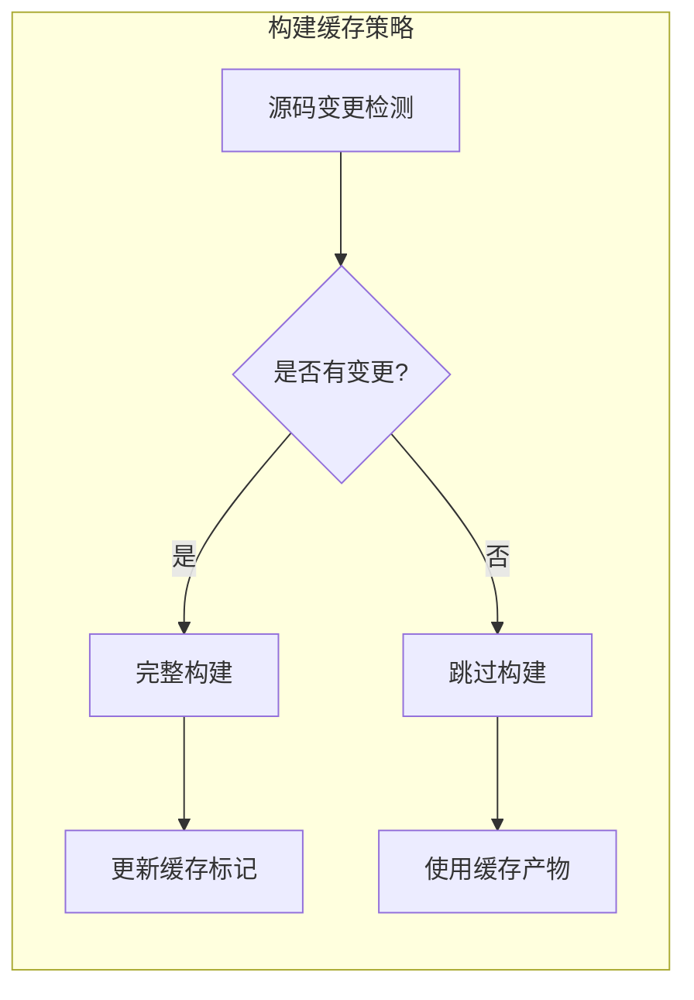
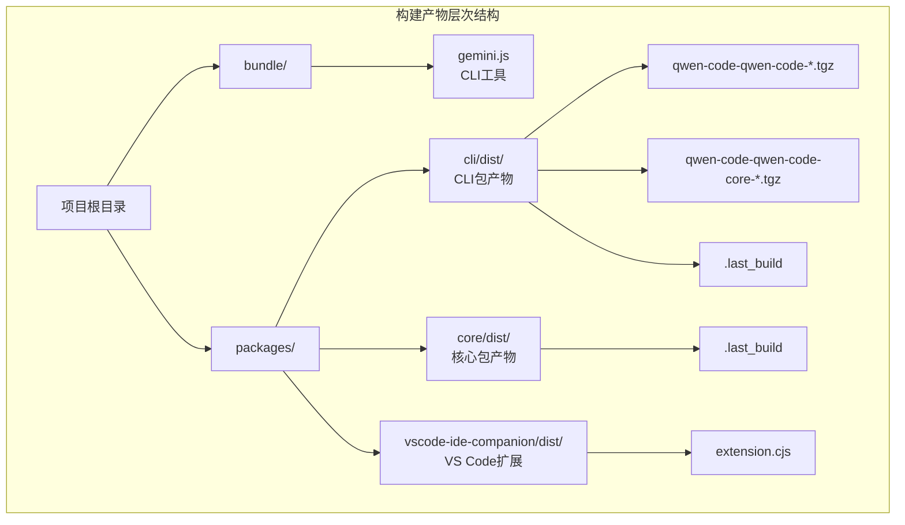

# Qwen Code项目构建流程详细分析

<cite>
**本文档中引用的文件**
- [scripts/build.js](file://scripts/build.js)
- [scripts/build_package.js](file://scripts/build_package.js)
- [scripts/build_sandbox.js](file://scripts/build_sandbox.js)
- [scripts/build_vscode_companion.js](file://scripts/build_vscode_companion.js)
- [esbuild.config.js](file://esbuild.config.js)
- [package.json](file://package.json)
- [packages/cli/package.json](file://packages/cli/package.json)
- [packages/core/package.json](file://packages/core/package.json)
- [packages/vscode-ide-companion/package.json](file://packages/vscode-ide-companion/package.json)
</cite>

## 目录
1. [项目概述](#项目概述)
2. [构建系统架构](#构建系统架构)
3. [主构建脚本分析](#主构建脚本分析)
4. [构建子脚本详解](#构建子脚本详解)
5. [环境变量控制机制](#环境变量控制机制)
6. [构建配置与优化](#构建配置与优化)
7. [输出产物结构](#输出产物结构)
8. [自定义构建配置](#自定义构建配置)
9. [构建最佳实践](#构建最佳实践)
10. [故障排除指南](#故障排除指南)

## 项目概述

Qwen Code是一个基于TypeScript的现代化代码助手项目，采用Monorepo架构管理多个相关包。项目使用Node.js生态系统进行构建，支持多种构建目标，包括CLI工具、沙箱容器镜像和VS Code扩展程序。

项目的核心特点：
- **多包架构**：包含CLI、核心库、VS Code扩展等独立包
- **模块化构建**：每个包都有独立的构建流程
- **容器化支持**：可选的沙箱容器镜像构建
- **灵活配置**：支持多种构建场景和自定义配置

## 构建系统架构



**图表来源**
- [scripts/build.js](file://scripts/build.js#L1-L56)
- [scripts/build_package.js](file://scripts/build_package.js#L1-L38)
- [scripts/build_sandbox.js](file://scripts/build_sandbox.js#L1-L203)
- [scripts/build_vscode_companion.js](file://scripts/build_vscode_companion.js#L1-L31)

## 主构建脚本分析

### build.js 核心执行逻辑

主构建脚本`scripts/build.js`是整个构建系统的入口点，负责协调所有构建步骤：

```javascript
// 自动依赖检查和安装
if (!existsSync(join(root, 'node_modules'))) {
  execSync('npm install', { stdio: 'inherit', cwd: root });
}

// 工作区代码生成
execSync('npm run generate', { stdio: 'inherit', cwd: root });

// 多包并行构建
execSync('npm run build --workspaces', { stdio: 'inherit', cwd: root });

// 沙箱容器镜像条件性构建
try {
  execSync('node scripts/sandbox_command.js -q', {
    stdio: 'inherit',
    cwd: root,
  });
  if (
    process.env.BUILD_SANDBOX === '1' ||
    process.env.BUILD_SANDBOX === 'true'
  ) {
    execSync('node scripts/build_sandbox.js -s', {
      stdio: 'inherit',
      cwd: root,
    });
  }
} catch {
  // 忽略异常
}
```

### 构建流程时序图



**图表来源**
- [scripts/build.js](file://scripts/build.js#L25-L56)

**章节来源**
- [scripts/build.js](file://scripts/build.js#L1-L56)

## 构建子脚本详解

### 包构建脚本 (build_package.js)

`build_package.js`负责单个包的标准构建流程，适用于CLI和核心库包：

```javascript
// TypeScript编译
execSync('tsc --build', { stdio: 'inherit' });

// 文件复制
execSync('node ../../scripts/copy_files.js', { stdio: 'inherit' });

// 标记构建完成
writeFileSync(join(process.cwd(), 'dist', '.last_build'), '');
```

#### 构建流程分解



**图表来源**
- [scripts/build_package.js](file://scripts/build_package.js#L20-L38)

### 沙箱构建脚本 (build_sandbox.js)

`build_sandbox.js`专门处理容器镜像的构建，支持多种容器运行时：

```javascript
// 检测可用的沙箱命令
let sandboxCommand;
try {
  sandboxCommand = execSync('node scripts/sandbox_command.js')
    .toString()
    .trim();
} catch (e) {
  console.error('无法检测沙箱容器命令');
  process.exit(1);
}

// 条件性构建
if (sandboxCommand !== 'sandbox-exec') {
  // 打包npm包
  execSync('npm pack -w @qwen-code/qwen-code', {
    stdio: 'ignore',
  });
  
  // 构建Docker镜像
  buildImage(imageName, dockerfile);
}
```

#### 沙箱构建决策流程



**图表来源**
- [scripts/build_sandbox.js](file://scripts/build_sandbox.js#L40-L80)

### VS Code扩展构建脚本 (build_vscode_companion.js)

VS Code扩展的构建相对简单，主要使用vsce工具打包：

```javascript
execSync('npx --yes @vscode/vsce package --no-dependencies', {
  stdio: 'inherit',
  cwd: join(root, 'packages', 'vscode-ide-companion'),
});
```

**章节来源**
- [scripts/build_package.js](file://scripts/build_package.js#L1-L38)
- [scripts/build_sandbox.js](file://scripts/build_sandbox.js#L1-L203)
- [scripts/build_vscode_companion.js](file://scripts/build_vscode_companion.js#L1-L31)

## 环境变量控制机制

### 核心环境变量

项目通过环境变量控制系统行为，主要变量包括：

1. **BUILD_SANDBOX**: 控制是否构建沙箱容器镜像
   - `BUILD_SANDBOX=1` 或 `BUILD_SANDBOX=true`: 启用沙箱构建
   - 其他值或未设置: 跳过沙箱构建

2. **GEMINI_SANDBOX_IMAGE_TAG**: 自定义镜像标签

3. **BUILD_SANDBOX_FLAGS**: 传递给容器构建工具的额外标志

4. **VERBOSE**: 控制构建输出的详细程度

### 环境变量使用示例

```bash
# 构建完整版本（包含沙箱镜像）
export BUILD_SANDBOX=true
npm run build

# 只构建基础版本
npm run build

# 使用自定义镜像标签
export GEMINI_SANDBOX_IMAGE_TAG=my-tag
npm run build:sandbox
```

### 环境变量控制流程



**图表来源**
- [scripts/build.js](file://scripts/build.js#L40-L50)

**章节来源**
- [scripts/build.js](file://scripts/build.js#L40-L50)

## 构建配置与优化

### esbuild 配置分析

项目使用esbuild进行CLI工具的最终打包，配置文件位于`esbuild.config.js`：

```javascript
esbuild.build({
  entryPoints: ['packages/cli/index.ts'],
  bundle: true,
  outfile: 'bundle/gemini.js',
  platform: 'node',
  format: 'esm',
  external: [
    '@lydell/node-pty',
    'node-pty',
    '@lydell/node-pty-darwin-arm64',
    '@lydell/node-pty-darwin-x64',
    // ... 其他外部依赖
  ],
  alias: {
    'is-in-ci': path.resolve(__dirname, 'packages/cli/src/patches/is-in-ci.ts'),
  },
  define: {
    'process.env.CLI_VERSION': JSON.stringify(pkg.version),
  },
  banner: {
    js: `import { createRequire } from 'module'; ...`,
  },
  loader: { '.node': 'file' },
})
```

### 构建性能优化策略

1. **并行构建**: 使用`npm run build --workspaces`实现多包并行构建
2. **增量构建**: 通过`.last_build`标记实现增量构建检测
3. **外部依赖**: 将大型依赖标记为external以减少打包体积
4. **条件构建**: 基于环境变量的条件性构建避免不必要的操作

### 构建缓存机制



**章节来源**
- [esbuild.config.js](file://esbuild.config.js#L1-L48)

## 输出产物结构

### 标准构建产物

项目构建后会生成以下主要产物：

```
qwen-code/
├── bundle/
│   └── gemini.js           # CLI工具打包文件
├── packages/
│   ├── cli/
│   │   └── dist/
│   │       ├── index.js    # CLI主文件
│   │       ├── index.d.ts  # 类型声明
│   │       └── .last_build # 构建标记
│   ├── core/
│   │   └── dist/
│   │       ├── index.js    # 核心库文件
│   │       ├── index.d.ts  # 类型声明
│   │       └── .last_build # 构建标记
│   └── vscode-ide-companion/
│       └── dist/
│           └── extension.cjs # VS Code扩展文件
└── packages/cli/dist/
    ├── qwen-code-qwen-code-*.tgz      # CLI包
    └── qwen-code-qwen-code-core-*.tgz # 核心包
```

### 容器镜像产物

当启用沙箱构建时，会在以下位置生成容器镜像：

- 默认镜像: `ghcr.io/qwenlm/qwen-code:0.0.14`
- 自定义镜像: 根据`--image`参数指定的名称

### VS Code扩展产物

VS Code扩展打包后生成：

- `packages/vscode-ide-companion/qwen-code-vscode-ide-companion-0.0.14.vsix`

### 构建产物组织结构



**图表来源**
- [package.json](file://package.json#L70-L75)
- [packages/cli/package.json](file://packages/cli/package.json#L15-L17)

**章节来源**
- [package.json](file://package.json#L70-L75)
- [packages/cli/package.json](file://packages/cli/package.json#L15-L17)
- [packages/core/package.json](file://packages/core/package.json#L15-L17)
- [packages/vscode-ide-companion/package.json](file://packages/vscode-ide-companion/package.json#L60-L62)

## 自定义构建配置

### esbuild 配置扩展

开发者可以通过修改`esbuild.config.js`来自定义构建行为：

```javascript
// 添加新的外部依赖
external: [
  '@lydell/node-pty',
  'node-pty',
  // 新增依赖
  'new-external-package',
],

// 添加新的别名
alias: {
  'is-in-ci': path.resolve(__dirname, 'packages/cli/src/patches/is-in-ci.ts'),
  // 新增别名
  'custom-module': path.resolve(__dirname, 'src/custom/module.ts'),
},

// 添加新的全局定义
define: {
  'process.env.CLI_VERSION': JSON.stringify(pkg.version),
  // 新增定义
  'process.env.CUSTOM_FLAG': JSON.stringify('value'),
},
```

### 构建脚本扩展

可以创建自定义的构建脚本来满足特定需求：

```javascript
// scripts/build_custom.js
import { execSync } from 'node:child_process';

// 自定义构建逻辑
console.log('执行自定义构建步骤...');
execSync('npm run custom-lint', { stdio: 'inherit' });
execSync('npm run custom-test', { stdio: 'inherit' });

// 调用标准构建流程
execSync('node scripts/build_package.js', { stdio: 'inherit' });
```

### 多环境构建配置

```javascript
// scripts/build_production.js
process.env.NODE_ENV = 'production';
process.env.BUILD_SANDBOX = 'true';

execSync('node scripts/build.js', { stdio: 'inherit' });
```

## 构建最佳实践

### 开发环境构建

```bash
# 清理旧构建
npm run clean

# 安装依赖
npm ci

# 运行预构建检查
npm run preflight

# 开发模式构建
npm run build
```

### 生产环境构建

```bash
# 设置生产环境变量
export NODE_ENV=production
export BUILD_SANDBOX=true

# 执行完整构建
npm run build:all

# 或者单独构建各部分
npm run build
npm run build:sandbox
npm run build:vscode
```

### CI/CD 构建配置

```yaml
# GitHub Actions 示例
- name: 构建 Qwen Code
  env:
    BUILD_SANDBOX: true
    GEMINI_SANDBOX_IMAGE_TAG: ${{ github.ref_name }}
  run: |
    npm run build:all
    # 上传构建产物
    tar -czf qwen-code-build.tar.gz bundle/ packages/
```

### 性能优化建议

1. **使用并行构建**: 利用`--workspaces`参数实现多包并行构建
2. **增量构建**: 通过`.last_build`标记避免重复构建
3. **缓存策略**: 合理利用npm缓存和构建缓存
4. **条件构建**: 根据实际需要启用或禁用沙箱构建

## 故障排除指南

### 常见构建问题

#### 1. 依赖缺失问题

**症状**: 构建过程中出现`Cannot find module`错误

**解决方案**:
```bash
# 清理并重新安装依赖
npm run clean
npm install

# 或者只清理node_modules
rm -rf node_modules
npm install
```

#### 2. TypeScript编译错误

**症状**: TypeScript编译失败，显示类型错误

**解决方案**:
```bash
# 检查类型错误
npm run typecheck

# 修复类型错误后重新构建
npm run build
```

#### 3. 沙箱构建失败

**症状**: 沙箱容器构建失败

**诊断步骤**:
```bash
# 检查沙箱命令可用性
node scripts/sandbox_command.js

# 检查Docker/Podman状态
docker --version
podman --version

# 查看详细错误日志
VERBOSE=true npm run build:sandbox
```

#### 4. 权限问题

**症状**: 构建过程中出现权限错误

**解决方案**:
```bash
# 修复文件权限
chmod +x scripts/*.js
chmod +x packages/*/scripts/*.js

# 在Windows上可能需要管理员权限
# 使用PowerShell以管理员身份运行
```

### 调试构建过程

```bash
# 启用详细输出
VERBOSE=true npm run build

# 单独调试某个包
cd packages/cli
npm run build

# 检查构建状态
node scripts/check-build-status.js
```

### 构建监控和日志

```javascript
// scripts/monitor-build.js
import { execSync } from 'node:child_process';

function monitorBuild(step, command) {
  console.log(`[${new Date().toISOString()}] 开始 ${step}`);
  try {
    execSync(command, { stdio: 'inherit' });
    console.log(`[${new Date().toISOString()}] ${step} 成功`);
  } catch (error) {
    console.error(`[${new Date().toISOString()}] ${step} 失败`);
    throw error;
  }
}

// 使用示例
monitorBuild('依赖安装', 'npm install');
monitorBuild('代码生成', 'npm run generate');
monitorBuild('包构建', 'npm run build --workspaces');
```

**章节来源**
- [scripts/build.js](file://scripts/build.js#L25-L35)
- [scripts/build_sandbox.js](file://scripts/build_sandbox.js#L40-L50)

## 总结

Qwen Code项目的构建系统设计精良，具有以下特点：

1. **模块化设计**: 每个包都有独立的构建脚本，便于维护和扩展
2. **灵活性强**: 支持多种构建目标和环境配置
3. **性能优化**: 通过并行构建、增量构建等策略提升构建效率
4. **容器化支持**: 完整的沙箱容器镜像构建流程
5. **易于扩展**: 提供清晰的扩展接口和自定义配置选项

开发者可以根据具体需求选择合适的构建方式，从简单的开发构建到完整的生产发布，都能得到良好的支持。通过合理使用环境变量和自定义配置，可以满足各种复杂的构建场景需求。