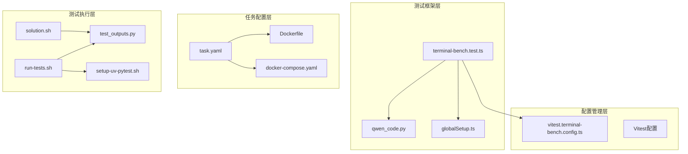
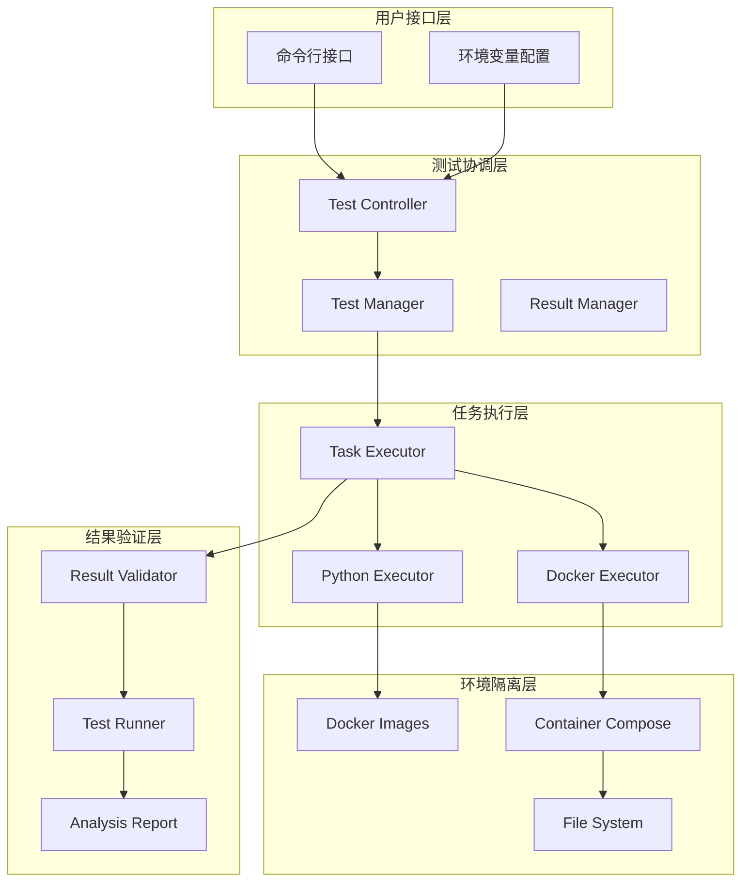
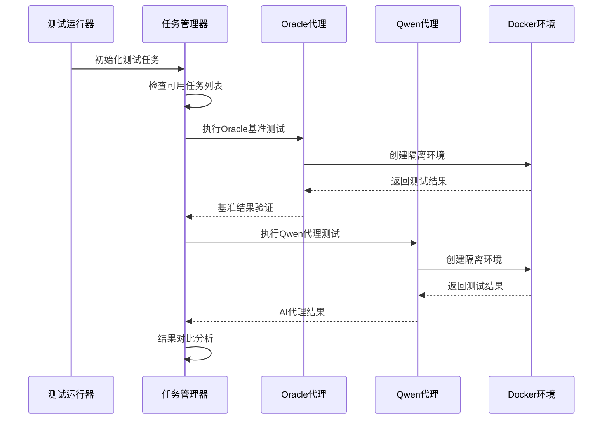
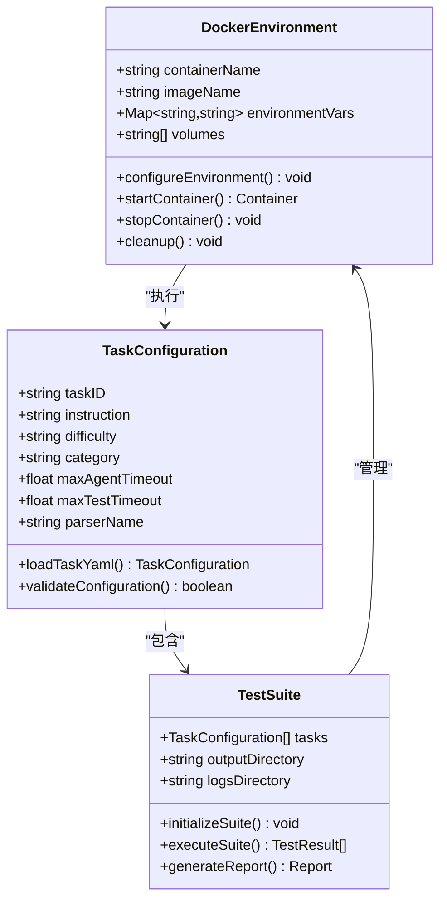
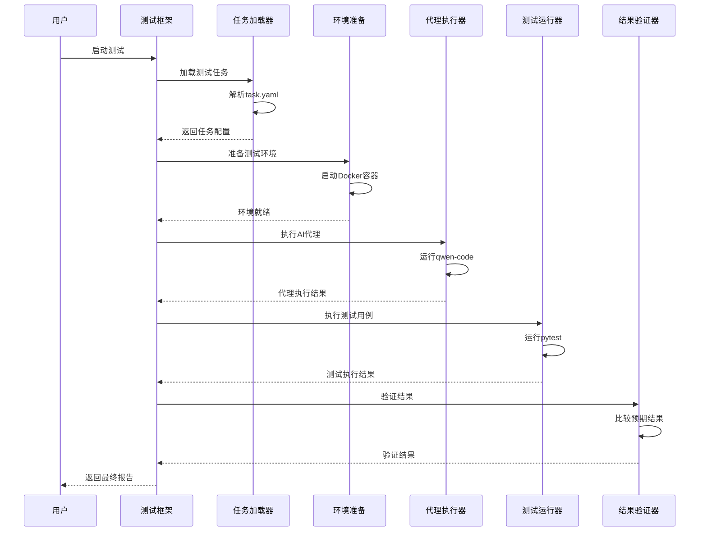

# 终端基准测试系统架构与执行机制

<cite>
**本文档中引用的文件**
- [terminal-bench.test.ts](file://integration-tests/terminal-bench/terminal-bench.test.ts)
- [qwen_code.py](file://integration-tests/terminal-bench/qwen_code.py)
- [task.yaml](file://integration-tests/terminal-bench/ci-tasks/hello-world/task.yaml)
- [Dockerfile](file://integration-tests/terminal-bench/ci-tasks/hello-world/Dockerfile)
- [docker-compose.yaml](file://integration-tests/terminal-bench/ci-tasks/hello-world/docker-compose.yaml)
- [run-tests.sh](file://integration-tests/terminal-bench/ci-tasks/hello-world/run-tests.sh)
- [solution.sh](file://integration-tests/terminal-bench/ci-tasks/hello-world/solution.sh)
- [test_outputs.py](file://integration-tests/terminal-bench/ci-tasks/hello-world/tests/test_outputs.py)
- [setup-uv-pytest.sh](file://integration-tests/terminal-bench/ci-tasks/hello-world/tests/setup-uv-pytest.sh)
- [globalSetup.ts](file://integration-tests/globalSetup.ts)
- [vitest.terminal-bench.config.ts](file://integration-tests/vitest.terminal-bench.config.ts)
</cite>

## 目录
1. [简介](#简介)
2. [项目结构概览](#项目结构概览)
3. [核心组件分析](#核心组件分析)
4. [架构设计](#架构设计)
5. [详细组件分析](#详细组件分析)
6. [测试任务配置](#测试任务配置)
7. [环境隔离机制](#环境隔离机制)
8. [执行流程分析](#执行流程分析)
9. [性能考量](#性能考量)
10. [故障排除指南](#故障排除指南)
11. [结论](#结论)

## 简介

终端基准测试（Terminal Bench）是一个专门用于评估AI模型在真实开发场景中表现的综合测试框架。该系统通过模拟真实的软件工程任务，为Qwen Code等AI工具提供了一套完整的评估体系。系统的核心目标是：

- **真实场景测试**：通过模拟实际的软件开发任务，评估AI模型在复杂开发环境中的表现
- **标准化评估**：提供统一的任务定义、执行和验证标准
- **环境隔离**：确保测试的一致性和可重复性
- **多维度评估**：从准确性、效率、稳定性等多个维度全面评估AI模型能力

## 项目结构概览

终端基准测试系统的文件组织遵循清晰的层次结构，每个组件都有明确的职责分工：



**图表来源**
- [terminal-bench.test.ts](file://integration-tests/terminal-bench/terminal-bench.test.ts#L1-L329)
- [qwen_code.py](file://integration-tests/terminal-bench/qwen_code.py#L1-L70)
- [globalSetup.ts](file://integration-tests/globalSetup.ts#L1-L101)

**章节来源**
- [terminal-bench.test.ts](file://integration-tests/terminal-bench/terminal-bench.test.ts#L1-L50)
- [qwen_code.py](file://integration-tests/terminal-bench/qwen_code.py#L1-L30)

## 核心组件分析

### 主测试控制器（terminal-bench.test.ts）

主测试控制器是整个基准测试系统的核心协调器，负责管理测试生命周期、任务调度和结果验证。

```typescript
// 测试配置和环境准备
const DEFAULT_TIMEOUT_MINUTES = Number(
  process.env['TB_TIMEOUT_MINUTES'] || '30',
);
const DEFAULT_TIMEOUT_MS = DEFAULT_TIMEOUT_MINUTES * 60 * 1000;

// 动态任务选择机制
const envTaskId = process.env['TB_TASK_ID'];
const envTaskIds = process.env['TB_TASK_IDS'];

let testTasks = [...baseTestTasks];
if (envTaskId || envTaskIds) {
  // 实现灵活的任务选择功能
}
```

该组件实现了以下关键功能：
- **动态任务管理**：支持通过环境变量选择特定测试任务
- **超时控制**：提供灵活的超时配置机制
- **环境检测**：自动检测并安装必要的依赖工具
- **结果验证**：实现标准化的结果验证逻辑

### Python代理适配器（qwen_code.py）

Python代理适配器作为TypeScript测试框架与Python终端基准测试工具之间的桥梁，提供了无缝的集成体验。

```python
class QwenCodeAgent(AbstractInstalledAgent):
    @staticmethod
    def name() -> str:
        return "Qwen Code"
    
    def __init__(self, model_name: str | None = None, *args, **kwargs):
        super().__init__(*args, **kwargs)
        self._model_name = model_name
        self._version = kwargs.get("version", "latest")
        
        # 配置化API设置
        self._api_key = kwargs.get("api_key")
        self._base_url = kwargs.get("base_url")
```

**章节来源**
- [terminal-bench.test.ts](file://integration-tests/terminal-bench/terminal-bench.test.ts#L25-L80)
- [qwen_code.py](file://integration-tests/terminal-bench/qwen_code.py#L10-L40)

## 架构设计

终端基准测试系统采用分层架构设计，确保了模块化、可扩展性和维护性：



**图表来源**
- [terminal-bench.test.ts](file://integration-tests/terminal-bench/terminal-bench.test.ts#L100-L200)
- [qwen_code.py](file://integration-tests/terminal-bench/qwen_code.py#L20-L60)

## 详细组件分析

### 测试任务管理器

测试任务管理器负责协调不同类型测试任务的执行，包括基础文件操作任务和复杂的软件工程任务。



**图表来源**
- [terminal-bench.test.ts](file://integration-tests/terminal-bench/terminal-bench.test.ts#L120-L280)

### 环境配置管理器

环境配置管理器确保所有测试都在一致且可控的环境中执行，通过Docker容器提供完全隔离的测试环境。



**图表来源**
- [Dockerfile](file://integration-tests/terminal-bench/ci-tasks/hello-world/Dockerfile#L1-L2)
- [docker-compose.yaml](file://integration-tests/terminal-bench/ci-tasks/hello-world/docker-compose.yaml#L1-L13)
- [task.yaml](file://integration-tests/terminal-bench/ci-tasks/hello-world/task.yaml#L1-L16)

**章节来源**
- [terminal-bench.test.ts](file://integration-tests/terminal-bench/terminal-bench.test.ts#L80-L150)
- [qwen_code.py](file://integration-tests/terminal-bench/qwen_code.py#L40-L70)

## 测试任务配置

### task.yaml文件格式详解

task.yaml文件是测试任务的核心配置文件，定义了任务的完整描述和执行参数：

```yaml
instruction: |-
  Create a file called hello.txt in the current directory. Write "Hello, world!" to it.
author_name: Alex Shaw
author_email: alexgshaw64@gmail.com
difficulty: easy
category: file-operations
tags:
  - file-operations
parser_name: pytest
max_agent_timeout_sec: 360.0
max_test_timeout_sec: 60.0
run_tests_in_same_shell: false
```

关键配置项说明：
- **instruction**：详细的任务描述，指导AI模型完成具体任务
- **difficulty**：任务难度级别（easy/hard）
- **category**：任务分类（file-operations, debugging等）
- **max_agent_timeout_sec**：AI代理的最大执行时间
- **max_test_timeout_sec**：测试执行的最大时间
- **parser_name**：测试解析器类型（pytest等）

### 复杂任务示例

对于更复杂的软件工程任务，配置更加详细：

```yaml
instruction: |-
  Modeling's `separability_matrix` does not compute separability correctly for nested CompoundModels...
difficulty: hard
category: debugging
tags:
  - debugging
  - swe-bench
max_agent_timeout_sec: 1000.0
max_test_timeout_sec: 600.0
```

**章节来源**
- [task.yaml](file://integration-tests/terminal-bench/ci-tasks/hello-world/task.yaml#L1-L16)
- [task.yaml](file://integration-tests/terminal-bench/ci-tasks/swe-bench-astropy-1/task.yaml#L1-L56)

## 环境隔离机制

### Docker容器化环境

系统使用Docker容器提供完全隔离的测试环境，确保测试的一致性和可重复性：

```dockerfile
FROM ghcr.io/laude-institute/t-bench/python-3-13:20250620
```

Docker Compose配置确保容器正确挂载和配置：

```yaml
services:
  client:
    build:
      dockerfile: Dockerfile
    image: ${T_BENCH_TASK_DOCKER_CLIENT_IMAGE_NAME}
    container_name: ${T_BENCH_TASK_DOCKER_CLIENT_CONTAINER_NAME}
    command: ['sh', '-c', 'sleep infinity']
    environment:
      - TEST_DIR=${T_BENCH_TEST_DIR}
    volumes:
      - ${T_BENCH_TASK_LOGS_PATH}:${T_BENCH_CONTAINER_LOGS_PATH}
      - ${T_BENCH_TASK_AGENT_LOGS_PATH}:${T_BENCH_CONTAINER_AGENT_LOGS_PATH}
```

### 自动化环境准备

系统包含完整的自动化环境准备脚本：

```bash
#!/bin/bash

# 安装curl
apt-get update
apt-get install -y curl

# 安装uv包管理器
curl -LsSf https://astral.sh/uv/0.7.13/install.sh | sh

# 初始化Python项目
uv init
uv add pytest==8.4.1
```

**章节来源**
- [Dockerfile](file://integration-tests/terminal-bench/ci-tasks/hello-world/Dockerfile#L1-L2)
- [docker-compose.yaml](file://integration-tests/terminal-bench/ci-tasks/hello-world/docker-compose.yaml#L1-L13)
- [setup-uv-pytest.sh](file://integration-tests/terminal-bench/ci-tasks/hello-world/tests/setup-uv-pytest.sh#L1-L20)

## 执行流程分析

### 任务执行序列图



**图表来源**
- [terminal-bench.test.ts](file://integration-tests/terminal-bench/terminal-bench.test.ts#L150-L280)

### 结果验证机制

系统实现了多层次的结果验证机制：

```typescript
// Oracle代理验证 - 确保基准准确率为100%
expect(results.accuracy).toBe(1.0);
expect(results.n_resolved).toBe(1);
expect(results.n_unresolved).toBe(0);

// Qwen代理验证 - 确保至少有一个任务被解决
expect(results.n_resolved).toBeGreaterThan(0);
expect(results.accuracy).toBeGreaterThan(0);
```

### 错误处理和恢复

系统包含完善的错误处理机制：

```typescript
// 超时处理
setTimeout(() => {
  child.kill();
  reject(new Error(`Process timeout for ${taskId}`));
}, Math.max(60_000, DEFAULT_TIMEOUT_MS - 60_000));

// 错误捕获
.catch((error) => {
  if (error instanceof Error && error.message?.includes('API')) {
    console.warn('API configuration issue - skipping test');
    return '';
  }
  throw error;
});
```

**章节来源**
- [terminal-bench.test.ts](file://integration-tests/terminal-bench/terminal-bench.test.ts#L180-L250)

## 性能考量

### 并发控制策略

系统采用谨慎的并发控制策略，避免资源竞争和环境冲突：

```typescript
// 禁用文件级并行执行
fileParallelism: false,

// 单线程任务执行
n_concurrent: '1',

// 独立的测试目录
const outputBase = join(baseRunDir, 'terminal-bench-output');
```

### 资源优化

- **内存管理**：及时清理临时文件和容器
- **网络优化**：缓存Docker镜像和依赖
- **存储优化**：智能清理旧的测试输出

### 扩展性设计

系统支持动态任务选择和扩展：

```typescript
// 支持多个测试任务
const baseTestTasks = ['hello-world', 'swe-bench-astropy-1'] as const;

// 环境变量控制
const envTaskId = process.env['TB_TASK_ID'];
const envTaskIds = process.env['TB_TASK_IDS'];
```

## 故障排除指南

### 常见问题诊断

1. **终端基准测试安装失败**
   - 检查uv工具是否正确安装
   - 验证Python 3.12环境
   - 确认网络连接正常

2. **API密钥配置问题**
   - 设置OPENAI_API_KEY环境变量
   - 验证API密钥有效性
   - 检查网络访问权限

3. **Docker容器启动失败**
   - 检查Docker服务状态
   - 验证镜像下载权限
   - 查看容器日志信息

### 调试模式启用

```bash
# 启用详细输出
export VERBOSE=true

# 保留输出文件用于调试
export KEEP_OUTPUT=true

# 设置自定义超时时间
export TB_TIMEOUT_MINUTES=60
```

### 日志分析

系统会生成详细的测试日志：

```typescript
// 输出目录位置
console.log(`\nTerminal-bench test output directory: ${outputBase}`);

// 详细错误信息
console.error(`oracle agent failed for ${taskId} with stderr:`, stderr);
```

**章节来源**
- [terminal-bench.test.ts](file://integration-tests/terminal-bench/terminal-bench.test.ts#L40-L80)
- [globalSetup.ts](file://integration-tests/globalSetup.ts#L40-L80)

## 结论

终端基准测试系统是一个功能完善、设计精良的AI模型评估框架。它通过以下关键特性确保了高质量的测试体验：

### 核心优势

1. **完整的测试生态系统**：从任务定义到结果验证的全流程覆盖
2. **强大的环境隔离**：Docker容器确保测试的一致性和可重复性
3. **灵活的配置机制**：支持多种测试场景和自定义需求
4. **可靠的错误处理**：完善的异常处理和恢复机制
5. **高效的性能优化**：合理的并发控制和资源管理

### 应用价值

该系统为AI模型在真实开发场景中的评估提供了标准化的解决方案，特别适用于：

- **AI模型性能评估**：量化AI工具在不同任务类型上的表现
- **质量保证**：确保AI工具在生产环境中的可靠性
- **持续集成**：集成到CI/CD流水线中进行自动化测试
- **研究验证**：为AI算法改进提供客观的评估基准

### 未来发展方向

- **更多任务类型**：扩展支持更广泛的软件工程任务
- **增强的可视化**：提供更直观的测试结果展示
- **分布式执行**：支持大规模并行测试执行
- **智能化分析**：自动识别测试失败的根本原因

通过这个系统，开发者可以全面了解AI模型在真实开发场景中的表现，为模型优化和应用部署提供重要参考。