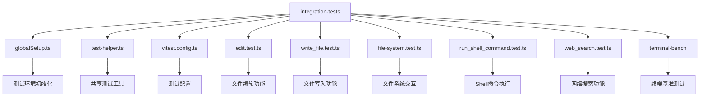
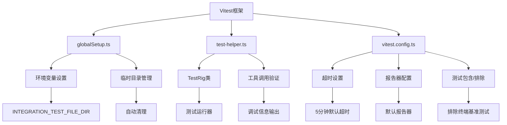
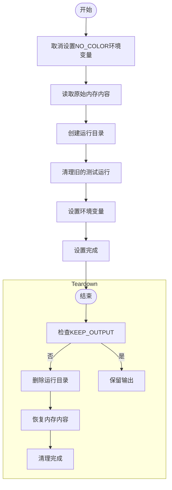
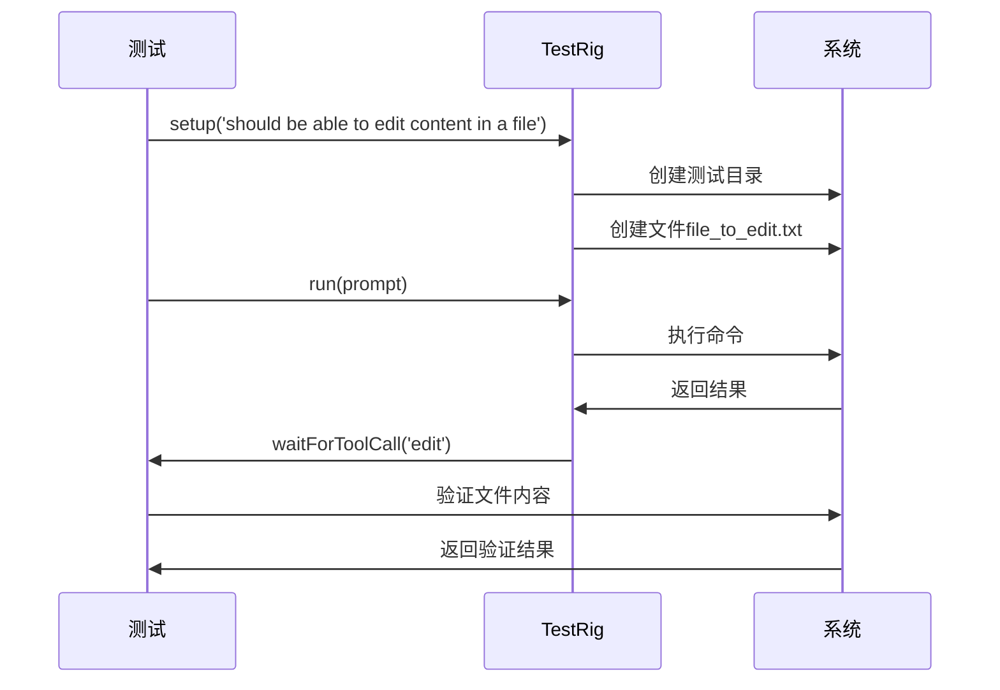
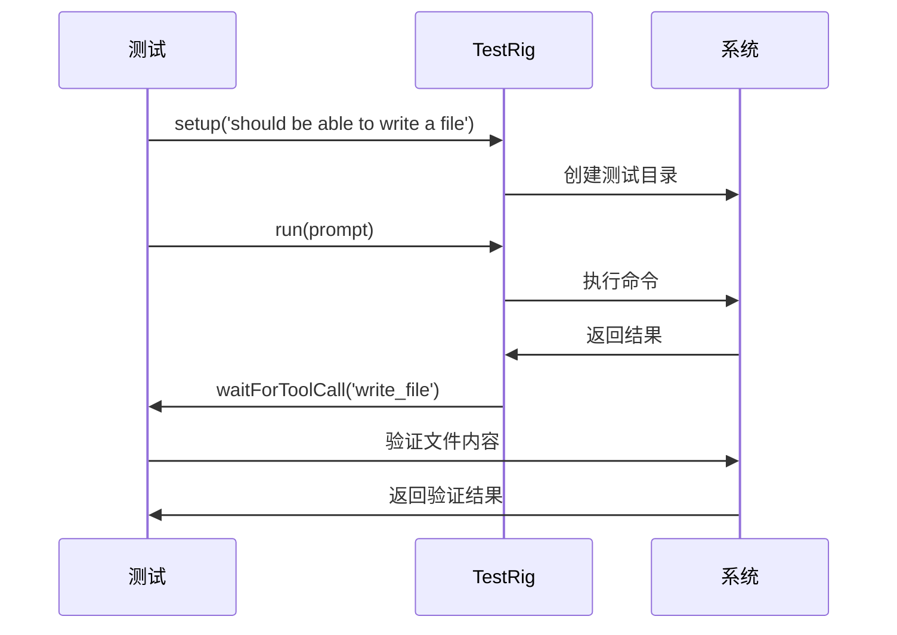
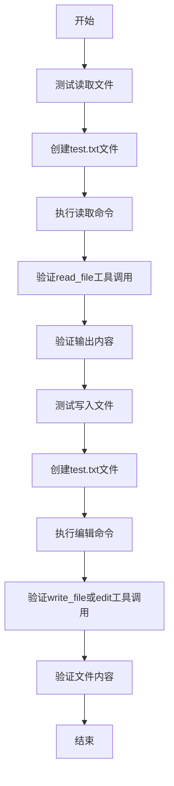
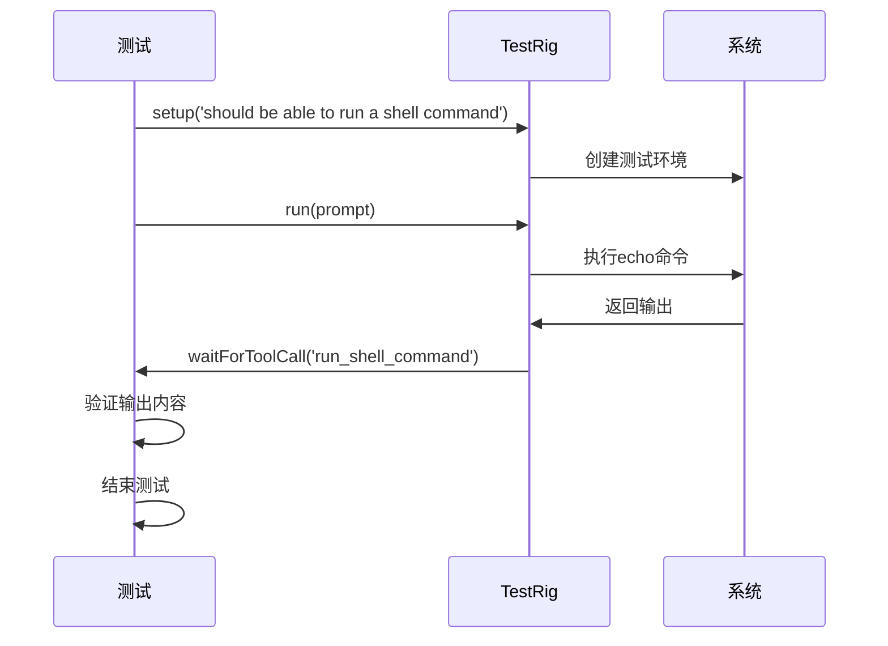
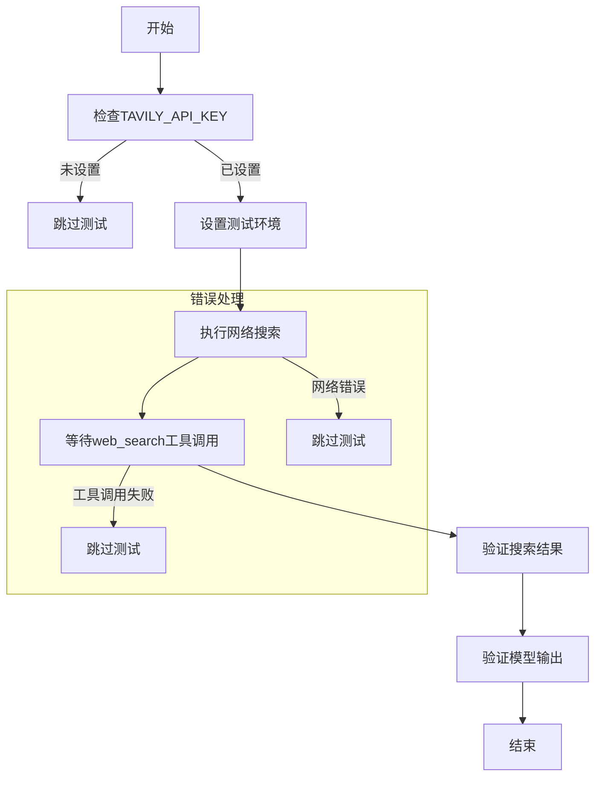
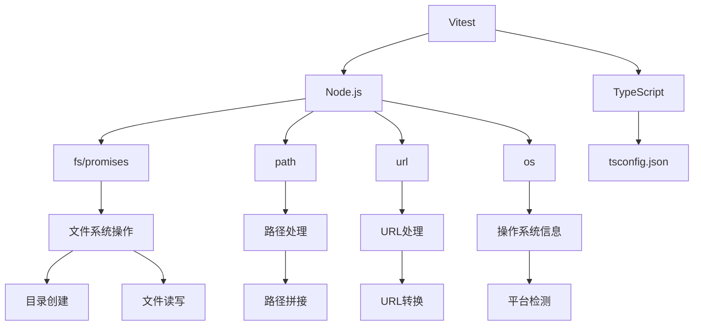

# 集成测试

<cite>
**本文档引用的文件**   
- [globalSetup.ts](file://integration-tests/globalSetup.ts)
- [test-helper.ts](file://integration-tests/test-helper.ts)
- [vitest.config.ts](file://integration-tests/vitest.config.ts)
- [edit.test.ts](file://integration-tests/edit.test.ts)
- [write_file.test.ts](file://integration-tests/write_file.test.ts)
- [file-system.test.ts](file://integration-tests/file-system.test.ts)
- [run_shell_command.test.ts](file://integration-tests/run_shell_command.test.ts)
- [web_search.test.ts](file://integration-tests/web_search.test.ts)
</cite>

## 目录
1. [简介](#简介)
2. [项目结构](#项目结构)
3. [核心组件](#核心组件)
4. [架构概述](#架构概述)
5. [详细组件分析](#详细组件分析)
6. [依赖分析](#依赖分析)
7. [性能考虑](#性能考虑)
8. [故障排除指南](#故障排除指南)
9. [结论](#结论)
10. [附录](#附录)（如有必要）

## 简介
本文档全面阐述Qwen Code的集成测试策略，重点分析`integration-tests`目录下的各类测试用例。文档将解析`edit.test.ts`、`write_file.test.ts`等文件如何验证核心工具的端到端行为；`file-system.test.ts`和`run_shell_command.test.ts`如何测试文件系统与Shell服务的交互；`web_search.test.ts`如何验证网络搜索功能。同时，文档将说明`globalSetup.ts`在测试环境初始化中的作用，以及`test-helper.ts`提供的共享测试工具。最后，文档将解释`vitest.config.ts`中针对集成测试的特定配置，并指导开发者如何编写新的集成测试。

## 项目结构
Qwen Code项目的集成测试主要集中在`integration-tests`目录下，该目录包含多个测试文件和辅助文件，用于验证系统各组件的协同工作能力。测试文件按照功能模块进行组织，每个测试文件专注于验证特定工具或功能的正确性。



**Diagram sources**
- [globalSetup.ts](file://integration-tests/globalSetup.ts#L1-L100)
- [test-helper.ts](file://integration-tests/test-helper.ts#L1-L200)
- [vitest.config.ts](file://integration-tests/vitest.config.ts#L1-L23)

**Section sources**
- [integration-tests](file://integration-tests#L1-L100)

## 核心组件
集成测试的核心组件包括测试环境初始化、共享测试工具、测试配置和具体的测试用例。这些组件共同构成了一个完整的测试框架，确保Qwen Code的各项功能能够正确协同工作。

**Section sources**
- [globalSetup.ts](file://integration-tests/globalSetup.ts#L1-L100)
- [test-helper.ts](file://integration-tests/test-helper.ts#L1-L200)
- [vitest.config.ts](file://integration-tests/vitest.config.ts#L1-L23)

## 架构概述
Qwen Code的集成测试架构基于Vitest框架构建，采用模块化设计，每个测试文件专注于验证特定功能。测试框架通过`globalSetup.ts`进行环境初始化，通过`test-helper.ts`提供共享工具，通过`vitest.config.ts`进行全局配置。



**Diagram sources**
- [vitest.config.ts](file://integration-tests/vitest.config.ts#L1-L23)
- [globalSetup.ts](file://integration-tests/globalSetup.ts#L1-L100)
- [test-helper.ts](file://integration-tests/test-helper.ts#L1-L200)

## 详细组件分析
### 核心测试工具分析
#### TestRig类分析
`TestRig`类是集成测试的核心工具，提供了测试运行所需的各种功能，包括测试环境设置、文件创建、命令执行等。

```mermaid
classDiagram
class TestRig {
+bundlePath : string
+testDir : string | null
+testName? : string
+_lastRunStdout? : string
+getDefaultTimeout() : number
+setup(testName : string, options : { settings? : Record<string, unknown> }) : void
+createFile(fileName : string, content : string) : string
+mkdir(dir : string) : void
+sync() : void
+run(promptOrOptions : string | { prompt? : string; stdin? : string; stdinDoesNotEnd? : boolean }, ...args : string[]) : Promise<string>
}
```

**Diagram sources**
- [test-helper.ts](file://integration-tests/test-helper.ts#L50-L200)

#### 全局设置分析
`globalSetup.ts`文件负责测试环境的初始化和清理工作，确保每次测试都在干净的环境中运行。



**Diagram sources**
- [globalSetup.ts](file://integration-tests/globalSetup.ts#L1-L100)

### 文件操作测试分析
#### edit.test.ts分析
`edit.test.ts`文件验证文件编辑功能的正确性，确保系统能够正确修改文件内容。



**Diagram sources**
- [edit.test.ts](file://integration-tests/edit.test.ts#L1-L65)

#### write_file.test.ts分析
`write_file.test.ts`文件验证文件写入功能的正确性，确保系统能够正确创建新文件。



**Diagram sources**
- [write_file.test.ts](file://integration-tests/write_file.test.ts#L1-L70)

### 文件系统交互测试分析
#### file-system.test.ts分析
`file-system.test.ts`文件验证文件系统交互功能的正确性，包括文件读取和写入操作。



**Diagram sources**
- [file-system.test.ts](file://integration-tests/file-system.test.ts#L1-L90)

#### run_shell_command.test.ts分析
`run_shell_command.test.ts`文件验证Shell命令执行功能的正确性，确保系统能够正确执行Shell命令。



**Diagram sources**
- [run_shell_command.test.ts](file://integration-tests/run_shell_command.test.ts#L1-L71)

### 网络搜索功能测试分析
#### web_search.test.ts分析
`web_search.test.ts`文件验证网络搜索功能的正确性，确保系统能够正确执行网络搜索。



**Diagram sources**
- [web_search.test.ts](file://integration-tests/web_search.test.ts#L1-L84)

## 依赖分析
集成测试框架依赖于多个外部组件和内部模块，这些依赖关系确保了测试的完整性和可靠性。



**Diagram sources**
- [vitest.config.ts](file://integration-tests/vitest.config.ts#L1-L23)
- [globalSetup.ts](file://integration-tests/globalSetup.ts#L1-L100)
- [test-helper.ts](file://integration-tests/test-helper.ts#L1-L200)

**Section sources**
- [vitest.config.ts](file://integration-tests/vitest.config.ts#L1-L23)
- [globalSetup.ts](file://integration-tests/globalSetup.ts#L1-L100)
- [test-helper.ts](file://integration-tests/test-helper.ts#L1-L200)

## 性能考虑
集成测试框架在设计时考虑了多种性能因素，以确保测试的效率和可靠性。

- **超时设置**：测试框架设置了合理的超时时间，避免测试无限期挂起
- **并行执行**：测试用例可以并行执行，提高测试效率
- **资源清理**：自动清理测试产生的临时文件，避免资源泄漏
- **缓存机制**：合理使用缓存，减少重复操作
- **错误处理**：完善的错误处理机制，确保测试失败时能够正确清理资源

## 故障排除指南
当集成测试出现问题时，可以参考以下指南进行故障排除：

**Section sources**
- [test-helper.ts](file://integration-tests/test-helper.ts#L1-L200)
- [globalSetup.ts](file://integration-tests/globalSetup.ts#L1-L100)

## 结论
Qwen Code的集成测试策略通过模块化设计和全面的测试覆盖，确保了系统各组件的正确性和稳定性。测试框架提供了完善的工具和配置，使开发者能够轻松编写和维护集成测试。通过遵循本文档的指导，开发者可以有效地验证新功能的正确性，确保系统的高质量交付。

## 附录
### 测试配置选项
| 配置项 | 默认值 | 描述 |
| --- | --- | --- |
| testTimeout | 5分钟 | 测试超时时间 |
| globalSetup | ./globalSetup.ts | 全局设置文件 |
| reporters | ['default'] | 报告器配置 |
| include | ['**/*.test.ts'] | 包含的测试文件模式 |
| exclude | ['**/terminal-bench/*.test.ts', '**/node_modules/**'] | 排除的测试文件模式 |
| retry | 2 | 测试重试次数 |
| fileParallelism | false | 文件并行执行 |

**Section sources**
- [vitest.config.ts](file://integration-tests/vitest.config.ts#L1-L23)

### 环境变量
| 环境变量 | 描述 |
| --- | --- |
| INTEGRATION_TEST_FILE_DIR | 集成测试文件目录 |
| GEMINI_CLI_INTEGRATION_TEST | 标识集成测试运行 |
| TELEMETRY_LOG_FILE | 遥测日志文件路径 |
| KEEP_OUTPUT | 是否保留测试输出 |
| VERBOSE | 是否启用详细日志 |

**Section sources**
- [globalSetup.ts](file://integration-tests/globalSetup.ts#L1-L100)