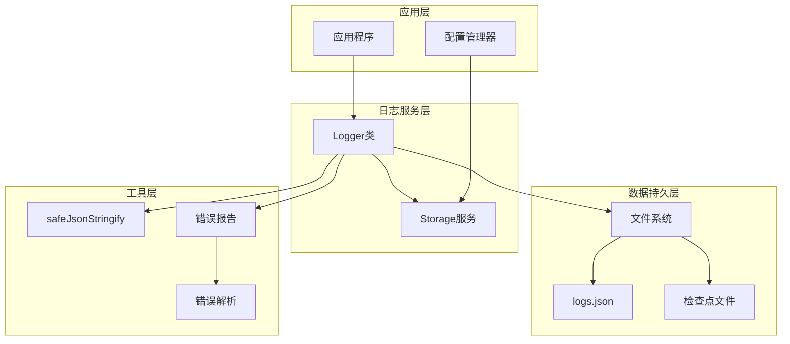
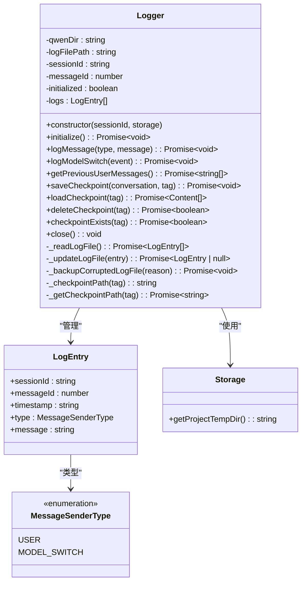
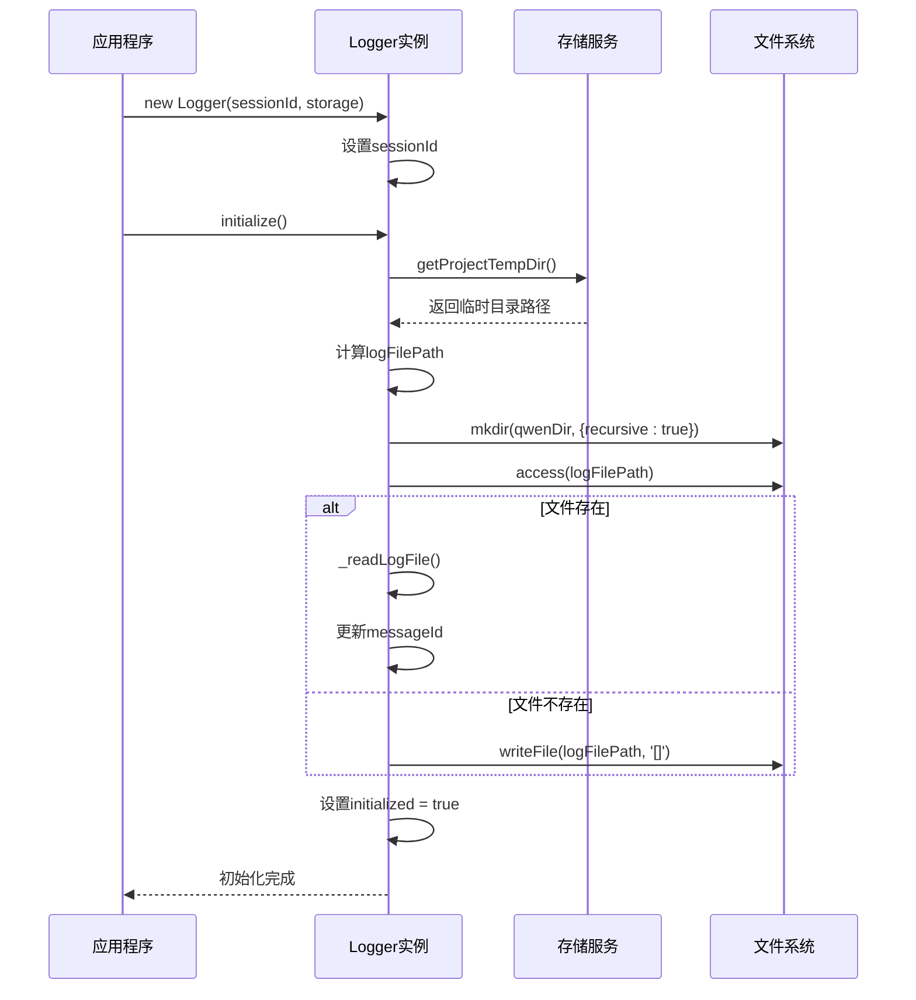
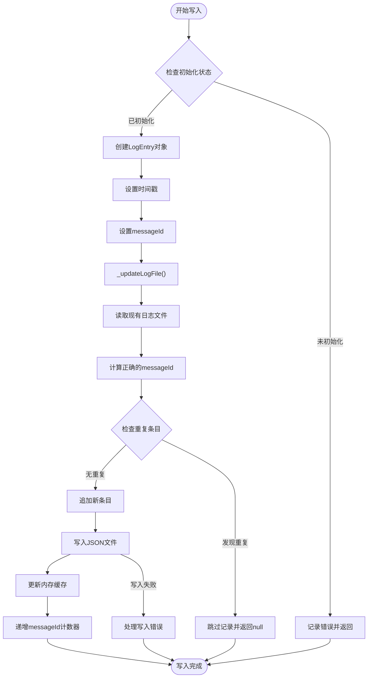
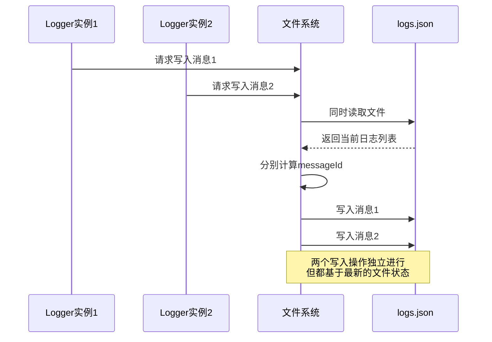
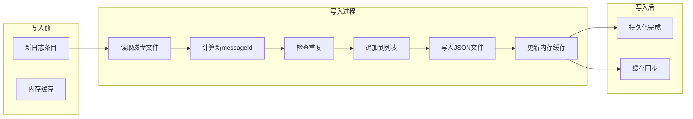
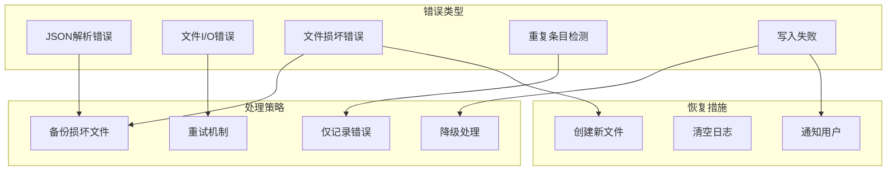
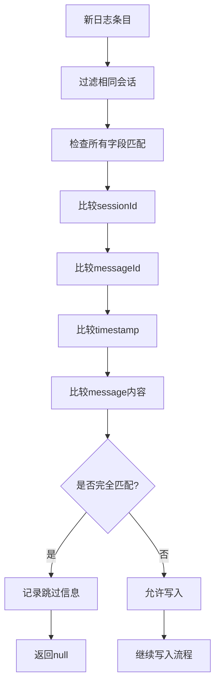

# Qwen Code日志系统写入机制深度解析

<cite>
**本文档引用的文件**
- [packages/core/src/core/logger.ts](file://packages/core/src/core/logger.ts)
- [packages/core/src/core/logger.test.ts](file://packages/core/src/core/logger.test.ts)
- [packages/core/src/utils/safeJsonStringify.ts](file://packages/core/src/utils/safeJsonStringify.ts)
- [packages/core/src/utils/errorReporting.ts](file://packages/core/src/utils/errorReporting.ts)
- [packages/core/src/utils/errorParsing.ts](file://packages/core/src/utils/errorParsing.ts)
- [packages/core/src/config/config.ts](file://packages/core/src/config/config.ts)
</cite>

## 目录
1. [概述](#概述)
2. [核心架构](#核心架构)
3. [Logger类详解](#logger类详解)
4. [日志条目结构设计](#日志条目结构设计)
5. [写入机制实现](#写入机制实现)
6. [异步写入与缓冲策略](#异步写入与缓冲策略)
7. [错误处理与恢复机制](#错误处理与恢复机制)
8. [性能优化策略](#性能优化策略)
9. [故障排除指南](#故障排除指南)
10. [总结](#总结)

## 概述

Qwen Code的日志系统是一个高度优化的异步写入框架，专门设计用于处理代码助手场景中的大量日志记录需求。该系统不仅支持基本的日志写入功能，还提供了会话管理、并发控制、错误恢复和数据完整性保障等高级特性。

核心特点：
- 基于JSON格式的结构化日志存储
- 支持多实例并发写入同一文件
- 内存缓存与磁盘持久化的双重保障
- 完善的错误处理和数据恢复机制
- 高性能的异步I/O操作

## 核心架构



**图表来源**
- [packages/core/src/core/logger.ts](file://packages/core/src/core/logger.ts#L1-L460)
- [packages/core/src/config/config.ts](file://packages/core/src/config/config.ts#L1-L1071)

## Logger类详解

Logger类是整个日志系统的核心组件，负责管理日志的创建、写入、读取和删除操作。

### 类结构设计



**图表来源**
- [packages/core/src/core/logger.ts](file://packages/core/src/core/logger.ts#L25-L460)

### 初始化流程



**图表来源**
- [packages/core/src/core/logger.ts](file://packages/core/src/core/logger.ts#L127-L160)

**章节来源**
- [packages/core/src/core/logger.ts](file://packages/core/src/core/logger.ts#L127-L160)

## 日志条目结构设计

日志条目采用标准化的结构设计，确保数据的一致性和可解析性。

### 核心数据结构

```typescript
interface LogEntry {
  sessionId: string;           // 会话唯一标识符
  messageId: number;           // 消息在会话中的序号
  timestamp: string;           // ISO 8601格式的时间戳
  type: MessageSenderType;     // 消息发送者类型
  message: string;            // 实际消息内容
}
```

### 字段语义与用途

| 字段名 | 类型 | 必需 | 描述 |
|--------|------|------|------|
| `sessionId` | string | 是 | 唯一标识当前会话，支持多实例并发 |
| `messageId` | number | 是 | 消息在会话中的递增序号，确保顺序 |
| `timestamp` | string | 是 | ISO 8601格式时间戳，精确到毫秒 |
| `type` | MessageSenderType | 是 | 消息类型枚举，USER或MODEL_SWITCH |
| `message` | string | 是 | 实际消息内容，JSON序列化 |

### 时间戳生成策略

系统采用以下策略生成时间戳：
- 使用`new Date().toISOString()`生成ISO 8601格式
- 精确到毫秒级别
- UTC时区标准
- 兼容JSON序列化

**章节来源**
- [packages/core/src/core/logger.ts](file://packages/core/src/core/logger.ts#L18-L24)

## 写入机制实现

### 基本写入流程



**图表来源**
- [packages/core/src/core/logger.ts](file://packages/core/src/core/logger.ts#L238-L278)

### 并发写入处理

系统支持多个Logger实例同时写入同一个文件，通过以下机制保证数据一致性：



**图表来源**
- [packages/core/src/core/logger.test.ts](file://packages/core/src/core/logger.test.ts#L296-L329)

**章节来源**
- [packages/core/src/core/logger.ts](file://packages/core/src/core/logger.ts#L172-L278)

## 异步写入与缓冲策略

### 内存缓存机制

Logger类维护一个内存缓存数组`logs`，它始终反映文件的最新状态：

```typescript
private logs: LogEntry[] = []; // 内存缓存，理想上反映文件的最后已知状态
```

### 双重写入策略

系统采用双重写入策略确保数据可靠性：

1. **内存缓存更新**：每次成功写入后立即更新内存缓存
2. **磁盘持久化**：将完整日志列表写入JSON文件



**图表来源**
- [packages/core/src/core/logger.ts](file://packages/core/src/core/logger.ts#L172-L236)

### 异步操作优势

- **非阻塞写入**：写入操作不会阻塞主线程
- **批量处理**：多个写入请求可以合并处理
- **错误隔离**：单个写入失败不影响其他操作
- **性能优化**：减少频繁的文件I/O操作

**章节来源**
- [packages/core/src/core/logger.ts](file://packages/core/src/core/logger.ts#L172-L236)

## 错误处理与恢复机制

### 多层次错误处理

系统实现了多层次的错误处理机制：



**图表来源**
- [packages/core/src/core/logger.ts](file://packages/core/src/core/logger.ts#L84-L125)

### 文件损坏处理

当检测到文件损坏时，系统会执行以下步骤：

1. **识别损坏原因**：区分JSON语法错误、数组格式错误等
2. **创建备份**：将损坏文件重命名为`.bak`扩展名
3. **创建新文件**：初始化一个新的空日志文件
4. **通知用户**：记录调试信息告知文件恢复过程

```typescript
private async _backupCorruptedLogFile(reason: string): Promise<void> {
  if (!this.logFilePath) return;
  const backupPath = `${this.logFilePath}.${reason}.${Date.now()}.bak`;
  try {
    await fs.rename(this.logFilePath, backupPath);
    console.debug(`Backed up corrupted log file to ${backupPath}`);
  } catch (_backupError) {
    // 如果重命名失败（例如文件不存在），无需在此处记录错误
  }
}
```

### 重复条目检测

系统实现了严格的重复条目检测机制：



**图表来源**
- [packages/core/src/core/logger.ts](file://packages/core/src/core/logger.ts#L200-L236)

**章节来源**
- [packages/core/src/core/logger.ts](file://packages/core/src/core/logger.ts#L84-L125)
- [packages/core/src/core/logger.ts](file://packages/core/src/core/logger.ts#L200-L236)

## 性能优化策略

### 序列化优化

系统使用安全的JSON序列化函数处理复杂对象：

```typescript
export function safeJsonStringify(
  obj: unknown,
  space?: string | number,
): string {
  const seen = new WeakSet();
  return JSON.stringify(
    obj,
    (key, value) => {
      if (typeof value === 'object' && value !== null) {
        if (seen.has(value)) {
          return '[Circular]';
        }
        seen.add(value);
      }
      return value;
    },
    space,
  );
}
```

### 缓冲区管理

- **内存限制**：只缓存当前会话的日志条目
- **增量更新**：每次只读取和写入必要的部分
- **格式化控制**：支持可选的缩进参数优化可读性

### 并发性能

- **无锁设计**：每个写入操作独立处理文件状态
- **原子操作**：整个写入过程视为原子操作
- **资源复用**：Logger实例可以多次初始化而不重建

**章节来源**
- [packages/core/src/utils/safeJsonStringify.ts](file://packages/core/src/utils/safeJsonStringify.ts#L10-L31)

## 故障排除指南

### 常见问题诊断

#### 1. 日志文件无法创建

**症状**：Logger初始化失败，出现权限错误

**解决方案**：
- 检查目标目录的写入权限
- 确认磁盘空间充足
- 验证路径是否存在特殊字符

#### 2. JSON解析错误

**症状**：日志文件损坏，无法正常读取

**解决方案**：
- 查看备份文件（`.invalid_json.bak`）
- 手动修复JSON格式
- 重新初始化Logger

#### 3. 重复条目警告

**症状**：控制台输出重复条目跳过信息

**解决方案**：
- 检查是否有多个Logger实例同时写入
- 确认messageId计数器状态
- 验证会话ID的一致性

### 调试技巧

1. **启用调试模式**：设置`debugMode: true`获取详细日志
2. **检查文件权限**：确保日志目录可读写
3. **监控磁盘空间**：避免因空间不足导致写入失败
4. **验证时间同步**：确保系统时间准确

**章节来源**
- [packages/core/src/core/logger.test.ts](file://packages/core/src/core/logger.test.ts#L120-L160)

## 总结

Qwen Code的日志系统写入机制是一个精心设计的高性能解决方案，具有以下核心优势：

### 技术亮点

1. **高可靠性**：多重错误处理和数据恢复机制
2. **高性能**：异步写入和内存缓存优化
3. **并发安全**：支持多实例并发写入
4. **数据完整性**：严格的重复检测和一致性保证
5. **易维护性**：清晰的代码结构和完善的测试覆盖

### 最佳实践建议

- 在生产环境中始终启用错误报告机制
- 定期备份重要的日志文件
- 监控磁盘空间和文件权限
- 合理设置日志保留策略
- 在高并发场景下考虑使用连接池

### 未来改进方向

- 添加日志压缩功能以节省存储空间
- 实现更细粒度的访问控制
- 增加日志轮转和清理机制
- 支持多种存储后端（如数据库）

这个日志系统为Qwen Code提供了坚实的数据基础，确保了代码助手在各种场景下的稳定运行和可靠记录。