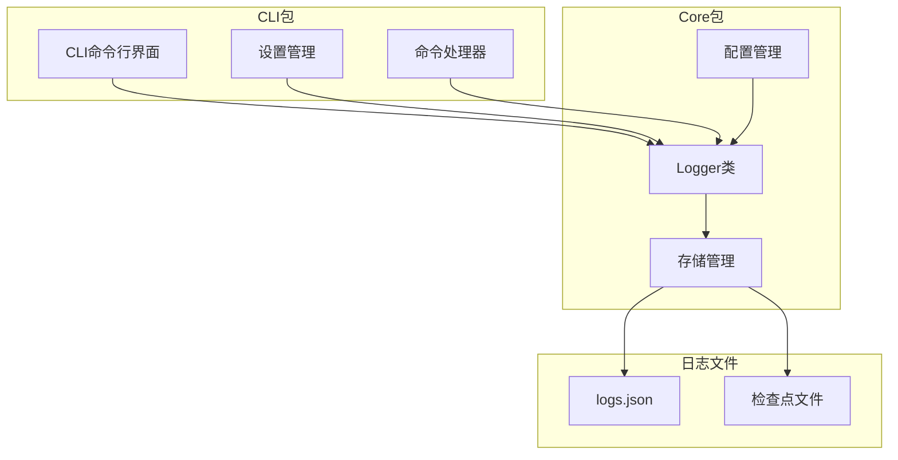
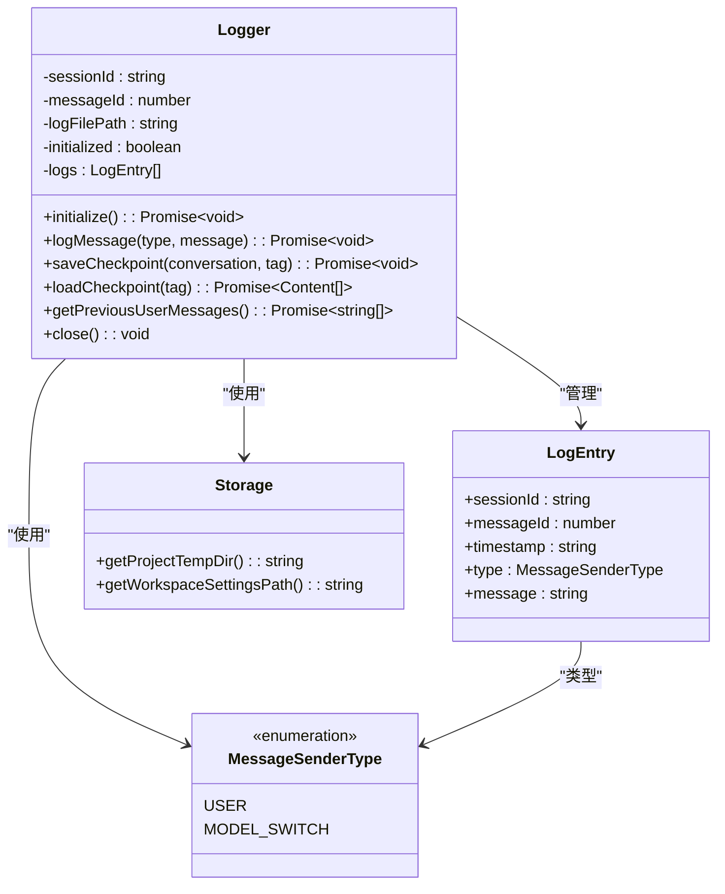
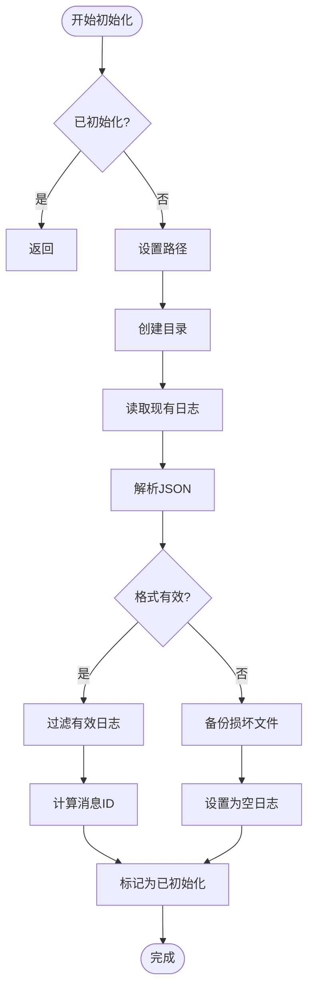

# 日志记录

<cite>
**本文档中引用的文件**
- [packages/cli/src/config/settings.ts](file://packages/cli/src/config/settings.ts)
- [packages/cli/src/config/settingsSchema.ts](file://packages/cli/src/config/settingsSchema.ts)
- [packages/core/src/core/logger.ts](file://packages/core/src/core/logger.ts)
- [packages/core/src/core/logger.test.ts](file://packages/core/src/core/logger.test.ts)
- [packages/cli/src/ui/commands/chatCommand.ts](file://packages/cli/src/ui/commands/chatCommand.ts)
- [packages/cli/src/ui/hooks/useLogger.ts](file://packages/cli/src/ui/hooks/useLogger.ts)
- [packages/core/src/config/config.ts](file://packages/core/src/config/config.ts)
</cite>

## 目录
1. [简介](#简介)
2. [项目结构概览](#项目结构概览)
3. [核心日志系统架构](#核心日志系统架构)
4. [日志配置与设置](#日志配置与设置)
5. [Logger类详细分析](#logger类详细分析)
6. [日志格式与数据结构](#日志格式与数据结构)
7. [实际使用示例](#实际使用示例)
8. [日志轮转与清理策略](#日志轮转与清理策略)
9. [故障排除指南](#故障排除指南)
10. [最佳实践](#最佳实践)

## 简介

Qwen Code的日志记录系统是一个功能完善的日志管理框架，为整个应用程序提供了全面的日志记录、存储和检索功能。该系统支持会话级别的日志管理、检查点保存与恢复、以及强大的错误处理机制。

日志系统的核心特性包括：
- 基于JSON的结构化日志存储
- 会话ID管理和消息ID递增机制
- 检查点功能支持对话历史保存与恢复
- 自动日志轮转和损坏文件备份
- 多实例并发安全的日志写入
- 完整的错误处理和恢复机制

## 项目结构概览

日志记录功能分布在多个包中，主要集中在以下模块：



**图表来源**
- [packages/cli/src/config/settings.ts](file://packages/cli/src/config/settings.ts#L1-L50)
- [packages/core/src/core/logger.ts](file://packages/core/src/core/logger.ts#L1-L50)

## 核心日志系统架构

日志系统采用分层架构设计，确保了高可靠性和可扩展性：



**图表来源**
- [packages/core/src/core/logger.ts](file://packages/core/src/core/logger.ts#L15-L30)
- [packages/core/src/core/logger.ts](file://packages/core/src/core/logger.ts#L32-L45)

**章节来源**
- [packages/core/src/core/logger.ts](file://packages/core/src/core/logger.ts#L1-L100)

## 日志配置与设置

### 设置文件位置

日志系统的配置通过多个层级的设置文件管理：

1. **系统默认设置**：`/etc/qwen-code/system-defaults.json`
2. **用户设置**：`~/.qwen/settings.json`
3. **工作区设置**：`.qwen/settings.json`（当前工作目录）
4. **系统设置**：`/Library/Application Support/QwenCode/settings.json`（macOS）

### 配置迁移机制

系统支持从旧版本设置格式自动迁移到新版本：

```typescript
// 迁移映射表
const MIGRATION_MAP: Record<string, string> = {
  preferredEditor: 'general.preferredEditor',
  vimMode: 'general.vimMode',
  checkpointing: 'general.checkpointing',
  // ... 更多映射
};
```

### 日志相关设置

在`settingsSchema.ts`中定义的日志相关配置：

```typescript
general: {
  checkpointing: {
    enabled: {
      type: 'boolean',
      label: 'Enable Checkpointing',
      default: false,
      description: 'Enable session checkpointing for recovery'
    }
  }
}
```

**章节来源**
- [packages/cli/src/config/settings.ts](file://packages/cli/src/config/settings.ts#L40-L80)
- [packages/cli/src/config/settingsSchema.ts](file://packages/cli/src/config/settingsSchema.ts#L80-L120)

## Logger类详细分析

### 初始化流程

Logger类的初始化过程包含以下关键步骤：



**图表来源**
- [packages/core/src/core/logger.ts](file://packages/core/src/core/logger.ts#L127-L170)

### 核心方法详解

#### 1. 日志消息记录

```typescript
async logMessage(type: MessageSenderType, message: string): Promise<void> {
  if (!this.initialized || this.sessionId === undefined) {
    console.debug('Logger not initialized or session ID missing. Cannot log message.');
    return;
  }

  const newEntryObject: LogEntry = {
    sessionId: this.sessionId,
    messageId: this.messageId,
    type,
    message,
    timestamp: new Date().toISOString(),
  };

  try {
    const writtenEntry = await this._updateLogFile(newEntryObject);
    if (writtenEntry) {
      this.messageId = writtenEntry.messageId + 1;
    }
  } catch (_error) {
    // 错误已在_updateLogFile中处理
  }
}
```

#### 2. 检查点管理

```typescript
async saveCheckpoint(conversation: Content[], tag: string): Promise<void> {
  if (!this.initialized) {
    console.error('Logger not initialized or checkpoint file path not set. Cannot save a checkpoint.');
    return;
  }
  
  const path = this._checkpointPath(tag);
  try {
    await fs.writeFile(path, JSON.stringify(conversation, null, 2), 'utf-8');
  } catch (error) {
    console.error('Error writing to checkpoint file:', error);
  }
}
```

#### 3. 并发安全机制

系统通过以下机制确保并发安全：

- **磁盘状态同步**：每次写入前重新读取磁盘状态
- **消息ID递增**：基于磁盘上现有消息的最大ID递增
- **重复检测**：防止同一消息被重复写入

**章节来源**
- [packages/core/src/core/logger.ts](file://packages/core/src/core/logger.ts#L250-L300)
- [packages/core/src/core/logger.ts](file://packages/core/src/core/logger.ts#L330-L360)

## 日志格式与数据结构

### LogEntry接口

每个日志条目都遵循严格的结构：

```typescript
interface LogEntry {
  sessionId: string;        // 会话唯一标识符
  messageId: number;        // 会话内消息递增编号
  timestamp: string;        // ISO 8601时间戳
  type: MessageSenderType;  // 消息发送者类型
  message: string;          // 实际消息内容
}
```

### 支持的消息类型

```typescript
enum MessageSenderType {
  USER = 'user',                    // 用户输入
  MODEL_SWITCH = 'model_switch',    // 模型切换事件
}
```

### 日志文件结构

日志文件以JSON数组形式存储所有日志条目：

```json
[
  {
    "sessionId": "session-123",
    "messageId": 0,
    "timestamp": "2025-01-01T12:00:00.000Z",
    "type": "user",
    "message": "Hello, world!"
  },
  {
    "sessionId": "session-123",
    "messageId": 1,
    "timestamp": "2025-01-01T12:00:05.000Z",
    "type": "model_switch",
    "message": "{\"fromModel\":\"qwen3-coder\",\"toModel\":\"qwen-vl-max-latest\",\"reason\":\"vision_auto_switch\"}"
  }
]
```

### 检查点文件格式

检查点文件存储完整的对话历史：

```json
[
  {
    "role": "user",
    "parts": [{"text": "Hello, how are you?"}]
  },
  {
    "role": "model",
    "parts": [{"text": "I'm doing well, thank you!"}]
  }
]
```

**章节来源**
- [packages/core/src/core/logger.ts](file://packages/core/src/core/logger.ts#L15-L30)
- [packages/core/src/core/logger.ts](file://packages/core/src/core/logger.ts#L84-L125)

## 实际使用示例

### 基本日志记录

```typescript
// 创建Logger实例
const logger = new Logger(sessionId, storage);
await logger.initialize();

// 记录用户消息
await logger.logMessage(MessageSenderType.USER, 'User input message');

// 记录模型切换事件
await logger.logMessage(MessageSenderType.MODEL_SWITCH, JSON.stringify({
  fromModel: 'qwen3-coder-plus',
  toModel: 'qwen-vl-max-latest',
  reason: 'vision_auto_switch',
  context: 'Image content detected'
}));
```

### 检查点操作

```typescript
// 保存检查点
const chat = await config?.getGeminiClient()?.getChat();
if (chat) {
  const history = chat.getHistory();
  await logger.saveCheckpoint(history, 'my-checkpoint-tag');
}

// 加载检查点
const conversation = await logger.loadCheckpoint('my-checkpoint-tag');
if (conversation.length > 0) {
  // 使用加载的对话历史
}

// 删除检查点
await logger.deleteCheckpoint('my-checkpoint-tag');
```

### 在命令中的使用

```typescript
// 聊天命令中的日志集成
const saveCommand: SlashCommand = {
  name: 'save',
  action: async (context, args) => {
    const tag = args.trim();
    if (!tag) {
      return { type: 'message', content: 'Missing tag.' };
    }

    const { logger } = context.services;
    await logger.initialize();
    
    const chat = await config?.getGeminiClient()?.getChat();
    const history = chat?.getHistory() || [];
    
    if (history.length > 2) {
      await logger.saveCheckpoint(history, tag);
      return { 
        type: 'message', 
        content: `Conversation checkpoint saved with tag: ${tag}` 
      };
    }
  }
};
```

**章节来源**
- [packages/cli/src/ui/commands/chatCommand.ts](file://packages/cli/src/ui/commands/chatCommand.ts#L110-L160)
- [packages/core/src/core/logger.ts](file://packages/core/src/core/logger.ts#L250-L280)

## 日志轮转与清理策略

### 自动备份机制

当检测到日志文件损坏时，系统会自动执行备份：

```typescript
private async _backupCorruptedLogFile(reason: string): Promise<void> {
  if (!this.logFilePath) return;
  const backupPath = `${this.logFilePath}.${reason}.${Date.now()}.bak`;
  try {
    await fs.rename(this.logFilePath, backupPath);
    console.debug(`Backed up corrupted log file to ${backupPath}`);
  } catch (_backupError) {
    // 如果重命名失败（例如文件不存在），无需在此处记录错误
  }
}
```

### 文件路径编码

为了支持特殊字符，系统对检查点标签进行URL编码：

```typescript
export function encodeTagName(str: string): string {
  return encodeURIComponent(str);
}

export function decodeTagName(str: string): string {
  try {
    return decodeURIComponent(str);
  } catch (_e) {
    // 回退处理旧的、可能损坏的编码
    return str.replace(/%([0-9A-F]{2})/g, (_, hex) => 
      String.fromCharCode(parseInt(hex, 16))
    );
  }
}
```

### 向后兼容性

系统同时支持新旧两种文件路径格式：

```typescript
private async _getCheckpointPath(tag: string): Promise<string> {
  // 1. 首先检查新的编码路径
  const newPath = this._checkpointPath(tag);
  try {
    await fs.access(newPath);
    return newPath; // 找到了，使用新路径
  } catch (error) {
    const nodeError = error as NodeJS.ErrnoException;
    if (nodeError.code !== 'ENOENT') {
      throw error; // 发生了真正的错误，重新抛出
    }
    // 未找到，接下来检查旧路径
  }

  // 2. 向后兼容：检查旧的原始路径
  const oldPath = path.join(this.qwenDir!, `checkpoint-${tag}.json`);
  try {
    await fs.access(oldPath);
    return oldPath; // 找到了，使用旧路径
  } catch (error) {
    const nodeError = error as NodeJS.ErrnoException;
    if (nodeError.code !== 'ENOENT') {
      throw error; // 发生了真正的错误，重新抛出
    }
  }

  // 3. 如果两者都不存在，返回新编码路径作为规范路径
  return newPath;
}
```

**章节来源**
- [packages/core/src/core/logger.ts](file://packages/core/src/core/logger.ts#L127-L140)
- [packages/core/src/core/logger.ts](file://packages/core/src/core/logger.ts#L40-L60)
- [packages/core/src/core/logger.ts](file://packages/core/src/core/logger.ts#L310-L340)

## 故障排除指南

### 常见问题与解决方案

#### 1. 日志初始化失败

**症状**：Logger无法初始化，出现"Failed to initialize logger"错误

**原因**：
- 权限不足无法创建目录或文件
- 存储空间不足
- 路径权限问题

**解决方案**：
```typescript
try {
  await logger.initialize();
} catch (error) {
  console.error('Logger initialization failed:', error);
  // 尝试使用备用存储位置
  const alternativeStorage = new Storage('/tmp');
  const alternativeLogger = new Logger(sessionId, alternativeStorage);
  await alternativeLogger.initialize();
}
```

#### 2. 日志文件损坏

**症状**：Invalid JSON in log file错误

**自动处理**：
系统会自动备份损坏文件并创建新的空日志文件：

```bash
# 备份文件示例
logs.json.invalid_json.1640995200000.bak
```

**手动修复**：
```typescript
// 检查并修复损坏的日志文件
const logger = new Logger(sessionId, storage);
await logger.initialize();

// 如果需要，可以手动删除损坏文件
// 注意：这将丢失相关会话的历史记录
```

#### 3. 并发写入冲突

**症状**：重复的日志条目或消息ID不连续

**系统处理**：
- 写入前重新读取磁盘状态
- 基于磁盘上现有消息的最大ID递增
- 检测并跳过重复条目

**开发者注意事项**：
```typescript
// 确保在写入前正确初始化
await logger.initialize();

// 检查写入结果
const entry = await logger._updateLogFile(newEntry);
if (!entry) {
  console.log('Entry was a duplicate and skipped');
}
```

### 调试技巧

#### 启用调试日志

```typescript
// 在开发环境中启用详细日志
console.debug('Logger state:', {
  initialized: logger['initialized'],
  sessionId: logger['sessionId'],
  messageId: logger['messageId'],
  logFilePath: logger['logFilePath']
});
```

#### 检查日志文件完整性

```typescript
// 手动验证日志文件格式
async function validateLogFile(filePath: string): Promise<boolean> {
  try {
    const content = await fs.readFile(filePath, 'utf-8');
    const parsed = JSON.parse(content);
    return Array.isArray(parsed);
  } catch (error) {
    console.error('Log file validation failed:', error);
    return false;
  }
}
```

**章节来源**
- [packages/core/src/core/logger.ts](file://packages/core/src/core/logger.ts#L127-L140)
- [packages/core/src/core/logger.ts](file://packages/core/src/core/logger.ts#L200-L236)

## 最佳实践

### 1. 日志记录最佳实践

#### 正确的初始化时机

```typescript
// 推荐：在使用前初始化
const logger = new Logger(sessionId, storage);
await logger.initialize();

// 不推荐：直接使用未初始化的Logger
// await logger.logMessage(...) // 可能导致错误
```

#### 消息内容的最佳格式

```typescript
// 推荐：结构化的JSON消息
await logger.logMessage(MessageSenderType.MODEL_SWITCH, JSON.stringify({
  fromModel: 'qwen3-coder-plus',
  toModel: 'qwen-vl-max-latest',
  reason: 'vision_auto_switch',
  context: 'Image content detected'
}));

// 推荐：简洁的文本消息
await logger.logMessage(MessageSenderType.USER, 'User input message');
```

#### 错误处理

```typescript
async function safeLogMessage(logger: Logger, type: MessageSenderType, message: string): Promise<void> {
  try {
    await logger.logMessage(type, message);
  } catch (error) {
    console.error('Failed to log message:', error);
    // 可以考虑降级到控制台日志
    console.log(`[${type}] ${message}`);
  }
}
```

### 2. 性能优化建议

#### 批量操作

```typescript
// 推荐：批量处理而非频繁单个写入
async function batchLogMessages(logger: Logger, messages: {type: MessageSenderType, message: string}[]): Promise<void> {
  for (const {type, message} of messages) {
    await logger.logMessage(type, message);
  }
}
```

#### 内存管理

```typescript
// 推荐：及时关闭不再使用的Logger
logger.close();

// 不推荐：长时间持有大量日志对象
// const longRunningLogger = new Logger(sessionId, storage);
// await longRunningLogger.initialize();
// // ... 长时间运行 ...
```

### 3. 安全考虑

#### 敏感信息处理

```typescript
// 推荐：避免记录敏感信息
await logger.logMessage(MessageSenderType.USER, 'User input without sensitive data');

// 不推荐：记录可能包含敏感信息的内容
// await logger.logMessage(MessageSenderType.USER, userInput); // 可能包含密码等
```

#### 文件权限

```typescript
// 确保日志文件有适当的权限
// chmod 600 ~/.qwen/logs.json
```

### 4. 监控和维护

#### 定期检查

```typescript
// 定期检查日志文件大小
async function monitorLogFileSize(storage: Storage): Promise<void> {
  const logFilePath = path.join(storage.getProjectTempDir(), 'logs.json');
  try {
    const stats = await fs.stat(logFilePath);
    if (stats.size > MAX_LOG_SIZE) {
      console.warn('Log file size exceeded threshold:', stats.size);
      // 考虑清理或归档
    }
  } catch (error) {
    console.error('Failed to check log file size:', error);
  }
}
```

#### 清理策略

```typescript
// 实现定期清理逻辑
async function cleanupOldLogs(storage: Storage): Promise<void> {
  const logDir = storage.getProjectTempDir();
  const files = await fs.readdir(logDir);
  
  for (const file of files) {
    if (file.endsWith('.bak')) {
      const filePath = path.join(logDir, file);
      const stats = await fs.stat(filePath);
      
      // 删除超过30天的备份文件
      if (Date.now() - stats.mtime.getTime() > 30 * 24 * 60 * 60 * 1000) {
        await fs.unlink(filePath);
      }
    }
  }
}
```

通过遵循这些最佳实践，开发者可以充分利用Qwen Code的日志记录系统，确保应用程序的稳定性和可维护性。