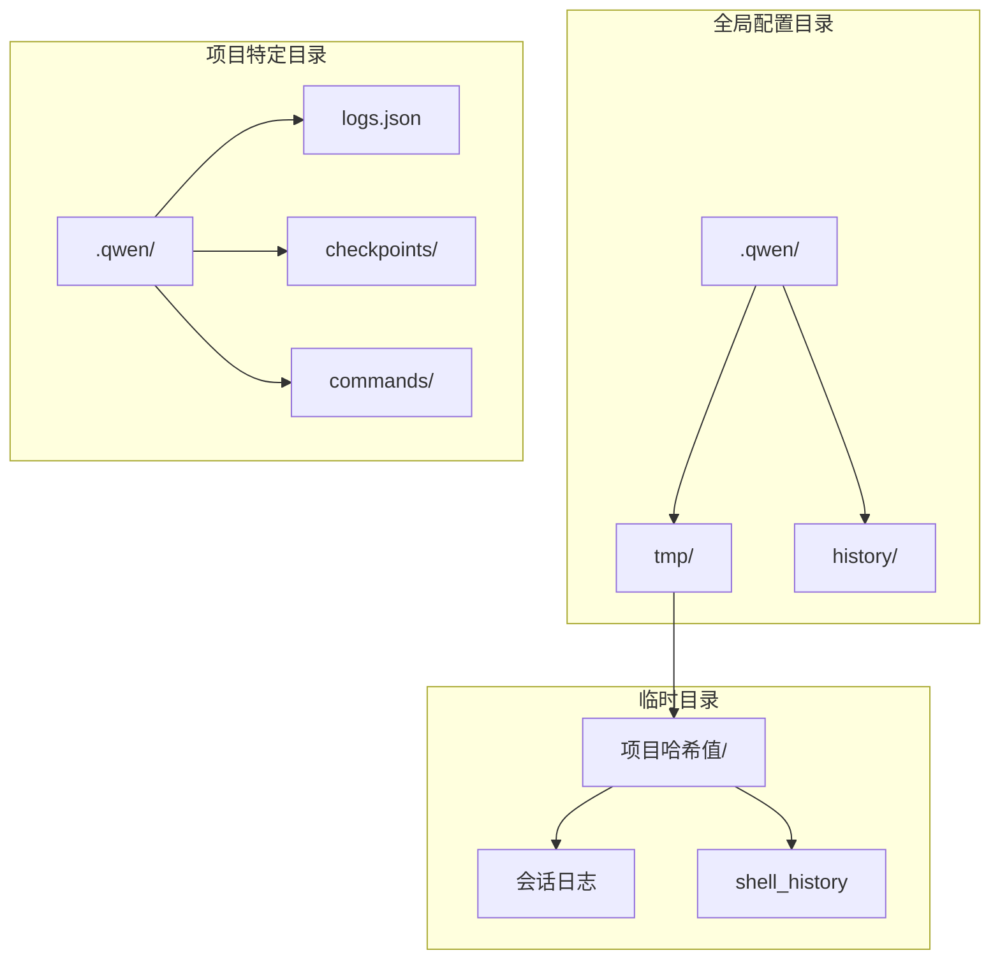
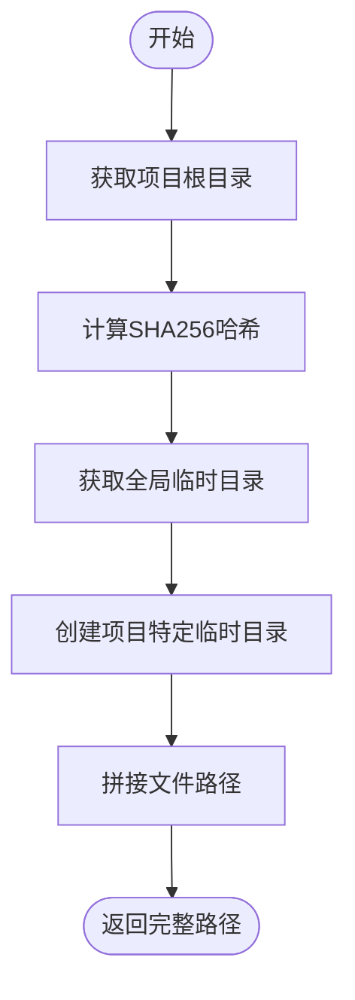
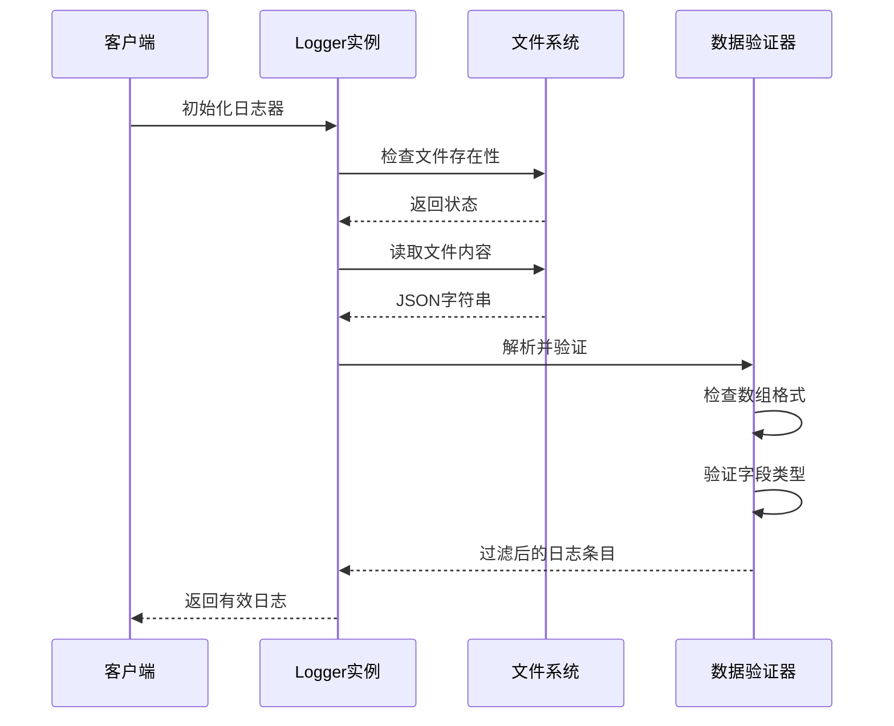
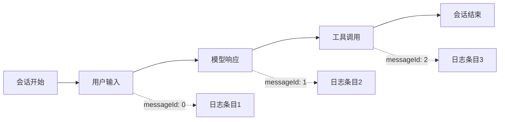
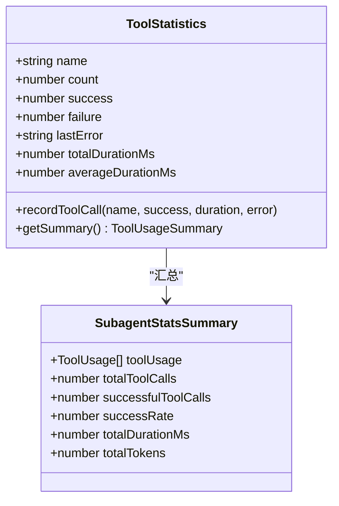
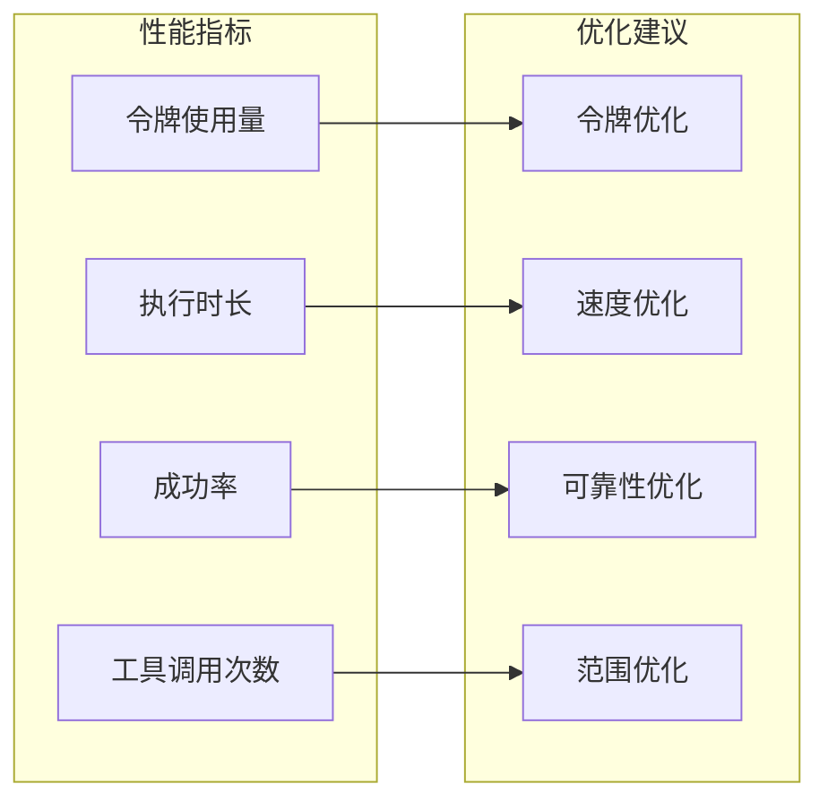

# 日志读取与分析

<cite>
**本文档中引用的文件**
- [logger.ts](file://packages/core/src/core/logger.ts)
- [logger.test.ts](file://packages/core/src/core/logger.test.ts)
- [storage.ts](file://packages/core/src/config/storage.ts)
- [subagent-statistics.ts](file://packages/core/src/subagents/subagent-statistics.ts)
- [test-helper.ts](file://integration-tests/test-helper.ts)
- [statsCommand.ts](file://packages/cli/src/ui/commands/statsCommand.ts)
</cite>

## 目录
1. [简介](#简介)
2. [日志文件结构](#日志文件结构)
3. [日志格式规范](#日志格式规范)
4. [日志文件存储路径](#日志文件存储路径)
5. [日志读取与解析](#日志读取与解析)
6. [关键分析场景](#关键分析场景)
7. [代码示例](#代码示例)
8. [性能分析与优化](#性能分析与优化)
9. [故障排除指南](#故障排除指南)
10. [总结](#总结)

## 简介

Qwen Code项目采用了一套完整的日志记录和分析系统，用于跟踪用户交互、工具使用情况和系统性能。该系统通过JSON行格式存储日志数据，提供了强大的分析功能，包括会话生命周期追踪、异常调用链分析和工具使用统计。

日志系统的核心组件是`Logger`类，它负责管理日志文件的读写操作，并提供丰富的分析接口。每个会话都有独立的日志记录，确保数据隔离和安全性。

## 日志文件结构

### 基本结构

Qwen Code的日志系统采用以下文件组织结构：



**图表来源**
- [storage.ts](file://packages/core/src/config/storage.ts#L1-L115)

### 文件命名规则

日志文件遵循以下命名规则：

- **主日志文件**: `logs.json`
- **检查点文件**: `checkpoint-{encoded_tag}.json`
- **Shell历史**: `shell_history`

所有文件都经过SHA256哈希处理，确保跨项目的唯一性。

**章节来源**
- [storage.ts](file://packages/core/src/config/storage.ts#L1-L115)
- [logger.ts](file://packages/core/src/core/logger.ts#L1-L460)

## 日志格式规范

### LogEntry接口定义

每个日志条目都遵循严格的JSON格式规范：

```typescript
interface LogEntry {
  sessionId: string;        // 会话唯一标识符
  messageId: number;        // 消息序列号
  timestamp: string;        // ISO 8601时间戳
  type: MessageSenderType;  // 消息发送者类型
  message: string;          // 实际消息内容
}
```

### 数据类型验证

系统在读取日志时会严格验证数据类型：

```typescript
return parsedLogs.filter(
  (entry) =>
    typeof entry.sessionId === 'string' &&
    typeof entry.messageId === 'number' &&
    typeof entry.timestamp === 'string' &&
    typeof entry.type === 'string' &&
    typeof entry.message === 'string',
) as LogEntry[];
```

### 支持的消息类型

```typescript
export enum MessageSenderType {
  USER = 'user',                    // 用户输入
  MODEL_SWITCH = 'model_switch',    // 模型切换事件
}
```

**章节来源**
- [logger.ts](file://packages/core/src/core/logger.ts#L18-L30)
- [logger.ts](file://packages/core/src/core/logger.ts#L84-L125)

## 日志文件存储路径

### 路径计算逻辑

日志文件的存储路径通过以下算法计算：



**图表来源**
- [storage.ts](file://packages/core/src/config/storage.ts#L60-L70)

### 具体路径示例

假设项目目录为 `/Users/developer/projects/my-app`：

1. **全局Qwen目录**: `~/.qwen/`
2. **临时目录**: `~/.qwen/tmp/`
3. **项目哈希**: `a1b2c3d4e5f6...`
4. **最终路径**: `~/.qwen/tmp/a1b2c3d4e5f6.../`

### 检查点文件路径

检查点文件采用编码标签名：

```typescript
private _checkpointPath(tag: string): string {
  const encodedTag = encodeTagName(tag);
  return path.join(this.qwenDir, `checkpoint-${encodedTag}.json`);
}
```

**章节来源**
- [storage.ts](file://packages/core/src/config/storage.ts#L60-L70)
- [logger.ts](file://packages/core/src/core/logger.ts#L300-L305)

## 日志读取与解析

### 核心读取流程



**图表来源**
- [logger.ts](file://packages/core/src/core/logger.ts#L84-L125)

### 错误处理机制

系统实现了完善的错误处理策略：

1. **文件不存在**: 返回空数组
2. **JSON格式错误**: 备份损坏文件并重新初始化
3. **数组格式错误**: 同样备份并重新初始化
4. **读取权限错误**: 记录错误但不中断程序

```typescript
try {
  const fileContent = await fs.readFile(this.logFilePath, 'utf-8');
  const parsedLogs = JSON.parse(fileContent);
  // ... 验证逻辑
} catch (error) {
  const nodeError = error as NodeJS.ErrnoException;
  if (nodeError.code === 'ENOENT') {
    return [];
  }
  if (error instanceof SyntaxError) {
    await this._backupCorruptedLogFile('invalid_json');
    return [];
  }
  throw error;
}
```

**章节来源**
- [logger.ts](file://packages/core/src/core/logger.ts#L84-L125)

## 关键分析场景

### 1. 会话生命周期追踪

通过`sessionId`可以完整追踪一个会话的所有活动：



**图表来源**
- [logger.ts](file://packages/core/src/core/logger.ts#L238-L278)

### 2. 异常调用链分析

系统支持复杂的异常追踪：

```typescript
// 检查网络工具失败
const isNetworkTool = (name: string) => /web|fetch|search/i.test(name);
const hadNetworkFailure = (stats.toolUsage || []).some(
  (t) =>
    isNetworkTool(t.name) &&
    t.lastError &&
    /timeout|network/i.test(t.lastError),
);
```

### 3. 工具使用频率统计



**图表来源**
- [subagent-statistics.ts](file://packages/core/src/subagents/subagent-statistics.ts#L43-L88)

**章节来源**
- [subagent-statistics.ts](file://packages/core/src/subagents/subagent-statistics.ts#L181-L249)

## 代码示例

### 基础日志读取

```javascript
// 读取所有日志条目
async function readAllLogs() {
  const storage = new Storage(process.cwd());
  const logger = new Logger('session-123', storage);
  
  try {
    await logger.initialize();
    const logs = logger.logs; // 内存中的日志缓存
    return logs;
  } finally {
    logger.close();
  }
}
```

### 按时间范围过滤

```javascript
// 按时间范围过滤日志
function filterLogsByTimeRange(logs, startTime, endTime) {
  return logs.filter(log => {
    const logTime = new Date(log.timestamp).getTime();
    return logTime >= startTime && logTime <= endTime;
  });
}
```

### 按消息类型筛选

```javascript
// 筛选用户消息
async function getUserMessages() {
  const storage = new Storage(process.cwd());
  const logger = new Logger('session-123', storage);
  
  try {
    await logger.initialize();
    const userMessages = await logger.getPreviousUserMessages();
    return userMessages;
  } finally {
    logger.close();
  }
}
```

### 重建行为序列

```javascript
// 使用messageId重建消息序列
function rebuildMessageSequence(logs) {
  return logs
    .filter(log => log.sessionId === 'target-session')
    .sort((a, b) => a.messageId - b.messageId)
    .map(log => ({
      timestamp: log.timestamp,
      type: log.type,
      content: log.message
    }));
}
```

### 分析工具使用统计

```javascript
// 统计工具使用情况
function analyzeToolUsage(logs) {
  const toolStats = {};
  
  logs.forEach(log => {
    if (log.type === 'model_switch') {
      const switchData = JSON.parse(log.message);
      const toolName = switchData.function_name;
      
      if (!toolStats[toolName]) {
        toolStats[toolName] = {
          calls: 0,
          successes: 0,
          failures: 0,
          totalDuration: 0
        };
      }
      
      toolStats[toolName].calls++;
      if (switchData.success) {
        toolStats[toolName].successes++;
      } else {
        toolStats[toolName].failures++;
      }
      if (switchData.duration_ms) {
        toolStats[toolName].totalDuration += switchData.duration_ms;
      }
    }
  });
  
  return toolStats;
}
```

**章节来源**
- [logger.ts](file://packages/core/src/core/logger.ts#L238-L278)
- [logger.ts](file://packages/core/src/core/logger.ts#L172-L236)

## 性能分析与优化

### 性能指标监控

系统提供了详细的性能分析功能：



**图表来源**
- [subagent-statistics.ts](file://packages/core/src/subagents/subagent-statistics.ts#L181-L249)

### 优化建议生成

系统自动生成性能优化建议：

```typescript
// 高失败率警告
if (sr < 80) {
  tips.push('Low tool success rate - review inputs and error messages');
}

// 长执行时间提示
if (stats.totalDurationMs > 60_000) {
  tips.push('Long execution time - consider breaking down complex tasks');
}

// 高令牌使用量警告
if (typeof stats.totalTokens === 'number' && stats.totalTokens > 100_000) {
  tips.push('High token usage - consider optimizing prompts or narrowing scope');
}
```

**章节来源**
- [subagent-statistics.ts](file://packages/core/src/subagents/subagent-statistics.ts#L181-L249)

## 故障排除指南

### 常见问题诊断

1. **日志文件损坏**
   - 系统自动检测并备份损坏文件
   - 创建新的空日志文件
   - 记录详细的错误信息

2. **并发写入冲突**
   - 使用文件锁机制
   - 实现乐观并发控制
   - 自动重试机制

3. **磁盘空间不足**
   - 监控可用空间
   - 实现日志轮转
   - 提供清理接口

### 调试技巧

```javascript
// 启用详细日志记录
console.debug('Logger state:', {
  initialized: logger.initialized,
  sessionId: logger.sessionId,
  messageId: logger.messageId,
  logFilePath: logger.logFilePath
});

// 检查文件权限
try {
  await fs.access(logFilePath);
  console.log('File accessible');
} catch (error) {
  console.error('File access error:', error.code);
}
```

**章节来源**
- [logger.ts](file://packages/core/src/core/logger.ts#L127-L170)
- [logger.ts](file://packages/core/src/core/logger.ts#L200-L236)

## 总结

Qwen Code的日志系统是一个功能完善、设计精良的数据分析平台。它不仅提供了基础的日志记录功能，还集成了高级的分析能力，包括：

- **结构化数据存储**: JSON格式确保数据的可读性和可解析性
- **会话隔离**: 通过sessionId实现完全的数据隔离
- **并发安全**: 支持多实例并发写入而不产生冲突
- **智能分析**: 提供工具使用统计、性能监控和优化建议
- **容错机制**: 完善的错误处理和恢复策略

通过合理使用这些功能，开发者可以：
- 追踪用户交互的完整生命周期
- 分析工具使用的效率和效果
- 识别系统性能瓶颈和优化机会
- 快速定位和解决异常问题

这个日志系统为Qwen Code提供了强大的可观测性基础，是整个系统可靠性和可维护性的关键保障。