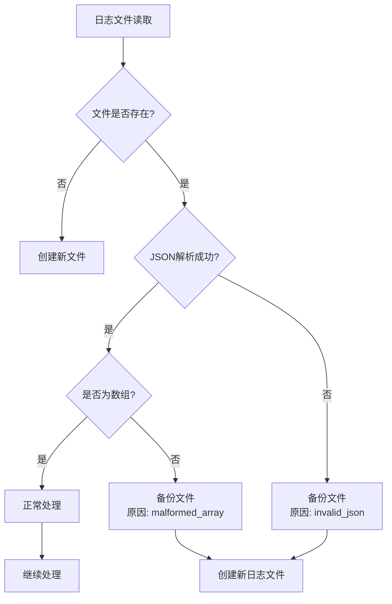
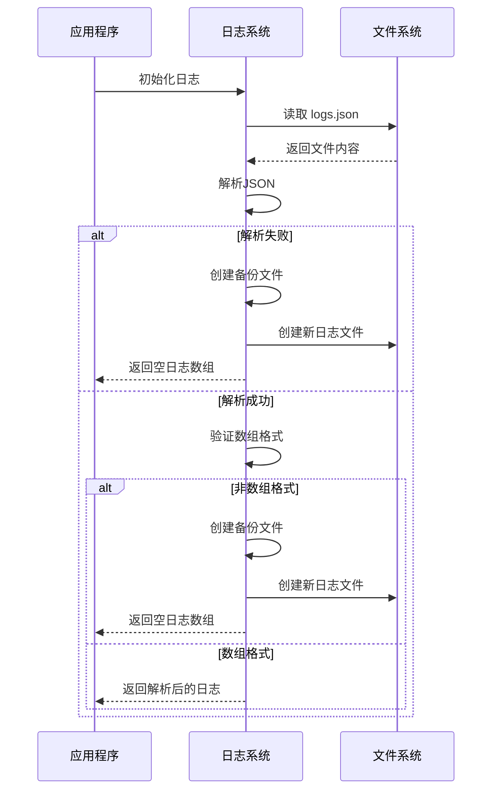
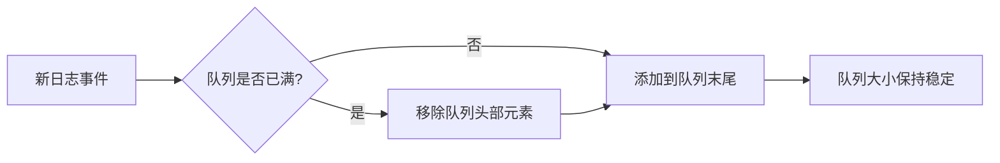
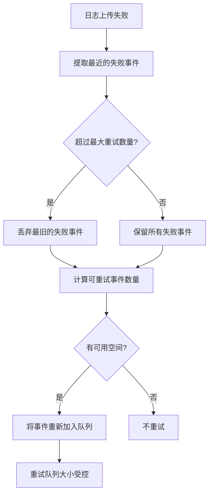
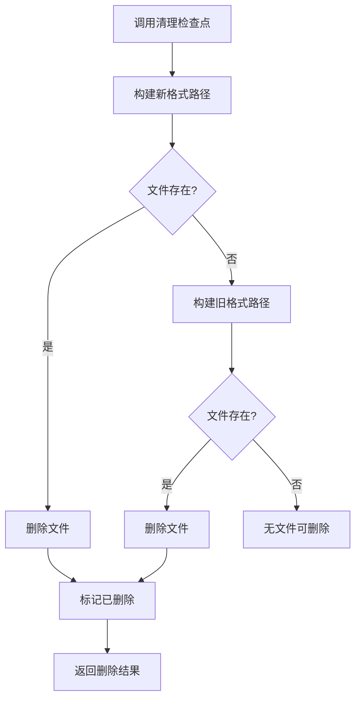
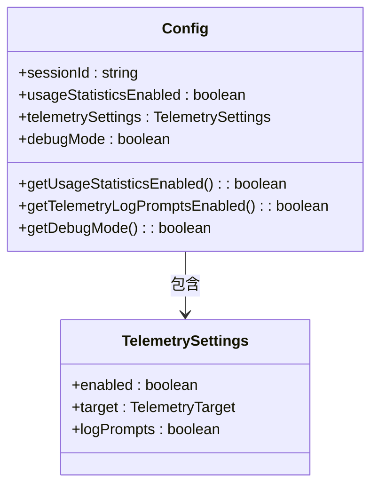
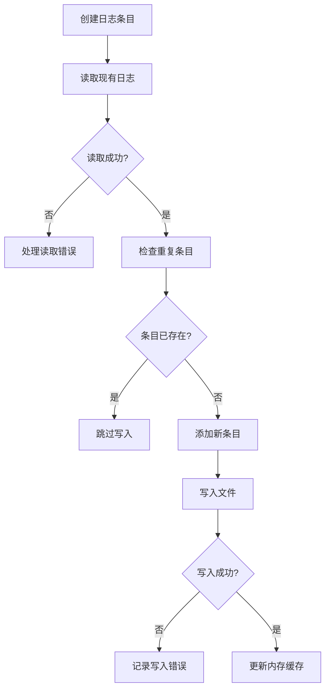
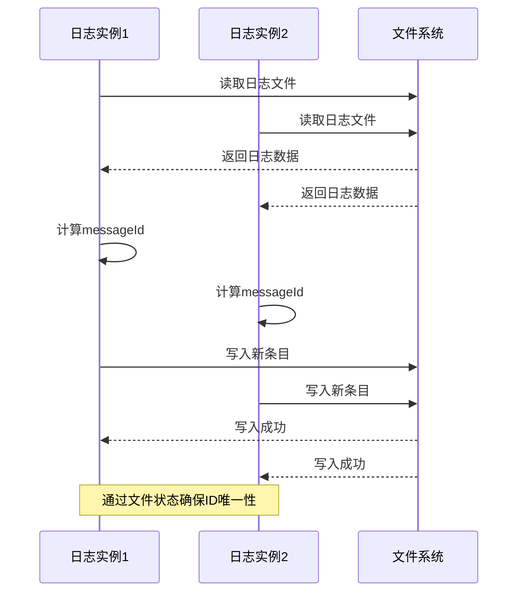

# 日志轮转与清理

<cite>
**本文档中引用的文件**  
- [logger.ts](file://packages/core/src/core/logger.ts)
- [cleanup.ts](file://packages/cli/src/utils/cleanup.ts)
- [config.ts](file://packages/core/src/config/config.ts)
- [clearcut-logger.ts](file://packages/core/src/telemetry/clearcut-logger/clearcut-logger.ts)
- [file-exporters.ts](file://packages/core/src/telemetry/file-exporters.ts)
</cite>

## 目录
1. [简介](#简介)
2. [日志轮转与备份机制](#日志轮转与备份机制)
3. [磁盘空间监控与清理算法](#磁盘空间监控与清理算法)
4. [配置参数说明](#配置参数说明)
5. [代码实现逻辑](#代码实现逻辑)
6. [生产环境最佳实践](#生产环境最佳实践)
7. [结论](#结论)

## 简介
Qwen Code的日志系统采用基于文件的持久化存储机制，通过JSON格式记录会话日志。系统实现了日志文件的自动备份、错误恢复和清理机制，确保日志数据的完整性和系统的稳定性。日志文件存储在项目临时目录中，采用会话隔离的方式管理不同会话的日志数据。

**Section sources**
- [logger.ts](file://packages/core/src/core/logger.ts#L20-L40)

## 日志轮转与备份机制

### 文件重命名与备份规则
当日志文件出现损坏或格式错误时，系统会自动执行备份操作。备份文件采用特定的命名规则，包含原始文件名、错误原因和时间戳。具体规则如下：
- 原始文件名：`logs.json`
- 备份文件名格式：`logs.json.{reason}.{timestamp}.bak`
- 错误原因包括：`malformed_array`（非数组格式）、`invalid_json`（无效JSON）

**Diagram sources**
- [logger.ts](file://packages/core/src/core/logger.ts#L84-L125)
- [logger.ts](file://packages/core/src/core/logger.ts#L250-L275)

### 日志文件损坏处理
系统在读取日志文件时会进行严格的格式验证。如果发现文件内容不是有效的JSON数组或包含语法错误，系统会自动将原文件备份并创建一个新的空日志文件。这种机制确保了即使日志文件损坏，也不会影响系统的正常运行。

**Diagram sources**
- [logger.ts](file://packages/core/src/core/logger.ts#L84-L125)
- [logger.ts](file://packages/core/src/core/logger.ts#L250-L275)

**Section sources**
- [logger.ts](file://packages/core/src/core/logger.ts#L84-L125)
- [logger.ts](file://packages/core/src/core/logger.ts#L250-L275)

## 磁盘空间监控与清理算法

### 内存队列限制
系统通过固定大小的双端队列（FixedDeque）来限制内存中存储的日志事件数量。当队列达到最大容量时，最旧的事件会被自动移除，防止内存无限增长。

**Diagram sources**
- [clearcut-logger.ts](file://packages/core/src/telemetry/clearcut-logger/clearcut-logger.ts#L158-L200)

### 失败事件重试机制
当日志上传失败时，系统会将失败的事件重新加入队列进行重试。为了防止重试队列无限增长，系统设置了最大重试事件数量限制。

**Diagram sources**
- [clearcut-logger.ts](file://packages/core/src/telemetry/clearcut-logger/clearcut-logger.ts#L907-L942)

### 检查点清理
系统提供了专门的清理函数来删除检查点文件。该函数会尝试删除新旧两种格式的检查点文件，确保兼容性。

**Diagram sources**
- [cleanup.ts](file://packages/cli/src/utils/cleanup.ts#L20-L37)

**Section sources**
- [clearcut-logger.ts](file://packages/core/src/telemetry/clearcut-logger/clearcut-logger.ts#L158-L200)
- [clearcut-logger.ts](file://packages/core/src/telemetry/clearcut-logger/clearcut-logger.ts#L907-L942)
- [cleanup.ts](file://packages/cli/src/utils/cleanup.ts#L20-L37)

## 配置参数说明

### 核心配置参数
系统通过配置对象管理日志相关的行为。以下是关键配置参数：

| 参数名称 | 类型 | 默认值 | 说明 |
|---------|------|--------|------|
| usageStatisticsEnabled | boolean | true | 是否启用使用统计 |
| telemetry.enabled | boolean | false | 是否启用遥测 |
| telemetry.logPrompts | boolean | true | 是否记录用户提示 |
| debugMode | boolean | false | 是否启用调试模式 |

**Diagram sources**
- [config.ts](file://packages/core/src/config/config.ts#L200-L400)

**Section sources**
- [config.ts](file://packages/core/src/config/config.ts#L200-L400)

## 代码实现逻辑

### 日志写入流程
日志写入过程包含多个步骤，确保数据的一致性和完整性。

**Diagram sources**
- [logger.ts](file://packages/core/src/core/logger.ts#L172-L236)

### 并发写入处理
系统支持多个日志实例同时写入同一个文件。通过基于文件状态重新计算messageId的机制，确保并发写入的正确性。

**Diagram sources**
- [logger.ts](file://packages/core/src/core/logger.ts#L172-L201)
- [logger.ts](file://packages/core/src/core/logger.ts#L200-L236)

**Section sources**
- [logger.ts](file://packages/core/src/core/logger.ts#L172-L236)

## 生产环境最佳实践

### 调试与存储平衡
在生产环境中，建议采用以下配置来平衡调试需求和存储成本：

1. **启用基本日志记录**：保持核心日志功能开启，便于问题排查
2. **限制敏感信息记录**：避免记录用户提示等敏感内容
3. **定期清理检查点**：通过自动化脚本定期清理旧的检查点文件
4. **监控磁盘使用**：设置磁盘使用预警，防止存储空间耗尽

### 性能优化建议
- **批量处理**：尽量减少频繁的文件I/O操作
- **异步写入**：避免阻塞主线程
- **内存缓存**：使用内存缓存减少文件读取次数
- **错误处理**：优雅处理文件系统错误，确保系统稳定性

**Section sources**
- [logger.ts](file://packages/core/src/core/logger.ts)
- [config.ts](file://packages/core/src/config/config.ts)

## 结论
Qwen Code的日志系统通过合理的轮转、备份和清理机制，确保了日志数据的可靠性和系统的稳定性。系统采用多层次的保护措施，包括文件损坏自动备份、内存队列大小限制和失败事件重试控制。通过合理的配置参数，用户可以在调试需求和存储成本之间找到最佳平衡点。建议在生产环境中根据实际需求调整配置，确保系统高效稳定运行。