# 异常捕获与分析

<cite>
**本文档引用的文件**
- [errorReporting.ts](file://packages/core/src/utils/errorReporting.ts)
- [errors.ts](file://packages/core/src/utils/errors.ts)
- [errorHandler.ts](file://packages/core/src/core/openaiContentGenerator/errorHandler.ts)
- [tool-error.ts](file://packages/core/src/tools/tool-error.ts)
- [retry.ts](file://packages/core/src/utils/retry.ts)
- [errorReporting.test.ts](file://packages/core/src/utils/errorReporting.test.ts)
- [errorHandler.test.ts](file://packages/core/src/core/openaiContentGenerator/errorHandler.test.ts)
- [nonInteractiveToolExecutor.test.ts](file://packages/core/src/core/nonInteractiveToolExecutor.test.ts)
</cite>

## 目录
1. [简介](#简介)
2. [错误分类体系](#错误分类体系)
3. [错误报告机制](#错误报告机制)
4. [错误处理架构](#错误处理架构)
5. [核心组件分析](#核心组件分析)
6. [异常捕获场景](#异常捕获场景)
7. [调试与分析指南](#调试与分析指南)
8. [最佳实践建议](#最佳实践建议)
9. [故障排除指南](#故障排除指南)
10. [总结](#总结)

## 简介

Qwen代码助手项目实现了一套完整的异常捕获与分析系统，旨在帮助开发者快速定位和解决各种运行时错误。该系统通过多层次的错误处理机制，包括错误分类、自动报告生成、上下文信息收集等功能，为调试过程提供了强大的支持。

本文档将深入解析errorReporting.ts中实现的错误上报流程，探讨其与errors.ts中错误分类系统的关联，并指导开发者如何有效利用这些机制进行问题诊断和根因分析。

## 错误分类体系

### FatalError系列错误

项目定义了多个继承自FatalError的专用错误类型，用于标识不同类型的致命错误：

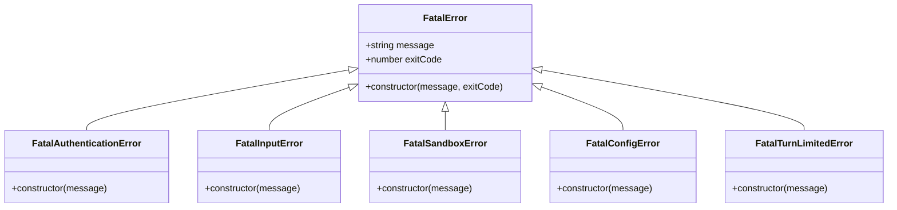

**图表来源**
- [errors.ts](file://packages/core/src/utils/errors.ts#L25-L50)

### 工具相关错误类型

工具执行过程中可能遇到的各种错误被归类到ToolErrorType枚举中：

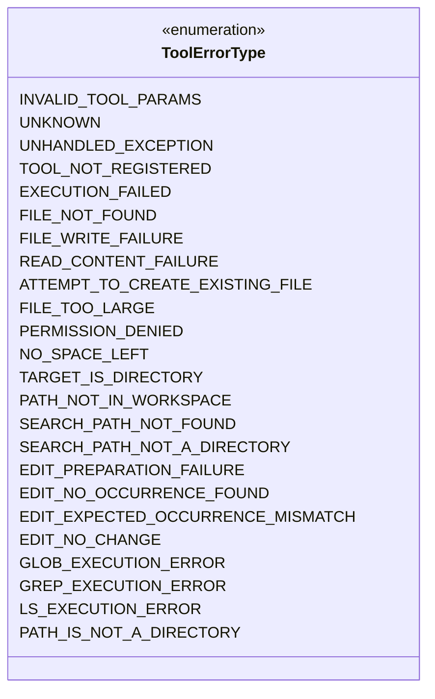

**图表来源**
- [tool-error.ts](file://packages/core/src/tools/tool-error.ts#L8-L44)

**章节来源**
- [errors.ts](file://packages/core/src/utils/errors.ts#L1-L103)
- [tool-error.ts](file://packages/core/src/tools/tool-error.ts#L1-L44)

## 错误报告机制

### 核心报告函数

errorReporting.ts模块提供了reportError函数，这是整个错误报告系统的核心：

```typescript
export async function reportError(
  error: Error | unknown,
  baseMessage: string,
  context?: Content[] | Record<string, unknown> | unknown[],
  type = 'general',
  reportingDir = os.tmpdir(),
): Promise<void>
```

### 报告数据结构

错误报告包含以下关键信息：

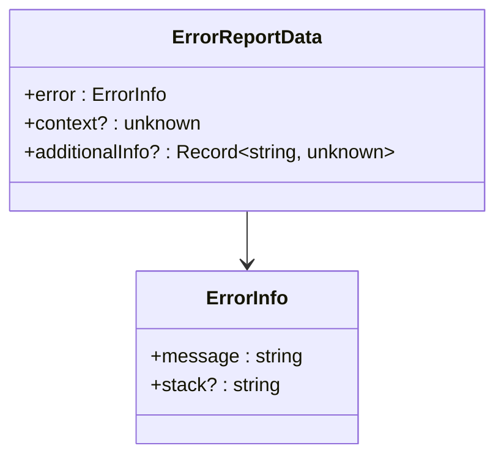

**图表来源**
- [errorReporting.ts](file://packages/core/src/utils/errorReporting.ts#L11-L16)

### 自动化报告生成流程

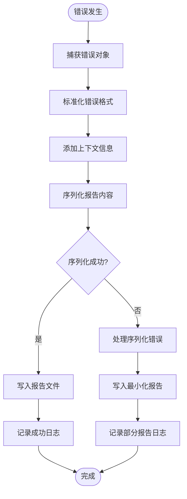

**图表来源**
- [errorReporting.ts](file://packages/core/src/utils/errorReporting.ts#L25-L118)

**章节来源**
- [errorReporting.ts](file://packages/core/src/utils/errorReporting.ts#L1-L119)

## 错误处理架构

### 多层次错误处理架构

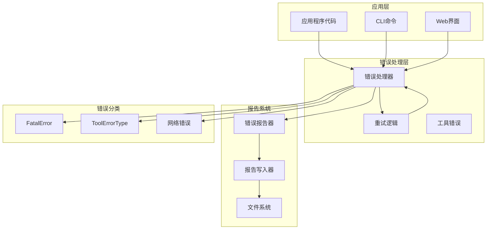

**图表来源**
- [errorHandler.ts](file://packages/core/src/core/openaiContentGenerator/errorHandler.ts#L1-L53)
- [retry.ts](file://packages/core/src/utils/retry.ts#L1-L258)

### 错误处理接口设计

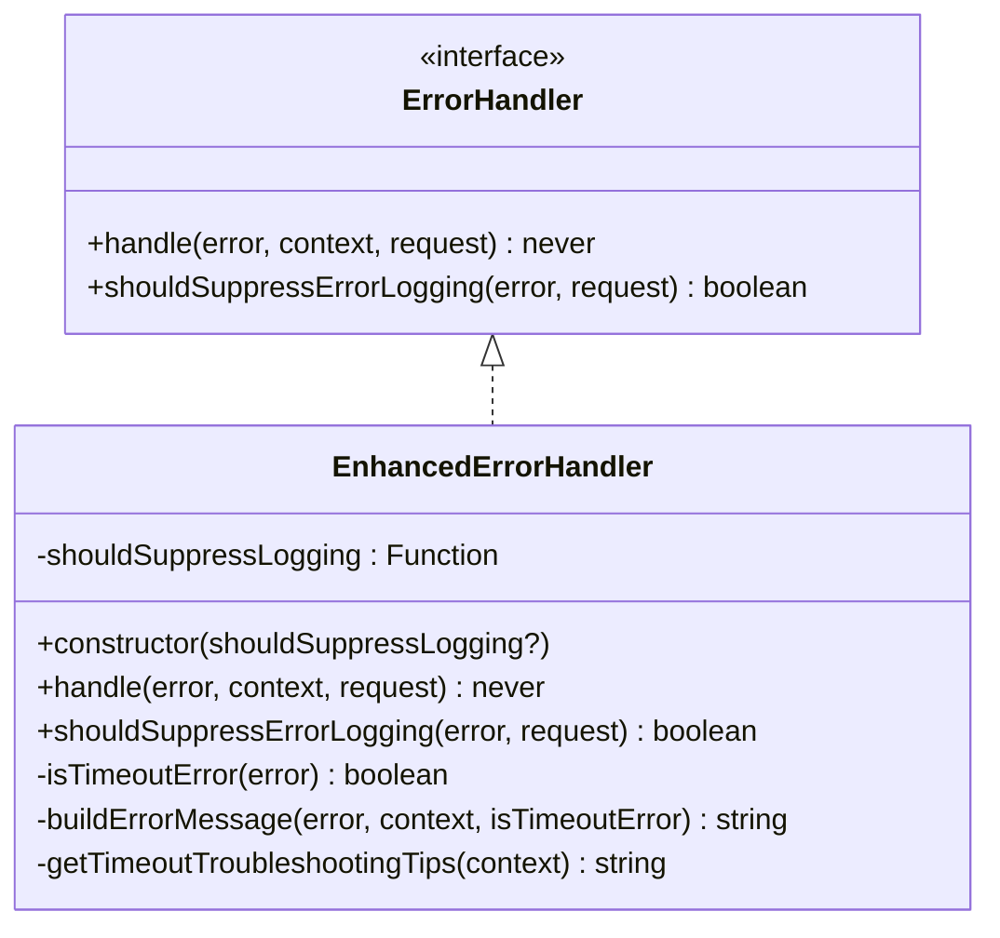

**图表来源**
- [errorHandler.ts](file://packages/core/src/core/openaiContentGenerator/errorHandler.ts#L10-L53)

**章节来源**
- [errorHandler.ts](file://packages/core/src/core/openaiContentGenerator/errorHandler.ts#L1-L53)

## 核心组件分析

### 错误报告器详细分析

#### 序列化安全处理

错误报告器实现了多层序列化安全机制：

```typescript
// 基础错误处理
let errorToReport: { message: string; stack?: string };
if (error instanceof Error) {
  errorToReport = { message: error.message, stack: error.stack };
} else if (typeof error === 'object' && error !== null && 'message' in error) {
  errorToReport = { message: String((error as { message: unknown }).message) };
} else {
  errorToReport = { message: String(error) };
}
```

#### 上下文数据处理

当上下文数据无法序列化时的降级策略：

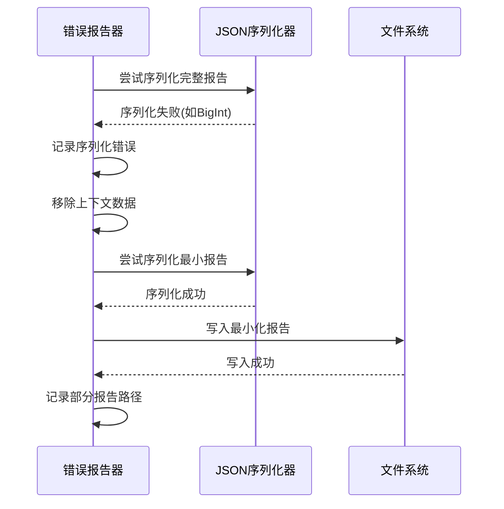

**图表来源**
- [errorReporting.ts](file://packages/core/src/utils/errorReporting.ts#L50-L87)

#### 文件写入失败处理

当报告文件写入失败时的回退机制：

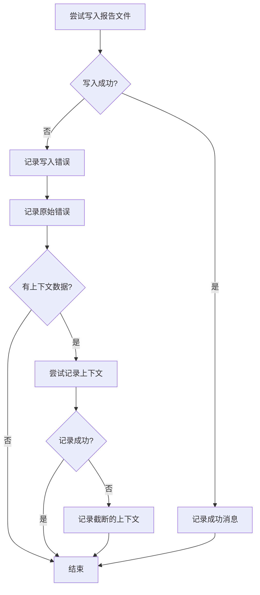

**图表来源**
- [errorReporting.ts](file://packages/core/src/utils/errorReporting.ts#L89-L117)

**章节来源**
- [errorReporting.ts](file://packages/core/src/utils/errorReporting.ts#L25-L118)

## 异常捕获场景

### Promise拒绝处理

系统能够捕获并处理各种Promise拒绝情况：

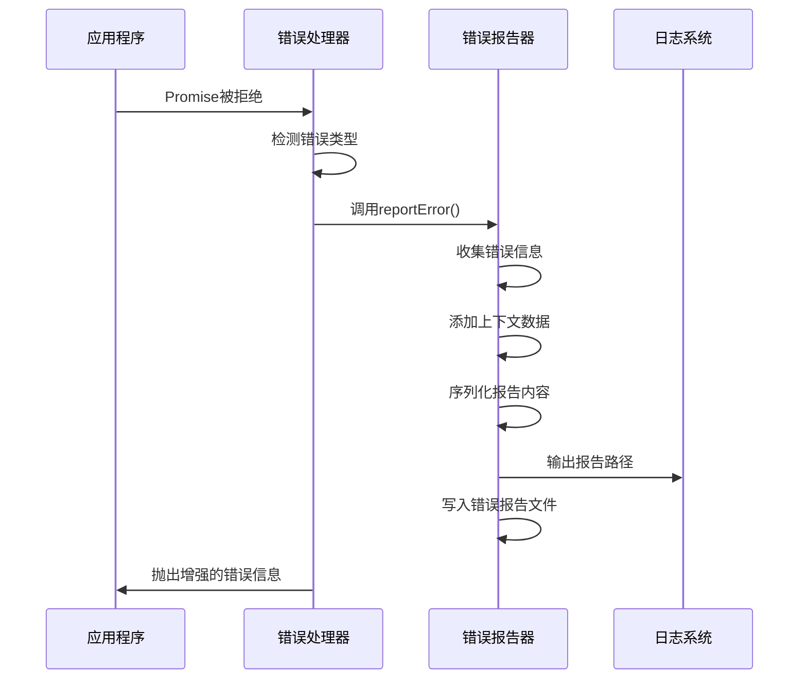

**图表来源**
- [errorReporting.ts](file://packages/core/src/utils/errorReporting.ts#L25-L118)

### 工具执行失败处理

工具执行失败时的错误分类和处理：

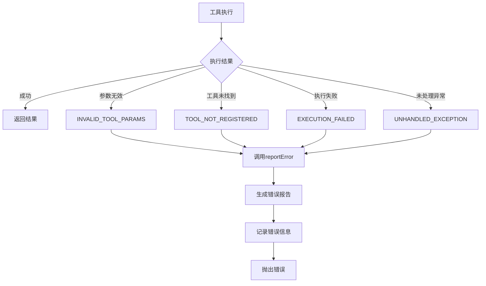

**图表来源**
- [tool-error.ts](file://packages/core/src/tools/tool-error.ts#L8-L44)
- [nonInteractiveToolExecutor.test.ts](file://packages/core/src/core/nonInteractiveToolExecutor.test.ts#L88-L243)

### 网络请求超时处理

专门针对网络请求超时的错误检测和处理：

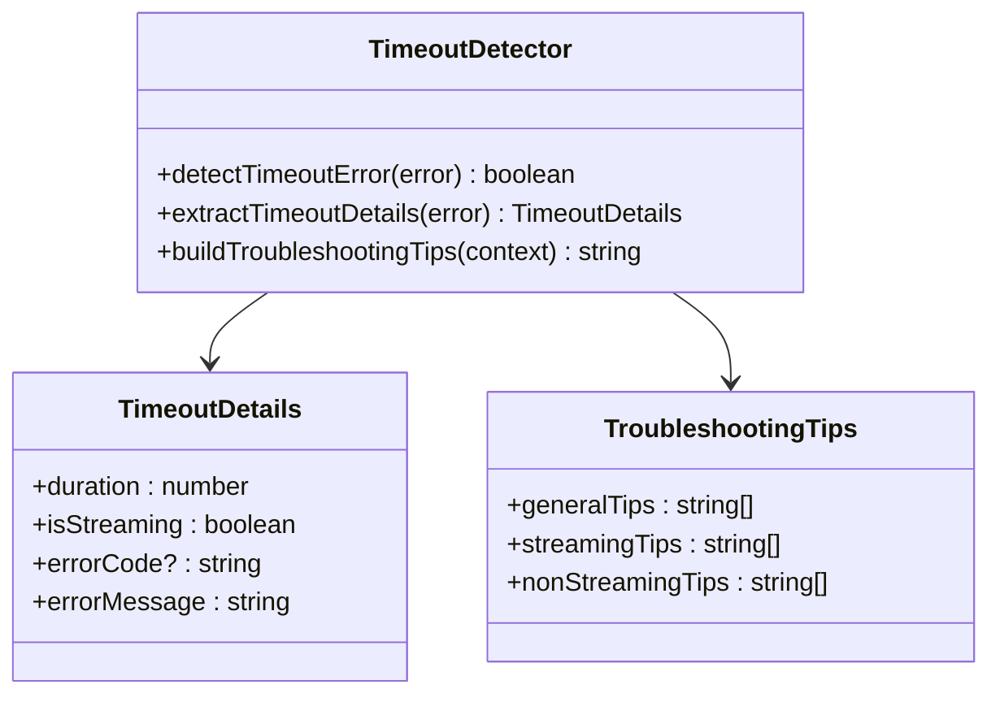

**图表来源**
- [errorHandler.ts](file://packages/core/src/core/openaiContentGenerator/errorHandler.ts#L1-L53)

**章节来源**
- [errorHandler.ts](file://packages/core/src/core/openaiContentGenerator/errorHandler.ts#L1-L53)
- [tool-error.ts](file://packages/core/src/tools/tool-error.ts#L1-L44)
- [nonInteractiveToolExecutor.test.ts](file://packages/core/src/core/nonInteractiveToolExecutor.test.ts#L88-L243)

## 调试与分析指南

### 错误堆栈分析

系统提供了详细的错误堆栈信息收集功能：

1. **标准Error对象**: 自动提取message和stack属性
2. **普通对象**: 提取message属性或转换为字符串
3. **字符串错误**: 直接作为消息内容

### 上下文数据分析

错误报告系统会智能地收集和分析上下文信息：

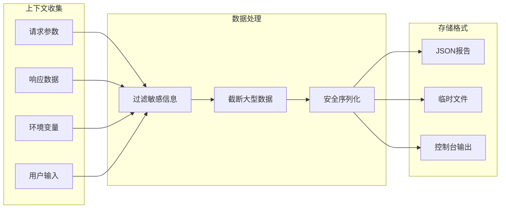

**图表来源**
- [errorReporting.ts](file://packages/core/src/utils/errorReporting.ts#L50-L87)

### 根本原因分析

通过组合错误类型、堆栈跟踪和上下文信息，开发者可以进行有效的根本原因分析：

1. **错误类型识别**: 快速定位错误类别
2. **时间戳追踪**: 精确的时间线分析
3. **上下文关联**: 关联相关的操作历史
4. **文件位置**: 定位错误发生的代码位置

**章节来源**
- [errorReporting.ts](file://packages/core/src/utils/errorReporting.ts#L25-L118)

## 最佳实践建议

### 错误处理最佳实践

1. **统一错误格式**: 使用标准化的错误对象结构
2. **适当的错误分类**: 根据错误性质选择合适的错误类型
3. **上下文信息收集**: 在错误发生时收集相关上下文
4. **异步错误处理**: 正确处理Promise拒绝和async/await异常

### 错误报告配置

```typescript
// 推荐的错误报告配置
const errorConfig = {
  // 错误类型分类
  errorTypes: {
    fatal: ['AUTHENTICATION', 'INPUT', 'SANDBOX', 'CONFIG', 'TURN_LIMITED'],
    transient: ['NETWORK', 'TIMEOUT', 'RATE_LIMIT'],
    permanent: ['PERMISSION', 'NOT_FOUND', 'INVALID']
  },
  
  // 报告级别设置
  reportingLevels: {
    debug: ['DEBUG', 'VERBOSE'],
    info: ['INFO', 'SUCCESS'],
    warning: ['WARNING', 'DEPRECATION'],
    error: ['ERROR', 'FATAL']
  }
};
```

### 调试技巧

1. **使用特定的错误类型**: 避免使用通用的Error对象
2. **添加详细的上下文**: 包含足够的调试信息
3. **定期检查错误报告**: 监控错误趋势和模式
4. **实现错误恢复机制**: 对于可恢复的错误提供重试逻辑

## 故障排除指南

### 常见错误场景及解决方案

#### 序列化失败

**问题**: 当上下文包含BigInt或其他不可序列化的对象时

**解决方案**:
```typescript
// 使用JSON.stringify的replacer函数
const safeStringify = (obj: any) => {
  return JSON.stringify(obj, (key, value) => {
    if (typeof value === 'bigint') {
      return value.toString();
    }
    return value;
  }, 2);
};
```

#### 文件写入权限问题

**问题**: 无法写入错误报告文件

**解决方案**:
1. 检查临时目录权限
2. 使用备用报告目录
3. 实现内存中的报告存储

#### 网络连接问题

**问题**: 网络请求超时或连接失败

**解决方案**:
1. 实现指数退避重试
2. 添加连接超时配置
3. 提供离线模式支持

### 错误监控和告警

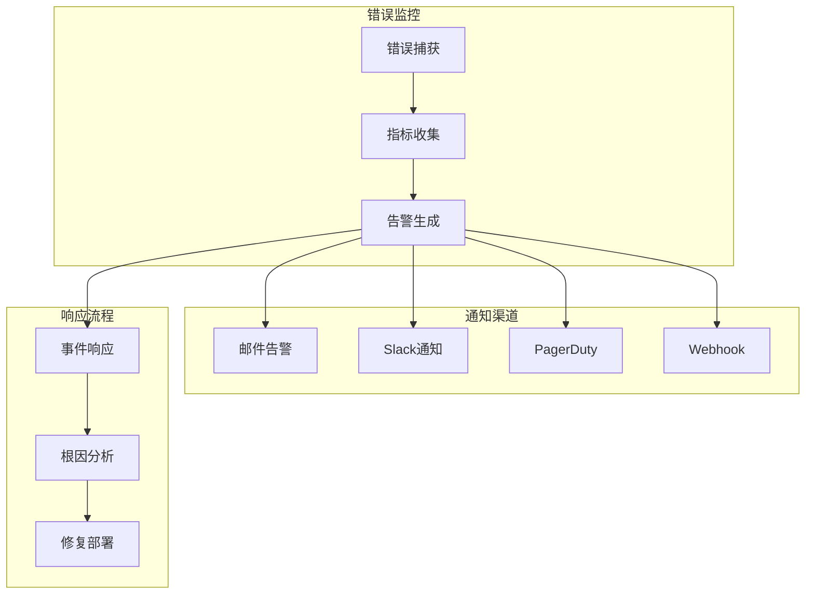

**章节来源**
- [errorReporting.ts](file://packages/core/src/utils/errorReporting.ts#L50-L117)
- [errorHandler.test.ts](file://packages/core/src/core/openaiContentGenerator/errorHandler.test.ts#L165-L363)

## 总结

Qwen代码助手项目的异常捕获与分析系统提供了一个全面而强大的错误处理框架。通过errorReporting.ts中的自动化报告生成机制，errors.ts中的错误分类体系，以及专门的错误处理器，开发者可以获得：

1. **全面的错误覆盖**: 从网络错误到工具执行失败的各种场景
2. **智能的错误分类**: 基于错误性质的精确分类和处理
3. **详细的上下文信息**: 丰富的调试信息支持问题定位
4. **可靠的报告机制**: 即使在极端情况下也能生成有用的错误报告
5. **灵活的扩展性**: 支持自定义错误类型和处理逻辑

这套系统不仅提高了开发效率，还为生产环境中的问题诊断和解决提供了强有力的支持。通过遵循本文档提供的最佳实践和故障排除指南，开发者可以更好地利用这些错误处理机制来构建更加稳定和可靠的软件系统。