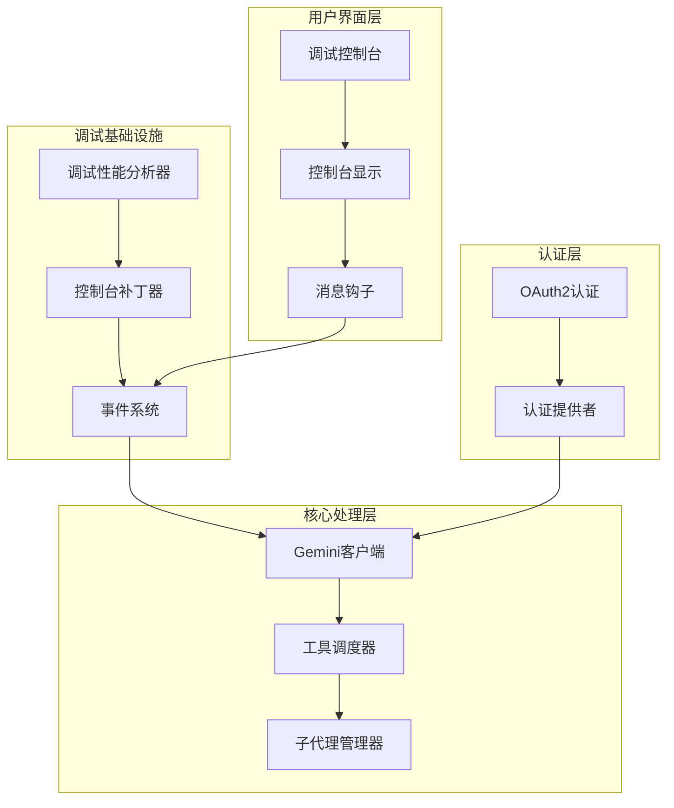
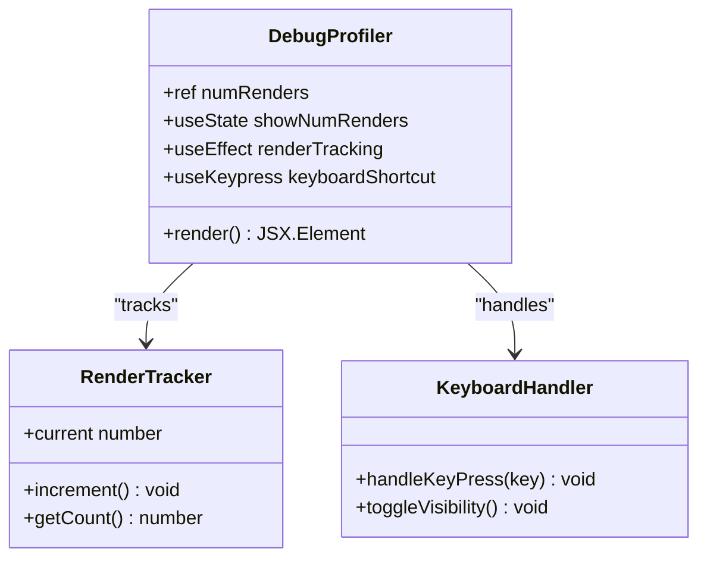
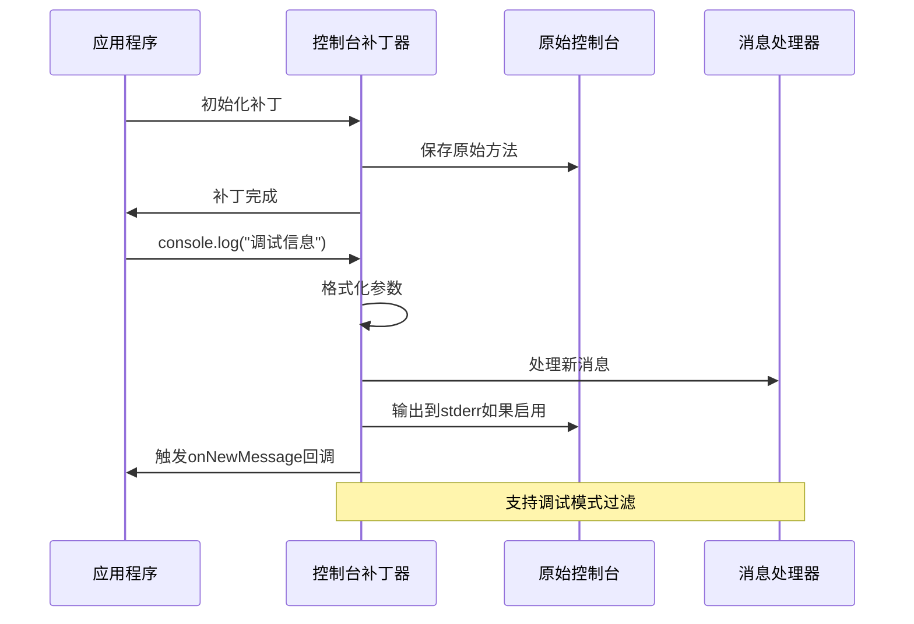
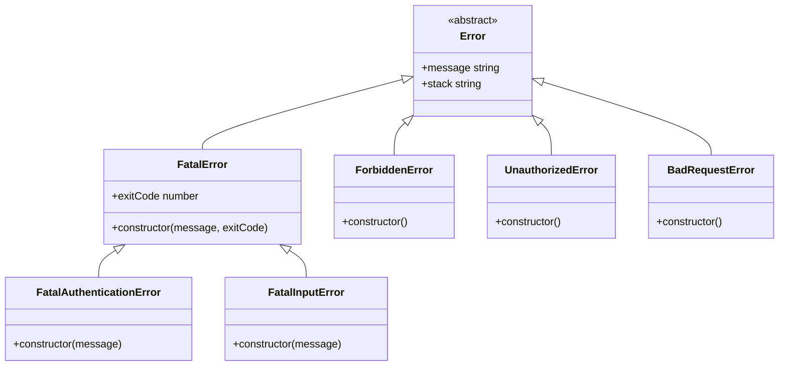
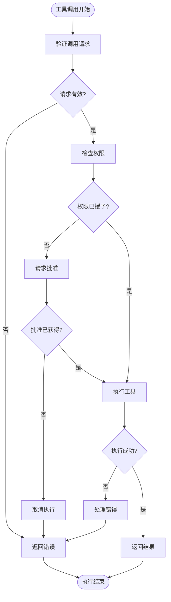
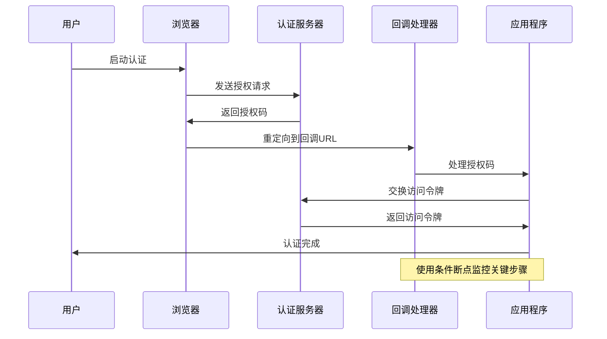

# 断点设置与调试

<cite>
**本文档引用的文件**
- [packages/cli/src/utils/errors.ts](file://packages/cli/src/utils/errors.ts)
- [packages/core/src/utils/errors.ts](file://packages/core/src/utils/errors.ts)
- [packages/cli/src/ui/components/DebugProfiler.tsx](file://packages/cli/src/ui/components/DebugProfiler.tsx)
- [packages/cli/src/ui/components/DetailedMessagesDisplay.tsx](file://packages/cli/src/ui/components/DetailedMessagesDisplay.tsx)
- [packages/cli/src/ui/utils/ConsolePatcher.ts](file://packages/cli/src/ui/utils/ConsolePatcher.ts)
- [packages/cli/src/ui/hooks/useConsoleMessages.ts](file://packages/cli/src/ui/hooks/useConsoleMessages.ts)
- [packages/cli/src/ui/components/ConsoleSummaryDisplay.tsx](file://packages/cli/src/ui/components/ConsoleSummaryDisplay.tsx)
- [packages/cli/src/utils/events.ts](file://packages/cli/src/utils/events.ts)
- [packages/core/src/core/client.ts](file://packages/core/src/core/client.ts)
- [packages/core/src/core/coreToolScheduler.ts](file://packages/core/src/core/coreToolScheduler.ts)
- [packages/core/src/code_assist/oauth2.ts](file://packages/core/src/code_assist/oauth2.ts)
- [packages/core/src/subagents/subagent.ts](file://packages/core/src/subagents/subagent.ts)
- [scripts/start.js](file://scripts/start.js)
- [CONTRIBUTING.md](file://CONTRIBUTING.md)
</cite>

## 目录
1. [简介](#简介)
2. [项目调试架构概览](#项目调试架构概览)
3. [核心调试组件分析](#核心调试组件分析)
4. [断点设置策略](#断点设置策略)
5. [异步函数调试技巧](#异步函数调试技巧)
6. [错误处理与调试](#错误处理与调试)
7. [工具调用链调试](#工具调用链调试)
8. [认证逻辑调试](#认证逻辑调试)
9. [性能监控与调试](#性能监控与调试)
10. [调试最佳实践](#调试最佳实践)
11. [故障排除指南](#故障排除指南)
12. [总结](#总结)

## 简介

本文档详细介绍了如何在Qwen Code项目中设置和使用断点进行有效调试。该项目是一个复杂的AI辅助开发工具，包含CLI界面、核心处理引擎、工具调度系统和认证模块等多个组件。通过合理的断点设置策略，开发者可以深入理解系统的运行机制，快速定位和解决问题。

## 项目调试架构概览

Qwen Code项目采用了多层次的调试架构，支持从底层工具执行到上层用户界面的全方位调试能力。

**图表来源**
- [packages/cli/src/ui/components/DebugProfiler.tsx](file://packages/cli/src/ui/components/DebugProfiler.tsx#L1-L35)
- [packages/cli/src/ui/utils/ConsolePatcher.ts](file://packages/cli/src/ui/utils/ConsolePatcher.ts#L1-L70)
- [packages/cli/src/utils/events.ts](file://packages/cli/src/utils/events.ts#L1-L13)

## 核心调试组件分析

### 调试性能分析器

调试性能分析器是项目中的重要调试组件，用于监控React组件的渲染次数和性能指标。

**图表来源**
- [packages/cli/src/ui/components/DebugProfiler.tsx](file://packages/cli/src/ui/components/DebugProfiler.tsx#L10-L35)

### 控制台补丁系统

控制台补丁系统提供了统一的日志管理和消息分发机制，支持调试模式下的增强日志输出。

**图表来源**
- [packages/cli/src/ui/utils/ConsolePatcher.ts](file://packages/cli/src/ui/utils/ConsolePatcher.ts#L20-L70)

**章节来源**
- [packages/cli/src/ui/components/DebugProfiler.tsx](file://packages/cli/src/ui/components/DebugProfiler.tsx#L1-L35)
- [packages/cli/src/ui/utils/ConsolePatcher.ts](file://packages/cli/src/ui/utils/ConsolePatcher.ts#L1-L70)

## 断点设置策略

### 在核心处理流程中设置断点

在Gemini客户端的核心处理流程中，可以在以下关键位置设置断点：

1. **初始化阶段**：在`initialize`方法中设置断点，检查内容生成器和聊天会话的初始化过程
2. **消息发送阶段**：在`sendMessageStream`方法中设置断点，监控流式响应的处理
3. **压缩阶段**：在`tryCompressChat`方法中设置断点，检查对话历史压缩逻辑
4. **循环检测**：在`loopDetector`相关方法中设置断点，监控循环检测机制

### 在工具调用链中设置断点

工具调度器是项目的核心组件之一，可以在以下位置设置断点：

1. **调度开始**：在`_schedule`方法中设置断点，监控工具调用请求的处理
2. **确认阶段**：在`shouldConfirmExecute`方法中设置断点，检查工具执行前的确认逻辑
3. **执行阶段**：在`execute`方法中设置断点，监控工具的实际执行过程
4. **完成阶段**：在`onAllToolCallsComplete`回调中设置断点，检查工具执行结果的处理

### 在认证逻辑中设置断点

认证模块涉及多个复杂的异步操作，可以在以下位置设置断点：

1. **OAuth2流程**：在`authWithWeb`方法中设置断点，监控完整的认证流程
2. **令牌获取**：在令牌存储和刷新相关方法中设置断点
3. **错误处理**：在认证失败时的错误处理逻辑中设置断点

**章节来源**
- [packages/core/src/core/client.ts](file://packages/core/src/core/client.ts#L100-L200)
- [packages/core/src/core/coreToolScheduler.ts](file://packages/core/src/core/coreToolScheduler.ts#L585-L614)
- [packages/core/src/code_assist/oauth2.ts](file://packages/core/src/code_assist/oauth2.ts#L244-L273)

## 异步函数调试技巧

### Promise链调试

项目中大量使用Promise链进行异步操作，调试时需要注意以下技巧：

1. **使用`.then()`和`.catch()`设置断点**：在Promise链的关键节点设置断点
2. **监控Promise状态变化**：观察Promise从pending到fulfilled或rejected的状态转换
3. **使用`async/await`语法**：在`async`函数中直接设置断点，简化调试流程

### 事件驱动调试

项目采用事件驱动架构，可以使用以下调试技巧：

1. **事件监听器断点**：在事件监听器中设置断点，监控事件触发时机
2. **事件传播追踪**：使用条件断点追踪特定事件的传播路径
3. **异步事件处理**：在异步事件处理函数中设置断点

### 流式数据调试

对于流式数据处理，可以使用以下调试策略：

1. **流事件断点**：在流的各个事件（data、end、error）中设置断点
2. **背压监控**：监控流的背压情况，识别潜在的性能问题
3. **数据转换断点**：在数据转换管道的关键节点设置断点

## 错误处理与调试

### 错误类型分析

项目定义了多种错误类型，每种错误都有其特定的调试策略：

**图表来源**
- [packages/core/src/utils/errors.ts](file://packages/core/src/utils/errors.ts#L25-L65)

### 错误产生前的调用栈分析

在错误发生前的调用栈中设置断点，可以帮助理解错误产生的根本原因：

1. **异常抛出前断点**：在错误构造函数调用前设置断点
2. **错误传播断点**：在错误传递过程中设置断点
3. **错误处理断点**：在错误处理逻辑中设置断点

### 变量状态检查

在错误调试过程中，需要特别关注以下变量状态：

1. **上下文状态**：检查当前执行上下文的状态信息
2. **配置参数**：验证配置参数是否符合预期
3. **外部依赖**：检查外部服务和API的响应状态

**章节来源**
- [packages/core/src/utils/errors.ts](file://packages/core/src/utils/errors.ts#L1-L103)
- [packages/cli/src/utils/errors.ts](file://packages/cli/src/utils/errors.ts#L1-L13)

## 工具调用链调试

### 工具注册与发现

工具调度器负责管理所有可用工具，调试时可以在以下位置设置断点：

1. **工具注册**：在`registerTool`方法中设置断点，监控工具的注册过程
2. **工具发现**：在`discoverTools`方法中设置断点，检查工具发现机制
3. **工具验证**：在工具验证和初始化过程中设置断点

### 工具执行流程

工具执行涉及多个步骤，每个步骤都可以设置断点进行调试：

**图表来源**
- [packages/core/src/core/coreToolScheduler.ts](file://packages/core/src/core/coreToolScheduler.ts#L585-L614)

### 批处理工具调用

对于批处理工具调用，可以使用以下调试策略：

1. **批量调度断点**：在批量调度开始时设置断点
2. **并发执行断点**：监控多个工具的并发执行状态
3. **结果聚合断点**：在结果聚合过程中设置断点

**章节来源**
- [packages/core/src/core/coreToolScheduler.ts](file://packages/core/src/core/coreToolScheduler.ts#L255-L281)

## 认证逻辑调试

### OAuth2认证流程

OAuth2认证是项目的重要安全特性，调试时需要关注整个认证流程：

**图表来源**
- [packages/core/src/code_assist/oauth2.ts](file://packages/core/src/code_assist/oauth2.ts#L244-L273)

### 认证状态管理

认证状态的管理涉及多个组件，调试时需要注意：

1. **状态同步断点**：在状态更新时设置断点
2. **令牌生命周期**：监控令牌的获取、刷新和过期过程
3. **错误恢复**：在认证失败时的错误恢复逻辑中设置断点

### 安全性检查

认证模块的安全性至关重要，调试时应重点关注：

1. **输入验证**：在用户输入验证过程中设置断点
2. **权限检查**：在权限验证逻辑中设置断点
3. **审计日志**：在安全相关操作的日志记录中设置断点

**章节来源**
- [packages/core/src/code_assist/oauth2.ts](file://packages/core/src/code_assist/oauth2.ts#L162-L196)

## 性能监控与调试

### 渲染性能监控

React组件的渲染性能对用户体验至关重要，可以通过以下方式监控：

1. **组件渲染计数**：使用DebugProfiler监控组件重新渲染次数
2. **渲染时间测量**：在组件渲染前后设置断点，测量渲染耗时
3. **内存泄漏检测**：监控组件卸载时的资源清理情况

### 工具执行性能

工具执行的性能直接影响系统响应速度，可以使用以下监控手段：

1. **执行时间统计**：在工具执行前后设置断点，统计执行时间
2. **并发限制**：监控并发执行的工具数量
3. **资源使用**：监控CPU和内存使用情况

### 网络请求性能

网络请求的性能对整体系统性能有重要影响：

1. **请求延迟**：在请求发送和接收时设置断点，测量延迟
2. **重试机制**：在重试逻辑中设置断点，监控重试行为
3. **超时处理**：在超时处理逻辑中设置断点

**章节来源**
- [packages/cli/src/ui/components/DebugProfiler.tsx](file://packages/cli/src/ui/components/DebugProfiler.tsx#L1-L35)

## 调试最佳实践

### 开发环境配置

在开发环境中启用调试功能的最佳实践：

1. **环境变量设置**：设置`DEBUG=true`启用调试模式
2. **启动参数配置**：使用`--inspect-brk`参数启动Node.js进程
3. **IDE集成**：配置VS Code等IDE的调试配置

### 条件断点使用

合理使用条件断点可以提高调试效率：

1. **状态条件**：根据变量状态设置条件断点
2. **计数条件**：设置基于执行次数的条件断点
3. **时间条件**：根据时间戳设置条件断点

### 日志级别控制

合理控制日志级别可以避免调试信息过多：

1. **调试模式**：在调试模式下启用详细日志
2. **生产模式**：在生产模式下减少日志输出
3. **动态调整**：支持运行时动态调整日志级别

### 调试工具集成

充分利用各种调试工具：

1. **浏览器开发者工具**：使用Chrome DevTools进行前端调试
2. **Node.js调试器**：使用内置的Node.js调试器
3. **性能分析器**：使用性能分析工具识别瓶颈

**章节来源**
- [scripts/start.js](file://scripts/start.js#L34-L75)
- [CONTRIBUTING.md](file://CONTRIBUTING.md#L208-L233)

## 故障排除指南

### 常见调试问题

在调试过程中可能遇到的常见问题及解决方案：

1. **断点不命中**：检查源码映射和编译配置
2. **异步断点丢失**：使用条件断点和日志输出
3. **内存泄漏**：使用内存分析工具定位泄漏点

### 错误诊断流程

建立标准化的错误诊断流程：

1. **问题复现**：确保问题可以稳定复现
2. **信息收集**：收集详细的错误信息和上下文
3. **逐步排查**：按照优先级逐步排查可能的原因
4. **解决方案验证**：验证解决方案的有效性

### 性能问题诊断

针对性能问题的诊断策略：

1. **热点识别**：使用性能分析工具识别性能瓶颈
2. **资源监控**：监控CPU、内存和网络资源使用
3. **优化建议**：基于诊断结果提出优化建议

**章节来源**
- [packages/cli/src/ui/components/DetailedMessagesDisplay.tsx](file://packages/cli/src/ui/components/DetailedMessagesDisplay.tsx#L1-L45)
- [packages/cli/src/ui/components/ConsoleSummaryDisplay.tsx](file://packages/cli/src/ui/components/ConsoleSummaryDisplay.tsx#L1-L34)

## 总结

本文档详细介绍了在Qwen Code项目中进行断点设置与调试的方法和技巧。通过合理使用断点、掌握异步调试技巧、理解错误处理机制，开发者可以更高效地进行问题诊断和系统优化。

关键要点包括：

1. **多层次调试架构**：项目提供了从底层工具执行到上层UI的完整调试支持
2. **智能断点设置**：在核心处理流程、工具调用链和认证逻辑中设置关键断点
3. **异步调试技巧**：掌握Promise链、事件驱动和流式数据的调试方法
4. **错误处理调试**：利用错误类型和调用栈信息进行问题定位
5. **性能监控**：通过渲染性能、工具执行和网络请求监控提升系统性能

通过遵循这些调试最佳实践，开发者可以更好地理解和维护这个复杂的AI辅助开发系统，快速解决各种技术问题，持续改进系统质量。