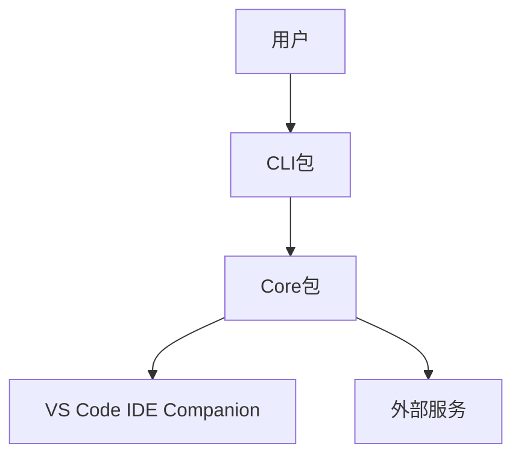
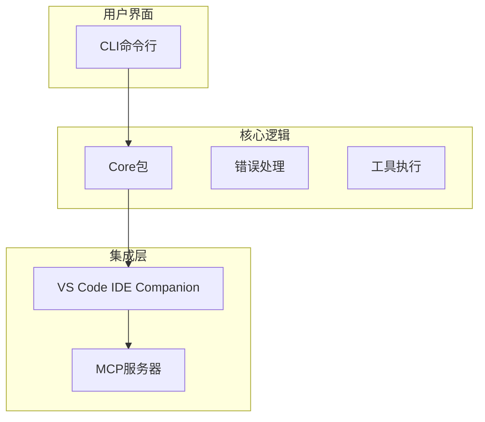
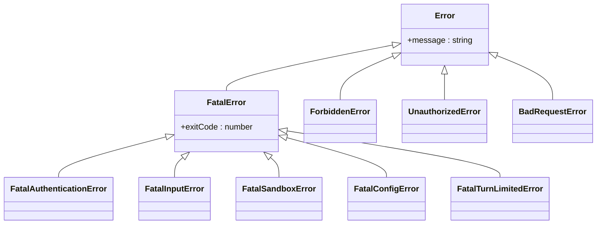
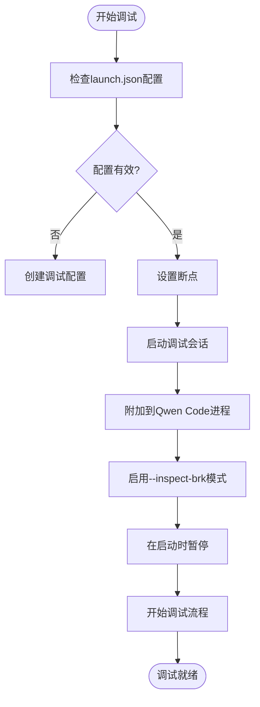
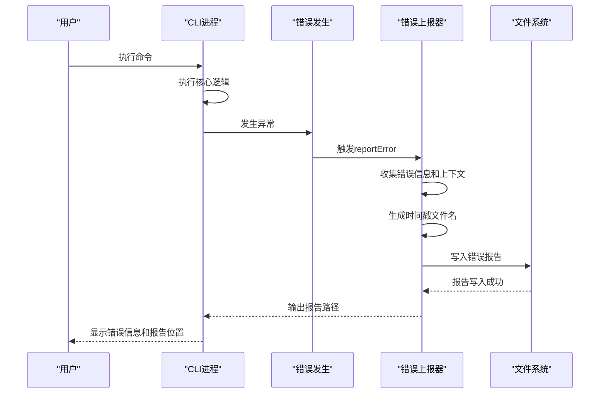
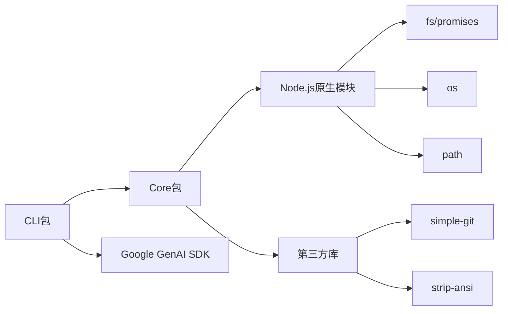

# 调试工具与断点调试

<cite>
**本文档中引用的文件**
- [errors.ts](file://packages/cli/src/utils/errors.ts)
- [errorReporting.ts](file://packages/core/src/utils/errorReporting.ts)
- [nonInteractiveCli.ts](file://packages/cli/src/nonInteractiveCli.ts)
- [launch.json](file://.vscode/launch.json)
- [package.json](file://package.json)
- [process-utils.ts](file://packages/core/src/ide/process-utils.ts)
- [ide-client.ts](file://packages/core/src/ide/ide-client.ts)
</cite>

## 目录
1. [简介](#简介)
2. [项目结构](#项目结构)
3. [核心组件](#核心组件)
4. [架构概述](#架构概述)
5. [详细组件分析](#详细组件分析)
6. [依赖分析](#依赖分析)
7. [性能考虑](#性能考虑)
8. [故障排除指南](#故障排除指南)
9. [结论](#结论)

## 简介
本文档详细介绍了如何使用Node.js调试器（如VS Code调试器）附加到Qwen Code进程进行断点调试。文档涵盖了如何配置`launch.json`以正确启动CLI应用并捕获异常，解释了`errors.ts`中定义的错误类型分类及其在调试过程中的意义，并展示了如何结合`errorReporting.ts`中的错误上报机制定位问题根源。此外，文档还提供了在核心处理流程、工具调用或认证流程中设置断点并检查变量状态的具体示例，以及如何使用调试工具分析异步调用栈和事件循环行为。

## 项目结构
Qwen Code项目采用多包工作区结构，主要包含以下几个核心包：
- `packages/cli`：命令行界面，用户交互入口
- `packages/core`：核心逻辑，包含主要业务功能
- `packages/test-utils`：测试工具
- `packages/vscode-ide-companion`：VS Code IDE集成扩展

CLI包作为主要的用户入口点，通过`nonInteractiveCli.ts`文件处理非交互式命令执行，而核心包则提供了底层服务和工具。

**Diagram sources**
- [package.json](file://package.json#L1-L10)
- [nonInteractiveCli.ts](file://packages/cli/src/nonInteractiveCli.ts#L1-L20)

**Section sources**
- [package.json](file://package.json#L1-L112)
- [nonInteractiveCli.ts](file://packages/cli/src/nonInteractiveCli.ts#L1-L139)

## 核心组件
核心组件包括错误处理系统、调试支持机制和IDE集成功能。`errors.ts`文件定义了多种错误类型，用于在不同场景下提供精确的错误信息。`errorReporting.ts`实现了错误上报功能，能够生成详细的错误报告并保存到临时文件中。CLI主入口`nonInteractiveCli.ts`包含了主要的执行逻辑，是调试的重点文件。

**Section sources**
- [errors.ts](file://packages/cli/src/utils/errors.ts#L1-L13)
- [errorReporting.ts](file://packages/core/src/utils/errorReporting.ts#L1-L119)
- [nonInteractiveCli.ts](file://packages/cli/src/nonInteractiveCli.ts#L1-L139)

## 架构概述
Qwen Code的架构采用分层设计，CLI层负责用户交互，Core层处理核心逻辑，IDE Companion层提供VS Code集成。调试时，可以通过VS Code调试器附加到CLI进程，利用Node.js的`--inspect-brk`参数在启动时暂停，便于设置初始断点。

**Diagram sources**
- [package.json](file://package.json#L1-L112)
- [nonInteractiveCli.ts](file://packages/cli/src/nonInteractiveCli.ts#L1-L139)

## 详细组件分析

### 错误处理系统分析
Qwen Code的错误处理系统设计精巧，通过继承机制实现了多种特定错误类型。

#### 错误类型分类

**Diagram sources**
- [errors.ts](file://packages/core/src/utils/errors.ts#L1-L71)

**Section sources**
- [errors.ts](file://packages/core/src/utils/errors.ts#L1-L71)

### 调试配置分析
为了有效调试Qwen Code，需要正确配置VS Code的`launch.json`文件。

#### launch.json配置示例

**Diagram sources**
- [package.json](file://package.json#L1-L112)
- [nonInteractiveCli.ts](file://packages/cli/src/nonInteractiveCli.ts#L1-L139)

**Section sources**
- [package.json](file://package.json#L1-L112)

### 错误上报机制分析
错误上报机制是调试过程中的重要辅助工具，能够在发生错误时生成详细的报告。

#### 错误上报流程

**Diagram sources**
- [errorReporting.ts](file://packages/core/src/utils/errorReporting.ts#L1-L119)

**Section sources**
- [errorReporting.ts](file://packages/core/src/utils/errorReporting.ts#L1-L119)

## 依赖分析
Qwen Code项目依赖于多个Node.js模块和内部包，这些依赖关系对于调试理解至关重要。

**Diagram sources**
- [package.json](file://package.json#L1-L112)
- [errors.ts](file://packages/core/src/utils/errors.ts#L1-L71)

**Section sources**
- [package.json](file://package.json#L1-L112)

## 性能考虑
在调试过程中，需要注意以下性能相关事项：
- 启用`--inspect-brk`模式会显著增加启动时间
- 错误报告生成可能会影响性能，特别是在频繁出错的情况下
- 大量断点设置可能导致调试器变慢
- 异步调用栈的分析需要额外的内存和处理资源

## 故障排除指南
当调试遇到问题时，可以参考以下常见问题的解决方案：

### 常见调试问题及解决方案
| 问题现象 | 可能原因 | 解决方案 |
|---------|--------|--------|
| 无法附加到进程 | 调试端口未开放 | 确保使用`--inspect-brk`参数启动 |
| 断点未命中 | 源码映射问题 | 检查sourceMap配置 |
| 调试器无响应 | 进程阻塞 | 检查事件循环是否被阻塞 |
| 错误报告未生成 | 权限问题 | 检查临时目录写入权限 |

**Section sources**
- [errors.ts](file://packages/cli/src/utils/errors.ts#L1-L13)
- [errorReporting.ts](file://packages/core/src/utils/errorReporting.ts#L1-L119)

## 结论
通过本文档的指导，开发者可以有效地使用VS Code调试器对Qwen Code进行断点调试。关键要点包括：
1. 正确配置`launch.json`以启用调试模式
2. 理解`errors.ts`中定义的错误类型分类，便于快速定位问题
3. 利用`errorReporting.ts`的错误上报机制获取详细的错误上下文
4. 在核心处理流程、工具调用和认证流程中合理设置断点
5. 使用调试工具分析异步调用栈和事件循环行为

这些调试技术将帮助开发者更高效地定位和解决Qwen Code中的问题。