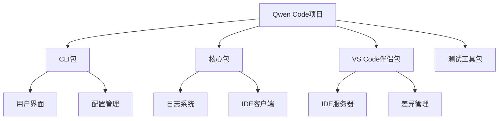
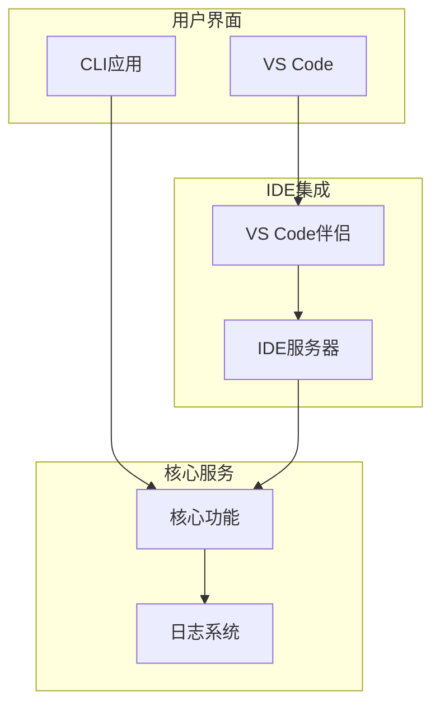
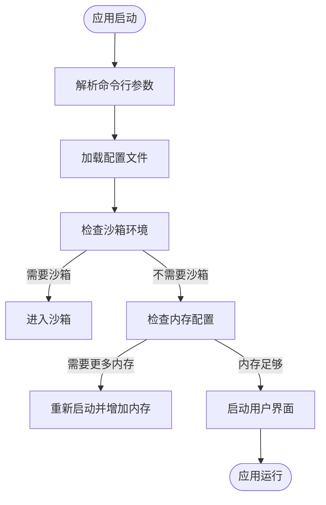
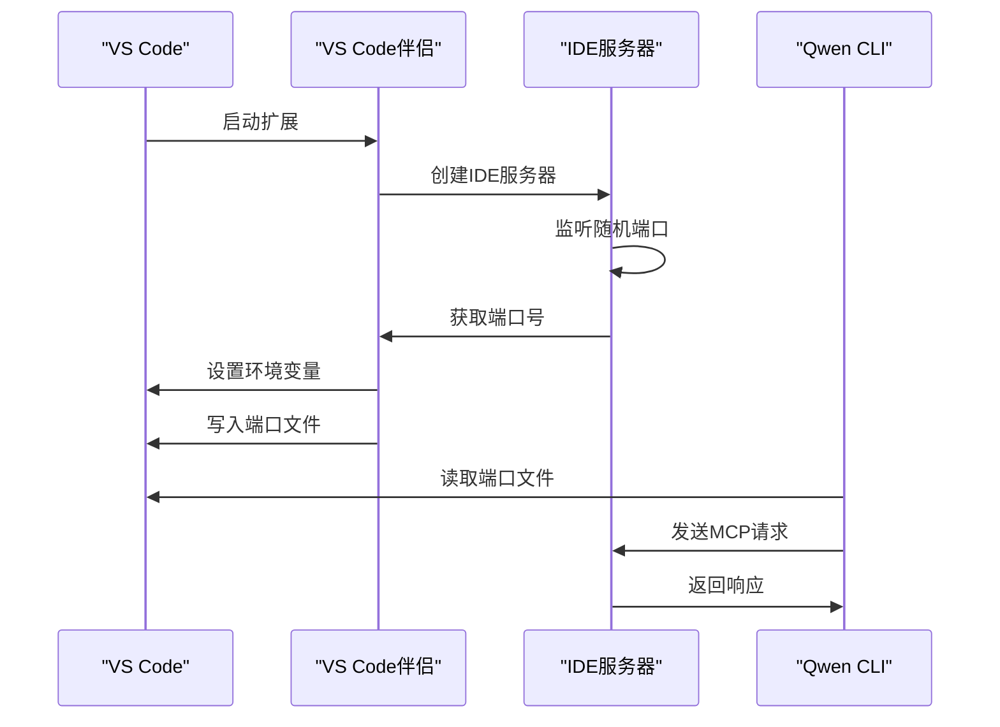
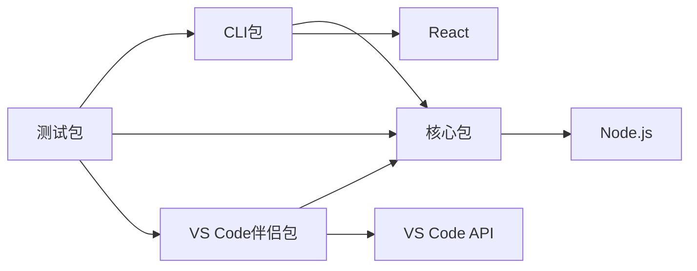

# 调试环境配置

<cite>
**本文档中引用的文件**  
- [gemini.tsx](file://packages/cli/src/gemini.tsx)
- [logger.ts](file://packages/core/src/core/logger.ts)
- [ide-server.ts](file://packages/vscode-ide-companion/src/ide-server.ts)
- [package.json](file://packages/cli/package.json)
</cite>

## 目录
1. [简介](#简介)
2. [项目结构](#项目结构)
3. [核心组件](#核心组件)
4. [架构概述](#架构概述)
5. [详细组件分析](#详细组件分析)
6. [依赖分析](#依赖分析)
7. [性能考虑](#性能考虑)
8. [故障排除指南](#故障排除指南)
9. [结论](#结论)
10. [附录](#附录)（如有必要）

## 简介
本文档详细介绍了如何在VS Code中配置`launch.json`文件以正确启动Qwen Code CLI应用。文档涵盖了必要的启动参数、环境变量设置、工作目录配置，以及如何启用调试模式并确保日志输出与调试器同步。结合`logger.ts`中的日志级别控制机制，指导开发者如何调整日志详细程度以配合调试需求，并提供完整的配置示例。

## 项目结构
Qwen Code项目采用模块化结构，主要包含CLI、核心功能、测试工具和VS Code IDE伴侣等组件。CLI包是主要的用户交互入口，核心包提供基础服务，VS Code伴侣包实现与IDE的深度集成。



**Diagram sources**
- [project_structure](file://project_structure)

**Section sources**
- [project_structure](file://project_structure)

## 核心组件
Qwen Code的核心组件包括CLI入口、日志系统、IDE集成和调试支持。CLI通过`gemini.tsx`文件作为主入口，日志系统由`logger.ts`实现，IDE集成通过`ide-server.ts`提供服务。

**Section sources**
- [gemini.tsx](file://packages/cli/src/gemini.tsx#L1-L403)
- [logger.ts](file://packages/core/src/core/logger.ts#L1-L460)
- [ide-server.ts](file://packages/vscode-ide-companion/src/ide-server.ts#L1-L346)

## 架构概述
Qwen Code采用分层架构，CLI层负责用户交互，核心层提供业务逻辑，IDE伴侣层实现与VS Code的深度集成。调试环境配置主要涉及CLI层和IDE伴侣层的协同工作。



**Diagram sources**
- [gemini.tsx](file://packages/cli/src/gemini.tsx#L1-L403)
- [logger.ts](file://packages/core/src/core/logger.ts#L1-L460)
- [ide-server.ts](file://packages/vscode-ide-companion/src/ide-server.ts#L1-L346)

## 详细组件分析

### CLI入口分析
CLI的入口文件`gemini.tsx`负责初始化应用、处理命令行参数、加载配置和启动用户界面。它还包含调试模式的支持和内存管理功能。



**Diagram sources**
- [gemini.tsx](file://packages/cli/src/gemini.tsx#L1-L403)

**Section sources**
- [gemini.tsx](file://packages/cli/src/gemini.tsx#L1-L403)

### 日志系统分析
日志系统由`logger.ts`实现，提供会话管理、消息记录、检查点保存和模型切换日志等功能。日志文件存储在项目临时目录中，支持JSON格式的结构化日志。

#### 类图
```mermaid
classDiagram
class Logger {
+string qwenDir
+string logFilePath
+string sessionId
+number messageId
+boolean initialized
+LogEntry[] logs
+initialize() Promise~void~
+logMessage(type, message) Promise~void~
+logModelSwitch(event) Promise~void~
+saveCheckpoint(conversation, tag) Promise~void~
+loadCheckpoint(tag) Promise~Content[]~
+deleteCheckpoint(tag) Promise~boolean~
+checkpointExists(tag) Promise~boolean~
+close() void
}
class LogEntry {
+string sessionId
+number messageId
+string timestamp
+MessageSenderType type
+string message
}
class ModelSwitchEvent {
+string fromModel
+string toModel
+string reason
+string context
}
enum MessageSenderType {
USER
MODEL_SWITCH
}
Logger --> LogEntry : "记录"
Logger --> ModelSwitchEvent : "记录"
```

**Diagram sources**
- [logger.ts](file://packages/core/src/core/logger.ts#L1-L460)

**Section sources**
- [logger.ts](file://packages/core/src/core/logger.ts#L1-L460)

### IDE服务器分析
IDE服务器由`ide-server.ts`实现，负责在VS Code中启动HTTP服务器，处理MCP（Model Context Protocol）请求，并与CLI应用通信。服务器通过端口文件和环境变量与外部通信。

#### 序列图


**Diagram sources**
- [ide-server.ts](file://packages/vscode-ide-companion/src/ide-server.ts#L1-L346)

**Section sources**
- [ide-server.ts](file://packages/vscode-ide-companion/src/ide-server.ts#L1-L346)

## 依赖分析
Qwen Code的组件之间存在明确的依赖关系。CLI依赖核心包提供基础服务，VS Code伴侣包依赖核心包的IDE客户端功能，测试包依赖所有其他组件进行集成测试。



**Diagram sources**
- [package.json](file://packages/cli/package.json#L1-L89)
- [package.json](file://packages/core/package.json)
- [package.json](file://packages/vscode-ide-companion/package.json)

**Section sources**
- [package.json](file://packages/cli/package.json#L1-L89)

## 性能考虑
Qwen Code在启动时会自动检查系统内存并可能重新启动以配置更大的堆空间。日志系统采用异步文件操作以避免阻塞主线程，IDE服务器使用HTTP长连接保持会话。

## 故障排除指南
当调试环境配置出现问题时，可以检查以下方面：端口文件是否存在、环境变量是否正确设置、日志文件是否有错误信息、IDE服务器是否正常启动。

**Section sources**
- [ide-server.ts](file://packages/vscode-ide-companion/src/ide-server.ts#L1-L346)
- [logger.ts](file://packages/core/src/core/logger.ts#L1-L460)

## 结论
通过正确配置`launch.json`文件，开发者可以在VS Code中高效调试Qwen Code CLI应用。关键是要理解CLI、核心服务和IDE伴侣之间的交互机制，合理设置启动参数和环境变量，并利用日志系统进行问题诊断。

## 附录

### VS Code launch.json配置示例
```json
{
  "version": "0.2.0",
  "configurations": [
    {
      "name": "调试Qwen CLI",
      "type": "node",
      "request": "launch",
      "program": "${workspaceFolder}/packages/cli/dist/index.js",
      "cwd": "${workspaceFolder}",
      "env": {
        "NODE_OPTIONS": "--max-old-space-size=4096",
        "DEBUG_MODE": "true"
      },
      "console": "integratedTerminal",
      "autoAttachChildProcesses": true
    }
  ]
}
```

此配置示例展示了如何在VS Code中设置调试环境，包括指定程序入口、工作目录、环境变量和控制台选项。