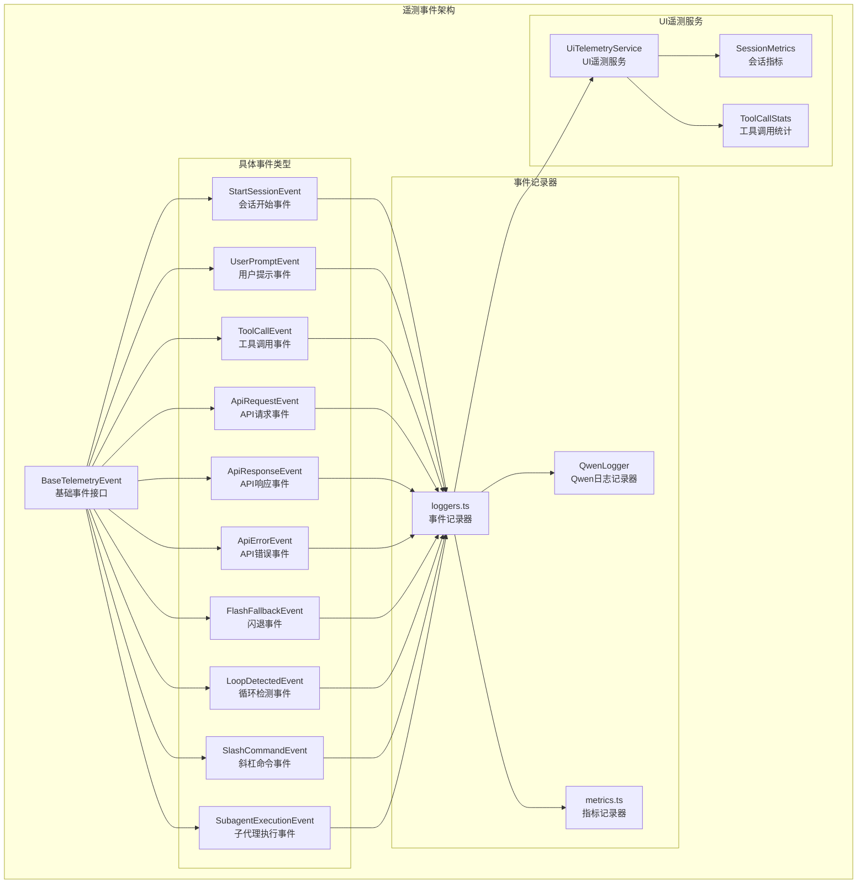
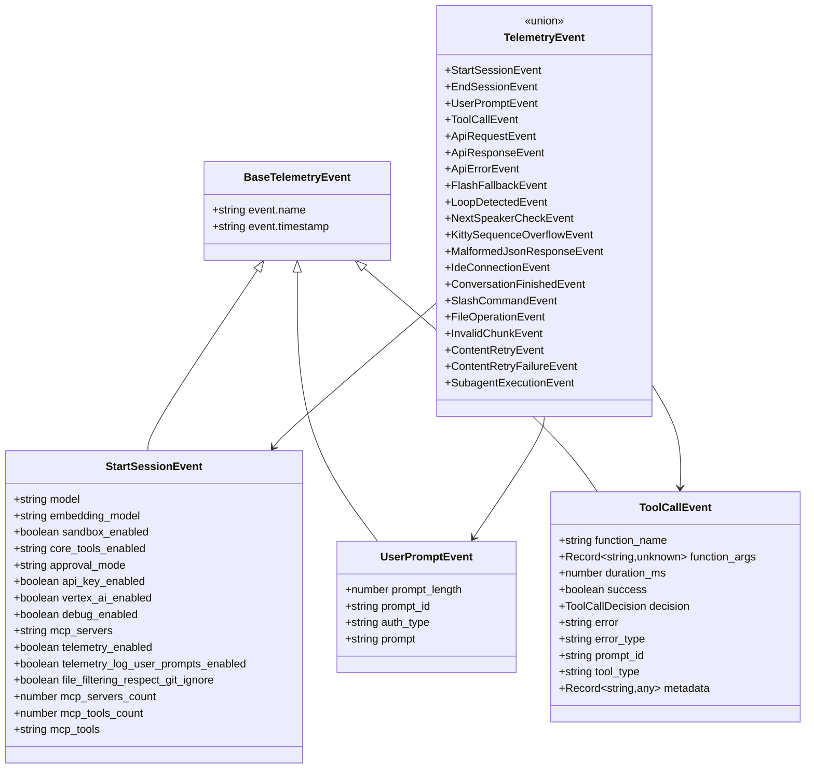
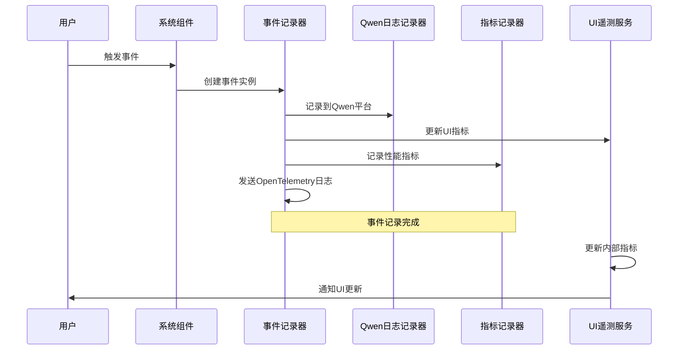
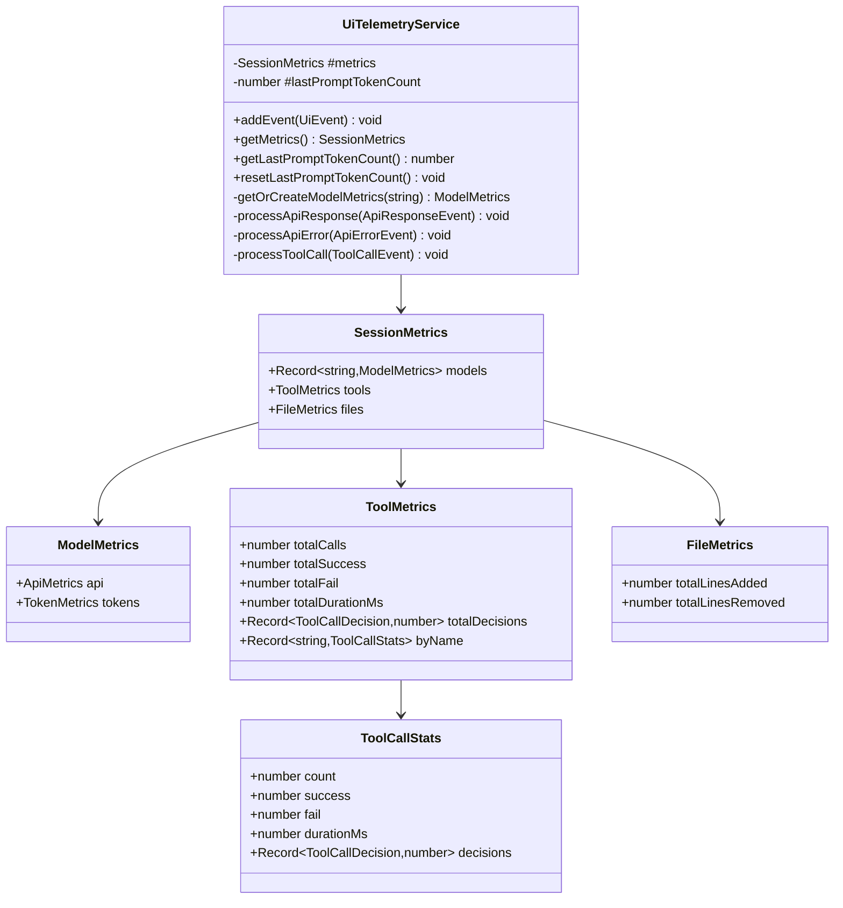

# 遥测事件类型

<cite>
**本文档中引用的文件**
- [types.ts](file://packages/core/src/telemetry/types.ts)
- [loggers.ts](file://packages/core/src/telemetry/loggers.ts)
- [constants.ts](file://packages/core/src/telemetry/constants.ts)
- [uiTelemetry.ts](file://packages/core/src/telemetry/uiTelemetry.ts)
- [tool-call-decision.ts](file://packages/core/src/telemetry/tool-call-decision.ts)
- [qwen-logger/event-types.ts](file://packages/core/src/telemetry/qwen-logger/event-types.ts)
</cite>

## 目录
1. [简介](#简介)
2. [遥测事件架构概述](#遥测事件架构概述)
3. [核心遥测事件类型](#核心遥测事件类型)
4. [详细事件类型分析](#详细事件类型分析)
5. [事件创建和记录机制](#事件创建和记录机制)
6. [UI遥测服务](#ui遥测服务)
7. [性能考虑](#性能考虑)
8. [故障排除指南](#故障排除指南)
9. [结论](#结论)

## 简介

Qwen Code是一个功能强大的AI编程助手，它通过全面的遥测系统来监控和记录用户交互、工具使用、API调用等各种关键活动。该系统定义了一套完整的遥测事件类型，用于收集系统行为数据、性能指标和用户体验信息。

遥测事件系统的核心目标是：
- 提供对用户行为的深入洞察
- 监控系统性能和可靠性
- 支持产品优化和功能改进
- 确保系统的可维护性和可观测性

## 遥测事件架构概述

Qwen Code的遥测事件系统采用分层架构设计，包含基础事件接口、具体事件类型定义、事件记录器和UI遥测服务等多个组件。



**图表来源**
- [types.ts](file://packages/core/src/telemetry/types.ts#L20-L30)
- [loggers.ts](file://packages/core/src/telemetry/loggers.ts#L1-L50)

## 核心遥测事件类型

Qwen Code定义了15种主要的遥测事件类型，每种事件都针对特定的系统行为或用户交互场景。这些事件构成了完整的遥测体系，覆盖了从系统启动到用户交互的各个阶段。



**图表来源**
- [types.ts](file://packages/core/src/telemetry/types.ts#L518-L557)
- [types.ts](file://packages/core/src/telemetry/types.ts#L20-L30)

**章节来源**
- [types.ts](file://packages/core/src/telemetry/types.ts#L518-L557)

## 详细事件类型分析

### StartSessionEvent（会话开始事件）

`StartSessionEvent`记录系统启动时的配置信息和环境设置，为后续的遥测分析提供基础数据。

**字段说明：**
- `model`: 当前使用的AI模型名称
- `embedding_model`: 嵌入模型配置
- `sandbox_enabled`: 沙盒模式是否启用
- `core_tools_enabled`: 核心工具启用状态
- `approval_mode`: 审批模式配置
- `api_key_enabled`: API密钥认证启用状态
- `vertex_ai_enabled`: Vertex AI集成状态
- `debug_enabled`: 调试模式启用状态
- `mcp_servers`: MCP服务器配置
- `telemetry_enabled`: 遥测功能启用状态
- `telemetry_log_user_prompts_enabled`: 用户提示日志启用状态
- `file_filtering_respect_git_ignore`: Git忽略规则启用状态
- `mcp_servers_count`: MCP服务器数量
- `mcp_tools_count`: MCP工具数量
- `mcp_tools`: MCP工具列表

**触发场景：**
- CLI应用启动时
- IDE扩展初始化时
- 新会话创建时

### UserPromptEvent（用户提示事件）

`UserPromptEvent`记录用户输入的提示信息，包括长度、标识符和可选的认证类型。

**字段说明：**
- `prompt_length`: 提示文本的字符长度
- `prompt_id`: 唯一的提示标识符
- `auth_type`: 认证类型（如API密钥、OAuth等）
- `prompt`: 完整的提示文本（仅在遥测启用时记录）

**触发场景：**
- 用户提交新提示时
- 批量处理多个提示时
- 不同认证方式下的提示处理

### ToolCallEvent（工具调用事件）

`ToolCallEvent`是最复杂的遥测事件之一，记录了工具调用的完整生命周期。

**字段说明：**
- `function_name`: 被调用的函数名称
- `function_args`: 函数参数对象
- `duration_ms`: 工具执行持续时间（毫秒）
- `success`: 调用是否成功
- `decision`: 工具调用决策（接受、拒绝、修改、自动接受）
- `error`: 错误消息（如果有）
- `error_type`: 错误类型
- `prompt_id`: 关联的提示标识符
- `tool_type`: 工具类型（原生工具或MCP工具）
- `metadata`: 元数据对象，可能包含文件操作统计信息

**触发场景：**
- 所有工具调用完成后
- 工具执行成功时
- 工具执行失败时
- 文件操作工具（如编辑、写入）完成时

### ApiRequestEvent（API请求事件）

`ApiRequestEvent`记录向外部API发送的请求信息。

**字段说明：**
- `model`: 使用的AI模型
- `prompt_id`: 关联的提示标识符
- `request_text`: 请求文本内容

**触发场景：**
- 向AI模型发送请求前
- API调用准备阶段
- 请求构建完成时

### ApiResponseEvent（API响应事件）

`ApiResponseEvent`记录来自外部API的响应信息，包括详细的令牌使用情况。

**字段说明：**
- `response_id`: 响应唯一标识符
- `model`: 使用的AI模型
- `status_code`: HTTP状态码
- `duration_ms`: 响应延迟时间
- `error`: 错误信息（如果有）
- `input_token_count`: 输入令牌数
- `output_token_count`: 输出令牌数
- `cached_content_token_count`: 缓存内容令牌数
- `thoughts_token_count`: 思考令牌数
- `tool_token_count`: 工具令牌数
- `total_token_count`: 总令牌数
- `response_text`: 响应文本内容
- `prompt_id`: 关联的提示标识符
- `auth_type`: 认证类型

**触发场景：**
- 接收到完整的API响应时
- 响应解析完成时
- 令牌计数计算完成时

### ApiErrorEvent（API错误事件）

`ApiErrorEvent`专门记录API调用过程中的错误信息。

**字段说明：**
- `response_id`: 响应唯一标识符
- `model`: 使用的AI模型
- `error`: 错误描述
- `error_type`: 错误类型
- `status_code`: HTTP状态码
- `duration_ms`: 错误发生时的延迟时间
- `prompt_id`: 关联的提示标识符
- `auth_type`: 认证类型

**触发场景：**
- API请求超时时
- HTTP错误响应时
- 认证失败时
- 网络连接问题时

### FlashFallbackEvent（闪退事件）

`FlashFallbackEvent`记录当主要AI模型不可用时，系统切换到备用模型的情况。

**字段说明：**
- `auth_type`: 认证类型

**触发场景：**
- 主要模型调用失败时
- 服务不可用时
- 负载均衡触发时

### LoopDetectedEvent（循环检测事件）

`LoopDetectedEvent`记录系统检测到潜在循环的情况。

**字段说明：**
- `loop_type`: 循环类型枚举
- `prompt_id`: 关联的提示标识符

**循环类型枚举：**
- `consecutive_identical_tool_calls`: 连续相同的工具调用
- `chanting_identical_sentences`: 反复输出相同句子
- `llm_detected_loop`: LLM检测到的循环

**触发场景：**
- 检测到连续重复的工具调用时
- 发现文本重复模式时
- LLM报告循环问题时

### SlashCommandEvent（斜杠命令事件）

`SlashCommandEvent`记录用户执行斜杠命令的操作。

**字段说明：**
- `command`: 主命令名称
- `subcommand`: 子命令名称（可选）
- `status`: 命令执行状态

**状态枚举：**
- `SUCCESS`: 命令执行成功
- `ERROR`: 命令执行出错

**触发场景：**
- 用户输入斜杠命令时
- 命令解析完成时
- 命令执行结果返回时

### SubagentExecutionEvent（子代理执行事件）

`SubagentExecutionEvent`记录子代理的执行状态变化。

**字段说明：**
- `subagent_name`: 子代理名称
- `status`: 执行状态
- `terminate_reason`: 终止原因（可选）
- `result`: 执行结果（可选）
- `execution_summary`: 执行摘要（可选）

**状态枚举：**
- `started`: 开始执行
- `completed`: 执行完成
- `failed`: 执行失败
- `cancelled`: 执行取消

**触发场景：**
- 子代理启动时
- 子代理完成时
- 子代理异常终止时
- 子代理被取消时

**章节来源**
- [types.ts](file://packages/core/src/telemetry/types.ts#L88-L557)

## 事件创建和记录机制

Qwen Code的遥测事件创建和记录遵循统一的模式，确保所有事件都能被正确捕获、处理和存储。



**图表来源**
- [loggers.ts](file://packages/core/src/telemetry/loggers.ts#L46-L66)
- [uiTelemetry.ts](file://packages/core/src/telemetry/uiTelemetry.ts#L112-L165)

### 事件创建流程

1. **事件实例化**: 根据具体事件类型创建相应的事件对象
2. **属性填充**: 设置事件的基本属性和业务数据
3. **上下文添加**: 添加会话ID、用户邮箱等通用上下文信息
4. **验证检查**: 确保事件数据的完整性和有效性

### 事件记录流程

1. **Qwen平台记录**: 将事件发送到Qwen遥测平台
2. **UI遥测更新**: 更新前端显示的实时指标
3. **指标聚合**: 在指标记录器中进行统计和聚合
4. **OpenTelemetry日志**: 发送到OpenTelemetry系统进行进一步处理

**章节来源**
- [loggers.ts](file://packages/core/src/telemetry/loggers.ts#L46-L594)

## UI遥测服务

UI遥测服务是Qwen Code遥测系统的重要组成部分，负责实时收集和处理与用户界面交互相关的指标数据。

### UI遥测服务架构



**图表来源**
- [uiTelemetry.ts](file://packages/core/src/telemetry/uiTelemetry.ts#L112-L237)

### 指标收集和聚合

UI遥测服务通过以下方式收集和聚合指标：

1. **API响应指标**: 记录API调用次数、延迟时间和令牌使用情况
2. **工具调用指标**: 跟踪工具使用频率、成功率和执行时间
3. **文件操作指标**: 统计文件添加和删除的行数
4. **决策统计**: 分析工具调用的决策类型分布

### 实时更新机制

UI遥测服务通过事件发射器模式实现实时更新：

```typescript
// 事件处理示例
addEvent(event: UiEvent) {
  switch (event['event.name']) {
    case EVENT_API_RESPONSE:
      this.processApiResponse(event);
      break;
    case EVENT_API_ERROR:
      this.processApiError(event);
      break;
    case EVENT_TOOL_CALL:
      this.processToolCall(event);
      break;
  }
  
  // 发送更新通知
  this.emit('update', {
    metrics: this.#metrics,
    lastPromptTokenCount: this.#lastPromptTokenCount,
  });
}
```

**章节来源**
- [uiTelemetry.ts](file://packages/core/src/telemetry/uiTelemetry.ts#L112-L237)

## 性能考虑

遥测系统的设计充分考虑了性能影响，采用了多种优化策略：

### 异步处理
- 所有遥测事件的记录都是异步的，不会阻塞主业务流程
- 使用事件发射器模式解耦事件处理逻辑

### 条件记录
- 用户提示内容只有在遥测启用且允许记录时才记录
- 大型数据结构会被截断或序列化后记录

### 内存管理
- 使用LRU缓存管理事件历史
- 及时清理过期的会话数据

### 批量处理
- 多个相关事件可以批量处理以提高效率
- 减少I/O操作次数

## 故障排除指南

### 常见问题和解决方案

1. **遥测事件丢失**
   - 检查遥测SDK是否正确初始化
   - 验证网络连接状态
   - 确认事件队列未满

2. **指标不准确**
   - 检查时间戳格式是否正确
   - 验证令牌计数计算逻辑
   - 确认事件处理顺序

3. **内存泄漏**
   - 监控事件队列大小
   - 检查事件处理器是否正确清理
   - 验证定时器和监听器的释放

### 调试技巧

1. **启用调试模式**: 设置`debug_enabled`标志以获取更多日志信息
2. **检查事件序列**: 验证事件的触发顺序和关联关系
3. **监控资源使用**: 跟踪内存和CPU使用情况

**章节来源**
- [loggers.ts](file://packages/core/src/telemetry/loggers.ts#L46-L66)

## 结论

Qwen Code的遥测事件系统是一个设计精良、功能完备的数据收集和分析框架。它不仅提供了丰富的事件类型来覆盖各种系统行为，还通过高效的记录机制和实时指标聚合为产品优化和用户体验改进提供了强有力的支持。

该系统的主要优势包括：

1. **全面覆盖**: 涵盖从系统启动到用户交互的完整生命周期
2. **实时反馈**: 提供即时的指标更新和可视化展示
3. **性能友好**: 采用异步处理和条件记录策略
4. **易于扩展**: 清晰的架构设计支持新事件类型的添加
5. **数据丰富**: 包含详细的元数据和统计信息

通过这个遥测系统，开发者可以获得深入的系统洞察，及时发现和解决问题，从而不断提升Qwen Code的质量和用户体验。