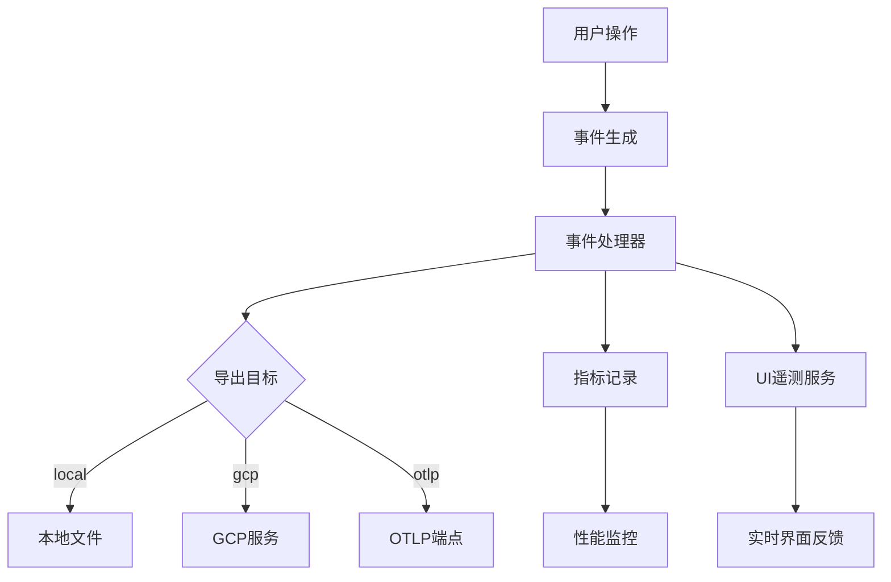
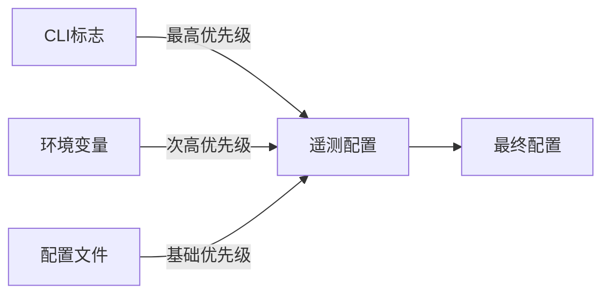
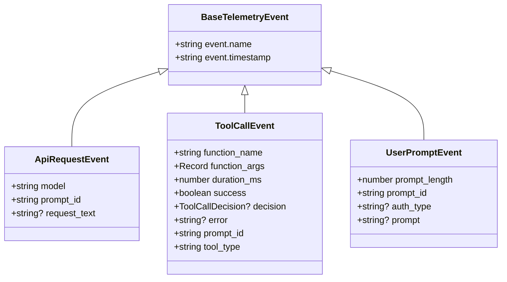
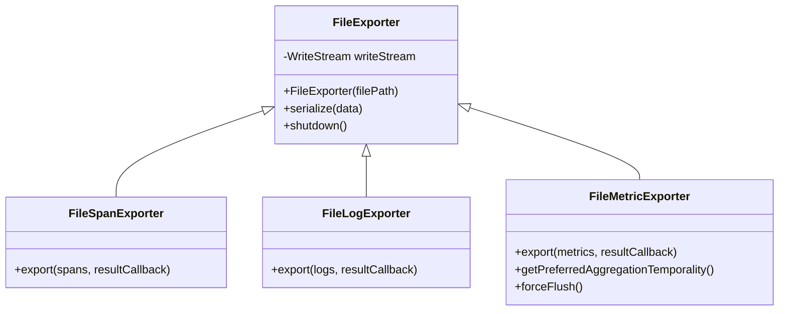
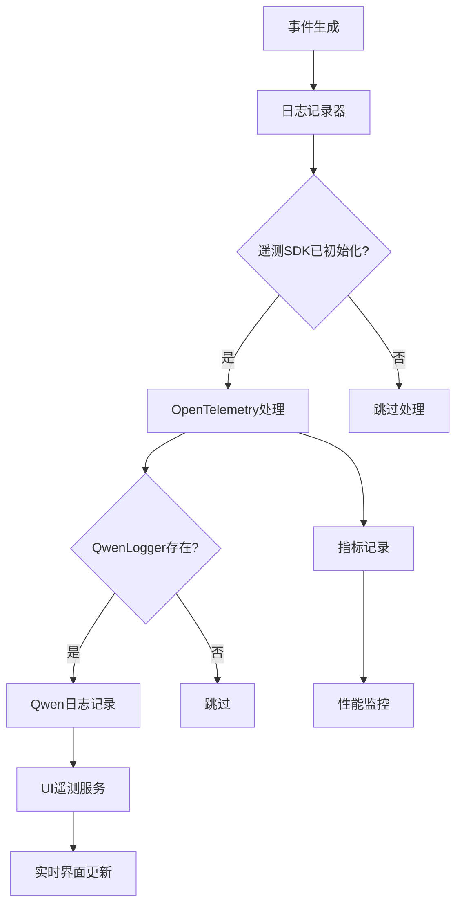
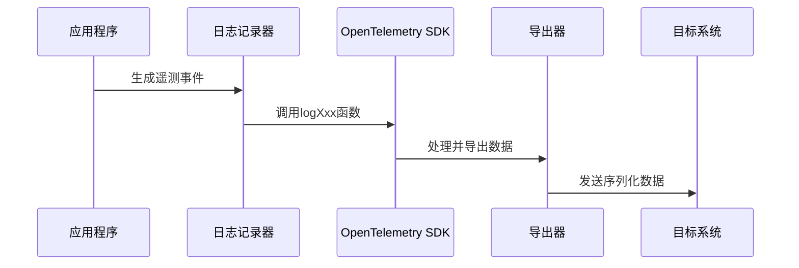

# 遥测数据分析

<cite>
**本文档引用的文件**
- [telemetry.md](file://telemetry.md)
- [types.ts](file://packages/core/src/telemetry/types.ts)
- [loggers.ts](file://packages/core/src/telemetry/loggers.ts)
- [sdk.ts](file://packages/core/src/telemetry/sdk.ts)
- [file-exporters.ts](file://packages/core/src/telemetry/file-exporters.ts)
- [config.ts](file://packages/core/src/config/config.ts)
- [settingsSchema.ts](file://packages/cli/src/config/settingsSchema.ts)
- [telemetry.js](file://scripts/telemetry.js)
- [local_telemetry.js](file://scripts/local_telemetry.js)
- [telemetry_utils.js](file://scripts/telemetry_utils.js)
</cite>

## 目录
1. [引言](#引言)
2. [遥测系统架构](#遥测系统架构)
3. [遥测启用与优先级规则](#遥测启用与优先级规则)
4. [遥测事件类型详解](#遥测事件类型详解)
5. [遥测数据导出与离线分析](#遥测数据导出与离线分析)
6. [事件序列化与传输机制](#事件序列化与传输机制)
7. [实际应用案例](#实际应用案例)
8. [结论](#结论)

## 引言
本文档旨在为开发者提供Qwen Code遥测系统的全面指南，帮助开发者启用和利用遥测功能进行深度调试。文档详细解释了遥测系统的启用方式、优先级规则、事件类型结构以及数据导出方法，为性能优化和问题排查提供支持。

## 遥测系统架构



**图示来源**
- [types.ts](file://packages/core/src/telemetry/types.ts#L1-L559)
- [loggers.ts](file://packages/core/src/telemetry/loggers.ts#L1-L594)
- [sdk.ts](file://packages/core/src/telemetry/sdk.ts#L1-L194)

**本节来源**
- [types.ts](file://packages/core/src/telemetry/types.ts#L1-L559)
- [loggers.ts](file://packages/core/src/telemetry/loggers.ts#L1-L594)

## 遥测启用与优先级规则

Qwen Code的遥测系统遵循明确的优先级规则，确保配置的灵活性和可控性。优先级顺序为：CLI标志 > 环境变量 > 配置文件。

### 配置优先级详解

1. **CLI标志**：具有最高优先级，可覆盖其他所有配置
2. **环境变量**：次高优先级，在CLI未指定时生效
3. **配置文件**：基础配置，当CLI和环境变量均未指定时使用

### 配置参数说明

**TelemetrySettings接口定义：**
- `enabled`: 布尔值，控制遥测功能是否启用
- `target`: 字符串，指定遥测目标（local/gcp）
- `otlpEndpoint`: 字符串，OTLP协议端点地址
- `otlpProtocol`: 字符串，OTLP协议类型（grpc/http）
- `logPrompts`: 布尔值，是否记录用户提示
- `outfile`: 字符串，输出文件路径



**图示来源**
- [config.ts](file://packages/core/src/config/config.ts#L90-L150)
- [settingsSchema.ts](file://packages/cli/src/config/settingsSchema.ts#L310-L315)

**本节来源**
- [config.ts](file://packages/core/src/config/config.ts#L90-L150)
- [settingsSchema.ts](file://packages/cli/src/config/settingsSchema.ts#L310-L315)
- [config.test.ts](file://packages/cli/src/config/config.test.ts#L482-L621)

## 遥测事件类型详解

Qwen Code的遥测系统定义了多种事件类型，通过联合类型`TelemetryEvent`进行管理。每种事件都有特定的结构和用途。

### TelemetryEvent联合类型

```typescript
type TelemetryEvent =
  | StartSessionEvent
  | EndSessionEvent
  | UserPromptEvent
  | ToolCallEvent
  | ApiRequestEvent
  | ApiErrorEvent
  | ApiResponseEvent
  | FlashFallbackEvent
  | LoopDetectedEvent
  | NextSpeakerCheckEvent
  | KittySequenceOverflowEvent
  | MalformedJsonResponseEvent
  | IdeConnectionEvent
  | ConversationFinishedEvent
  | SlashCommandEvent
  | FileOperationEvent
  | InvalidChunkEvent
  | ContentRetryEvent
  | ContentRetryFailureEvent
  | SubagentExecutionEvent;
```

### 核心事件类型详解

#### ApiRequestEvent（API请求事件）
- **结构**：
  - `event.name`: "api_request"
  - `event.timestamp`: ISO 8601格式时间戳
  - `model`: 请求的模型名称
  - `prompt_id`: 关联的提示ID
  - `request_text`: 请求文本内容（可选）
- **用途**：记录向AI模型发送请求的详细信息，用于分析请求模式和性能。

#### ToolCallEvent（工具调用事件）
- **结构**：
  - `event.name`: "tool_call"
  - `event.timestamp`: ISO 8601格式时间戳
  - `function_name`: 调用的函数名称
  - `function_args`: 函数参数对象
  - `duration_ms`: 执行持续时间（毫秒）
  - `success`: 执行是否成功
  - `decision`: 调用决策
  - `error`: 错误信息（可选）
  - `prompt_id`: 关联的提示ID
  - `tool_type`: 工具类型（native/mcp）
- **用途**：监控所有工具调用的执行情况，包括性能、成功率和错误分析。

#### UserPromptEvent（用户提示事件）
- **结构**：
  - `event.name`: "user_prompt"
  - `event.timestamp`: ISO 8601格式时间戳
  - `prompt_length`: 提示长度
  - `prompt_id`: 提示ID
  - `auth_type`: 认证类型（可选）
  - `prompt`: 提示内容（可选，受logPrompts设置控制）
- **用途**：记录用户输入的提示信息，用于分析用户行为和提示质量。



**图示来源**
- [types.ts](file://packages/core/src/telemetry/types.ts#L1-L559)

**本节来源**
- [types.ts](file://packages/core/src/telemetry/types.ts#L1-L559)

## 遥测数据导出与离线分析

Qwen Code提供了灵活的遥测数据导出机制，支持将数据导出到本地文件进行离线分析。

### 文件导出器实现



### 导出配置方法

1. **通过配置文件设置**：
   ```json
   {
     "telemetry": {
       "enabled": true,
       "outfile": "/path/to/telemetry/output.json"
     }
   }
   ```

2. **通过CLI标志设置**：
   ```bash
   qwen-code --telemetry --telemetry-outfile=/path/to/output.json
   ```

3. **通过环境变量设置**：
   ```bash
   export QWEN_TELEMETRY_OUTFILE=/path/to/output.json
   ```

### 离线分析流程

1. 启用遥测并指定输出文件
2. 执行需要监控的操作
3. 停止应用，确保所有遥测数据已写入文件
4. 使用JSON解析工具分析输出文件
5. 根据分析结果进行性能优化或问题排查

**图示来源**
- [file-exporters.ts](file://packages/core/src/telemetry/file-exporters.ts#L1-L94)

**本节来源**
- [file-exporters.ts](file://packages/core/src/telemetry/file-exporters.ts#L1-L94)
- [sdk.ts](file://packages/core/src/telemetry/sdk.ts#L1-L194)

## 事件序列化与传输机制

Qwen Code的遥测系统通过`loggers.ts`文件中的实现，将事件序列化并发送到不同目标。

### 事件处理流程



### 序列化实现

在`loggers.ts`中，事件通过以下方式序列化：

1. **通用属性提取**：从配置中提取会话ID、用户邮箱等通用属性
2. **JSON序列化**：使用`safeJsonStringify`安全地将对象序列化为JSON
3. **属性映射**：将事件属性映射到OpenTelemetry标准属性
4. **日志记录**：通过OpenTelemetry API发出日志记录

### 传输目标

1. **Local**：通过`local_telemetry.js`脚本启动本地收集器
2. **GCP**：通过`telemetry_gcp.js`脚本发送到Google Cloud Platform
3. **OTLP**：通过gRPC或HTTP协议发送到指定OTLP端点
4. **Console**：输出到控制台（调试模式）



**图示来源**
- [loggers.ts](file://packages/core/src/telemetry/loggers.ts#L1-L594)
- [sdk.ts](file://packages/core/src/telemetry/sdk.ts#L1-L194)
- [local_telemetry.js](file://scripts/local_telemetry.js#L1-L220)

**本节来源**
- [loggers.ts](file://packages/core/src/telemetry/loggers.ts#L1-L594)
- [sdk.ts](file://packages/core/src/telemetry/sdk.ts#L1-L194)
- [local_telemetry.js](file://scripts/local_telemetry.js#L1-L220)

## 实际应用案例

### 性能瓶颈分析

通过分析`UserPromptEvent`和`ApiResponseEvent`，可以识别性能瓶颈：

1. **收集数据**：
   - 启用遥测并记录用户提示和API响应
   - 导出到本地文件进行分析

2. **分析步骤**：
   - 关联相同`prompt_id`的`UserPromptEvent`和`ApiResponseEvent`
   - 计算响应延迟（`ApiResponseEvent.duration_ms`）
   - 分析输入/输出token数量与响应时间的关系

3. **优化建议**：
   - 对于长提示，考虑提示压缩
   - 对于高延迟响应，检查网络连接或考虑使用更快的模型

### 错误诊断

通过`ApiErrorEvent`和`ToolCallEvent`进行错误诊断：

1. **错误模式识别**：
   - 分析`ApiErrorEvent.error_type`统计错误类型
   - 检查`ToolCallEvent.error`了解工具调用失败原因

2. **根本原因分析**：
   - 关联错误事件与用户操作序列
   - 检查认证状态和权限设置
   - 验证工具配置和依赖

### 用户行为分析

利用`UserPromptEvent`进行用户行为分析：

1. **提示模式分析**：
   - 统计不同长度提示的分布
   - 识别常用提示模式和关键词

2. **使用习惯优化**：
   - 根据用户常用功能优化界面布局
   - 为高频操作提供快捷方式

**本节来源**
- [types.ts](file://packages/core/src/telemetry/types.ts#L1-L559)
- [loggers.ts](file://packages/core/src/telemetry/loggers.ts#L1-L594)

## 结论
Qwen Code的遥测系统为开发者提供了强大的调试和分析工具。通过理解遥测启用规则、事件类型结构和数据导出方法，开发者可以深入洞察系统行为，优化性能，并快速诊断问题。建议在开发和测试环境中充分利用遥测功能，以提升开发效率和系统质量。