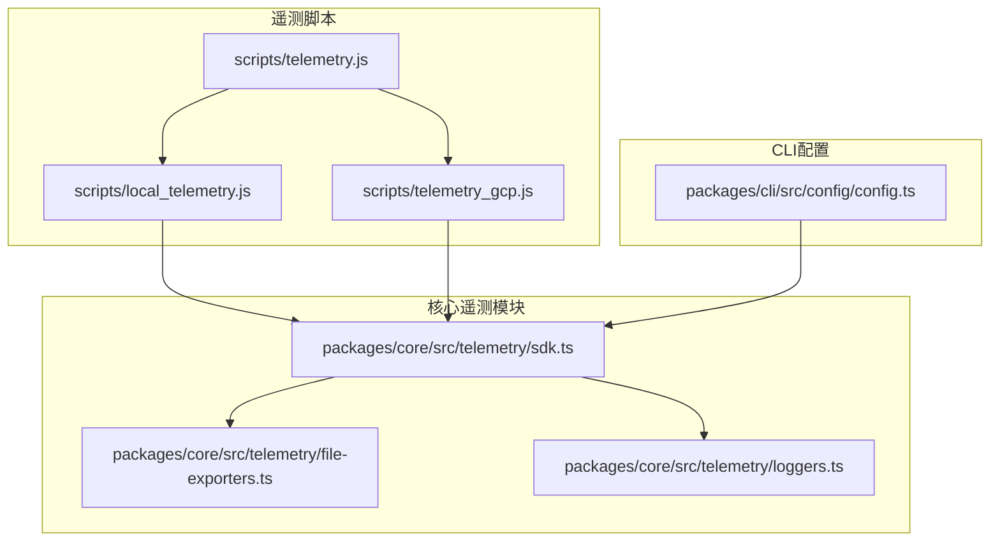
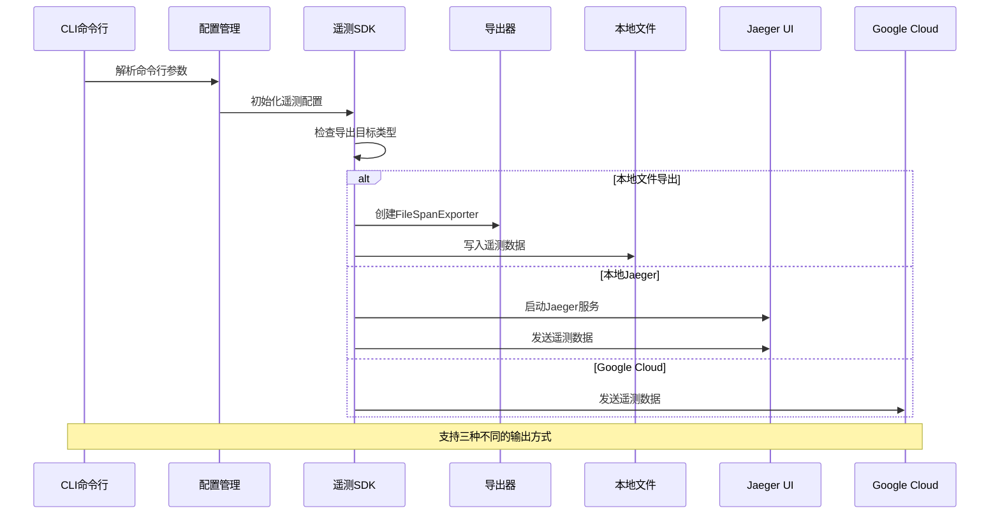
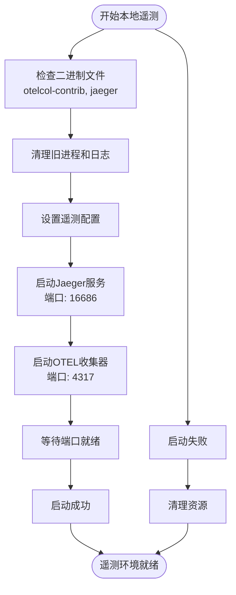
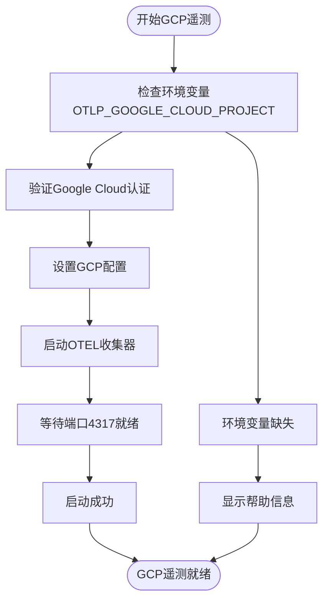
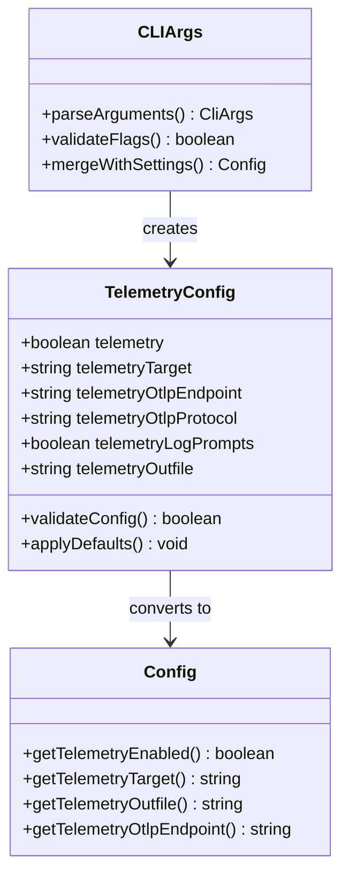
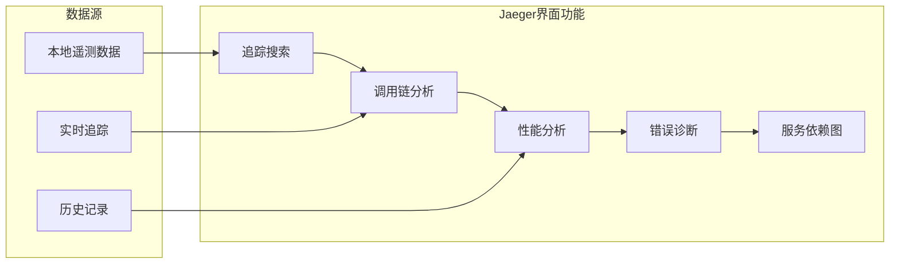
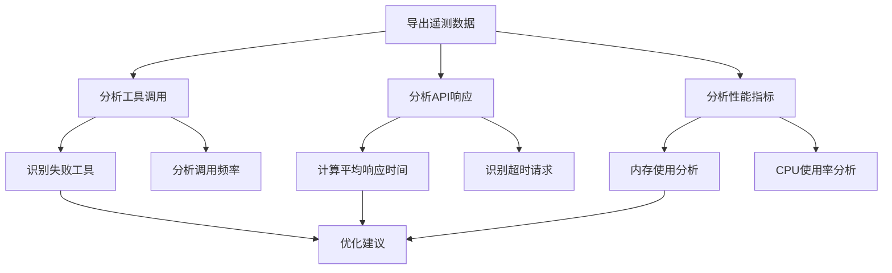

# 遥测数据导出与分析

<cite>
**本文档引用的文件**
- [local_telemetry.js](file://scripts/local_telemetry.js)
- [telemetry_gcp.js](file://scripts/telemetry_gcp.js)
- [telemetry.js](file://scripts/telemetry.js)
- [sdk.ts](file://packages/core/src/telemetry/sdk.ts)
- [file-exporters.ts](file://packages/core/src/telemetry/file-exporters.ts)
- [config.ts](file://packages/cli/src/config/config.ts)
- [loggers.test.ts](file://packages/core/src/telemetry/loggers.test.ts)
- [README.md](file://README.md)
</cite>

## 目录
1. [简介](#简介)
2. [项目结构概览](#项目结构概览)
3. [核心遥测组件](#核心遥测组件)
4. [架构概览](#架构概览)
5. [详细组件分析](#详细组件分析)
6. [遥测数据导出方法](#遥测数据导出方法)
7. [本地Jaeger分析](#本地jaeger分析)
8. [Google Cloud Console分析](#google-cloud-console分析)
9. [实际案例分析](#实际案例分析)
10. [故障排除指南](#故障排除指南)
11. [结论](#结论)

## 简介

Qwen Code提供了强大的遥测数据收集和分析功能，支持将遥测数据导出到本地文件进行离线分析，并通过Jaeger或Google Cloud Console进行可视化分析。本文档详细说明了如何使用`--telemetry-outfile`标志将数据重定向到文件，以及如何配合`--telemetry-target=local`和空的`--telemetry-otlp-endpoint`使用。

遥测系统基于OpenTelemetry标准，支持跟踪（Traces）、指标（Metrics）和日志（Logs）的收集和分析。通过本地文件导出功能，开发者可以在没有网络连接的情况下对应用性能进行深入分析。

## 项目结构概览

遥测功能主要分布在以下关键目录中：



**图表来源**
- [local_telemetry.js](file://scripts/local_telemetry.js#L1-L220)
- [telemetry_gcp.js](file://scripts/telemetry_gcp.js#L1-L189)
- [sdk.ts](file://packages/core/src/telemetry/sdk.ts#L1-L194)

## 核心遥测组件

### 遥测SDK初始化

遥测SDK负责整个遥测系统的初始化和管理：

```typescript
export function initializeTelemetry(config: Config): void {
  if (telemetryInitialized || !config.getTelemetryEnabled()) {
    return;
  }

  const resource = resourceFromAttributes({
    [SemanticResourceAttributes.SERVICE_NAME]: SERVICE_NAME,
    [SemanticResourceAttributes.SERVICE_VERSION]: process.version,
    'session.id': config.getSessionId(),
  });

  const otlpEndpoint = config.getTelemetryOtlpEndpoint();
  const otlpProtocol = config.getTelemetryOtlpProtocol();
  const parsedEndpoint = parseOtlpEndpoint(otlpEndpoint, otlpProtocol);
  const useOtlp = !!parsedEndpoint;
  const telemetryOutfile = config.getTelemetryOutfile();
}
```

### 文件导出器

文件导出器负责将遥测数据写入本地文件：

```typescript
export class FileSpanExporter extends FileExporter implements SpanExporter {
  export(
    spans: ReadableSpan[],
    resultCallback: (result: ExportResult) => void,
  ): void {
    const data = spans.map((span) => this.serialize(span)).join('');
    this.writeStream.write(data, (err) => {
      resultCallback({
        code: err ? ExportResultCode.FAILED : ExportResultCode.SUCCESS,
        error: err || undefined,
      });
    });
  }
}
```

**章节来源**
- [sdk.ts](file://packages/core/src/telemetry/sdk.ts#L75-L149)
- [file-exporters.ts](file://packages/core/src/telemetry/file-exporters.ts#L40-L55)

## 架构概览

遥测系统采用分层架构设计，支持多种输出目标：



**图表来源**
- [sdk.ts](file://packages/core/src/telemetry/sdk.ts#L85-L101)
- [local_telemetry.js](file://scripts/local_telemetry.js#L144-L177)

## 详细组件分析

### 本地遥测脚本分析

本地遥测脚本负责启动完整的本地遥测环境：



**图表来源**
- [local_telemetry.js](file://scripts/local_telemetry.js#L45-L218)

### Google Cloud遥测分析

Google Cloud遥测脚本专门用于云端分析：



**图表来源**
- [telemetry_gcp.js](file://scripts/telemetry_gcp.js#L50-L139)

**章节来源**
- [local_telemetry.js](file://scripts/local_telemetry.js#L45-L218)
- [telemetry_gcp.js](file://scripts/telemetry_gcp.js#L50-L139)

## 遥测数据导出方法

### 基本导出命令

要将遥测数据导出到本地文件，请使用以下命令：

```bash
# 基本文件导出
qwen --telemetry-outfile=/path/to/telemetry.json

# 结合本地目标使用
qwen --telemetry-target=local --telemetry-outfile=/path/to/telemetry.json

# 完整配置示例
qwen --telemetry=true \
     --telemetry-target=local \
     --telemetry-otlp-endpoint="" \
     --telemetry-outfile=/tmp/qwen-telemetry.json
```

### CLI参数详解



**图表来源**
- [config.ts](file://packages/cli/src/config/config.ts#L60-L120)
- [config.ts](file://packages/cli/src/config/config.ts#L400-L500)

### 导出器类型选择

系统根据配置自动选择合适的导出器：

```typescript
if (useOtlp) {
  // 使用OTLP导出器发送到远程服务器
  spanExporter = new OTLPTraceExporter({
    url: parsedEndpoint,
    compression: CompressionAlgorithm.GZIP,
  });
} else if (telemetryOutfile) {
  // 使用文件导出器写入本地文件
  spanExporter = new FileSpanExporter(telemetryOutfile);
} else {
  // 使用控制台导出器（默认）
  spanExporter = new ConsoleSpanExporter();
}
```

**章节来源**
- [sdk.ts](file://packages/core/src/telemetry/sdk.ts#L103-L149)
- [config.ts](file://packages/cli/src/config/config.ts#L60-L120)

## 本地Jaeger分析

### 启动Jaeger环境

要启动包含Jaeger UI的本地遥测环境：

```bash
# 方法1：直接运行脚本
npm run telemetry -- --target=local

# 方法2：使用CLI参数
qwen --telemetry=true --telemetry-target=local --telemetry-otlp-endpoint=""
```

### 访问Jaeger UI

启动完成后，您可以通过以下地址访问Jaeger界面：

- **Jaeger UI**: http://localhost:16686
- **日志文件**: `~/.qwen/otel/collector.log`
- **追踪数据**: 自动收集并存储在Jaeger中

### Jaeger功能特性



### 分析工作流程

1. **启动遥测环境**：运行`npm run telemetry -- --target=local`
2. **执行操作**：在另一个终端窗口运行Qwen Code命令
3. **查看结果**：访问http://localhost:16686
4. **分析数据**：使用Jaeger的搜索和过滤功能

**章节来源**
- [local_telemetry.js](file://scripts/local_telemetry.js#L144-L177)

## Google Cloud Console分析

### 设置Google Cloud环境

要使用Google Cloud进行遥测分析，需要完成以下步骤：

```bash
# 1. 设置项目ID环境变量
export OTLP_GOOGLE_CLOUD_PROJECT=your-project-id

# 2. 认证Google Cloud
gcloud auth application-default login

# 或者使用服务账户密钥
export GOOGLE_APPLICATION_CREDENTIALS=/path/to/service-account.json

# 3. 启动GCP遥测
npm run telemetry -- --target=gcp
```

### Google Cloud控制台链接

启动GCP遥测后，您可以通过以下链接访问不同类型的遥测数据：

- **日志**: https://console.cloud.google.com/logs/query;query=logName%3D%22projects%2Fyour-project-id%2Flogs%2Fgemini_cli%22
- **指标**: https://console.cloud.google.com/monitoring/metrics-explorer
- **追踪**: https://console.cloud.google.com/traces/list

### GCP配置详解

```yaml
receivers:
  otlp:
    protocols:
      grpc:
        endpoint: "localhost:4317"
processors:
  batch:
    timeout: 1s
exporters:
  googlecloud:
    project: "your-project-id"
    metric:
      prefix: "custom.googleapis.com/gemini_cli"
    log:
      default_log_name: "gemini_cli"
  debug:
    verbosity: detailed
```

**章节来源**
- [telemetry_gcp.js](file://scripts/telemetry_gcp.js#L25-L67)
- [telemetry_gcp.js](file://scripts/telemetry_gcp.js#L101-L139)

## 实际案例分析

### 案例1：性能瓶颈诊断

假设您发现Qwen Code在处理大型代码库时响应缓慢，可以按照以下步骤进行分析：

```bash
# 1. 启动本地遥测环境
npm run telemetry -- --target=local

# 2. 执行性能测试
qwen --prompt="分析这个代码库的性能瓶颈"

# 3. 在Jaeger中分析
# - 搜索相关追踪
# - 查看函数调用时间
# - 识别慢速操作
```

### 案例2：工具调用分析

当某个工具频繁失败时，可以分析其调用情况：

```bash
# 启用提示日志记录
qwen --telemetry=true \
     --telemetry-target=local \
     --telemetry-log-prompts=true \
     --telemetry-outfile=/tmp/tool-analysis.json

# 分析导出的日志文件
cat /tmp/tool-analysis.json | jq '.events[] | select(.function_name=="edit")'
```

### 案例3：API响应时间分析

监控API调用的响应时间分布：

```bash
# 导出API响应数据
qwen --telemetry-outfile=/tmp/api-responses.json

# 分析响应时间
grep '"duration_ms"' /tmp/api-responses.json | jq -r '.duration_ms' | sort -n
```

### 日志文件分析示例



## 故障排除指南

### 常见问题及解决方案

#### 1. 本地遥测无法启动

**问题症状**：
```
🛑 Error: OTEL collector failed to start on port 4317.
```

**解决方案**：
```bash
# 1. 检查端口占用
lsof -i :4317

# 2. 清理旧进程
pkill -f "otelcol-contrib"
pkill -f "jaeger"

# 3. 重新启动
npm run telemetry -- --target=local
```

#### 2. Google Cloud认证失败

**问题症状**：
```
🛑 Error: OTLP_GOOGLE_CLOUD_PROJECT environment variable is not exported.
```

**解决方案**：
```bash
# 1. 设置项目ID
export OTLP_GOOGLE_CLOUD_PROJECT=your-project-id

# 2. 验证认证状态
gcloud auth list

# 3. 重新认证
gcloud auth application-default login
```

#### 3. 文件权限问题

**问题症状**：
```
Permission denied: '/path/to/telemetry.json'
```

**解决方案**：
```bash
# 1. 检查文件权限
ls -la /path/to/

# 2. 修改权限或使用临时目录
chmod 755 /path/to/
# 或
qwen --telemetry-outfile=/tmp/telemetry.json
```

### 调试技巧

#### 启用调试模式

```bash
# 启用详细日志
qwen --debug --telemetry-outfile=/tmp/debug-telemetry.json

# 查看遥测配置
qwen --telemetry=true --telemetry-target=local --telemetry-outfile=/tmp/config.json
```

#### 验证遥测数据

```bash
# 检查导出文件格式
jq . /tmp/telemetry.json

# 统计事件数量
grep -c '{}' /tmp/telemetry.json

# 分析特定事件类型
grep '"event.name": "EVENT_API_RESPONSE"' /tmp/telemetry.json
```

**章节来源**
- [local_telemetry.js](file://scripts/local_telemetry.js#L179-L218)
- [telemetry_gcp.js](file://scripts/telemetry_gcp.js#L63-L101)

## 结论

Qwen Code的遥测系统提供了强大而灵活的数据收集和分析能力。通过合理使用`--telemetry-outfile`标志，开发者可以：

1. **离线分析**：将遥测数据导出到本地文件，便于离线分析和调试
2. **多平台支持**：支持本地Jaeger和Google Cloud两种分析平台
3. **全面监控**：收集跟踪、指标和日志的完整数据集
4. **性能优化**：识别性能瓶颈和优化机会

建议开发者根据具体需求选择合适的遥测配置，并定期分析遥测数据以持续改进应用性能。通过结合本地分析和云端监控，可以获得最全面的应用行为洞察。