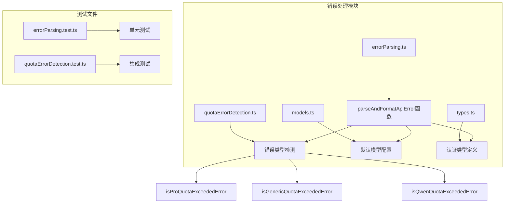
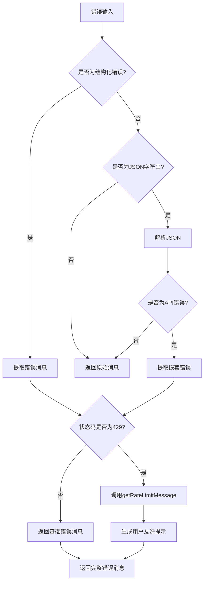
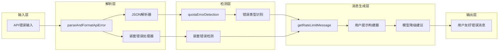
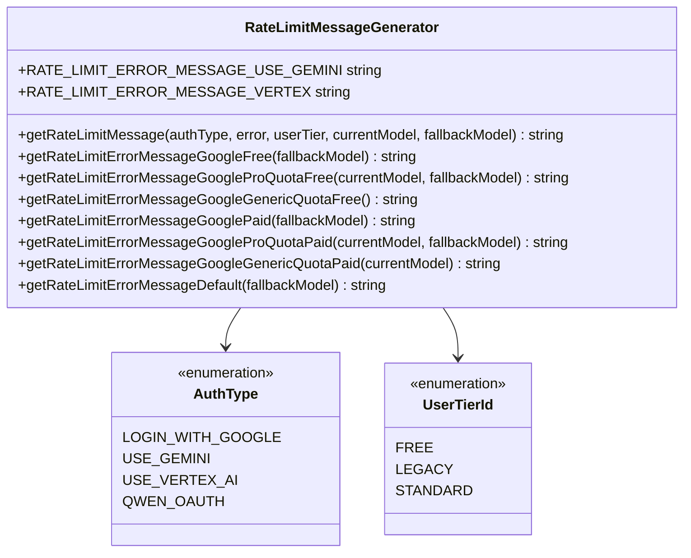
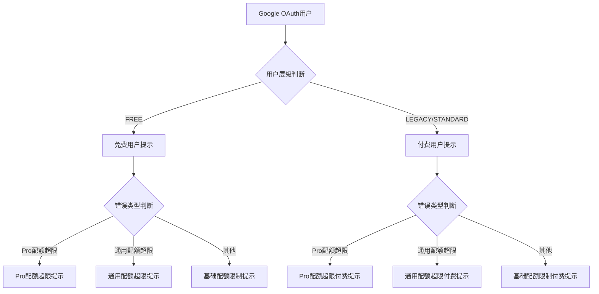
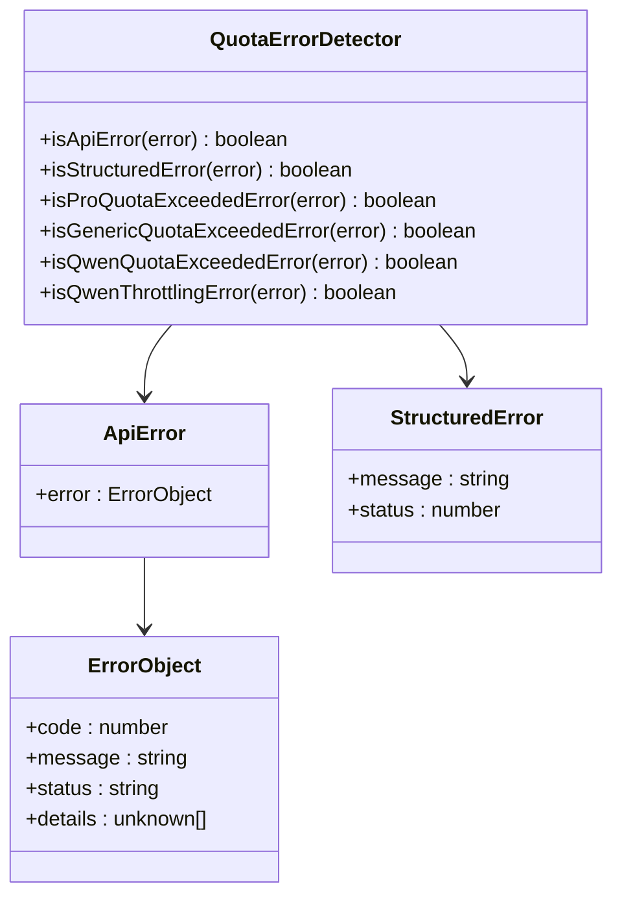
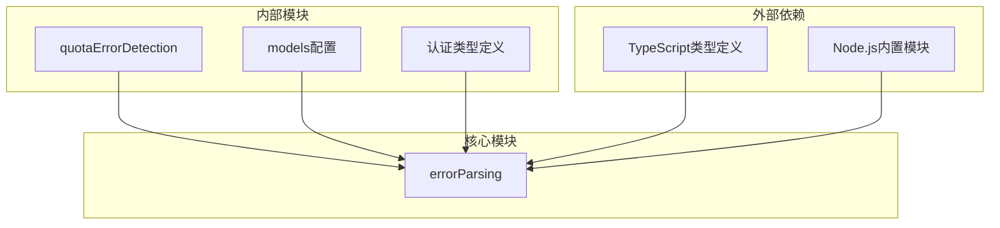

# API错误解析与用户提示系统

<cite>
**本文档引用的文件**
- [errorParsing.ts](file://packages/core/src/utils/errorParsing.ts)
- [quotaErrorDetection.ts](file://packages/core/src/utils/quotaErrorDetection.ts)
- [models.ts](file://packages/core/src/config/models.ts)
- [types.ts](file://packages/core/src/code_assist/types.ts)
- [errorParsing.test.ts](file://packages/core/src/utils/errorParsing.test.ts)
- [quotaErrorDetection.test.ts](file://packages/core/src/utils/quotaErrorDetection.test.ts)
</cite>

## 目录
1. [简介](#简介)
2. [项目结构](#项目结构)
3. [核心组件](#核心组件)
4. [架构概览](#架构概览)
5. [详细组件分析](#详细组件分析)
6. [依赖关系分析](#依赖关系分析)
7. [性能考虑](#性能考虑)
8. [故障排除指南](#故障排除指南)
9. [结论](#结论)

## 简介

API错误解析与用户提示系统是qwen-code项目中的关键组件，负责处理各种形式的API错误输入，并将其转换为用户友好的错误消息。该系统特别针对429（Too Many Requests）状态码进行了优化，能够根据用户的认证类型（AuthType）和用户层级（UserTierId）动态生成包含降级模型建议或配额升级指引的提示信息。

系统的核心功能包括：
- 解析不同格式的API错误（Error对象、JSON字符串、普通字符串）
- 提取结构化的错误消息与状态码
- 针对429状态码提供智能的用户提示
- 根据用户权限级别和认证方式定制化错误消息
- 支持嵌套错误结构的递归解析

## 项目结构

错误解析系统位于`packages/core/src/utils/`目录下，主要包含以下文件：



**图表来源**
- [errorParsing.ts](file://packages/core/src/utils/errorParsing.ts#L1-L167)
- [quotaErrorDetection.ts](file://packages/core/src/utils/quotaErrorDetection.ts#L1-L168)

**章节来源**
- [errorParsing.ts](file://packages/core/src/utils/errorParsing.ts#L1-L167)
- [quotaErrorDetection.ts](file://packages/core/src/utils/quotaErrorDetection.ts#L1-L168)

## 核心组件

### parseAndFormatApiError函数

这是整个系统的核心函数，负责处理各种类型的API错误输入：

```typescript
export function parseAndFormatApiError(
  error: unknown,
  authType?: AuthType,
  userTier?: UserTierId,
  currentModel?: string,
  fallbackModel?: string,
): string
```

该函数支持三种主要的错误输入格式：
1. **结构化错误对象**：直接包含message和status属性的对象
2. **JSON字符串**：包含API错误信息的JSON字符串
3. **普通字符串**：简单的错误消息文本

### 错误检测机制

系统通过多个专用函数来识别不同类型的错误：



**图表来源**
- [errorParsing.ts](file://packages/core/src/utils/errorParsing.ts#L103-L167)

**章节来源**
- [errorParsing.ts](file://packages/core/src/utils/errorParsing.ts#L103-L167)

## 架构概览

系统采用分层架构设计，将错误解析、类型检测和消息生成分离到不同的模块中：



**图表来源**
- [errorParsing.ts](file://packages/core/src/utils/errorParsing.ts#L103-L167)
- [quotaErrorDetection.ts](file://packages/core/src/utils/quotaErrorDetection.ts#L1-L168)

## 详细组件分析

### getRateLimitMessage函数分析

`getRateLimitMessage`函数是系统中最复杂的部分，负责根据用户的认证类型、用户层级和错误类型生成定制化的用户提示：



**图表来源**
- [errorParsing.ts](file://packages/core/src/utils/errorParsing.ts#L58-L101)
- [types.ts](file://packages/core/src/code_assist/types.ts#L120-L125)

#### 认证类型处理逻辑

系统根据不同认证类型提供差异化的错误提示：

1. **LOGIN_WITH_GOOGLE**：针对Google OAuth用户，区分免费和付费用户层级
2. **USE_GEMINI**：针对使用Gemini API密钥的用户
3. **USE_VERTEX_AI**：针对使用Vertex AI的用户
4. **QWEN_OAUTH**：针对Qwen OAuth用户（在其他文件中处理）

#### 用户层级区分

对于Google OAuth用户，系统会根据用户层级（FREE、LEGACY、STANDARD）提供不同的提示：



**图表来源**
- [errorParsing.ts](file://packages/core/src/utils/errorParsing.ts#L58-L101)

### 错误检测机制分析

系统通过多个专门的函数来识别不同类型的错误：



**图表来源**
- [quotaErrorDetection.ts](file://packages/core/src/utils/quotaErrorDetection.ts#L11-L168)

**章节来源**
- [quotaErrorDetection.ts](file://packages/core/src/utils/quotaErrorDetection.ts#L1-L168)

### 模型配置管理

系统维护了一组默认模型配置，用于在发生错误时提供模型降级建议：

```typescript
export const DEFAULT_GEMINI_MODEL = 'coder-model';
export const DEFAULT_GEMINI_FLASH_MODEL = 'gemini-2.5-flash';
export const DEFAULT_GEMINI_FLASH_LITE_MODEL = 'gemini-2.5-flash-lite';
export const DEFAULT_GEMINI_EMBEDDING_MODEL = 'gemini-embedding-001';
```

这些配置在错误处理过程中被用作降级模型的候选选项。

**章节来源**
- [models.ts](file://packages/core/src/config/models.ts#L1-L15)

## 依赖关系分析

系统的依赖关系相对简单但结构清晰：



**图表来源**
- [errorParsing.ts](file://packages/core/src/utils/errorParsing.ts#L1-L15)

**章节来源**
- [errorParsing.ts](file://packages/core/src/utils/errorParsing.ts#L1-L15)

## 性能考虑

### 内存使用优化

系统采用了多种策略来优化内存使用：

1. **延迟计算**：只有在需要时才生成特定的错误消息
2. **字符串拼接优化**：使用模板字符串而非频繁的字符串连接
3. **类型检查缓存**：避免重复执行相同的类型检查

### 执行效率

- **早期退出**：在无法解析错误时立即返回，避免不必要的处理
- **条件分支优化**：根据最可能的情况优化if-else分支顺序
- **字符串操作最小化**：减少不必要的字符串解析和转换

## 故障排除指南

### 常见问题及解决方案

#### 1. 错误消息未正确格式化

**症状**：原始错误消息未被转换为用户友好的格式
**原因**：输入不是有效的JSON字符串或结构化错误对象
**解决方案**：确保输入符合预期格式，或者添加适当的错误处理

#### 2. 429错误提示不准确

**症状**：429错误显示了错误的用户提示
**原因**：认证类型或用户层级参数传递错误
**解决方案**：检查authType和userTier参数的正确性

#### 3. 嵌套错误解析失败

**症状**：嵌套的API错误没有被正确解析
**原因**：嵌套结构不符合预期格式
**解决方案**：验证嵌套错误的JSON结构是否符合ApiError接口

**章节来源**
- [errorParsing.test.ts](file://packages/core/src/utils/errorParsing.test.ts#L58-L199)

## 结论

API错误解析与用户提示系统是一个设计精良的组件，具有以下优势：

1. **灵活性**：支持多种错误输入格式
2. **可扩展性**：易于添加新的错误类型和提示消息
3. **用户体验**：提供定制化的用户提示，帮助用户理解并解决错误
4. **安全性**：通过严格的类型检查防止运行时错误
5. **性能**：优化的算法确保快速的错误处理

该系统为qwen-code项目提供了强大的错误处理能力，能够有效提升用户在遇到API错误时的体验。通过合理的架构设计和完善的测试覆盖，系统能够在各种场景下稳定可靠地工作。