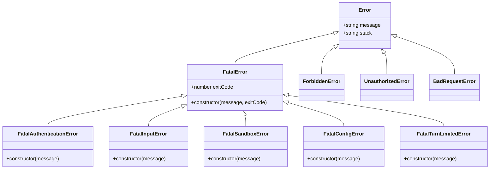

# 错误分类与继承体系

<cite>
**本文档引用的文件**
- [packages/core/src/utils/errors.ts](file://packages/core/src/utils/errors.ts)
- [packages/core/src/tools/tool-error.ts](file://packages/core/src/tools/tool-error.ts)
- [packages/core/src/utils/errorReporting.ts](file://packages/core/src/utils/errorReporting.ts)
- [packages/core/src/utils/errorParsing.ts](file://packages/core/src/utils/errorParsing.ts)
- [packages/core/src/qwen/qwenOAuth2.ts](file://packages/core/src/qwen/qwenOAuth2.ts)
- [packages/core/src/tools/memoryTool.ts](file://packages/core/src/tools/memoryTool.ts)
- [packages/core/src/tools/tool-registry.ts](file://packages/core/src/tools/tool-registry.ts)
- [packages/core/src/core/geminiChat.ts](file://packages/core/src/core/geminiChat.ts)
</cite>

## 目录
1. [简介](#简介)
2. [核心错误基类体系](#核心错误基类体系)
3. [FatalError继承体系](#fatalerror继承体系)
4. [工具执行错误分类](#工具执行错误分类)
5. [认证错误处理机制](#认证错误处理机制)
6. [错误报告与诊断系统](#错误报告与诊断系统)
7. [错误检测与识别](#错误检测与识别)
8. [代码示例与最佳实践](#代码示例与最佳实践)
9. [总结](#总结)

## 简介

Qwen Code项目采用了一套完整的错误分类与继承体系，旨在提供清晰、结构化的错误处理机制。该体系通过多层次的错误类设计，实现了从通用错误到特定领域错误的完整覆盖，为开发者提供了强大的错误诊断和处理能力。

## 核心错误基类体系

### FatalError基础类

FatalError是整个错误体系的核心基类，所有致命性错误都直接或间接继承自这个类。它提供了统一的错误处理接口和退出码机制。

```typescript
export class FatalError extends Error {
  constructor(
    message: string,
    readonly exitCode: number,
  ) {
    super(message);
  }
}
```

FatalError的设计理念：
- **统一退出码管理**：每个子类都有预定义的退出码，便于进程管理和调试
- **消息传递**：提供清晰的错误信息传递机制
- **继承扩展性**：支持多层继承，满足不同场景需求

### 错误类型层次结构



**图表来源**
- [packages/core/src/utils/errors.ts](file://packages/core/src/utils/errors.ts#L25-L50)

**章节来源**
- [packages/core/src/utils/errors.ts](file://packages/core/src/utils/errors.ts#L25-L50)

## FatalError继承体系

### FatalAuthenticationError - 认证失败错误

FatalAuthenticationError专门用于处理认证相关的致命错误，具有固定的退出码41。

```typescript
export class FatalAuthenticationError extends FatalError {
  constructor(message: string) {
    super(message, 41);
  }
}
```

应用场景：
- OAuth令牌过期或无效
- API密钥认证失败
- 用户凭据验证失败
- 权限不足导致的认证问题

### FatalInputError - 输入错误

FatalInputError处理输入参数相关的致命错误，退出码为42。

```typescript
export class FatalInputError extends FatalError {
  constructor(message: string) {
    super(message, 42);
  }
}
```

常见场景：
- 无效的命令行参数
- 不符合预期的数据格式
- 缺少必需的输入参数
- 参数范围或类型验证失败

### FatalSandboxError - 沙箱环境错误

FatalSandboxError专门处理沙箱环境中发生的致命错误，退出码为44。

```typescript
export class FatalSandboxError extends FatalError {
  constructor(message: string) {
    super(message, 44);
  }
}
```

典型情况：
- 沙箱配置错误
- 安全策略违反
- 资源访问限制
- 执行权限不足

### FatalConfigError - 配置错误

FatalConfigError处理配置相关的致命错误，退出码为52。

```typescript
export class FatalConfigError extends FatalError {
  constructor(message: string) {
    super(message, 52);
  }
}
```

配置问题包括：
- 无效的配置文件格式
- 缺失关键配置项
- 配置值超出允许范围
- 配置依赖关系不满足

### FatalTurnLimitedError - 会话限制错误

FatalTurnLimitedError处理会话轮次限制相关的致命错误，退出码为53。

```typescript
export class FatalTurnLimitedError extends FatalError {
  constructor(message: string) {
    super(message, 53);
  }
}
```

会话限制场景：
- 达到最大对话轮次
- 会话超时
- 资源配额耗尽
- 服务端限制触发

**章节来源**
- [packages/core/src/utils/errors.ts](file://packages/core/src/utils/errors.ts#L30-L50)

## 工具执行错误分类

### ToolErrorType枚举体系

ToolErrorType是一个类型安全的枚举，定义了所有工具相关的错误类型。这些错误主要在工具执行过程中发生，涵盖了各种操作系统的工具调用场景。

```typescript
export enum ToolErrorType {
  // 通用错误
  INVALID_TOOL_PARAMS = 'invalid_tool_params',
  UNKNOWN = 'unknown',
  UNHANDLED_EXCEPTION = 'unhandled_exception',
  TOOL_NOT_REGISTERED = 'tool_not_registered',
  EXECUTION_FAILED = 'execution_failed',

  // 文件系统错误
  FILE_NOT_FOUND = 'file_not_found',
  FILE_WRITE_FAILURE = 'file_write_failure',
  READ_CONTENT_FAILURE = 'read_content_failure',
  ATTEMPT_TO_CREATE_EXISTING_FILE = 'attempt_to_create_existing_file',
  FILE_TOO_LARGE = 'file_too_large',
  PERMISSION_DENIED = 'permission_denied',
  NO_SPACE_LEFT = 'no_space_left',
  TARGET_IS_DIRECTORY = 'target_is_directory',
  PATH_NOT_IN_WORKSPACE = 'path_not_in_workspace',
  SEARCH_PATH_NOT_FOUND = 'search_path_not_found',
  SEARCH_PATH_NOT_A_DIRECTORY = 'search_path_not_a_directory',

  // 编辑工具错误
  EDIT_PREPARATION_FAILURE = 'edit_preparation_failure',
  EDIT_NO_OCCURRENCE_FOUND = 'edit_no_occurrence_found',
  EDIT_EXPECTED_OCCURRENCE_MISMATCH = 'edit_expected_occurrence_mismatch',
  EDIT_NO_CHANGE = 'edit_no_change',

  // 搜索工具错误
  GLOB_EXECUTION_ERROR = 'glob_execution_error',
  GREP_EXECUTION_ERROR = 'grep_execution_error',
  LS_EXECUTION_ERROR = 'ls_execution_error',
  PATH_IS_NOT_A_DIRECTORY = 'path_is_not_a_directory',

  // MCP工具错误
  MCP_TOOL_ERROR = 'mcp_tool_error',

  // 内存工具错误
  MEMORY_TOOL_EXECUTION_ERROR = 'memory_tool_execution_error',

  // 发现工具错误
  DISCOVERED_TOOL_EXECUTION_ERROR = 'discovered_tool_execution_error',

  // 网络工具错误
  WEB_FETCH_NO_URL_IN_PROMPT = 'web_fetch_no_url_in_prompt',
  WEB_FETCH_FALLBACK_FAILED = 'web_fetch_fallback_failed',
  WEB_FETCH_PROCESSING_ERROR = 'web_fetch_processing_error',
  WEB_SEARCH_FAILED = 'web_search_failed',

  // Shell执行错误
  SHELL_EXECUTE_ERROR = 'shell_execute_error'
}
```

### 特定工具错误类型详解

#### MEMORY_TOOL_EXECUTION_ERROR

内存工具执行错误，当保存记忆功能失败时抛出此错误。

```typescript
// 示例：内存工具错误处理
try {
  await memoryTool.saveMemory(fact, scope);
} catch (error) {
  return {
    llmContent: JSON.stringify({
      success: false,
      error: `Failed to save memory. Detail: ${errorMessage}`,
    }),
    returnDisplay: `Error saving memory: ${errorMessage}`,
    error: {
      message: errorMessage,
      type: ToolErrorType.MEMORY_TOOL_EXECUTION_ERROR,
    },
  };
}
```

#### DISCOVERED_TOOL_EXECUTION_ERROR

发现工具执行错误，当动态发现的工具执行失败时抛出此错误。

```typescript
// 示例：发现工具错误处理
const result = await invocation.execute(new AbortController().signal);
if (result.error?.type === ToolErrorType.DISCOVERED_TOOL_EXECUTION_ERROR) {
  console.error(`Tool execution failed: ${result.error.message}`);
  // 处理工具执行失败
}
```

**章节来源**
- [packages/core/src/tools/tool-error.ts](file://packages/core/src/tools/tool-error.ts#L10-L69)
- [packages/core/src/tools/memoryTool.ts](file://packages/core/src/tools/memoryTool.ts#L380-L390)

## 认证错误处理机制

### Qwen OAuth2认证错误

Qwen Code项目实现了完整的OAuth2认证流程，并提供了专门的错误处理机制。


**图表来源**
- [packages/core/src/qwen/qwenOAuth2.ts](file://packages/core/src/qwen/qwenOAuth2.ts#L527-L570)

### 认证错误检测机制

系统通过多种方式检测认证错误：

```typescript
// 认证错误检测示例
private async handleQwenOAuthError(error?: unknown): Promise<string | null> {
  if (!error) {
    return null;
  }

  const errorMessage = 
    error instanceof Error
      ? error.message.toLowerCase()
      : String(error).toLowerCase();
  const errorCode = 
    (error as { status?: number; code?: number })?.status ||
    (error as { status?: number; code?: number })?.code;

  // 检测认证/授权错误
  const isAuthError =
    errorCode === 401 ||
    errorCode === 403 ||
    errorMessage.includes('unauthorized') ||
    errorMessage.includes('forbidden') ||
    errorMessage.includes('invalid api key') ||
    errorMessage.includes('authentication') ||
    errorMessage.includes('access denied') ||
    (errorMessage.includes('token') && errorMessage.includes('expired'));

  // 检测速率限制错误
  const isRateLimitError =
    errorCode === 429 ||
    errorMessage.includes('429') ||
    errorMessage.includes('rate limit') ||
    errorMessage.includes('too many requests');

  // 根据错误类型返回相应的处理信息
  if (isAuthError) {
    return 'Authentication failed. Please re-authenticate.';
  }
  if (isRateLimitError) {
    return 'Rate limit exceeded. Please try again later.';
  }
  
  return null;
}
```

### CredentialsClearRequiredError

当刷新令牌过期或无效时，系统会抛出CredentialsClearRequiredError，指示需要清除凭据并重新认证。

```typescript
export class CredentialsClearRequiredError extends Error {
  constructor(
    message: string,
    public originalError?: unknown,
  ) {
    super(message);
    this.name = 'CredentialsClearRequiredError';
  }
}
```

**章节来源**
- [packages/core/src/core/geminiChat.ts](file://packages/core/src/core/geminiChat.ts#L764-L796)
- [packages/core/src/qwen/qwenOAuth2.ts](file://packages/core/src/qwen/qwenOAuth2.ts#L85-L95)

## 错误报告与诊断系统

### 错误报告架构

Qwen Code实现了完善的错误报告系统，能够生成详细的错误报告文件并提供友好的错误信息。


**图表来源**
- [packages/core/src/utils/errorReporting.ts](file://packages/core/src/utils/errorReporting.ts#L25-L118)

### 错误报告实现

```typescript
export async function reportError(
  error: Error | unknown,
  baseMessage: string,
  context?: Content[] | Record<string, unknown> | unknown[],
  type = 'general',
  reportingDir = os.tmpdir(),
): Promise<void> {
  const timestamp = new Date().toISOString().replace(/[:.]/g, '-');
  const reportFileName = `gemini-client-error-${type}-${timestamp}.json`;
  const reportPath = path.join(reportingDir, reportFileName);

  // 准备错误报告数据
  let errorToReport: { message: string; stack?: string };
  if (error instanceof Error) {
    errorToReport = { message: error.message, stack: error.stack };
  } else if (
    typeof error === 'object' &&
    error !== null &&
    'message' in error
  ) {
    errorToReport = {
      message: String((error as { message: unknown }).message),
    };
  } else {
    errorToReport = { message: String(error) };
  }

  const reportContent: ErrorReportData = { error: errorToReport };

  if (context) {
    reportContent.context = context;
  }

  // 尝试序列化并写入文件
  try {
    const stringifiedReportContent = JSON.stringify(reportContent, null, 2);
    await fs.writeFile(reportPath, stringifiedReportContent);
    console.error(`${baseMessage} Full report available at: ${reportPath}`);
  } catch (writeError) {
    // 处理写入失败的情况
    console.error(
      `${baseMessage} Additionally, failed to write detailed error report:`,
      writeError,
    );
    // 记录原始错误作为后备
    console.error('Original error that triggered report generation:', error);
  }
}
```

### 错误解析与格式化

系统提供了强大的错误解析功能，能够处理各种格式的API错误：

```typescript
export function parseAndFormatApiError(
  error: unknown,
  authType?: AuthType,
  userTier?: UserTierId,
  currentModel?: string,
  fallbackModel?: string,
): string {
  if (isStructuredError(error)) {
    let text = `[API Error: ${error.message}]`;
    if (error.status === 429) {
      text += getRateLimitMessage(
        authType,
        error,
        userTier,
        currentModel,
        fallbackModel,
      );
    }
    return text;
  }

  // 处理包含JSON对象的字符串错误
  if (typeof error === 'string') {
    const jsonStart = error.indexOf('{');
    if (jsonStart === -1) {
      return `[API Error: ${error}]`;
    }

    const jsonString = error.substring(jsonStart);
    try {
      const parsedError = JSON.parse(jsonString) as unknown;
      if (isApiError(parsedError)) {
        // 处理嵌套错误
        let finalMessage = parsedError.error.message;
        try {
          const nestedError = JSON.parse(finalMessage) as unknown;
          if (isApiError(nestedError)) {
            finalMessage = nestedError.error.message;
          }
        } catch (_e) {
          // 不是嵌套JSON错误，使用消息本身
        }
        
        let text = `[API Error: ${finalMessage} (Status: ${parsedError.error.status})]`;
        if (parsedError.error.code === 429) {
          text += getRateLimitMessage(
            authType,
            parsedError,
            userTier,
            currentModel,
            fallbackModel,
          );
        }
        return text;
      }
    } catch (_e) {
      // 无效JSON，返回原始消息
    }
    return `[API Error: ${error}]`;
  }

  return '[API Error: An unknown error occurred.]';
}
```

**章节来源**
- [packages/core/src/utils/errorReporting.ts](file://packages/core/src/utils/errorReporting.ts#L25-L118)
- [packages/core/src/utils/errorParsing.ts](file://packages/core/src/utils/errorParsing.ts#L103-L166)

## 错误检测与识别

### 错误类型识别

系统通过多种机制识别和分类错误：


**图表来源**
- [packages/core/src/utils/errorReporting.ts](file://packages/core/src/utils/errorReporting.ts#L35-L55)

### 结构化错误检测

系统提供了专门的函数来检测结构化错误：

```typescript
export function isStructuredError(error: unknown): error is StructuredError {
  return (
    typeof error === 'object' &&
    error !== null &&
    'message' in error &&
    'status' in error
  );
}

export function isApiError(error: unknown): error is ApiError {
  return (
    typeof error === 'object' &&
    error !== null &&
    'error' in error &&
    typeof error.error === 'object' &&
    error.error !== null &&
    'message' in error.error &&
    'status' in error.error
  );
}
```

### 节点错误检测

对于Node.js环境，系统提供了专门的节点错误检测：

```typescript
export function isNodeError(error: unknown): error is NodeJS.ErrnoException {
  return error instanceof Error && 'code' in error;
}
```

**章节来源**
- [packages/core/src/utils/errorParsing.ts](file://packages/core/src/utils/errorParsing.ts#L10-L25)

## 代码示例与最佳实践

### 错误实例化示例

```typescript
// 1. 基本FatalError使用
const fatalError = new FatalError("系统遇到未知错误", 1);
console.log(fatalError.message); // "系统遇到未知错误"
console.log(fatalError.exitCode); // 1

// 2. 特定类型的FatalError
const authError = new FatalAuthenticationError("认证失败");
console.log(authError.exitCode); // 41

const inputError = new FatalInputError("输入参数无效");
console.log(inputError.exitCode); // 42

// 3. 工具错误使用
const toolError = {
  message: "文件不存在",
  type: ToolErrorType.FILE_NOT_FOUND
};

// 4. 认证错误处理
try {
  await authenticateUser(credentials);
} catch (error) {
  if (error instanceof FatalAuthenticationError) {
    console.error(`认证失败，退出码: ${error.exitCode}`);
    // 执行重认证逻辑
  } else {
    console.error("其他认证错误:", error.message);
  }
}
```

### 类型判断方法

```typescript
// 1. 使用instanceof进行类型判断
function handleError(error: unknown): void {
  if (error instanceof FatalError) {
    console.error(`致命错误: ${error.message} (退出码: ${error.exitCode})`);
  } else if (error instanceof FatalAuthenticationError) {
    console.error("认证错误，需要重新登录");
  } else if (error instanceof FatalInputError) {
    console.error("输入错误，请检查参数");
  }
}

// 2. 使用错误类型枚举进行判断
function handleToolError(error: { type: ToolErrorType }): void {
  switch (error.type) {
    case ToolErrorType.FILE_NOT_FOUND:
      console.error("文件未找到，请检查路径");
      break;
    case ToolErrorType.PERMISSION_DENIED:
      console.error("权限不足，无法访问文件");
      break;
    case ToolErrorType.MEMORY_TOOL_EXECUTION_ERROR:
      console.error("内存保存失败，可能磁盘空间不足");
      break;
    default:
      console.error(`未知工具错误: ${error.type}`);
  }
}

// 3. 组合判断
function diagnoseError(error: unknown): string {
  if (error instanceof FatalError) {
    return `致命错误: ${error.message} (退出码: ${error.exitCode})`;
  }
  
  if (typeof error === 'object' && error !== null && 'type' in error) {
    const toolError = error as { type: ToolErrorType };
    return `工具错误: ${toolError.type}`;
  }
  
  return `未知错误: ${String(error)}`;
}
```

### 错误处理最佳实践

```typescript
// 1. 完整的错误处理示例
async function safeToolExecution(params: any): Promise<ToolResult> {
  try {
    // 验证输入参数
    const validationResult = validateParams(params);
    if (validationResult.error) {
      throw new FatalInputError(validationResult.error);
    }

    // 执行工具
    const result = await executeTool(params);
    return result;

  } catch (error) {
    // 记录详细错误信息
    await reportError(
      error,
      "工具执行失败",
      { params, timestamp: new Date().toISOString() },
      "tool-execution"
    );

    // 根据错误类型返回适当的响应
    if (error instanceof FatalError) {
      return {
        llmContent: `系统错误: ${error.message}`,
        returnDisplay: `系统错误，请联系技术支持 (退出码: ${error.exitCode})`,
        error: { message: error.message, type: ToolErrorType.UNKNOWN }
      };
    }

    // 对于非致命错误，提供用户友好的错误信息
    return {
      llmContent: `操作失败: ${getErrorMessage(error)}`,
      returnDisplay: `操作失败，请稍后重试`,
      error: { message: getErrorMessage(error), type: ToolErrorType.EXECUTION_FAILED }
    };
  }
}

// 2. 错误恢复策略
class ErrorRecoveryManager {
  private retryCount = 0;
  private maxRetries = 3;

  async executeWithRetry<T>(
    operation: () => Promise<T>,
    error: unknown
  ): Promise<T | null> {
    try {
      return await operation();
    } catch (retryError) {
      this.retryCount++;
      
      if (this.retryCount <= this.maxRetries) {
        // 指数退避
        const delay = Math.pow(2, this.retryCount) * 1000;
        await new Promise(resolve => setTimeout(resolve, delay));
        
        return this.executeWithRetry(operation, retryError);
      }
      
      // 达到最大重试次数
      await reportError(
        error,
        "操作最终失败",
        { retryCount: this.retryCount },
        "operation-retry"
      );
      
      throw new FatalError("操作失败，已达到最大重试次数", 1);
    }
  }
}
```

**章节来源**
- [packages/core/src/utils/errors.ts](file://packages/core/src/utils/errors.ts#L25-L102)
- [packages/core/src/tools/tool-error.ts](file://packages/core/src/tools/tool-error.ts#L10-L69)

## 总结

Qwen Code项目的错误分类与继承体系展现了现代软件工程中错误处理的最佳实践。通过分层的错误设计，系统实现了以下关键特性：

### 架构优势

1. **清晰的层次结构**：从FatalError基类到具体错误类型的继承体系，确保了错误处理的一致性和可维护性
2. **类型安全**：通过TypeScript的枚举和接口，提供了编译时的错误检查
3. **模块化设计**：不同类型的错误处理逻辑相互独立，便于扩展和维护
4. **完善的诊断机制**：结合错误报告系统和错误解析功能，提供了全面的问题诊断能力

### 实际应用价值

- **开发效率提升**：标准化的错误处理模式减少了重复代码，提高了开发效率
- **用户体验优化**：友好的错误信息和适当的错误恢复策略改善了用户交互体验
- **系统稳定性增强**：完善的错误检测和处理机制确保了系统的稳定运行
- **故障排查便利**：详细的错误报告和日志记录为问题定位提供了有力支持

这套错误分类体系不仅适用于Qwen Code项目，也为其他大型项目的错误处理设计提供了宝贵的参考经验。通过合理运用这些设计原则和实践方法，开发者可以构建更加健壮、易维护的软件系统。