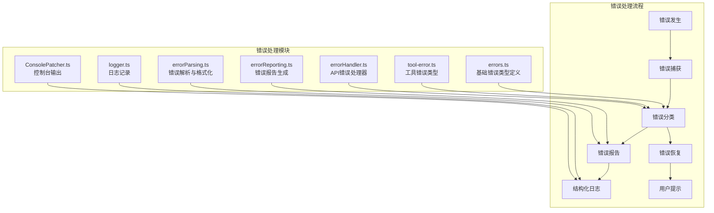
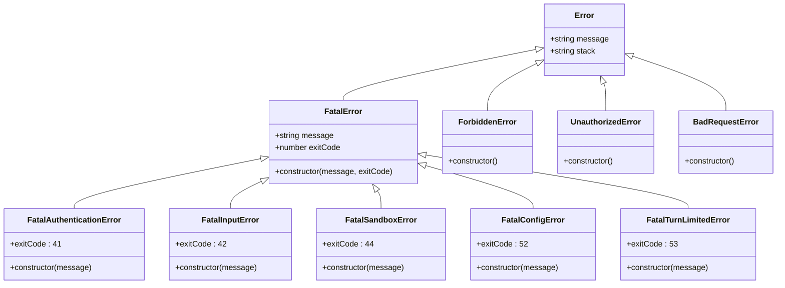
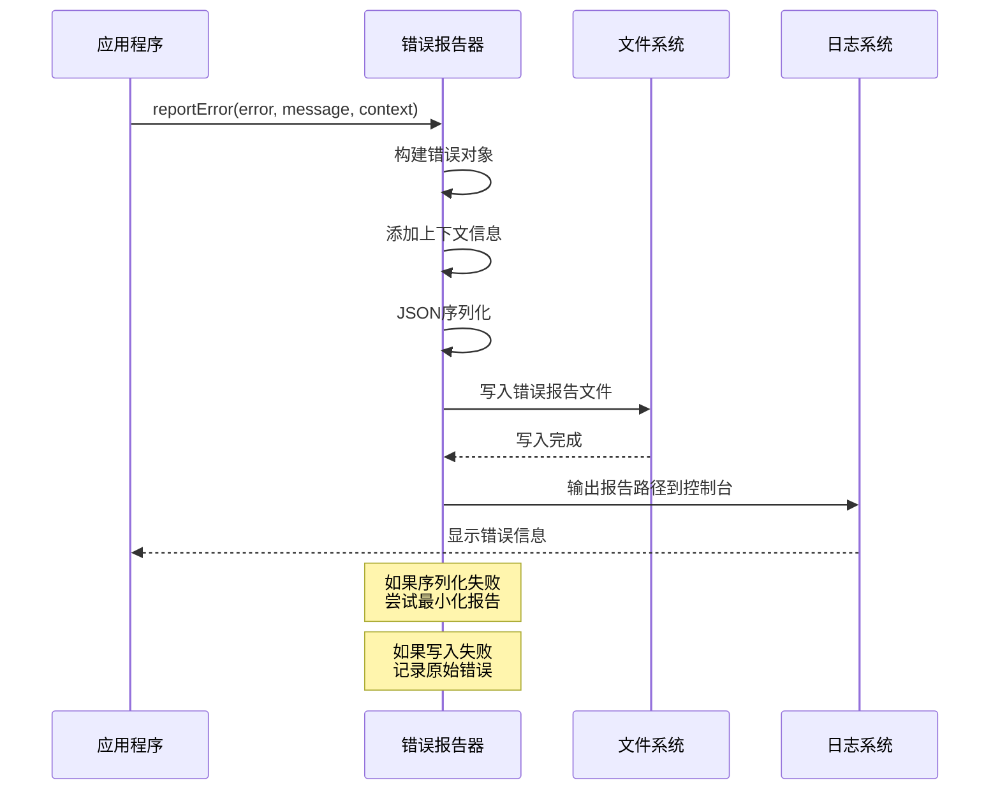
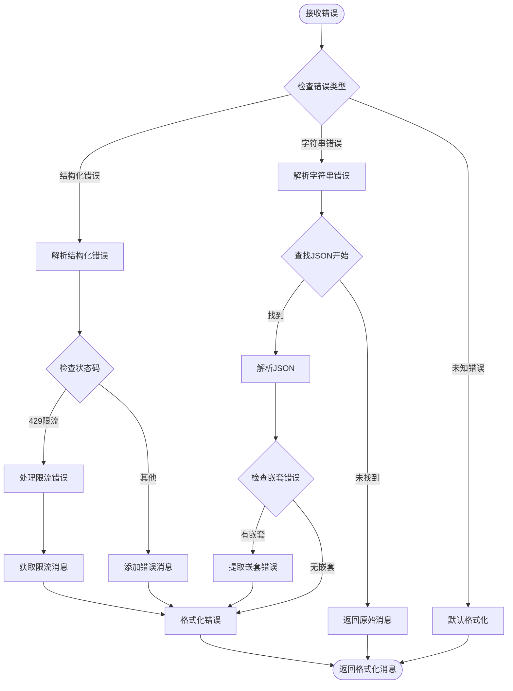
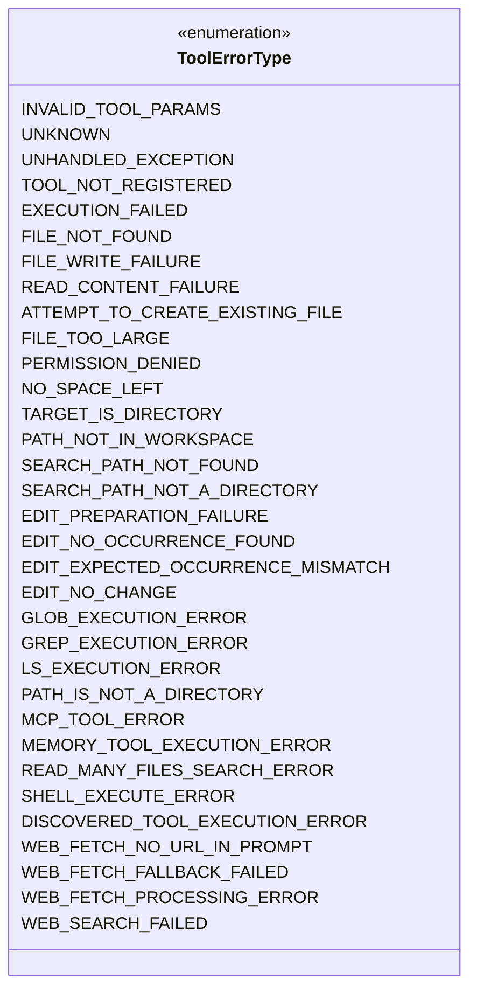
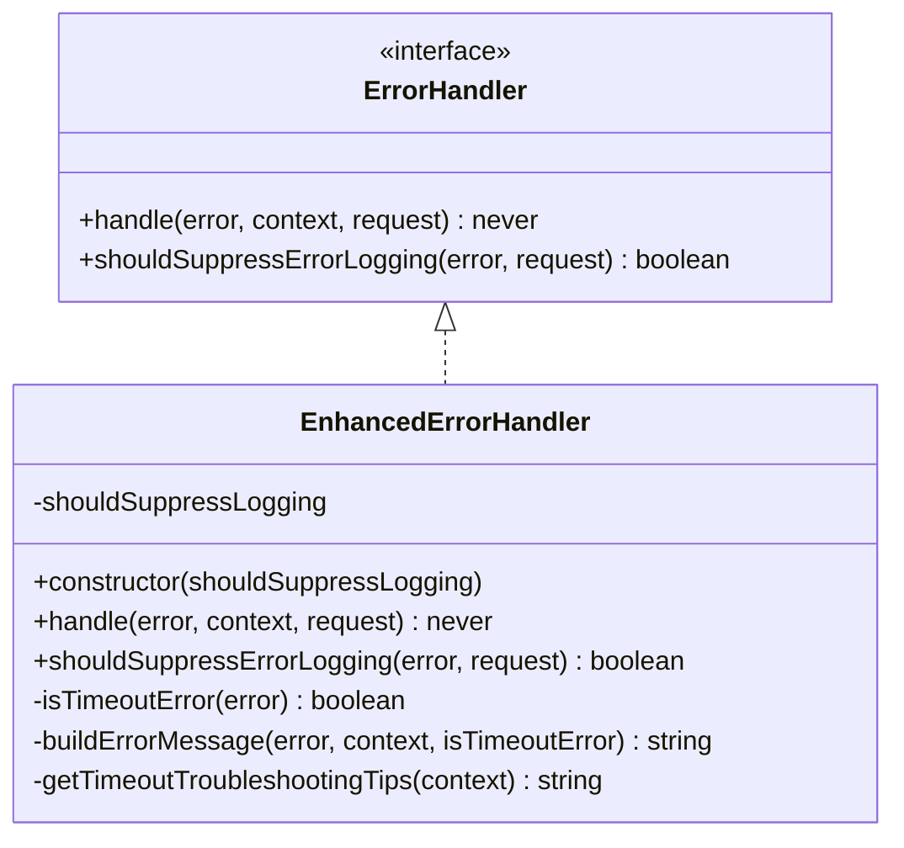
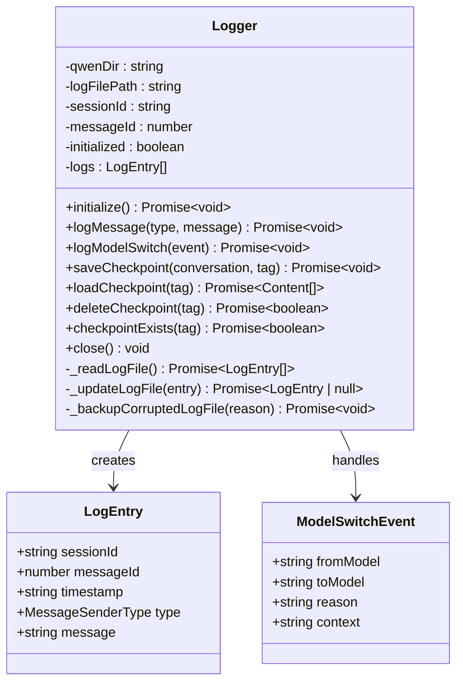
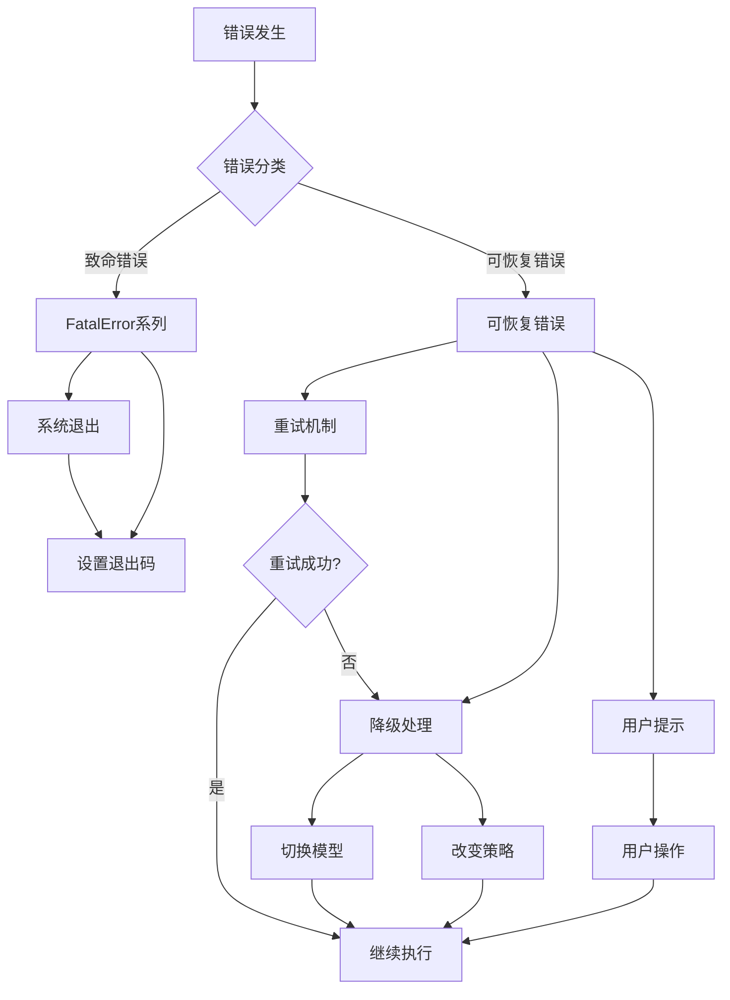

# 错误处理机制

<cite>
**本文档引用的文件**
- [errors.ts](file://packages/core/src/utils/errors.ts)
- [errorReporting.ts](file://packages/core/src/utils/errorReporting.ts)
- [errorParsing.ts](file://packages/core/src/utils/errorParsing.ts)
- [tool-error.ts](file://packages/core/src/tools/tool-error.ts)
- [errorHandler.ts](file://packages/core/src/core/openaiContentGenerator/errorHandler.ts)
- [logger.ts](file://packages/core/src/core/logger.ts)
- [ConsolePatcher.ts](file://packages/cli/src/ui/utils/ConsolePatcher.ts)
</cite>

## 目录
1. [简介](#简介)
2. [项目结构概览](#项目结构概览)
3. [核心错误类型](#核心错误类型)
4. [错误报告系统](#错误报告系统)
5. [错误解析与格式化](#错误解析与格式化)
6. [工具错误处理](#工具错误处理)
7. [API错误处理](#api错误处理)
8. [日志记录机制](#日志记录机制)
9. [错误分类与恢复策略](#错误分类与恢复策略)
10. [故障排除指南](#故障排除指南)
11. [总结](#总结)

## 简介

Qwen Code采用了一套完整的错误处理架构，旨在提供结构化的错误管理、详细的错误报告和智能的错误恢复机制。该系统通过分层的设计模式，将不同类型的错误进行分类处理，并提供了丰富的上下文信息来帮助开发者快速定位和解决问题。

## 项目结构概览

错误处理相关的文件主要分布在以下目录中：



**图表来源**
- [errors.ts](file://packages/core/src/utils/errors.ts#L1-L103)
- [errorReporting.ts](file://packages/core/src/utils/errorReporting.ts#L1-L119)
- [errorParsing.ts](file://packages/core/src/utils/errorParsing.ts#L1-L167)

## 核心错误类型

### 基础错误类层次结构

系统定义了清晰的错误类层次结构，支持错误的继承和分类：



**图表来源**
- [errors.ts](file://packages/core/src/utils/errors.ts#L25-L60)

### 错误类型详解

#### 致命错误（FatalError）
致命错误表示系统无法继续运行的情况，每个致命错误都有特定的退出码：

- **FatalAuthenticationError (退出码: 41)**: 认证失败导致系统无法启动
- **FatalInputError (退出码: 42)**: 输入参数无效或配置错误
- **FatalSandboxError (退出码: 44)**: 沙箱环境初始化失败
- **FatalConfigError (退出码: 52)**: 配置文件损坏或缺失
- **FatalTurnLimitedError (退出码: 53)**: 对话轮次限制达到上限

#### HTTP状态错误
系统还定义了标准的HTTP错误类：

- **ForbiddenError**: 403权限被拒绝
- **UnauthorizedError**: 401未授权访问
- **BadRequestError**: 400请求参数错误

**章节来源**
- [errors.ts](file://packages/core/src/utils/errors.ts#L25-L85)

## 错误报告系统

### 错误报告架构

错误报告系统负责捕获异常、收集上下文信息并生成结构化的错误报告文件：



**图表来源**
- [errorReporting.ts](file://packages/core/src/utils/errorReporting.ts#L25-L119)

### 错误报告功能特性

#### 上下文信息收集
错误报告器能够自动收集和包含以下上下文信息：
- 请求参数和内容
- 用户操作历史
- 系统状态信息
- 时间戳和会话标识

#### 容错处理机制
系统实现了多层容错处理：

1. **序列化失败处理**: 当上下文包含不可序列化的数据（如BigInt）时，系统会移除上下文部分
2. **文件写入失败处理**: 即使文件写入失败，也会在控制台输出关键信息
3. **最小化报告**: 在极端情况下，只记录错误基本信息

#### 报告文件命名规范
错误报告文件采用统一的命名格式：
```
gemini-client-error-{type}-{timestamp}.json
```

其中：
- `{type}`: 错误类型标识符
- `{timestamp}`: ISO格式的时间戳

**章节来源**
- [errorReporting.ts](file://packages/core/src/utils/errorReporting.ts#L25-L119)

## 错误解析与格式化

### API错误解析流程

错误解析器专门处理来自API的错误响应，将其转换为用户友好的格式：



**图表来源**
- [errorParsing.ts](file://packages/core/src/utils/errorParsing.ts#L103-L166)

### 错误消息定制化

系统根据不同的认证类型和用户层级提供定制化的错误消息：

#### Google认证用户的错误消息
- **免费用户**: 提供基础的使用建议和升级选项
- **付费用户**: 包含具体的配额信息和解决方案

#### 其他认证方式
- **USE_GEMINI**: 提供Gemini平台的使用建议
- **USE_VERTEX_AI**: 提供Vertex AI平台的使用建议

**章节来源**
- [errorParsing.ts](file://packages/core/src/utils/errorParsing.ts#L103-L166)

## 工具错误处理

### 工具错误类型枚举

系统为各种工具定义了详细的错误类型：



**图表来源**
- [tool-error.ts](file://packages/core/src/tools/tool-error.ts#L10-L69)

### 工具执行错误处理

当工具执行失败时，系统会：
1. **参数验证失败**: 返回INVALID_TOOL_PARAMS错误
2. **工具未注册**: 返回TOOL_NOT_REGISTERED错误
3. **执行异常**: 返回EXECUTION_FAILED错误
4. **未处理异常**: 返回UNHANDLED_EXCEPTION错误

**章节来源**
- [tool-error.ts](file://packages/core/src/tools/tool-error.ts#L10-L69)

## API错误处理

### 错误处理器接口

系统定义了统一的错误处理器接口：



**图表来源**
- [errorHandler.ts](file://packages/core/src/core/openaiContentGenerator/errorHandler.ts#L10-L130)

### 超时错误检测

增强的错误处理器能够智能识别超时错误：

#### 超时错误特征
- **消息关键词**: timeout, timed out, connection timeout等
- **网络错误代码**: ETIMEDOUT, ESOCKETTIMEDOUT
- **错误类型**: timeout
- **时间相关**: deadline exceeded

#### 超时错误恢复建议
系统提供详细的故障排除建议：
- 减少输入长度或复杂度
- 增加超时配置
- 检查网络连接
- 使用非流式模式处理长输入

**章节来源**
- [errorHandler.ts](file://packages/core/src/core/openaiContentGenerator/errorHandler.ts#L45-L130)

## 日志记录机制

### 结构化日志系统

系统实现了完整的结构化日志记录机制：



**图表来源**
- [logger.ts](file://packages/core/src/core/logger.ts#L75-L460)

### 日志文件管理

#### 文件格式与编码
- **文件名**: logs.json
- **编码**: UTF-8
- **格式**: JSON数组
- **备份机制**: 自动创建损坏文件的备份

#### 会话隔离
每个会话都有独立的日志记录，确保数据隔离和安全性。

#### 检查点功能
系统支持保存和加载对话检查点：
- **保存检查点**: `saveCheckpoint(conversation, tag)`
- **加载检查点**: `loadCheckpoint(tag)`
- **删除检查点**: `deleteCheckpoint(tag)`
- **检查点存在性**: `checkpointExists(tag)`

**章节来源**
- [logger.ts](file://packages/core/src/core/logger.ts#L75-L460)

## 错误分类与恢复策略

### 可恢复错误 vs 致命错误

系统将错误分为两大类：



### 错误恢复策略

#### 模型降级策略
当遇到API错误时，系统会自动尝试：
1. **切换到备用模型**: 如从Gemini Pro切换到Flash
2. **调整请求参数**: 减少输入长度或复杂度
3. **启用缓存机制**: 利用之前的结果避免重复计算

#### 用户交互策略
对于需要用户干预的错误：
- **显示友好提示**: 使用易懂的语言解释问题
- **提供解决方案**: 给出具体的修复步骤
- **引导用户操作**: 指导用户执行必要的配置更改

## 故障排除指南

### 常见错误代码及解决方案

#### 致命错误代码对照表

| 退出码 | 错误类型 | 可能原因 | 解决方案 |
|--------|----------|----------|----------|
| 41 | FatalAuthenticationError | 认证凭据无效或过期 | 重新运行 `/auth` 命令 |
| 42 | FatalInputError | 配置文件损坏或参数错误 | 检查配置文件语法，使用 `/settings` 查看当前设置 |
| 44 | FatalSandboxError | 沙箱环境初始化失败 | 重启应用程序，检查系统资源 |
| 52 | FatalConfigError | 配置文件缺失或权限不足 | 检查 ~/.qwen 目录权限 |
| 53 | FatalTurnLimitedError | 对话轮次限制达到上限 | 重新开始新的对话会话 |

#### 工具执行错误排查

##### 文件系统错误
- **FILE_NOT_FOUND**: 检查文件路径是否正确
- **PERMISSION_DENIED**: 确认文件权限设置
- **FILE_TOO_LARGE**: 减少文件大小或使用批量处理

##### 网络相关错误
- **SHELL_EXECUTE_ERROR**: 检查Shell命令语法
- **WEB_FETCH_*_ERROR**: 验证URL有效性和网络连接

#### API错误处理

##### 限流错误 (429)
系统会自动：
1. 切换到备用模型
2. 提供升级建议
3. 记录详细的错误信息用于后续分析

##### 连接错误
- **超时错误**: 减少输入长度，增加超时时间
- **网络不稳定**: 使用非流式模式，检查网络连接

### 调试技巧

#### 启用调试模式
```bash
# 设置调试级别
export DEBUG=true

# 或者在配置中启用
{
  "debugMode": true
}
```

#### 查看错误报告
系统会在临时目录生成错误报告文件：
```bash
# Linux/macOS
ls /tmp/gemini-client-error-*.json

# Windows
dir %TEMP%\gemini-client-error-*.json
```

#### 检查日志文件
```bash
# 查看最近的日志条目
tail -n 100 ~/.qwen/logs.json
```

## 总结

Qwen Code的错误处理机制体现了现代软件工程的最佳实践，具有以下特点：

### 设计优势
1. **分层架构**: 清晰的错误分类和处理层次
2. **容错设计**: 多层容错机制确保系统的稳定性
3. **用户友好**: 提供详细的错误信息和解决方案
4. **可扩展性**: 支持新错误类型的轻松添加

### 技术特色
1. **结构化日志**: 完整的会话跟踪和检查点功能
2. **智能解析**: 自动识别和格式化API错误
3. **自动恢复**: 智能的降级和重试机制
4. **全面监控**: 详细的错误报告和分析能力

### 实际应用价值
这套错误处理系统不仅提高了系统的可靠性，还为开发者提供了强大的调试和诊断工具。通过详细的错误信息、自动化的恢复机制和用户友好的提示，大大提升了用户体验和开发效率。