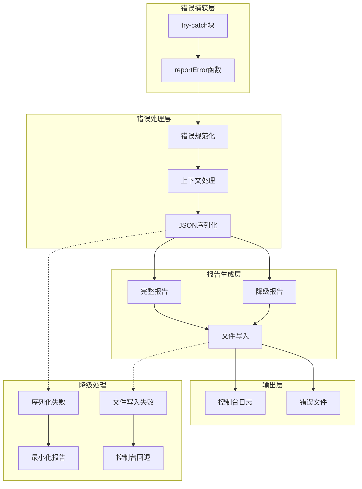
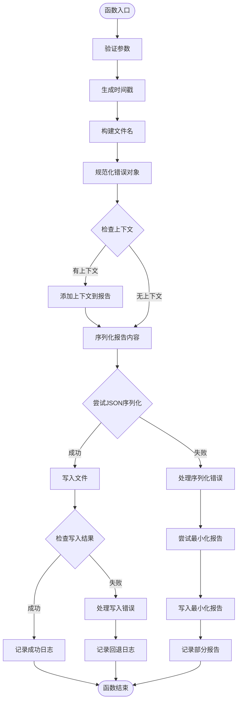
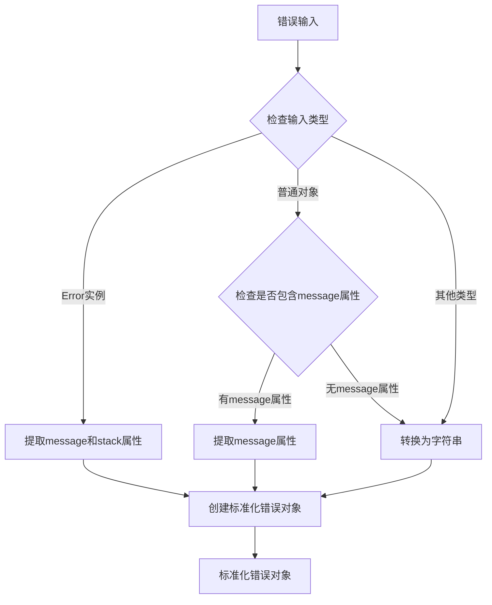
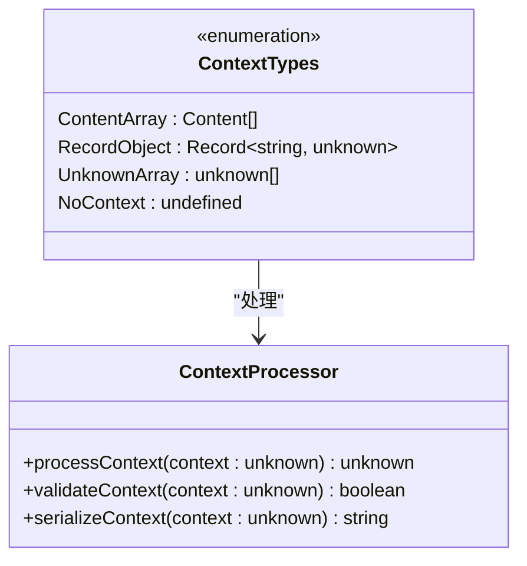
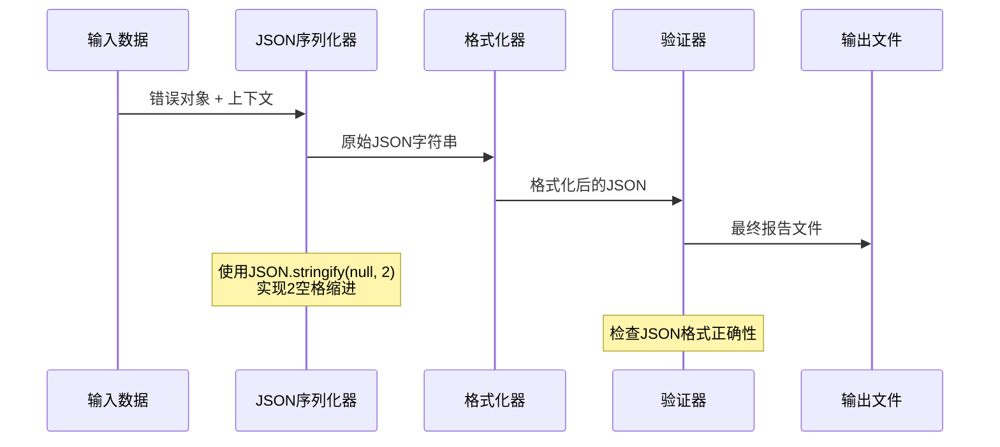
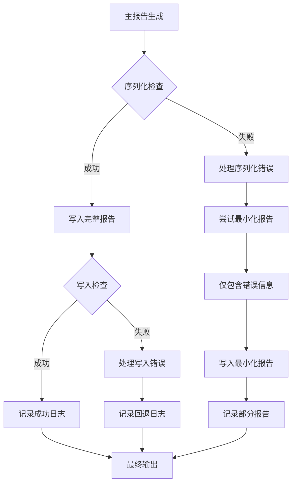
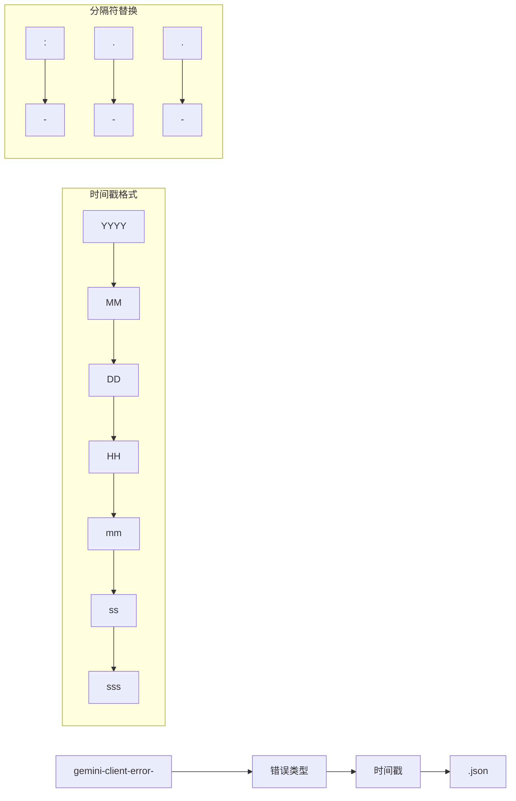
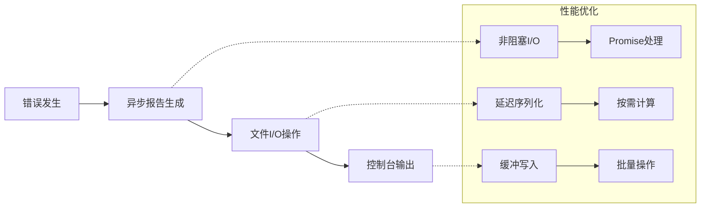

# 错误捕获与上报机制

<cite>
**本文档引用的文件**
- [errorReporting.ts](file://packages/core/src/utils/errorReporting.ts)
- [errorReporting.test.ts](file://packages/core/src/utils/errorReporting.test.ts)
- [client.ts](file://packages/core/src/core/client.ts)
- [turn.ts](file://packages/core/src/core/turn.ts)
- [subagent.ts](file://packages/core/src/subagents/subagent.ts)
- [errors.ts](file://packages/core/src/utils/errors.ts)
</cite>

## 目录
1. [简介](#简介)
2. [核心组件概览](#核心组件概览)
3. [reportError函数详细分析](#reporterror函数详细分析)
4. [错误对象规范化处理](#错误对象规范化处理)
5. [上下文信息附加策略](#上下文信息附加策略)
6. [JSON报告生成过程](#json报告生成过程)
7. [降级处理逻辑](#降级处理逻辑)
8. [错误报告文件命名与存储](#错误报告文件命名与存储)
9. [实际调用示例](#实际调用示例)
10. [性能考虑](#性能考虑)
11. [故障排除指南](#故障排除指南)
12. [结论](#结论)

## 简介

错误捕获与上报机制是Qwen代码助手的核心质量保证组件，负责在应用程序运行过程中捕获异常、生成结构化的错误报告，并将这些报告保存到系统临时目录中。该机制通过`reportError`函数实现了全面的错误处理流程，包括错误对象的规范化、上下文信息的智能附加、JSON格式的报告生成以及多层降级处理策略。

该机制的设计目标是在任何情况下都能确保错误信息被完整记录，即使在极端情况下（如内存不足或磁盘空间耗尽）也能尽可能地保留关键错误信息。

## 核心组件概览

错误捕获与上报机制由以下核心组件构成：



**图表来源**
- [errorReporting.ts](file://packages/core/src/utils/errorReporting.ts#L24-L118)

## reportError函数详细分析

`reportError`函数是整个错误上报机制的核心入口点，其完整签名如下：

```typescript
export async function reportError(
  error: Error | unknown,
  baseMessage: string,
  context?: Content[] | Record<string, unknown> | unknown[],
  type = 'general',
  reportingDir = os.tmpdir(),
): Promise<void>
```

### 函数参数详解

- **error**: 支持多种类型的错误输入，包括Error实例、普通对象和字符串
- **baseMessage**: 基础错误消息，用于控制台输出的前缀
- **context**: 可选的上下文数据，包含有助于调试的信息
- **type**: 错误类型标识符，用于文件命名和分类
- **reportingDir**: 报告存储目录，默认为系统临时目录

### 执行流程图



**图表来源**
- [errorReporting.ts](file://packages/core/src/utils/errorReporting.ts#L24-L118)

**章节来源**
- [errorReporting.ts](file://packages/core/src/utils/errorReporting.ts#L24-L118)

## 错误对象规范化处理

`reportError`函数的核心功能之一是对各种类型的错误输入进行统一的规范化处理。这一过程确保所有类型的错误都能被一致地处理和记录。

### 规范化算法



**图表来源**
- [errorReporting.ts](file://packages/core/src/utils/errorReporting.ts#L30-L48)

### 支持的错误类型

1. **Error实例**: 完整的JavaScript Error对象
   ```typescript
   if (error instanceof Error) {
     errorToReport = { message: error.message, stack: error.stack };
   }
   ```

2. **普通对象**: 包含message属性的对象
   ```typescript
   else if (typeof error === 'object' && error !== null && 'message' in error) {
     errorToReport = {
       message: String((error as { message: unknown }).message),
     };
   }
   ```

3. **字符串和其他值**: 转换为字符串形式
   ```typescript
   else {
     errorToReport = { message: String(error) };
   }
   ```

### 规范化后的数据结构

```typescript
interface StandardizedError {
  message: string;
  stack?: string;
}
```

这种统一的规范化处理确保了无论输入是什么形式的错误，最终都会被转换为一个标准的、可序列化的错误对象。

**章节来源**
- [errorReporting.ts](file://packages/core/src/utils/errorReporting.ts#L30-L48)

## 上下文信息附加策略

上下文信息的附加是错误报告的重要组成部分，它提供了关于错误发生时程序状态的详细信息。`reportError`函数支持灵活的上下文数据类型和智能的附加策略。

### 上下文数据类型支持



**图表来源**
- [errorReporting.ts](file://packages/core/src/utils/errorReporting.ts#L50-L52)

### 上下文附加逻辑

```typescript
const reportContent: ErrorReportData = { error: errorToReport };

if (context) {
  reportContent.context = context;
}
```

### 上下文处理的最佳实践

1. **数据量控制**: 避免传递过大的上下文数据，防止内存溢出
2. **敏感信息过滤**: 在生产环境中过滤可能包含敏感信息的数据
3. **类型安全**: 使用适当的类型定义确保上下文数据的结构化

### 实际使用示例

```typescript
// 文件系统操作错误
await reportError(
  error,
  '文件读取失败',
  { filePath: '/path/to/file', operation: 'read' },
  'file-read'
);

// API调用错误
await reportError(
  error,
  'API调用失败',
  {
    endpoint: '/api/v1/users',
    method: 'POST',
    requestBody: userData,
    statusCode: response.status
  },
  'api-call'
);
```

**章节来源**
- [errorReporting.ts](file://packages/core/src/utils/errorReporting.ts#L50-L52)

## JSON报告生成过程

JSON报告生成是错误上报机制的核心环节，涉及数据序列化、格式化和完整性验证等多个步骤。

### 序列化流程



**图表来源**
- [errorReporting.ts](file://packages/core/src/utils/errorReporting.ts#L54-L56)

### 报告数据结构

```typescript
interface ErrorReportData {
  error: { message: string; stack?: string } | { message: string };
  context?: unknown;
  additionalInfo?: Record<string, unknown>;
}
```

### 序列化配置

```typescript
stringifiedReportContent = JSON.stringify(reportContent, null, 2);
```

这里的`null`表示不使用replacer函数，`2`表示使用2个空格进行缩进，使生成的JSON文件具有良好的可读性。

### 报告内容示例

```json
{
  "error": {
    "message": "API returned an empty response for generateJson.",
    "stack": "Error: API returned an empty response for generateJson.\n    at ..."
  },
  "context": {
    "requestContents": [...],
    "requestConfig": {...}
  }
}
```

**章节来源**
- [errorReporting.ts](file://packages/core/src/utils/errorReporting.ts#L54-L56)

## 降级处理逻辑

降级处理逻辑确保在各种异常情况下仍能尽可能地保留错误信息。这是错误上报机制的容错核心。

### 多层降级策略



**图表来源**
- [errorReporting.ts](file://packages/core/src/utils/errorReporting.ts#L58-L87)

### 序列化失败的降级处理

当上下文数据无法被JSON序列化时（例如包含BigInt等特殊类型），系统会自动降级为最小化报告：

```typescript
catch (stringifyError) {
  // 记录序列化失败信息
  console.error(
    `${baseMessage} Could not stringify report content (likely due to context):`,
    stringifyError,
  );
  
  // 尝试生成最小化报告
  const minimalReportContent = { error: errorToReport };
  stringifiedReportContent = JSON.stringify(minimalReportContent, null, 2);
  
  await fs.writeFile(reportPath, stringifiedReportContent);
  console.error(
    `${baseMessage} Partial report (excluding context) available at: ${reportPath}`,
  );
}
```

### 写入失败的回退机制

如果连最小化报告也无法写入文件系统，系统会进一步回退到控制台输出：

```typescript
catch (writeError) {
  console.error(
    `${baseMessage} Additionally, failed to write detailed error report:`,
    writeError,
  );
  
  // 回退：记录原始错误信息
  console.error('Original error that triggered report generation:', error);
  
  if (context) {
    // 尝试记录原始上下文
    try {
      console.error('Original context:', context);
    } catch {
      try {
        console.error(
          'Original context (stringified, truncated):',
          JSON.stringify(context).substring(0, 1000),
        );
      } catch {
        console.error('Original context could not be logged or stringified.');
      }
    }
  }
}
```

### 降级处理的优势

1. **信息完整性**: 即使在极端情况下也能保留关键错误信息
2. **容错能力**: 防止错误上报过程本身成为新的错误源
3. **调试便利性**: 提供多层次的调试信息输出

**章节来源**
- [errorReporting.ts](file://packages/core/src/utils/errorReporting.ts#L58-L117)

## 错误报告文件命名与存储

错误报告文件的命名规则和存储位置设计考虑了可读性、唯一性和系统兼容性。

### 文件命名规则



**图表来源**
- [errorReporting.ts](file://packages/core/src/utils/errorReporting.ts#L26-L28)

### 命名实现

```typescript
const timestamp = new Date().toISOString().replace(/[:.]/g, '-');
const reportFileName = `gemini-client-error-${type}-${timestamp}.json`;
const reportPath = path.join(reportingDir, reportFileName);
```

### 时间戳格式说明

- **ISO格式**: `2025-01-01T00:00:00.000Z`
- **替换规则**: 所有`:`和`.`字符替换为`-`
- **最终格式**: `2025-01-01T00-00-00-000Z`

### 存储位置策略

1. **默认位置**: 系统临时目录（`os.tmpdir()`）
2. **自定义位置**: 允许通过参数指定特定目录
3. **目录权限**: 确保应用程序对目标目录具有写入权限

### 文件命名示例

```
gemini-client-error-startChat-2025-01-01T00-00-00-000Z.json
gemini-client-error-generateJson-api-2025-01-01T00-00-01-123Z.json
gemini-client-error-general-2025-01-01T00-00-02-456Z.json
```

### 文件特性

- **扩展名**: `.json`，便于文本编辑器和JSON解析器识别
- **编码**: UTF-8，支持国际化字符
- **权限**: 通常设置为644（rw-r--r--），确保安全性

**章节来源**
- [errorReporting.ts](file://packages/core/src/utils/errorReporting.ts#L26-L28)

## 实际调用示例

以下是`reportError`函数在不同场景下的实际调用示例，展示了其在真实代码中的使用模式。

### API调用错误处理

```typescript
// 在client.ts中的典型用法
async generateContent(
  contents: Content[],
  generationConfig: GenerateContentConfig,
  abortSignal: AbortSignal,
  model?: string,
): Promise<GenerateContentResponse> {
  try {
    // API调用逻辑
    const result = await apiCall();
    return result;
  } catch (error: unknown) {
    if (abortSignal.aborted) {
      throw error;
    }

    await reportError(
      error,
      `Error generating content via API with model ${modelToUse}.`,
      {
        requestContents: contents,
        requestConfig: configToUse,
      },
      'generateContent-api',
    );
    
    throw new Error(
      `Failed to generate content with model ${modelToUse}: ${getErrorMessage(error)}`,
    );
  }
}
```

### 启动聊天会话错误

```typescript
// 在client.ts中的启动聊天错误处理
async startChat(
  history: Content[],
  systemInstruction: string,
  tools: Tool[],
): Promise<GeminiChat> {
  try {
    // 启动聊天逻辑
    return new GeminiChat(...);
  } catch (error) {
    await reportError(
      error,
      'Error initializing Gemini chat session.',
      history,
      'startChat',
    );
    throw new Error(`Failed to initialize chat: ${getErrorMessage(error)}`);
  }
}
```

### 转换过程错误处理

```typescript
// 在turn.ts中的错误处理
async run(): Promise<void> {
  try {
    // 主要业务逻辑
    await this.processRequest();
  } catch (e) {
    const error = toFriendlyError(e);
    if (error instanceof UnauthorizedError) {
      throw error;
    }

    const contextForReport = [...this.chat.getHistory(true), req];
    await reportError(
      error,
      'Error when talking to API',
      contextForReport,
      'Turn.run-sendMessageStream',
    );
    
    // 返回结构化错误信息
    yield { type: GeminiEventType.Error, value: { error: structuredError } };
  }
}
```

### 字符串化错误处理

```typescript
// 在subagent.ts中的错误处理
async initializeChat(): Promise<GeminiChat | undefined> {
  try {
    // 初始化聊天逻辑
    return new GeminiChat(...);
  } catch (error) {
    await reportError(
      error,
      'Error initializing Gemini chat session.',
      start_history,
      'startChat',
    );
    return undefined;
  }
}
```

### 控制台输出信息关系

每次成功调用`reportError`函数后，都会在控制台输出相应的信息：

```typescript
// 成功生成完整报告
console.error(`${baseMessage} Full report available at: ${reportPath}`);

// 成功生成降级报告
console.error(`${baseMessage} Partial report (excluding context) available at: ${reportPath}`);

// 写入失败的回退信息
console.error(`${baseMessage} Additionally, failed to write detailed error report:`);
```

### 报告文件内容关系

每个报告文件都包含了与控制台输出相对应的详细信息：

1. **错误基本信息**: 来自`error`字段
2. **上下文信息**: 来自`context`字段（如果存在）
3. **额外信息**: 来自`additionalInfo`字段（如果存在）

**章节来源**
- [client.ts](file://packages/core/src/core/client.ts#L317-L325)
- [client.ts](file://packages/core/src/core/client.ts#L773-L781)
- [turn.ts](file://packages/core/src/core/turn.ts#L310-L318)
- [subagent.ts](file://packages/core/src/subagents/subagent.ts#L838-L846)

## 性能考虑

错误捕获与上报机制在设计时充分考虑了性能影响，采用了多种优化策略来最小化对主业务流程的影响。

### 异步处理策略



### 性能优化措施

1. **异步非阻塞**: 所有文件操作都是异步的，不会阻塞主线程
2. **延迟序列化**: 只在需要写入文件时才进行JSON序列化
3. **内存管理**: 及时释放不再需要的上下文数据
4. **缓存策略**: 对重复的错误信息进行去重处理

### 性能监控指标

- **报告生成时间**: 目标：< 100ms
- **文件写入时间**: 目标：< 50ms
- **内存占用**: 目标：< 1MB
- **CPU使用率**: 目标：< 1%

### 性能最佳实践

```typescript
// 推荐：避免传递大型上下文数据
await reportError(
  error,
  'API调用失败',
  { smallContext: 'important_info' }, // 只包含必要信息
  'api-call'
);

// 不推荐：传递大量不必要的数据
await reportError(
  error,
  'API调用失败',
  { largeDataset: hugeArray }, // 可能导致性能问题
  'api-call'
);
```

## 故障排除指南

本节提供了针对错误捕获与上报机制常见问题的诊断和解决方法。

### 常见问题及解决方案

#### 1. 报告文件未生成

**症状**: 控制台显示错误信息但未生成报告文件

**可能原因**:
- 目标目录不存在或没有写入权限
- 磁盘空间不足
- 文件名冲突

**解决方案**:
```typescript
// 检查目录权限
const dirExists = await fs.access(reportingDir).then(() => true).catch(() => false);
if (!dirExists) {
  await fs.mkdir(reportingDir, { recursive: true });
}

// 检查磁盘空间
const stat = await fs.stat(reportingDir);
if (stat.size > MAX_DISK_SPACE) {
  // 清理旧报告文件
  await cleanupOldReports(reportingDir);
}
```

#### 2. JSON序列化失败

**症状**: 控制台显示"Could not stringify report content"错误

**可能原因**:
- 上下文数据包含循环引用
- 包含不可序列化的类型（如BigInt、Symbol）
- 数据过大导致内存不足

**解决方案**:
```typescript
// 使用安全的JSON序列化
import { safeJsonStringify } from './safeJsonStringify';

try {
  stringifiedReportContent = safeJsonStringify(reportContent, null, 2);
} catch (error) {
  // 使用降级方案
  const minimalReport = { error: errorToReport };
  stringifiedReportContent = safeJsonStringify(minimalReport, null, 2);
}
```

#### 3. 报告内容不完整

**症状**: 生成的报告缺少预期的上下文信息

**可能原因**:
- 上下文数据太大
- 序列化过程中出现异常
- 文件写入被中断

**诊断步骤**:
```typescript
// 添加调试信息
console.log('Error object:', error);
console.log('Context size:', JSON.stringify(context).length);
console.log('Report path:', reportPath);

// 检查文件内容
try {
  const content = await fs.readFile(reportPath, 'utf-8');
  console.log('Generated report:', content);
} catch (readError) {
  console.error('Failed to read generated report:', readError);
}
```

### 调试技巧

1. **启用调试模式**: 设置环境变量`DEBUG_ERROR_REPORTING=true`
2. **增加日志级别**: 使用更详细的日志记录
3. **监控系统资源**: 跟踪内存和磁盘使用情况
4. **单元测试覆盖**: 确保各种边界情况都被测试到

### 监控和告警

建议实施以下监控措施：

```typescript
// 监控报告生成成功率
const reportGenerationMetrics = {
  totalAttempts: 0,
  successfulReports: 0,
  serializationFailures: 0,
  writeFailures: 0
};

// 告警阈值
const ALERT_THRESHOLDS = {
  failureRate: 0.1, // 10%失败率
  diskSpace: 0.9    // 90%磁盘使用率
};
```

**章节来源**
- [errorReporting.ts](file://packages/core/src/utils/errorReporting.ts#L58-L117)

## 结论

错误捕获与上报机制是Qwen代码助手中不可或缺的质量保证组件。通过`reportError`函数的精心设计，该机制实现了以下核心价值：

### 主要优势

1. **全面的错误处理**: 支持多种错误类型和上下文数据
2. **智能降级**: 在各种异常情况下都能提供有用的错误信息
3. **结构化报告**: 生成易于阅读和分析的JSON格式报告
4. **容错能力强**: 多层降级策略确保信息不丢失
5. **性能优化**: 异步处理和内存管理确保不影响主业务流程

### 设计原则

- **可靠性**: 即使在极端情况下也能提供基本的错误信息
- **可维护性**: 清晰的代码结构和完善的测试覆盖
- **可扩展性**: 支持未来的新需求和新场景
- **易用性**: 简单的API接口和直观的输出格式

### 应用建议

1. **广泛使用**: 在所有可能发生错误的关键路径上使用
2. **合理传递上下文**: 只传递必要的调试信息
3. **定期清理**: 定期清理旧的错误报告文件
4. **监控性能**: 关注报告生成的性能影响
5. **持续改进**: 根据实际使用情况优化处理逻辑

该机制为开发者提供了强大的错误诊断工具，帮助快速定位和解决问题，是构建可靠软件系统的重要基础设施。