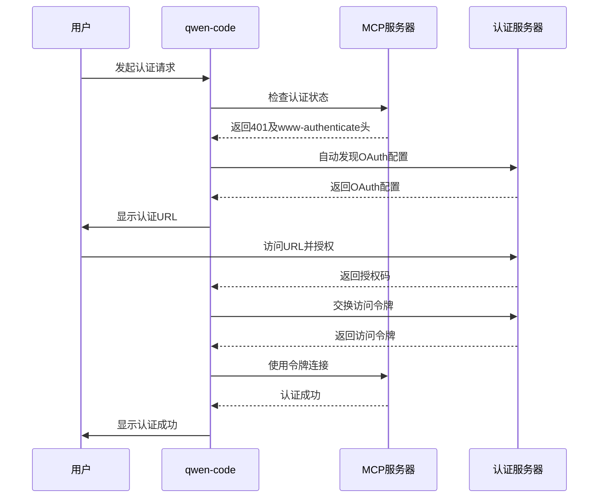
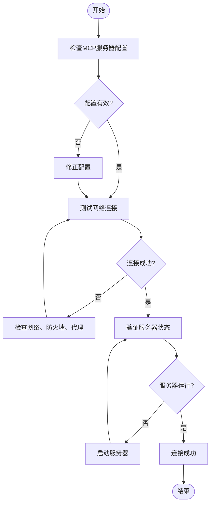
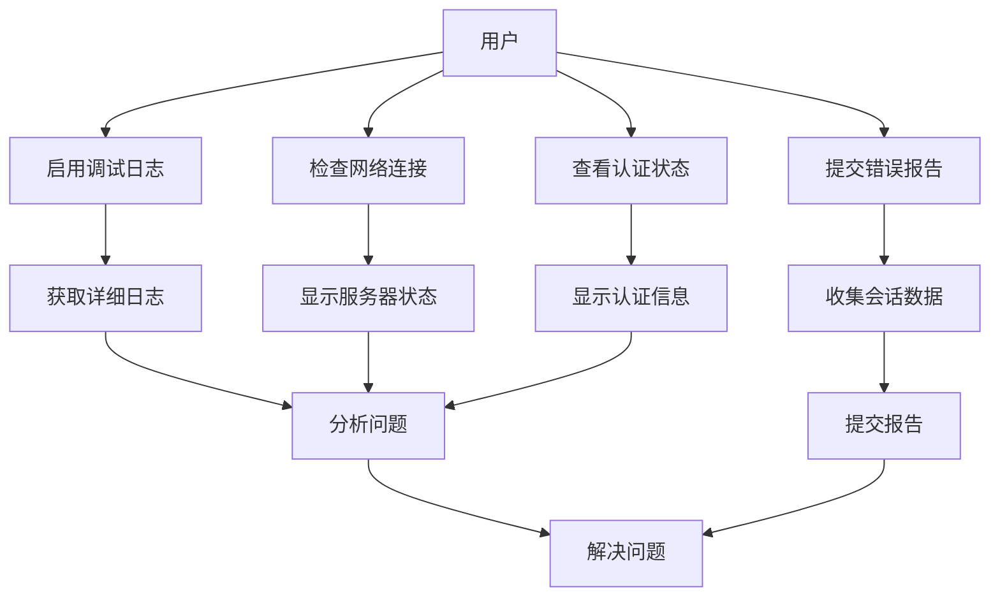

# 故障排除

<cite>
**本文档中引用的文件**  
- [errorReporting.ts](file://packages/core/src/utils/errorReporting.ts)
- [errors.ts](file://packages/core/src/utils/errors.ts)
- [mcp-client.ts](file://packages/core/src/tools/mcp-client.ts)
- [mcpCommand.ts](file://packages/cli/src/ui/commands/mcpCommand.ts)
- [bugCommand.ts](file://packages/cli/src/ui/commands/bugCommand.ts)
- [AuthInProgress.tsx](file://packages/cli/src/ui/components/AuthInProgress.tsx)
- [qwenOAuth2.ts](file://packages/core/src/qwen/qwenOAuth2.ts)
</cite>

## 目录
1. [简介](#简介)
2. [问题分类](#问题分类)
3. [安装问题](#安装问题)
4. [认证失败](#认证失败)
5. [网络连接错误](#网络连接错误)
6. [工具执行异常](#工具执行异常)
7. [诊断工具和命令](#诊断工具和命令)
8. [高级故障排除技巧](#高级故障排除技巧)
9. [常见问题（FAQ）](#常见问题（faq）)
10. [附录](#附录)

## 简介
qwen-code 是一个功能强大的代码辅助工具，但在使用过程中可能会遇到各种问题。本故障排除指南旨在帮助用户系统性地识别和解决在使用 qwen-code 时可能遇到的常见问题。通过分类问题类型、提供详细的症状描述、分析可能原因并给出逐步解决方案，本指南将提高用户自助解决问题的能力。同时，本指南还参考了项目中的错误处理机制，解释了关键错误代码的含义和应对策略，并提供了诊断工具和高级故障排除技巧。

## 问题分类
qwen-code 使用过程中可能遇到的问题可以系统性地分为以下几类：
- **安装问题**：包括依赖缺失、环境配置错误、权限问题等。
- **认证失败**：涉及 OAuth 认证、API 密钥验证、身份验证超时等问题。
- **网络连接错误**：如服务器无法访问、连接超时、DNS 解析失败等。
- **工具执行异常**：包括工具调用失败、参数错误、执行超时等。
- **性能问题**：响应缓慢、内存占用过高、CPU 使用率异常等。
- **配置问题**：配置文件错误、设置不正确、扩展冲突等。

## 安装问题
### 症状描述
- 安装命令执行失败，出现权限错误。
- 依赖包无法下载或安装。
- 安装完成后，命令行无法识别 qwen-code 命令。
- 启动时出现模块导入错误。

### 可能原因分析
- **权限不足**：在全局安装时没有使用管理员权限。
- **网络问题**：无法访问 npm 或其他包管理器的服务器。
- **环境变量配置错误**：PATH 环境变量未正确配置，导致命令无法找到。
- **Node.js 版本不兼容**：使用的 Node.js 版本与 qwen-code 要求的版本不匹配。

### 逐步解决方案
1. **检查 Node.js 版本**：
   ```bash
   node --version
   ```
   确保版本符合项目要求。

2. **使用正确的安装命令**：
   ```bash
   npm install -g qwen-code
   ```
   如果出现权限错误，尝试使用 `sudo`（仅限 Unix/Linux 系统）或以管理员身份运行命令提示符（Windows 系统）。

3. **检查 PATH 环境变量**：
   确保 npm 全局安装路径已添加到 PATH 中。可以通过以下命令检查：
   ```bash
   npm config get prefix
   ```

4. **清除 npm 缓存**：
   ```bash
   npm cache clean --force
   ```
   然后重新尝试安装。

**Section sources**
- [package.json](file://package.json)

## 认证失败
### 症状描述
- 认证过程中出现 "Authentication timed out" 错误。
- OAuth 认证流程无法完成，浏览器未自动打开。
- 认证成功后，仍然无法访问受保护的资源。
- 出现 "401 Unauthorized" 错误。

### 可能原因分析
- **认证超时**：用户在规定时间内未完成认证操作。
- **OAuth 配置错误**：MCP 服务器的 OAuth 配置不正确或缺失。
- **网络问题**：无法访问认证服务器或回调 URL。
- **令牌过期**：存储的 OAuth 令牌已过期，需要重新认证。

### 逐步解决方案
1. **检查认证超时设置**：
   在 `AuthInProgress.tsx` 组件中，认证超时时间为 180 秒。如果需要更长时间，可以修改源码中的超时设置。

2. **手动触发认证**：
   使用 `/mcp auth <server-name>` 命令手动触发认证流程：
   ```bash
   /mcp auth my-mcp-server
   ```

3. **检查 OAuth 配置**：
   确保 MCP 服务器的配置文件中包含正确的 OAuth 配置：
   ```json
   {
     "oauth": {
       "enabled": true,
       "authorizationUrl": "https://example.com/oauth/authorize",
       "tokenUrl": "https://example.com/oauth/token",
       "scopes": ["read", "write"]
     }
   }
   ```

4. **重新认证**：
   如果令牌已过期，删除存储的令牌并重新认证：
   ```bash
   rm ~/.qwen-code/auth-tokens.json
   /mcp auth my-mcp-server
   ```



**Diagram sources**
- [mcp-client.ts](file://packages/core/src/tools/mcp-client.ts#L873-L1259)
- [qwenOAuth2.ts](file://packages/core/src/qwen/qwenOAuth2.ts#L714-L750)

**Section sources**
- [mcp-client.ts](file://packages/core/src/tools/mcp-client.ts#L873-L1259)
- [AuthInProgress.tsx](file://packages/cli/src/ui/components/AuthInProgress.tsx#L0-L62)
- [qwenOAuth2.ts](file://packages/core/src/qwen/qwenOAuth2.ts#L714-L750)

## 网络连接错误
### 症状描述
- 连接 MCP 服务器时出现 "Cannot connect to server" 错误。
- 请求超时，出现 "ETIMEDOUT" 或 "ESOCKETTIMEDOUT" 错误。
- DNS 解析失败，出现 "ENOTFOUND" 错误。
- 连接被拒绝，出现 "ECONNREFUSED" 错误。

### 可能原因分析
- **服务器地址错误**：MCP 服务器的 URL 配置不正确。
- **网络不通**：客户端与服务器之间的网络连接存在问题。
- **防火墙或代理**：防火墙或代理阻止了连接。
- **服务器未运行**：MCP 服务器未启动或已崩溃。

### 逐步解决方案
1. **检查服务器地址**：
   确认 MCP 服务器的 URL 配置正确无误。

2. **测试网络连接**：
   使用 `ping` 或 `curl` 命令测试服务器是否可达：
   ```bash
   ping mcp-server.example.com
   curl -v http://mcp-server.example.com/health
   ```

3. **检查防火墙和代理设置**：
   确保防火墙或代理未阻止 qwen-code 的网络请求。

4. **验证服务器状态**：
   联系服务器管理员确认 MCP 服务器正在运行。



**Diagram sources**
- [mcp-client.ts](file://packages/core/src/tools/mcp-client.ts#L1184-L1259)

**Section sources**
- [mcp-client.ts](file://packages/core/src/tools/mcp-client.ts#L1184-L1259)

## 工具执行异常
### 症状描述
- 工具调用返回错误信息，如 "Unknown tool"。
- 工具执行超时。
- 工具参数错误，导致执行失败。
- 工具执行后无输出或输出不符合预期。

### 可能原因分析
- **工具名称错误**：调用的工具名称不存在或拼写错误。
- **参数格式错误**：传递给工具的参数不符合要求。
- **执行环境问题**：工具依赖的环境或资源不可用。
- **工具本身存在缺陷**：工具代码存在 bug 或逻辑错误。

### 逐步解决方案
1. **检查工具名称**：
   使用 `/mcp` 命令查看已配置的工具列表，确认工具名称正确：
   ```bash
   /mcp
   ```

2. **验证参数格式**：
   使用 `/mcp schema` 命令查看工具的参数模式，确保参数格式正确：
   ```bash
   /mcp schema
   ```

3. **检查执行环境**：
   确保工具依赖的环境变量、文件或服务已正确配置。

4. **查看详细错误信息**：
   启用调试模式，查看更详细的错误日志：
   ```bash
   qwen-code --debug
   ```

**Section sources**
- [mcpCommand.ts](file://packages/cli/src/ui/commands/mcpCommand.ts#L0-L532)

## 诊断工具和命令
### 启用调试日志
启用调试日志可以获取更详细的运行信息，有助于定位问题：
```bash
qwen-code --debug
```
或者在配置文件中设置 `debugMode: true`。

### 检查网络连接状态
使用以下命令检查与 MCP 服务器的连接状态：
```bash
/mcp
```
该命令会显示所有配置的 MCP 服务器及其连接状态。

### 查看认证状态
使用以下命令查看 OAuth 认证状态：
```bash
/mcp auth
```
该命令会列出所有支持 OAuth 认证的服务器及其认证状态。

### 提交错误报告
当遇到无法解决的问题时，可以使用 `/bug` 命令提交错误报告：
```bash
/bug 描述问题
```
该命令会自动收集会话信息并打开错误报告页面。



**Diagram sources**
- [mcpCommand.ts](file://packages/cli/src/ui/commands/mcpCommand.ts#L0-L532)
- [bugCommand.ts](file://packages/cli/src/ui/commands/bugCommand.ts#L0-L25)

**Section sources**
- [mcpCommand.ts](file://packages/cli/src/ui/commands/mcpCommand.ts#L0-L532)
- [bugCommand.ts](file://packages/cli/src/ui/commands/bugCommand.ts#L0-L25)

## 高级故障排除技巧
### 分析日志文件
qwen-code 会生成详细的日志文件，位于系统临时目录中。日志文件名以 `gemini-client-error-` 开头，包含时间戳和错误类型。通过分析日志文件，可以深入了解错误的上下文和堆栈信息。

### 使用网络抓包工具
使用 Wireshark 或 tcpdump 等网络抓包工具，可以捕获 qwen-code 与 MCP 服务器之间的网络通信。通过分析抓包数据，可以识别网络延迟、丢包、协议错误等问题。

### 检查错误报告机制
qwen-code 使用 `errorReporting.ts` 中的 `reportError` 函数生成错误报告。该函数会将错误信息、上下文和堆栈信息写入临时文件，并在控制台输出报告路径。了解这一机制有助于理解错误报告的生成过程。

```mermaid
classDiagram
class ErrorReportData {
+error : { message : string; stack? : string }
+context? : unknown
+additionalInfo? : Record~string, unknown~
}
class reportError {
+error : Error | unknown
+baseMessage : string
+context? : Content[] | Record~string, unknown~ | unknown[]
+type : string
+reportingDir : string
+Promise~void~
}
reportError --> ErrorReportData : "生成"
ErrorReportData --> fs.writeFile : "写入"
```

**Diagram sources**
- [errorReporting.ts](file://packages/core/src/utils/errorReporting.ts#L0-L118)

**Section sources**
- [errorReporting.ts](file://packages/core/src/utils/errorReporting.ts#L0-L118)

## 常见问题（FAQ）
### 如何解决认证超时问题？
认证超时通常是由于用户在规定时间内未完成认证操作。可以尝试以下方法：
1. 确保在 180 秒内完成认证。
2. 检查网络连接，确保能够访问认证服务器。
3. 如果问题持续存在，可以修改源码中的超时设置。

### 如何查看 MCP 服务器的详细信息？
使用 `/mcp desc` 命令可以查看 MCP 服务器及其工具的详细描述：
```bash
/mcp desc
```

### 如何重新认证 MCP 服务器？
如果认证失败或令牌过期，可以使用以下命令重新认证：
```bash
/mcp auth <server-name>
```

### 如何提交错误报告？
使用 `/bug` 命令可以提交错误报告，该命令会自动收集会话信息并打开错误报告页面：
```bash
/bug 描述问题
```

### 如何启用调试模式？
可以在启动时添加 `--debug` 参数，或在配置文件中设置 `debugMode: true` 来启用调试模式。

## 附录
### 错误代码参考
| 错误代码 | 含义 | 解决方案 |
|---------|------|---------|
| 401 | 未授权 | 检查认证状态，重新认证 |
| 403 | 禁止访问 | 检查权限配置 |
| 404 | 未找到 | 检查资源路径 |
| 500 | 服务器内部错误 | 联系服务器管理员 |
| ETIMEDOUT | 连接超时 | 检查网络连接，增加超时时间 |
| ENOTFOUND | DNS 解析失败 | 检查服务器地址，检查 DNS 配置 |
| ECONNREFUSED | 连接被拒绝 | 检查服务器是否运行，检查防火墙设置 |

### 相关文件路径
- 错误报告生成：`packages/core/src/utils/errorReporting.ts`
- 错误处理：`packages/core/src/utils/errors.ts`
- MCP 客户端：`packages/core/src/tools/mcp-client.ts`
- MCP 命令：`packages/cli/src/ui/commands/mcpCommand.ts`
- 错误报告提交：`packages/cli/src/ui/commands/bugCommand.ts`